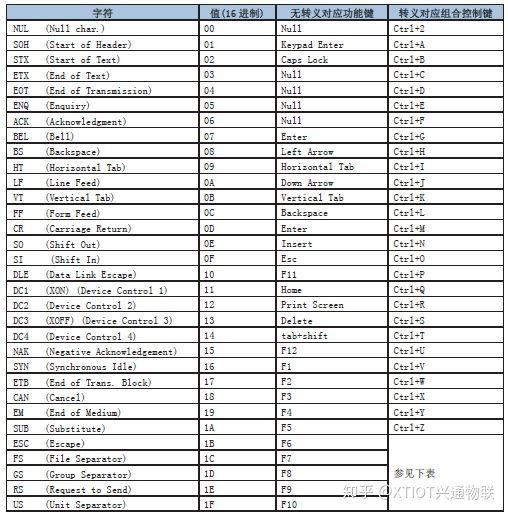
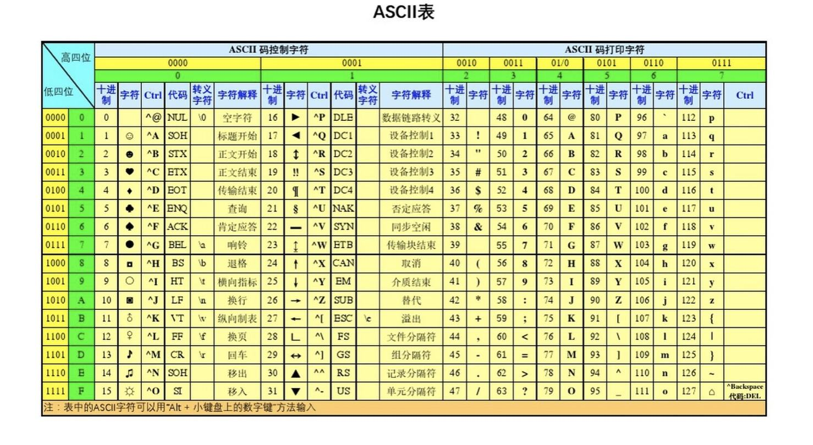

~~~
expect是什么？

expect是一个免费的编程工具，用来实现自动的交互式任务，而无需人为干预。说白了，expect就是一套用来实现自动交互功能的软件。

在实际工作中，我们运行命令、脚本或程序时，这些命令、脚本或程序都需要从终端输入某些继续运行的指令，而这些输入都需要人为的手工进行。而利用expect，则可以根据程序的提示，模拟标准输入提供给程序，从而实现自动化交互执行。这就是expect！！！

expect基础

在使用expect时，基本上都是和以下四个命令打交道：
命令 作用

send 用于向进程发送字符串
expect 从进程接收字符串
spawn 启动新的进程
interact 允许用户交互

而close是用来关闭与spawn_id对应的子进程的连接
所以wait说的专业一点是监视一个进程的终止。简单点就是负责给子进程收尸的。
send命令接收一个字符串参数，并将该参数发送到进程。

expect命令和send命令相反，expect通常用来等待一个进程的反馈，我们根据进程的反馈，再发送对应的交互命令。
spawn命令用来启动新的进程，spawn后的send和expect命令都是和使用spawn打开的进程进行交互。
interact命令用的其实不是很多，一般情况下使用spawn、send和expect命令就可以很好的完成我们的任务；但在一些特殊场合下还是需要使用interact命令的，interact命令主要用于退出自动化，进入人工交互。比如我们使用spawn、send和expect命令完成了ftp登陆主机，执行下载文件任务，但是我们希望在文件下载结束以后，仍然可以停留在ftp命令行状态，以便手动的执行后续命令，此时使用interact命令就可以很好的完成这个任务。


spawn               					交互程序开始后面跟命令或者指定程序
expect {匹配字符} {对应的操作}             获取匹配信息匹配成功则执行expect后面的程序动作
send exp_send       					用于发送指定的字符串信息
exp_continue        					在expect中多次匹配就需要用到
send_user           					用来打印输出 相当于shell中的echo
exit                					退出expect脚本
eof                 					expect执行结束 退出
set                 					定义变量
puts                					输出变量
set timeout         					设置超时时间


exp_internal [-f file] value
exp_open [args] [-i spawn_id]
exp_pid [-i spawn_id]
send_error
send_log
send_tty
send_user
exp_version [[-exit] version]
expect [[-opts] pat1 body1] ... [-opts] patn [bodyn]
expect {
    busy               {puts busy\n ; exp_continue}
    failed             abort
    "invalid password" abort
    timeout            abort
    connected
}


expect {
    "yes/no" {exp_send "yes\r";exp_continue}
    "*password" {exp_send "guoke123\r"}
}
expect "$user@*"  {send "$cmd\r"}

spawn picocom /dev/ttyUSB0 -b 115200
send_user


expect需要转义的字符串
1、   \ 需转义为 \\\
2、   } 需转义为 \}
3、   [ 需转义为 \[
4、   $ 需转义为 \\\$
5、    ` 需转义为 \`
6、    " 需转义为 \\\"


#!/usr/bin/expect
set ip [lindex $argv 0]
set user [lindex $argv 1]
set passwd [lindex $argv 2]
set cmd [lindex $argv 3]
if { $argc != 4 } {
puts "Usage: expect login.exp ip user passwd"
exit 1
}
set timeout 30
spawn ssh $user@$ip
expect {
    "(yes/no)" {send "yes\r"; exp_continue}
    "password:" {send "$passwd\r"}
}
expect "$user@*"  {send "$cmd\r"}
expect "$user@*"  {send "exit\r"}
expect eof


~~~

~~~
语言简介

        TCL是一种很通用的脚本语言，功能强大。最早称为“工具命令语言”"Tool Command Language"，但是目前已经不是这个含义，不过我们仍然称呼它TCL，发音为"tickle”。TCL经常被用于快速原型开发，脚本编程，GUI和测试等方面。

        实际上包含了两个部分：一个语言和一个库。首先，Tcl是一种简单的脚本语言，主要使用于发布命令给一些互交程序如文本编辑器、调试器和shell。它有一个简单的语法和很强可扩充性，Tcl可以创建新的过程以增强其内建命令的能力。其次，Tcl是一个库包，可以被嵌入应用程序，Tcl的库包含了一个分析器、用于执行内建命令的例程和可以使你扩充（定义新的过程）的库函数。应用程序可以产生Tcl命令并执行，命令可以由用户产生，也可以从用户接口的一个输入中读取（按钮或菜单等）。但Tcl库收到命令后将它分解并执行内建的命令，经常会产生递归的调用。

        Tcl数据类型简单。对Tcl来说，它要处理的数据只有一种——字符串。Tcl将变量值以字符串的形式进行存储，不关心它的实际使用类型。内嵌的Tk（toolkit）图形工具可以提供简单而又丰富的图形功能，让用户可以轻松的创建简单的图形界面。

        Tcl的执行是交互式的，Tcl提供了交互式命令界面，界面有两种：tclsh和wish。tclsh只支持Tcl命令，wish支持Tcl和Tk命令。通过交互界面，我们就可以象执行UNIX shell命令一样，逐条命令执行，并即时得到执行结果。

        Tcl/Tk可以提供跨平台的支持。Tcl语言可以运行于绝大多数当今流行的UNIX、WINDOWS和Macintosh等系统上，而且命令通用，只是启动的细节有些不同。
基本语法

        1、命令结构：commandName arguments。每条命令之间通过换行或者；隔开。例如：

        set foo 0

        set bar 1;

        2、注释：使用#注释，不过要注意的是下面的注释是错误的：

        set foo0 #这个是注释（错误）

        因为tcl解析器总是认为一条命令应该以换行或者分号结束，其他的在同一行中都认为是参数。所以正确的应该是：

        set foo 0;  #这个是注释

        其实对于习惯于编译型编程语言的人来说每行末尾加个;应该是理所当然的事情，所以这个对我们应该没有什么不习惯的。

        3、数据类型：tcl不支持其他语言中的形如int, double ,char等等类型，唯一支持的就是string类型。也就是说一个变量可以在不同的时刻理解为不同的类型。


        4、变量：tcl可以定义两种类型的变量，变量和数组。

        变量：在tcl变量不需要声明就可以直接赋值。给变量赋值的例子：

        set ba 1;

        set ma “qian lifeng”; #加引号的作用是为了告诉编译器包括空格

        取得变量的值可以在对应的变量名前面加$来取得，例如：

        puts $ba;  #表示打印出ba的值

        数组：数组也不需要声明，直接赋值，例如：

        set qian(0) 1;

        set qian(1) 2;

        一个比较有意思的地方是数组下标可以不按照顺序来写，也不一定是数字，可以是字符串。例如：

        set qian(123) f;

        set qian(6789)fs;

        set qian(good)yes;

        我们可以使用puts $qian(123); 的形式来获得数组的内容。当然tcl数组也支持多维数组，声明形式为：

        setqian(1,1,1,1,1) fs; #随便多少维

        如果我们要查看某个已经赋值的数组的信息，可以使用parray命令：如：

        parray qian;   #将打印出qian数组的所有信息


        5、字符串操作：string 命令基本语法如下（这里的string1，string2可以是字符串也可以是变量，option是下列选项之一）。

        stringoption string1 string2;

        option的操作选项：

        compare按照字典的排序方式进行比较。根据string1 <, =, >string2分别返回-1, 0, 1

        first返回string2中第一次出现string1的位置，如果没有出现string1则返回-1

        last和first相反

        trim从string1中删除开头和结尾的出现在string2中的字符

        tolower返回string1中的所有字符被转换为小写字符后的新字符串

        toupper返回string1中的所有字符串转换为大写后的字符串

        length返回string1的长度

        例子：

        string length$qian;  #将返回变量qian的长度


        6、数字操作：因为tcl中只有一个string类型的变量，所以当要操作数字进行运算的时候，tcl提供了incr和expr两个操作数。

        incr的基本用法为：

        incrvariable integer（variable必须为数字）

        例如我要将一个数字加3

        set a 3;

        incr a 3;  #将a加3，如果要减3，则为 incr a–3;

        默认的incr a等同于a++的意思，即本身自增1。

        expr的基本语法为：

        expr functionnumber

        expr是为了提供更加复杂的操作而设计的一个语法，比如运算乘除法等等。在执行算术操作的时候必须将expr命令放在算术操作之前。例如：

        set a 20; set b4;

        set c [expr$a/$b];  #此时的c的值为5

        除此之外，expr还能够识别一些函数及其返回值如下：

        abs(x) x的绝对值

        round(x) x舍入后得到的整数值

        sin(x) x的正弦

        …………………………………..

        举个例子：

        set a [exprsin(0.3)]; #计算0.3的正弦


        7、转义

        在tcl中可以使用{}将需要转义的字符串括起来。例如：

        set a 5;

        set b {$a};  #此时b的值为”$a“，而不是5。


        8、流控制

        if控制流，基本语法：

        if { 表达式 } {

            #运算;

        } else {

             #其他运算;

        }

        需要注意的是if….else, if……elseif…中的else，elseif必须要和if的后面一个{在同一行。

 

        switch控制流：基本语法：

        switch $x {

　　         数值1 { 操作1 ;}

        数值2 { 操作2 ;}

        }


        9、循环

        tcl提供三种循环命令，分别为：for，foreach，while。此外tcl还提供两个循环控制命令。注意：这个三个命令中的程序块的开始花括号必须要和三个命令同一行。

        1、while基本语法：while {条件} { 程序块 }

        2、foreach将在一组变元中进行循环，并且每次都将执行他的循环体。基本结构：　　foreachvariable {items} {block}

        这里的variable是变量的名字，便于block中使用。举例：

        foreach element{0 m n b v} {

                switch$element {

                # 判断element的值

             }

        }

        3、for是最常用的循环。其基本结构为：for{initialization} {condition} {increment} {body}

        例如：for {set i 0} {$i< 10} {incr i} {puts $i;}  #将打印出0到9
程序示例

# add a member function call "greet"
Class mom
mom instproc greet {} {
         $selfinstvar age_
         puts"$age_ year old mom say: How are you doing?"
}
 
# Create a child class of "mom" called"kid"
# and overide the member function "greet"
Class kid -superclass mom
kid instproc greet {} {
         $selfinstvar age_
         puts"$age_ year old kid say: What's up, dude?"
}
 
# Create a mom and a kid object, set each age
set a [new mom]
$a set age_ 45
set b [new kid]
$b set age_ 15
 
# Calling member function "greet" of eachobject
$a greet
$b greet


————————————————
版权声明：本文为CSDN博主「知行流浪」的原创文章，遵循CC 4.0 BY-SA版权协议，转载请附上原文出处链接及本声明。
原文链接：https://blog.csdn.net/zengxiantao1994/article/details/78136536


set  a   1	赋值a=1
incr a  1	a=a+1
incr  a	a=1

puts  $errorInfo   

	打印错误信息的位置

unset  a

	取消定义的变量a，如果a未定义会报错 
info exists a	判断变量是否已经定义，若存在返回1，否则0

info tclversion
	

返回tcl版本

info hostname

	返回主机名

append a 1
	若a=1，现在a=11
$$y	若y=1,则返回$1
subst $$y	

执行两次$
puts "Hello World"	打印Hello World
set  a  [expr $c*$c]	若c=2，将执行结果4，以表达式返回给a
————————————————
版权声明：本文为CSDN博主「jun_luo_yu」的原创文章，遵循CC 4.0 BY-SA版权协议，转载请附上原文出处链接及本声明。
原文链接：https://blog.csdn.net/qq_38863842/article/details/121316900
~~~
~~~


一、脚本、命令和单词符号

一个TCL脚本可以包含一个或多个命令。命令之间必须用换行符或分号隔开。
1、关键字/变量

变量是程序的基础
变量组成：变量名、变量值
变量名要求：任何字符串都可以作为变量名，区分大小写
变量值要求：任何字符串都可以作为变量值

⦁ 变量赋值基本语法：
set varname value;
e.g:
set x 10;
set text “Hello,World”
2、置换

TCL解释器在分析命令时，把所有的命令参数都当作字符串看待，例如

set x 10； #定义变量x,并把x的值赋为10

set y x+100；#定义变量y,y的值是x+100，而不是我们期望的110

  上例中的第二个命令中，x被看作字符串x+100的一部分，如果我们想使用x的值'10'，就必须告诉TCL解释器：我们在这里期望的是变量x的值，而非字符'x'。怎么告诉TCL解释器呢，这就要用到TCL语言中提供的置换功能。

TCL提供三种形式的置换：变量置换、命令置换和反斜杠置换。每种置换都会导致一个或多个单次本身被其他的值所代替。置换可以发生在包括命令名在内的每一个单词中，而且置换可以嵌套

set x 10
⦁ 变量置换

变量置换由一个$符号标记

set y $x+100;  #y的值为10+100，这里x被置换成它的值10；

⦁ 命令置换

命令置换是由[]括起来的TCL命令及其参数

set y [expr $x+100]; #y的值为110；

y的值是110，这里当TCL解释器遇到字符'['时，它就会把随后的expr作为一个命令名，从而激活与expr对应的C/C++过程，并把'expr'和变量置换后得到的'10+100'传递给该命令过程进行处理。

注意：[]中必须是一个合法的TCL脚本，长度不限。[]中脚本的值为最后一个命令的返回值，例如：

set y [expr $x+100;set b 300]; # y的值为300，因为set b 300的返回值为300

⦁ 反斜杠置换

set y \$x+100；#y的值为$x+100;

⦁ 释放变量：
unset x;
3.双引号和花括号

  TCL提供另外两种方法来使得解释器把分隔符和置换符等特殊字符当作普通字符，而不作特殊处理，这就要使用双引号和花括号（{}）.

TCL解释器对双引号中的各种分割符将不作处理，但是对于换行符以及$和[]两种置换符会照常处理。例如

set x 100

set y "$x ddd";  # y的值为100 ddd

而在花括号中，所有特殊字符都将成为普通字符，失去其特殊意义，TCL解释器不会对其作特殊处理。

set y {/n$x [expr 10 +100]}; #y的值为/n$x [expr 10 +100]
4.注释和输出

  TCL中的注释符是‘#’，‘#’和直到所在行尾的所有字符都被TCL看作注释，TCL解释器对注释将不作任何处理。

不过，需要注意的是，“#”必须出现在TCL解释器期望命令的第一个字符出现的地方，才被当作注释。例如：

set  a 100 # Not a commnet

上述命令不是一个注释，会报错

set a 100; # this is a comment

上述才是一个有效的注释

  第一个命令中“#”不被当作注释符，因为它出现在命令行的中间，TCL解释器把它和后面的字符当作命令参数处理，从而导致错误。而第二个命令中“#”就被当作注释，因为前一个命令已经使用了一个分号结束，TCL解释器期望下一个命令接着出现，现在这个位置出现“#”,随后的字符就被当作注释了。

puts ：输出文本，多个单词如被空格或TAB分隔需要使用“”或{} 括起来；多个命令写在一行使用 ; 间隔。

puts Hello              # 正确      

puts Hello,World ;  # 正确，多个单词之间不是被空格或者TAB分隔开

puts Hello World;   # 这行命令运行出错，被空格分隔

puts "Hello, World - In quotes" ;    # 注释

puts {Hello, World - In Braces} 

puts "This is line 1"; puts "this is line 2";    # 正确，用分号分隔两个命令

puts "Hello, World; - With  a semicolon inside the quotes" ;   #正确，分号在双引号内，作为字符串一部分
二、数据类型

tcl的数据类型实际上只有一种：字符串

在tcl中变量没有类型转换或者类型匹配的问题，所有的“数据”都是以字符串的形式存在，那么tcl如何进行数值计算？如何输出一个小数？

数值计算：

tcl支持各种数学函数的数值计算，但是仅能在expr命令中使用

e.g:

set angle 30;

set radian [expr $angle*3.1415926/180.0];

set value [expr sin($radian)];

value值为0.499999992265；

数据类型输出

在输出数据到文件或者屏幕时，format命令可以用于控制显示的格式确保它按要求输出。

e.g:

set vlaue1 [format %.1f $value];

value1的值为0.5；
三、数据结构-List

  List是tcl语言里功能给常强大非常灵活的应用最多一种数据结构之一，一个列表可以有任意多个元素，每一个元素都可以是任意的字符串，最简单的列表就是包含由任意个空格、制表符、换行符分隔开的任意多个元素的字符串。

e.g:

john anne mary jim;

创建一个列表

set x [list 1 2 3 4];

按指定分隔符将一个字符串拆分为列表

set string “1,2,3,4”;

set x [split $string “,”];

从列表中取出一个元素

set value1 [lindex $x 0];

set value2 [lindex $x 1];

set value3 [lindex $x 2];

set value4 [lindex $x 3];
四、数据结构-Array

  在Tcl中，除了简单变量，还提供了数组，数组是元素的几何，每一个元素都有自己的名称和值。数组由两部分组成，即数组名和数组中的元素名，数组名和元素名都可以是任意字符串，因此在使用过程中一定要注意区分空格、双引号等字符。

创建数组

set student(name) “张三”;

set student(age) 15;

set student(gender) “男”;

查询数组

array size student;查询数组student中的元素个数

array names student;查询数组student的元素名称

多维数组

set grade(jim,chinese,english) [list 98 99];

set grade(peter,chinese,english) [list 96 100];
 五、控制结构

  控制结构有很多种类，包括条件、循环、异常处理、底层的条件处理等。

常见控制语句
	

解释

if {expression} {body1} else {body2};

if {expression1} {body1} elseif {expression2} {body2}
	

条件执行语句，其中的else 或者else if并不是必须存在的

foreach value valuelist {body}
	

valuelist是一个链表数据，该命令将遍历valuelist中的每一个值，每遍历一次执行一边body

switch $var {a {body1};b {body2};c {body3}}
	

用一个值与很多模式比较，执行能匹配的那个模式所对应的body

for {init} {test} {reinit} {body}
	

将init作为初始量，将test作为表达式，如果为真则执行body，然后再讲reinit作为初始量重复执行该过程。

while {test} {body}
	

将test作为表达式处理，如果其值为真，则执行body，然后再处理test重复这个过程

return
	

结束一个函数返回value值

break
	

用于终止最内层的循环

continue
	

用于终止最内层循环的当前迭代步，进行该命令的下一个迭代步

catch {body}
	

命令异常处理，当没有异常是返回值为0，否则返回非0值
六、程序结构

source  :可以把一个外部的tcl文件在此处展开执行

global  :指定某些变量是全局可用的。在tcl中，主程序里的变量并不是全局可用的，必须在出程序或过程里用global声明后，才能在过程里引用。

proc  :说明一个子过程，后面接过程名、参数列表、执行体。需要注意的是，过程的参数列表应该和调用处的参数一致。但例外的是，如果过程的参数只写一个，它就可以以list的形式接收多个入口参数。

proc讲解：

1．  格式：proc name args body

2．  调用方法中参数可以用花括号或者双引号包含，也可以不包含

3．  在puts等命令中需要置换的话，需要使用方括号

例子：012_proc.tcl

proc sum {arg1 arg2} {

  set x [expr $arg1+$arg2];

  return $x                           ;#过程返回值

  }

puts " The sum of 2 + 3 is: [sum 2 3]\n\n"    ;#调用过程

#puts " The sum of 2 + 3 is: [sum {2 3}]\n\n"  ;#出错，提示找不到第二个参数,置换过程中第一个参数是{2 3}，所以找不到第二个参数

puts " The sum of 2 + 3 is: sum(2 3)\n\n"      ;#输出sum(2 3),因为没有方括号,根本没有进行置换

puts " The sum of 2 + 3 is: sum{2 3}\n\n"      ;#输出sum{2 3},因为没有方括号,根本没有进行置换

sum 2 3               ;#正确

sum {2} {3}           ;#正确

sum "2" "3"            ;#正确

过程PROC的参数定义

讲解：

1．  过程的参数赋缺省值：proc name {arg1 {arg2 value}}

2．  过程的不确定个数的参数定义：proc name {arg1 args}

proc example {first {second ""} args} {    ;#参数定义：赋缺省值和不确定个数参数定义

  if {$second == ""} {

    puts "There is only one argument and it is: $first";

    return 1;

    } else {

    if {$args == ""} {

      puts "There are two arguments - $first and $second";

      return 2;

      } else {

      puts "There are many arguments - $first and $second and $args";

      return "many";

      }

    }

  }

set count1 [example ONE]

set count2 [example ONE TWO]

set count3 [example ONE TWO THREE ]

set count4 [example ONE TWO THREE FOUR]

puts "The example was called with $count1, $count2, $count3, and $count4 Arguments"

~~~


~~~
#概述
expect是一个用来实现自动交互功能的软件套件，是基于TCL的脚本编程工具语言，方便学习，功能强大

#扩展TCL：全拼为Tool Command Language ，是一种脚本语言，由John Ousterout创建。TCL功能很强大，经常被用于快速原型开发，脚本编程，GUI和测试等方面

#使用背景
在执行系统命令或程序时，有些系统会以交互式的形式要求输出指定的字符串之后才能执行命令，如用户设置密码，一般都是需要手工输入2次密码，再如SSH登录的，如果没有做免密钥登录，第一次连接要和系统实现两次交互式输入

#安装
yum install expect

#自动交互工作流程
spawn启动指定进程--->expect获取期待的关键字-->send向指定进程发送指定字符-->进程执行完毕，退出结束
相关使用命令

#1.spawn命令
在expect自动交互程序执行的过程中，spawn命令是一开始就需要使用的命令。通过spawn执行一个命令或程序，之后所有的expect操作都会在这个执行过的命令或程序进程中进行，包括自动交互功能，因此如果没有spawn命令，expect程序将会无法实现自动交互
#语法
spawn [选项] [需要自动交互的命令或程序]

#示例
spawn ssh root@192.168.1.1 uptime
#在spawn命令的后面，直接加上要执行的命令或程序（例如这里的ssh命令）等，除此之外，spawn还支持如下一些选项
-open： 表示启动文件进程
-ignore：表示忽略某些信号
#提示：使用spawn命令expect程序实现自动 交互工作流程的第一步，也是最关键的一步

#2.expect命令
expect命令的作用就是获取spawn命令执行后的信息，看看是否和其事先指定的相匹配。一旦匹配上指定的内容就执行expect后面的动作，expect命令也有一些选项，相对用的较多的是-re，使用正则表达式的方式来匹配
#语法
expect 表达式 [动作]

#示例
spawn ssh root@192.168.1.1 uptime
expect "*password" {send *123456\r"}
#提示：上述命令不能直接在linux命令行中执行，需要放入expect脚本中执行

#示例
ssh远程登录机器执行命令，首次登录需要输入yes/no和输入密码

[root@game scripts]# cat ssh.exp 
#!/usr/bin/expect
​
spawn ssh root@192.168.228.137 "free -m"
expect {
    "yes/no" {exp_send "yes\r";exp_continue}
    "*password" {exp_send "guoke123\r"}
}
expect eof
#参数说明
exp_send和send类似。\r(回车)
匹配多个字符串的时候，需要在每次匹配并执行动作后，加上exp_continue

#3.send命令
即在expect命令匹配指定的字符串后，发送指定的字符串给系统，这些命令可以支持一些特殊转义符号，例如：\r表示回车、\n表示换行、\t表示制表符等

#参数
-i： 指定spawn_id,用来向不同的spawn_id进程发送命令，是进行多程序控制的参数
-s： s代表slowly，即控制发送的速度，使用的时候要与expect中的标量send slow相关联

#4.exp_continue命令
作用是让expect程序继续匹配的意思 #如

expect {
    "yes/no" {exp_send "yes\r";exp_continue}
    "*password" {exp_send "guoke123\r"}
}

#因为后面还有匹配的字符，所以需要加上exp_continue，否则expect将不会自动输入指定的字符串，最后一个就不需要加上exp_continue了

#5.send_user命令
send_user命令可用来打印expect脚本信息，类似shell里的echo命令
#用法

[root@game scripts]# cat send_user.exp 
#!/usr/bin/expect
​
send_user "guoke\n"
send_user "youtiao.\t" #tab键，没有换行
send_user "what hao\n"
​
#效果
[root@game scripts]# expect send_user.exp 
guoke
youtiao.    what hao

#6.exit命令
exit命令的功能类似于shell中的exit，即直接退出expect脚本，除了最基本的退出脚本功能之外，还可以利用这个命令对脚本做一些关闭前的清理和提示等工作
expect程序变量

#1.普通变量
expect中的变量定义，使用方法与TCL语言中的变量基本相同

#语法
set 变量名 变量值

#示例
set user "guoke"

#打印变量语法
puts $变量名

#例子

[root@game scripts]# cat test1.exp 
#!/usr/bin/expect
set password "guoke123"
puts $password
​
#效果
[root@game scripts]# expect test1.exp 
guoke123

#2.特殊变量
在expect里也有与shell脚本里的$0、$！、$#等类似的特殊参数变量，用于接收及控制expect脚本传参

在expect中$argv表示参数数组，可以使用[lindex $argv n]接收expect脚本传参，n从0开始，分别表示第一个[lindex $argv 0]参数、第二个[lindex $argv 1]参数、第三个[lindex $argv 2]参数.....

[root@game scripts]# cat test2.exp 
#!/usr/bin/expect

set file [lindex $argv 0]
set id [lindex $argv 1]
set host [lindex $argv 2]
puts "$file\t$id\t$host\n"
send_user "$file\t$id\t$host\n"

#效果
[root@game scripts]# expect test2.exp test.log 1 192.168.1.1
test.log    1   192.168.1.1
test.log    1   192.168.1.1

#扩展
除了基本的位置参数外，expect也支持其他的特殊参数，例如：$argc表示传参的个数，$argv0表示脚本的名字。

#示例

[root@game scripts]# cat test2.exp 
#!/usr/bin/expect

set file [lindex $argv 0]
set id [lindex $argv 1]
set host [lindex $argv 2]
puts "$file\t$id\t$host\n"
puts $argc
puts $argv0

#效果
[root@game scripts]# expect test2.exp test.log 1 192.168.1.1
test.log 1 192.168.1.1
3 #传参的总数
test2.exp #脚本的名字

expect中的if条件语句

#语法

if {条件表达式} {
    指令
}

或
if {条件表达式} {
    指令
} else {
    指令
}

#提示：if关键字后面要有空格，else关键字前后都要有空格，{条件表达式}大括号里面靠近大括号出可以没有空格，将指令括起来的起始大括号”{“ 前要有空格

#示例1
#使用if语句判断脚本传参的个数，如果不符合则给予提示

[root@game scripts]# cat test3.exp 
#!/usr/bin/expect
​
if { $argc != 3 } {
    send_user "usage：expect $argv0 file id host\n"
    exit
}
​
set file [lindex $argv 0]
set id [lindex $srgv 1]
set host [lindex $argv 2]
puts "$file\t$id\t$host\n"
​
#效果
[root@game scripts]# expect test3.exp 
usage：expect test3.exp file id host

#示例2 #使用if语句判断脚本传参的个数，不管是否符合都给予提示

[root@game scripts]# cat test4.exp 
#!/usr/bin/expect
if {$argc != 10} {
    send_user "bey.\n"
} else {
    send_user "ok\n"
}

#效果
[root@game scripts]# expect test4.exp 
bey.

expect中的关键字

#介绍
expect中的特特殊关键字用于匹配过程，代表某些特殊的含义或状态，一般只用于expect命令中而不能在expect命令单独使用

#1.eof关键字
eof（end-of-file文件结尾）关键字用于匹配结束符
#示例

[root@game scripts]# cat ssh.exp 
#!/usr/bin/expect
​
spawn ssh root@192.168.228.137 "free -m"
expect {
    "yes/no" {exp_send "yes\r";exp_continue}
    "*password" {exp_send "guoke123\r"}
}
expect eof

#2.timeout关键字
timeout是expect中的一个控制时间的关键字变量，它是一个全局性的时间控制开关，可以通过为这个变量赋值来规定整个expect操作的时间，注意这个变量是服务于expect全局的，而不是某一条命令，即使命令没有任何错误，到了时间仍然会激活这个变量，此外，到时间后还会激活一个处理及提示信息开关，
#示例

[root@game scripts]# cat ssh.exp 
#!/usr/bin/expect

spawn ssh root@192.168.228.137 "free -m"
expect {
 -timeout 3
    "yes/no" {exp_send "yes\r";exp_continue}
    "*password" {exp_send "guoke123\r"}
 timeout {puts "request timeout;return"}
}
#效果
[root@game scripts]# expect ssh.exp 
spawn ssh root@192.168.228.137 free -m
request timeout #当时间超过3秒就会打印超时退出

#应用例子
1.复制文件

[root@game scripts]# cat scp.exp 
#!/usr/bin/expect

set src_file [lindex $argv 0]
set dst_file [lindex $argv 1]
set host [lindex $argv 2]
set username [lindex $arv 3]
set password [lindex $arv 4]

spawn scp $src_file $username@$host:$dst_file
expect {
    -timeout 15
    "yes/no" {exp_send "yes\r";exp_continue}
    "*password" {exp_send "guoke123\r"}
    timeout {puts "request timeout";return}
}
expect eof

#效果
[root@game scripts]# expect scp.exp test.txt test.txt 192.168.228.137 root guoke123
spawn scp test.txt root@192.168.228.137:test.txt
root@192.168.228.137's password: 
test.txt                             100%    3     3.4KB/s   00:00   

#到目标主机上查看
[root@zabbix ~]# ls -l test.txt 
-rw-r--r-- 1 root root 3 Aug 20 05:32 test.txt

发布于 2020-08-21 10:39


~~~

~~~
Expect实现SSH免交互执行命令

Expect是一个自动交互式应用程序的工具，如telnet，ftp，passwd等。需先安装expect软件包。

方法1：EOF标准输出作为expect标准输入

#!/bin/bash
USER=root
PASS=123.com
IP=192.168.1.120
expect << EOF
set timeout 30
spawn ssh $USER@$IP   
expect {
    "(yes/no)" {send "yes\r"; exp_continue}
    "password:" {send "$PASS\r"}
}
expect "$USER@*"  {send "$1\r"}
expect "$USER@*"  {send "exit\r"}
expect eof
EOF

方法2：

#!/bin/bash
USER=root
PASS=123.com
IP=192.168.1.120
expect -c "
    spawn ssh $USER@$IP
    expect {
        \"(yes/no)\" {send \"yes\r\"; exp_continue}
        \"password:\" {send \"$PASS\r\"; exp_continue}
        \"$USER@*\" {send \"df -h\r exit\r\"; exp_continue}
    }"
    
方法3：将expect脚本独立出来

登录脚本：

# cat login.exp
#!/usr/bin/expect
set ip [lindex $argv 0]
set user [lindex $argv 1]
set passwd [lindex $argv 2]
set cmd [lindex $argv 3]
if { $argc != 4 } {
puts "Usage: expect login.exp ip user passwd"
exit 1
}
set timeout 30
spawn ssh $user@$ip
expect {
    "(yes/no)" {send "yes\r"; exp_continue}
    "password:" {send "$passwd\r"}
}
expect "$user@*"  {send "$cmd\r"}
expect "$user@*"  {send "exit\r"}
expect eof

执行命令脚本：写个循环可以批量操作多台服务器

#!/bin/bash
HOST_INFO=user_info.txt
for ip in $(awk '{print $1}' $HOST_INFO)
do
    user=$(awk -v I="$ip" 'I==$1{print $2}' $HOST_INFO)
    pass=$(awk -v I="$ip" 'I==$1{print $3}' $HOST_INFO)
    expect login.exp $ip $user $pass $1
done

Linux主机SSH连接信息：

# cat user_info.txt
192.168.1.120 root 123456


~~~






```python

#!/usr/bin/env python3
import pexpect
import sys
def main(server):
    command = 'ssh %s %s@%s' % (server['ssh_conf'], server['username'], server['hostname'])
    process = pexpect.spawn(command, timeout=30)
    print(f'cmd: {command}')
    expect_list = ['yes/no', 'password:', '\$', '#', pexpect.EOF, pexpect.TIMEOUT]
    index = process.expect(expect_list)
    print(f'match: {index} => {expect_list[index]}')
    if index == 0: 
        process.sendline("yes")
        expect_list = [
            'password:',
            pexpect.EOF,
            pexpect.TIMEOUT,
        ]
        index = process.expect(expect_list)
        print(f'match: {index} => {expect_list[index]}')
        if index == 0:
            process.sendline(server['password'])
            process.interact()
        else:
            print('EOF or TIMEOUT')
    elif index == 1:
        process.sendline(server['password'])
        process.interact()
    elif index == 2:
        process.interact()
    elif index == 3:
        process.interact()
    else:
        print('EOF or TIMEOUT')


if __name__ == '__main__':

    if len(sys.argv) < 4:
        print("Usage: expect ssh.exp host user password ssh_conf")
        exit(1)

    server = {
        'hostname': sys.argv[1],
        'username': sys.argv[2],
        'password': sys.argv[3],
        'ssh_conf': sys.argv[4],
    }
    print(server)
    main(server)
```


