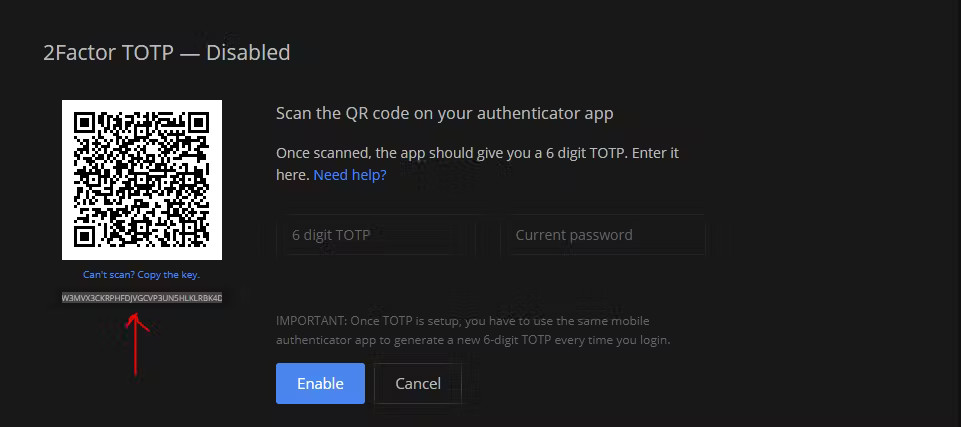
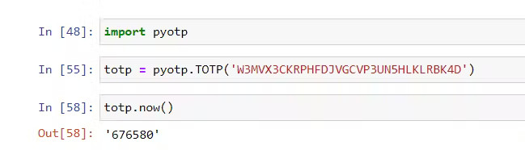

github强制要求用户使用2FA认证，其实就是 totp 一次性密码验证。该验证属于时间加密认证，属于验证码登陆一类的。
虽然官方号称该验证可以阻挡帐户在密码泄露的情况下阻挡黑客的登陆，但是发现该密码算法完全可以通过程序计算出来，所以这真的有用吗？

PyOTP简介  
https://github.com/pyauth/pyotp  
用于验证otp密码  

```python
import pyotp

totp = pyotp.TOTP('ABCD')
totp.now()

```
幕后发生的事情是,我们在pyotp模块中为TOTP函数提供了一个名为ABCD的密钥,并使用.now()函数立即生成有效的 TOTP。如果您在 30 秒后尝试此操作,TOTP 将自动更改;试试看。

Zerodha 2FA 注册将为您提供此密钥,您可以将其提供给函数并使用.now()函数获取当时的 TOTP。使困惑?继续下一部分。



现在,继续使用 Google Authenticator App 扫描此二维码,然后,让我们尝试将此密钥放入我们上面编写的代码中。




