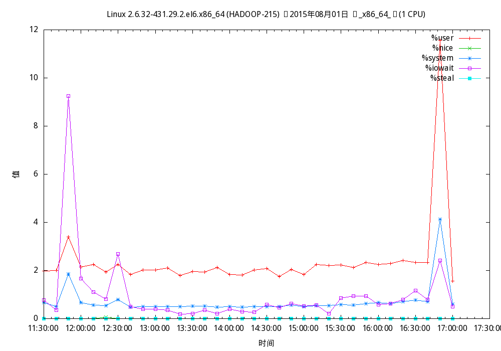

 

- 1 设置输出
  - [1.1 输出格式](https://www.annhe.net/article-3446.html#i-2)
  - [1.2 输出文件](https://www.annhe.net/article-3446.html#i-3)
- 2 常用绘图设置
  - [2.1 坐标范围](https://www.annhe.net/article-3446.html#i-5)
  - [2.2 坐标名称](https://www.annhe.net/article-3446.html#i-6)
  - [2.3 标题](https://www.annhe.net/article-3446.html#i-7)
  - [2.4 曲线标题](https://www.annhe.net/article-3446.html#i-8)
  - [2.5 同时绘制多个函数](https://www.annhe.net/article-3446.html#i-9)
  - [2.6 网格](https://www.annhe.net/article-3446.html#i-10)
- [3 变量](https://www.annhe.net/article-3446.html#i-11)
- [4 函数](https://www.annhe.net/article-3446.html#i-12)
- [5 文件绘图](https://www.annhe.net/article-3446.html#i-13)
- 6 常用命令
  - [6.1 命令简写](https://www.annhe.net/article-3446.html#i-15)
- [7 脚本功能](https://www.annhe.net/article-3446.html#i-16)
- [8 实例](https://www.annhe.net/article-3446.html#i-17)
- [9 参考资料](https://www.annhe.net/article-3446.html#i-18)


## 设置输出

### 输出格式

~~~
gnuplot> help term
 Gnuplot supports a large number of output formats. These are selected by
 choosing an appropriate terminal type, possibly with additional modifying
 options. See `set terminal`.
~~~

some formats

~~~~
gnuplot> set term
 
Available terminal types:
             aifm  Adobe Illustrator 3.0 Format
             dumb  ascii art for anything that prints text
         epslatex  LaTeX picture environment using graphicx package
              gif  GIF images using libgd and TrueType fonts
             jpeg  JPEG images using libgd and TrueType fonts
            latex  LaTeX picture environment
               mf  Metafont plotting standard
               mp  MetaPost plotting standard
              png  PNG images using libgd and TrueType fonts
       postscript  PostScript graphics, including EPSF embedded files (*.eps)
          pslatex  LaTeX picture environment with PostScript \specials
              svg  W3C Scalable Vector Graphics driver
             tgif  TGIF X11 [mode] [x,y] [dashed] ["font" [fontsize]]
              x11  X11 Window System
          ... 部分略
~~~~

ascii输出

~~~

gnuplot> set term dumb
Terminal type set to 'dumb'
Options are 'feed  79 24'
gnuplot> plot sin(x)
 
 
      1 ++---------------***--------------+---***----------+--------**-----++
        +               *+ *              +   *  *         +  sin(x) ****** +
    0.8 ++              *   *                *    *               *    *   ++
        |              *     *               *    *               *    *    |
    0.6 ++             *     *              *      *              *     *  ++
        *             *       *             *      *             *       *  |
    0.4 +*            *       *             *      *             *       * ++
        |*            *        *           *        *           *        *  |
    0.2 +*            *        *           *        *           *        * ++
        | *          *         *          *          *          *         * |
      0 ++*          *         *          *          *          *         *++
        |  *        *           *         *          *         *           *|
   -0.2 ++ *        *           *         *          *         *           *+
        |  *        *            *       *            *       *            *|
   -0.4 ++ *        *            *       *            *       *            *+
        |   *      *             *      *              *      *             *
   -0.6 ++  *     *              *      *              *      *            ++
        |    *    *               *     *              *     *              |
   -0.8 ++   *    *                *   *                *   *              ++
        +    **  *       +         *  *   +              * +*               +
     -1 ++-----**--------+----------***---+--------------***---------------++
       -10              -5                0                5                10
~~~


输出文件

    输出文件 set output 'filename'
    大小 set size m,n，m,n为放大、缩小的倍数（相对于当前大小）

~~~
	
gnuplot> set t png
Terminal type set to 'png'
Could not find/open font when opening font "arial", using internal non-scalable font
Options are 'nocrop medium '
gnuplot> set output 'test.png'
gnuplot> set size 2,2
gnuplot> plot sin(x) title 'sin',cos(x) title 'cos'
gnuplot> 
~~~

## 常用绘图设置

### 坐标范围

- 改变坐标范围 `set xrange[min:max]`，`set yrange[min:max]`
- 只在本次绘图中有效 `plot [xmin:xmax] [ymin:ymax] f(x)`
- gnuplot自动设置 `set autoscale`
- 可以只设置x或者只设置y的范围
- 可以只设置范围上限或者下限 `set xrange[min:]`

### 坐标名称

- 设置名称 `set xlabel 'xlabel'`，`set ylabel 'ylabel'`
- 取消名称 `unset xlabel`，`unset ylabel`

### 标题

- 标题 `set title 'title'`
- 标题 `unset title`

### 曲线标题

- 曲线标题 `plot f(x) title 'title'`
- 放置位置 `set key x,y` ；x,y为坐标
- 重置为默认位置 `set key default`
- 不显示曲线标题 `unset key`
- 曲线标题框 `set key box`

### 同时绘制多个函数

- 用逗号分隔函数：`plot f1(x),f2(x),f3(x)...fn(x)`

### 网格

- 添加 `set grid`
- 取消 `unset grid`

~~~
gnuplot> set title 'test gnuplot'
gnuplot> set xlabel 'x label'
gnuplot> set ylabel 'y label'
gnuplot> set xrange[-5:5]
gnuplot> set yrange[-1:1]
gnuplot> plot sin(x)
 
                                    test gnuplot
  y label
      1 *****--+------------+-------------+--------*****+------------+-----++
        |    * +            +             +      **    **     sin(x) ****** |
        |     **                                **       *                  |
        |       *                              *          **                |
    0.5 ++      **                            *             *              ++
        |         *                          *              *               |
        |         *                         *                *              |
        |          *                        *                 *             |
        |           *                      *                  **            |
      0 ++          *                     *                     *          ++
        |            **                  *                      *           |
        |             *                 *                        *          |
        |              *                *                         *         |
   -0.5 ++              *              *                          *        ++
        |               *             *                            **       |
        |                **          *                              *       |
        |                  *       **                                **     |
        |      +            **    **      +             +            + *    |
     -1 ++-----+------------+*****--------+-------------+------------+--*****
              -4           -2             0             2            4
                                       x label
~~~

~~~
gnuplot> set key box
gnuplot> set grid
gnuplot> plot sin(x) title 'sin',cos(x) title 'cos'
 
                                    test gnuplot
  y label
      1 *****--+------------+-----------#####------*****+------------+-----++
        |    * +            +         ### + ###  **    **        sin-******+|
        |     **            :        ##   :   ##**      :*       cos ######||
        |      :*           :       #     :    *#       : **     +---------+|
    0.5 ++......**.................#..........*..#..........*..............++
        |      :  *         :     ##      :  *   ##     :   *        :      |
        #      :  *         :    #        : *      #    :    *       :      #
        |#     :   *        :    #        : *      #    :     *      :     #|
        |#     :    *       :   #         :*        #   :     **     :     #|
      0 ++#.........*..........#..........*..........#..........*.........#++
        |  #   :     **     :  #         *:          #  :       *    :   #  |
        |  #   :      *     : #         * :           # :        *   :   #  |
        |   #  :       *    :#          * :            #:         *  :  #   |
   -0.5 ++...#..........*...#..........*................#.........*....#...++
        |     #:        *  #:         *   :             :#         **:#     |
        |      #         **#:        *    :             :##         *#      |
        |      :#        # *:      **     :             :  #        #**     |
        |      + ##    ##   **    **      +             +   ##    ## + *    |
     -1 ++-----+---####-----+*****--------+-------------+-----####---+--*****
              -4           -2             0             2            4
                                       x label
~~~

## 变量

- 变量名不区分大小写
- 变量赋值后即存在
- `show variables`简写为`sh v`

~~~

gnuplot> a=1
gnuplot> b=2
gnuplot> sh v
 
 
    User and default variables:
    pi = 3.14159265358979
    NaN = NaN
    GNUTERM = "x11"
    a = 1
    b = 2
~~~

## 函数

- 内置函数，如`sin(x),cos(x),log(x)`等
- 自定义函数，如`f(x)=x*x; plot f(x)`
- `show function`查看用户定义函数

~~~
gnuplot> sh fu
 
    User-Defined Functions:
    ln is undefined
    f(x)=x*x
~~~

## 文件绘图

数据文件`data`内容如下：

~~~
	
10  0.781  0.73  0.963
20  0.281  0.827  0.93
30  0.281  0.257  0.63
40  0.731  0.7  0.3
50  0.481  0.87  0.6
60  0.681  0.57  0.12
~~~

- `plot 'data'`将自动使用第一、二列数据作为x，y坐标绘图
- `plot 'data' with lines` 将点连起来
- `plot 'data' with linespoint` 将各点连起来并用符号标记点
- `plot 'data' using 1:3 with linespoint` 指定用1、3列作为x、y坐标
- `plot 'data' using 1:($3/3)` 、`plot 'data' using 1:($3+$4)`，分别表示以第三列的3分之一、第三列和第四列的和作为y坐标
- `plot 'data' using 1:(sin($3))` 对某一列使用函数

~~~
gnuplot> plot 'data' with lines
 
 
    0.8 ++------------+------------+-------------+------------+------------++
        *             +            +             +            'data' ****** +
        |*                                       ***                        |
    0.7 ++*                                     *   *                      ++
        |  *                                   *     **                    **
        |   *                                 *        *                 ** |
        |   *                                *          *              **   |
    0.6 ++   *                              *            **          **    ++
        |     *                            *               *       **       |
        |      *                          *                 **   **         |
    0.5 ++      *                         *                    **          ++
        |        *                       *                    *             |
        |         *                     *                                   |
    0.4 ++         *                   *                                   ++
        |          *                  *                                     |
        |           *                *                                      |
        |            *              *                                       |
    0.3 ++            **************                                       ++
        |                                                                   |
        +             +            +             +            +             +
    0.2 ++------------+------------+-------------+------------+------------++
        10            20           30            40           50            60
 
gnuplot> plot 'data' using 1:3 with linespoint
 
 
    0.9 ++------------+------------+-------------+------------+------------++
        +             +            +             +  'data' using 1:3 **A*** +
        |           **A                                    **    **         |
    0.8 ++     *****   *                                ***        **      ++
        |  ****         *                            ***             *      |
        A**             *                          **                 **    |
    0.7 ++               *                       A*                     ** ++
        |                 *                     *                         **|
        |                  *                   *                            |
    0.6 ++                  *                **                            +A
        |                    *              *                               |
    0.5 ++                   *             *                               ++
        |                     *           *                                 |
        |                      *         *                                  |
    0.4 ++                      *       *                                  ++
        |                        *    **                                    |
        |                        *   *                                      |
    0.3 ++                        * *                                      ++
        |                          A                                        |
        +             +            +             +            +             +
    0.2 ++------------+------------+-------------+------------+------------++
        10            20           30            40           50            60
    
gnuplot> plot 'data' using 1:($3+$4) with linespoint
 
 
    1.8 ++------------+------------+-------------+------------+------------++
        +      *******A            +          'data' using 1:($3+$4) **A*** +
        A******        *                                                    |
    1.6 ++              *                                                  ++
        |                *                                                  |
        |                 *                                   A             |
        |                  *                                ** *            |
    1.4 ++                  *                             **    *          ++
        |                    *                           *       *          |
        |                    *                         **         *         |
    1.2 ++                    *                       *            *       ++
        |                      *                    **              *       |
        |                       *                 **                 *      |
      1 ++                       *            ***A                    *    ++
        |                         *    *******                         *    |
        |                          A***                                 *   |
        |                                                                *  |
    0.8 ++                                                                *++
        |                                                                  *|
        +             +            +             +            +             A
    0.6 ++------------+------------+-------------+------------+------------++
        10            20           30            40           50            60

~~~

## 常用命令

~~~
pwd  （present working directory）当前工作目录

cd  '< directory >'（come directory）到某个目录，<directory>是想要到的目录名，如gnuplot>cd '/root/gnuplot'

clear 清空输出的图像

exit和quit 退出gnuplot，也可简写为q

pause <seconds>暂停一段时间，<seconds>为时间，单位为秒

print <var> 其中<var>为变量名，例如gnuplot>a=1 gnuplot> print a1 输出a的值
也可输出字符串

gnuplot> print 'hello'hello  输出字符串hello
也可以用双引号代替单引号，有何区别？在上面的例子中输出是完全一样的，但下面的例子将显示其区别
gnuplot> print 'hello\neveryone'hello\neveryone
gnuplot> print “hello\neveryone”helloeveryone

即单引号屏蔽转义符号 '\'，而双引号则不会，它将 \n 看成换行，另外还有 \t 表示制表符。
help 获得帮助 ，如 help term可以看到关于terminal的帮助
~~~

### 命令简写

~~~bash
命令plot 'file.dat' with lines
可简写为plot 'file.dat' with  l
进一步简写为plot 'file.dat' w  l

同理：
命令plot 'file.dat' with linespoints
简写为plot 'file.dat' w  lp

set terminal简写set term，
进一步可简写为set ter、se  t

set output 简写 set out，进一步可简写为se o

show 简写为 sh

show variables简写为 sh v
~~~

脚本功能

- 注释，使用 "#"
- 很长的行可以用 `\\`断行写
- `call 'script'`在gnuplot环境下调用画图脚本
- `gnuplot script`在shell下直接执行画图脚本

## 实例

用gnuplot画sar数据。 需要注意的是 `set timefmt`指定的是读取数据文件的格式，而 `set format x`指定的是x轴显示的格式。如果不指定`set format`，类似`00:10:01`这样的数据会默认显示成`10:00`[2]。

~~~bash
#!/bin/bash
 
#-----------------------------------------------------------
# Usage: gnuplot sar
# $Id: sar.sh  i@annhe.net  2015-08-01 15:26:33 $
#-----------------------------------------------------------
 
log_dir="/var/log/sa"
font="/usr/share/fonts/wqy-microhei/wqy-microhei.ttc"
 
for id in `ls $log_dir`;do
    data_plot="/tmp/plot-data-$id.dat"
    script_plot="/tmp/plot-script-$id.ptl"
    file="$log_dir/$id"
    sar -f $file > $data_plot
    sed -E -i 's/时|分/:/g' $data_plot
    sed -i 's/秒//g' $data_plot
    title=`head -n 1 $data_plot`
    sed -i '1,3d;$d' $data_plot
    sed -i 's/^00:/0:/g' $data_plot
    sed -i 's/:0/:/g' $data_plot
    cat >$script_plot<<EOF
set term png size 1000,700 font '$font'
set output '$id.png'
set title '$title'
set xdata time
set timefmt "%H:%M:%S"
set format x "%H:%M:%S"
set xlabel '时间'
set ylabel '值'
plot '$data_plot' using 1:3 with linespoint title '%user',\\
    '$data_plot' using 1:4 with linespoint title '%nice',\\
    '$data_plot' using 1:5 with linespoint title '%system',\\
    '$data_plot' using 1:6 with linespoint title '%iowait',\\
    '$data_plot' using 1:7 with linespoint title '%steal',\\
    '$data_plot' using 1:8 with linespoint title '%idle'
EOF
 
gnuplot $script_plot
done
~~~

效果图



[1]. [gnuplot简单使用](http://wenku.baidu.com/link?url=5IvipYyAzoQWlaNEBw3U1FrO3nx8d4pCcvMhdIFTGEZ4M2zz3hQKNuXvRRIpWiNIyqg6vgz0kUEOP2ZbjWjQ-Xwej_8euQ_VLHixt4qle6a)
[2]. [gnuplot doesn't follow given timefmt](http://stackoverflow.com/questions/27198295/gnuplot-doesnt-follow-given-timefmt)


https://www.cnblogs.com/zhangjing327/p/3524106.html

基础教程


http://www.gnuplot.info/docs_4.2/gnuplot.html#x1-5300013.1


若要在gnuplot中非交互方式执行脚本，可以使用以下命令：

```bash
gnuplot -p -e "load 'script.gp'"
```

其中，`-p` 参数表示绘图结束后保持gnuplot会话打开，而 `-e` 参数用于指定要执行的命令或脚本。在这里，我们使用 `load 'script.gp'` 命令加载并执行名为 `script.gp` 的脚本文件。

这样，gnuplot 将执行脚本文件中的命令，并在完成后保持会话打开，以便进一步交互或进行其他操作。


要在gnuplot中画平滑曲线，可以使用`smooth`选项来应用平滑算法。以下是一个简单的示例：

```gnuplot
# 创建示例数据
set print "data.txt"
do for [i=0:10] {
  x = i
  y = sin(x)
  print x, y
}
set print

# 绘制平滑曲线
set title "Smooth Curve"
set xlabel "X"
set ylabel "Y"
plot "data.txt" with lines smooth csplines
```

在上面的示例中，首先我们创建了一个名为"data.txt"的文件，其中包含了一些示例数据。然后，在绘图部分，我们设置了标题、X轴和Y轴的标签，最后使用`plot`命令绘制曲线。通过`with lines`选项指定使用线条来连接数据点，并使用`smooth csplines`选项应用样条插值算法来平滑曲线。

你可以根据需要修改数据的生成方式和绘图设置来适应你的需求。同时，gnuplot还支持其他平滑算法，如`smooth bezier`和`smooth unique`，你可以根据需要选择适合的算法来获得想要的平滑曲线效果。


要在gnuplot脚本中将图像直接输出为PNG图片，你可以使用以下方法：

1. 设置输出格式和输出文件：
   在gnuplot脚本中使用`set terminal`命令来指定输出格式为PNG，并使用`set output`命令来指定输出文件的名称。例如：
   ```
   set terminal pngcairo
   set output 'output.png'
   ```

2. 绘制图形：
   在脚本中使用`plot`命令绘制图形，可以包括多条曲线、数据集等。

3. 保存并退出：
   在绘制完成后，使用`unset output`命令来关闭输出文件，然后退出gnuplot。例如：
   ```
   unset output
   quit
   ```

完整的示例脚本如下所示：

```gnuplot
# 设置输出格式和输出文件
set terminal pngcairo
set output 'output.png'

# 绘制图形
plot sin(x) with lines

# 保存并退出
unset output
quit
```

在运行该脚本时，gnuplot将会直接将图形输出为PNG图片，并将其保存为指定的文件名（此处为`output.png`）。

请确保你的系统中已经安装了相应的gnuplot绘图软件包，并且你的脚本中的命令语法正确无误。