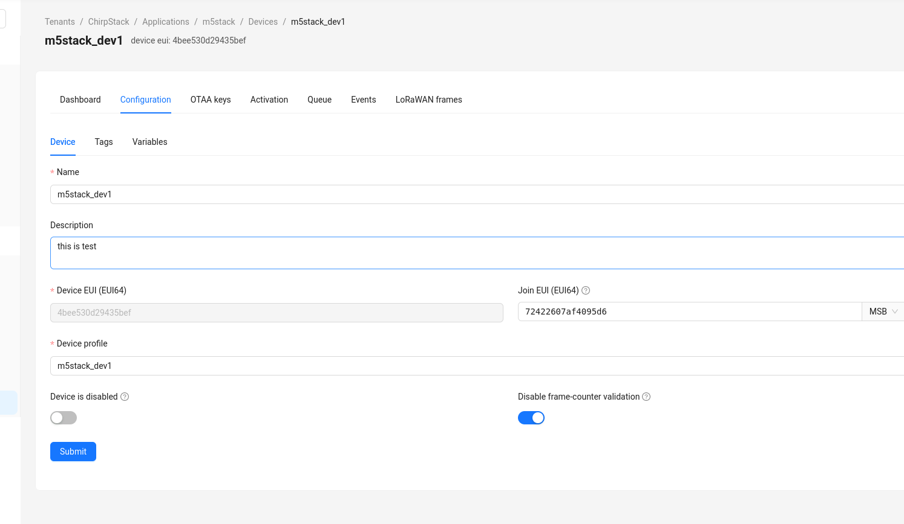

# lora_wan 服务搭建记录

## 目录
- LoRa

- LoRaWAN

- sx1303

- packet_forwarder

- chirpstack


## LoRa

LoRa 是一种长距离、低功耗的物联网 (IoT) 无线平台,一般情况下泛指使用LoRa技术的射频芯片.主要特点如下：

- LoRa（long range 的缩写）采用的扩频调制技术源于啁啾扩频 (CSS)  技术,是远距离无线传输技术和LPWAN通信技术中的一种.扩频技术用带宽换取灵敏度的技术,Wi-Fi,ZigBee等都使用了扩频技术,但LoRa调制的特点是接近香农定理的极限,最大效率地提高灵敏度.相比于传统FSK技术,在相同的通信速率下,LoRa比FSK灵敏度好8~12dBm.目前,LoRa 主要在Sub-GHz的ISM频段运行,
- LoRa技术融合了数字扩频、数字信号处理和前向纠错编码等技术使得在长距离通信性能层面大幅度提高,LoRa的链路预算优于其他任何标准化的通信技术,链路预算是指给定的环境中决定距离的主要因素.
- LoRa射频芯片主要有 SX127X系列，SX126X系列，SX130X系列，其中SX127X，SX126X系列用于LoRa节点，SX130X用于LoRa网关

## LoRaWAN

- [LoRaWAN](https://lora-alliance.org/about-lorawan/) 是一种建立在 LoRa  无线电调制技术之上的低功耗广域网开放协议。旨在将电池供电的“事物”无线连接到区域、国家或全球网络中的互联网，并针对关键的物联网 (IoT)  要求，例如双向定向通信、端到端安全、移动性和本地化服务。其中节点无线连接到互联网有入网认证，相当于建立节点和服务器间的加密通信信道，LoRaWAN协议层次下图所示。

  - MAC层中的Class A/B/C 三类节点设备基本覆盖了物联网所有的应用场景，三者之间不同点在于节点收发的时隙不同
  - 
  - - Modulation层中EU868，AS430等表明不同国家使用频段参数不同，地区参数请点击参考[链接](https://lora-alliance.org/wp-content/uploads/2019/11/rp_2-1.0.0_final_release.pdf)

  [](https://www.waveshare.net/wiki/文件:SX1262-LoRa-HAT-021.png)

- 实现LoRaWAN网络覆盖城市或其它区域需要由节点（LoRa节点射频芯片）、网关（或称基站,LoRa网关射频芯片）、Server和云四部分组成，如下图所示
  - DEVICE（节点设备）需先发起入网请求数据包到GATEWAY（网关）再到服务器，认证通过后才可以正常和服务器收发应用数据
  - GATEWAY（网关）可通过有线网络，3/4/5G无线网络与服务器进行通信
  - 服务器端主要运营商有[TTN](https://eu1.cloud.thethings.network/console/)等，自行搭建云端服务请参考[lorawan-stack](https://github.com/TheThingsNetwork/lorawan-stack)，[chirpstack](https://www.chirpstack.io/)


- 树莓派 Pico 和 Pico-LoRa-SX1262 通过 LoRaWAN 接入互联网有两种方式,一是  OTAA(Over-The-Air-Activation),二是 ABP(Activation By Personalization) ,  本文通过方式一 OTAA 入网, 入网过程参照下图所示 , 详细文档参考[链接1](https://lora-developers.semtech.com/documentation/tech-papers-and-guides/lora-and-lorawan/) [链接2](https://www.thethingsnetwork.org/docs/lorawan/end-device-activation/) 和[源码](https://github.com/Lora-net/LoRaMac-node)

  - 步骤1.终端设备将Join-Request消息发送到将要加入的网络,注意加入过程始终由终端设备发起,Join-Request消息可以使用任何数据速率并使用特定于区域的加入通道之一来传输.例如,在欧洲,终端设备可以通过在 868.10 MHz、868.30 MHz 或 868.50 MHz  中随机选择来发送Join-Request消息.Join-Request消息通过一个或多个网关到达网络服务器.另外注意按照当地无线电管理规定选择适用频段,频段分布具体表格点击[链接](https://lora-alliance.org/wp-content/uploads/2019/11/rp_2-1.0.0_final_release.pdf)查看或访问[LoRa Alliance](https://lora-alliance.org/)搜索, Join-Request消息由以下字段组成,而AppEUI,DevEUI由服务器端注册生成,请参考下面说明.
    - AppEUI: IEEE EUI64 地址空间中的 64 位全局唯一应用标识符，唯一标识能够处理 Join-Request 帧的实体。
    - DevEUI: IEEE EUI64 地址空间中唯一标识终端设备的 64 位全局唯一设备标识符。
    - DevNonce: 由终端设备生成的唯一的随机的 2 字节值.网络服务器使用每个终端设备的 DevNonce  来跟踪它们的加入请求.如果终端设备使用先前使用的 DevNonce 发送加入请求(这种情况称为replay  attack),网络服务器会拒绝加入请求并且不允许该终端设备向网络注册.
  - 步骤2.网络服务器处理Join-Request-Message.如果允许终端设备加入网络,网络服务器将生成两个会话密钥（NwkSKey 和  AppSKey）和 Join-accept 消息.然后使用 AppKey 对加入接受消息本身进行加密.网络服务器使用 ECB 模式下的 AES  解密操作来加密 Join-accept 消息.
  - 步骤3.网络服务器将加密的加入接受消息作为正常下行链路发送回终端设备.
  - 步骤4.终端设备使用AES解密Join-Accept.并使用 AppKey 和 AppNonce 生成两个会话密钥 NwkSKey 和  AppSKey用于后续和 Networking 服务器通信. Network Server 同样保存了 kSKey ,Join服务器分发  AppSKey 给 Application Server.

  


## sx1303

本产品是一款使用新一代 SX1302/3 基带芯片的 LoRa 网关模组，具有传输距离远，节点容量大，和接收灵敏度高等特点，其中 SX1303  支持并发通信。SX1302/3 在低能耗方面的出色表现，使得网关可以简化自身的热设计，降低了材料成本和精简了尺寸。

- 板载 Semtech SX1302/3 基带处理器和 SX1250 射频前端芯片组
- 板载 PA 和 LNA，具有 +26dBm 发射功率和 -141dBm 接收高灵敏度
- SX1303 支持精细时间戳，可基于计算到达时间差 (TDOA) 进行网络定位
- 52 个金手指引脚的 Mini-PCIe 外形封装，方便集成到各种嵌入式系统
- 板载 4 个 LED 指示灯，方便查看模块运行状态
- 提供完善的配套资料手册 (C 示例程序和使用手册等)


微雪的sx1303设备存在多个版本，不同版本之间金手指可能存在接出不良的现象。

模块的引脚并没有完全使用，下面是启动摸块必备的引脚：

- SDA
- SCL
- TX
- RX
- D22
- D13
- D23
- D18
- CE0
- CE1
- MOSI
- MISO
- SCK

## packet_forwarder

packet forwarder 是一个开源的 LoRa 网关软件，用于将 LoRa 信息发送到 LoRa 服务器上。

```bash
git clone https://github.com/siuwahzhong/sx1302_hal.git
cd sx1302_hal
git checkout ws-dev
make clean all
make all
cp tools/reset_lgw.sh util_chip_id/
cp tools/reset_lgw.sh packet_forwarder/
```

注意：

- 修改 tools/reset_lgw.sh 配置与引脚相适配
- 修改 sx1302_hal/packet_forwarder/global_conf.json.sx1250.EU868 配置文件，使网关指向服务器。

## chirpstack 

LoRa 开源服务器，用于接受 LoRa 网关传上来的消息，对外提供 grpc api 和 mqtt 消息订阅。 chirpstack 的安装有两种方式，一种是 docker 安装，一种是手动安装。在 Core135 上采用的是手动安装。

chirpstack 有两个版本，V3 和 V4。最新的是 V4 版本，本次安装的也是 V4 版本。

V3 和 V4 版本有两点不同：

- V3 的组件更加分散，需要单独安装配置各自的组件。V4 集成度更高。
- V4 相对 V3 缺少了 REST API 。在V4 上以 grpc 方式提供 api 服务。

chirpstack 安装：

```bash
# 安装依赖组件
sudo apt install \
    mosquitto \
    mosquitto-clients \
    redis-server \
    redis-tools \
    postgresql

# 配置 postgres，数据库表
sudo -u postgres psql
-- create role for authentication
create role chirpstack with login password 'chirpstack';

-- create database
create database chirpstack with owner chirpstack;

-- change to chirpstack database
\c chirpstack

-- create pg_trgm extension
create extension pg_trgm;

-- exit psql
\q
# 安装 chirpstack 网关
sudo apt install apt-transport-https dirmngr

sudo apt-key adv --keyserver keyserver.ubuntu.com --recv-keys 1CE2AFD36DBCCA00

sudo echo "deb https://artifacts.chirpstack.io/packages/4.x/deb stable main" | sudo tee /etc/apt/sources.list.d/chirpstack.list

sudo apt update

sudo apt install chirpstack-gateway-bridge

# 配置 chirpstack
# 编辑 /etc/chirpstack-gateway-bridge/chirpstack-gateway-bridge.toml
# 配置 mqtt 话题
[integration.mqtt]
event_topic_template="eu868/gateway/{{ .GatewayID }}/event/{{ .EventType }}"
command_topic_template="eu868/gateway/{{ .GatewayID }}/command/#"
# 配置 mqtt 服务器


# 安装 ChirpStack
sudo apt install chirpstack
# 配置/etc/chirpstack/chirpstack.toml
# 配置 mqtt 服务器
```

使用：

 创建网关，创建设备配置文件，创建应用，在应用中添加设备。

将上述创建出的 eui 分别填入网关配置和设备 OTTA 配置中，然后上电就能在  ChirpStack 中看到设备上穿的信息。

## 问题

LoRaWAN 帧计数问题，当 LoRa 重发消息时，LoRa 服务器会拒绝 LoRa 的消息，从而导致 LoRa 设备重发失败。在服务器中会有重发帧警告，在设备端会持续的重发失败。

该现象是由设备发送 LoRaWAN 帧后没有收到服务器的确认帧，从而进行消息重发。服务器接收到重发消息时发现帧计数重复，从而拒绝接受此次的 LoRaWAN 帧。

解决方法有三种：

- 设备端不进行消息确认
- 设备端不进行消息重发
- 服务端禁用帧计数验证




## NOTE
RAK2287 usb版
https://docs.rakwireless.com.cn/Product-Categories/WisLink/RAK2287/Quickstart/#rak2287-usb-spi-raspberry-pi