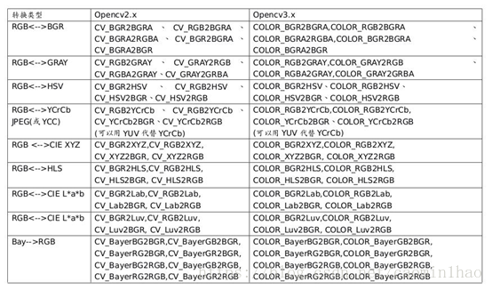

* void cv::cvtColor(
        cv::InputArray src, // 输入序列
        cv::OutputArray dst, // 输出序列
        int code, // 颜色映射码
        int dstCn = 0 // 输出的通道数 (0='automatic')
       );

  参数解释： 
  . InputArray src: 输入图像即要进行颜色空间变换的原图像，可以是Mat类 
  . OutputArray dst: 输出图像即进行颜色空间变换后存储图像，也可以Mat类 
  . int code: 转换的代码或标识，即在此确定将什么制式的图片转换成什么制式的图片，
  . int dstCn = 0: 目标图像通道数，如果取值为0，则由src和code决定

~~~ c++
#include <opencv2/opencv.hpp>
#include <iostream>
 
using namespace cv;
using namespace std;
 
int main(int argc, char** argv) 
	{
	 Mat src,dst,dst1;
	 src = imread("image5.jpg");
 
//判断图片是否载入成功
	if (src.empty()) 
	{
		printf("图片加载失败\n");
		system("pause");
	}
	imshow("原图",src);
 
	cvtColor(src,dst,CV_BGR2GRAY);//转换方式1，这种是转换为灰度图，经常使用，需要记住
	cvtColor(src,dst1,COLOR_BGR2Lab);//转换方式2
 
	imshow("CV_BGR2GRAY转换后",dst);
	imshow("COLOR_BGR2Lab转换后",dst1);
 
	waitKey(0);
	return 0;
}
~~~

~~~ c++
Mat element = getStructuringElement(MORPH_RECT, Size(10, 10));
erode(src_gray, src_gau, element); //腐蚀
dilate(src_gau, src_di, element); //膨胀
~~~

* retval, dst = cv.threshold( src, thresh, maxval, type[, dst] ) 
threshold函数作用：

去掉噪，例如过滤很小或很大像素值的图像点。
参数说明：

src：原图像。
dst：结果图像。
thresh：当前阈值。
maxVal：最大阈值，一般为255.

thresholdType:阈值类型，主要有下面几种：  
~~~ c++
enum ThresholdTypes {
    THRESH_BINARY     = 0,
    THRESH_BINARY_INV = 1,
    THRESH_TRUNC      = 2,
    THRESH_TOZERO     = 3,
    THRESH_TOZERO_INV = 4,
    THRESH_MASK       = 7,
    THRESH_OTSU       = 8,
    THRESH_TRIANGLE   = 16
};
~~~
 返回值:
 retval： 与参数thresh一致
dst： 结果图像 

|编号|	阈值类型枚举	|注意|
| --- | --- | --- |
|1|	THRESH_BINARY| |
|2	|THRESH_BINARY_INV| |
|3|	THRESH_TRUNC| |
|4|	THRESH_TOZERO| |
|5|	THRESH_TOZERO_IN|
|6|	THRESH_MASK|	不支持|
|7|	THRESH_OTSU	|不支持32位|
|8|	THRESH_TRIANGLE|	不支持32位|

* 绘制点和圆
~~~ c++
void cvCircle( CvArr* img, CvPoint center, int radius, CvScalar color,
               int thickness=1, int line_type=8, int shift=0 );
~~~

-    img：图像。
-    center：圆心坐标。
-    radius：圆形的半径。
-    color：线条的颜色。
-    thickness：如果是正数，表示组成圆的线条的粗细程度。否则，表示圆是否被填充。
-    line_type：线条的类型。见 cvLine 的描述
-    shift：圆心坐标点和半径值的小数点位数。
~~~ c++
#include "opencv2/highgui/highgui.hpp"
#include "opencv2/imgproc/imgproc.hpp"
#include <iostream>
#include <stdio.h>

using namespace std;
using namespace cv;

//画圆画点都是使用circle()函数来画，点就是圆，我们平常所说的圆只不过是半径大一点而已。
int main()
{
	Mat img = imread("lol16.jpg");	

	//画空心点
	Point p(20, 20);//初始化点坐标为(20,20)
	circle(img, p, 2, Scalar(0, 255, 0)); //第三个参数表示点的半径，第四个参数选择颜色。这样子我们就画出了绿色的空心点

	//这种初始化点的方式也可以
	Point p2;
	p2.x = 100;
	p2.y = 100;
	//画实心点
	circle(img, p2, 3,Scalar(255,0,0),-1); //第五个参数我设为-1，表明这是个实点。

	//画空心圆
	Point p3(300, 300);
	circle(img,p3,100,Scalar(0,0,255),3);//第五个参数我们调高点，让线更粗

	//画实心圆
	Point p4;
	p4.x = 600;
	p4.y = 600;
	circle(img, p4, 100, Scalar(120, 120, 120), - 1);

	imshow("画点画圆", img);

	waitKey();
	return 0;
}
~~~

* 绘制椭圆

 -   img：图像。
 -   center：椭圆圆心坐标。
 -   axes：轴的长度。
 -   angle：偏转的角度。
 -   start_angle：圆弧起始角的角度。
 -   end_angle：圆弧终结角的角度。
 -   color：线条的颜色。
 -   thickness：线条的粗细程度。
 -   line_type：线条的类型,见CVLINE的描述。
 -   shift：圆心坐标点和数轴的精度。

~~~ c++
#include "opencv2/highgui/highgui.hpp"
#include "opencv2/imgproc/imgproc.hpp"
#include <iostream>
#include <stdio.h>

using namespace std;
using namespace cv;

int main()
{
	Mat img = imread("lol16.jpg");	
	int thickness = 3;
	int lineType = 8;
	double angle = 30;  //椭圆旋转角度
	//第三个参数Size中的两个参数分别是横轴长、纵轴长。
	//同理，thickness若是小于0，表示实心
	ellipse(img,Point(100, 100),Size(90, 60),angle,0,360,Scalar(255, 255, 0),thickness,lineType);

	imshow("画椭圆", img);

	waitKey();
	return 0;
}

~~~

* 绘制矩形

 -   img：图像。
 -   rec：表征矩形的位置和长宽。
 -   color：线条颜色 (RGB) 或亮度（灰度图像 ）(grayscale image）。
 -   thickness：组成矩形的线条的粗细程度。取负值时（如CV_FILLED）函数绘制填充了色彩的矩形。
 -   line_type：线条的类型。见cvLine的描述
 -   shift：坐标点的小数点位数。

~~~ c++
#include "opencv2/highgui/highgui.hpp"
#include "opencv2/imgproc/imgproc.hpp"
#include <iostream>
#include <stdio.h>

using namespace std;
using namespace cv;

int main()
{
	Mat img = imread("lol16.jpg");	
	Rect r(250, 250, 120, 200);
	rectangle(img, r, Scalar(0, 255, 255), 3);

	imshow("画矩形", img);

	waitKey();
	return 0;
}
~~~
 * 绘制直线

 -   img：图像.
 -   pt1：线条起点.
 -   pt2：线条终点.
 -   color：线条颜色.
 -   thickness：线条宽度.
 -   lineType：线型

~~~ c++
#include "opencv2/highgui/highgui.hpp"
#include "opencv2/imgproc/imgproc.hpp"
#include <iostream>
#include <stdio.h>

using namespace std;
using namespace cv;

int main()
{
	Mat img = imread("lol16.jpg");	
	Point p1(100, 100);
	Point p2(758, 50);
	line(img, p1, p2, Scalar(33, 33, 133), 2);

	//画第二条线
	line(img, Point(300, 300), Point(758, 300), Scalar(89, 90, 90), 3);

	imshow("画矩形", img);

	waitKey();
	return 0;
}

~~~

~~~ c++
#include "opencv2/highgui/highgui.hpp"
#include "opencv2/imgproc/imgproc.hpp"
#include <iostream>
#include <stdio.h>

using namespace std;
using namespace cv;

int main()
{
	Mat img = Mat::zeros(Size(800,600), CV_8UC3);
	img.setTo(255);
	Point p1(100, 100);
	Point p2(758, 50);
	line(img, p1, p2, Scalar(0, 0, 255), 2);
	line(img, Point(300, 300), Point(758, 400), Scalar(0, 255, 255), 3);

	Point p(20, 20);//初始化点坐标为(20,20)
	circle(img, p, 2, Scalar(0, 255, 0),-1);

	Point p4;
	p4.x = 600;
	p4.y = 600;
	circle(img, p4, 100, Scalar(120, 120, 120), -1);

	int thickness = 3;
	int lineType = 8;
	double angle = 30;  //椭圆旋转角度
	ellipse(img, Point(100, 100), Size(90, 60), angle, 0, 360, Scalar(255, 255, 0), thickness, lineType);

	Rect r(250, 250, 120, 200);
	rectangle(img, r, Scalar(0, 255, 255), 3);
	imshow("大杂烩", img);

	waitKey();
	return 0;
}

~~~

* 最小二乘法拟合

~~~ c++
#include<iostream>
#include <opencv2/opencv.hpp>
using namespace std;
using namespace cv;

int main()
{
    vector<Point>points;
    //(27 39) (8 5) (8 9) (16 22) (44 71) (35 44) (43 57) (19 24) (27 39) (37 52)

    points.push_back(Point(27, 39));
    points.push_back(Point(8, 5));
    points.push_back(Point(8, 9));
    points.push_back(Point(16, 22));
    points.push_back(Point(44, 71));
    points.push_back(Point(35, 44));
    points.push_back(Point(43, 57));
    points.push_back(Point(19, 24));
    points.push_back(Point(27, 39));
    points.push_back(Point(37, 52));

    Mat src = Mat::zeros(400, 400, CV_8UC3);

    for (int i = 0;i < points.size();i++)
    {
        //在原图上画出点
        circle(src, points[i], 3, Scalar(0, 0, 255), 1, 8);
    }

    //构建A矩阵
    int N = 2;
    Mat A = Mat::zeros(N, N, CV_64FC1);

    for (int row = 0;row < A.rows;row++)
    {
        for (int col = 0; col < A.cols;col++)
        {
            for (int k = 0;k < points.size();k++)
            {
                A.at<double>(row, col) = A.at<double>(row, col) + pow(points[k].x, row + col);
            }
        }
    }
    //构建B矩阵
    Mat B = Mat::zeros(N, 1, CV_64FC1);
    for (int row = 0;row < B.rows;row++)
    {

        for (int k = 0;k < points.size();k++)
        {
            B.at<double>(row, 0) = B.at<double>(row, 0) + pow(points[k].x, row)*points[k].y;
        }
    }
    //A*X=B
    Mat X;
    //cout << A << endl << B << endl;
    solve(A, B, X,DECOMP_LU);

    cout << X << endl;
    vector<Point>lines;
    for (int x = 0;x < src.size().width;x++)
    {                // y = b + ax;
        double y = X.at<double>(0, 0) + X.at<double>(1, 0)*x;
        printf("(%d,%lf)\n", x, y);
        lines.push_back(Point(x, y));
    }
    polylines(src, lines, false, Scalar(255, 0, 0), 1, 8);
    imshow("src", src);

    //imshow("src", A);
    waitKey(0);
    return 0;
~~~

* 当得到对象轮廓后，可用boundingRect()得到包覆此轮廓的最小正矩形，minAreaRect()得到包覆轮廓的最小斜矩形。

- Rect boundingRect(InputArray points)

points：输入信息，可以为包含点的容器(vector)或是Mat。
 返回包覆输入信息的最小正矩形。

- RotatedRect minAreaRect(InputArray points)

  points：输入信息，可以为包含点的容器(vector)或是Mat。

  返回包覆输入信息的最小斜矩形。

