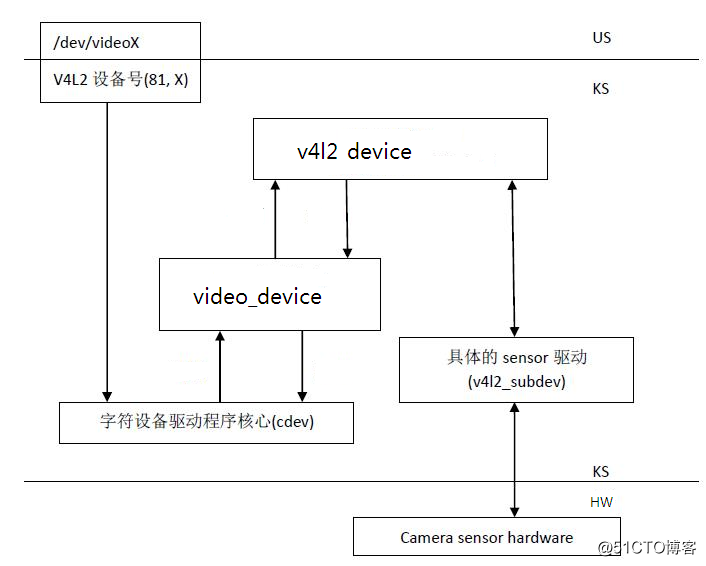
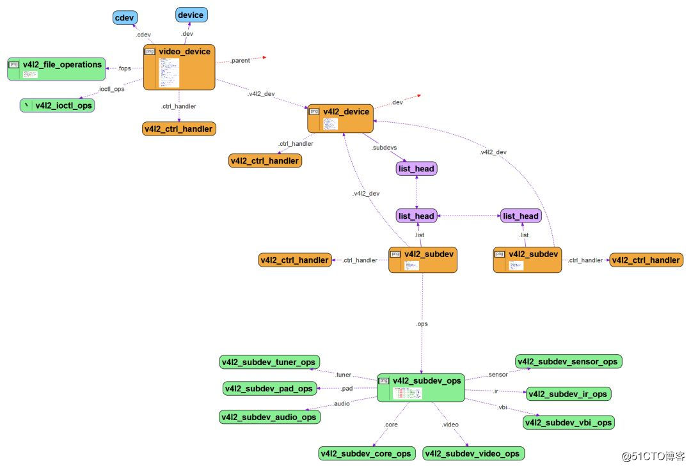

资源网站:

~~~ 
MSM8909 Android7驱动Camera OV5648流程 
https://www.cnblogs.com/Cqlismy/p/16011854.html
MIPI信号简单介绍
https://blog.csdn.net/TO_Raning/article/details/122077861
Camera知识体系架构之驱动&应用&调试学习笔记-以瑞芯微RV1109为例(一)
https://cloud.tencent.com/developer/article/1878547
摄像头驱动个人总结
https://blog.csdn.net/xjw1874/article/details/81475414
全志T7 nvp6134驱动
https://blog.csdn.net/suwen8100/article/details/116228873
全志A40i，linux v4l2驱动 ioctl的调用过程
https://blog.csdn.net/weixin_42203498/article/details/116995004

LCD之mipi DSI接口驱动调试流程
https://blog.csdn.net/weixin_41842559/article/details/109828013?spm=1001.2101.3001.6650.1&utm_medium=distribute.pc_relevant.none-task-blog-2%7Edefault%7ECTRLIST%7ERate-1.pc_relevant_paycolumn_v3&depth_1-utm_source=distribute.pc_relevant.none-task-blog-2%7Edefault%7ECTRLIST%7ERate-1.pc_relevant_paycolumn_v3&utm_relevant_index=2
嵌入式linux调试dsi,LCD 调试总结

https://blog.csdn.net/weixin_32311823/article/details/116800352?spm=1001.2101.3001.6650.3&utm_medium=distribute.pc_relevant.none-task-blog-2%7Edefault%7ECTRLIST%7ERate-3.pc_relevant_paycolumn_v3&depth_1-utm_source=distribute.pc_relevant.none-task-blog-2%7Edefault%7ECTRLIST%7ERate-3.pc_relevant_paycolumn_v3&utm_relevant_index=6
LCD接口分类/DPI/DBI/DSI总结
https://blog.csdn.net/u011603302/article/details/50732440?utm_medium=distribute.pc_relevant.none-task-blog-2~default~baidujs_baidulandingword~default-4.pc_relevant_antiscanv2&spm=1001.2101.3001.4242.3&utm_relevant_index=7

linux摄像头(mipi接口)简要说明
https://blog.csdn.net/weixin_40720202/article/details/88664103?spm=1001.2101.3001.6650.18&utm_medium=distribute.pc_relevant.none-task-blog-2%7Edefault%7EBlogCommendFromBaidu%7ERate-18.pc_relevant_paycolumn_v3&depth_1-utm_source=distribute.pc_relevant.none-task-blog-2%7Edefault%7EBlogCommendFromBaidu%7ERate-18.pc_relevant_paycolumn_v3&utm_relevant_index=23

Linux - 使用V4L2（总结）
https://blog.csdn.net/weixin_43707799/article/details/107821189
V4L2驱动开发详解
https://blog.csdn.net/huhaoxuan2010/article/details/81014420
V4L2架构分析
https://blog.csdn.net/tugouxp/article/details/118700967
一文带你了解V4L2
https://blog.csdn.net/weiqifa0/article/details/103501939
参考：
1. YellowMax2001 https://blog.csdn.net/u013904227/category_9277668.html
2. linux Kernel source code: 4.4
3. Documentation/zh_CN/video4linux/v4l2-framework.txt
4. 杨柳 《Andorid 驱动开发权威指南》
[Camera]v4l2框架内核空间解析
https://zhuanlan.zhihu.com/p/105548113

V4L2框架-videobuf2+
https://yellowmax.blog.csdn.net/article/details/81054611
v4l2的结构体之videobuf2(vb2)
https://blog.csdn.net/u013836909/article/details/114996088


v4l2典型的设备驱动 uvc
https://blog.csdn.net/aprqe/article/details/109700984
~~~

 

- [ 博客园](https://www.cnblogs.com/)
- [ 首页](https://www.cnblogs.com/Cqlismy/)
- [ 新随笔](https://i.cnblogs.com/EditPosts.aspx?opt=1)
- [ 联系](https://msg.cnblogs.com/send/Cqlismy)
- [订阅](javascript:void(0))
- [ 管理](https://i.cnblogs.com/)

​			随笔 - 162  文章 - 0  评论 - 20  阅读 -  31万 		

#                  [     MSM8909 Android7驱动Camera OV5648流程      ](https://www.cnblogs.com/Cqlismy/p/16011854.html)             

1、前言

本文将基于Quectel的SC20模块进行OV5648  Camera的点亮，并对其过程进行一个简要介绍，SC20模块是一款基于MSM8909的智能模块，视频输入接口基于MIPI_CSI标准，可以支持两个摄像头，后置摄像头接口最高支持8MP像素的Camera，前置摄像头接口可支持2MP像素的Camera，OV5648 Camera最高像素分辨率为5MP，因此需要采用SC20的后置摄像头接口进行驱动调试。

 

2、前期准备

在驱动点亮OV5648 Camera之前需要准备好一些基本东西，如下：

- SC20模块硬件基本手册
- 原理图
- OV5648 Datasheet以及摄像头规格书
- OV5648的Camera驱动以及Camera效果驱动文件
- 示波器以及逻辑分析仪

以上东西准备好后，先进行原理的简单分析，并确认硬件在电路上是无误：

通过查看SC20模块硬件基本手册，确定后置摄像头硬件接口，如下所示：


查看后置摄像头硬件接口与摄像头连接的应用参考电路，如下：


接下来，确定原理图后置摄像头连接是否正常，连接如下：

摄像头电源供给：


摄像头控制信号以及数据信号：


硬件原理确认无误后即可进行下一步。

接下来，查看OV5648  Camera的数据手册，并得到一些重要的信息，例如：芯片的一些关键特性、通信接口、上下电时序、重要的寄存器等，在系统启动过程中，OV5648摄像头会有个冷启动过程，在这个过程中会读取Camera芯片的ID，因此必须要通过Camera的数据手册得到这些信息：

首先是，需要芯片的一些关键特性，比如输入电压、分辨率、输入时钟、数据输出格式等，如下：


OV5648芯片的内部架构框图如下：


串行相机控制总线接口（Serial Camera Control Bus Interface）也就是I2C接口，用来控制Sensor的操作，通过数据手册可以知道从机地址以及读写时序，如下：


可以知道，I2C的从机地址为0x36，最后一位为读写位，写寄存器数据时为0x6C，读寄存器数据时为0x6D。

另外，还有就是I2C的时钟速率，这个值一般设置为400KHz，可以从手册中知道，如下：


接下来，则是OV5648的上下电时序控制，这个需要根据自己的实际情况修改，通过Datasheet可以知道，OV5648的上电时序如下所示：


大概的上电时序就是，芯片电源上电后，Reset引脚拉高，如果有Power Down引脚控制的话，同时也要控制，主控输出MCLK时钟，这个时钟一般配置为24MHz，芯片正常工作后，接下来，就是通过I2C进行寄存器的读写操作，进一步完成芯片的初始化。

OV5648的下电时序如下所示：


Camera的上下电时序基本就是这样，不同的sensor基本有一定的差异，要查看相关芯片手册进行分析。

查看Sensor的ID寄存器的地址以及数据，上电开机后，冷启动过程需要读取该Sensor的ID以判断通信过程是否已经正常了，如果该Sensor的ID无法进行读出，则需要检查硬件电路以及上电时序，OV5648的该寄存器如下：


到此，从Datasheet需要得到的关键内容就差不多了，还需要准备好相关的摄像头驱动以及摄像头效果文件，示波器和逻辑分析仪等调试工具。

 

3、驱动代码添加

（1）添加Kernel Driver

根据实际情况使用的引脚去修改msm8909平台的设备树，文件路径如下：

android7/kernel/arch/arm/boot/dts/qcom/msm8909-camera-sensor-mtp.dtsi

dts文件修改如下：

[](javascript:void(0);)

```
&tlmm_pinmux {
    cam_sensor_mclk0 {
        /* MCLK */
        qcom,pins = <&gp 26>;
        qcom,num-grp-pins = <1>;
        qcom,pin-func = <1>;
        label = "cam-sensor-mclk0";
            /* active state */
        cam_sensor_mclk0_default: default {
            drive-strength = <2>; /* 2 MA */
            bias-disable = <0>; /* No PULL */
        };
    };

    cam_sensor_mclk0_sleep {
        /* MCLK */
        qcom,pins = <&gp 26>;
        qcom,num-grp-pins = <1>;
        label = "cam-sensor-mclk0-sleep";
        /* suspend state */
        cam_sensor_mclk0_sleep: sleep {
            drive-strength = <2>; /* 2 MA */
            bias-pull-down; /* PULL DOWN */
        };
    };

    cam_sensor_rear {
        /* RESET, STANDBY */
        qcom,pins =  <&gp 35>, <&gp 34>, <&gp 50>;
        qcom,num-grp-pins = <3>;
        qcom,pin-func = <0>;
        label = "cam-sensor-rear";
        /* active state */
        cam_sensor_rear_default: default {
            drive-strength = <2>; /* 2 MA */
            bias-disable = <0>; /* No PULL */
        };
    };

    cam_sensor_rear_sleep {
        /* RESET, STANDBY */
        qcom,pins =  <&gp 35>, <&gp 34>, <&gp 50>;
        qcom,num-grp-pins = <3>;
        qcom,pin-func = <0>;
        label = "cam-sensor-rear-sleep";
        /*suspended state */
        cam_sensor_rear_sleep: sleep {
            drive-strength = <2>; /* 2 MA */
            bias-pull-down; /* PULL DOWN */
        };
    };
};

&i2c_3 {
    //Rear Camera
    qcom,camera@0 {
        cell-index = <0>;
        compatible = "qcom,camera";
        reg = <0x2>;
        qcom,csiphy-sd-index = <0>;
        qcom,csid-sd-index = <0>;
        qcom,mount-angle = <0>;
        //qcom,actuator-src = <&actuator0>;
        qcom,led-flash-src = <&led_flash0>;
        //qcom,eeprom-src = <&eeprom0>;
        cam_vdig-supply = <&pm8909_l2>;
        cam_vana-supply = <&pm8909_l17>;
        cam_vio-supply = <&pm8909_l6>;
        cam_vaf-supply = <&pm8909_l8>;
        qcom,cam-vreg-name = "cam_vdig", "cam_vio", "cam_vana",
                             "cam_vaf";
        qcom,cam-vreg-type = <0 0 0 0>;
        qcom,cam-vreg-min-voltage = <1200000 0 2800000 2850000>;
        qcom,cam-vreg-max-voltage = <1200000 0 2850000 2900000>;
        qcom,cam-vreg-op-mode = <200000 0 80000 100000>;
        pinctrl-names = "cam_default", "cam_suspend";
        pinctrl-0 = <&cam_sensor_mclk0_default &cam_sensor_rear_default>;
        pinctrl-1 = <&cam_sensor_mclk0_sleep &cam_sensor_rear_sleep>;
        gpios = <&msm_gpio 26 0>, //CAM0_CLK
            <&msm_gpio 35 0>,    //CAM0_RST
            <&msm_gpio 34 0>,    //CAM0_PWD
            <&msm_gpio 50 0>;    //Not Used        
        qcom,gpio-reset = <1>;
        qcom,gpio-standby = <2>;
        qcom,gpio-vdig = <3>;
        qcom,gpio-req-tbl-num = <0 1 2 3>;
        qcom,gpio-req-tbl-flags = <1 0 0 0>;
        qcom,gpio-req-tbl-label = "CAMIF_MCLK",
            "CAM_RESET1",
            "CAM_STANDBY",
            "CAM_VDIG";            
        qcom,sensor-position = <0>;
        qcom,sensor-mode = <0>;
        qcom,cci-master = <0>;
        status = "ok";
        clocks = <&clock_gcc clk_mclk0_clk_src>,
                <&clock_gcc clk_gcc_camss_mclk0_clk>;
        clock-names = "cam_src_clk", "cam_clk";
    };
};
```

[](javascript:void(0);)

需要密切关注的是MCLK、POWD、RESET对应的引脚的pinctrl，I2C接口等。

（2）添加User Space Driver

接下来，添加摄像头Kernel用户空间驱动，这些驱动可以咨询摄像头厂商，文件路径如下：

android7/vendor/qcom/proprietary/mm-camera/mm-camera2/media-controller/modules/sensors/sensor_libs/ov5648_8909/ov5648_8909_lib.c、ov5648_8909_lib.h、Android.mk

在修改和配置摄像头用户空间驱动的时候，需要密切一些重要的参数配置，比如Sensor的初始化参数、Sensor的输出参数、Sensor的上下电时序、Camera的ID、从机地址、Sensor的ID等。

[](javascript:void(0);)

```
static struct msm_camera_sensor_slave_info sensor_slave_info = {
  /* Camera slot where this camera is mounted */
  .camera_id = CAMERA_0,
  /* sensor slave address */
  .slave_addr = 0x6c,
  /* sensor i2c frequency*/
  .i2c_freq_mode = I2C_FAST_MODE,
  /* sensor address type */
  .addr_type = MSM_CAMERA_I2C_WORD_ADDR,
  /* sensor id info*/
  .sensor_id_info = {
    /* sensor id register address */
    .sensor_id_reg_addr = 0x300a,
    /* sensor id */
    .sensor_id = 0x5648,
  },
  /* power up / down setting */
  .power_setting_array = {
    .power_setting = power_setting,
    .size = ARRAY_SIZE(power_setting),
    
    .power_down_setting = power_down_setting,
    .size_down = ARRAY_SIZE(power_down_setting),
    
  },
};
```

[](javascript:void(0);)

camera_id的值表示的含义为，CAMERA_0表示使用的是后置摄像头接口，CAMERA_1表示使用的是前置摄像头接口。

Sensor的上下电时序需要根据芯片手册进行配置，如下：

[](javascript:void(0);)

```
static struct msm_sensor_power_setting power_setting[] = {
  {
    .seq_type = SENSOR_VREG,
    .seq_val = CAM_VIO,
    .config_val = 0,
    .delay = 0,
  },
  {
    .seq_type = SENSOR_VREG,
    .seq_val = CAM_VANA,
    .config_val = 0,
    .delay = 0,
  },
  {
    .seq_type = SENSOR_GPIO,
    .seq_val = SENSOR_GPIO_VANA,
    .config_val = GPIO_OUT_HIGH,
    .delay = 10,
  },
  {
    .seq_type = SENSOR_GPIO,
    .seq_val = SENSOR_GPIO_VDIG,
    .config_val = GPIO_OUT_HIGH,
    .delay = 10,
  },
  {
    .seq_type = SENSOR_GPIO,
    .seq_val = SENSOR_GPIO_VIO,
    .config_val = GPIO_OUT_HIGH,
    .delay = 10,
  },
  {
    .seq_type = SENSOR_VREG,
    .seq_val = CAM_VDIG,
    .config_val = 0,
    .delay = 1,
  },  {
    .seq_type = SENSOR_GPIO,
    .seq_val = SENSOR_GPIO_RESET,
    .config_val = GPIO_OUT_LOW,
    .delay = 0,
  },
  {
    .seq_type = SENSOR_GPIO,
    .seq_val = SENSOR_GPIO_RESET,
    .config_val = GPIO_OUT_HIGH,
    .delay = 10,
  },
  {
    .seq_type = SENSOR_GPIO,
    .seq_val = SENSOR_GPIO_STANDBY,
    .config_val = GPIO_OUT_LOW,
    .delay = 0,
  },
  {
    .seq_type = SENSOR_GPIO,
    .seq_val = SENSOR_GPIO_STANDBY,
    .config_val = GPIO_OUT_HIGH,
    .delay = 5,
  },
  {
    .seq_type = SENSOR_CLK,
    .seq_val = SENSOR_CAM_MCLK,
    .config_val = 24000000,
    .delay = 10,
  },
  {
    .seq_type = SENSOR_I2C_MUX,
    .seq_val = 0,
    .config_val = 0,
    .delay = 0,
  },
};

static struct msm_sensor_power_setting power_down_setting[] = {
  {
    .seq_type = SENSOR_GPIO,
    .seq_val = SENSOR_GPIO_VANA,
    .config_val = GPIO_OUT_LOW,
    .delay = 0,
  },
  {
    .seq_type = SENSOR_GPIO,
    .seq_val = SENSOR_GPIO_VDIG,
    .config_val = GPIO_OUT_LOW,
    .delay = 0,
  },
  {
    .seq_type = SENSOR_GPIO,
    .seq_val = SENSOR_GPIO_VIO,
    .config_val = GPIO_OUT_LOW,
    .delay = 10,
  },
  {
    .seq_type = SENSOR_GPIO,
    .seq_val = SENSOR_GPIO_STANDBY,
    .config_val = GPIO_OUT_LOW,
    .delay = 0,
  },
  {
    .seq_type = SENSOR_CLK,
    .seq_val = SENSOR_CAM_MCLK,
    .config_val = 0,
    .delay = 10,
  },
};
```

[](javascript:void(0);)

完整的驱动代码如下：


[](javascript:void(0);)

```
/*============================================================================

  Copyright (c) 2015 Qualcomm Technologies, Inc. All Rights Reserved.
  Qualcomm Technologies Proprietary and Confidential.

============================================================================*/
#ifndef __OV5648_8909_LIB_H__
#define __OV5648_8909_LIB_H__

#include "sensor_lib.h"

#define SENSOR_MODEL_NO_OV5648_8909 "ov5648_8909"
#define OV5648_8909_LOAD_CHROMATIX(n) \
  "libchromatix_"SENSOR_MODEL_NO_OV5648_8909"_"#n".so"

static struct msm_camera_i2c_reg_array init_reg_array[] = {
  /* System Control */
  {0x3001, 0x00}, /* SC_CMMN_PAD_OEN1 (I/O Direction) */
  {0x3002, 0x00}, /* SC_CMMN_PAD_OEN2 (I/O Direction) */
  {0x3011, 0x02}, /* SC_CMMN_PAD_PK (FREX Pin en,io drive strength) */
  {0x3017, 0x05}, /* SC_CMMN_MIPI_PHY */
  {0x3018, 0x4c}, /* SC_CMMN_MIPI_SC_CTRL (two mipi lane mode,mipi enable) */
  {0x301c, 0xd2}, /* debug mode */
  {0x3022, 0x00}, /* SC_CMMN_MIPI_SC_CTRL */
  {0x3034, 0x1a}, /* SC_CMMN_MIPI_PLL_CTRL0 (mipi_bit_mode:10-bit mode) */
  {0x3035, 0x21}, /* SC_CMMN_MIPI_PLL_CTRL1 (system_pll_div,scale_divider_mipi) */
  {0x3036, 0x69}, /* SC_CMMN_MIPI_PLL_MULTIPLIER (PLL_multipliter) */
  {0x3037, 0x03}, /* SC_CMMN_MIPI_PLL_CTR13 (pll_prediv) */
  {0x3038, 0x00}, /* SC_CMMN_MIPI_PLL_DEBUG_OPT */
  {0x3039, 0x00}, /* SC_CMMN_MIPI_PLL_CTRL_R (pll_bypass) */
  {0x303a, 0x00}, /* SC_CMMN_MIPI_PLLS_CTRL0 (pllS_bypass) */
  {0x303b, 0x19}, /* SC_CMMN_MIPI_PLLS_CTRL1 (pllS_multiplier) */
  {0x303c, 0x11}, /* SC_CMMN_MIPI_PLLS_CTRL2 (pllS_sys_div) */
  {0x303d, 0x30}, /* SC_CMMN_MIPI_PLLS_CTRL3 (pllS_pre_div,plls_div_r,plls_seld5) */
  {0x3105, 0x11},
  {0x3106, 0x05}, /* SRB CTRL (PLL clock divider,rst_arb,sclk_arb) */

  {0x3304, 0x28},
  {0x3305, 0x41},
  {0x3306, 0x30},
  {0x3308, 0x00},
  {0x3309, 0xc8},
  {0x330a, 0x01},
  {0x330b, 0x90},
  {0x330c, 0x02},
  {0x330d, 0x58},
  {0x330e, 0x03},
  {0x330f, 0x20},
  {0x3300, 0x00},

  /* AEC/AGC Control */
  {0x3500, 0x00}, /* EXPOSURE (Exposure[19:16]) */
  {0x3501, 0x3d}, /* EXPOSURE (Exposure[15:8]) */
  {0x3502, 0x00}, /* EXPOSURE (Exposure[7:0]) */
  {0x3503, 0x07}, /* MANUAL CTRL (AEC/AGC manual enable) */
  {0x350a, 0x00}, /* AGC (AGC real gain output high byte_Gain[9:8]) */
  {0x350b, 0x40}, /* AGC (AGC real gain output low byte_Gain[7:0]) */

  /* ANALOG_CONTROL */
  {0x3601, 0x33},
  {0x3602, 0x00},
  {0x3611, 0x0e},
  {0x3612, 0x2b},
  {0x3614, 0x50},
  {0x3620, 0x33},
  {0x3622, 0x00},
  {0x3630, 0xad},
  {0x3631, 0x00},
  {0x3632, 0x94},
  {0x3633, 0x17},
  {0x3634, 0x14},
  {0x3704, 0xc0},
  {0x3705, 0x2a},
  {0x3708, 0x66},
  {0x3709, 0x52},
  {0x370b, 0x23},
  {0x370c, 0xcf},
  {0x370d, 0x00},
  {0x370e, 0x00},
  {0x371c, 0x07},
  {0x3739, 0xd2},
  {0x373c, 0x00},

  /* timing control */
  {0x3800, 0x00}, /* TIMING_X_ADDR_START (x_addr_start[11:8]) */
  {0x3801, 0x00}, /* TIMING_X_ADDR_START (x_addr_start[7:0]) */
  {0x3802, 0x00}, /* TIMING_Y_ADDR_START (y_addr_start[11:8]) */
  {0x3803, 0x00}, /* TIMING_Y_ADDR_START (y_addr_start[7:0]) */
  {0x3804, 0x0a}, /* TIMING_X_ADDR_END (x_addr_end[11:8]) */
  {0x3805, 0x3f}, /* TIMING_X_ADDR_END (x_addr_end[7:0]) */
  {0x3806, 0x07}, /* TIMING_Y_ADDR_END (y_addr_end[11:8]) */
  {0x3807, 0xa3}, /* TIMING_Y_ADDR_END (y_addr_end[7:0]) */
  {0x3808, 0x05}, /* TIMING_X_OUTPUT_SIZE (Video output horizontal width[11:8]) */
  {0x3809, 0x10}, /* TIMING_X_OUTPUT_SIZE (Video output horizontal width[7:0]) */
  {0x380a, 0x03}, /* TIMING_Y_OUTPUT_SIZE (Video output vertical height[11:8]) */
  {0x380b, 0xcc}, /* TIMING_Y_OUTPUT_SIZE (Video output vertical height[7:0]) */
  {0x380c, 0x0b}, /* TIMING_HTS (Total horizontal size[12:8]) */
  {0x380d, 0x00}, /* TIMING_HTS (Total horizontal size[7:0]) */
  {0x380e, 0x03}, /* TIMING_VTS (Total vertical size[15:8]) */
  {0x380f, 0xe0}, /* TIMING_VTS (Total vertical size[7:0]) */
  {0x3810, 0x00}, /* TIMING_ISP_X_WIN (ISP horizontal offset[11:8]) */
  {0x3811, 0x08}, /* TIMING_ISP_X_WIN (ISP horizontal offset[7:0]) */
  {0x3812, 0x00}, /* TIMING_ISP_Y_WIN (ISP vertical offset[11:8]) */
  {0x3813, 0x04}, /* TIMING_ISP_Y_WIN (ISP vertical offset[7:0]) */
  {0x3814, 0x31}, /* TIMING_X_INC */
  {0x3815, 0x31}, /* TIMING_Y_INC */
  {0x3817, 0x00}, /* TIMING_HSYNCST (HSYNC start point[7:0]) */
  
  {0x3820, 0x48},//mirror
  {0x3821, 0x01},//flip
  /*
  {0x3820, 0x4e},//mirror
  {0x3821, 0x07},//flip
  */
  {0x3826, 0x03},
  {0x3829, 0x00},
  {0x382b, 0x0b},
  {0x3830, 0x00},
  {0x3836, 0x00},
  {0x3837, 0x00},
  {0x3838, 0x00},
  {0x3839, 0x04},
  {0x383a, 0x00},
  {0x383b, 0x01},

  /* strobe/frame exposure */
  {0x3b00, 0x00},
  {0x3b02, 0x08},
  {0x3b03, 0x00},
  {0x3b04, 0x04},
  {0x3b05, 0x00},
  {0x3b06, 0x04},
  {0x3b07, 0x08},
  {0x3b08, 0x00},
  {0x3b09, 0x02},
  {0x3b0a, 0x04},
  {0x3b0b, 0x00},
  {0x3b0c, 0x3d},

  {0x3f01, 0x0d},
  {0x3f0f, 0xf5},
  {0x4000, 0x89},
  {0x4001, 0x02},
  {0x4002, 0x45},
  {0x4004, 0x02},
  {0x4005, 0x18},
  {0x4006, 0x08},
  {0x4007, 0x10},
  {0x4008, 0x00},
  {0x4050, 0x6e},
  {0x4051, 0x8f},
  {0x4300, 0xf8},
  {0x4303, 0xff},
  {0x4304, 0x00},
  {0x4307, 0xff},
  {0x4520, 0x00},
  {0x4521, 0x00},
  {0x4511, 0x22},
  {0x4801, 0x0f},
  {0x4814, 0x2a},
  {0x481f, 0x3c},
  {0x4823, 0x3c},
  {0x4826, 0x00},
  {0x481b, 0x3c},
  {0x4827, 0x32},
  {0x4837, 0x18},
  {0x4b00, 0x06},
  {0x4b01, 0x0a},
  {0x4b04, 0x10},
  {0x5000, 0xff},
  {0x5001, 0x00},
  {0x5002, 0x41},
  {0x5003, 0x0a},
  {0x5004, 0x00},
  {0x5043, 0x00},
  {0x5013, 0x00},
  {0x501f, 0x03},
  {0x503d, 0x00},
  {0x5780, 0xfc},
  {0x5781, 0x1f},
  {0x5782, 0x03},
  {0x5786, 0x20},
  {0x5787, 0x40},
  {0x5788, 0x08},
  {0x5789, 0x08},
  {0x578a, 0x02},
  {0x578b, 0x01},
  {0x578c, 0x01},
  {0x578d, 0x0c},
  {0x578e, 0x02},
  {0x578f, 0x01},
  {0x5790, 0x01},
  {0x5a00, 0x08},
  {0x5b00, 0x01},
  {0x5b01, 0x40},
  {0x5b02, 0x00},
  {0x5b03, 0xf0},
};

static struct msm_camera_i2c_reg_array res0_reg_array[] = {
  //capture preview
  // 2592x1944 15fps 2 lane MIPI 420Mbps/lane
  {0x3501, 0x7b}, /* EXPOSURE (Exposure[15:8]) */
  {0x3502, 0x00}, /* EXPOSURE (Exposure[7:0]) */
  {0x3708, 0x63}, /* Analog Control Register */
  {0x3709, 0x12}, /* Analog Control Register */
  {0x370c, 0xcc}, /* Analog Control Register */

  /* timing control */
  {0x3800, 0x00},
  {0x3801, 0x00},
  {0x3802, 0x00},
  {0x3803, 0x00},
  {0x3804, 0x0a},
  {0x3805, 0x3f},
  {0x3806, 0x07},
  {0x3807, 0xa3},
  {0x3808, 0x0a},
  {0x3809, 0x20},
  {0x380a, 0x07},
  {0x380b, 0x98},
  {0x380c, 0x0b},
  {0x380d, 0x00},
  {0x380e, 0x07},
  {0x380f, 0xc0},
  {0x3810, 0x00},
  {0x3811, 0x10},
  {0x3812, 0x00},
  {0x3813, 0x06},
  {0x3814, 0x11},
  {0x3815, 0x11},
  {0x3817, 0x00},
  
  {0x3820, 0x40}, //mirror
  {0x3821, 0x01}, //flip
  /*
  {0x3820, 0x46},
  {0x3821, 0x07},
  */
  {0x4004, 0x04},
  {0x4005, 0x1a},
  {0x350b, 0x40},
  {0x4837, 0x17},
};

static struct msm_camera_i2c_reg_array res1_reg_array[] = {
  // 1296x972 30fps 2 lane MIPI 420Mbps/lane
  {0x3501, 0x3d},
  {0x3502, 0x00},
  {0x3708, 0x66},
  {0x3709, 0x52},
  {0x370c, 0xcf},
  {0x3800, 0x00},
  {0x3801, 0x00},
  {0x3802, 0x00},
  {0x3803, 0x00},
  {0x3804, 0x0a},
  {0x3805, 0x3f},
  {0x3806, 0x07},
  {0x3807, 0xa3},
  {0x3808, 0x05},
  {0x3809, 0x10},
  {0x380a, 0x03},
  {0x380b, 0xcc},
  {0x380c, 0x0B},
  {0x380d, 0x00},
  {0x380e, 0x03},
  {0x380f, 0xe0},
  {0x3810, 0x00},
  {0x3811, 0x08},
  {0x3812, 0x00},
  {0x3813, 0x04},
  {0x3814, 0x31},
  {0x3815, 0x31},
  {0x3817, 0x00},
  
  {0x3820, 0x48},
  {0x3821, 0x01},
  /*
  {0x3820, 0x4e},
  {0x3821, 0x07},
  */
  {0x4004, 0x02},
  {0x4005, 0x18},
  {0x350b, 0x80},
  {0x4837, 0x17},
};

static struct msm_camera_i2c_reg_array res2_reg_array[] = {
  // 1296x972 60fps 2 lane MIPI 420Mbps/lane
  {0x3501, 0x3d},
  {0x3502, 0x00},
  {0x3708, 0x66},
  {0x3709, 0x52},
  {0x370c, 0xcf},
  {0x3800, 0x00},
  {0x3801, 0x00},
  {0x3802, 0x00},
  {0x3803, 0x00},
  {0x3804, 0x0a},
  {0x3805, 0x3f},
  {0x3806, 0x07},
  {0x3807, 0xa3},
  {0x3808, 0x05},
  {0x3809, 0x10},
  {0x380a, 0x03},
  {0x380b, 0xcc},
  {0x380c, 0x05},
  {0x380d, 0x80},
  {0x380e, 0x03},
  {0x380f, 0xe0},
  {0x3810, 0x00},
  {0x3811, 0x08},
  {0x3812, 0x00},
  {0x3813, 0x04},
  {0x3814, 0x31},
  {0x3815, 0x31},
  {0x3817, 0x00},
  
  {0x3820, 0x08},
  {0x3821, 0x01},
  /*
  {0x3820, 0x0e},
  {0x3821, 0x07},
  */
  {0x4004, 0x02},
  {0x4005, 0x18},
  {0x350b, 0x80},
  {0x4837, 0x17},
};

static struct msm_camera_i2c_reg_array res3_reg_array[] = {
//video preview    
  // 640x480 90fps 2lane 10Bit(Binning+Skipping) MIPI 420Mbps/lane
  {0x3501, 0x1e},
  {0x3502, 0xc0},
  {0x3708, 0x69},
  {0x3709, 0x92},
  {0x3800, 0x00},
  {0x3801, 0x00},
  {0x3802, 0x00},
  {0x3803, 0x02},
  {0x3804, 0x0a},
  {0x3805, 0x3f},
  {0x3806, 0x07},
  {0x3807, 0xa1},
  {0x3808, 0x02},
  {0x3809, 0x80},
  {0x380a, 0x01},
  {0x380b, 0xe0},
  {0x380c, 0x07},
  {0x380d, 0x28},
  {0x380e, 0x01},
  {0x380f, 0xfc},
  {0x3810, 0x00},
  {0x3811, 0x08},
  {0x3812, 0x00},
  {0x3813, 0x04},
  {0x3814, 0x71},
  {0x3815, 0x53},
  {0x3817, 0x00},
  
  {0x3820, 0x48},
  {0x3821, 0x01},
  /*
  {0x3820, 0x4e},
  {0x3821, 0x07},
  */
  {0x4004, 0x02},
  {0x4005, 0x18},
  {0x350b, 0xf0},
  {0x4837, 0x17},
};

static struct msm_camera_i2c_reg_array res4_reg_array[] = {
  // 320x240 120fps 2lane 10Bit(Binning+Skipping) MIPI 420Mbps/lane
  {0x3501, 0x0f},
  {0x3502, 0xb0},
  {0x3708, 0x69},
  {0x3709, 0xd2},
  {0x3800, 0x00},
  {0x3801, 0x00},
  {0x3802, 0x00},
  {0x3803, 0x02},
  {0x3804, 0x0a},
  {0x3805, 0x3f},
  {0x3806, 0x07},
  {0x3807, 0xa1},
  {0x3808, 0x01},
  {0x3809, 0x40},
  {0x380a, 0x00},
  {0x380b, 0xf0},
  {0x380c, 0x0a},
  {0x380d, 0x38},
  {0x380e, 0x01},
  {0x380f, 0x0c},
  {0x3810, 0x00},
  {0x3811, 0x04},
  {0x3812, 0x00},
  {0x3813, 0x02},
  {0x3814, 0x97},
  {0x3815, 0x97},
  {0x3817, 0x00},
  
  {0x3820, 0x48},
  {0x3821, 0x01},
  /*   
  {0x3820, 0x4e},
  {0x3821, 0x07},
  */
  {0x4004, 0x02},
  {0x4005, 0x18},
  {0x350b, 0xff},
  {0x4837, 0x17},
};
#endif
```

[](javascript:void(0);)


[](javascript:void(0);)

```
/* ov5648_8909_lib.c
 *
 * Copyright (c) 2015 Qualcomm Technologies, Inc. All Rights Reserved.
 * Qualcomm Technologies Proprietary and Confidential.
 */

#include <stdio.h>
#include "sensor_lib.h"
#include "ov5648_8909_lib.h"

#define SENSOR_MODEL_NO_OV5648_8909 "ov5648_8909"
#define OV5648_8909_LOAD_CHROMATIX(n) \
  "libchromatix_"SENSOR_MODEL_NO_OV5648_8909"_"#n".so"

#undef DEBUG_INFO
#define OV5648_8909_DEBUG
#ifdef OV5648_8909_DEBUG
#include <utils/Log.h>
#define SERR(fmt, args...) \
  ALOGE("%s:%d "fmt"\n", __func__, __LINE__, ##args)

#define DEBUG_INFO(fmt, args...) SERR(fmt, ##args)
#else
#define DEBUG_INFO(fmt, args...) do { } while (0)
#endif

static sensor_lib_t sensor_lib_ptr;

static struct msm_sensor_power_setting power_setting[] = {
  {
    .seq_type = SENSOR_VREG,
    .seq_val = CAM_VIO,
    .config_val = 0,
    .delay = 0,
  },
  {
    .seq_type = SENSOR_VREG,
    .seq_val = CAM_VANA,
    .config_val = 0,
    .delay = 0,
  },

  /*
  {
    .seq_type = SENSOR_VREG,
    .seq_val = CAM_VAF,
    .config_val = 0,
    .delay = 0,
  },
 
  {
    .seq_type = SENSOR_GPIO,
    .seq_val = SENSOR_GPIO_AF_PWDM,
    .config_val = GPIO_OUT_LOW,
    .delay = 1,
  },

  {
    .seq_type = SENSOR_GPIO,
    .seq_val = SENSOR_GPIO_AF_PWDM,
    .config_val = GPIO_OUT_HIGH,
    .delay = 5,
  },
  */
  //luffy add
   
  {
        .seq_type = SENSOR_GPIO,
        .seq_val = SENSOR_GPIO_VANA,
        .config_val = GPIO_OUT_HIGH,
        .delay = 10,
    },
    {
        .seq_type = SENSOR_GPIO,
        .seq_val = SENSOR_GPIO_VDIG,
        .config_val = GPIO_OUT_HIGH,
        .delay = 10,
    },
    {
        .seq_type = SENSOR_GPIO,
        .seq_val = SENSOR_GPIO_VIO,
        .config_val = GPIO_OUT_HIGH,
        .delay = 10,
    },
  {
        .seq_type = SENSOR_VREG,
        .seq_val = CAM_VDIG,
        .config_val = 0,
        .delay = 1,
    },
  {
    .seq_type = SENSOR_GPIO,
    .seq_val = SENSOR_GPIO_RESET,
    .config_val = GPIO_OUT_LOW,
    .delay = 0,
  },
  {
    .seq_type = SENSOR_GPIO,
    .seq_val = SENSOR_GPIO_RESET,
    .config_val = GPIO_OUT_HIGH,
    .delay = 10,
  },
  {
    .seq_type = SENSOR_GPIO,
    .seq_val = SENSOR_GPIO_STANDBY,
    .config_val = GPIO_OUT_LOW,
    .delay = 0,
  },
  {
    .seq_type = SENSOR_GPIO,
    .seq_val = SENSOR_GPIO_STANDBY,
    .config_val = GPIO_OUT_HIGH,
    .delay = 5,
  },
  {
    .seq_type = SENSOR_CLK,
    .seq_val = SENSOR_CAM_MCLK,
    .config_val = 24000000,
    .delay = 10,
  },
  {
    .seq_type = SENSOR_I2C_MUX,
    .seq_val = 0,
    .config_val = 0,
    .delay = 0,
  },
};

static struct msm_sensor_power_setting power_down_setting[] = {
  {
        .seq_type = SENSOR_GPIO,
        .seq_val = SENSOR_GPIO_VANA,
        .config_val = GPIO_OUT_LOW,
        .delay = 0,
    },
    {
        .seq_type = SENSOR_GPIO,
        .seq_val = SENSOR_GPIO_VDIG,
        .config_val = GPIO_OUT_LOW,
        .delay = 0,
    },
    {
        .seq_type = SENSOR_GPIO,
        .seq_val = SENSOR_GPIO_VIO,
        .config_val = GPIO_OUT_LOW,
        .delay = 10,
    },
  {
    .seq_type = SENSOR_GPIO,
    .seq_val = SENSOR_GPIO_STANDBY,
    .config_val = GPIO_OUT_LOW,
    .delay = 0,
  },
  {
    .seq_type = SENSOR_CLK,
    .seq_val = SENSOR_CAM_MCLK,
    .config_val = 0,
    .delay = 10,
  },
};

static struct msm_camera_sensor_slave_info sensor_slave_info = {
  /* Camera slot where this camera is mounted */
  .camera_id = CAMERA_0,
  /* sensor slave address */
  .slave_addr = 0x6c,
  /* sensor i2c frequency*/
  .i2c_freq_mode = I2C_FAST_MODE,
  /* sensor address type */
  .addr_type = MSM_CAMERA_I2C_WORD_ADDR,
  /* sensor id info*/
  .sensor_id_info = {
    /* sensor id register address */
    .sensor_id_reg_addr = 0x300a,
    /* sensor id */
    .sensor_id = 0x5648,
  },
  /* power up / down setting */
  .power_setting_array = {
    .power_setting = power_setting,
    .size = ARRAY_SIZE(power_setting),
    
    .power_down_setting = power_down_setting,
    .size_down = ARRAY_SIZE(power_down_setting),
  },
};

static struct msm_sensor_init_params sensor_init_params = {
  .modes_supported = CAMERA_MODE_2D_B,
  /* sensor position (back or front) */
  .position = BACK_CAMERA_B,
  /* sensor mounting direction */
  .sensor_mount_angle = SENSOR_MOUNTANGLE_270,
};

static sensor_output_t sensor_output = {
  /* sensor image format */
  .output_format = SENSOR_BAYER,
  /* sensor data output interface */
  .connection_mode = SENSOR_MIPI_CSI,
  /* sensor data */
  .raw_output = SENSOR_10_BIT_DIRECT,
};

static struct msm_sensor_output_reg_addr_t output_reg_addr = {
  .x_output = 0x3808,
  .y_output = 0x380a,
  .line_length_pclk = 0x380c,
  .frame_length_lines = 0x380e,
};

static struct msm_sensor_exp_gain_info_t exp_gain_info = {
  .coarse_int_time_addr = 0x3500,
  .global_gain_addr = 0x350a,
  .vert_offset = 4,
};

static sensor_aec_data_t aec_info = {
  .max_gain = 12.0,
  .max_linecount = 26880,
};

static sensor_lens_info_t default_lens_info = {
  .focal_length = 3.16,
  .pix_size = 1.4,
  .f_number = 2.4,
  .total_f_dist = 1.2,
  .hor_view_angle = 56.0,
  .ver_view_angle = 42.0,
};

/* mipi_csi interface lane config */
#ifndef VFE_40
static struct csi_lane_params_t csi_lane_params = {
  .csi_lane_assign = 0x4320,
  .csi_lane_mask = 0x7,
  .csi_if = 1,
  .csid_core = {0},
  .csi_phy_sel = 0,
};
#else
static struct csi_lane_params_t csi_lane_params = {
  .csi_lane_assign = 0x4320,
  .csi_lane_mask = 0x7,
  .csi_if = 1,
  .csid_core = {0},
  .csi_phy_sel = 0,
};
#endif

static struct msm_camera_i2c_reg_setting init_reg_setting[] = {
  {
    .reg_setting = init_reg_array,
    .size = ARRAY_SIZE(init_reg_array),
    .addr_type = MSM_CAMERA_I2C_WORD_ADDR,
    .data_type = MSM_CAMERA_I2C_BYTE_DATA,
    .delay = 0,
  },
};

static struct sensor_lib_reg_settings_array init_settings_array = {
  .reg_settings = init_reg_setting,
  .size = 1,
};

static struct msm_camera_i2c_reg_array start_reg_array[] = {
  {0x0100, 0x01},
  {0x4800, 0x04},
  {0x4202, 0x00},  /* streaming on */
};


static  struct msm_camera_i2c_reg_setting start_settings = {
  .reg_setting = start_reg_array,
  .size = ARRAY_SIZE(start_reg_array),
  .addr_type = MSM_CAMERA_I2C_WORD_ADDR,
  .data_type = MSM_CAMERA_I2C_BYTE_DATA,
  .delay = 10,
};

static struct msm_camera_i2c_reg_array stop_reg_array[] = {
  {0x0100, 0x00},
  {0x4800, 0x25},
  {0x4202, 0x0f},  /* streaming off*/
};

static struct msm_camera_i2c_reg_setting stop_settings = {
  .reg_setting = stop_reg_array,
  .size = ARRAY_SIZE(stop_reg_array),
  .addr_type = MSM_CAMERA_I2C_WORD_ADDR,
  .data_type = MSM_CAMERA_I2C_BYTE_DATA,
  .delay = 10,
};

static struct msm_camera_i2c_reg_array groupon_reg_array[] = {
  {0x3208, 0x00},
};

static struct msm_camera_i2c_reg_setting groupon_settings = {
  .reg_setting = groupon_reg_array,
  .size = ARRAY_SIZE(groupon_reg_array),
  .addr_type = MSM_CAMERA_I2C_WORD_ADDR,
  .data_type = MSM_CAMERA_I2C_BYTE_DATA,
  .delay = 0,
};

static struct msm_camera_i2c_reg_array groupoff_reg_array[] = {
  {0x3208, 0x10},
  {0x3208, 0xA0},
};

static struct msm_camera_i2c_reg_setting groupoff_settings = {
  .reg_setting = groupoff_reg_array,
  .size = ARRAY_SIZE(groupoff_reg_array),
  .addr_type = MSM_CAMERA_I2C_WORD_ADDR,
  .data_type = MSM_CAMERA_I2C_BYTE_DATA,
  .delay = 0,
};

static struct msm_camera_csid_vc_cfg ov5648_8909_cid_cfg[] = {
  {0, CSI_RAW10, CSI_DECODE_10BIT},
  {1, CSI_EMBED_DATA, CSI_DECODE_8BIT},
};

static struct msm_camera_csi2_params ov5648_8909_csi_params = {
  .csid_params = {
    /* mipi data lane number */
    .lane_cnt = 2,
    .lut_params = {
      .num_cid = ARRAY_SIZE(ov5648_8909_cid_cfg),
      .vc_cfg = {
         &ov5648_8909_cid_cfg[0],
         &ov5648_8909_cid_cfg[1],
      },
    },
  },

  /* mipi csi phy config */
  .csiphy_params = {
    .lane_cnt = 2,
    .settle_cnt = 0x1B,
#ifndef VFE_40
    .combo_mode = 1,
#endif
  },
};

static struct sensor_pix_fmt_info_t ov5648_8909_pix_fmt0_fourcc[] = {
  { V4L2_PIX_FMT_SBGGR10 },
};

static struct sensor_pix_fmt_info_t ov5648_8909_pix_fmt1_fourcc[] = {
  { MSM_V4L2_PIX_FMT_META },
};

static sensor_stream_info_t ov5648_8909_stream_info[] = {
  {1, &ov5648_8909_cid_cfg[0], ov5648_8909_pix_fmt0_fourcc},
  {1, &ov5648_8909_cid_cfg[1], ov5648_8909_pix_fmt1_fourcc},
};

static sensor_stream_info_array_t ov5648_8909_stream_info_array = {
  .sensor_stream_info = ov5648_8909_stream_info,
  .size = ARRAY_SIZE(ov5648_8909_stream_info),
};

static struct msm_camera_i2c_reg_setting res_settings[] = {
  {
    .reg_setting = res0_reg_array,
    .size = ARRAY_SIZE(res0_reg_array),
    .addr_type = MSM_CAMERA_I2C_WORD_ADDR,
    .data_type = MSM_CAMERA_I2C_BYTE_DATA,
    .delay = 0,
  },

#if 0
  {
    .reg_setting = res1_reg_array,
    .size = ARRAY_SIZE(res1_reg_array),
    .addr_type = MSM_CAMERA_I2C_WORD_ADDR,
    .data_type = MSM_CAMERA_I2C_BYTE_DATA,
    .delay = 0,
  },

  {
    .reg_setting = res2_reg_array,
    .size = ARRAY_SIZE(res2_reg_array),
    .addr_type = MSM_CAMERA_I2C_WORD_ADDR,
    .data_type = MSM_CAMERA_I2C_BYTE_DATA,
    .delay = 0,
  },
 
  {
    .reg_setting = res3_reg_array,
    .size = ARRAY_SIZE(res3_reg_array),
    .addr_type = MSM_CAMERA_I2C_WORD_ADDR,
    .data_type = MSM_CAMERA_I2C_BYTE_DATA,
    .delay = 0,
  },
   
  {
    .reg_setting = res4_reg_array,
    .size = ARRAY_SIZE(res4_reg_array),
    .addr_type = MSM_CAMERA_I2C_WORD_ADDR,
    .data_type = MSM_CAMERA_I2C_BYTE_DATA,
    .delay = 0,
  },
#endif
};

static struct sensor_lib_reg_settings_array res_settings_array = {
  .reg_settings = res_settings,
  .size = ARRAY_SIZE(res_settings),
};

static struct msm_camera_csi2_params *csi_params[] = {
  &ov5648_8909_csi_params, /* RES 0*/
  //&ov5648_8909_csi_params, /* RES 1*/
  //&ov5648_8909_csi_params, /* RES 2*/
  //&ov5648_8909_csi_params, /* RES 3*/
  //&ov5648_8909_csi_params, /* RES 4*/
};

static struct sensor_lib_csi_params_array csi_params_array = {
  .csi2_params = &csi_params[0],
  .size = ARRAY_SIZE(csi_params),
};

static struct sensor_crop_parms_t crop_params[] = {
  { 0, 0, 0, 0 }, /* RES 0 */
  //{ 0, 0, 0, 0 }, /* RES 1 */
  //{ 0, 0, 0, 0 }, /* RES 2 */
  //{ 0, 0, 0, 0 }, /* RES 3 */
  //{ 0, 0, 0, 0 }, /* RES 4 */
};

static struct sensor_lib_crop_params_array crop_params_array = {
  .crop_params = crop_params,
  .size = ARRAY_SIZE(crop_params),
};

static struct sensor_lib_out_info_t sensor_out_info[] = {
  {
    /* full size @ 15 fps */
    .x_output = 0xa20, /* 2592 */
    .y_output = 0x798, /* 1944 */
    .line_length_pclk = 0xb00, /* 2816 */
    .frame_length_lines = 0x7c0, /* 1984 */
    .vt_pixel_clk = 83800000,
    .op_pixel_clk = 84000000,
    .binning_factor = 1,
    .max_fps = 15.0,
    .min_fps = 3.75,
    .mode = SENSOR_DEFAULT_MODE,
  },

#if 0
  {
    /* 1/4 size @ 30 fps */
    .x_output = 0x510, /* 1296 */
    .y_output = 0x3cc, /* 972 */
    .line_length_pclk = 0xb00, /* 2816 */
    .frame_length_lines = 0x3e0, /* 992 */
    .vt_pixel_clk = 83800000,
    .op_pixel_clk = 84000000,
    .binning_factor = 1,
    .max_fps = 30.0,
    .min_fps = 7.5,
    .mode = SENSOR_DEFAULT_MODE,
  },
 
  {
    /* 1/4 size @ 60 fps */
    .x_output = 0x510, /* 1296 */
    .y_output = 0x3cc, /* 972 */
    .line_length_pclk = 0x580, /* 1408 */
    .frame_length_lines = 0x3e0, /* 992 */
    .vt_pixel_clk = 83800000,
    .op_pixel_clk = 84000000,
    .binning_factor = 1,
    .max_fps = 60.00,
    .min_fps = 7.5,
    .mode = SENSOR_DEFAULT_MODE,
  },
  
  {
    /* VGA @ 90 fps */
    .x_output = 0x280, /* 640 */
    .y_output = 0x1E0, /* 480 */
    .line_length_pclk = 0x728, /* 1832 */
    .frame_length_lines = 0x1fc, /* 508 */
    .vt_pixel_clk = 83800000,
    .op_pixel_clk = 84000000,
    .binning_factor = 1,
    .max_fps = 90.00,
    .min_fps = 7.5,
    .mode = SENSOR_DEFAULT_MODE,
  },
  
  {
    /* QVGA @ 120 fps */
    .x_output = 0x140, /* 320 */
    .y_output = 0xF0, /* 240 */
    .line_length_pclk = 0xa38, /* 2616 */
    .frame_length_lines = 0x10c, /* 268 */
    .vt_pixel_clk = 83800000,
    .op_pixel_clk = 84000000,
    .binning_factor = 1,
    .max_fps = 120.00,
    .min_fps = 7.5,
    .mode = SENSOR_DEFAULT_MODE,
  },
#endif
};

static struct sensor_lib_out_info_array out_info_array = {
  .out_info = sensor_out_info,
  .size = ARRAY_SIZE(sensor_out_info),
};

static sensor_res_cfg_type_t ov5648_8909_res_cfg[] = {
  SENSOR_SET_STOP_STREAM,
  SENSOR_SET_NEW_RESOLUTION, /* set stream config */
  SENSOR_SET_CSIPHY_CFG,
  SENSOR_SET_CSID_CFG,
  SENSOR_LOAD_CHROMATIX, /* set chromatix prt */
  SENSOR_SEND_EVENT, /* send event */
  SENSOR_SET_START_STREAM,
};

static struct sensor_res_cfg_table_t ov5648_8909_res_table = {
  .res_cfg_type = ov5648_8909_res_cfg,
  .size = ARRAY_SIZE(ov5648_8909_res_cfg),
};

static struct sensor_lib_chromatix_t ov5648_8909_chromatix[] = {
  {
    .common_chromatix = OV5648_8909_LOAD_CHROMATIX(common),
    .camera_preview_chromatix = OV5648_8909_LOAD_CHROMATIX(zsl), /* RES0 */
    .camera_snapshot_chromatix = OV5648_8909_LOAD_CHROMATIX(snapshot), /* RES0 */
    .camcorder_chromatix = OV5648_8909_LOAD_CHROMATIX(default_video), /* RES0 */
    .liveshot_chromatix = OV5648_8909_LOAD_CHROMATIX(liveshot), /* RES0 */
  },

#if 0
  {
    .common_chromatix = OV5648_8909_LOAD_CHROMATIX(common),
    .camera_preview_chromatix = OV5648_8909_LOAD_CHROMATIX(preview), /* RES1 */
    .camera_snapshot_chromatix = OV5648_8909_LOAD_CHROMATIX(preview), /* RES1 */
    .camcorder_chromatix = OV5648_8909_LOAD_CHROMATIX(default_video), /* RES1 */
    .liveshot_chromatix = OV5648_8909_LOAD_CHROMATIX(liveshot), /* RES1 */
  },

  {
    .common_chromatix = OV5648_8909_LOAD_CHROMATIX(common),
    .camera_preview_chromatix = OV5648_8909_LOAD_CHROMATIX(hfr_60fps), /* RES2 */
    .camera_snapshot_chromatix = OV5648_8909_LOAD_CHROMATIX(hfr_60fps), /* RES2 */
    .camcorder_chromatix = OV5648_8909_LOAD_CHROMATIX(hfr_60fps), /* RES2 */
    .liveshot_chromatix = OV5648_8909_LOAD_CHROMATIX(liveshot), /* RES2 */
  },
 
  {
    .common_chromatix = OV5648_8909_LOAD_CHROMATIX(common),
    .camera_preview_chromatix = OV5648_8909_LOAD_CHROMATIX(hfr_90fps), /* RES3 */
    .camera_snapshot_chromatix = OV5648_8909_LOAD_CHROMATIX(hfr_90fps), /* RES3 */
    .camcorder_chromatix = OV5648_8909_LOAD_CHROMATIX(hfr_90fps), /* RES3 */
    .liveshot_chromatix = OV5648_8909_LOAD_CHROMATIX(liveshot), /* RES3 */
  },
 
  {
    .common_chromatix = OV5648_8909_LOAD_CHROMATIX(common),
    .camera_preview_chromatix = OV5648_8909_LOAD_CHROMATIX(hfr_120fps), /* RES4 */
    .camera_snapshot_chromatix = OV5648_8909_LOAD_CHROMATIX(hfr_120fps), /* RES4 */
    .camcorder_chromatix = OV5648_8909_LOAD_CHROMATIX(hfr_120fps), /* RES4 */
    .liveshot_chromatix = OV5648_8909_LOAD_CHROMATIX(liveshot), /* RES4 */
  },
#endif
};

static struct sensor_lib_chromatix_array ov5648_8909_lib_chromatix_array = {
  .sensor_lib_chromatix = ov5648_8909_chromatix,
  .size = ARRAY_SIZE(ov5648_8909_chromatix),
};

/*===========================================================================
 * FUNCTION    - ov5648_8909_real_to_register_gain -
 *
 * DESCRIPTION:
 *==========================================================================*/
static uint16_t ov5648_8909_real_to_register_gain(float gain)
{
  uint16_t reg_gain, reg_temp;
  if(gain > 10.0)
    gain = 10.0;
  if(gain < 1.0)
    gain = 1.0;
  reg_gain = (uint16_t)gain;
  reg_temp = reg_gain<<4;
  reg_gain = reg_temp | (((uint16_t)((gain - (float)reg_gain)*16.0))&0x0f);
  return reg_gain;

}

/*===========================================================================
 * FUNCTION    - ov5648_8909_register_to_real_gain -
 *
 * DESCRIPTION:
 *==========================================================================*/
static float ov5648_8909_register_to_real_gain(uint16_t reg_gain)
{
  float real_gain;
  real_gain = (float) ((float)(reg_gain>>4)+(((float)(reg_gain&0x0f))/16.0));
  return real_gain;
}

/*===========================================================================
 * FUNCTION    - ov5648_8909_calculate_exposure -
 *
 * DESCRIPTION:
 *==========================================================================*/
static int32_t ov5648_8909_calculate_exposure(float real_gain,
  uint16_t line_count, sensor_exposure_info_t *exp_info)
{
  if (!exp_info) {
    return -1;
  }
  exp_info->reg_gain = ov5648_8909_real_to_register_gain(real_gain);
  float sensor_real_gain = ov5648_8909_register_to_real_gain(exp_info->reg_gain);
  exp_info->digital_gain = real_gain / sensor_real_gain;
  exp_info->line_count = line_count;
  return 0;
}

/*===========================================================================
 * FUNCTION    - ov5648_8909_fill_exposure_array -
 *
 * DESCRIPTION:
 *==========================================================================*/
static int32_t ov5648_8909_fill_exposure_array(uint16_t gain, uint32_t line,
  uint32_t fl_lines, int32_t luma_avg, uint32_t fgain,
  struct msm_camera_i2c_reg_setting* reg_setting)
{
  uint16_t reg_count = 0;
  uint16_t i = 0;

  if (!reg_setting) {
    return -1;
  }

  for (i = 0; i < sensor_lib_ptr.groupon_settings->size; i++) {
    reg_setting->reg_setting[reg_count].reg_addr =
      sensor_lib_ptr.groupon_settings->reg_setting[i].reg_addr;
    reg_setting->reg_setting[reg_count].reg_data =
      sensor_lib_ptr.groupon_settings->reg_setting[i].reg_data;
    reg_count = reg_count + 1;
  }

  reg_setting->reg_setting[reg_count].reg_addr =
    sensor_lib_ptr.output_reg_addr->frame_length_lines;
  reg_setting->reg_setting[reg_count].reg_data = (fl_lines & 0xFF00) >> 8;
  reg_count = reg_count + 1;

  reg_setting->reg_setting[reg_count].reg_addr =
    sensor_lib_ptr.output_reg_addr->frame_length_lines + 1;
  reg_setting->reg_setting[reg_count].reg_data = (fl_lines & 0xFF);
  reg_count = reg_count + 1;

  reg_setting->reg_setting[reg_count].reg_addr =
    sensor_lib_ptr.exp_gain_info->coarse_int_time_addr;
  reg_setting->reg_setting[reg_count].reg_data = line  >> 12;
  reg_count = reg_count + 1;

  reg_setting->reg_setting[reg_count].reg_addr =
    sensor_lib_ptr.exp_gain_info->coarse_int_time_addr + 1;
  reg_setting->reg_setting[reg_count].reg_data = line >> 4;
  reg_count = reg_count + 1;

    reg_setting->reg_setting[reg_count].reg_addr =
    sensor_lib_ptr.exp_gain_info->coarse_int_time_addr + 2;
  reg_setting->reg_setting[reg_count].reg_data = line << 4;
  reg_count = reg_count + 1;

  reg_setting->reg_setting[reg_count].reg_addr =
      sensor_lib_ptr.exp_gain_info->global_gain_addr;
  reg_setting->reg_setting[reg_count].reg_data = (gain & 0xFF00) >> 8;
  reg_count = reg_count + 1;

  reg_setting->reg_setting[reg_count].reg_addr =
    sensor_lib_ptr.exp_gain_info->global_gain_addr + 1;
  reg_setting->reg_setting[reg_count].reg_data = (gain & 0xFF);
  reg_count = reg_count + 1;

  for (i = 0; i < sensor_lib_ptr.groupoff_settings->size; i++) {
    reg_setting->reg_setting[reg_count].reg_addr =
      sensor_lib_ptr.groupoff_settings->reg_setting[i].reg_addr;
    reg_setting->reg_setting[reg_count].reg_data =
      sensor_lib_ptr.groupoff_settings->reg_setting[i].reg_data;
    reg_count = reg_count + 1;
  }

  reg_setting->size = reg_count;
  reg_setting->addr_type = MSM_CAMERA_I2C_WORD_ADDR;
  reg_setting->data_type = MSM_CAMERA_I2C_BYTE_DATA;
  reg_setting->delay = 0;
  return 0;
}

static sensor_exposure_table_t ov5648_8909_expsoure_tbl = {
  .sensor_calculate_exposure = ov5648_8909_calculate_exposure,
  .sensor_fill_exposure_array = ov5648_8909_fill_exposure_array,
};

static sensor_lib_t sensor_lib_ptr = {
  /* sensor slave info */
  .sensor_slave_info = &sensor_slave_info,
  /* sensor init params */
  .sensor_init_params = &sensor_init_params,
  /* sensor actuator name */
  .actuator_name = "a3907",
  /* module eeprom name */
  .eeprom_name = "sunny_q5v22e",
  /* sensor output settings */
  .sensor_output = &sensor_output,
  /* sensor output register address */
  .output_reg_addr = &output_reg_addr,
  /* sensor exposure gain register address */
  .exp_gain_info = &exp_gain_info,
  /* sensor aec info */
  .aec_info = &aec_info,
  /* sensor snapshot exposure wait frames info */
  .snapshot_exp_wait_frames = 2,
  /* number of frames to skip after start stream */
  .sensor_num_frame_skip = 2,
  /* number of frames to skip after start HDR stream */
  .sensor_num_HDR_frame_skip = 2,
  /* sensor exposure table size */
  .exposure_table_size = 10,
  /* sensor lens info */
  .default_lens_info = &default_lens_info,
  /* csi lane params */
  .csi_lane_params = &csi_lane_params,
  /* csi cid params */
  .csi_cid_params = ov5648_8909_cid_cfg,
  /* csi csid params array size */
  .csi_cid_params_size = ARRAY_SIZE(ov5648_8909_cid_cfg),
  /* init settings */
  .init_settings_array = &init_settings_array,
  /* start settings */
  .start_settings = &start_settings,
  /* stop settings */
  .stop_settings = &stop_settings,
  /* group on settings */
  .groupon_settings = &groupon_settings,
  /* group off settings */
  .groupoff_settings = &groupoff_settings,
  /* resolution cfg table */
  .sensor_res_cfg_table = &ov5648_8909_res_table,
  /* res settings */
  .res_settings_array = &res_settings_array,
  /* out info array */
  .out_info_array = &out_info_array,
  /* crop params array */
  .crop_params_array = &crop_params_array,
  /* csi params array */
  .csi_params_array = &csi_params_array,
  /* sensor port info array */
  .sensor_stream_info_array = &ov5648_8909_stream_info_array,
  /* exposure funtion table */
  .exposure_func_table = &ov5648_8909_expsoure_tbl,
  /* chromatix array */
  .chromatix_array = &ov5648_8909_lib_chromatix_array,
};

/*===========================================================================
 * FUNCTION    - ov5648_8909_open_lib -
 *
 * DESCRIPTION:
 *==========================================================================*/
void *ov5648_8909_open_lib(void)
{
  return &sensor_lib_ptr;
}
```

[](javascript:void(0);)

接下来，添加摄像头效果驱动文件，文件路径如下：

android7/vendor/qcom/proprietary/mm-camera/mm-camera2/media-controller/modules/sensors/chromatix/0301/libchromatix/chromatix_ov5648_8909

添加完成后，修改编译脚本，使得相关摄像头驱动源文件编译成动态库，路径如下：

android7/vendor/qcom/proprietary/common/config/device-vendor.mk

添加如下代码：

[](javascript:void(0);)

```
# add ov5648 sensor
MM_CAMERA += libmmcamera_ov5648_8909
MM_CAMERA += libchromatix_ov5648_8909_common
MM_CAMERA += libchromatix_ov5648_8909_cpp
MM_CAMERA += libchromatix_ov5648_8909_default_video
MM_CAMERA += libchromatix_ov5648_8909_preview
MM_CAMERA += libchromatix_ov5648_8909_snapshot
MM_CAMERA += libchromatix_ov5648_8909_video_hd
MM_CAMERA += libchromatix_ov5648_8909_zsl
MM_CAMERA += libchromatix_ov5648_8909_hfr_120fps
MM_CAMERA += libchromatix_ov5648_8909_hfr_60fps
MM_CAMERA += libchromatix_ov5648_8909_hfr_90fps
MM_CAMERA += libchromatix_ov5648_8909_liveshot
```

[](javascript:void(0);)

添加sensor name在sensor_libs[]数组中，在系统启动中会进行sensor的probe，文件路径如下：

android7/vendor/qcom/proprietary/mm-camera/mm-camera2/media-controller/modules/sensors/module/sensor_ini
t.c

代码修改如下：

```
static const char *sensor_libs[] = {
  "ov5648_8909",
};
```

最后，编译源码，检查是否已经成功生成了相关的摄像头驱动动态库，并更新镜像到板子上进行效果验证。

 

4、调试结果分析

启动Android7系统后，抓取debug串口log进行分析，检查Linux内核启动log中是否有camera probe成功的信息，如下：


如果没有检查到该probe成功的log，需要检查上面提到的调试流程，比如上下电时序、I2C通信等。

使用逻辑分析仪抓取Sensor冷启动的波形，波形如下：


通道0到通道4依次是电源使能引脚、RESET引脚、POWD引脚、I2C时钟线、I2C数据线，通过I2C引脚正确读取到Sensor ID的波形如下：


可以看到主控通过I2C接口已经成功地从Sensor的0x300A寄存器起始地址读取到0x5648的两字节数据，这个就是Sensor的ID。

还有就是MCLK引脚的波形，在这里的驱动代码中配置了24MHz，使用示波器抓取波形如下：


打开Android7原生的骁龙相机应用检查是否已经能点亮Sensor了，如果没图像出来则需要进一步作分析。

 

5、小结

本文简要介绍了如何在MSM8909 Android7系统中驱动点亮Camera OV5648的基本流程。


# v4l2的驱动函数绑定信息

一文带你了解V4L2

 https://blog.51cto.com/u_15315240/3233404


V4L2在Linux系统中的结构图如下：



### 关系绑定

提到关系绑定，就必须介绍下V4L2几个重要结构体。

•struct video_device：主要的任务就是负责向内核注册字符设备•struct v4l2_device：一个硬件设备可能包含多个子设备，比如一个电视卡除了有capture设备，可能还有VBI设备或者FM tunner。而v4l2_device就是所有这些设备的根节点，负责管理所有的子设备。•struct v4l2_subdev：子设备，负责实现具体的功能。

v4l2_device,v4l2_subdev可以看作所有设备和子设备的基类。我们在编写自己的驱动时，往往需要继承这些设备基类，添加一些自己的数据成员。例如第三章要讲到的soc_camera_host结构体，就是继承v4l2_device，并添加了互斥锁、子设备列表等成员变量。



绑定结构体的相关示意:

3.2 函数绑定
在v4l2 framework 简略版图中，绿色的方框都是需要我们绑定并实现的。

其中v4l2_file_operations和v4l2_ioctl_ops是必须实现的。而v4l2_subdev_ops下的八类ops中，v4l2_subdev_core_ops是必须实现的，其余需要根据设备类型选择实现的。比如video capture类设备需要实现v4l2_subdev_core_ops, v4l2_subdev_video_ops。

•v4l2_file_operations：实现文件类操作，比如open,close,read,write,mmap等。但是ioctl是不需要实现的，一般都是用video_ioctl2代替。例如linux/drivers/media/video/soc_camera.c文件中soc_camera_fops的实现：

~~~ c

static struct v4l2_file_operations soc_camera_fops = {
    .owner          = THIS_MODULE,
    .open           = soc_camera_open,
    .release        = soc_camera_close,
    .unlocked_ioctl = video_ioctl2,
    .read           = soc_camera_read,
    .mmap           = soc_camera_mmap,
    .poll           = soc_camera_poll,
};

~~~

•v4l2_ioctl_ops：V4L2导出给应用层使用的所有ioctl都是在这个地方实现的。但不必全部实现，只实现自己相关的ioctl即可。例如linux/drivers/media/video/soc_camera.c中soc_camera_ioctl_ops的实现：

~~~ c

static const struct v4l2_ioctl_ops soc_camera_ioctl_ops = {
  .vidioc_querycap         = soc_camera_querycap,
  .vidioc_try_fmt_vid_cap  = soc_camera_try_fmt_vid_cap,
  .vidioc_g_fmt_vid_cap    = soc_camera_g_fmt_vid_cap,
  .vidioc_s_fmt_vid_cap    = soc_camera_s_fmt_vid_cap,
  .vidioc_enum_fmt_vid_cap = soc_camera_enum_fmt_vid_cap,
  .vidioc_enum_input       = soc_camera_enum_input,
  .vidioc_g_input          = soc_camera_g_input,
  .vidioc_s_input          = soc_camera_s_input,
  .vidioc_s_std            = soc_camera_s_std,
  .vidioc_g_std            = soc_camera_g_std,
  .vidioc_enum_framesizes  = soc_camera_enum_fsizes,
  .vidioc_reqbufs          = soc_camera_reqbufs,
  .vidioc_querybuf         = soc_camera_querybuf,
  .vidioc_qbuf             = soc_camera_qbuf,
  .vidioc_dqbuf            = soc_camera_dqbuf,
  .vidioc_create_bufs      = soc_camera_create_bufs,
  .vidioc_prepare_buf      = soc_camera_prepare_buf,
  .vidioc_streamon         = soc_camera_streamon,
  .vidioc_streamoff        = soc_camera_streamoff,
  .vidioc_cropcap          = soc_camera_cropcap,
  .vidioc_g_crop           = soc_camera_g_crop,
  .vidioc_s_crop           = soc_camera_s_crop,
  .vidioc_g_parm           = soc_camera_g_parm,
  .vidioc_s_parm           = soc_camera_s_parm,
  .vidioc_g_chip_ident     = soc_camera_g_chip_ident,
#ifdef CONFIG_VIDEO_ADV_DEBUG
  .vidioc_g_register       = soc_camera_g_register,
  .vidioc_s_register       = soc_camera_s_register,
#endif
};
~~~
•v4l2_subdev_ops：v4l2_subdev有可能需要实现的ops的总合。分为8类，core,audio,video,vbi,tuner......等。例如， linuxdriversmediavideosoc_camera_platform.c中platform_subdev_ops的实现
~~~ c
static struct v4l2_subdev_video_ops platform_subdev_video_ops = {
    .s_stream       = soc_camera_platform_s_stream,
    .enum_mbus_fmt  = soc_camera_platform_enum_fmt,
    .cropcap        = soc_camera_platform_cropcap,
    .g_crop         = soc_camera_platform_g_crop,
    .try_mbus_fmt   = soc_camera_platform_fill_fmt,
    .g_mbus_fmt     = soc_camera_platform_fill_fmt,
    .s_mbus_fmt     = soc_camera_platform_fill_fmt,
    .g_mbus_config  = soc_camera_platform_g_mbus_config,
};

static struct v4l2_subdev_ops platform_subdev_ops = {
    .core   = &platform_subdev_core_ops,
    .video  = &platform_subdev_video_ops,
};
~~~
函数绑定只是将驱动所实现的函数赋值给相关的变量即可。
内核文档:

https://01.org/linuxgraphics/gfx-docs/drm/media/kapi/v4l2-dev.html?highlight=v4l2_file_operations#c.v4l2_file_operations

相关结构体列表:

~~~ c
struct v4l2_subdev_core_ops {
  int (*log_status)(struct v4l2_subdev *sd);
  int (*s_io_pin_config)(struct v4l2_subdev *sd, size_t n, struct v4l2_subdev_io_pin_config *pincfg);
  int (*init)(struct v4l2_subdev *sd, u32 val);
  int (*load_fw)(struct v4l2_subdev *sd);
  int (*reset)(struct v4l2_subdev *sd, u32 val);
  int (*s_gpio)(struct v4l2_subdev *sd, u32 val);
  long (*ioctl)(struct v4l2_subdev *sd, unsigned int cmd, void *arg);
#ifdef CONFIG_COMPAT;
  long (*compat_ioctl32)(struct v4l2_subdev *sd, unsigned int cmd, unsigned long arg);
#endif;
#ifdef CONFIG_VIDEO_ADV_DEBUG;
  int (*g_register)(struct v4l2_subdev *sd, struct v4l2_dbg_register *reg);
  int (*s_register)(struct v4l2_subdev *sd, const struct v4l2_dbg_register *reg);
#endif;
  int (*s_power)(struct v4l2_subdev *sd, int on);
  int (*interrupt_service_routine)(struct v4l2_subdev *sd, u32 status, bool *handled);
  int (*subscribe_event)(struct v4l2_subdev *sd, struct v4l2_fh *fh, struct v4l2_event_subscription *sub);
  int (*unsubscribe_event)(struct v4l2_subdev *sd, struct v4l2_fh *fh, struct v4l2_event_subscription *sub);
};
struct v4l2_subdev_tuner_ops {
  int (*standby)(struct v4l2_subdev *sd);
  int (*s_radio)(struct v4l2_subdev *sd);
  int (*s_frequency)(struct v4l2_subdev *sd, const struct v4l2_frequency *freq);
  int (*g_frequency)(struct v4l2_subdev *sd, struct v4l2_frequency *freq);
  int (*enum_freq_bands)(struct v4l2_subdev *sd, struct v4l2_frequency_band *band);
  int (*g_tuner)(struct v4l2_subdev *sd, struct v4l2_tuner *vt);
  int (*s_tuner)(struct v4l2_subdev *sd, const struct v4l2_tuner *vt);
  int (*g_modulator)(struct v4l2_subdev *sd, struct v4l2_modulator *vm);
  int (*s_modulator)(struct v4l2_subdev *sd, const struct v4l2_modulator *vm);
  int (*s_type_addr)(struct v4l2_subdev *sd, struct tuner_setup *type);
  int (*s_config)(struct v4l2_subdev *sd, const struct v4l2_priv_tun_config *config);
};
struct v4l2_subdev_audio_ops {
  int (*s_clock_freq)(struct v4l2_subdev *sd, u32 freq);
  int (*s_i2s_clock_freq)(struct v4l2_subdev *sd, u32 freq);
  int (*s_routing)(struct v4l2_subdev *sd, u32 input, u32 output, u32 config);
  int (*s_stream)(struct v4l2_subdev *sd, int enable);
};

struct v4l2_ioctl_ops {
  int (*vidioc_querycap)(struct file *file, void *fh, struct v4l2_capability *cap);
  int (*vidioc_enum_fmt_vid_cap)(struct file *file, void *fh, struct v4l2_fmtdesc *f);
  int (*vidioc_enum_fmt_vid_overlay)(struct file *file, void *fh, struct v4l2_fmtdesc *f);
  int (*vidioc_enum_fmt_vid_out)(struct file *file, void *fh, struct v4l2_fmtdesc *f);
  int (*vidioc_enum_fmt_sdr_cap)(struct file *file, void *fh, struct v4l2_fmtdesc *f);
  int (*vidioc_enum_fmt_sdr_out)(struct file *file, void *fh, struct v4l2_fmtdesc *f);
  int (*vidioc_enum_fmt_meta_cap)(struct file *file, void *fh, struct v4l2_fmtdesc *f);
  int (*vidioc_enum_fmt_meta_out)(struct file *file, void *fh, struct v4l2_fmtdesc *f);
  int (*vidioc_g_fmt_vid_cap)(struct file *file, void *fh, struct v4l2_format *f);
  int (*vidioc_g_fmt_vid_overlay)(struct file *file, void *fh, struct v4l2_format *f);
  int (*vidioc_g_fmt_vid_out)(struct file *file, void *fh, struct v4l2_format *f);
  int (*vidioc_g_fmt_vid_out_overlay)(struct file *file, void *fh, struct v4l2_format *f);
  int (*vidioc_g_fmt_vbi_cap)(struct file *file, void *fh, struct v4l2_format *f);
  int (*vidioc_g_fmt_vbi_out)(struct file *file, void *fh, struct v4l2_format *f);
  int (*vidioc_g_fmt_sliced_vbi_cap)(struct file *file, void *fh, struct v4l2_format *f);
  int (*vidioc_g_fmt_sliced_vbi_out)(struct file *file, void *fh, struct v4l2_format *f);
  int (*vidioc_g_fmt_vid_cap_mplane)(struct file *file, void *fh, struct v4l2_format *f);
  int (*vidioc_g_fmt_vid_out_mplane)(struct file *file, void *fh, struct v4l2_format *f);
  int (*vidioc_g_fmt_sdr_cap)(struct file *file, void *fh, struct v4l2_format *f);
  int (*vidioc_g_fmt_sdr_out)(struct file *file, void *fh, struct v4l2_format *f);
  int (*vidioc_g_fmt_meta_cap)(struct file *file, void *fh, struct v4l2_format *f);
  int (*vidioc_g_fmt_meta_out)(struct file *file, void *fh, struct v4l2_format *f);
  int (*vidioc_s_fmt_vid_cap)(struct file *file, void *fh, struct v4l2_format *f);
  int (*vidioc_s_fmt_vid_overlay)(struct file *file, void *fh, struct v4l2_format *f);
  int (*vidioc_s_fmt_vid_out)(struct file *file, void *fh, struct v4l2_format *f);
  int (*vidioc_s_fmt_vid_out_overlay)(struct file *file, void *fh, struct v4l2_format *f);
  int (*vidioc_s_fmt_vbi_cap)(struct file *file, void *fh, struct v4l2_format *f);
  int (*vidioc_s_fmt_vbi_out)(struct file *file, void *fh, struct v4l2_format *f);
  int (*vidioc_s_fmt_sliced_vbi_cap)(struct file *file, void *fh, struct v4l2_format *f);
  int (*vidioc_s_fmt_sliced_vbi_out)(struct file *file, void *fh, struct v4l2_format *f);
  int (*vidioc_s_fmt_vid_cap_mplane)(struct file *file, void *fh, struct v4l2_format *f);
  int (*vidioc_s_fmt_vid_out_mplane)(struct file *file, void *fh, struct v4l2_format *f);
  int (*vidioc_s_fmt_sdr_cap)(struct file *file, void *fh, struct v4l2_format *f);
  int (*vidioc_s_fmt_sdr_out)(struct file *file, void *fh, struct v4l2_format *f);
  int (*vidioc_s_fmt_meta_cap)(struct file *file, void *fh, struct v4l2_format *f);
  int (*vidioc_s_fmt_meta_out)(struct file *file, void *fh, struct v4l2_format *f);
  int (*vidioc_try_fmt_vid_cap)(struct file *file, void *fh, struct v4l2_format *f);
  int (*vidioc_try_fmt_vid_overlay)(struct file *file, void *fh, struct v4l2_format *f);
  int (*vidioc_try_fmt_vid_out)(struct file *file, void *fh, struct v4l2_format *f);
  int (*vidioc_try_fmt_vid_out_overlay)(struct file *file, void *fh, struct v4l2_format *f);
  int (*vidioc_try_fmt_vbi_cap)(struct file *file, void *fh, struct v4l2_format *f);
  int (*vidioc_try_fmt_vbi_out)(struct file *file, void *fh, struct v4l2_format *f);
  int (*vidioc_try_fmt_sliced_vbi_cap)(struct file *file, void *fh, struct v4l2_format *f);
  int (*vidioc_try_fmt_sliced_vbi_out)(struct file *file, void *fh, struct v4l2_format *f);
  int (*vidioc_try_fmt_vid_cap_mplane)(struct file *file, void *fh, struct v4l2_format *f);
  int (*vidioc_try_fmt_vid_out_mplane)(struct file *file, void *fh, struct v4l2_format *f);
  int (*vidioc_try_fmt_sdr_cap)(struct file *file, void *fh, struct v4l2_format *f);
  int (*vidioc_try_fmt_sdr_out)(struct file *file, void *fh, struct v4l2_format *f);
  int (*vidioc_try_fmt_meta_cap)(struct file *file, void *fh, struct v4l2_format *f);
  int (*vidioc_try_fmt_meta_out)(struct file *file, void *fh, struct v4l2_format *f);
  int (*vidioc_reqbufs)(struct file *file, void *fh, struct v4l2_requestbuffers *b);
  int (*vidioc_querybuf)(struct file *file, void *fh, struct v4l2_buffer *b);
  int (*vidioc_qbuf)(struct file *file, void *fh, struct v4l2_buffer *b);
  int (*vidioc_expbuf)(struct file *file, void *fh, struct v4l2_exportbuffer *e);
  int (*vidioc_dqbuf)(struct file *file, void *fh, struct v4l2_buffer *b);
  int (*vidioc_create_bufs)(struct file *file, void *fh, struct v4l2_create_buffers *b);
  int (*vidioc_prepare_buf)(struct file *file, void *fh, struct v4l2_buffer *b);
  int (*vidioc_overlay)(struct file *file, void *fh, unsigned int i);
  int (*vidioc_g_fbuf)(struct file *file, void *fh, struct v4l2_framebuffer *a);
  int (*vidioc_s_fbuf)(struct file *file, void *fh, const struct v4l2_framebuffer *a);
  int (*vidioc_streamon)(struct file *file, void *fh, enum v4l2_buf_type i);
  int (*vidioc_streamoff)(struct file *file, void *fh, enum v4l2_buf_type i);
  int (*vidioc_g_std)(struct file *file, void *fh, v4l2_std_id *norm);
  int (*vidioc_s_std)(struct file *file, void *fh, v4l2_std_id norm);
  int (*vidioc_querystd)(struct file *file, void *fh, v4l2_std_id *a);
  int (*vidioc_enum_input)(struct file *file, void *fh, struct v4l2_input *inp);
  int (*vidioc_g_input)(struct file *file, void *fh, unsigned int *i);
  int (*vidioc_s_input)(struct file *file, void *fh, unsigned int i);
  int (*vidioc_enum_output)(struct file *file, void *fh, struct v4l2_output *a);
  int (*vidioc_g_output)(struct file *file, void *fh, unsigned int *i);
  int (*vidioc_s_output)(struct file *file, void *fh, unsigned int i);
  int (*vidioc_queryctrl)(struct file *file, void *fh, struct v4l2_queryctrl *a);
  int (*vidioc_query_ext_ctrl)(struct file *file, void *fh, struct v4l2_query_ext_ctrl *a);
  int (*vidioc_g_ctrl)(struct file *file, void *fh, struct v4l2_control *a);
  int (*vidioc_s_ctrl)(struct file *file, void *fh, struct v4l2_control *a);
  int (*vidioc_g_ext_ctrls)(struct file *file, void *fh, struct v4l2_ext_controls *a);
  int (*vidioc_s_ext_ctrls)(struct file *file, void *fh, struct v4l2_ext_controls *a);
  int (*vidioc_try_ext_ctrls)(struct file *file, void *fh, struct v4l2_ext_controls *a);
  int (*vidioc_querymenu)(struct file *file, void *fh, struct v4l2_querymenu *a);
  int (*vidioc_enumaudio)(struct file *file, void *fh, struct v4l2_audio *a);
  int (*vidioc_g_audio)(struct file *file, void *fh, struct v4l2_audio *a);
  int (*vidioc_s_audio)(struct file *file, void *fh, const struct v4l2_audio *a);
  int (*vidioc_enumaudout)(struct file *file, void *fh, struct v4l2_audioout *a);
  int (*vidioc_g_audout)(struct file *file, void *fh, struct v4l2_audioout *a);
  int (*vidioc_s_audout)(struct file *file, void *fh, const struct v4l2_audioout *a);
  int (*vidioc_g_modulator)(struct file *file, void *fh, struct v4l2_modulator *a);
  int (*vidioc_s_modulator)(struct file *file, void *fh, const struct v4l2_modulator *a);
  int (*vidioc_g_pixelaspect)(struct file *file, void *fh, int buf_type, struct v4l2_fract *aspect);
  int (*vidioc_g_selection)(struct file *file, void *fh, struct v4l2_selection *s);
  int (*vidioc_s_selection)(struct file *file, void *fh, struct v4l2_selection *s);
  int (*vidioc_g_jpegcomp)(struct file *file, void *fh, struct v4l2_jpegcompression *a);
  int (*vidioc_s_jpegcomp)(struct file *file, void *fh, const struct v4l2_jpegcompression *a);
  int (*vidioc_g_enc_index)(struct file *file, void *fh, struct v4l2_enc_idx *a);
  int (*vidioc_encoder_cmd)(struct file *file, void *fh, struct v4l2_encoder_cmd *a);
  int (*vidioc_try_encoder_cmd)(struct file *file, void *fh, struct v4l2_encoder_cmd *a);
  int (*vidioc_decoder_cmd)(struct file *file, void *fh, struct v4l2_decoder_cmd *a);
  int (*vidioc_try_decoder_cmd)(struct file *file, void *fh, struct v4l2_decoder_cmd *a);
  int (*vidioc_g_parm)(struct file *file, void *fh, struct v4l2_streamparm *a);
  int (*vidioc_s_parm)(struct file *file, void *fh, struct v4l2_streamparm *a);
  int (*vidioc_g_tuner)(struct file *file, void *fh, struct v4l2_tuner *a);
  int (*vidioc_s_tuner)(struct file *file, void *fh, const struct v4l2_tuner *a);
  int (*vidioc_g_frequency)(struct file *file, void *fh, struct v4l2_frequency *a);
  int (*vidioc_s_frequency)(struct file *file, void *fh, const struct v4l2_frequency *a);
  int (*vidioc_enum_freq_bands)(struct file *file, void *fh, struct v4l2_frequency_band *band);
  int (*vidioc_g_sliced_vbi_cap)(struct file *file, void *fh, struct v4l2_sliced_vbi_cap *a);
  int (*vidioc_log_status)(struct file *file, void *fh);
  int (*vidioc_s_hw_freq_seek)(struct file *file, void *fh, const struct v4l2_hw_freq_seek *a);
#ifdef CONFIG_VIDEO_ADV_DEBUG;
  int (*vidioc_g_register)(struct file *file, void *fh, struct v4l2_dbg_register *reg);
  int (*vidioc_s_register)(struct file *file, void *fh, const struct v4l2_dbg_register *reg);
  int (*vidioc_g_chip_info)(struct file *file, void *fh, struct v4l2_dbg_chip_info *chip);
#endif;
  int (*vidioc_enum_framesizes)(struct file *file, void *fh, struct v4l2_frmsizeenum *fsize);
  int (*vidioc_enum_frameintervals)(struct file *file, void *fh, struct v4l2_frmivalenum *fival);
  int (*vidioc_s_dv_timings)(struct file *file, void *fh, struct v4l2_dv_timings *timings);
  int (*vidioc_g_dv_timings)(struct file *file, void *fh, struct v4l2_dv_timings *timings);
  int (*vidioc_query_dv_timings)(struct file *file, void *fh, struct v4l2_dv_timings *timings);
  int (*vidioc_enum_dv_timings)(struct file *file, void *fh, struct v4l2_enum_dv_timings *timings);
  int (*vidioc_dv_timings_cap)(struct file *file, void *fh, struct v4l2_dv_timings_cap *cap);
  int (*vidioc_g_edid)(struct file *file, void *fh, struct v4l2_edid *edid);
  int (*vidioc_s_edid)(struct file *file, void *fh, struct v4l2_edid *edid);
  int (*vidioc_subscribe_event)(struct v4l2_fh *fh, const struct v4l2_event_subscription *sub);
  int (*vidioc_unsubscribe_event)(struct v4l2_fh *fh, const struct v4l2_event_subscription *sub);
  long (*vidioc_default)(struct file *file, void *fh, bool valid_prio, unsigned int cmd, void *arg);
};
struct v4l2_file_operations {
  struct module *owner;
  ssize_t (*read) (struct file *, char __user *, size_t, loff_t *);
  ssize_t (*write) (struct file *, const char __user *, size_t, loff_t *);
  __poll_t (*poll) (struct file *, struct poll_table_struct *);
  long (*unlocked_ioctl) (struct file *, unsigned int, unsigned long);
#ifdef CONFIG_COMPAT;
  long (*compat_ioctl32) (struct file *, unsigned int, unsigned long);
#endif;
  unsigned long (*get_unmapped_area) (struct file *, unsigned long, unsigned long, unsigned long, unsigned long);
  int (*mmap) (struct file *, struct vm_area_struct *);
  int (*open) (struct file *);
  int (*release) (struct file *);
};	
struct video_device {
#if defined(CONFIG_MEDIA_CONTROLLER);
  struct media_entity entity;
  struct media_intf_devnode *intf_devnode;
  struct media_pipeline pipe;
#endif;
  const struct v4l2_file_operations *fops;
  u32 device_caps;
  struct device dev;
  struct cdev *cdev;
  struct v4l2_device *v4l2_dev;
  struct device *dev_parent;
  struct v4l2_ctrl_handler *ctrl_handler;
  struct vb2_queue *queue;
  struct v4l2_prio_state *prio;
  char name[32];
  enum vfl_devnode_type vfl_type;
  enum vfl_devnode_direction vfl_dir;
  int minor;
  u16 num;
  unsigned long flags;
  int index;
  spinlock_t fh_lock;
  struct list_head        fh_list;
  int dev_debug;
  v4l2_std_id tvnorms;
  void (*release)(struct video_device *vdev);
  const struct v4l2_ioctl_ops *ioctl_ops;
  unsigned long valid_ioctls[BITS_TO_LONGS(BASE_VIDIOC_PRIVATE)];
  struct mutex *lock;
};
struct v4l2_subdev_video_ops {
  int (*s_routing)(struct v4l2_subdev *sd, u32 input, u32 output, u32 config);
  int (*s_crystal_freq)(struct v4l2_subdev *sd, u32 freq, u32 flags);
  int (*g_std)(struct v4l2_subdev *sd, v4l2_std_id *norm);
  int (*s_std)(struct v4l2_subdev *sd, v4l2_std_id norm);
  int (*s_std_output)(struct v4l2_subdev *sd, v4l2_std_id std);
  int (*g_std_output)(struct v4l2_subdev *sd, v4l2_std_id *std);
  int (*querystd)(struct v4l2_subdev *sd, v4l2_std_id *std);
  int (*g_tvnorms)(struct v4l2_subdev *sd, v4l2_std_id *std);
  int (*g_tvnorms_output)(struct v4l2_subdev *sd, v4l2_std_id *std);
  int (*g_input_status)(struct v4l2_subdev *sd, u32 *status);
  int (*s_stream)(struct v4l2_subdev *sd, int enable);
  int (*g_pixelaspect)(struct v4l2_subdev *sd, struct v4l2_fract *aspect);
  int (*g_frame_interval)(struct v4l2_subdev *sd, struct v4l2_subdev_frame_interval *interval);
  int (*s_frame_interval)(struct v4l2_subdev *sd, struct v4l2_subdev_frame_interval *interval);
  int (*s_dv_timings)(struct v4l2_subdev *sd, struct v4l2_dv_timings *timings);
  int (*g_dv_timings)(struct v4l2_subdev *sd, struct v4l2_dv_timings *timings);
  int (*query_dv_timings)(struct v4l2_subdev *sd, struct v4l2_dv_timings *timings);
  int (*g_mbus_config)(struct v4l2_subdev *sd, struct v4l2_mbus_config *cfg);
  int (*s_mbus_config)(struct v4l2_subdev *sd, const struct v4l2_mbus_config *cfg);
  int (*s_rx_buffer)(struct v4l2_subdev *sd, void *buf, unsigned int *size);
};
struct v4l2_subdev_vbi_ops {
  int (*decode_vbi_line)(struct v4l2_subdev *sd, struct v4l2_decode_vbi_line *vbi_line);
  int (*s_vbi_data)(struct v4l2_subdev *sd, const struct v4l2_sliced_vbi_data *vbi_data);
  int (*g_vbi_data)(struct v4l2_subdev *sd, struct v4l2_sliced_vbi_data *vbi_data);
  int (*g_sliced_vbi_cap)(struct v4l2_subdev *sd, struct v4l2_sliced_vbi_cap *cap);
  int (*s_raw_fmt)(struct v4l2_subdev *sd, struct v4l2_vbi_format *fmt);
  int (*g_sliced_fmt)(struct v4l2_subdev *sd, struct v4l2_sliced_vbi_format *fmt);
  int (*s_sliced_fmt)(struct v4l2_subdev *sd, struct v4l2_sliced_vbi_format *fmt);
};
struct v4l2_subdev_sensor_ops {
  int (*g_skip_top_lines)(struct v4l2_subdev *sd, u32 *lines);
  int (*g_skip_frames)(struct v4l2_subdev *sd, u32 *frames);
};
struct v4l2_subdev_ir_parameters {
  unsigned int bytes_per_data_element;
  enum v4l2_subdev_ir_mode mode;
  bool enable;
  bool interrupt_enable;
  bool shutdown;
  bool modulation;
  u32 max_pulse_width;
  unsigned int carrier_freq;
  unsigned int duty_cycle;
  bool invert_level;
  bool invert_carrier_sense;
  u32 noise_filter_min_width;
  unsigned int carrier_range_lower;
  unsigned int carrier_range_upper;
  u32 resolution;
};
struct v4l2_subdev_ir_ops {
  int (*rx_read)(struct v4l2_subdev *sd, u8 *buf, size_t count, ssize_t *num);
  int (*rx_g_parameters)(struct v4l2_subdev *sd, struct v4l2_subdev_ir_parameters *params);
  int (*rx_s_parameters)(struct v4l2_subdev *sd, struct v4l2_subdev_ir_parameters *params);
  int (*tx_write)(struct v4l2_subdev *sd, u8 *buf, size_t count, ssize_t *num);
  int (*tx_g_parameters)(struct v4l2_subdev *sd, struct v4l2_subdev_ir_parameters *params);
  int (*tx_s_parameters)(struct v4l2_subdev *sd, struct v4l2_subdev_ir_parameters *params);
};
struct v4l2_subdev_pad_config {
  struct v4l2_mbus_framefmt try_fmt;
  struct v4l2_rect try_crop;
  struct v4l2_rect try_compose;
};
struct v4l2_subdev_pad_ops {
  int (*init_cfg)(struct v4l2_subdev *sd, struct v4l2_subdev_pad_config *cfg);
  int (*enum_mbus_code)(struct v4l2_subdev *sd,struct v4l2_subdev_pad_config *cfg, struct v4l2_subdev_mbus_code_enum *code);
  int (*enum_frame_size)(struct v4l2_subdev *sd,struct v4l2_subdev_pad_config *cfg, struct v4l2_subdev_frame_size_enum *fse);
  int (*enum_frame_interval)(struct v4l2_subdev *sd,struct v4l2_subdev_pad_config *cfg, struct v4l2_subdev_frame_interval_enum *fie);
  int (*get_fmt)(struct v4l2_subdev *sd,struct v4l2_subdev_pad_config *cfg, struct v4l2_subdev_format *format);
  int (*set_fmt)(struct v4l2_subdev *sd,struct v4l2_subdev_pad_config *cfg, struct v4l2_subdev_format *format);
  int (*get_selection)(struct v4l2_subdev *sd,struct v4l2_subdev_pad_config *cfg, struct v4l2_subdev_selection *sel);
  int (*set_selection)(struct v4l2_subdev *sd,struct v4l2_subdev_pad_config *cfg, struct v4l2_subdev_selection *sel);
  int (*get_edid)(struct v4l2_subdev *sd, struct v4l2_edid *edid);
  int (*set_edid)(struct v4l2_subdev *sd, struct v4l2_edid *edid);
  int (*dv_timings_cap)(struct v4l2_subdev *sd, struct v4l2_dv_timings_cap *cap);
  int (*enum_dv_timings)(struct v4l2_subdev *sd, struct v4l2_enum_dv_timings *timings);
#ifdef CONFIG_MEDIA_CONTROLLER;
  int (*link_validate)(struct v4l2_subdev *sd, struct media_link *link,struct v4l2_subdev_format *source_fmt, struct v4l2_subdev_format *sink_fmt);
#endif ;
  int (*get_frame_desc)(struct v4l2_subdev *sd, unsigned int pad, struct v4l2_mbus_frame_desc *fd);
  int (*set_frame_desc)(struct v4l2_subdev *sd, unsigned int pad, struct v4l2_mbus_frame_desc *fd);
};
struct v4l2_subdev_ops {
  const struct v4l2_subdev_core_ops       *core;
  const struct v4l2_subdev_tuner_ops      *tuner;
  const struct v4l2_subdev_audio_ops      *audio;
  const struct v4l2_subdev_video_ops      *video;
  const struct v4l2_subdev_vbi_ops        *vbi;
  const struct v4l2_subdev_ir_ops         *ir;
  const struct v4l2_subdev_sensor_ops     *sensor;
  const struct v4l2_subdev_pad_ops        *pad;
};
struct v4l2_subdev_internal_ops {
  int (*registered)(struct v4l2_subdev *sd);
  void (*unregistered)(struct v4l2_subdev *sd);
  int (*open)(struct v4l2_subdev *sd, struct v4l2_subdev_fh *fh);
  int (*close)(struct v4l2_subdev *sd, struct v4l2_subdev_fh *fh);
  void (*release)(struct v4l2_subdev *sd);
};
struct v4l2_subdev_platform_data {
  struct regulator_bulk_data *regulators;
  int num_regulators;
  void *host_priv;
};
struct v4l2_subdev {
#if defined(CONFIG_MEDIA_CONTROLLER);
  struct media_entity entity;
#endif;
  struct list_head list;
  struct module *owner;
  bool owner_v4l2_dev;
  u32 flags;
  struct v4l2_device *v4l2_dev;
  const struct v4l2_subdev_ops *ops;
  const struct v4l2_subdev_internal_ops *internal_ops;
  struct v4l2_ctrl_handler *ctrl_handler;
  char name[V4L2_SUBDEV_NAME_SIZE];
  u32 grp_id;
  void *dev_priv;
  void *host_priv;
  struct video_device *devnode;
  struct device *dev;
  struct fwnode_handle *fwnode;
  struct list_head async_list;
  struct v4l2_async_subdev *asd;
  struct v4l2_async_notifier *notifier;
  struct v4l2_async_notifier *subdev_notifier;
  struct v4l2_subdev_platform_data *pdata;
};
struct v4l2_subdev_fh {
  struct v4l2_fh vfh;
  struct module *owner;
#if defined(CONFIG_VIDEO_V4L2_SUBDEV_API);
  struct v4l2_subdev_pad_config *pad;
#endif;
};
struct v4l2_async_subdev {
  enum v4l2_async_match_type match_type;
  union {
    struct fwnode_handle *fwnode;
    const char *device_name;
    struct {
      int adapter_id;
      unsigned short address;
    } i2c;
    struct {
      bool (*match)(struct device *dev, struct v4l2_async_subdev *sd);
      void *priv;
    } custom;
  } match;
  struct list_head list;
  struct list_head asd_list;
};
struct v4l2_async_notifier_operations {
  int (*bound)(struct v4l2_async_notifier *notifier,struct v4l2_subdev *subdev, struct v4l2_async_subdev *asd);
  int (*complete)(struct v4l2_async_notifier *notifier);
  void (*unbind)(struct v4l2_async_notifier *notifier,struct v4l2_subdev *subdev, struct v4l2_async_subdev *asd);
};
struct v4l2_async_notifier {
  const struct v4l2_async_notifier_operations *ops;
  struct v4l2_device *v4l2_dev;
  struct v4l2_subdev *sd;
  struct v4l2_async_notifier *parent;
  struct list_head asd_list;
  struct list_head waiting;
  struct list_head done;
  struct list_head list;
};
https://01.org/linuxgraphics/gfx-docs/drm/media/kapi/v4l2-subdev.html?highlight=v4l2_subdev_video_ops#c.v4l2_subdev_video_ops
~~~

获取帧的数据命令接口 VIDIOC_DQBUF；
