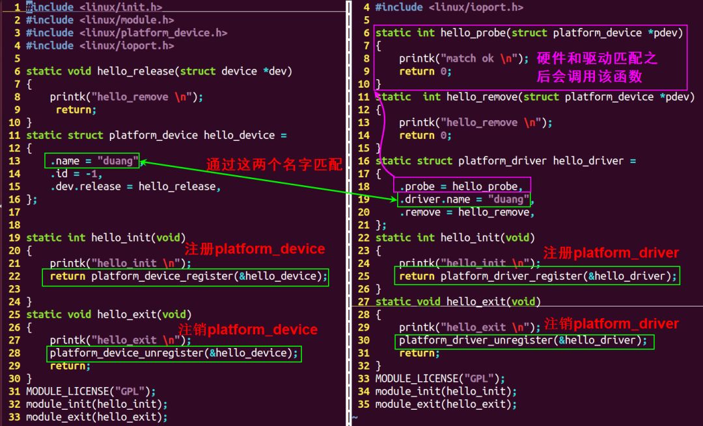
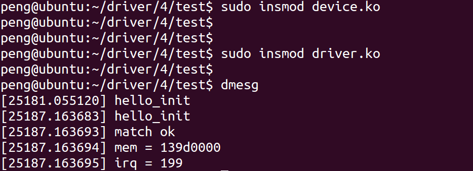

platform总线是学习linux驱动必须要掌握的一个知识点。

本文参考已发布：Linux 3.14内核

# 一、概念

嵌入式系统中有很多的物理总线：I2c、SPI、USB、uart、PCIE、APB、AHB

linux从2.6起就加入了一套新的驱动管理和注册的机制platform平台总线，是一条虚拟的总线,并不是一个物理的总线。

相比 PCI、USB，它主要用于描述SOC上的片上资源。platform 所描述的资源有一个共同点：在CPU 的总线上直接取址。

平台设备会分到一个名称（用在驱动绑定中）以及一系列诸如地址和中断请求号（IRQ）之类的资源。

设备用platform_device表示，驱动用platform_driver进行注册。

与传统的bus/device/driver机制相比，platform由内核进行统一管理，在驱动中使用资源，提高了代码的安全性和可移植性。

# 二、platform

## 1. platform总线两个最重要的结构体

### platform_driver

~~~ c
struct platform_driver {
 int (*probe)(struct platform_device *);  //
 int (*remove)(struct platform_device *);
 void (*shutdown)(struct platform_device *);
 int (*suspend)(struct platform_device *, pm_message_t state);
 int (*resume)(struct platform_device *);
 struct device_driver driver;
 const struct platform_device_id *id_table;
 bool prevent_deferred_probe;
};
~~~

该结构体，用于注册驱动到platform总线，

| 成员                                      | 含义                                                         |
| ----------------------------------------- | ------------------------------------------------------------ |
| probe                                     | 当驱动和硬件信息匹配成功之后，就会调用probe函数，驱动所有的资源的注册和初始化全部放在probe函数中 |
| remove                                    | 硬件信息被移除了，或者驱动被卸载了，全部要释放，释放资源的操作就放在该函数中 |
| struct device_driver driver               | 内核维护的所有的驱动必须包含该成员，通常driver->name用于和设备进行匹配 |
| const struct platform_device_id *id_table | 往往一个驱动可能能同时支持多个硬件，这些硬件的名字都放在该结构体数组中 |

我们编写驱动的时候往往需要填充以上几个成员

### platform_device

platform总线用于描述设备硬件信息的结构体，包括该硬件的所有资源（io，memory、中断、DMA等等）。

~~~ c
struct platform_device {
 const char *name;
 int  id;
 bool  id_auto;
 struct device dev;
 u32  num_resources;
 struct resource *resource;

 const struct platform_device_id *id_entry;

 /* MFD cell pointer */
 struct mfd_cell *mfd_cell;

 /* arch specific additions */
 struct pdev_archdata archdata;
};
~~~

| 成员                         | 含义                                   |
| ---------------------------- | -------------------------------------- |
| const char	*name          | 设备的名字，用于和驱动进行匹配的       |
| struct device	dev         | 内核中维护的所有的设备必须包含该成员， |
| u32	num_resources         | 资源个数                               |
| struct resource	*resource | 描述资源                               |

struct device	dev->release()必须实现，

其中描述硬件信息的成员struct resource

0x139d0000

~~~ c
struct resource {
 resource_size_t start;  //表示资源的起始值，           
 resource_size_t end;    //表示资源的最后一个字节的地址， 如果是中断，end和satrt相同
 const char *name;   // 可不写  
 unsigned long flags; //资源的类型
 struct resource *parent, *sibling, *child;
};
flags的类型说明

#define IORESOURCE_MEM  0x00000200    //内存
#define IORESOURCE_IRQ  0x00000400    //中断
~~~

内核管理的所有的驱动，都必须包含一个叫**struct device_driver**成员，  //男性描述的硬件，必须包含**struct device**结构体成员。                 //女性

~~~ c
struct device_driver {
 const char  *name;      
 struct bus_type  *bus;

 struct module  *owner;
 const char  *mod_name; /* used for built-in modules */

 bool suppress_bind_attrs; /* disables bind/unbind via sysfs */

 const struct of_device_id *of_match_table;
 const struct acpi_device_id *acpi_match_table;

 int (*probe) (struct device *dev);
 int (*remove) (struct device *dev);
 void (*shutdown) (struct device *dev);
 int (*suspend) (struct device *dev, pm_message_t state);
 int (*resume) (struct device *dev);
 const struct attribute_group **groups;

 const struct dev_pm_ops *pm;

 struct driver_private *p;
};
~~~

其中：

~~~ c
const char  *name;
~~~

用于和硬件进行匹配。

内核描述硬件，必须包含**struct device**结构体成员：

~~~ c
struct device {
 struct device  *parent;

 struct device_private *p;

 struct kobject kobj;
 const char  *init_name; /* initial name of the device */
 const struct device_type *type;

 struct mutex  mutex; /* mutex to synchronize calls to
      * its driver.
      */

 struct bus_type *bus;  /* type of bus device is on */
 struct device_driver *driver; /* which driver has allocated this
        device */
 void  *platform_data; /* Platform specific data, device
        core doesn't touch it */
 struct dev_pm_info power;
 struct dev_pm_domain *pm_domain;

#ifdef CONFIG_PINCTRL
 struct dev_pin_info *pins;
#endif

#ifdef CONFIG_NUMA
 int  numa_node; /* NUMA node this device is close to */
#endif
 u64  *dma_mask; /* dma mask (if dma'able device) */
 u64  coherent_dma_mask;/* Like dma_mask, but for
          alloc_coherent mappings as
          not all hardware supports
          64 bit addresses for consistent
          allocations such descriptors. */

 struct device_dma_parameters *dma_parms;

 struct list_head dma_pools; /* dma pools (if dma'ble) */

 struct dma_coherent_mem *dma_mem; /* internal for coherent mem
          override */
#ifdef CONFIG_DMA_CMA
 struct cma *cma_area;  /* contiguous memory area for dma
        allocations */
#endif
 /* arch specific additions */
 struct dev_archdata archdata;

 struct device_node *of_node; /* associated device tree node */
 struct acpi_dev_node acpi_node; /* associated ACPI device node */

 dev_t   devt; /* dev_t, creates the sysfs "dev" */
 u32   id; /* device instance */

 spinlock_t  devres_lock;
 struct list_head devres_head;

 struct klist_node knode_class;
 struct class  *class;
 const struct attribute_group **groups; /* optional groups */

 void (*release)(struct device *dev);
 struct iommu_group *iommu_group;

 bool   offline_disabled:1;
 bool   offline:1;
};
~~~

其中：

~~~ c
void (*release)(struct device *dev);
~~~

不能为空。

## 2. 如何注册

要用注册一个platform驱动的步骤

1）注册驱动platform_device_register

~~~ c
/**
 * platform_device_register - add a platform-level device
 * @pdev: platform device we're adding
 */
int platform_device_register(struct platform_device *pdev)
{
 device_initialize(&pdev->dev);
 arch_setup_pdev_archdata(pdev);
 return platform_device_add(pdev);
}
~~~

2） 注册设备platform_driver_register

~~~ c
#define platform_driver_register(drv) \
 __platform_driver_register(drv, THIS_MODULE)
~~~

# 三、举例

## 1. 开发步骤

platform 总线下驱动的开发步骤是：

### 设备

需要实现的结构体是：platform_device 。

1）初始化 resource 结构变量

2）初始化 platform_device 结构变量

3）向系统注册设备：platform_device_register。

以上三步，必须在设备驱动加载前完成，即执行platform_driver_register（）之前，原因是驱动注册时需要匹配内核中所有已注册的设备名。

platform_driver_register（）中添加device到内核最终还是调用的device_add函数。

Platform_device_add和device_add最主要的区别是多了一步insert_resource（p, r），即将platform资源（resource）添加进内核，由内核统一管理。

### 驱动

驱动注册中，需要实现的结构体是：platform_driver 。

在驱动程序的初始化函数中，调用了platform_driver_register（）注册 platform_driver 。

需要注意的是：platform_driver 和 platform_device 中的 name 变量的值必须是相同的【**在不考虑设备树情况下**，关于设备树，后面会写新的文章详细讲述】 。

这样在 platform_driver_register（） 注册时，会将当前注册的 platform_driver 中的 name 变量的值和已注册的所有 platform_device 中的 name 变量的值进行比较，只有找到具有相同名称的 platform_device 才能注册成功。

当注册成功时，会调用 platform_driver 结构元素 probe 函数指针。

## 实例1

本例比较简单，只用于测试platform_driver 和platform_device是否可以匹配成功。



左边是platform_device结构体注册的代码，右边是platform_driver结构体注册的代码。

platform_driver 定义和注册：

~~~ c
1 #include <linux/init.h>
  2 #include <linux/module.h>
  3 #include <linux/platform_device.h>
  4 #include <linux/ioport.h>
  5 
  6 static int hello_probe(struct platform_device *pdev)
  7 {
  8     printk("match ok \n");
  9     return 0;
 10 }
 11 static  int hello_remove(struct platform_device *pdev)
 12 {
 13     printk("hello_remove \n");
 14     return 0;
 15 }
 16 static struct platform_driver hello_driver =
 17 {
 18     .probe = hello_probe,
 19     .driver.name = "duang",
 20     .remove = hello_remove,     
 21 };
 22 static int hello_init(void)
 23 {
 24     printk("hello_init \n");
 25     return platform_driver_register(&hello_driver);
 26 }
 27 static void hello_exit(void)
 28 {
 29     printk("hello_exit \n");
 30     platform_driver_unregister(&hello_driver);
 31     return;
 32 }
 33 MODULE_LICENSE("GPL");
 34 module_init(hello_init);
 35 module_exit(hello_exit);
~~~

platform_device定义和注册：

~~~ c
 1 #include <linux/init.h>                                                                                                                                                        
  2 #include <linux/module.h>
  3 #include <linux/platform_device.h>
  4 #include <linux/ioport.h>
  5 
  6 static void hello_release(struct device *dev)
  7 {
  8      return;
  9 }
 10 static struct platform_device hello_device =
 11 {
 12     .name = "duang",
 13     .id = -1,
 14     .dev.release = hello_release,
 15 };
 16 
 17 
 18 static int hello_init(void)
 19 {
 20     printk("hello_init \n");
 21     return platform_device_register(&hello_device);
 22 
 23 }
 24 static void hello_exit(void)
 25 {
 26     printk("hello_exit \n");
 27     platform_device_unregister(&hello_device);
 28     return;
 29 }
 30 MODULE_LICENSE("GPL");
 31 module_init(hello_init);
 32 module_exit(hello_exit);
~~~

该程序只用于测试platform框架是否可以成功匹配，struct platform_device hello_device 并没有设置任何硬件信息。

**Makfile**

~~~ makefile
  1 ifneq ($(KERNELRELEASE),)                                                                                                                                                      
  2 obj-m:=device.o driver.o
  3 else
  4 KDIR :=/lib/modules/$(shell uname -r)/build
  5 PWD  :=$(shell pwd)
  6 all:
  7     make -C $(KDIR) M=$(PWD) modules
  8 clean:
  9     rm -f *.ko *.o *.mod.o *.symvers *.cmd  *.mod.c *.order
 10 endif
~~~

该makefile可以同时将两个C文件编译成ko文件。

加载模块

~~~ bash
清空log信息
sudo dmesg -c
~~~

## 实例2

给结构体platform_device 增加硬件信息，并在内核中能够读取出来。本例向结构体hello_device 增加信息如下：

1. 基址寄存器地址0x139d0000，该地址的空间是0x4
2. 中断号199 【注意】 实际的内核中会把外设的中断号根据HW id（通常soc厂商设备soc的时候会给每一个中断源定义好唯一的ID）计算出一个新的中断号，该中断号会被cpu所识别。

device.c

~~~ c
struct resource res[]={
 [0] ={
  .start = 0x139d0000,
  .end  = 0x139d0000 + 0x3,
  .flags = IORESOURCE_MEM,
 },

 [1] ={
  .start = 199,
  .end  = 199,
  .flags = IORESOURCE_IRQ,
 }, 
};
static struct platform_device hello_device = 
{
 .name = "duang",
 .id = -1,
 .dev.release = hello_release, 
 .num_resources = ARRAY_SIZE(res),
 .resource = res,
};
~~~

driver.c

~~~ c

static int hello_probe(struct platform_device *pdev)
{
 printk("match ok \n");

 printk("mem = %x \n",pdev->resource[0].start);
 printk("irq = %d \n",pdev->resource[1].start);

 //注册中断、申请内存
 return 0;
}
~~~

重新编译，卸载第一个例子的模块，并清除log：

~~~ bash
make
sudo rmmod device 
sudo rmmod driver
sudo dmesg -c
~~~

执行



由结果可知，probe函数正确读取到了硬件信息。

# 四、platform_device是如何管理的？

## 1. 没有设备树

在没有设备树的时候，以三星**Cortex-A8  s5pc100**为例，硬件信息放在以下位置

~~~ c
arch\arm\mach-s5pc100\Mach-smdkc100.c
arch\arm\plat-samsung\
~~~


该数组存放了，内核启动需要初始化的硬件的信息。

## 2. 如果有设备树

内核会有设备初始化的完整代码，会在内核启动的时候把设备树信息解析初始化，把硬件信息初始化到对应的链表中。在总线匹配成功后，会把硬件的信息传递给probe()函数。

# 四、总线相关的其他的知识点

## 1. 内核总线相关结构体变量

内核维护的所有的总线都需要用以下结构体注册一个变量。

~~~ c
struct bus_type {
 const char  *name;
 const char  *dev_name;
 struct device  *dev_root;
 struct device_attribute *dev_attrs; /* use dev_groups instead */
 const struct attribute_group **bus_groups;
 const struct attribute_group **dev_groups;
 const struct attribute_group **drv_groups;

 int (*match)(struct device *dev, struct device_driver *drv);
 int (*uevent)(struct device *dev, struct kobj_uevent_env *env);
 int (*probe)(struct device *dev);   
 int (*remove)(struct device *dev);
 void (*shutdown)(struct device *dev);

 int (*online)(struct device *dev);
 int (*offline)(struct device *dev);

 int (*suspend)(struct device *dev, pm_message_t state);
 int (*resume)(struct device *dev);

 const struct dev_pm_ops *pm;

 struct iommu_ops *iommu_ops;

 struct subsys_private *p;
 struct lock_class_key lock_key;
};
~~~

platform总线变量的定义**struct bus_type platform_bus_type**定义如下：

~~~ c

struct bus_type platform_bus_type = {
 .name  = "platform",
 .dev_groups = platform_dev_groups,
 .match  = platform_match,
 .uevent  = platform_uevent,
 .pm  = &platform_dev_pm_ops,
};
~~~

其中最重要的成员是**.match**。

当有设备的硬件信息注册到platform_bus_type 总线的时候，会遍历所有platform总线维护的驱动， 通过名字来匹配，如果相同，就说明硬件信息和驱动匹配，就会调用驱动的platform_driver ->probe函数,初始化驱动的所有资源，让该驱动生效。

当有设备的驱动注册到platform_bus_type 总线的时候，会遍历所有platform总线维护的硬件信息， 通过名字来匹配，如果相同，就说明硬件信息和驱动匹配，就会调用驱动的platform_driver ->probe函数,初始化驱动的所有资源，让该驱动生效。

**注册位置**

> ```
> drivers\base\Platform.c
> ```


# 五、注册代码流程详解

捋架构的好处，就是可以帮助我们定位问题

## 1. match函数何时被调用到？

## 2. probe函数何时被调用到

以下是上述两个问题代码的调用流程：


后面我们会再详细介绍设备树。

