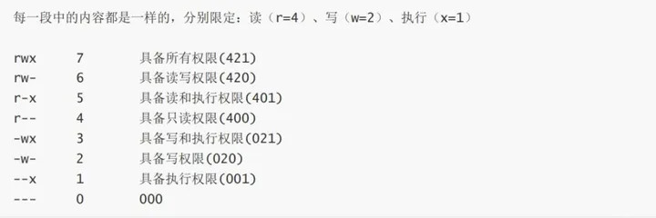

<center>嵌入式 Linux 软件指南</center>

# 序言

# 目录


# 第一章：Linux 概论

## 1. Linux 操作系统历史

### 1.1、创世纪的 UNIX

追溯 Linux 的历史，要从 UNIX 的诞生开始说起。

UNIX 操作系统是由肯•汤普森（Ken Thompson）和丹尼斯•里奇（Dennis Ritchie）合作创造的。关于 UNIX 的部分技术思路则是来源于当时的大型机 Multics 工程计划，该计划是由贝尔实验室、美国麻省理工学院和通用电气公司联合发起，目标是取代当时的批处理操作系统，拥有多道程序的分时处理能力，能够同时为多个机构和公司提供计算支持。这个愿望是非常美好的，美好到以至于目标太过于庞大与空洞，导致 Multics 的开发人员都不知道该做成什么样子才能满足公司对这个工程的要求，所以计划失败了。Multics 虽然失败了，肯•汤普森的故事还在继续。


肯•汤普森出于自己玩 Space Travel 的需求在 Multics 失败后，决定编写一个较小的操作系统来替代 Mutics，小到能够运行在 Digital PDP-7 小型机上。肯参考了 Mutics 中的一些功能设计，编写出了一个能够满足基本功能的分时操作系统。同组人员为了调侃这个只支持两个用户的系统便称这个系统为 UNICS（Uniplexed Information and Computing System）。后来，随着 UNICS 这个名字的传播，谐音的 UNIX 明显更受大家欢迎，于是这个分时系统被正式命名为 UNIX 。


UNIX 最初是由汇编编写的，运行在上面的一些应用则是由 B 语言和汇编语言混合编写而成。由于 B 语言在进行系统编程时总是处处受挫，所以汤普逊和里奇对其进行了改造和扩展，完成后的语言和原来的 B 语言差异较大，所以被命名为 C 语言。C 语言的高效和强大使得编写操作系统变成了可能。汤普逊和里奇在 1973 年中用 C 语言重写了 Unix ，这个首次不是用汇编编写的操作系统成为了当时操作系统届最大胆的创新，也非常具有革命意义。C 语言的简洁紧凑、易移植、易读、易修改的特性赋予了 UNIX 强大的生命力，为 UNIX 的发展奠定了坚实的基础。

1974 年，汤普逊和里奇合作在 《ACM 通信》上发表了一篇关于 UNIX 的文章《The UNIX Time-Sharing System》。这篇文章系统的介绍了 UNIX 的目标与实现，UNIX 特性：采用 C 高级语言编写、简单的用户交互 Shell 、高效便捷的树形文件系统、文件，设备，设备的统一处理、内核和核外程序的有机组合、丰富的系统程序。当时计算机大多还处于批处理阶段，这样的系统迅速的在计算机存在的地方运行了起来。

UNIX 的流行和发展并没有给诞生它的 AT&T 公司带来多少利益，但是 AT&T 却在 UNIX 中做了不少的投入。为了取得回报，1982年，AT&T 基于版本 7 开发了UNIX System Ⅲ 的第一个版本，这是一个商业版本仅供出售。同时这个新的 UNIX 商业发布版本不再包含源代码。

UNIX 的哲学 KISS（keep it simple, stupid）成为了程序开发的基础哲学之一。

### 1.2、UNIX 与 MINIX

20世纪80年代，由于 AT&T 所有的 UNIX 版权的限制和闭源的操作，荷兰的 Andrew S. Tanenbaum 教授在 1987 年决定写一个不包含任何 AT&T 源代码的 UNIX 系统，名为 MINIX（即小型的 UNIX ），并开放全部源代码给大学教学和研究工作，Minix 于 2000 年重新改为BSD授权，成为自由和开放源码软件，为全球注册商标。


MINIX 属于微内核，对于宏内核的 UNIX 来说，它的内核更小，提供的功能也仅限于线程管理，内存管理和进程间通信。其余的如文件系统，设备驱动等，都是由多进程的组件提供。这种驱动由进程隔离的方式使得系统的各种服务不会相互的影响，同时缺点也是致命致命的，频繁的系统调用会造成频繁的进程切换，而系统切换带来的性能损失是不不可忽略的。

MINIX 的设计目标就是用于大学的教学和研究，所以作为它的开发者 Andrew S. Tanenbaum 教授不愿意在这个系统上添加过多的功能。MINIX 的诞生在计算机历史上并没有掀起多大的波浪，但是它为计算机的教育事业作出的贡献确实巨大的。MINIX 之父 Andrew S. Tanenbaum 的经典之作《操作系统设计与实现》，给 Linux 操作系统的创造者 Linus Torvalds 带来了很大的启发，而 Linux 给世界带来了巨大的改变。

### 1.3、LINUX

在同一时刻，操作系统届有着百花切放，百家争鸣的现状。MINIX 虽然也开源，但是其教育系统的特性不愿意添加太多的代码，使其一直停留不前。同为微内核 GNU Hurd 内核由于设计的激进也是迟迟的难产。由 UNIX 衍生出的各种 UNIX 系操作系统大多是闭源的，BSD 虽然为开源系统，但其和 UNIX 的司法官司一直打到了 1994 年 1 月。这桩法律诉讼将 BSD 后续的开发，特别是自由软件，延迟了两年，而没有法律问题的 Linux 内核在这段时间获得了极大的支持。Linux 跟 386BSD 的开发几乎同时起步，Linus 说，当时如果有自由的基于 386 的 Unix-like 操作系统，他就可能不会创造 Linux 。

Linux 内核最初是由林纳斯•托瓦兹（Linus Torvalds）在赫尔辛基大学读书时出于个人爱好而编写的，当时他只是觉得教学用的迷你版 UNIX 操作系统 Minix 能用的东西太少了，也可能是出于实用主义。于是决定自己开发一个操作系统。第 1 版本于 1991 年 9 月在 MINIX 的新闻组论坛上发布，当时仅有 10000 多+行代码。刚开始只有很少的操作系统爱好者在讨论这个系统，并为这个操作系统编写补丁和更多的支持。随着 Linux 在爱好者的支持下，系统越发的完善，论坛上讨论 Linux 的声音也越来越多。渐渐最初的 MINIX 论坛上只剩下讨论 Linux 的声音了。Linux 最初的名字叫 FreaX ,寓意“自由”以及“奇特”,最后带上了一个常用字母X作为结尾,类似与 Unix 之类的系统一样。但是后来以为管理员觉得 FreaX 不好听,而且难念,所以就改成了 Linux ,前面直接取自开发者 Linus ,加上 X 后缀就成了 。

继承于 UNIX 的传统，标准的 POSIX 操作系统接口，开源的特性以及合适的操作系统空窗期让 Linux 在全世界快速的流行起来。随着全世界的工程师的参与，Linux 具备了一个现代操作系统所有的属性：多任务处理（Multitasking）、多用户支持（Multiuser）、虚拟内存（Virtual Memory）、文件系统（File System）、设备驱动程序（Device Drivers）、网络支持（Networking）、安全性（Security）、任务调度（Scheduling）、错误检测和恢复（Error Detection and Recovery）、用户界面命令解释器（Shell）、图形用户界面（Graphical User Interface，GUI）。而在其之上的各种应用软件生态覆盖了各行各业。Linux 运行在各种计算机硬件设备中，比如手机、平板电脑、路由器、视频游戏控制台、台式计算机、大型机和超级计算机。

严格来讲，Linux 这个词本身只表示 Linux 内核，但实际上人们已经习惯了用 Linux 来形容整个基于 Linux 内核，并且使用 GNU 工程各种工具和数据库的操作系统。

Linux 是一个开源系统，开源也是 Linux 最大的优势。林纳斯•托瓦兹没有保留 Linux 源代码的版权，在公开源码的同时欢迎任何人给 Linux 提供修改代码。同时 Linux 也是免费的，意味着你可以不花一分钱就可以使用到 Linux 强大的操作系统和完善的软件生态。为了更好的管理和协作，Linux 加入了自由软件基金会，有自由的 GPL 许可证。

1996年，Torvalds 为 Linux 选定了企鹅作为它的吉祥物。Larry Ewing 提供了吉祥物的初稿。为什么是一只企鹅，据说是因为 Linus 小时候被企鹅咬过，也有解释是企鹅是南极洲的标志性动物，根据国际公约，南极洲为全人类共同所有，不属于世界上的任何国家，任何国家都无权将南极洲纳入其版图。Linux 选择企鹅图案作为 Logo，其含义是：开放源代码的 Linux 为全人类共同所有，可公司无权将其私有。


Linux 拥有庞大的社区和社区管理人员，Linus 拥有 Linux 代码的裁定权，能够决定什么样的代码能够合并到 Linux 内核中，而 Linux 各个系统的管理员会审核其他开发者给提交到 Linux 子系统的代码，经过测试后提交给 Linux 等待合并。如同 Linux 的树形文化一样，Linux 社区也呈现出完全树型的结构。层层的管理级别并没有拖乱 Linux 的发展进度，Linux 内核可以让所有人参与进来，非常严谨，只要有错误，任何人都可以修改它。在 Linux git 仓库中的 commit 号为 690b0543a813b0ecfc51b0374c0ce6c8275435f0 的补丁就是一位小女孩提出的。


虽然只是添加了一个字符，但是更改的理由是补丁作者的女儿发现那个 「 s 」字母很孤单，用她的话说是不开心，加上「 - 」后就显得开心了。最终 Linus 同意了这个补丁的合并请求，因为 Linux 是严谨的，人人可参与的。

Linux 的社区非常的活跃，全世界的开发者都在为 Linux 的驱动做着贡献。Linux 的可移植性使得 Linux 往往会被很快的移植到新的 CPU 设备中。就这样硬件成就着软件，软件也在成就着硬件。
- 1983年：Richard Stallman 创建了以创建一个自由的操作系统为目标的 GNU 计划。

- 1989年：Richard Stallman 撰写了第一版的 GNU GPL。

- 1991年：第一个版本 0.0.2 发布，代码只有约一万行。
- 1992年：Linux0.96 拥有 4 万行代码，大约 1000 人使用且大部分是黑客。
- 1993年：Linux0.99 发布，代码量 10 万行，用户约 2 万，采用 GUN 的 GPL 协议。
- 1994: 3 月, Torvalds 认为内核的所有组件已经完全成熟，他放出了 Linux 的 1.0 版本。XFree86 项目组提供了一个图形化用户界面（GUI）.同年 Red Hat 公司和 SUSE 发行了他们各自的 Linux 1.0 分发版本。
- 1995: Linux 被移植到 DEC Alpha 和 Sun 公司的 SPARC 平台上，而在接下来的几年里它又被广泛地移植到更多的平台上。
- 1996: Linux 内核 2.0 版本发布。此时内核已经支持多处理器，因而成为各大公司的绝佳选择。
- 1998：很多大公司，诸如 IBM, Compaq ，Oracle 表示支持 Linux 系统。另外，一部分程序员开始了图形化用户界面 KDE 的开发。
- 1999：一些程序员开始致力于开发图形化环境 GNOME ，它可以替代依靠 Qt 工具包才能工作的 KDE 。在这一年里 IBM 宣布了一项支持 Linux 的浩大的工程。
- 2004: XFree86 小组分裂，同现有的 X Windows 标准组织 共同成立 http://X.Org 基金会，促使了 X Window ServerLinux 版本极其快速而迅猛的发展。


~Linux内核代码的发展~


~Unix谱系~

Linux 的历史也不是一片平坦，在其刚发布的时候就引来了 “Linux 已经过时的言论”。

1992 年，MINIX 的作者 Andrew S. Tanenbaum，在新闻组 comp.os.minix 上发表了一篇《LINUX is obsolete》的文章，批判了在 1991 年写一个宏内核系统真是一个糟糕的主意。Linus 也有力的回击了 Andrew 的评论，如果微内核当前已经成熟可用的话，他也不用大费周章的编写 Linux 操作系统了。但在 21 世纪的现在来看，Linux 系统经受住了历史的考验，我们的 Linux 系统依然稳健的运行在各类硬件上。

自由与商业的竞争。苹果曾聘请过 Torvalds ，因为理念不和而分道扬镳。微软和 Linux 阵营在 1997 年到 2001 年间还是有着很多敌对的情况。这种情况在 1998 年 Eric S. Raymond 发表《万圣节文件》的时候变得明显起来。这里由一位微软工程师写的关于寻求解决自由软件对微软的威胁的策略的文章。

SCO-Linux 争议。2003 年 3 月，SCO  Group 指责 IBM 把 UNIX 的代码移植到 Linux 侵犯了他们的版权。SCO 声称它们拥有代码的版权并 IBM 提起了诉讼。Red  Hat 又提起了反诉讼，因此 SCO 又提起了其他相关的诉讼。在这些诉讼进行的同时，SCO 开始把 Linux 的许可权卖给那些不愿意冒受 SCO 投诉的险的用户。因为 Novell 也声称拥有 UNIX 的版权，所以它又对 SCO 提起了诉讼，接着 SCO 便声明破产了。

Linux 诞生的时候并没有多么注意商标，虽然一直使用 Linux 的名称。直到从 1994 年开始，越来越多不同国家的人想要将 Linux 注册成自己的商标然后收取金。Linux 的开发人员非常反感这种做法，后来，Torvalds 在 Linux 国际的帮助下得到了 Linux 这个商标，随后他把这个商标转让给了 Linux 国际。目前这个商标的保护由一个专门的基金会——非营利性的Linux标识协会——来管理。


## 2、 linux 操作系统和常用命令

### 2.1、认识 Linux

Linux 是一个现代操作系统内核，它提供的主要功能是管理好计算机中的硬件，尽可能的屏蔽好各类硬件的差异，为计算机中的软件提供一个标准的统一调用接口。为什么要拥有一个这样的内核呢，这涉及到软件和硬件的协调了。软件是运行在硬件之上的，更具体的说是 CPU 中央处理器提供了基本的动作，这些动作被称为指令集，我们编排好一条条指令，这些指令按照规则组合起来后，就可以称之为软件，软便是松软可变动的意思，意味这软件是随时可变的。但是硬件不一样，硬件在制造好之后，就不会再改变了。在今天，我们研发出了各种个样的硬件，就比如组成计算机的几大件：CPU、内存、硬盘、主板、鼠标、键盘等，不同的厂商造出来的东西都不一样。同样的，不同的硬件就会用不同的动作，不同的动作对应着不同的指令，软件如何想让这些硬件正常的工作起来，那就要添加各种动作，编写软件的人还要思考如何协调好这么多的硬件。面对着越来越庞大的计算机体系，个人的能力是非常有限的，要多个人考虑合作。而考虑合作，就需要有序的沟通，所以对于计算机来说，操作系统内核就出来了，有人负责整个操作系统架构，有人负责具体的各个硬件驱动，也有人负责写其他的程序，需要的时候调用这个操作系统提供的接口就可以了。这下不同的事情就可以交给不同的人来做，分工好了，面对再复杂的事情我们都能化整为零完美解决了。

#### 内核

计算机中的软件大致分为两类：系统软件和应用软件。系统软件的任务是管理自身和计算机硬件，应用软件是用来执行用户需要的功能。内核是最基本的系统软件，它是计算机中所有应用软件运行的基石。

#### 用户

Linux 相当于一座大房子，Linux 的用户则相当于房子的主人或者房子的住户，Linux 基于用户身份对资源访问进行控制。

Linux 用户账号分为三类：

- 超级用户：root 用户是 Linux 操作系统中默认的超级用户账号，对本主机拥有最高的权限，系统中超级用户是唯一的。
- 普通用户：由 root 用户或其他管理员用户创建，拥有的权限会受到限制，一般只在用户自己的宿主目录中拥有完整权限。
- 程序用户：在安装 Linux 操作系统及部分应用程序时，会添加一些特定的低权限用户账号，这些用户一般不允许登录到系统，仅用于维持系统或某个程序的正常运行，如 bin、daemon、ftp、mail 等。


#### 用户账户管理


~用户帐户操作~

与 Linux 用户相关的文件为 /etc/passwd。

```bash
nihao@nihao-z690:~$ cat /etc/passwd
root:x:0:0:root:/root:/bin/bash
daemon:x:1:1:daemon:/usr/sbin:/usr/sbin/nologin
bin:x:2:2:bin:/bin:/usr/sbin/nologin
sys:x:3:3:sys:/dev:/usr/sbin/nologin
sync:x:4:65534:sync:/bin:/bin/sync
man:x:6:12:man:/var/cache/man:/usr/sbin/nologin
kernoops:x:113:65534:Kernel Oops Tracking Daemon,,,:/:/usr/sbin/nologin
avahi:x:114:121:Avahi mDNS daemon,,,:/run/avahi-daemon:/usr/sbin/nologin
nihao:x:1000:1000:nihao,,,:/home/nihao:/bin/bash
sshd:x:129:65534::/run/sshd:/usr/sbin/nologin
```

/etc/passwd 是一个系统文件，而不是目录。它是一个文本文件，用于存储系统中所有用户账户的基本信息。

每一行代表一个用户账户，字段之间使用冒号进行分隔，通常包含以下信息：
```
[用户名]:x:[UID]:[GID]:[用户描述信息]:[主目录]:[登陆后默认使用的 Shell]
```
- 用户名：标识用户的唯一名称。

- 密码占位符：在过去，密码哈希值存储在此处，现在则通常为 "x" 表示密码已被移动到 /etc/shadow 文件中。
- 用户标识号（UID）：每个用户都有一个唯一的数字标识。
- 组标识号（GID）：指定用户所属的主要组的标识号。
- 用户描述信息：包含有关用户的备注信息或全名等。
- 主目录：用户登录后的起始目录。
- Shell：定义用户登录后默认使用的 shell。

**useradd 添加用户**

基本语法：useradd 用户名（功能描述：添加新用户）

案例：[root@~]#useradd hadoop

**userdel 删除用户**

基本语法：

userdel 用户名（功能描述：删除用户但保存用户主目录）

userdel -r 用户名（功能描述：用户和用户主目录，都删除）

案例：

删除用户但保存用户主目录: [root@~]#userdel hadoop
删除用户和用户主目录:[root@~]#userdel -r hadoop

**passwd 设置用户密码**

基本语法：passwd 用户名（功能描述：设置用户密码）

案例：

```bash
root@M5Core135:~# useradd dianjixz
root@M5Core135:~# passwd dianjixz
New password: 
Retype new password: 
passwd: password updated successfully
root@M5Core135:~# 
```

**id 判断用户是否存在**

基本语法：id 用户名

**su 切换用户**

基本语法：

su 用户名称（功能描述：切换用户，只能获得用户的执行行权限，不能获得环境变量）su - 用户名称（功能描述：切换到用户并获得该用户的环境变量及执行权限）

案例:
```bash
[root@~]#su hadoop
[root@~]#su - hadoop
```

**who查看登录用户信息**

基本语法:

whoami（功能描述：显示自身用户名称）
who am i（功能描述：显示登录用户的用户名）
who（功能描述：看当前有哪些用户登录到了了本台机器器上）

#### 用户组管理

Linux 作为多用户、多任务的系统，为了提供更好的用户管理和权限控制机制，使系统管理员能够更高效地管理用户、控制权限，并对文件和目录进行适当的保护。其引入了用户组概念，通过用户组可以简化管理过程，提高系统的安全性和可管理性。

- 基本组（私有组） ：基本组账号只有一个，一般为创建用户时指定的组。
- 附加组（公共组） ：用户除了基本组以外，额外添加指定的组。附加组可以有多个，可以在基本组，也可以同时在附加组


"/etc/group" 是 Linux 系统中的一个文件，用于存储系统中所有用户组的信息。每一行代表一个用户组，它包含了用户组的名称、组密码（通常为空）、组标识号（GID）以及属于该用户组的用户列表。

**groupadd 新增组**

基本语法: groupadd 组名

案例：

增加一个 hadoop 组：groupadd hadoop
**groupdel 删除组**

基本语法：groupdel 组名

案例：

删除 hadoop 组：groupdel hadoop
**groupmod 修改组**

基本语法：groupmod -n 新组名 老组名

案例：

修改 hadoop 组名称为 hadoop1 : groupmod -n hadoop1 hadoop
**查看创建了哪些组**

基本语法：cat /etc/group
**usermod 修改用户所属组**

基本语法：usermod -g 用户组 用户名

案例：

将用户 hadoop 加入 mygroup 用户组：sermod -g mygroup hadoop


#### 用户的密码管理


>注意：只有root管理员才可以修该其他用户的密码，普通账户只能修改自己的密码，并且普通用户没有修改其他用户密码的权限

在 linux 密码管理中，我们还应该熟悉密码策略的配置，如：

密码策略：可以通过配置文件或者命令来设置密码策略，以限制密码的复杂度和有效期限。密码策略通常包括以下内容：

- 密码长度：设置密码的最小长度要求。
- 复杂度要求：可以要求密码包含字母、数字、特殊字符等不同类型的字符。
- 历史密码限制：禁止用户在一段时间内重复使用先前使用过的密码。
- 密码有效期：设置密码的有效期限，过了有效期后需要用户更改密码。
- 警告通知：在密码即将过期之前发送警告通知给用户。

`chage` 命令：`chage` 命令用于修改用户的密码策略，比如修改密码过期时间、密码失效时间等。可以使用 `chage -l username` 查看用户当前的密码策略信息，使用 `chage -m` 修改密码最小长度，使用 `chage -M` 修改密码有效期等。

   `/etc/pam.d/` 目录中的配置文件：PAM 是 Linux 中的身份验证管理机制，可以通过修改 `/etc/pam.d/` 目录下的文件来配置密码策略。常见的文件有 `common-password` 和 `system-auth` 等，可以在文件中配置密码策略规则。

密码加密算法：Linux 使用密码哈希算法（如 MD5、SHA-256、SHA-512）将用户密码进行加密存储，以确保密码的安全性。

`/etc/shadow`是一个重要的系统文件，它存储了用户的加密密码和相关的账户信息。该文件只能由系统管理员或具有特权的用户访问。其中包含了每个用户账户的密码哈希值、上次修改密码的时间、密码过期时间、账号是否被锁定等信息。这里的密码哈希值是用户密码经过加密处理后的结果，实际密码并不存储在该文件中。通过将用户输入的密码与保存在`/etc/shadow`中的密码哈希值进行比对，系统可以验证用户的身份。

#### 用户的权限管理

>Linux系统一般将文件可存/取访问的身份分为 3 个类别：owner、group、others，且 3 种身份各有 read、write、execute 等权限。

在多用户（可以不同时）计算机系统的管理中，权限是指某个特定的用户具有特定的系统资源使用权力，像是文件夹、特定系统指令的使用。

**常见权限**

在 Linux 中，文件和目录的权限是由三个基本权限位来控制的，分别是读取权限（r）、写入权限（w）和执行权限（x）。这些权限位可以分别应用于文件的所有者、所属组和其他用户。以下是更详细的说明：

- 读取权限（r）：读取权限允许用户查看文件的内容或目录的列表。对文件而言，具有读取权限的用户可以读取文件的内容；对目录而言，具有读取权限的用户可以列出目录中的文件和子目录。

- 写入权限（w）：写入权限允许用户修改文件的内容或目录的结构。对文件而言，具有写入权限的用户可以编辑或修改文件的内容；对目录而言，具有写入权限的用户可以创建、删除或重命名文件和子目录。

- 执行权限（x）：执行权限允许用户执行可执行文件或进入目录。对文件而言，具有执行权限的用户可以运行该文件作为程序；对目录而言，具有执行权限的用户可以进入该目录并访问其中的文件和子目录。

- 设置权限：可以使用 chmod 命令来设置文件和目录的权限。例如，使用以下命令将文件设置为所有者可读写，所属组和其他用户只可读取的权限：

- 特殊权限：除了基本权限位，还存在一些特殊权限位，如 SUID、SGID 和 sticky 位。SUID 权限允许在执行文件时临时获得文件所有者的权限，SGID 权限允许在执行文件时临时获得文件所属组的权限，sticky 位用于目录，防止其他用户删除其他人的文件。

可以使用 ls -l 命令来查看文件和目录的详细权限信息。列表中的第一列显示了权限位的设置情况，如 rwxr-xr--。


权限分段，每一段代表不同的用户：

- 属主权限：当前文件所属用户的权限，在 Linux 中每一个文件都有所属的用户
- 属组权限：当前文件的用户所在组的其它成员的权限其它
- 用户权限：跟文件所属用户不在同组的其它用户的权限




#### sudo 权限

sudo 是一个独立的程序，需要安装和配置才能使用。通常情况下，sudo 配置文件位于 /etc/sudoers 或 /etc/sudoers.d 目录下，可使用 visudo 命令编辑该文件。

sudo 可以根据需要为不同的用户或组分配不同的授权和限制。通常情况下，授权的方式是通过添加条目到 sudoers 文件中实现的。可以使用  ALL 表示所有命令，也可以使用特定的命令或命令列表。可以限制用户仅能在特定的终端或特定的时间段内执行 sudo 命令。

一旦配置了 sudo，普通用户可以使用 sudo 命令以管理员身份执行需要的命令。需要在命令前加上 sudo 关键字，按提示输入账户密码即可。如果用户未被授权执行该命令，则会收到错误提示。

由于 sudo 具有很高的权限，因此必须谨慎使用。可以对关键命令进行审计，查看用户是否滥用了权限。可以使用特定的日志工具监控 sudo 命令的执行记录。此外，要定期更新系统和软件以确保系统安全。

超级管理员是一个特殊的用户，具有系统的最高权限。在 Ubuntu 中，默认情况下没有启用 root 用户或超级管理员账户，而是使用 sudo 权限管理来代替直接使用 root 权限。因此，Ubuntu 用户通常需要使用 sudo 命令来执行管理员任务。

#### sudo 与 su

> su 是最简单的身份切换，用su我们能够进行各种用户的切换，一般都是 su - username，然后输入 password (注意：这里的密码不会在屏幕中显示出来)，root 用 su 切换到其它身份的时候无需输入 password 。

在 Linux 中，`su` 和 `sudo` 是用于切换用户身份的命令，但它们在功能和使用方式上有一些区别：

**`su`（Switch User）命令：**

功能：`su` 命令用于切换到其他用户账号，并且可以切换为超级用户（root）。

使用方式：默认情况下，使用 `su` 命令需要输入目标用户的密码。例如，使用 `su username` 可以切换到名为 "username" 的用户账号，或使用 `su` 切换为超级用户。

特点：切换为目标用户后，会进入该用户的环境，包括工作目录、环境变量等。

**`sudo`（Superuser Do）命令：**

功能：`sudo` 命令允许普通用户以其他用户（通常是超级用户）的权限来执行命令或操作。

使用方式：使用 `sudo` 命令时，需要输入当前用户的密码，而不是目标用户的密码。例如，使用 `sudo command` 可以以超级用户权限执行指定的命令。

特点：通过 `sudo` 执行的命令会在日志中留下记录，以便审计和追踪。

**区别总结如下：**

`su` 是切换用户的命令，需要知道目标用户的密码，且切换后会进入该用户的环境。

`sudo` 是以其他用户权限执行命令的命令，需要输入当前用户的密码，具有审计和追踪功能。

一般来说，`sudo` 命令更为常用和推荐，因为它提供了更细粒度的权限控制，可以指定哪些用户可以执行特定的命令，从而提高系统的安全性。在使用 `sudo` 命令时，管理员可以将需要临时获取超级用户权限的命令添加到 `/etc/sudoers` 配置文件中，并配置相应的访问权限。

>补充：
>ACL（Access Control List）是一种在Linux系统中用于细粒度控制文件和目录权限的机制。传统的Unix文件权限模型使用 9 位权限标志（rwxrwxrwx）来控制所有者、所属组和其他用户对文件的访问权限。
>而 ACL 提供了更加灵活和精细的权限控制，它允许你为特定用户或用户组附加额外的权限。ACL 可以应用于文件和目录，并且能够设置不同类型的权限，例如读取、写入、执行以及其他自定义的权限。
>使用 ACL ，你可以做到以下几点：
>给一个文件或目录授予额外的用户或用户组访问权限，而不仅限于所有者、所属组和其他用户。
>通过 ACL 为特定用户或用户组添加个别权限，而不是应用通用的文件权限。
>控制默认权限，以便新创建的文件或目录继承父级目录的 ACL ，而不仅仅是文件权限。
>要在 Linux 系统中使用 ACL ，你需要确保文件系统支持 ACL 并已启用。多数 Linux 发行版默认开启了 ACL 功能。可以使用`acl`命令检查文件系统是否支持ACL，使用`getfacl`和`setfacl`命令来查看和修改ACL规则。
>总而言之，ACL 提供了更加灵活和细粒度的权限控制机制，使管理员能够更好地管理用户对文件和目录的访问权限。

#### 权限管理

**修改文件权限**:


**chown 改变所有者**

基本语法：chown 最终用户（功能描述：改变文件或者目录的所有者）

案例：[root@lagoutest]# chown hadoop test1.txt

**chgrp 改变所属组**
基本语法：chgrp 最终用户组（功能描述：改变文件或者目录的所属组）
案例：


#### 用户登录管理

用户登录选项的配置通常在 /etc/login.defs 或 /etc/default/useradd 文件中。可以设置默认的 shell、UID 和 GID 的范围、密码有效期等。可以根据需要进行调整。

使用 usermod 命令可以禁止或允许用户登录。可以通过修改用户账户的 shell 为 /sbin/nologin 来禁止用户登录。例如，使用以下命令禁止用户登录：

```bash
sudo usermod -s /sbin/nologin 用户名
```

可以使用文件权限和访问控制列表 (ACL) 来限制用户对特定文件和目录的访问权限。可以设置文件的所有者和所属组，并设置合适的访问权限。

使用 id、who、w 等命令可以查看用户账户的信息，如用户名、用户 ID、所属用户组、登录状态等。


#### 文件

Linux 内核是要对外提供服务的，而传递服务的对象就是文件。Linux 中有一切皆文件的说法，文件是 Linux 内核向我们展示信息的基本单元，组织文件的系统为文件系统树。使用 Linux 的过程就是我们在 Linux 文件系统树中找到我们需要的文件，然后或者操作，或者读取它，从而达到我们的目的或者获取我们需要的信息。

文件是信息的载体，在 Linux 中，文件存着三种型态：文件本体，软链接和硬链接。

``` bash
# 创建一个 test.txt 空文件
root@M5Core135:~# touch test.txt
# 创建这个文件的硬链接
root@M5Core135:~# ln test.txt ln_test.txt
# 创建这个文件的软链接
root@M5Core135:~# ln -s test.txt lns_test.txt
# 显示创建的文件
root@M5Core135:~# ls -la
total 8
drwxr-xr-x  2 root root 4096 Jul 20 14:22 .
drwx------ 13 root root 4096 Jul 20 14:22 ..
lrwxrwxrwx  1 root root    8 Jul 20 14:22 lns_test.txt -> test.txt
-rw-r--r--  2 root root    0 Jul 20 14:22 ln_test.txt
-rw-r--r--  2 root root    0 Jul 20 14:22 test.txt
# 显示创建的文件描述
root@M5Core135:~# file test.txt 
test.txt: empty
root@M5Core135:~# file ln_test.txt 
ln_test.txt: empty
root@M5Core135:~# file lns_test.txt 
lns_test.txt: symbolic link to test.txt
```

文件本体就是标准的文件，有内容，有权限，有用户属性等等，对于软链接和硬链接，相当于文件不同形式的分身。
硬链接是指多个文件实际上指向同一个索引节点（inode）。每个文件都有一个 inode，inode 包含文件的元数据和数据块的地址。所有硬链接文件对应的 inode 的链接计数都会加一。硬链接文件之间没有物理上的区别，它们只是同一 inode 的多个别名。当一个硬链接文件被删除时，只是链接计数减一，只有在链接计数降为零时，文件的内容才会被释放。硬链接不能跨越文件系统边界，因为 inode 是特定于文件系统的。硬链接相当于文件本体的一个别名，同时也是文件的动态备份，无论操作文件本体或者硬链接都相当于操作该文件。只有全部文件本体和硬链接全部删除时才会真正的删除文件，如果只删除文件本体，那硬链接就会变成文件本体。
软链接是一个特殊的文件，其中包含指向另一个文件的路径。软链接是通过文件路径而不是 inode 直接引用目标文件的。软链接可以链接到不存在的文件，也可以跨越文件系统。软链接文件有自己的 inode，而其内容是指向目标文件的路径。如果原始文件被删除，软链接将变为坏链接（dangling link）。软链接也可能引起“循环链接”（circular link）问题，即链接形成了一个环，导致无限循环。软链接只是相当于文件的一个分身，没有备份功能。

#### 文件系统树

组织文件的系统被称为文件系统树，基本的 Linux 文件系统树由根节点和多个根目录组成，不同的根目录存放着不同的文件，他们决定着 Linux 不同的功能。


**/root**

这是系统管理员 (root user) 的目录。对于系统来说，系统管理员就好比是上帝，它能对系统做任何事情，甚至包括删除你的文件。因此，请小心使用 root 帐号。
**/bin**

这里是存放 Linux 软件的目录，也是 Linux 软件的默认安装目录。日常的 ls、mv、cp、python 等程序都在这里，当你向 SHELL 中输入一个命令时，SHELL 会默认从这个目录下寻找对应的程序。
**/etc**

这里主要存放了系统配置方面的文件。举个例子：你安装了 samba 这个套件，当你想要修改 samba 配置文件的时候，你会发现配置文件就在 /etc/samba 目录下。
**/dev**

这里主要存放与设备有关的文件( Unix 和 Linux 系统均把设备当成文件)。想连线打印机吗? 系统就是从这个目录开始工作的。另外还有一些包括磁盘设备文件、USB 设备文件等都放在这个目录。
**/home**

这里主要存放普通用户的个人数据。具体每个用户的设置文件，用户的桌面文件夹，还有用户的数据都放在这里。每个用户都有自己的用户目录，位置为：/home/用户名。当然，root 用户除外。
**/tmp**

这是临时目录，只存在于内存中，关机便会消失。对于某些程序来说，有些文件被用了一次两次之后，就不会再被用到，像这样的文件就放在这里。有些 Linux 系统会定期自动对这个目录进行清理，因此，千万不要把重要的数据放在这里。
**/usr**

在这个目录下，你可以找到那些不适合放在 /bin 或 /etc 目录下的额外的工具。比如像游戏，一些打印工具拉等等。/usr 目录包含了许多子目录 /usr/bin 目录用于存放程序，/usr/share 用于存放一些共享的数据，比如音乐文件或者图标等等，/usr/lib 目录用于存放那些不能直接运行的，但却是许多程序运行所必需的一些函数库文件。你的软件包管理器会自动帮你管理好 /usr 目录的。

当我们安装一个 Linux 发行版官方提供的软件包时，大多安装在这里。 如果有涉及服务器配置文件的，会把配置文件安装在 /etc 目录中。/usr 目录下包括涉及字体目录 /usr/share/fonts ，帮助目录 /usr/share/man 或 /usr/share/doc，普通用户可执行文件目录 /usr/bin 或 /usr/local/bin 或 /usr/X11R6/bin ，超级权限用户 root 的可执行命令存放目录，比如 /usr/sbin 或/usr/X11R6/sbin 或/usr/local/sbin 等，还有程序的头文件存放目录 /usr/include。
**/usr/local**

这里主要存放那些手动安装的软件，即不是通过 apt-get 安装的软件。它和 /usr 目录具有相类似的目录结构。让软件包管理器来管理 /usr 目录，而把自定义的脚本 scripts 放到 /usr/local 目录下面

/usr/local 这个目录一般是用来存放用户自编译安装软件的存放目录；一般是通过源码包安装的软件，如果没有特别指定安装目录的话，一般是安装在这个目录中。
**/opt**

该目录是用来存放第三方软件和数据文件的目录。这里的"第三方"意味着这些软件和数据并不是 Linux 系统的一部分，也不是由系统的包管理器管理的。/opt 目录提供了一个专门的位置，用于安装和维护那些不属于系统标准分发范围的软件。例如 firefox 浏览器通常会安装到这里。
**/media**

有些 Linux 的发行版使用这个目录来挂载那些可移动的磁盘。
**/boot**

Linux 的内核及引导系统程序所需要的文件目录，比如 vmlinuz initrd.img 文件都位于这个目录中。在一般情况下，GRUB 或 LILO 系统引导管理器也位于这个目录。
**/lost+found**

在 ext2 或 ext3 文件系统中，当系统意外崩溃或机器意外关机，而产生一些文件碎片放在这里。当系统启动的过程中 fsck 工具会检查这里，并修复已经损坏的文件系统。 有时系统发生问题，有很多的文件被移到这个目录中，可能会用手工的方式来修复，或移到文件到原来的位置上。
**/mnt**

这个目录一般是用于存放挂载储存设备的挂载目录的，比如有 cdrom 等目录。可以参看 /etc/fstab 的定义。有时我们可以把让系统开机自动挂载文件系统，把挂载点放在这里也是可以的。主要看 /etc/fstab 中怎 么定义了。比如光驱可以挂载到 /mnt/cdrom 。
**/proc**

操作系统运行时，进程信息及内核信息（比如cpu、硬盘分区、内存信息等）存放在这里。/proc 目录伪装的文件系统 proc 的挂载目录，proc 并不是真正的文件系统，它的定义可以参见 /etc/fstab 。
**/sbin**
大多是涉及系统管理的命令的存放，是超级权限用户 root 的可执行命令存放地，普通用户无权限执行这个目录下的命令，这个目录和 /usr/sbin; /usr/X11R6/sbin或 /usr/local/sbin 目录是相似的；我们记住就行了，凡是目录 /sbin 中包含的都是需要 root 权限才能执行的。
**/var**
这个目录的内容是经常变动的，看名字就知道，我们可以理解为 vary 的缩写，/var 下有 /var/log 这是用来存放系统日志的目录。/var/www 目录是定义 Apache 服务器站点存放目录；/var/lib 用来存放一些库文件，比如 MySQL 的，以及 MySQL 数据库的的存放地；
/var/log 系统日志存放，分析日志要看这个目录的东西；
/var/spool 打印机、邮件、代理服务器等假脱机目录；

Linux 或者说 UNIX 类的现代操作系统自身只有用户、权限、文件这三个内容，在使用 Linux 的过程中，我们基本都是围绕着这三个内容展开的。同时，这三个内容的组织形式，用户组，权限组，文件树也是非常重要的。

### 2.2、 Linux 中的命令（软件）

Linux 中的命令其实就是一个个的可执行程序，脚本也算可执行程序的一种。可执行程序又叫软件，软件的组织形式是软件包，有专门的程序去管理软件包。

Linus Torvalds 开始编写和编译 Linux   内核时，他需要一套非常基本的系统实用程序来开始执行一些稍微有用的工作。内核并不提供命令或任何类型的命令 shell，比如   Bash，它本身是没有任何用处的，因此，Linus 使用了免费提供的 GNU 核心实用程序，并为 Linux  重新编译了它们。这让他拥有了一个完整的、即便是相当基本的操作系统。

#### SHELL


对于计算机来说，Linux 内核只是一个管理计算机各种硬件的程序，它不具有和人们交互的能力。为此我们需要一个能够理解人类指令并让内核按照人类意愿管理和操作计算机的程序，这个程序就是 Shell。Shell 的变种有多个名称，下面是关于 Shell 程序信息的一个表格：

| shell | Complete path-name | Prompt for root user  | Prompt for non root user |
| --- | --- | --- | --- |
| Bourne shell (sh) |	/bin/sh and /sbin/sh |	#	 | $ |
| GNU Bourne-Again shell (bash) | 	/bin/bash | 	bash-VersionNumber# |	bash-VersionNumber$ |
| C shell (csh) |	/bin/csh |	# |	% |
| Korn shell (ksh)	| /bin/ksh	| #	| $ |
| Z Shell (zsh)	| /bin/zsh	| <hostname>#	| <hostname>% |

**Bourne Shell (sh)**
Bourne shell 由 Steve Bourne 在 AT&T 贝尔实验室开发，被认为是第一个 UNIX shell。它被表示为 sh。由于紧凑和操作速度快，Bourne shell 广受欢迎。

以上特性使得它成为 Solaris 操作系统的默认外壳。它也被用作所有 Solaris 系统管理脚本的默认外壳。然而，Bourne shell 有一些明显的缺点：

它没有内置的处理逻辑和算术运算的功能。

另外，与 Linux 中大多数的 shell 不同，Bourne shell 不能回忆以前使用过的命令。

它功能不全面， 无法提供适当的交互式使用。

Bourne shell 的完整路径名称是 /bin/sh 和 /sbin/sh。默认情况下，它对 root 用户使用 *#* 提示符，对非 root 用户使用 *$* 提示符。

**GNU Bourne-Again Shell (bash)**

GNU Bourne-Again shell 更多被称为 Bash shell，它被设计成与 Bourne shell 兼容。Bash shell 融合了 Linux 中不同类型 shell 的有用功能，如 Korn shell 和 C shell。

与 Bourne shell 不同的是，它能够自动回忆以前使用过的命令，并可以使用方向键编辑它们。

GNU Bourne-Again shell的完整路径名称是 /bin/bash。默认情况下，它对 root 用户使用的提示符是 *bash-版本号#*，对非 root 用户的提示符是 *bash-版本号$*。

**C Shell (csh)**
发 C shell 是把有用的编程功能容纳进去，如对算术运算的内置支持和类似于 C 语言的语法。

此外，它还包含了 Linux 中不同类型的 shell（如Bourne shell）中所缺少的历史命令。C shell 的另一个显著功能是“别名”。

C shell 的完整路径名称是 /bin/csh。默认情况下，它对 root 用户的提示符是 *主机名#*，对非 root 用户的提示符是 *主机名$*。

**Korn Shell (ksh)**
Korn shell 是由 David Korn 在 AT&T 贝尔实验室开发的，用于改进 Bourne shell。它被表示为 ksh。Korn shell 本质上是 Bourne shell 的一个超集。

除了支持 Bourne shell 所支持的一切外，Korn shell 还为用户提供了新的功能。它有着内置的对算术运算的支持，同时提供类似于 C shell 的交互功能。

Korn shell 运行为 Bourne shell 编写的脚本，同时提供类似于 C 语言的字符串、数组和函数运算。它还支持为 C shell 编写的脚本。此外，它比 Linux 中大多数不同类型的 shell（包括 C shell）要快。

Korn shell 的完整路径名称是 /bin/ksh。默认情况下，它对 root 用户使用 *#* 提示符，对非 root 用户使用 *$* 提示符。

**Z Shell (zsh)**
Z Shell 或 zsh 是 sh shell 的扩展，在自定义方面做了大量改进。如果你想要一个具有更多功能的现代 shell，zsh shell 就是你要找的。

Z shell 有以下亮点：

- 根据给定的条件生成文件名

- 支持插件和主题

- 索引内置函数

- 自动补全命令

- 以及更多……

 Shell 程序更多的是提供一个和用户交互的接口，它能够以用户手动输入的方式一条一条命令执行，同时也可以解析已经编写好的程序脚本，自动进行命令执行。Shell 程序本身不提供或者只提供基本的内置环境命令，而我们平时执行的命令主要是由软件包中的软件来提供的，所以学习命令的使用其实就是学习软件包中的软件使用方法。

#### Coreutils

Coreutils 软件包是 GNU 项目的一部分，它是一组基本的命令行工具集，用于操作和管理 Linux 和其他类 Unix 系统中的文件和数据流。这些工具被广泛用于终端和脚本中，提供了许多常用的功能和实用程序，基本的 Linux 命令就是由这个软件包进行提供了。Coreutils 的官网地址是：https://www.gnu.org/software/coreutils 。

**GNU coreutils核心程序**

|  arch   |  base64  | basename |    cat    |  chcon   |
| :-----: | :------: | :------: | :-------: | :------: |
|  chgrp  |  chmod   |  chown   |  chroot   |  cksum   |
|  comm   |    cp    |  cspilt  |    cut    |   date   |
|   dd    |    df    |   dir    | dircolors | dirname  |
|   du    |   echo   |   env    |  expand   |   expr   |
| factor  |  false   |   fmt    |   fold    |  groups  |
|  head   |  hostid  | hostname |    id     | install  |
|  join   |   kill   |   link   |    ln     | logname  |
|   ls    |  md5sum  |  mkdir   |    ln     | logname  |
| mktemp  |    mv    |   nice   |    nl     |  nohup   |
|  nproc  |  numfmt  |    od    |   paste   | pathchk  |
|  pinky  |    pr    | printenv |  printf   |   ptx    |
|   pwd   | readlink | realpath |    rm     |  rmdir   |
| runcon  |   seq    |  shred   |   shuf    |  sleep   |
|  sort   |  spilt   |   stat   |  stdbuf   |   stty   |
|   sum   |   tac    |   tail   |    tee    |   test   |
| timeout |  touch   |    tr    |   true    | truncate |
|  tsort  |   tty    |  uname   | unexpand  |   uniq   |
| unlink  |  uptime  |  users   |   vdir    |    wc    |
|   who   |  whoami  |   yes    |           |          |

Linux 的基本系统操作命令有十大类：

- 目录处理命令：ls，mkdir，cd，pwd，rmdir，cp，rm
- 文件处理命令：touch，cat，more，less，head，tail
- 链接命令：ln
- 权限管理命令：chmod，chown，chgrp，umask
- 文件搜索命令：find，locate，which，whereis，grep
- 帮助命令；man，whatis，help
- 用户管理命令：useradd，passwd，who，w，su
- 压缩解压缩命令：gzip，gunzip，tar，zip，unizp
- 网络命令：write，wall，ping，ifconfig，mail，last，netstat
- 关机重启命令：shutdown，logout

#### util-linux

Util-linux 软件包包含 Coreutils 没有的工具。其中比较重要的是加载、卸载、格式化、分区和管理硬盘驱动器，打开 tty 端口和得到内核消息。

Util-linux 包含下面程序：
|   agetty    |    arch    |  blockdev   |    cal     |   cfdisk   |
| :---------: | :--------: | :---------: | :--------: | :--------: |
|  chkdupexe  |    col     |   colcrt    |   colrm    |   column   |
| ctrlaltdel  |   cytune   |    ddate    |   dmesg    |  elvtune   |
|  fdformat   |   fdisk    | fsck.cramfs | fsck.minix |   getopt   |
|   hexdump   |  hwclock   |    ipcrm    |    ipcs    |  isosize   |
|    line     |   logger   |    look     |  losetup   |  mcookie   |
|    mkfs     |  mkfs.bfs  | mkfs.cramfs | mkfs.minix |   mkswap   |
|    more     |   mount    |    namei    | parse.bash | parse.tcsh |
|     pg      | pivot_root |   ramsize   |    raw     |    rdev    |
| readprofile |   rename   |   renice    |    rev     | rootflags  |
|   script    |  setfdprm  |   setsid    |  setterm   |   sfdisk   |
|   swapoff   |   swapon   |  test.bash  |  est.tcsh  |     t      |
|   tunelp    |     ul     |   umount    |  vidmode   |  whereis   |
|    write    |            |             |            |            |

简短说明：

- agetty：打开一个TTY端口，显示登录提示，执行 /bin/login 命令。

- arch：显示机器的体系结构信息。

- blockdev：在命令行中调用块设备的ioctl。

- cal：显示一个简单的日历。

- cfdisk：处理指定设备的分区表。

- chkdupexe：找出多余的可执行文件。

- col：过滤来自输入的反向行馈送内容。

- colcrt：预览 nroff 的输出。

- colrm：在某个文件中删除列。

- column：把输出格式化为几列。

- ctrlaltdel：设置 CTRL+ALT+DEL 组合键的功能，为硬重启或软重启。

- cytune：查询和修改 cyclade 驱动器的中断入口。

- ddate：把阳历日期转换为 Discordian 日期。

- dmesg：显示内核的启动信息。

- elvtune：调整 I/O 端口平衡。

- fdformat：低级格式化一张软盘。

- fdisk：磁盘分区管理程序。

- fsck.cramfs：对 Cramfs 文件系统的一致性进行检查。

- fsck.minix：对 MINIX 文件系统的一致性进行检查。

- getopt：解析命令参数。

- hexdump：用用户指定的方式(包括 ASCII 、十进制、十六进制、八进制)显示一个文件或者标准输入的数据。

- hwclock：查询和设置硬件时钟。(也被称为 RTC 或 BIOS 时钟)

- ipcrm：删除一个指定的资源。

- ipcs：提供 IPC 机制的信息。

- isosize：输出 iso9660 文件系统的长度。

- line：单行拷贝。

- logger：设置系统日志的入口。

- look：显示以某个给定字符串为开头的行。

- losetup：启动和控制回环 loop 设备。

- mcookie：为 xauth 产生 magic cookie ，128 位随机数。

- mkfs：在一个设备(通常是一个硬盘分区)设备上建立文件系统。

- mkfs.bfs：创建 SCO bfs 文件系统。

- mkfs.cramfs：创建 cramfs 文件系统。

- mkfs.minix：创建 Minix 文件系统。

- mkswap：初始化指定设备或文件，以用做交换分区。

- more：分屏显示文件，但  less 更好用。

- mount：把一个文件系统从一个设备挂载到一个目录。

- namei：显示指定路径的符号链接。

- pg：显示文本文件内容，一次显示一屏。

- pivot_root：使某个文件系统成为当前进程的根文件系统。

- ramsize：显示或者改变内存虚拟盘的大小。

- rdev：查询和设置内核的根设备和其他信息。

- readprofile：显示 /proc/profile 文件的信息。

- rename：对文件重命名。

- renice：修改正在运行进程的优先级。

- rev：颠倒一个文件每行字符的顺序。

- rootflags：在挂载根设备时，查询和设置额外的信息。

- script：为终端会话过程建立一个 typescipt 文件，记录会话过程中终端的输出。

- setfdprm：设置软盘参数。

- setsid：在一个新的会话过程中运行程序。

- setterm：设置终端属性。

- sfdisk：磁盘分区表管理工具。

- swapdev：能在启动内核中设置交换分区设备。

- swapoff：取消对指定交换设备和交换文件的使用。

- swapon：使指定的交换设备和交换文件生效。

- tunelp：设置打印设备的参数。

- ul：加下划线。

- umount：卸载一个被挂载的文件系统。

- vidmode：查询和设置视频模式。

- whereis：确定某命令二进制文件,源文件和手册文档的位置。

- write：发一个消息给另一个用户,如果他开启了 writting 的话。

Util-linux 依赖于: Bash、Binutils、Coreutils、Diffutils、GCC、Gettext、Glibc、Grep、Make、Ncurses、Sed、Zlib 软件包。

#### 软件包管理

Linux 只是提供一个高度可用的内核，并没有规定上层的软件包组织形式，理论上说只要是符合要求的可执行文件都能得到执行。Linux 中的软件包非常自由有不同的组织形式，这些软件包又组成了不同的发行版。而不同的发行版又使用不同的软件包管理器。总的来说，软件包的管理是一个非常杂乱的时事情。

程序有动态执行库 so 的依赖，把 so 和 可执行文件组织起来的软件包也同样有不同的依赖。管理这些依赖是一件非常烦杂的事情，此时各种依赖管理工具诞生了，他们是各类发行版的基石，正是有了软件包依赖管理器，我们安装软件才能从容不迫。

**dpkg**

> **Ubuntu、Debian**

`dpkg` 命令是 `Debian Linux` 系统用来安装、创建和管理软件包的实用工具。

- **命令行使用**

```text
root@M5Core135:~# dpkg(选项)(参数)
root@M5Core135:~# dpkg --help
Usage: dpkg [<option> ...] <command>

# 选项
-i：安装软件包
-r：删除软件包
-P：删除软件包的同时删除其配置文件
-L：显示于软件包关联的文件
-l：显示已安装软件包列表
--unpack：解开软件包
-c：显示软件包内文件列表
--confiugre：配置软件包

# 参数
Deb软件包：指定要操作的.deb软件包
```

- **示例演示说明**

```text
# 安装包
root@M5Core135:~# dpkg -i package.deb

# 删除包
root@M5Core135:~# dpkg -r package

# 删除包（包括配置文件）
root@M5Core135:~# dpkg -P package

# 列出与该包关联的文件
root@M5Core135:~# dpkg -L package

# 显示该包的版本
root@M5Core135:~# dpkg -l package

# 解开deb包的内容
root@M5Core135:~# dpkg --unpack package.deb

# 搜索所属的包内容
root@M5Core135:~# dpkg -S keyword

# 列出当前已安装的包
root@M5Core135:~# dpkg -l

# 列出deb包的内容
root@M5Core135:~# dpkg -c package.deb

# 配置包
root@M5Core135:~# dpkg --configure package

# 列出已安装软件包
root@M5Core135:~# sudo dpkg-query -l
root@M5Core135:~# sudo dpkg-query -l | less
root@M5Core135:~# sudo dpkg-query -l | grep tmux
```

**apt**

> **Ubuntu、Debian**

`apt-get` 命令是 `Debian Linux` 发行版中的 APT 软件包管理工具，它是 dpkg 的前端工具。所有基于 `Debian` 的发行都默认使用这个包管理系统。`deb` 包可以把一个应用的文件包在一起，大体就如同 `Windows` 上的安装文件。

- **命令行使用**

```text
# apt-get(选项)(参数)
root@M5Core135:~# apt --help
Usage: apt [options] command

# 选项
-c：指定配置文件

# 参数
管理指令：对APT软件包的管理操作
软件包：指定要操纵的软件包
```

- **示例演示说明**

```text
# 更新所有已安装的软件包
root@M5Core135:~# apt-get upgrade

# 将系统升级到新版本
root@M5Core135:~# apt-get dist-upgrade

# 更新
root@M5Core135:~# apt-get update

# 安装一个新软件包
root@M5Core135:~# apt-get install packagename

# 卸载一个已安装的软件包（保留配置文件）
root@M5Core135:~# apt-get remove packagename

# 卸载一个已安装的软件包（删除配置文件）
root@M5Core135:~# apt-get –purge remove packagename

# 来删除你已经删掉的软件
root@M5Core135:~# apt-get autoclean apt

# 会把安装的软件的备份也删除
root@M5Core135:~# apt-get clean

# 列出已安装软件包
root@M5Core135:~# apt list --installed
root@M5Core135:~# apt list --installed | less
root@M5Core135:~# apt list --installed | grep tmux
```

### 2.3、Shell 脚本

Shell 脚本就是将需要运行的程序命令用一定的流程控制组织起来，整合到一个文件中，这个文件被称为 Shell 脚本。

因为 Shell 脚本本身包含的就是 Shell 能够执行的命令语句，所以 Shell 脚本不用编译就能由 Shell 直接解释执行。当然解释执行的属性也带来了运行速度慢的缺点，但这个缺点在脚本语言中一般不会去考虑。

#### 简单的 Shell 脚本

我们以 bash 脚本为例子。

Shell 脚本默认是以 .sh 结尾，所以我们首先创建一个 test.sh 的文件。

```bash
root@M5Core135:~# touch test.sh
root@M5Core135:~# ls
test.sh
```

然后在该文件中添加下面的内容：

```bash
root@M5Core135:~/tmp# cat test.sh 
#!/bin/bash
echo "hello world!"
```

其中的 `#!/bin/bash` 意思是执行这个脚本的程序是 /bin/bash。

`echo "hello world!"` 是执行一个输出 "hello world!" 的命令。

给该脚本赋予可执行的权限：

```bash
root@M5Core135:~# chmod +x test.sh 
root@M5Core135:~# ls test.sh -l
-rwxr-xr-x 1 root root 32  7月20日 15:08 test.sh
```

执行脚本：

```bash
root@M5Core135:~/tmp# ./test.sh 
hello world!
```

执行脚本后，输出了 "hello world!" 。

#### Shell 脚本中的变量

变量是可变的参数量，用于表示在脚本程序运行过程中需要代指变化的参数。

Shell 中存在三种类型的变量：

- 局部变量：在当前脚本中起作用的变量。
- 环境变量：Shell 环境中的变量，在 Shell 运行后所有程序都能访问到的变量。
- Shell 变量：这是 Shell 为程序运行时传递的特殊变量，主要是用户输入参数等等。

**操作变量：**

- 创建普通变量：`test="hello world!"`。

- 创建局部变量：`local local_test="hello world!"`。

- 创建局部变量：`test="hello world!" ;readonly test`

- 创建环境变量：`export test_all="hello world!"`

- 使用变量：`echo $test` 或者 echo ${test}

- 删除变量：unset test

**字符串操作：**

- 字符串拼接：直接将两个字符串写在一起即可。`str="hello"" ""world!"`、`str0="hello";str1=" ";str2="world!";str=$str0$str1$str2`
- 字符串截取：通过字符串命令进行截取，比如`cut`、`sed`、`awk`等。也可以通过 Shell 的字符串处理, ${varible:n1:n2}截取字符串变量 varible 中从 n1 位置开始，长度为 n2 的子字符串。
- 获取字符串长度：通过字符串命令，`echo $str | awk '{print length($0)}'`，`echo $str | wc -L`。通过 Shell 方式`echo ${#str}`。

**数组操作：**

- 定义一个数组：

```bash
#!/bin/bash
test=("hello" " " "world" "!")
```

- 操作数组: 

```bash
#!/bin/bash
test=("hello" " " "world" "!")
echo ${test[0]}	# 访问单个数组
echo ${test[*]}	# 打印整个数组
test[0]="test"	# 对数组 0 号元素重新赋值
echo ${test[*]}
unset test[2]	# 删除数组 2 号元素
echo ${test[*]}

```

- 遍历数组：

```bash
#!/bin/bash
a=(1 2 3 4 5 6)
for((i=0; i<10; i++))
do
    echo "a[$i]=${a[$i]}"
done
```

- 获取数组长度:

```bash
#!/bin/bash
a=(1 2 3 4 5 6)
echo ${a[*]}
echo "a len: ${#a[*]}"
```

- 合并数组：

``` bash
#!/bin/bash
a=("hello" " " "world" "!")
b=("hello" "zhaixue.cc")
c=(${a[*]} ${b[*]})
echo ${c[*]}
```

**特殊变量：**


- $0 ：代表执行的文件名
- $1 ：代表传入的第1个参数
- $n ：代表传入的第n个参数
- $# ：参数个数
- $* ：以一个单字符串显示所有向脚本传递的参数。
- $@ ：与$*相同，但是使用时加引号，并在引号中返回每个参数
- $$ ：脚本运行的当前进程号
- $! ：后台运行的最后一个进程的ID
- $? ：显示最后命令的退出状态。0表示没有错误，其他任何值表明有错误。

**算术运算：**

Shell 使用算术运算需要特殊的方式：

```bash
#！/bin/bash
num1=21
num2=5
add_val=$((num1 + num2)) 
sub_val=$((num1 - num2)) 
mul_val=$((num1 * num2)) 
div_val=$((num1 / num2)) 
res_val=$((num1 % num2)) 
echo "num1 + num2 : $add_val"
echo "num1 - num2 : $sub_val"
echo "num1 * num2 : $mul_val"
echo "num1 / num2 : $div_val"
echo "num1 % num2 : $res_val"
```
**逻辑运算：**

```bash
#！/bin/bash
if [ 1 -eq 1 ] ; then
	echo "1 等于 1"
fi
if [ 1 -ne 2 ] ; then
	echo "1 不等于 2"
fi
if [ 2 -gt 1 ] ; then
	echo "2 大于 1"
fi
if [ 1 -lt 2 ] ; then
	echo "1 小于 2"
fi
if [ 2 -ge 1 ] ; then
	echo "2 大于等于 1"
fi
if [ 1 -le 1 ] ; then
	echo "1 小于等于 1"
fi
if [[ 1 -eq 1 && 1 -gt 0 ]] ; then
	echo "1 等于 1 同时 1 大于 0"
fi
if [[ 1 -eq 2 || 2 -gt 1 ]] ; then
	echo "1 等于 2 或者 2 大于 1"
fi
```

**文件测试运算符:**

```bash
#！/bin/bash
if [ -b "/dev/mmcblk0" ] ; then
	echo "文件是块设备文件"
fi
if [ -c "/dev/tty1" ] ; then
	echo "文件是字符设备文件"
fi
if [ -d "/home" ] ; then
	echo "检测文件是目录"
fi
if [ -f "/root/123.wav" ] ; then
	echo "文件是普通文件或者文件存在"
fi
if [ -g "/root/123.wav" ] ; then
	echo "文件设置了 SGID 位"
fi
if [ -k "/root/123.wav" ] ; then
	echo "文件设置了粘着位(Sticky Bit)"
fi
mkfifo /root/test_pipe
if [ -p "/root/test_pipe" ] ; then
	echo "文件是有名管道"
fi
rm /root/test_pipe
if [ -u "/root/123.wav" ] ; then
	echo "文件设置了 SUID 位"
fi
if [ -r "/root/123.wav" ] ; then
	echo "文件可读"
fi
if [ -w "/root/123.wav" ] ; then
	echo "文件可写"
fi
if [ -x "/root/123.wav" ] ; then
	echo "文件可执行"
fi
if [ -s "/root/123.wav" ] ; then
	echo "文件为空"
fi
if [ -e "/root/123.wav" ] ; then
	echo "文件（包括目录）存在"
fi
```

**流程控制:**

```bash
#！/bin/bash

# if else 判断
if true ; then
    echo "条件是 true"
else
    echo "条件是 false"
fi

# for循环
for loop in 1 2 3 4 5
do
    echo "The value is: $loop"
done

# while循环
int=1
while(( $int<=5 ))
do
    echo $int
    let "int++"
done

# 多分支结构
color="red"
case $color in
    "red")
        echo "You chose red."
        ;;
    "green")
        echo "You chose green."
        ;;
    "blue")
        echo "You chose blue."
        ;;
    *)
        echo "Invalid color."
        ;;
esac

# 单选结构
echo "What is your favourite?"
select var in "apple" "orange" "banana"; do
  break;
done
echo "You have selected $var"

```
**子函数:**

```bash
#!/bin/bash
testParam(){
    echo "第一个参数为 $1 !"
    shift
    echo "剩下的参数为 $@ !"
}
testParam 1 2 3 4

```

IO 流的重定向:

每一个 Linux 程序都会需要输入输出，IO 重定向就是将 Linux 程序的输入输出重新定位到文件。

一般情况下，每个 Unix/Linux 命令运行时都会打开三个文件：

1、标准输入文件 (stdin)：stdin的文件描述符为 0，Unix 程序默认从 stdin 读取数据。
2、标准输出文件 (stdout)：stdout 的文件描述符为 1，Unix 程序默认向 stdout 输出数据。
3、标准错误文件 (stderr)：stderr 的文件描述符为 2，Unix 程序会向 stderr 流中写入错误信息。

```bash
#!/bin/bash

# 输入重定向
command1 < file

# 输出重定向
command1 > file

# 标准错误文件重定向
command 2 > file

# 完全输出文件重定向
command > file 2>&1
```

>  /dev/null 这是一个特殊的设备文件，名字为“文件黑洞“，它只能写入文件，不能读出文件。常用于忽略程序的所有输出。


### 2.4、Linux 实用

**定时任务**

Crontab 是 Linux 和 Unix 中用于定时任务非常实用的工具。它相当于 Linux 系统中的闹钟，能够按照设定的时间执行预定的程序。

Crontab 运行时是由一个名叫 Cron 的守护程序来定时读取时刻表中的条目，并与现在时刻进行比较，当时间符合后就调用时刻表中需要执行的命令。

Crontab 的基本命令有四个：

- `crontab -l`：列出当前用户的所有 Crontab 任务
- `crontab -e`：编辑当前用户的 Crontab 任务
- `crontab -r`：删除当前用户的所有 Crontab 任务
- `crontab -i`：在删除 Crontab 任务前提醒用户确认

一个 crontab 时刻条目如下：

```bash
0 5 * * 1 tar -zcf /var/backups/home.tgz /home/
minute   hour    day   month   week      command
```

编写规则如下：

星号（*）：代表所有可能的值，例如 month 字段如果是星号，则表示在满足其它字段的制约条件后每月都执行该命令操作。

逗号（,）：可以用逗号隔开的值指定一个列表范围，例如，“1,2,5,7,8,9”。 

中杠（-）：可以用整数之间的中杠表示一个整数范围，例如 “2-6” 表示 “2,3,4,5,6”。 

正斜线（/）：可以用正斜线指定时间的间隔频率，例如 “0-23/2” 表示每两小时执行一次。同时正斜线可以和星号一起使用，例如 */10 ，如果用在 minute 字段，表示每十分钟执行一次。 

艾特（@）：可以用 @ 符号表示出现什么状态时运行脚本，比如`@reboot `：开机时执行；`@yearly == 0 0 1 1 * ` ：每年执行一次；`@monthly == 0 0 1 * *`:每月执行一次；`@weekly == 0 0 * * 0`：每周执行一次；`@daily == 0 0 * * *`: 每天执行一次；`@hourly == 0 * * * *`：没小时执行一次

每天 `18：30 `执行每日任务：

```bash
root@M5Core135:~# crontab -l
# m h  dom mon dow   command
30 18 * * * /home/nihao/.everyday_task.sh &
```


**开机任务**

Linux 的开机任务没有一个固定的方式：可以通过 crontab，也可以通过 systemd 服务脚本，在这里我们介绍一个通用的 /etc/rc.load 的方式。

/etc/rc.local 是一个默认约定的当系统启动完成后执行的脚本，大多数系统都会默认这个文件的存在。如果使用 systemd 作为 init 系统没有这个脚本时，我们需要手动添加：

```bash
#!/bin/bash
# 创建 /etc/rc.local 
sudo cat < EOF > /etc/rc.local 
#!/bin/bash
# you command

exit 0
EOF

# 添加执行权限
sudo chmod +x /etc/rc.local

# 创建 systemd 服务脚本
sudo cat < EOF > /lib/systemd/system/rc-local.service
[Unit]
Description=/etc/rc.local Compatibility
Documentation=man:systemd-rc-local-generator(8)
ConditionFileIsExecutable=/etc/rc.local
After=network.target

[Service]
Type=forking
ExecStart=/etc/rc.local start
TimeoutSec=0
RemainAfterExit=yes
GuessMainPID=no

[Install]
WantedBy=multi-user.target
EOF

# 使能开机服务
sudo systemctl enable rc-local
```


**条件任务**

inotify 软件可用于监控 Linux 文件或者目录的变换，这对于当目录发生变化后执行某些动作很有用。

安装：

```bash
sudo apt-get install inotify-tools
```
监视文件或目录的变化:
```bash
inotifywait /path/to/directory
```
监视特定事件类型：
```bash
inotifywait -e modify,create,delete /path/to/directory
```
通过递归监视子目录:
```bash
inotifywait -r /path/to/directory
```
当监视的文件被修改时，执行自定义脚本：
```bash
#!/bin/bash

directory="/path/to/directory"

inotifywait -m -e modify --format '%w%f' "$directory" | while read file
do
    echo "File $file was modified. Performing custom action."
    # 在这里添加你要执行的自定义操作
done
```

### 2.5、Linux 网络配置

Linux 中的网络配置有很多中形式，在这里介绍如何手动方法去配置无线网络。

需要的安装的软件包:net-tools, udhcpc

```bash
#!/bin/bash
sudo apt install net-tools udhcpc
```

相关命令

```bash
#!/bin/bash
ifconfig                           # 显示所有网卡和接口信息
ifconfig -a                        # 显示所有网卡（包括开机没启动的）信息
ifconfig eth0                      # 指定设备显示信息
ifconfig eth0 up                   # 激活网卡
ifconfig eth0 down                 # 关闭网卡
ifconfig eth0 192.168.120.56       # 给网卡配置 IP 地址
ifconfig eth0 10.0.0.8 netmask 255.255.255.0 up     # 配置 IP 并启动
ifconfig eth0 hw ether 00:aa:bb:cc:dd:ee            # 修改 MAC 地址
dhclient -i eth0									# 获取 dhcp 动态ip
```

> 注意：修改网口的 mac 地址时，一定要让网卡接口处于关闭状态 ( ifconfig eth0 down )。

如果网口获取到 ip 地址，能 ping 通外网的 ip 地址但是不能 ping 网址的时，大概率是没有设置系统 dns 服务器。修改过程如下：

```bash
echo 'nameserver 8.8.8.8
nameserver 114.114.114.114' > /etc/resolv.conf
```


# 第二章：Linux 应用开发

## 1. 操作系统内核

Linux 应用是建立在 Linux操作系统内核上的。从软件的整体运行来看，内核给应用程序提供标准二进制 api 接口，这些接口是内核将底层硬件抽象出来的结果，无论底层硬件如何变换，应用程序都可以通过标准的接口进行工作。这些二进制 api 接口由和操作系统的特性有关，所以想要使用二进制 api 接口，需要了解操作系统特性。


### 1.1、 操作系统有四个基本特性

操作系统的基本特征有四个即：并发性、共享性、虚拟性、异步性

**并发性：** 指的是两个或者多个事件在同一时间间隔内发生，即这个设备一会执行这个事件一会执行那个文件，多个事件共同使用一个设备。 

操作系统的并发性是指计算机系统中同时存在多个运行着的程序，因此它应该具有处理和调度多个程序同时执行的能力。在这种多道程序环境下，一段时间内，宏观上有多个程序在同时运行，而在每一时刻，单处理器环境下实际仅能有一道程序执行，故微观上这些程序还是在分时地交替执行。操作系统的并发性是通过分时得以实现的。而并行则是指两个或者多个事件在同一时刻发生，即两个或者多个事件互不影响，计算机在同一时间完成两种或两种以上的工作。 

**共享性：** 即资源共享，指系统中的资源供内存中的多道程序所共同使用。 

共享有两种方式：互斥共享和同时访问。

- 互斥共享方式：系统中的某些资源，虽然可以提供给多个进程使用，但是 一个时间段内，只允许一个进程访问

- 同时共享方式：系统中的某些资源，允许一个时间段内，多个进程"同时"对该资源进行访问

  这个同时是从宏观上来说的，在微观上，依然是多个进程交替访问该资源。

> 注意：并发、共享是多用户 OS 的最基本特征；资源共享以进程并发执行为条件；系统对资源共享的有效管理，需协调诸进程对其访问

并发和共享的关系

- 两个进程正在并发的执行(并发性)
- 需要共享的访问硬盘资源(共享性)

如果失去并发性，则系统只有一个进程在运行，那么共享性就没有意义。

如果失去共享性，则多个应用程序不能同时访问硬盘资源，就无法同时发送文件，即不能并发。

这就是并发性和共享性互为存在条件的原因。

**虚拟性 ：**指通过某种技术把一个物理实体变成若干个逻辑上的对应物。 

虚拟性是一种管理技术，把物理上的一个实体变成逻辑上的多个对应物，或把物理上的多个实体变成逻辑上的一个对应物的技术。采用虚拟技术的目的是为用户提供易于使用、方便高效的操作环境。

例如分时系统将一机虚拟为多机就是未来使得用户资源共享更加方便。具体表现为两种虚拟：

- 1）虚拟内存：当前要处理的作业所占的内存比计算机的内存小时，先调入部分作业，当这部分作业处理完之后再调入接下来要处理的部分作业，因而程序认为计算机内存足够大，此即虚拟了更大内存
- 2）虚拟外设：当计算机连接多个外部设备时，让多个外设工作的时间差在可接受范围内，近似于同时工作，此即虚拟外设。 

**异步性：** 指的是系统中并发执行的多道程序“走走停停”即随时可能面对中断，以不可预知的速度向前推进。 

在多道程序环境下，允许多个程序并发执行，但由于资源有限，进程的执行不是一贯到底；而是走走停停，以不可预知的速度向前推进，也就是进程的执行顺序和执行时间不确定。这就是进程的异步性。


### 1.2、 操作系统分类

操作系统会给运行在其上的应用程序分配虚拟化的硬件资源，不同的资源分配方案对应用程序的运行效果影响是巨大的。而人们在不同场景下对计算机运行的要求是不同的，于是便根据资源分配方案划分了操作系统额的分类。

#### 分时操作系统

计算机的硬件承载能力是有限的，在一段时间内，硬件能做的事情也是有限的。应用程序工作的时候需要对硬件有持续的需求，这种需求也包括 cpu 运行资源的使用上。在没有操作系统的时候，采用人工的方法划分 cpu 使用时段，程序会一直运行到结束。有了操作系统之后，操作系统会根据算法自动的为程序划分 cpu 使用时段，操作系统分配资源是十分快速的，这给应用程序划分更小的运行资源提供了可能，也让多个用户同时使用计算机提供了可能。借鉴多道批处理流水线，将运行资源划分到人无法觉察的地步，然后让程序分时段轮流使用运行资源，只要人无法觉察，看起来就像是计算机同时运行了多个应用程序。这种能够自动划分操作系统分时运行资源的操作系统被叫做分时操作系统。

分时操作系统的特点：

- 交互性：用户能与系统实现交互；

- 独立性：多个用户间可以彼此独立运行；

分时系统也有缺点，分时系统让多个用户同时联机共享主机，但也使得系统变得更加复杂，且无法选择具体用户作业的先后顺序。

分时系统的代表是：Unix、Linux、windows 等主要直接为人提供交互服务的系统。

#### 实时操作系统

>实时体系指体系的核算正确性不只取决于核算的逻辑正确性，还取决于发生成果的时刻。假如未满意体系的时刻束缚，则以为体系失效。
>——Donal Gillies 在 Realtime Computing FAQ 中提出的界说。

分时系统的缺点无法选择具体用户作业的先后顺序，也就导致了无法保证应用程序对外服务的实时性。为了解决这个问题，研发人员更改了操作系统的运行资源分配方式，添加应用程序的紧急性，让拥有紧急事情的应用程序更快的享受运行资源，也就是更快的执行，从而保证应用程序的实时，这样的操作系统就被叫做实时操作系统。

实时操作系统，当外界事件和数据产生时，系统能以足够快的速度予以处理，其处理结果能在规定的时间内控制生产结果或对系统做出响应，并控制所有实时任务协调一致运行的操作系统。

实时操作系统，一般分为硬实时和软实时，硬实时指的是在规定的时间内必须完成任务操作，在操作系统设计时保证；软实时只要按照任务的优先级，尽可能地完成任务操作即可

硬实时操作系统：完全满足在指定时间内完成关键行为。

硬实时操作系统严格规定了限定时间内必须完成任务，否则会导致严重后果发生。如在自动驾驶场景下，车辆前置摄像头模块，短距长距雷达及助力转向等模块需要连续采集处理数据，并通过算法输出决策行为。其中，系统必须在指定时间内完成对输入的采集数据完成运算及处理，并完成输出。假设方向盘转角，节气门等驾驶相关控制信号若无法确保实时性，自动驾驶系统的安全性将无法保证。

常见的硬实时操作系统有 VxWorks，ThreadX、FreeRTOS、ucOS。

值得提一句的是，VxWorks是世界范围内现役航天，航海，飞机，坦克自动化控制部分使用范围最广的实时操作系统，包括国内网上热度最高的几种军事设备也同使用了此系统。

软实时操作系统：大多数情况下在指定时间内完成关键行为。

软实时系统对处理事件的时间要求是统计学预期，即使在处理过程中偶发出现了时间偏差，也不会对系统造成致命后果。如IP电视解码视频流数据时，可能会出现数据帧的丢失，但即使了，仅是用户视觉上的体验影响，或通过抖动处理，就可以解决图像上的视觉感知问题。

总结就是实时操作系统对操作系统的特性提出了时间上的要求。
- 1. 响应时间：实时操作系统要求任务的响应时间尽可能短，通常在毫秒级别以下。而非实时操作系统对任务响应时间没有严格要求。
- 2. 任务调度方式：实时操作系统通常采用抢占式调度方式，即高优先级任务可以强制中断低优先级任务执行。而非实时操作系统通常采用协作式调度方式，即任务执行完后才会主动让出 CPU 资源。
- 3. 可靠性：实时操作系统要求系统具有高可靠性，能够保证任务执行的正确性和稳定性。而非实时操作系统对于系统可靠性要求较低，只要程序不崩溃即可。
- 4. 硬件支持：实时操作系统通常需要硬件的支持，如中断控制器、定时器等，以实现对实时任务的快速响应和调度。而非实时操作系统则对硬件支持要求较低。
- 5. 功能模块：实时操作系统提供了一系列专门针对实时应用需求而设计的功能模块，如实时任务调度算法、中断处理机制、进程间通信方式等。而非实时操作系统则更加注重通用性，提供了更加丰富的功能模块，如文件系统、网络协议栈等。

非实时操作系统与实时操作系统相比，最直接的差别：

**实时操作系统严格规定了限定时间内必须完成任务，否则会导致严重后果发生。当内核处于相对消耗状态时，非实时操作系统处理延时会增加，甚至无法保证最高优先级任务执行的最后时限。**

### 1.3、 操作系统的内核结构

操作系统内核按照提供服务的大小分为宏内核和微内核。

#### 宏内核（Monolithic Kernel）

在操作系统诞生的时候，Unix 的设计就是宏内核，宏内核是一种将大部分系统功能都直接实现在内核中的操作系统内核设计。这种设计的优点在于，它具有非常高的执行效率和良好的操作系统资源管理能力，因为操作系统资源可以直接在内核中实现。另外，宏内核可以减少进程间通信带来的性能损失，并提高系统的执行速度。然而，宏内核的缺点在于，由于所有组件都在内核中实现，内核的代码量非常大，因此宏内核的可靠性和安全性也存在问题。

内核管理着用户程序和硬件之间的系统资源，在宏内核架构中，用户服务和内核服务在同一空间中实现。具体一点，就是内核可以代表内核进程运行代码，就是通常的内核进程；当用户进程经过系统调用或者中断进入到内核态时，内核也可以代表它运行代码。这样一来，宏内核需要管理的资源多于微内核，其大小就相对大一些了。

在宏内核架构当中，内核管理着CPU调度，内存管理，文件管理和系统调用等各模块的的工作，由于用户服务和内核服务被实现在同一空间中，这样在执行速度上要比微内核快。然而，宏内核的劣势也是显而易见的，那就是当内核中的某个服务崩溃了，整个内核也会崩溃。另一点，想要在内核中添加新的功能就意味着内核中的各个模块需要做相应的修改，因此其扩展性很弱。

#### 微内核（Micro kernel）

为了解决安全性和稳定性，那就需要对内核态运行的程序进行剥离和隔离，所以微内核只实现最基本的功能，其他功能则通过进程间通信来实现。

微内核则是一种只实现最基本功能的操作系统内核设计。这种设计的优点在于，它可以避免操作系统内核越来越大的问题，减少内核的复杂性、提高内核的安全性，使得内核更加稳定、可靠。但是微内核的缺点在于，它往往需要使用进程间通信等方式来实现某些功能，这些方式往往会降低系统的执行效率。

内核管理着所有的系统资源，在微内核中用户服务和内核服务在不同的地址空间中实现。在应用程序和硬件的通信中，内核进程和内存管理的极小的服务，而客户端程序和运行在用户空间的服务通过消息的传递来建立通信，它们之间不会有直接的交互，这样一来，微内核中的执行速度相对就比较慢了，这是微内核架构的一个缺点。 

在内核架构中，用户服务是独立于内核服务的，因此任何用户服务崩溃都不会影响到内核服务，这就加强了操作系统的健壮性，这是微内核的优势所在。另一点，微内核的扩展性强，添加一个功能，只需要建立一个新的服务到用户空间当中，而内核空间不需要任何的修改。因此，微内核可移植性强、安全并且易于扩展。

#### 宏内核和微内核的差异

除了两者在基本内核服务上的差异之外，由于设计角度的不同，在其它服务上的设计上也有很大的区别。


微内核将很多的操作系统服务移动到了用户空间，我们来列张表来对比一下微内核和宏内核的具体区别：

|            |                  微内核                  |                  宏内核                  |
| :--------: | :--------------------------------------: | :--------------------------------------: |
|  基本概念  | 用户服务和内核服务运行在不同的地址空间中 | 用户服务和内核服务运行在相同的地址空间中 |
| 内核代码量 |                  比较小                  |                比为内核大                |
|  可扩展性  |                 极易扩展                 |                 不易扩展                 |
|   安全性   |          单个服务崩溃不影响全局          |    单个服务崩溃往往意味着整个系统崩溃    |
|  代码开发  |            需要开发的代码量大            | 平台提供的代码多，想对需要开发的代码量少 |
|  代表系统  |       QNX, Mac OS X,minix,L4Linux        |       Linux,BSDs,Microsoft Windows       |

内存管理的区别：

宏内核在内核空间就实现了系统所有内存管理所需的一切业务，包括内存分配策略、虚拟内存管理分页算法等，如下图所示： 


对于微内核的内存管理实现，有一个发展过程。在第一代的微内核架构中，内核代理了用户空间的内存管理，控制着内存访问的权限，如下图所示。


内核中的某个服务负责管理缺页异常并保存新分配的页，只要有缺页异常发生，请求就经过内核通知页管理器。页管理器必须进入特权模式下来获取内存的访问，然后回到用户模式下。然后发送一个返回结果来触发进程，当然这个过程也是需要经过内核的。处理缺页异常或者保存新分配页的整个过程是繁复而耗时的。

为了弥补性能上的损失，之后的微内核构架在内存管理上作了相应的改变。每个进程有 3 个内存管理原语 (Primitves)：map、grant 和 flush 。如果进程想要共享它的内存页那么它的可以通过 map 来映射内存页给其它进程。当进程通过 grant 来让渡它的内存页给其它进程之后，该进程就丧失了这些内存页的访问权，直到让渡进程不再刷新它们。如此一来，整个系统运行过程就成了这样：在系统启动时，内核将所有内存保存到一个叫做基本的系统进程 (basic system process) 当中，当然这个所谓有基本进程是运行在用户空间中的，如果其它进程需要内存，就是再需要从内核中获取，它可以直接向这个基本的系统进程索取。


其它模块的区别：

微内核和宏内核在设计上还存在一些其它的区别，比方IO管理方面，宏内核的设备驱动直接在内核中实现，硬件中断也直接在内核中处理；但是在微内核中，内核是不直接处理 IO 中断管理的，来自硬件的请求将被重定向到用户服务中去，比方内核捕获了一个中断，那么内核发送给设备驱动服务就完事了，设备驱动服务会去处理这个中断。

总结：

微内核效率比宏内核慢，但在安全性、可靠性方面要比宏内核好，在扩展性方面微内核也有优势。

从内核构架发展趋势来说，将来或许会有比 Linux 更为强劲的基于微内核架构的 OS 出现，让我们拭目以待吧！ 


## 2. 开发环境

计算机只认得二进制指令，也就是 01010101 这种的数字高低电平，它非常善于处理数字计算。开发就是将想让计算机做的计算用特定的语言写出来，然后用编译器翻译成二进制指令，让计算机执行。

### 2.1、 GCC

#### 编译步骤

GCC（GNU C Compiler）全名 CNU project C and C++，为 GCC 编译套件，最初由开源 GNU 事业领袖理查德·斯托曼（Richard Stallman） 于 1985 开发。最初的 gcc 只能处理 C 语言，经过扩展，很快可处理 C++ 。经过现代多语言的发展，Fortran、Pascal、Objective -C、Java、Ada、Go 等也在 gcc 的支持列表中。目前已经成为 Linux 发行版默认的编译器，以 `gcc` 命令的形式在终端（Shell）中提供。

如果 Debian 环境中没有提供 gcc 程序，可以通过下面的命令进行安装：

```bash
sudo apt install gcc
```

gcc 对源文件的处理是四个步骤，第一步：预处理，第二步：编译，第三步：汇编，第四步：链接。


从功能上分，预处理、编译、汇编是三个不同的阶段，但 GCC 的实际操作上，它可以把这三个步骤合并为一个步骤来执行。下面我们以 C 语言为例来谈一下不同阶段的输入和输出情况。

我们新建一个 helloworld 程序！

```bash
root@M5Core135:~/hello# cat << EOF > helloworld.c
#include <stdio.h>
int main(int argc, char *argv[])
{
     printf("hello world !\n");
     return 0;
}
EOF
```

预处理：

```bash
root@M5Core135:~/hello# gcc -E helloworld.c -o helloworld.i
```

查看 helloworld.i 文件，它会将所有的 `#include` 的头文件展开，然后替换 C 文件中所有的宏。

编译：

```bash
root@M5Core135:~/hello# gcc -S helloworld.i -o helloworld.s
```

生成的 helloworld.s 文件就是 gcc 将 C 的源码编译成了汇编文件。

汇编：

```bash
gcc -c helloworld.s -o helloworld.o 
```

这一步是将汇编文件翻译成机器的二进制指令，查看 helloworld.o 就知道，这是一个二进制文件。此时该文件还是不能执行的，它还没链接上系统库，它现在还是一个独立的机器二进制程序，没有系统库的帮助，它是无法运行的。

链接：

```bash
root@M5Core135:~/hello# gcc helloworld.o -o helloworld
```

这一步会生成一个 `helloworld` 的可执行文件，它是一个完整的 elf 文件，可以由系统加载运行。

执行:

```bash
root@M5Core135:~/hello# ./helloworld 
hello world !
```

在真正的编译工程的时候，通常会将预编译，编译，汇编合成一步，然后在多个源文件的情况下将他们链接起来形成一个工程。
> 一步编译：`gcc helloworld.c -o helloworld`

#### 多文件编译

单个文件可以直接使用 gcc 一步到位生成一个可执行文件，多个文件就需要分两个阶段进行编译了。

创建多个源码文件：

```bash
# 创建 second.c
root@M5Core135:~/hello# cat << EOF > second.c
#include <stdio.h>
void say_hi(void)
{                               
   printf("hi , i am second!\n");
}           
EOF 

# 创建 second.h
root@M5Core135:~/hello# cat << EOF > second.h
#ifndef __SECOND_H__
#define __SECOND_H__
void say_hi(void);
#endif
EOF

# 创建 main.c
root@M5Core135:~/hello# cat << EOF > main.c
#include <stdio.h>
#include "second.h"
int main(int argc, char *argv[])
{
   say_hi();
   printf("hi , i am main!\n");
return 0;
}
EOF

# 编译
root@M5Core135:~/hello# gcc -c second.c -o second.o
root@M5Core135:~/hello# gcc -c main.c -o main.o
root@M5Core135:~/hello# gcc main.o second.o -o main

# 执行
root@M5Core135:~/hello# ./main 
hi , i am second!
hi , i am main!

```

#### GCC 编译静态库和动态库

首先我们创建多个文件源码：

```c
// add_minus.c
#include "add_minus.h"

int add(int a, int b)
{
        return a + b;
}

int minus(int a, int b)
{
        return a - b;
}

// add_minus.h
#ifndef __ADD_MINUS_H__
#define __ADD_MINUS_H__

int add(int a, int b);
int minus(int a, int b);

#endif /*__ADD_MINUS_H__*/

// main.c
#include <stdio.h>
#include "add_minus.h"
#include "multi_div.h"

int main(void)
{
        int rst;

        printf("Hello Cacu!\n");

        rst = add(3, 2);
        printf("3 + 2 = %d\n", rst);

        rst = minus(3, 2);
        printf("3 - 2 = %d\n", rst);

        rst = multi(3, 2);
        printf("3 * 2 = %d\n", rst);

        rst = div(6, 2);
        printf("6 / 2 = %d\n", rst);

        return 0;
}

// multi_div.c
#include "multi_div.h"

int multi(int a, int b)
{
        return a * b;
}

int div(int a, int b)
{
        return a / b;
}

// multi_div.h
#ifndef __MULTI_DIV_H__
#define __MULTI_DIV_H__

int multi(int a, int b);
int div(int a, int b);

#endif /*__MULTI_DIV_H__*/
```

```bash
nihao@nihao-z690:~/work/test/make_example-master/tmp$ ls
add_minus.c  add_minus.h  main.c  multi_div.c  multi_div.h
```

编译静态库：

```bash
nihao@nihao-z690:~/work/test/make_example-master/tmp$ gcc -c add_minus.c -o add_minus.o
nihao@nihao-z690:~/work/test/make_example-master/tmp$ ar rcs libadd_minus.a add_minus.o
```

编译动态库：

```bash
nihao@nihao-z690:~/work/test/make_example-master/tmp$ gcc -fPIC -c multi_div.c -o multi_div.o
nihao@nihao-z690:~/work/test/make_example-master/tmp$ gcc -shared multi_div.o -o libmulti_div.so
```

编译 main.c 源码:

```bash
nihao@nihao-z690:~/work/test/make_example-master/tmp$ gcc -c main.c -o main.o
```

查看当前文件：

```bash
nihao@nihao-z690:~/work/test/make_example-master/tmp$ tree
.
├── add_minus.c
├── add_minus.h
├── add_minus.o
├── libadd_minus.a
├── libmulti_div.so
├── main.c
├── main.o
├── multi_div.c
├── multi_div.h
└── multi_div.o

0 directories, 10 files
```

使用动态库和静态库生成可执行文件：

```bash
nihao@nihao-z690:~/work/test/make_example-master/tmp$ gcc -o main main.o -L. -I. -ladd_minus -lmulti_div -Wl,-rpath,./
nihao@nihao-z690:~/work/test/make_example-master/tmp$ tree
.
├── add_minus.c
├── add_minus.h
├── add_minus.o
├── libadd_minus.a
├── libmulti_div.so
├── main
├── main.c
├── main.o
├── multi_div.c
├── multi_div.h
└── multi_div.o

0 directories, 11 files
nihao@nihao-z690:~/work/test/make_example-master/tmp$ ldd main
        linux-vdso.so.1 (0x00007fff3d309000)
        libmulti_div.so => ./libmulti_div.so (0x00007f8130312000)
        libc.so.6 => /lib/x86_64-linux-gnu/libc.so.6 (0x00007f8130000000)
        /lib64/ld-linux-x86-64.so.2 (0x00007f813031e000)
```

执行：

```bash
nihao@nihao-z690:~/work/test/make_example-master/tmp$ ./main 
Hello Cacu!
3 + 2 = 5
3 - 2 = 1
3 * 2 = 6
6 / 2 = 3
```

>编译动态库的时候一定要添加 -fPIC 选项让代码运行与位置无关，否则运行可能会出错。
>
>-Wl 是将后面的指令传递给链接器，-rpath 是设置运行时动态库的搜索路径， ./ 执行命令的当前目录。


#### GCC 常用编译指令

gcc 的基本用法是：gcc [options] [filenames],[options] 表示参数，[filenames] 表示相关文件的名称，一些最基本的参数及含义下表所示：

|     参数      | 含义                                                         |
| :-----------: | :----------------------------------------------------------- |
|      -c       | 编译程序，但不链接成为可执行文件，生成二进制文件 .o          |
|      -E       | 编译器经过预处理阶段后停止工作，生成预编译文件 .i            |
|      –S       | 编译器经过预处理阶段后停止工作，生成汇编文件.s               |
|      -o       | 指定输出文件的名称                                           |
| -D | 设置编译的宏定义 |
| -O/-O1/-O2/O3 | 代码优化等级                                                 |
|      -Os      | 优化代码体积到最小                                           |
|    -Og -g     | 生成调试信息，方便 gdb 调试，会增大可执行文件体积            |
|      -O0      | 不使用优化                                                   |
|      -w       | 不输出任何警告信息                                           |
|     -Wall     | 将警告视为错误，编译过程一有警告便停止编译                   |
|      -v       | 输出 gcc 工作的详细过程                                      |
|     -ggdb     | 加入 GDB 调试器能识别的格式                                  |
|    -static    | 链接静态库生成目标文件，不使用动态库                         |
|    -share     | 尽量使用动态库,但是需要系统存在动态库                        |
|    -shared    | 生成适用于共享库的与地址无关的代码（PIC）                |
|     -fPIC     | 生成与位置无关的的代码，适用于使用动态库，与 `-fpic`的区别在于去除去全局偏移表的任何限制 |
|     -fPIE     | 使用与地址无关的代码生成可执行文件                           |
|  -Wl,option   | 将 option 作为选项传递给链接器。如果选项包含逗号，则将其在逗号处拆分为多个选项。如：`-Wl,-Map,output.map` 传递 `-Map output.map` 给链接器（ GNU的链接器也可这样表示：`-Wl,-Map=output.map` ） |
|   -T script   | 使用 script 作为链接器的脚本                               |
|    -I dir     | 将 dir 作为包含的头文件路径                                |
|    -L dir     | 将 dir 作为 `-l` 操作的文件路径                            |
| -sysroot=dir | 指定 dir 作为头文件和库文件寻找的根目录，这个选项在交叉编译时很有用 |

gcc 的相关知识非常多，比如控制 ELF 结构的链接脚本，控制各种警告的选项等等。

https://zhuanlan.zhihu.com/p/265099138


### 2.2、 Makefile

#### Makefile 简介

1977年，斯图亚特·菲尔德曼在贝尔实验室里制作了这个软件，并将其包含在了 Unix 系统中。这款软件是一个工具程序（Utility software），通过读取叫做 “Makefile” 的文件，自动化构建软件。大多数情况下，他被用来编译代码，生成结果代码，然后把结果代码链接起来生成可执行文件或者库文件。Make 出现之后，很快的就普及开来，在众多的依赖关系检查工具中，make 是应用最为广泛的一个。2003年，斯图亚特·菲尔德曼因为发明了这样一款重要的工具而接受了美国计算机协会（ACM）颁发的软件系统奖。直到现在，make 仍然被用来编译很多完整的操作系统。最著名的操作系统内核 Linux 依然选用 make 作为制作工具。

Makefile 是 make 的脚本文件，Makefile 中会存放目标和制作目标需要的步骤和顺序。

make 的工作原则：

第一、确定最终目标。

第二、确定中间步骤。

第三、确定步骤之间的依赖顺序。

第四、根据依赖顺序，判断依赖的步骤是否需要重新执行，一步步执行中间步骤并完成最终目标的制作。

Makefile 对编程的帮助，在编译程序的过程中，我们经常需要重复执行各种 gcc 命令操作。这样不仅费时费力，当有成千上万的源文件时，我们根本没办法通过手动输入完成这些操作。而 而 make 会监控我们的 c 源文件，并且自动的输出编译指令，从而把我们从不断的执行编译命令的工作中解救出来。

Makefile 和 IDE 的关系，Makefile 属于制作工具，现代 IDE 一般会自动处理制作过程，也有些 IDE 会生成 Makefile 然后用 make 完成制作过程。

除此之外，你甚至还可以在 Makefile 中储存一些你想调用的系统终端的命令，像一个 Shell 脚本一样使用它。

#### 编写 Makefile

Makefile 的主要的编写规则有三个：

``` makefile
target: dependencies ...
	commands
	...
```

- target 就是我们需要让 make 制作出来的目标。
- dependencies 是制作 target 需要的依赖，用空格隔开，这个 dependencies 可以是文件，也可以是其他的 target。
- commands 是制作 target 需要执行的命令。
> 非常值的注意的是，Makefile 的 commands 前面是用 tab 隔开的，并不是空格，如果用空格替代了就会出现错误。

现在我们来编写一个 Makefile 的 hello world！

```bash
# makefile
say_hello:
        echo "hello world!"
```

在这个 Makefile 中，定义了一个 say_hello 的目标，该目标没有依赖。制作这个目标需要执行一个 `echo "hello world!"` 的指令。


``` bash
nihao@nihao-z690:~/work/test/make_example-master/tmp$ make
echo "hello world!"
hello world!
```

现在我们执行这个 Makefile。make 会自动搜索执行 make 命令目录下的 "Makefile" 文件，并读取 Makefile 文件中的第一个目标作为默认目标，然后输出制作命令。

Makefile 中的目标只是一个声明而以，不用担心 target 的起名问题。由于 Makefile 中的目标具有可提示性，你可以用 Makefile 做一个简单的有提示命令选择脚本。

比如：

```makefile
# makefile
say_hello:
	echo "hello world!"

say_hi:
	echo "hi! How are you?"
```

当你输入 make 命令后，就可以通过 tab 键进行补全目标。当 make 指定目标后，它只会构建指定的目标。

```bash
nihao@nihao-z690:~/work/test/make_example-master/tmp$ make say_hi 
echo "hi! How are you?"
hi! How are you?
```

如果不希望 make 回显，可以在命令前面添加 "**@**" 符号。

```makefile
# makefile
say_hello:
	@echo "hello world!"

say_hi:
	@echo "hi! How are you?"
```

再次执行：

```bash
nihao@nihao-z690:~/work/test/make_example-master/tmp$ make
hello world!
nihao@nihao-z690:~/work/test/make_example-master/tmp$ make say_hi
hi! How are you?
```

我们以 gcc 中编译静态库和动态库为例，编写一个 Makefile 用于介绍：

``` makefile
# 定义目标的版本
VERSION  	=  	1.00

# 定义目标的名字
TARGET  	=  	main-$(VERSION)

# 使用 ?= 定义编译器，如果系统中没有定义 CC 编译器，就把 CC 设定成 gcc
CC   		?=  gcc

# 使用 ?= 定义打包器，如果系统中没有定义 AR 打包器，就把 AR 设定成 ar
AR			?= 	ar

# 使用 ?= 添加一个编译的宏定义
DEBUG   	?=  -DUSE_DEBUG

# 使用 := 定义需要编译的源文件， := 强制将后面的值赋值到 SOURCES 
SOURCES   	:=  add_minus.c main.c multi_div.c

# 使用 += 添加头文件寻找目录
INCLUDES   	+=  -I.

# 使用 += 添加需要的库
LIB_NAMES  	+= -lmulti_div -ladd_minus

# 使用 += 添加库寻找路径
LIB_PATH  	+=  -L.

# 使用 patsubst 函数将 SOURCES 中以 .c 结尾的文件名替换成 .o 的文件名
OBJ   		+=  $(patsubst %.c, %.o, $(SOURCES))

# 添加编译选项
CFLAGS  	+=  -Wall

# 添加链接选项
LDFLAGS	    +=  -Wl,-rpath,./

# 链接成可执行文件
$(TARGET):$(OBJ) libmulti_div.so libadd_minus.a
	$(CC) $(OBJ) $(LIB_PATH) $(LIB_NAMES) -o $(TARGET) $(LDFLAGS)
 
# 制作 libmulti_div.so 动态库
libmulti_div.so:multi_div.o
	$(CC) -shared multi_div.o -o libmulti_div.so

# 制作 libadd_minus.a 静态库
libadd_minus.a:add_minus.o
	$(AR) rcs libadd_minus.a add_minus.o

# 通过自动推导，将所有的 .c 文件编译成二进制 .o 文件
%.o: %.c
	$(CC) $(INCLUDES) $(DEBUG) -c $(CFLAGS) $< -o $@

# 清理编译出的文件
clean:
	@echo "Remove compiled files......"
	$(RM) $(OBJ)

# 删除所有编译出的文件
distclean:
	@echo "Remove linked and compiled files......"
	$(RM) $(OBJ) $(TARGET) libmulti_div.so libadd_minus.a
```

下面执行这个 makefile ：

```bash
nihao@nihao-z690:~/work/test/make_example-master/tmp$ tree
.
├── add_minus.c
├── add_minus.h
├── main.c
├── Makefile
├── multi_div.c
└── multi_div.h

0 directories, 6 files
nihao@nihao-z690:~/work/test/make_example-master/tmp$ make
cc -I. -DUSE_DEBUG -c -Wall add_minus.c -o add_minus.o
cc -I. -DUSE_DEBUG -c -Wall main.c -o main.o
cc -I. -DUSE_DEBUG -c -Wall multi_div.c -o multi_div.o
cc -shared multi_div.o -o libmulti_div.so
ar rcs libadd_minus.a add_minus.o
cc  add_minus.o  main.o  multi_div.o -L. -lmulti_div -ladd_minus -o main-1.00 -Wl,-rpath,./
# make 会自动检测文件是否发生了改动，只有改动的文件才会被重新编译
nihao@nihao-z690:~/work/test/make_example-master/tmp$ make
make: “main-1.00”已是最新。
nihao@nihao-z690:~/work/test/make_example-master/tmp$ tree
.
├── add_minus.c
├── add_minus.h
├── add_minus.o
├── libadd_minus.a
├── libmulti_div.so
├── main-1.00
├── main.c
├── main.o
├── Makefile
├── multi_div.c
├── multi_div.h
└── multi_div.o

0 directories, 12 files
nihao@nihao-z690:~/work/test/make_example-master/tmp$ make clean 
Remove compiled files......
rm -rf  add_minus.o  main.o  multi_div.o
nihao@nihao-z690:~/work/test/make_example-master/tmp$ tree
.
├── add_minus.c
├── add_minus.h
├── libadd_minus.a
├── libmulti_div.so
├── main-1.00
├── main.c
├── Makefile
├── multi_div.c
└── multi_div.h

0 directories, 9 files
nihao@nihao-z690:~/work/test/make_example-master/tmp$ make distclean 
Remove linked and compiled files......
rm -rf  add_minus.o  main.o  multi_div.o main-1.00 libmulti_div.so libadd_minus.a
nihao@nihao-z690:~/work/test/make_example-master/tmp$ tree
.
├── add_minus.c
├── add_minus.h
├── main.c
├── Makefile
├── multi_div.c
└── multi_div.h

0 directories, 6 files
```


#### Makefile 变量

Makefile 中的变量和 C 语言中的宏定义类似，主要起的作用是字符替换。值得注意的是，Makefile 中的变量是大小写敏感的。

Makefile 中的变量主要有三类：

- 用户自定义变量，用户自己定义的变量，可随意更改，比如上方的 SOURCES
- 环境变量，make 工作时提供的变量，谨慎更改，比如上方的 CC 、 AR
- 自动变量，make 工作时自动推导出的变量，由 make 完成更改，比如上方的 $%、$@、$<

Makefile 中常用的环境变量，更多的请查看 make 手册：

| 变量名   | 说明                                                         |
| -------- | ------------------------------------------------------------ |
| $@       | 表示目标文件的名字。如果规则有多个目标，它代表的是触发规则被执行的文件名。 |
| $%       | 当目标文件是一个静态库文件时，代表静态库的一个成员名。       |
| $<       | 表示第一个依赖文件的名字。如果是一个目标文件使用隐含的规则来重建，则它代表由隐含规则加入的第一个依赖文件。 |
| $?       | 表示所有比目标文件更新的依赖文件列表，以空格分隔。           |
| $^       | 表示所有依赖文件列表，以空格分隔。一个文件可重复的出现在目标的依赖中，变量 “\$^” 只记录它的第一次引用的情况，即变量 “\$^” 会去掉重复的依赖文件。 |
| $+       | 与 “$^” 类似，但它保留了依赖文件中重复出现的文件。           |
| $*       | 在模式规则和静态模式规则中，代表“茎”。“茎”是目标模式中 “%” 所代表的部分（当文件名中存在目录时，“茎”也包含目录部分）。 |
| CC       | 用于指定 C 语言的编译器。                                    |
| CXX      | 用于指定 C++ 语言的编译器。                                  |
| AR       | 用于指定归档文件的命令。                                     |
| LD       | 用于指定链接器的命令。                                       |
| RM       | 用于指定删除文件的命令。                                     |
| CFLAGS   | 用于指定 C 语言编译器的选项，例如优化级别、警告级别、编译器标志等。 |
| CXXFLAGS | 用于指定 C++ 语言编译器的选项，与 CFLAGS 类似，但专门针对 C++ 代码。 |
| LDFLAGS  | 用于指定链接器的选项，例如库文件路径和链接器标志。           |

Makefile 的环境变量也可以由 make 显式指定：

```bash
nihao@nihao-z690:~/work/test/make_example-master/tmp$ make TARGET=main
cc -I. -DUSE_DEBUG -c -Wall add_minus.c -o add_minus.o
cc -I. -DUSE_DEBUG -c -Wall main.c -o main.o
cc -I. -DUSE_DEBUG -c -Wall multi_div.c -o multi_div.o
cc -shared multi_div.o -o libmulti_div.so
ar rcs libadd_minus.a add_minus.o
cc  add_minus.o  main.o  multi_div.o -L. -lmulti_div -ladd_minus -o main -Wl,-rpath,./
nihao@nihao-z690:~/work/test/make_example-master/tmp$ tree
.
├── add_minus.c
├── add_minus.h
├── add_minus.o
├── libadd_minus.a
├── libmulti_div.so
├── main
├── main.c
├── main.o
├── Makefile
├── multi_div.c
├── multi_div.h
└── multi_div.o

0 directories, 12 files
nihao@nihao-z690:~/work/test/make_example-master/tmp$ 
```

当 make 指定了 TARGET=main ，编译出的可执行文件变成了 main 。

>  Makfile 可以使用 include 指令导入其他 makefile 的变量。


#### Makefile 函数

Makefile 会提供一些函数供我们使用，调用方式是 $(fun args)

LOG 输出函数：

``` makefile
$(error "this is error")
$(warning "this is warning")
$(info "this is info")
```

如果我们想要查看 SOURCES 有多少个源文件，我们可以在 Makefile 中添加 `$(info $(SOURCES))`

``` makefile
# $(error "this is error")
$(warning "this is warning")
$(info "this is info")
test:
	@echo "test"
```

执行：

```bash
nihao@nihao-z690:~/work/test/make_example-master/tmp$ make
Makefile:68: "this is warning"
"this is info"
test
```

能看出有源文件名被打印了出来。

> \$(info \$(abs_objtree)) 能够打印出行号信息，方便定位问题。
>
> \$(error "this is error") 执行后会退出制作过程。

常用的字符串操作函数 ：

```
$(subst <from>,<to>,<text>)
名称：字符串替换函数——subst。
功能：把字串<text>中的<from>字符串替换成<to>。
返回：函数返回被替换过后的字符串。
示例：$(subst hel,HEL,hello world!)
HELlo world!

$(patsubst <pattern>,<replacement>,<text>) 
名称：模式字符串替换函数——patsubst。
功能：查找<text>中的单词（单词以“空格”、“Tab”或“回车”“换行”分隔）是否符合模式<pattern>，如果匹配的话，则以<replacement>替换。这里，<pattern>可以包括通配符%，表示任意长度的字串。如果<replacement>中也包含%，那么，中的这个%将是<pattern>中的那个%所代表的字串。（可以用/来转义，以/%来表示真实含义的%字符）
返回：函数返回被替换过后的字符串。
示例：$(patsubst %.c,%.o,add_minus.c main.c multi_div.c)
add_minus.o main.o multi_div.o

$(strip <string>)
名称：去空格函数——strip。
功能：去掉<string>字串中开头和结尾的空字符。
返回：返回被去掉空格的字符串值。
示例：$(strip a b c)
abc

$(findstring <find>,<in>)
名称：查找字符串函数——findstring。
功能：在字串<in>中查找<find>字串。
返回：如果找到，那么返回<find>，否则返回空字符串。
示例：$(findstring a,a b c)
a
$(findstring a,b c)
""

$(filter <pattern...>,<text>)
名称：过滤函数——filter。
功能：以<pattern>模式过滤<text>字符串中的单词，保留符合模式<pattern>的单词。可以有多个模式。
返回：返回符合模式<pattern>的字串。
示例：$(filter %.c %.s,foo.c bar.c baz.s ugh.h)
foo.c bar.c baz.s

$(sort <list>)
名称：排序函数——sort。
功能：给字符串<list>中的单词排序（升序）。
返回：返回排序后的字符串。
sort函数会去掉<list>中相同的单词。
示例：$(sort foo bar lose foot)
bar foo foot lose

$(words <text>)
名称：单词个数统计函数——words。
功能：统计<text>中字符串中的单词个数。
返回：返回<text>中的单词数。
示例：$(words, foo bar baz)
3
```

常用的文件名操作函数 ：

```
$(dir <names...>)
名称：取目录函数——dir。
功能：从文件名序列<names>中取出目录部分。目录部分是指最后一个反斜杠（/）之前的部分。如果没有反斜杠，那么返回./。
返回：返回文件名序列<names>的目录部分。
示例：$(dir src/foo.c hacks)
src/ ./

$(notdir <names...>)
名称：取文件函数——notdir。
功能：从文件名序列<names>中取出非目录部分。非目录部分是指最后一个反斜杠（/）之后的部分。
返回：返回文件名序列<names>的非目录部分。
示例：$(notdir src/foo.c hacks)
foo.c hacks

$(suffix <names...>)
名称：取后缀函数——suffix。
功能：从文件名序列<names>中取出各个文件名的后缀。
返回：返回文件名序列<names>的后缀序列，如果文件没有后缀，则返回空字串。
示例：$(suffix src/foo.c src-1.0/bar.h hacks)
.c .h

$(basename <names...>)
名称：取前缀函数——basename。
功能：从文件名序列<names>中取出各个文件名的前缀部分。
返回：返回文件名序列<names>的前缀序列，如果文件没有前缀，则返回空字串。
示例：$(basename src/foo.c src-1.0/bar.c hacks)
src/foo src-1.0/bar hacks

$(addsuffix <suffix>,<names...>)
名称：加后缀函数——addsuffix。
功能：把后缀<suffix>加到<names>中的每个单词后面。
返回：返回加过后缀的文件名序列。
示例：$(addsuffix .c,foo bar)
foo.c bar.c

$(join <list1>,<list2>)
名称：连接函数——join。
功能：把<list2>中的单词对应地加到<list1>的单词后面。如果<list1>的单词个数要比<list2>的多，那么，<list1>中的多出来的单词将保持原样。如果<list2>的单词个数要比<list1>多，那么，<list2>多出来的单词将被复制到<list2>中。
返回：返回连接过后的字符串
示例：$(join aaa bbb , 111 222 333)
aaa111 bbb222 333

$(abspath <names>)
名称：绝对路径-abspath
功能：用于将路径转换为绝对路径。
返回：绝对路径。
示例：$(abspath .)
/home/nihao/work/test/make_example-master/tmp
```

功能函数 ：

```
$(foreach <var>,<list>,<text>)
把参数<list>中的单词逐一取出放到参数<var>所指定的变量中，然后再执行<text>所包含的表达式。每一次<text>会返回一个字符串，循环过程中，<text>的所返回的每个字符串会以空格分隔，最后当整个循环结束时，<text>所返回的每个字符串所组成的整个字符串（以空格分隔）将会是foreach函数的返回值。
<var>最好是一个变量名，<list>可以是一个表达式，而<text>中一般会使用<var>这个参数来依次枚举<list>中的单词。
示例： 
names := a b c d
$(foreach n,$(names),$(n).o)
a.o b.o c.o d.o

$(call <expression>,<parm1>,<parm2>,<parm3>...)
call函数是唯一一个可以用来创建新的参数化的函数。你可以写一个非常复杂的表达式，这个表达式中，你可以定义许多参数，然后你可以用call函数来向这个表达式传递参数。
当make执行这个函数时，<expression>参数中的变量，如$(1)，$(2)，$(3)等，会被参数<parm1>，<parm2>，<parm3>依次取代。而<expression>的返回值就是call函数的返回值。
示例： 
reverse = $(1) $(2)
foo = $(call reverse,a,b)
foo的值就是a b
参数的次序是可以自定义的，不一定是顺序的
reverse = $(2) $(1)
foo = $(call reverse,a,b)
foo的值就是b a

$(shell <cmd>)
名称：shell 命令执行函数
功能：执行 shell 命令。
返回：执行 shell 命令的返回值。
示例：$(shell echo "hello world !")
hello world !
```
自定义函数 ：

```makefile
define myfunc
	$(if $(filter $(1), yes), \
		@echo "My function param is Yes", \
		@echo "My function param is Not Yes" \
	)
endef

test:
	$(call myfunc,yes)         # 调用 myfunc 函数，输出 "My function param is Yes"
	$(call myfunc,no)          # 调用 myfunc 函数，输出 "My function param is Not Yes"
```

#### Makefile 判断

Makefile 需要用到判断控制条件制作，Makefile 的判断和宏定义类似，主要有四个条件判断：ifeq、ifneq、ifdef、ifndef。

条件表达式的语法:

```
<conditional-directive>; 
   <text-if-true>; 
else 
   <text-if-false>; 
endif 
```

ifeq：表示条件语句的开始，并指定一个条件表达式。表达式包含两个参数，以逗号分隔，表达式以圆括号括起，表示判断表达式与某个值是否相等。

```makefile
OS = linux
ifeq ($(OS),linux) 
      CFLAGS += -DLINUX
else 
      CFLAGS += -DNO_OS
endif 

# ifneq（与 ifeq 相反）

```

ifdef：如果变量 variable-name; 的值 **非空**，表达式为**真**。否则，表达式为假。当然，variable-name; 同样可以是一个函数的返回值。

```makefile
OS = linux
ifdef OS
      CFLAGS += -DLINUX
else 
      CFLAGS += -DNO_OS
endif 

# ifndef（与 ifdef 相反）
```

判断文件夹是否存在，如果不存在则创建文件夹:
```makefile
# 文件夹名
FOLDER_NAME := my_folder

# 查询文件夹是否存在
ifeq ($(wildcard $(FOLDER_NAME)),)
	$(shell mkdir $FOLDER_NAME)
endif
```


https://zhuanlan.zhihu.com/p/150176358


## 3. Linux C

C 语言是汤普逊和里奇对当时的 B 语言改进而来的，其诞生之初就被用来编写 UNIX 系统，是非常强大的一门语言。

C 具有非常鲜明的特性：

- **过程化编程：** C 是一种过程化编程语言，程序由一系列函数组成。这使得程序的结构相对清晰，易于理解和维护。
- **低级语言特性：** C 语言提供了对计算机底层硬件的直接访问，允许进行位级操作和内存管理。这使得 C 语言非常适合系统编程和嵌入式系统开发。
- **可移植性：** C 语言编写的程序可以在不同的平台上进行编译和运行，这是因为 C 语言对硬件的依赖性相对较低。这种可移植性使得 C 语言成为跨平台开发的理想选择。
- **中级语言：** C 语言被称为中级语言，因为它同时具有高级语言和低级语言的特性。它提供了高级语言的抽象特性，同时允许直接访问底层硬件。
- **面向过程：** C 语言是一种面向过程的编程语言，程序的执行是按照一系列定义好的步骤（过程或函数）顺序执行的。
- **简洁而高效：** C 语言的语法相对简单，但足够强大。它允许程序员以紧凑的方式表达想法，并且编写的代码通常执行效率很高。
- **丰富的标准库：** C 语言提供了丰富的标准库，包含大量的函数，涵盖了文件操作、字符串处理、数学计算等各个方面。这些库可以帮助程序员更容易地完成任务，同时提高了代码的可移植性。
- **指针和内存管理：** C 语言允许直接使用指针，使得程序员可以更灵活地操作内存。但与此同时，这也带来了需要谨慎管理内存的责任。
- **丰富的运算符：** C 语言提供了丰富的运算符，包括算术运算符、逻辑运算符、关系运算符等，使得程序员可以进行各种复杂的计算和逻辑操作。
- **支持系统级编程：** 由于 C 语言提供了对底层硬件的直接访问，它非常适合进行系统级编程，如编写操作系统、驱动程序等。

嵌入式编程 C 语言是首选，C 语言的基本语法和编程方法在此便不在赘述，本章节主要介绍 C 语言标准库中常用的头文件和函数。

### 3.1、C 语言标准

C 语言最开始没有官方标准，布莱恩·柯林汉（Brian Kernighan） 和 丹尼斯·里奇（Dennis Ritchie） 出版了一本书，名叫《 The C Programming Language》。这本书被 C语言开发者们称为  K&R，很多年来被当作 C 语言的非正式的标准说明。人们称这个版本的 C 语言为  K&R C。这个标准初步规定了 C 语言的变量，语法，程序结构。

1989年，美国国家标准协会（ANSI）通过了C语言标准，被称为  ANSI X3.159-1989 "Programming Language C"。因为这个标准是 1989 年通过的，所以一般简称  C89 标准。有些人也简称  ANSI C，因为这个标准是美国国家标准协会（ANSI）发布的。

1990年，  国际标准化组织（ISO）和  国际电工委员会（IEC）把 C89 标准定为 C 语言的国际标准，命名为  ISO/IEC 9899:1990 - Programming languages -- C 。因为此标准是在 1990 年发布的，所以有些人把简称作  C90 标准。不过大多数人依然称之为  C89 标准，因为此标准与 ANSI C89 标准完全等同。它规定了 C 语言的基本语法、数据类型、运算符等，并定义了一个基本的标准库。该标准奠定了 C 语言的基础，并广泛应用于早期的 C 编译器和开发工具。

1999 年 1 月，国际标准化组织（ISO）和国际电工委员会（IEC）发布了 C 语言的新标准，名叫  ISO/IEC 9899:1999 - Programming languages -- C ，简称  C99 标准。这是 C 语言的第二个官方标准, 也是目前使用人数最多的标准。它引入了新的语言特性，如单行注释、布尔类型、变长数组、复合字面量等。此外，C99 标准还增加了更多的库函数，包括对复数数学、格式化输入输出、浮点数环境等的支持。然而，C99 的广泛采用相对较晚，因此某些编译器和开发环境对其支持有限。

2011 年 12 月 8 日，国际标准化组织（ISO）和国际电工委员会（IEC）再次发布了 C 语言的新标准，名叫 ISO/IEC 9899:2011 - Information technology -- Programming languages -- C ，简称   C11 标准，原名 C1X 。这是 C 语言的第三个官方标准，也是 C 语言的最新标准。它在 C99 的基础上进行了进一步改进，并引入了一些新的特性，如类型泛型、多线程支持、匿名结构体和联合体、对 Unicode 字符的支持等。C11 还扩展了标准库，增加了新的头文件和函数，如对多线程编程的支持、原子操作、时间和日期处理等。

### 3.2、C 编译器

C 编译器负责对 C 语言语法编译的实现，C 语言想要转换成 C 程序能够执行，那就需要 C  编译器帮忙编译。

C 语言有许多不同的编译器可供使用，每个编译器都有其独特的特性、性能和支持程度。以下是一些常见的 C 语言编译器：

- GCC（GNU Compiler Collection）：GCC 是一个广泛使用的开源编译器套件，支持多种编程语言，包括 C 语言。它是许多 Linux 发行版的默认编译器，并且在其他平台上也有广泛的支持。GCC 提供了丰富的优化选项和严格的符合标准的支持，被认为是一个强大而可靠的编译器。
- Clang：是 LLVM 项目下的 C/C++/Objective-C/Objective-C++ 编译器，，支持 C、C++ 和 Objective-C 。它设计注重灵活性、可扩展性和良好的诊断能力。Clang 具有较好的标准兼容性，并提供了先进的静态分析和代码检查功能。Clang 的静态分析能力使其成为许多代码编辑器和集成开发环境（IDE）的首选。
- Visual C++：Visual C++ 是微软公司提供的专有编译器，它是 Visual Studio 集成开发环境的一部分。Visual C++ 提供了一套完整的工具链，包括编辑器、调试器和性能分析器。它在 Windows 平台上具有良好的集成和支持，并且提供了一些扩展功能，如 Windows API 的直接支持。
- Intel C++ Compiler：Intel C++ Compiler 是由英特尔公司提供的优化编译器，针对 Intel 架构和处理器进行了优化。它提供了强大的优化选项和针对特定硬件的优化技术，可生成高性能的代码。Intel C++ Compiler 在科学计算和高性能计算领域有较广泛的应用。

当然，还有一些特殊的编译器可供选择。TCC（Tiny C Compiler）非常小的编译器，可在内存非常小的地方工作，支持将 C 语言当成脚本执行。IBM XL C/C++、Digital Mars C/C++ Compiler 特殊厂家编译器。

编译器可以指定对 C 标准的支持版本，比如 GCC 指定 C 标准为 C11：

```bash
gcc -std=c11 -o exm exm,c
```

### 3.3、C 标准库

C 语言标准库是一组预定义函数、宏和文件的集合，这些函数和文件提供了一些操作系统基本的功能和操作，可供 C 语言程序调用使用。

最开始 C 标准库是 ANSI 发布的 libc，后来 GNU 组织发布了自己的 glibc，glibc 兼容 libc 并扩展了一些函数。随这嵌入式的需求，有 newlibc，microlibc 等精简的 C 库。

C语言标准库包含以下三部分：

- **头文件（Header Files）**：C语言标准库包含一系列的头文件，用于声明函数原型、定义常量和数据类型等。开发者可以通过包含适当的头文件来使用标准库中提供的函数和类型。
- **静态库（Static Libraries）**：C语言标准库还以静态库的形式提供，其中包含了标准库函数和类型的实现代码。静态库是在编译时与应用程序一起链接，使得应用程序可以调用标准库提供的函数和类型。
- **动态库（Dynamic Libraries）**：一些操作系统和编译器还提供了C语言标准库的动态库版本。动态库是在运行时被应用程序动态加载和链接的库。应用程序可以共享同一个动态库的实例，从而节省内存，并且可以在库的更新时实现简单的升级。

函数的名字在头文件中声明，调用的函数程序则包含在库中，比如 C 语言的开始 “hello world！” 用的就是 `stdio.h` 标准输入输出头文件，需要静态或者动态的链接到标准库中。

#### 标准库头文件

C 库有很多个头文件，头文件的数量和编译器，标准库都有关系，下面将会介绍 15 个常用的标准头文件,例出常用的函数名：

**<stdio.h>**

提供了标准输入输出函数的声明、定义和相关宏定义。

- 输入输出
  - `printf`：格式化输出到标准输出流。
  - `scanf`：从标准输入流中读取格式化输入。
  - `puts`：输出字符串到标准输出流并追加换行符。
  - `gets`：从标准输入流中读取一行字符串。
  - `fgets`：从指定的输入流中读取一行字符串，包括换行符。
  - `fputc` 和 `fgetc`：将字符写入和从指定的文件流读取字符。
- 文件操作
  - `fopen`：打开一个文件。
  - `fclose`：关闭一个文件。
  - `fread` 和 `fwrite`：从文件读取数据和将数据写入文件。
  - `fprintf`：将格式化数据写入文件。

- 宏定义
  - `stdin`、`stdout` 和 `stderr`：表示标准输入、标准输出和标准错误输出流的文件指针。
  - `EOF`：表示文件结束符。
  - `BUFSIZ`：定义了标准 I/O 缓冲区的大小。
  - `NULL`：表示空指针。

**<stdlib.h>**

提供了一些常用的函数、类型和宏定义，用于内存管理、随机数生成、字符串转换、动态内存分配等操作。

- 内存管理
  - `malloc`：分配指定大小的内存块。
  - `calloc`：分配并清零指定数量的内存块。
  - `realloc`：重新分配已分配内存块的大小。
  - `free`：释放先前分配的内存块。
- 字符串转换
  - `atoi`：将字符串转换为整数。
  - `atol`：将字符串转换为长整数。
  - `atof`：将字符串转换为浮点数。
  - `itoa`：将整数转换为字符串。
- 伪随机数生成
  - `rand`：生成一个伪随机整数。
  - `srand`：设置随机数生成的种子值。
- 程序控制
  - `exit`：终止程序的执行。
  - `abort`：异常终止程序的执行。
- 动态内存分配
  - `malloc` ：用于动态地申请堆内存。
  - `calloc`：用于按照数量动态地申请堆内存。
  - `realloc` ：将扩展原来的内存区。
  - `free` ：释放申请的堆内存。

**<string.h>**

提供了字符串处理相关的函数和宏定义。

- 字符串操作
  - `strcpy`：将一个字符串复制到另一个字符串。
  - `strncpy`：复制指定长度的字符串到另一个字符串。
  - `strcat`：将一个字符串追加到另一个字符串。
  - `strncat`：将指定长度的字符串追加到另一个字符串。
  - `strcmp`：比较两个字符串的大小。
  - `strncmp`：比较指定长度的两个字符串的大小。
  - `strlen`：计算字符串的长度。
  - `strchr`：在字符串中查找指定字符的第一次出现。
  - `strstr`：在字符串中查找指定子字符串的第一次出现。
  - `strtok`：将字符串分解为一系列标记。
  
- 内存操作
  - `memset`：将指定的内存块设置为指定的值。
  - `memcpy`：将一个内存块的内容复制到另一个内存块。
  - `memmove`：将一个内存块的内容移动到另一个内存块。

**<math.h>**

提供了数学相关的函数和常量。

- 常见数学函数
  - `sqrt`：计算平方根。
  - `pow`：计算幂运算。
  - `exp`：计算指数函数。
  - `log`：计算自然对数。
  - `sin`、`cos`、`tan`：计算三角函数（正弦、余弦、正切）。
  - `asin`、`acos`、`atan`：计算反三角函数。
  - `ceil`：向上取整。
  - `floor`：向下取整。
  - `round`：四舍五入。
  - `abs`：计算绝对值。
  - `fmod`：计算浮点数的余数。
- 常量
  - `M_PI`：圆周率 π 的近似值。
  - `M_E`：自然对数的底数 e 的近似值。

**<time.h>**

提供了时间和日期相关的函数和类型。

- 时间获取和转换：
  - `time`：获取当前的系统时间，返回从 1970 年 1 月 1 日 00:00:00 UTC 到当前时间的秒数。
  - `difftime`：计算两个时间之间的差值，以秒为单位。
  - `mktime`：将时间和日期转换为从 1970 年 1 月 1 日 00:00:00 UTC 开始的秒数。
  - `localtime`：将时间表示为本地时间的结构体。
  - `gmtime`：将时间表示为协调世界时（UTC）的结构体。

- 时间格式化：
  - `strftime`：将时间转换为指定格式的字符串。
  - `asctime`：将时间转换为可读的字符串表示。
  - `ctime`：将时间转换为可读的字符串表示，与 asctime 类似。

- 延时函数：
  - `sleep`：使程序暂停指定的秒数。

- 时间类型：
  - `time_t`：表示从 1970 年 1 月 1 日 00:00:00 UTC 开始的秒数。
  - `truct tm`：表示日期和时间的结构体。

**<ctype.h>**

提供了**字符**处理相关的函数和宏定义。

- 字符分类函数：
- `isalnum`：检查字符是否是字母或数字。
- `isalpha`：检查字符是否是字母。
- `isdigit`：检查字符是否是数字。
- `islower`：检查字符是否是小写字母。
- `isupper`：检查字符是否是大写字母。
- `isspace`：检查字符是否为空格字符。
- `ispunct`：检查字符是否是标点符号。
- `isxdigit`：检查字符是否是十六进制数字。
- `isblank`：检查字符是否为空白字符（空格或制表符）。

- 字符转换函数：
  - `tolower`：将字符转换为小写字母。
  - `toupper`：将字符转换为大写字母。

- 其他函数和宏：
  - `isascii`：检查字符是否是 ASCII 字符。
  - `isgraph`：检查字符是否是可打印字符。
  - `iscntrl`：检查字符是否是控制字符。
  - `isprint`：检查字符是否是可打印字符（包括空格）。

**<stdbool.h>**

提供了布尔类型和相关操作的定义和支持。

- 类型定义：
  - `bool`：布尔类型，表示真（true）或假（false）的逻辑值。

- 常量：
  - `true`：布尔类型的真值常量，等价于非零值。
  - `false`：布尔类型的假值常量，等价于零值。

**<errno.h>**

提供了错误处理相关的宏定义和全局变量。

- 全局变量：
  - `errno`：表示当前错误码的全局变量。它是一个整数类型的变量，在发生错误时会被设置为对应的错误码。

- 宏定义：
  - `EDOM`：表示数学域错误。
  - `ERANGE`：表示结果溢出或超出范围错误。

**<float.h>**

用于定义浮点数类型的特定限制和属性。它提供了有关浮点数类型的一些重要信息和常量。下面是一些常用的常量和属性：

- 浮点数类型属性：
  - FLT_RADIX：指定浮点数的基数，通常为 2。
  - FLT_MANT_DIG：指定 float 类型的尾数位数。
  - FLT_DIG：指定 float 类型的十进制精度。
  - FLT_MIN_EXP：float 类型的最小负指数。
  - FLT_MAX_EXP：float 类型的最大正指数。
  - FLT_MIN_10_EXP：float 类型的最小负十进制指数。
  - FLT_MAX_10_EXP：float 类型的最大正十进制指数。

- float 类型的范围和精度：
  - FLT_MIN：float 类型的最小正数值。
  - FLT_MAX：float 类型的最大正数值。
  - FLT_EPSILON：float 类型的最小可表示的绝对误差。

- double 类型的范围和精度：
  - DBL_MIN：double 类型的最小正数值。
  - DBL_MAX：double 类型的最大正数值。
  - DBL_EPSILON：double 类型的最小可表示的绝对误差。

- long double 类型的范围和精度：
  - LDBL_MIN：long double 类型的最小正数值。
  - LDBL_MAX：long double 类型的最大正数值。
  - LDBL_EPSILON：long double 类型的最小可表示的绝对误差

**<limits.h>**

用于定义各种基本数据类型的实现特定限制。它提供了代表不同类型变量中可存储的最小值和最大值的常量。

- CHAR_BIT：该常量表示 char 数据类型中的位数，通常为 8。
- 整数类型的限制：
  - CHAR_MIN 和 CHAR_MAX：char 数据类型的最小值和最大值。
  - SHRT_MIN 和 SHRT_MAX：short (short int) 数据类型的最小值和最大值。
  - INT_MIN 和 INT_MAX：int 数据类型的最小值和最大值。
  - LONG_MIN 和 LONG_MAX：long (long int) 数据类型的最小值和最大值。
  - LLONG_MIN 和 LLONG_MAX：long long (long long int) 数据类型的最小值和最大值。

- 无符号整数类型的限制：
  - UCHAR_MAX：无符号 char 的最大值。
  - USHRT_MAX：无符号 short 的最大值。
  - UINT_MAX：无符号 int 的最大值。
  - ULONG_MAX：无符号 long 的最大值。
  - ULLONG_MAX：无符号 long long 的最大值。
- MB_LEN_MAX：多字节字符中的最大字节数。

**<stddef.h>**
提供了一些与指针和宏相关的类型和常量定义。它定义了一些重要的符号常量和类型，用于帮助编写可移植的代码。
- NULL：这是一个宏，用于表示空指针常量。
- size_t：这是一个无符号整数类型，在 C 语言中用于表示对象的大小。例如，sizeof 运算符返回的结果类型就是 size_t。
- ptrdiff_t：这是一个有符号整数类型，用于表示两个指针之间的差值。
- offsetof 宏：这是一个用于计算结构体成员在结构体中的偏移量的宏。它接受一个结构体类型和一个成员名作为参数，并返回该成员在结构体中的偏移量。

**<stdarg.h>**
于处理可变数量的参数函数。它提供了一组宏和类型，使得函数能够接受不定数量的参数。
- va_list：这是一个类型，用于声明可变数量参数列表的对象。
- va_start 宏：它用于初始化可变参数列表。它接受两个参数，第一个是 va_list 对象，第二个是可变参数列表的前一个已知参数。
- va_arg 宏：它用于访问可变参数列表中的下一个参数，并指定参数的类型。它接受两个参数，第一个是 va_list 对象，第二个是参数的类型。每次调用 va_arg 都会返回下一个参数，并将 va_list 对象更新为指向列表中的下一个参数。
- va_end 宏：它用于清理可变参数列表相关的资源。它接受一个参数，即 va_list 对象，用于标记列表的结束。

**<signal.h>**
信号处理
- signal 函数：该函数用于注册信号处理器（Signal Handler）以响应特定的信号。它接受两个参数，第一个参数是信号编号，第二个参数是指向信号处理器函数的指针。
- raise 函数：该函数用于向当前进程发送信号。它接受一个参数，即要发送的信号编号。
- SIG_ERR 宏：用于表示信号处理器注册失败的返回值。
- SIGINT、SIGABRT、SIGSEGV 等，用于表示特定的信号。

**<locale.h>**
用于处理与本地化（国际化）相关的操作。它提供了一些函数和类型，用于控制程序的本地化设置，包括日期、时间、货币和语言等。

- setlocale 函数：该函数用于设置程序的本地化区域设置。它接受两个参数，第一个参数是 int 类型，用于指定本地化的分类，如日期、时间、货币等；第二个参数是一个字符串，用于指定要设置的区域设置。
- localeconv 函数：该函数返回一个指向 struct lconv 类型的指针，包含了本地化相关的货币和数值格式信息。
- struct lconv：这是一个结构体类型，包含了本地化相关的货币和数值格式信息。它的成员可以用于获取和设置货币符号、小数点符号、千位分隔符等。
- 一些定义的常量：LC_ALL、LC_COLLATE、LC_CTYPE、LC_MONETARY、LC_NUMERIC 和 LC_TIME，用于指定 setlocale 函数中的本地化分类。

**<setjmp.h>**
用于提供非局部跳转函数，经常被用作异常处理恢复。
- setjmp 函数：将本函数的“调用上下文"保存到参数 env 中，同时该函数返回 0。此函数的作用可以理解为“将当前位置（调用 setjmp() 函数的位置）设置成跳转目标”；
- longjmp 函数: 此函数实现跳转，跳转至 setjmp() 函数设置的“跳转目标”，其中参数 env 就是setjmp() 函数设置的 env。此函数从 setjmp() 函数中返回，参数 val 作为从 setjmp() 函数返回时的返回值。

这些头文件一般跟随编译器提供，直接 include 即可使用。

#### Linux 头文件

主要用于 Linux 系统上进行特定的功能和操作，与 Linux 操作系统的特性和功能紧密相关。
**<unistd.h>**
提供了访问操作系统服务的函数，如文件操作、进程管理、系统调用等。

- 系统调用和进程控制：
  - fork：创建一个子进程。
  - exec 系列函数：在当前进程中执行新的程序。
  - exit：终止当前进程的执行。
  - getpid 和 getppid：获取当前进程和父进程的进程 ID。

- 文件和目录操作：
  - open 和 close：打开和关闭文件。
  - read 和 write：从文件中读取和写入数据。
  - lseek：移动文件指针。
  - access：检查文件的访问权限。
  - mkdir 和 rmdir：创建和删除目录。

- 系统资源管理：
  - sleep：使当前进程挂起指定的时间。
  - getcwd：获取当前工作目录。
  - chdir：改变当前工作目录。
  - gethostname：获取主机名。
  - getlogin：获取登录名。

- 进程间通信（IPC）：
  - pipe：创建一个管道用于进程间通信。
  - dup 和 dup2：复制文件描述符。
  - fork 和 exec 系列函数：在进程间传递状态和数据。

**<fcntl.h>**
提供了对文件描述符的操作，如打开、关闭、读取和写入文件。
- 文件控制：
  - open：打开文件并返回一个文件描述符。
  - creat：创建一个新文件。
  - close：关闭文件。

- 文件状态标志（File Status Flags）：
  - O_RDONLY、O_WRONLY、O_RDWR：打开文件的读取、写入、读写模式。
  - O_APPEND：追加写入文件。
  - O_CREAT、O_EXCL：创建文件并验证文件不存在。
  - O_TRUNC：将文件截断为零长度。

- 文件控制操作：
  - fcntl：对文件描述符进行各种控制操作。
  - dup、dup2：复制文件描述符。

- 文件锁定：
  - flock：对文件进行简单的全局锁定。
  - fcntl：使用 F_SETLK、F_SETLKW 等命令进行更复杂的文件锁定。

**<sys/types.h>**
定义了一些基本的系统数据类型，如 size_t、pid_t 等。
- 数据类型定义：
  - size_t：用于表示对象的大小。
  - ssize_t：用于表示有符号的对象大小。
  - time_t：用于表示时间值。
  - off_t：用于表示文件偏移量。
  - pid_t：用于表示进程 ID。
  - uid_t 和 gid_t：用于表示用户 ID 和组 ID。

- 文件类型和模式定义：
  - mode_t：用于表示文件的权限模式。
  - dev_t：用于表示设备的标识符。

- 其他常见的数据类型和宏：
  - int8_t、int16_t、int32_t、int64_t：用于表示固定大小的整数类型。
  - intptr_t 和 uintptr_t：用于表示指针类型的整数值。

**<sys/stat.h>**
包含了文件状态相关的函数和宏，用于获取和修改文件的元数据。
- 文件访问权限：
 - S_IRUSR、S_IWUSR、S_IXUSR：用户（所有者）的读、写、执行权限。
 - S_IRGRP、S_IWGRP、S_IXGRP：用户组的读、写、执行权限。
 - S_IROTH、S_IWOTH、S_IXOTH：其他用户的读、写、执行权限。

- 文件类型和模式：
  - S_IFMT：用于提取文件类型的位掩码。
  - S_IFREG、S_IFDIR、S_IFLNK 等：表示不同文件类型的位掩码。
  - S_ISREG()、S_ISDIR()、S_ISLNK() 等：用于检查文件类型的宏。

- 文件状态结构体：
  - struct stat：用于描述文件的状态信息，包括文件大小、权限、时间戳等。

- 文件属性获取函数：
  - stat、lstat：获取文件的状态信息。
  - fstat：获取打开文件的状态信息。

**<sys/socket.h>**
- 用于网络编程，提供了与套接字相关的函数和数据结构。
- 函数：
  - socket()：创建一个新的套接字
  - bind()：将套接字绑定到地址指定的端口号
  - listen()：监听套接字上的连接请求
  - accept()：接收客户端的连接请求
  - connect()：建立与远程服务器的连接
  - recv()：从套接字中接收数据
  - send()：将数据发送到套接字
  - close()：关闭一个套接字
  - shutdown()：关闭一个已建立的连接（这两个有区别，本文暂不不讲解）

- 常量：
  - AF_INET：IPv4 协议的地址族，又称为 Internet 地址族
  - AF_UNIX：Unix 协议的地址族
  - SOCK_STREAM：提供面向连接、可靠的数据传输服务的套接字类型
  - SOCK_DGRAM：提供面向无连接、不可靠的数据传输服务的套接字类型
  - IPPROTO_TCP：TCP 协议的协议号
  - IPPROTO_UDP：UDP 协议的协议号

**<sys/time.h>**
提供了时间和日期相关的函数和定义，如获取当前时间、计时器等。
- 时间结构体：
 - struct timeval：表示时间值，包括秒数和微秒数。

- 时间获取函数：
  - gettimeofday：获取当前时间。

- 定时器操作函数：
  - timeradd、timersub、timerclear：对时间进行加法、减法和清零操作。

- 时间转换函数：
  - gmtime、localtime：将时间转换为本地时间或协调世界时（UTC）时间。
  - strftime：将时间格式化为字符串。

**<sys/wait.h>**
用于进程间通信，提供了等待子进程状态变化的函数和宏。
- 子进程状态常量：
  - WIFEXITED(status)：检查子进程是否正常退出。
  - WEXITSTATUS(status)：获取子进程的退出状态。
  - WIFSIGNALED(status)：检查子进程是否因信号而终止。
  - WTERMSIG(status)：获取导致子进程终止的信号编号。
  - WIFSTOPPED(status)：检查子进程是否暂停。
  - WSTOPSIG(status)：获取导致子进程暂停的信号编号。

- 等待子进程的状态改变：
  - wait：等待任意子进程的状态改变。
  - waitpid：等待指定子进程的状态改变。

**<pthread.h>**
用于多线程编程，提供了线程相关的函数和定义。
- 线程管理函数：
  - pthread_create：创建一个新线程。
  - pthread_exit：终止当前线程。
  - pthread_join：等待指定线程的结束。
  - pthread_detach：将线程设置为可分离状态，使其在退出时自动释放资源。

- 线程同步函数：
  - pthread_mutex_init、pthread_mutex_destroy：初始化和销毁互斥锁。
  - pthread_mutex_lock、pthread_mutex_unlock：对互斥锁进行加锁和解锁操作。
  - pthread_cond_init、pthread_cond_destroy：初始化和销毁条件变量。
  - pthread_cond_wait、pthread_cond_signal：等待和通知条件变量的变化。

- 线程属性操作：
  - pthread_attr_init、pthread_attr_destroy：初始化和销毁线程属性。
  - pthread_attr_getdetachstate、pthread_attr_setdetachstate：获取和设置线程的分离状态。

- 线程局部存储：
  - pthread_key_create、pthread_key_delete：创建和删除线程局部存储键。
  - pthread_setspecific、pthread_getspecific：设置和获取线程局部存储的值。

**<signal.h>**
用于信号处理，提供了处理进程间通信和异常处理的函数和定义。
- 信号处理函数：
  - signal：设置信号处理器（Signal Handler）。
  - raise：向当前进程发送指定信号。

- 信号常量：
  - SIGINT、SIGTERM、SIGQUIT：表示用户发送的中断、终止、退出信号。
  - SIGSEGV、SIGILL、SIGFPE：表示发生的错误信号，如段错误、非法指令、浮点异常等。
  - SIGUSR1、SIGUSR2：表示用户自定义的信号。

- 信号处理器的行为：
  - SIG_DFL：默认的信号处理器。
  - SIG_IGN：忽略该信号。

- **<dlfcn.h>**
用于动态加载库，提供了动态链接库的加载和使用的函数和宏。
- 动态库加载和卸载函数：
  - dlopen：打开一个动态链接库。
  - dlclose：关闭一个已打开的动态链接库。

- 符号获取函数：
  - dlsym：在动态链接库中查找指定名称的符号（函数、变量等）。

- 错误处理函数：
  - dlerror：获取最近一次动态链接库相关操作的错误信息。

这些头文件由 Linux 提供，直接 include 相关头文件即可使用。

#### 链接库

链接库是头文件中函数具体的实现，他们已经被编译成二进制形式，当需要的时候链接即可。

- libc：C 语言标准库的核心部分，提供了输入输出函数、字符串处理函数、内存管理函数等基本功能。会默认自动被链接到动态库。
- libm：数学库，包含了数学函数，如三角函数、指数函数、对数函数等。在需要的时候使用 -lm 链接。
- libpthread：线程库，提供了线程相关的函数和类型，用于多线程编程。在需要的时候使用 -lpthread 链接。
- libdl：动态链接库支持库，提供了动态链接库的相关函数和类型。在需要的时候使用 -ldl 链接。
- librt：实时库，提供了实时相关的函数和类型，如定时器函数、时间操作函数等。在需要的时候使用 -lrt 链接。
- libcrypt：密码库，提供了密码相关的函数和类型，如加密和解密函数。在需要的时候使用 -lcrypt 链接。

当编译时提示标准函数缺失，很可能就是没有链接相应的库。

https://blog.csdn.net/xiaorange131/article/details/53292972

https://blog.csdn.net/weixin_43764974/article/details/130892554


## 4. Linux 进程

进程是操作系统中给程序分配资源的基本单位，现在操作系统会同时运行多道程序，每个程序的集合体被命名为进程。一个进程就是一个程序在运行阶段的实体，程序在向操作系统申请资源的时候也是以进程的身份申请的。在现在操作系统中，每个进程都会被以内存分段的方式隔离起来，使得进程之间不能直接相互访问资源，不能相互映像，提高了进程的安全性。

以程序的视角来看，程序运行时，相当于单独有一个世界。这样大大减轻了编程人员的工作量，同时给计算机带来非常大的灵活性。

### 4.1、Linux 进程模型

进程模型对进程所需的资源进行区分而起的名字叫做进程，在代码中就是建立进程的数据结构。

Linux 进程通过一个 task_struct 结构体描述，在 linux/sched.h 中定义，通过理解该结构，可更清楚的理解 linux 进程模型。包含进程所有信息的 task_struct 数据结构是比较庞大的，但是该数据结构本身并不复杂，我们将它的所有域按其功能可做如下划分：

-   进程状态（State）
-   进程调度信息（Scheduling Information）
-   各种标识符（Identifiers）
-   进程通信有关信息（IPC：Inter_Process Communication）
-   时间和定时器信息（Times and Timers）
-   进程链接信息（Links）
-   文件系统信息（File System）
-   虚拟内存信息（Virtual Memory）
-   页面管理信息（page）
-   对称多处理器（SMP）信息
-   和处理器相关的环境（上下文）信息（Processor Specific Context）
-   其他信息

进程在系统的中的基本索引是 PID，是一个 32 位无符号整数。为了保持在 16 位平台上的兼容，PID 默认被限制到最大为 32767，也就是最多允许建立 32767 个进程。这个值可以在编译时通过宏定义指定，或者在运行时使用 `ulimit -u` 进程设定。

**PID** 的基本数据结构

```c
struct pid
{
    atomic_t count;
    unsigned int level;
    /* lists of tasks that use this pid */
    struct hlist_head tasks[PIDTYPE_MAX];
    struct rcu_head rcu;
    struct upid numbers[1];
};
* What is struct pid?
*
* A struct pid is the kernel's internal notion of a process identifier.
* It refers to individual tasks, process groups, and sessions. While
* there are processes attached to it the struct pid lives in a hash
* table, so it and then the processes that it refers to can be found
* quickly from the numeric pid value. The attached processes may be
* quickly accessed by following pointers from struct pid.
```

每个进程有进程标识符、用户标识符、组标识符，如下：

-  Pid  : 进程标识符 
- Uid、gid :用户标识符、组标识符
- Euid、egid : 有效用户标识符、有效组标识符
- Suid、sgid : 备份用户标识符、备份组标识符
- Fsuid、fsgid : 文件系统用户标识符、文件系统组标识符

在系统运行时可以使用 `ps` 命令查看进程信息：

```bash
root@M5Core135:~# ps aux
USER       PID %CPU %MEM    VSZ   RSS TTY      STAT START   TIME COMMAND
root         1  1.8  1.8  30888  8356 ?        Ss   00:39   0:06 /sbin/init
root         2  0.0  0.0      0     0 ?        S    00:39   0:00 [kthreadd]
root         3  0.0  0.0      0     0 ?        I<   00:39   0:00 [rcu_gp]
root         4  0.0  0.0      0     0 ?        I<   00:39   0:00 [rcu_par_gp]
root         5  0.1  0.0      0     0 ?        I    00:39   0:00 [kworker/0:0-ev
root         6  0.1  0.0      0     0 ?        I<   00:39   0:00 [kworker/0:0H-m
root         7  0.4  0.0      0     0 ?        I    00:39   0:01 [kworker/u2:0-e
root         8  0.0  0.0      0     0 ?        I<   00:39   0:00 [mm_percpu_wq]
root         9  0.0  0.0      0     0 ?        S    00:39   0:00 [rcu_tasks_kthr
root        10  0.0  0.0      0     0 ?        S    00:39   0:00 [rcu_tasks_trac
root        11  0.0  0.0      0     0 ?        S    00:39   0:00 [ksoftirqd/0]
root        12  0.0  0.0      0     0 ?        I    00:39   0:00 [rcu_preempt]
root        13  0.0  0.0      0     0 ?        S    00:39   0:00 [kdevtmpfs]
root        14  0.0  0.0      0     0 ?        I<   00:39   0:00 [netns]
root        15  0.0  0.0      0     0 ?        I<   00:39   0:00 [inet_frag_wq]
root        17  0.0  0.0      0     0 ?        S    00:39   0:00 [oom_reaper]
root        18  0.0  0.0      0     0 ?        I<   00:39   0:00 [writeback]
root        19  0.0  0.0      0     0 ?        S    00:39   0:00 [kcompactd0]
root        39  0.0  0.0      0     0 ?        I<   00:39   0:00 [kblockd]
root        40  0.0  0.0      0     0 ?        I<   00:39   0:00 [blkcg_punt_bio
root        41  0.0  0.0      0     0 ?        I<   00:39   0:00 [ata_sff]
root        42  0.0  0.0      0     0 ?        I<   00:39   0:00 [edac-poller]
root        43  0.0  0.0      0     0 ?        I<   00:39   0:00 [devfreq_wq]
root        44  0.0  0.0      0     0 ?        S    00:39   0:00 [watchdogd]
root        45  0.8  0.0      0     0 ?        I    00:39   0:02 [kworker/u2:1-w
root        47  0.0  0.0      0     0 ?        I<   00:39   0:00 [rpciod]
root        48  0.0  0.0      0     0 ?        I<   00:39   0:00 [kworker/u3:0]
root        49  0.0  0.0      0     0 ?        I<   00:39   0:00 [xprtiod]
root        50  0.0  0.0      0     0 ?        S    00:39   0:00 [kswapd0]
root        52  0.0  0.0      0     0 ?        I<   00:39   0:00 [nfsiod]
root        53  0.1  0.0      0     0 ?        I    00:39   0:00 [kworker/0:2-ev
root        54  0.0  0.0      0     0 ?        I    00:39   0:00 [kworker/0:3-ev
root        55  0.0  0.0      0     0 ?        I<   00:39   0:00 [optee_pcpu_not
root        56  0.0  0.0      0     0 ?        S    00:39   0:00 [hwrng]
root        57  0.0  0.0      0     0 ?        I<   00:39   0:00 [kstrp]
root        58  0.0  0.0      0     0 ?        I    00:39   0:00 [kworker/u2:3-e
root        64  0.0  0.0      0     0 ?        S    00:40   0:00 [irq/52-5a00100
root        65  0.0  0.0      0     0 ?        S    00:40   0:00 [irq/53-5a00100
root        66  0.0  0.0      0     0 ?        S    00:40   0:00 [card0-crtc0]
root        68  0.0  0.0      0     0 ?        I<   00:40   0:00 [stmmac_wq]
root        70  0.0  0.0      0     0 ?        I<   00:40   0:00 [stmmac_wq]
root        72  0.0  0.0      0     0 ?        S    00:40   0:00 [irq/60-4c00400
root        73  0.0  0.0      0     0 ?        S    00:40   0:00 [irq/62-ft6x36]
root        74  0.0  0.0      0     0 ?        S    00:40   0:00 [irq/63-4c00600
root        75  0.0  0.0      0     0 ?        S    00:40   0:00 [irq/41-stm_the
root        76  0.0  0.0      0     0 ?        S    00:40   0:00 [irq/43-mmci-pl
root        77  0.0  0.0      0     0 ?        S    00:40   0:00 [irq/22-4400400
root        78  0.0  0.0      0     0 ?        S    00:40   0:00 [spi0]
root        80  0.0  0.0      0     0 ?        I<   00:40   0:00 [mmc_complete]
root        81  0.0  0.0      0     0 ?        I<   00:40   0:00 [kworker/0:2H-k
root        82  0.0  0.0      0     0 ?        S    00:40   0:00 [jbd2/mmcblk0p1
root        83  0.0  0.0      0     0 ?        I<   00:40   0:00 [ext4-rsv-conve
root        85  0.0  0.0      0     0 ?        I<   00:40   0:00 [mld]
root        86  0.0  0.0      0     0 ?        I<   00:40   0:00 [ipv6_addrconf]
root       120  0.3  1.6  27156  7260 ?        Ss   00:40   0:01 /lib/systemd/sy
root       137  0.9  1.1  20076  5036 ?        Ss   00:40   0:03 /lib/systemd/sy
root       203  0.0  0.4   7152  2112 ?        Ss   00:40   0:00 /usr/sbin/cron 
message+   204  0.3  0.6   5832  3024 ?        Ss   00:40   0:01 /usr/bin/dbus-d
polkitd    206  0.0  1.1  35672  5400 ?        Ssl  00:40   0:00 /usr/lib/polkit
root       207  0.1  1.2  10888  5592 ?        Ss   00:40   0:00 /lib/systemd/sy
root       221  0.2  1.9  55352  8860 ?        Ssl  00:40   0:00 /usr/sbin/Modem
root       222  0.5  3.1  55316 14360 ?        Ssl  00:40   0:01 /usr/sbin/Netwo
root       224  0.0  1.7  10820  7736 ?        Ss   00:40   0:00 /sbin/wpa_suppl
root       227  0.0  0.0      0     0 ?        I<   00:40   0:00 [cfg80211]
root       259  0.0  1.3  10584  6156 ?        Ss   00:40   0:00 sshd: /usr/sbin
root       263  0.0  0.5   7136  2528 ?        S    00:40   0:00 bash -c cd /roo
root       266  0.0  0.2   2128  1252 ?        S    00:40   0:00 ./ts_test
root       267  0.0  0.3   4004  1464 tty1     Ss+  00:40   0:00 /sbin/agetty -o
root       295  0.0  0.0      0     0 ?        S    00:40   0:00 [RTW_CMD_THREAD
root       427  1.2  0.6  10072  3008 ttySTM0  Ss   00:44   0:01 /bin/login -p -
root       428  0.0  0.0      0     0 ?        S    00:44   0:00 [irq/57-4400300
root       438 24.4  1.6  12420  7400 ?        Ss   00:45   0:01 /lib/systemd/sy
root       442  0.0  0.8  32304  3784 ?        S    00:45   0:00 (sd-pam)
root       460  0.5  0.6   7236  2776 ttySTM0  S    00:45   0:00 -bash
root       465  300  0.8  10660  3660 ttySTM0  R+   00:45   0:00 ps aux
```

完整的描述一个进程的结构体需要很长的文字和代码说明，但是我们实际使用时，更多只用了解进程的状态，生命周期以及操作系统如何调度分配资源即可。

### 4.2、Linux 进程状态

进程是程序运行的集合体，操作系统的资源是共享的，所以进程不能无休止的占用 CPU，同时进程也不是一直在运行。于是操作系统对进程进程状态进行了划分:

- TASK_RUNNING （可运行状态）：处于这种状态的进程，要么正在运行、要么正准备运行。正在运行的进程就是当前进程（由current所指向的进程），而准备运行的进程只要得到CPU就可以立即投入运行，CPU 是这些进程唯一等待的系统资源。在任务管理器中用 R 标识。

- TASK_INTERRUPTIBLE（可中断的等待状态）：表示进程被阻塞（睡眠），直到某个条件达成，进程的状态就被设置为TASK_RUNNING。处于该状态的进程正在等待某个事件（event）或某个资源，而被挂起。对应的 task_struct 结构被放入对应事件的等待队列中。处于可中断等待态的进程可以被信号（外部中断触发或者其他进程触发）唤醒，如果收到信号，该进程就从等待状态进入可运行状态，并且加入到运行队列中，等待被调度。在任务管理器中用 S 标识。
- TASK_UNINTERRUPTIBLE（不可中断的等待状态）：该状态与 TASK_INTERRUPTIBLE  状态类似，也表示进程被阻塞，处于睡眠状态。当进程等待的某些条件被满足了之后，内核也会将该进程的状态设置为  TASK_RUNNING。但是，处于这个状态下的进程不能在接收到某个信号之后立即被唤醒。这时该状态与 TASK_INTERRUPTIBLE  状态唯一的区别。在任务管理器中用 D 标识。

- __TASK_STOPPED（暂停状态）：此时的进程暂时停止运行来接受某种特殊处理。通常当进程接收到 SIGSTOP、SIGTSTP、SIGTTIN 或 SIGTTOU 信号后就处于这种状态。例如，正接受调试的进程就处于这种状态。在任务管理器中用 T 标识。
- __TASK_TRACED（跟踪状态）：当前进程正在被另一个进程所监视。在任务管理器中用 T 标识。
- EXIT_ZOMBIE（僵死状态）：进程虽然已经终止，但由于某种原因，父进程还没有执行 wait() 系统调用，终止进程的信息也还没有回收。顾名思义，处于该状态的进程就是死进程，这种进程实际上是系统中的垃圾，必须进行相应处理以释放其占用的资源。在任务管理器中用 Z 标识。
- EXIT_DEAD：一个进程的最终状态。在任务管理器中用 X 标识。


### 4.3、Linux 进程关系

Linux 中的进程主要是父子关系，除了 1 号进程，其他的进程都是由父进程分裂出来的，在继承关系中属于父子继承。

**1号 init 进程**

1 号进程是内核创建出的第一个用户进程 init，也是所有用户进程的祖先，1 号进程通常的任务是按照初始化脚本完成系统初始化和服务进程的创建，然后就进入回收孤儿进程的进程资源状态。现在的发行版使用了更现代的 init 程序 systemd。systemd 相比之前的 init 进程，提供和接管了更多的系统级服务，如进程组管理，守护进程监控，系统事件动作等等。

**僵尸进程**

进程被父进程创建出来并完成任务退出后，进程占用的资源还停留在系统中，此时需要父进程使用 wait 方法进行子进程资源回收，同时获取子进程的返回值。而没有及时回收资源的已经退出的进程被称为僵尸进程。

僵尸进程占用系统的资源，如果父进程不断的产生僵尸进程，那将会造成系统资源的浪费，从而影响其他进程获取资源。

防止僵尸进程的办法就是及时使用 wait 方法和 waitpid 方法进行资源回收。

**孤儿进程**

孤儿进程是相对于父进程而言的，父进程创建了子进程，但是父进程因为某种原因退出了，然后被父进程的父进程回收了。这时，子进程就脱离了父子关系，成为了孤儿进程。

孤儿进程会被系统中的 1 号 init 进程领养，也就是由 1 号 init 进程来完成孤儿进程结束后的资源回收。


### 4.4、Linux 进程调度

进程调度是为进程分配计算资源的行为，不同调度算法带来实际体验的差异是很大的，特别是在系统负载比较大的情况下。

Linux 的调度算法经过了下面的几个阶段：

第一阶段：O(n)。每次遍历所有的任务，相当于多个任务一个一个的运行。这种调度算法在进程比较多的情况体验是非常差的。

第二阶段：O(1)。采用一个进程动态优先级的数组队列，算法将会按照优先级顺序查找系统中就绪的进程，然后参与调度。这个调度器很快就被后面的 CFS 公平调度器取代了。

目前：CFS 全然公平调度器。CFS 调度程序使用安抚（ appeasement ）策略确保公平性。当某个任务进入运行队列后，将记录当前时间，当某个进程等待 CPU  时，将对这个进程的 wait_runtime 值加一个数，这个数取决于运行队列当前的进程数。当执行这些计算时，也将考虑不同任务的优先级值。  将这个任务调度到 CPU 后，它的 wait_runtime  值开始递减，当这个值递减到其他任务成为红黑树的最左侧任务时，当前任务将被抢占。通过这种方式，CFS 努力实现一种理想 状态，即  wait_runtime 值为 0。
**CFS 调度器类 fair_sched_class**
CFS 完全公平调度器的调度器类叫 fair_sched_class , 其定义在 kernel/sched/fair.c , line 8521, 它是我们熟知的是 struct sched_class 调度器类类型, 将我们的 CFS 调度器与一些特定的函数关联起来.

```c
/*
 * All the scheduling class methods:
 */
const struct sched_class fair_sched_class = {
        .next                   = &idle_sched_class,  /*  下个优先级的调度类, 所有的调度类通过next链接在一个链表中*/
        .enqueue_task           = enqueue_task_fair,
        .dequeue_task           = dequeue_task_fair,
        .yield_task             = yield_task_fair,
        .yield_to_task          = yield_to_task_fair,

        .check_preempt_curr     = check_preempt_wakeup,

        .pick_next_task         = pick_next_task_fair,
        .put_prev_task          = put_prev_task_fair,

#ifdef CONFIG_SMP
        .select_task_rq         = select_task_rq_fair,
        .migrate_task_rq        = migrate_task_rq_fair,

        .rq_online              = rq_online_fair,
        .rq_offline             = rq_offline_fair,

        .task_waking            = task_waking_fair,
        .task_dead              = task_dead_fair,
        .set_cpus_allowed       = set_cpus_allowed_common,
#endif

        .set_curr_task          = set_curr_task_fair,
        .task_tick              = task_tick_fair,
        .task_fork              = task_fork_fair,

        .prio_changed           = prio_changed_fair,
        .switched_from          = switched_from_fair,
        .switched_to            = switched_to_fair,

        .get_rr_interval        = get_rr_interval_fair,

        .update_curr            = update_curr_fair,

#ifdef CONFIG_FAIR_GROUP_SCHED
        .task_move_group        = task_move_group_fair,
#endif
};
```

下面就这调度器类成员进行介绍：

- enqueue_task：向就绪队列中添加一个进程, 某个任务进入可运行状态时，该函数将得到调用。它将调度实体（进程）放入红黑树中，并对 nr_running 变量加 1。
- dequeue_task：将一个进程从就就绪队列中删除, 当某个任务退出可运行状态时调用该函数，它将从红黑树中去掉对应的调度实体，并从 nr_running 变量中减 1。
- yield_task：在进程想要资源放弃对处理器的控制权的时, 可使用在 sched_yield 系统调用, 会调用内核 API  yield_task 完成此工作 .compat_yield sysctl  关闭的情况下，该函数实际上执行先出队后入队；在这种情况下，它将调度实体放在红黑树的最右端。
- check_preempt_curr：该函数将检查当前运行的任务是否被抢占。在实际抢占正在运行的任务之前，CFS 调度程序模块将执行公平性测试。这将驱动唤醒式（wakeup）抢占。
- pick_next_task：该函数选择接下来要运行的最合适的进程。
- put_prev_task：用另一个进程代替当前运行的进程。
- set_curr_task：当任务修改其调度类或修改其任务组时，将调用这个函数。
- task_tick：在每次激活周期调度器时, 由周期性调度器调用, 该函数通常调用自 time tick 函数；它可能引起进程切换。这将驱动运行时（running）抢占。
- task_new：内核调度程序为调度模块提供了管理新任务启动的机会, 用于建立fork系统调用和调度器之间的关联, 每次新进程建立后, 则用 new_task 通知调度器, CFS 调度模块使用它进行组调度，而用于实时任务的调度模块则不会使用这个函数。

**CFS的就绪队列**

就绪队列是全局调度器许多操作的起点, 但是进程并不是由就绪队列直接管理的, 调度管理是各个调度器的职责,  因此在各个就绪队列中嵌入了特定调度类的子就绪队列( cfs 的顶级调度就队列 struct cfs_rq， 实时调度类的就绪队列 struct  rt_rq 和 deadline 调度类的就绪队列 struct dl_rq )。

```c
/* CFS-related fields in a runqueue */
/* CFS调度的运行队列，每个CPU的rq会包含一个cfs_rq，而每个组调度的sched_entity也会有自己的一个cfs_rq队列 */
struct cfs_rq {
    /* CFS运行队列中所有进程的总负载 */
    struct load_weight load;
    /*
     *  nr_running: cfs_rq中调度实体数量
     *  h_nr_running: 只对进程组有效，其下所有进程组中cfs_rq的nr_running之和
    */
    unsigned int nr_running, h_nr_running;

    u64 exec_clock;

    /*
     * 当前CFS队列上最小运行时间，单调递增
     * 两种情况下更新该值: 
     * 1、更新当前运行任务的累计运行时间时
     * 2、当任务从队列删除去，如任务睡眠或退出，这时候会查看剩下的任务的vruntime是否大于min_vruntime，如果是则更新该值。
     */

    u64 min_vruntime;
#ifndef CONFIG_64BIT
    u64 min_vruntime_copy;
#endif
    /* 该红黑树的root */
    struct rb_root tasks_timeline;
     /* 下一个调度结点(红黑树最左边结点，最左边结点就是下个调度实体) */
    struct rb_node *rb_leftmost;

    /*
     * 'curr' points to currently running entity on this cfs_rq.
     * It is set to NULL otherwise (i.e when none are currently running).
     * curr: 当前正在运行的sched_entity（对于组虽然它不会在cpu上运行，但是当它的下层有一个task在cpu上运行，那么它所在的cfs_rq就把它当做是该cfs_rq上当前正在运行的sched_entity）
     * next: 表示有些进程急需运行，即使不遵从CFS调度也必须运行它，调度时会检查是否next需要调度，有就调度next
     *
     * skip: 略过进程(不会选择skip指定的进程调度)
     */
    struct sched_entity *curr, *next, *last, *skip;

#ifdef  CONFIG_SCHED_DEBUG
    unsigned int nr_spread_over;
#endif

#ifdef CONFIG_SMP
    /*
     * CFS load tracking
     */
    struct sched_avg avg;
    u64 runnable_load_sum;
    unsigned long runnable_load_avg;
#ifdef CONFIG_FAIR_GROUP_SCHED
    unsigned long tg_load_avg_contrib;
#endif
    atomic_long_t removed_load_avg, removed_util_avg;
#ifndef CONFIG_64BIT
    u64 load_last_update_time_copy;
#endif

#ifdef CONFIG_FAIR_GROUP_SCHED
    /*
     *   h_load = weight * f(tg)
     *
     * Where f(tg) is the recursive weight fraction assigned to
     * this group.
     */
    unsigned long h_load;
    u64 last_h_load_update;
    struct sched_entity *h_load_next;
#endif /* CONFIG_FAIR_GROUP_SCHED */
#endif /* CONFIG_SMP */

#ifdef CONFIG_FAIR_GROUP_SCHED
    /* 所属于的CPU rq */
    struct rq *rq;  /* cpu runqueue to which this cfs_rq is attached */

    /*
     * leaf cfs_rqs are those that hold tasks (lowest schedulable entity in
     * a hierarchy). Non-leaf lrqs hold other higher schedulable entities
     * (like users, containers etc.)
     *
     * leaf_cfs_rq_list ties together list of leaf cfs_rq's in a cpu. This
     * list is used during load balance.
     */
    int on_list;
    struct list_head leaf_cfs_rq_list;
    /* 拥有该CFS运行队列的进程组 */
    struct task_group *tg;  /* group that "owns" this runqueue */

#ifdef CONFIG_CFS_BANDWIDTH
    int runtime_enabled;
    u64 runtime_expires;
    s64 runtime_remaining;

    u64 throttled_clock, throttled_clock_task;
    u64 throttled_clock_task_time;
    int throttled, throttle_count;
    struct list_head throttled_list;
#endif /* CONFIG_CFS_BANDWIDTH */
#endif /* CONFIG_FAIR_GROUP_SCHED */
};
```

成员描述：

- nr_running：队列上可运行进程的数目。
- load：就绪队列上可运行进程的累计负荷权重。
- min_vruntime：跟踪记录队列上所有进程的最小虚拟运行时间. 这个值是实现与就绪队列相关的虚拟时钟的基础。
- tasks_timeline：用于在按时间排序的红黑树中管理所有进程。
- rb_leftmost：总是设置为指向红黑树最左边的节点, 即需要被调度的进程. 该值其实可以可以通过病例红黑树获得, 但是将这个值存储下来可以减少搜索红黑树花费的平均时间。
- curr：当前正在运行的 sched_entity（对于组虽然它不会在 cpu 上运行，但是当它的下层有一个 task 在 cpu 上运行，那么它所在的 cfs_rq 就把它当做是该 cfs_rq 上当前正在运行的 sched_entity。
- next：表示有些进程急需运行，即使不遵从 CFS 调度也必须运行它，调度时会检查是否 next 需要调度，有就调度 next。
- skip：略过进程(不会选择 skip 指定的进程调度)。

**红黑树**

红黑树 (Red–black tree) 是一种自平衡二叉查找树，是在计算机科学中用到的一种数据结构。在 CFS 调度器中将  sched_entity 存储在以时间为顺序的红黑树中，vruntime 最低的进程存储在树的左侧，vruntime 最高的进程存储在树的右侧。  为了公平，调度器每次都会选取红黑树最左端的节点调度以便保持公平性。这样，整颗红黑树最左侧的进程就被给予时间运行了，树的内容从右侧迁移到左侧以保持公平。同时，红黑树的时间复杂度为 O(log *n*)，可以快速高效地执行插入或是删除操作。如下图：


> 1.https://baike.baidu.com/item/%E8%BF%9B%E7%A8%8B/382503?fr=aladdin
>
> 2.http://blog.chinaunix.net/uid-24203478-id-3130713.html
>
> 3.https://blog.csdn.net/jinkang_zhao/article/details/71367924
>
> 4.https://blog.csdn.net/gatieme/article/details/51701149
>
> 5.https://blog.csdn.net/gatieme/article/details/52067518


### 4.5、进程的创建与运行

#### 进程的创建

只有一个进程的 C 语言代码:

```c
// file : process.c
#include<stdio.h>
#include<unistd.h>
int main(int argc, char argv[]) 
{
    printf("i am process...pid:%d,ppid:%d\n",getpid(),getppid());
    return 0;
}
```

然后用 GCC 编译这个源码并执行，查看效果：

```bash 
root@M5Core135:~/tmp# gcc process.c -o process
root@M5Core135:~/tmp# ./process 
i am process...pid:581,ppid:549
```

可以看出，这个程序执行的时候相当于一个进程了，然后打印出了自己进程的 pid 和 ppid 。

创建一个子进程的 C 语言代码：

``` c
// file : fork_process.c
#include <stdio.h>
#include <unistd.h>
int main(int argc, char argv[])
{
    pid_t id = fork(); // 创建子进程

    if (id == 0)
    {
        printf("i am process...child---pid:%d,ppid:%d\n", getpid(), getppid());
        sleep(1);
    }
    else if (id > 0)
    {
        printf("i am process..father---pid:%d,ppid:%d\n", getpid(), getppid());
        sleep(1);
    }
    else
    {
        perror("fork error!");
    }
    return 0;
}
```

编译执行后查看效果：

```bash
root@M5Core135:~/tmp# gcc fork_process.c -o fork_process
root@M5Core135:~/tmp# ./fork_process 
i am process..father---pid:628,ppid:549
i am process...child---pid:629,ppid:628
```

这段 C 程序是使用 fork 函数来创建一个子进程，`fork` 是一个在 Unix/Linux 操作系统中创建新进程的系统调用。这个系统调用会创建一个当前进程的副本（子进程）。这两个进程（父进程和子进程）在执行的瞬间是相同的，但是它们有着不同的进程 ID（PID）。在父进程返回的是子进程的 pid 号，而在子进程中会返回 0 。


创建一个守护进程（孤儿进程）：

```c
#include <stdio.h>
#include <stdlib.h>
#include <sys/types.h>
#include <unistd.h>
#include <sys/stat.h>
#include <fcntl.h>

void daemond()
{
    // 父进程创建子进程,然后退出,形式上脱离控制终端
    pid_t pid = fork();
    if (pid > 0)
    {
        exit(0);
    }
    // 子进程创建一个新的会话
    setsid();
    // 改变当前目录为根目录
    chdir("/");
    // 设置umask掩码,防止从父进程继承的过来的屏蔽字拒绝某些权限
    umask(0);
    // 关闭文件描述符,节省系统资源
    // STDIN_FILENO就是标准输入设备（一般是键盘）的文件描述符
    // 写入/dev/null的东西会被系统丢掉
    close(STDIN_FILENO);
    // 再一次的保护
    open("/dev/null", O_RDWR);
    dup2(0, 1);
    dup2(0, 2);
    // 守护进程的核心逻辑
    // 退出
}

int main(int argc, char argv[])
{
    daemond();
    while (1)
        ;
    return 0;
}
```

#### 进程的输入输出

进程的输入输出其实就是程序的基本输入输出，对于进程来讲，操作系统给进程提供的输入输出有多个通道。

**标准输入输出**

   - `stdin` 标准输入是程序默认的输入流。它通常关联到键盘或其他输入设备。程序可以从 `stdin` 中读取数据。在大多数编程语言中，可以使用标准库中的函数（例如，C 语言中的 `scanf` 或 Python 中的 `input`）来从 `stdin` 读取输入。

   - `stdout` 标准输出是程序默认的输出流。它通常关联到终端窗口或其他输出设备。程序可以通过 `stdout` 输出结果，供用户或其他程序查看。在大多数编程语言中，可以使用标准库中的函数（例如，C 语言中的 `printf` 或 Python 中的 `print`）将输出发送到 `stdout`。也可使用 fprintf(stdout, ...) 直接将输出发送到 `stdout`。

   - `stderr` 标准错误输出用于输出错误消息和诊断信息，通常关联到终端窗口或日志文件。与 `stdout` 类似，程序可以使用标准库中的函数将错误消息发送到 `stderr`。在大多数情况下，错误消息应该被输出到 `stderr`，以便于与正常输出区分。

下面是一个使用 C 语言的简单示例，演示了标准输入输出：

```c
// file : stdio_test.c
#include <stdio.h>

int main(int argc, char argv[]) {
    int number;

    // 从标准输入读取数据
    printf("Enter a number: ");
    scanf("%d", &number);

    // 将结果输出到标准输出
    printf("You entered: %d\n", number);

    // 将结果输出到标准错误输出
    fprintf(stderr, "This is an error message\n");
    
    
    return 0;
}

```

编译执行：

```bash
root@M5Core135:~/tmp# gcc stdio_test.c -o stdio_test
root@M5Core135:~/tmp# ./stdio_test 
Enter a number: 1
You entered: 1
This is an error message
```

**命令行参数**

命令行参数就是从命令行传入的参数，对于 C 程序入口 main 函数是这样写的 `int main(int argc, char argv[])`其实里面的参数保存的就是命令行传参。

- `argc`（argument count）是一个整数，表示命令行参数的数量。
- `argv`（argument vector）是一个字符指针数组，每个指针指向一个字符串，即命令行参数的实际值。

以下是一个简单的示例，演示如何在 C 语言程序中使用命令行参数：

```c
// file : cmdline_test.c
#include <stdio.h>

int main(int argc, char *argv[]) {
    // 打印程序的名称
    printf("Program name: %s\n", argv[0]);

    // 打印命令行参数的数量
    printf("Number of arguments: %d\n", argc - 1);

    // 打印所有命令行参数
    for (int i = 1; i < argc; i++) {
        printf("Argument %d: %s\n", i, argv[i]);
    }

    return 0;
}
```

编译运行：

```bash
root@M5Core135:~/tmp# gcc cmdline_test.c -o cmdline_test
root@M5Core135:~/tmp# ./cmdline_test a b c=2 -d1
Program name: ./cmdline_test
Number of arguments: 4
Argument 1: a
Argument 2: b
Argument 3: c=2
Argument 4: -d1
```

显然，命令行参数只有输入，没有输出。

**环境变量**

对于一个程序来说，进程启动的时候是有一些默认的环境参数的，这些环境参数能被程序所读取。环境变量是一个选项和选项对应的参数值，程序读取后就能知道当前执行环境是什么样子的。环境变量相当于程序运行的简单运行环境数据库。

在 C 语言中，可以通过标准库 `<stdlib.h>` 中的 `getenv` 函数来获取环境变量的值。环境变量是在操作系统中存储配置信息和其他系统参数的一种机制。

以下是一个简单的例子，演示如何使用 `getenv` 函数获取和输出环境变量的值：

```c
// file : env_test.c
#include <stdio.h>
#include <stdlib.h>

// 外部变量，定义在 <unistd.h> 或 <stdlib.h> 中
extern char **environ;

int main() {
    
    // 遍历环境变量
    for (char **env = environ; *env != NULL; env++) {
        printf("%s\n", *env);
    }
    
    // 获取环境变量 PATH 的值
    char *path_value = getenv("PATH");

    if (path_value != NULL) {
        printf("PATH environment variable: %s\n", path_value);
    } else {
        printf("PATH environment variable not found\n");
    }

    return 0;
}
```

编译运行:

```bash
root@M5Core135:~/tmp# gcc env_test.c -o env_test
root@M5Core135:~/tmp# ./env_test 
SHELL=/bin/bash
LC_ADDRESS=zh_CN.UTF-8
LC_NAME=zh_CN.UTF-8
LC_MONETARY=zh_CN.UTF-8
PWD=/root/tmp
LOGNAME=root
XDG_SESSION_TYPE=tty
MOTD_SHOWN=pam
HOME=/root
LANG=en_US.UTF-8
LC_PAPER=zh_CN.UTF-8
SSH_CONNECTION=192.168.31.156 44602 192.168.31.172 22
LCD_FRAMEBUFFER=/dev/fb1
XDG_SESSION_CLASS=user
TERM=xterm-256color
LC_IDENTIFICATION=zh_CN.UTF-8
USER=root
SHLVL=1
LC_TELEPHONE=zh_CN.UTF-8
LC_MEASUREMENT=zh_CN.UTF-8
XDG_SESSION_ID=c3
LD_LIBRARY_PATH=/usr/local/lib
LC_CTYPE=zh_CN.UTF-8
XDG_RUNTIME_DIR=/run/user/0
SSH_CLIENT=192.168.31.156 44602 22
LC_TIME=zh_CN.UTF-8
PATH=/usr/local/sbin:/usr/local/bin:/usr/sbin:/usr/bin:/sbin:/bin
DBUS_SESSION_BUS_ADDRESS=unix:path=/run/user/0/bus
SSH_TTY=/dev/pts/0
LC_NUMERIC=zh_CN.UTF-8
_=./env_test
OLDPWD=/root
PATH environment variable: /usr/local/sbin:/usr/local/bin:/usr/sbin:/usr/bin:/sbin:/bin
```

由于环境变量没有统一的描述，所以关于环境变量的每个条目的具体含义可以去搜索引擎的自行搜索，在此不做详细注解。

## 5. 守护进程

### 5.1、守护进程概述

守护进程，也就是通常所说的 Daemon 进程，是 Linux 中的后台服务进程。它是一个生存期较长的进程，通常独立于控制终端并且周期性的执行某种任务或等待处理某些发生的事件。守护进程常常在系统启动时开始运行，在系统关闭时终止。

Linux 系统有很多守护进程，大多数服务都是用守护进程实现的。例如常见的常见的守护进程包括系统日志进程 syslogd、 web 服务器 httpd、邮件服务器 sendmail 和数据库服务器 mysqld 等。

守护进程一部分是由 init 进程直接创建而来，一部分是由应用进程传建的孤儿进程被 init 进程领养后称为守护进程。

### 5.2、进程与终端

在 Linux 中，每一个系统与用户进行交流的界面称为终端。从该终端开始运行的进程都会依附于这个终端，这个终端称为这些进程的控制终端。当控制终端被关闭时，相应的进程都会被自动关闭。

守护进程能够突破这种限制，它从开始运行，直到整个系统关闭才会退出。如果想让某个进程不会因为用户或终端的变化而受到影响，就必须把这个进程变成一个守护进程。

### 5.3、查看守护进程

命令： ps axj


### 5.4、Linux守护进程编写


进程被创建出来后，如果不进行保护性设置，很容易就会受到终端或者父进程的影响而退出工作。创建守护进程的步骤其实就是如何创建出孤儿进程，并进行保护的过程。

第一步，创建孤儿进程。`

```c
// 创建子进程
pid_t child_pid = fork();

// 检查 fork 是否成功
if (child_pid < 0) {
    perror("fork");
    exit(EXIT_FAILURE);
}

// 父进程退出，使子进程成为孤儿进程
if (child_pid > 0) {
    exit(EXIT_SUCCESS);
}
```

第一步完成以后，子进程就在形式上做到了与控制终端的脱离

由于父进程已经先于子进程退出，子进程变成孤儿进程

由于守护进程是脱离控制终端的，因此，完成第一步后就会在 shell 终端里造成一程序已经运行完毕的假象。之后的所有后续工作都在子进程中完成，而用户在 shell 终端里则可以执行其他的命令，从而在形式上做到了与控制终端的脱离。

第二步，在子进程中创建新会话。

进程被组合成进程组，进程组号 GID 就是进程组长的进程号 PID 。登录会话可以包含多个进程组。这些进程组共享一个控制终端。这个控制终端通常是创建进程的登录终端。控制终端，登录会话和进程组通常是从父进程继承下来的。我们的目的就是要摆脱它们，使之不受它们的影响。方法是在孤儿进程的基础上，调用相关函数使进程成为会话组长。

- 进程组：一个或多个进程的集合。进程组由进程组 ID 来唯一标识。每个进程组都有一个组长进程，进程组ID就是组长进程的进程号。

- 会话期：会话组是一个或多个进程组的集合

- 终端：面向用户交互的程序。

setsid 函数用于创建一个新的会话，并使得当前进程成为新会话组的组长 setsid 函数能够使进程完全独立出来，从而脱离所有其他进程的控制。


```c
// 创建一个新会话，并使当前进程成为新会话的领头进程
if (setsid() == -1) {
    perror("setsid");
    exit(EXIT_FAILURE);
}
```


第三步：修改当前工作目录。

在进程运行过程中，当前目录所在的文件系统是不能卸载的。所以会占用启动目录，改变工作目录的原因就是避免占用目录资源。所用的函数是 chdir ，用于改变工作目录。

通常的做法是让 “/” 或 ”/tmp” 作为守护进程的当前工作目录 ，`chdir(“/”);` 或 `chdir(“/tmp”);`。

```c
// 切换工作目录到根目录，防止影响文件系统的卸载
if (chdir("/") == -1) {
    perror("chdir");
    exit(EXIT_FAILURE);
}
```

第四步：重设置文件权限掩码。

文件权限掩码是指文件权限中被屏蔽掉的对应位。把文件权限掩码设置为 0，可以增加该守护进程的灵活性。设置文件权限掩码的函数

```c
umask(0);
```

第五步：关闭文件描述符。

新建的子进程会从父进程那里继承所有已经打开的文件。在创建完新的会话后，守护进程已经脱离任何控制终端，应当关闭用不到的文件。这些被打开的文件可能永远不会被守护进程读或写，但它们一样消耗系统资源，而且可能导致所在的文件系统无法卸载

从终端输入的字符不可能达到守护进程，守护进程中用常规的方法 (如 printf ) 输出的字符也不可能在终端上显示出来。所以，文件描述符为 0、1 和 2 的三个文件(对应标准输入、标准输出和标准错误这三个流)已经失去了存在的意义，也应被关闭。

```c
// 关闭不需要的文件描述符，防止影响文件操作
close(STDIN_FILENO);
close(STDOUT_FILENO);
close(STDERR_FILENO);
```

完整代码：

```c
#include <unistd.h>
#include <stdio.h>
#include <stdlib.h>

int main() {
    // 创建子进程
    pid_t child_pid = fork();

    // 检查 fork 是否成功
    if (child_pid < 0) {
        perror("fork");
        exit(EXIT_FAILURE);
    }

    // 父进程退出，使子进程成为孤儿进程
    if (child_pid > 0) {
        exit(EXIT_SUCCESS);
    }

    // 在子进程中

    // 创建一个新会话，并使当前进程成为新会话的领头进程
    if (setsid() == -1) {
        perror("setsid");
        exit(EXIT_FAILURE);
    }

    // 切换工作目录到根目录，防止影响文件系统的卸载
    if (chdir("/") == -1) {
        perror("chdir");
        exit(EXIT_FAILURE);
    }
    
    // 重设置文件权限掩码
	umask(0);
    
    // 关闭不需要的文件描述符，防止影响文件操作
    close(STDIN_FILENO);
    close(STDOUT_FILENO);
    close(STDERR_FILENO);

    // 执行守护进程的核心逻辑，这里用 sleep 模拟
    while (1) {
        sleep(1);
    }

    return 0;
}
```


https://zhuanlan.zhihu.com/p/657482216


## 6. 线程

进程和线程的区别:

进程是一个具有一定独立功能的程序关于某个数据集合的一次运行活动。它是操作系统动态执行的基本单元，在传统的操作系统中，进程既是基本的分配单元，也是基本的执行单元。线程（thread）是操作系统能够进行运算调度的最小单位。它被包含在进程之中，是进程中的实际运作单位。一条线程指的是进程中一个单一顺序的控制流，一个进程中可以并发多个线程，每条线程并行执行不同的任务。进程之间的代码段是相互隔离独立的，他们之间不会被直接影响。线程是存在进程中的多个同时执行的代码段，他们共享进程内的所有资源。线程相当于轻量进程。其实在 Linux 内核中，创建线程时，其实就是相当于创建一个共享的进程。

Linux 中的进程：

在Linux中一个进程的创建实际上伴随着进程控制块（ PCB 或 task_struct ），进程地址空间以及页表的创建。

进程控制块（Processing Control Block），是操作系统核心中一种数据结构，主要表示进程状态。其作用是使一个在多道程序环境下不能独立运行的程序（含数据），成为一个能独立运行的基本单位或与其它进程并发执行的进程。或者说，OS 是根据 PCB 来对并发执行的进程进行控制和管理的。 PCB 通常是系统内存占用区中的一个连续存区，它存放着操作系统用于描述进程情况及控制进程运行所需的全部信息，它使一个在多道程序环境下不能独立运行的程序成为一个能独立运行的基本单位或一个能与其他进程并发执行的进程。

Linux 中的多线程（ Linux 并不存在真正意义上的线程）：

Linux 中每创建一个进程，都要伴随着产生进程控制块，进程地址空间，页表。
而操作系统中有大量的进程，一个进程内又可以包含多个线程，因此线程的数量一定会远远多于进程的。如果一个操作系统要真正地去支持使用线程，那么就必须有某种结构对线程进行相应的管理。比如：线程的创建，终止，转换，调度和释放回收等。
但是Linux并没有单独地为线程创建相应的结构去管理，而是复用了进程的结构。而 Windows 系统单独为线程创建了相应的结构去管理，会比 Linux 复杂很多。


由上图可以很好地理解线程为什么是 CPU 调度的基本单位，在 CPU 看来，它只关心一个独立的执行流，无论进程内部是一个还是多个执行流，CPU 都是以 task_struct 为单位来调度的。在 CPU 看来，Linux 中的进程比传统中的进程更加轻量化。进程的执行流我们叫轻量化进程。
也能很好地理解了为什么进程是分配资源的基本单位，因为进程之间是相互独立的，每个进程都有相应的进程地址空间。

线程的优点:

- 新线程的代价要比创建一个新进程小得多
- 程之间的切换相比，线程之间的切换需要操作系统做的工作要少很多
- 占用的资源要比进程少很多
- 分利用多处理器的可并行数量 在等待慢速 I/O 操作结束的同时，程序可执行其他的计算任务
- 密集型应用，为了能在多处理器系统上运行，将计算分解到多个线程中实现
- IO密集型应用，为了提高性能，将 I/O 操作重叠。线程可以同时等待不同的 I/O 操作。

线程的缺点:
- 性能损失: 少被外部事件阻塞的计算密集型线程往往无法与共它线程共享同一个处理器。如果计算密集型线程的数量比可用的处理器多，那么可能会有较大的性能损失，这里的性能损失指的是增加了额外的同步和调度开销，而可用的资源不变。
- 性降低: 写多线程需要更全面更深入的考虑，在一个多线程程序里，因时间分配上的细微偏差或者因共享了,该共享的变量而造成不良影响的可能性是很大的，换句话说线程之间是缺乏保护的。
- 访问控制: 是访问控制的基本粒度，在一个线程中调用某些 OS 函数会对整个进程造成影响。
- 难度提高: 与调试一个多线程程序比单线程程序困难得多

线程异常:
单个线程如果出现除零，野指针问题导致线程崩溃，进程也会随着崩溃
线程是进程的执行分支，线程出异常，就类似进程出异常，进而触发信号机制，终止进程，进程终止，该进程内的所有线程也就随即退出

线程用途:
合理的使用多线程，能提高 CPU 密集型程序的执行效率合理的使用多线程，能提高 IO 密集型程序的用户体验（如生活中我们一边打游戏一边听音乐，就是多线程运行的一种表现）

线程 VS 进程

线程共享进程数据，但也拥有自己的一部分数据:

    线程ID； 一组寄存器； 栈； errno； 信号屏蔽字； 调度优先级

进程的多个线程共享 同一地址空间,因此 Text Segment、Data Segment 都是共享的,如果定义一个函数,在各线程中都可以调用,如果定义一个全局变量,在各线程中都可以访问到,除此之外,各线程还共享以下进程资源和环境:

    文件描述符表；每种信号的处理方式(SIG_ IGN、SIG_ DFL或者自定义的信号处理函数)； 当前工作目录 ；用户 id 和组 id

进程和线程的关系如下图:

Linux 线程控制:

在操作系统的的视角下，Linux 下没有真正意义的线程，而是用进程模拟的线程（LWP，轻量级进程），所以 Linux 不会提供直接创建线程的系统调用，最多提供创建轻量级进程的接口。
但是对于用户来说，用户需要的是线程接口。
所以 Linux 提供了用户线程库，对下将 Linux 接口封装，对上给用户提供进行线程控制的接口，也就是 pthread 库（原生线程库）。

>与线程有关的函数构成了一个完整的系列，绝大多数函数的名字都是以 “pthread_” 打头的
>要使用这些函数库，要通过引入头文 <pthread.h>
>
>链接这些线程函数库时要使用编译器命令的 “-lpthread” 选项


创建线程:

```c
#include <pthread.h>

int pthread_create(pthread_t *thread, const pthread_attr_t *attr,
                   void *(*start_routine) (void *), void *arg);

```

**参数说明：**

- `thread`：用于存储新线程标识符的指针，`pthread_t` 类型，用于标识新创建的线程。
- `attr`：用于指定新线程属性的指针，可以为 `NULL`，表示使用默认属性。
- `start_routine`：是一个函数指针，指向新线程将要运行的函数。这个函数应该有一个 `void*` 类型的参数，并返回一个 `void*` 类型的指针。
- `arg`：是传递给 `start_routine` 函数的参数。

**返回值：**

- 如果成功，返回 0。
- 如果出现错误，返回一个正整数，表示错误代码。

**使用示例：**

```c
// file: pthread_test.c
#include <stdio.h>
#include <pthread.h>

void *thread_function(void *arg) {
    // 线程的主要逻辑
    printf("Hello from the new thread! Argument passed: %s\n", (char*)arg);
    return NULL;
}

int main() {
    pthread_t my_thread;
    const char *message = "Hello, Thread!";

    // 创建新线程
    int result = pthread_create(&my_thread, NULL, thread_function, (void*)message);

    if (result != 0) {
        fprintf(stderr, "Thread creation failed: %d\n", result);
        return 1;
    }

    // 主线程继续执行其他工作
    printf("Hello from the main thread!\n");

    // 等待新线程结束
    pthread_join(my_thread, NULL);

    return 0;
}
```

编译运行:

```bash
root@M5Core135:~/tmp# gcc pthread_test.c -o pthread_test -lpthread
root@M5Core135:~/tmp# ./pthread_test 
Hello from the main thread!
Hello from the new thread! Argument passed: Hello, Thread!
```

在这个例子中，`pthread_create` 函数用于创建一个新线程，新线程执行 `thread_function` 函数，并传递了一个字符串作为参数。主线程继续执行其他工作，然后通过 `pthread_join` 函数等待新线程结束。这样可以确保在主线程继续执行之前，新线程已经完成了它的任务。


线程 ID 及地址空间布局：

pthread_ create 函数会产生一个线程 ID，存放在第一个参数指向的地址中。该线程 ID 和前面说的线程 ID 不是一回事。
前面讲的线程 ID 属于进程调度的范畴。因为线程是轻量级进程，是操作系统调度器的最小单位，所以需要一个数值来唯一表示该线程。
pthread_ create 函数第一个参数指向一个虚拟内存单元，该内存单元的地址即为新创建线程的线程 ID ，属于本地线程库的范畴。线程库的后续操作，就是根据该线程 ID 来操作线程的。本地线程库提供了 pthread_ self 函数，可以获得线程自身的 ID：

```c
#include <pthread.h>

pthread_t pthread_self(void);
```

**返回值：**

- 返回调用线程的线程标识符，类型为 `pthread_t`。

**使用示例：**

```c
#include <stdio.h>
#include <pthread.h>

void *thread_function(void *arg) {
    // 获取当前线程的线程标识符
    pthread_t tid = pthread_self();
    printf("Thread ID inside the thread function: %lu\n", tid);

    // 线程的主要逻辑
    // ...

    return NULL;
}

int main() {
    pthread_t my_thread;

    // 创建新线程
    int result = pthread_create(&my_thread, NULL, thread_function, NULL);

    if (result != 0) {
        fprintf(stderr, "Thread creation failed: %d\n", result);
        return 1;
    }

    // 获取主线程的线程标识符
    pthread_t main_tid = pthread_self();
    printf("Thread ID inside the main function: %lu\n", main_tid);

    // 主线程继续执行其他工作
    // ...

    // 等待新线程结束
    pthread_join(my_thread, NULL);

    return 0;
}

```

pthread_t 到底是什么类型呢？取决于实现。对于 Linux 目前实现的本地线程库实现而言，pthread_t 类型的线程ID，本质就是一个进程地址空间上的一个地址。

下图中的 mmap 区域是共享区


线程终止:

只终止某个线程而不是终止整个进程，可以有三种方法：

    1.线程函数处进行 return 。
    2.线程可以自己调用 pthread_exit 函数终止自己。
    3.一个线程可以调用 pthread_cancel 函数终止同一进程中的另一个线程。

> 注意：在线程中使用 return 代表该线程退出，而在 main 函数（主线程）中使用 return 代表整个进程退出。

```c
#include <pthread.h>

void pthread_exit(void *retval);
```

**参数说明：**

- `retval`：线程的退出状态，可以是任何指针类型的值。这个状态可以被主线程或其他线程通过 `pthread_join` 函数获取。

**使用示例：**

```c
#include <stdio.h>
#include <pthread.h>

void *thread_function(void *arg) {
    printf("Thread is executing...\n");

    // 模拟一些工作
    for (int i = 0; i < 5; ++i) {
        printf("Working... %d\n", i);
        sleep(1);
    }

    // 线程退出，并传递退出状态
    int *exit_status = malloc(sizeof(int));
    *exit_status = 42;
    pthread_exit((void *)exit_status);

    // 以下的代码不会被执行，因为线程已经退出
    printf("This will not be printed.\n");

    return NULL;
}

int main() {
    pthread_t my_thread;
    void *thread_exit_status;

    // 创建新线程
    int result = pthread_create(&my_thread, NULL, thread_function, NULL);

    if (result != 0) {
        fprintf(stderr, "Thread creation failed: %d\n", result);
        return 1;
    }

    // 主线程等待新线程结束，并获取退出状态
    pthread_join(my_thread, &thread_exit_status);

    if (thread_exit_status != NULL) {
        printf("Thread exit status: %d\n", *((int *)thread_exit_status));
        free(thread_exit_status);
    } else {
        printf("Thread exit status is NULL.\n");
    }

    printf("Main thread exiting...\n");

    return 0;
}
```

在这个示例中，新线程执行了一些工作，然后通过 `pthread_exit` 函数退出，并传递一个退出状态。主线程通过 `pthread_join` 函数等待新线程结束，并获取退出状态。这样，可以在线程退出时传递一些信息，以便主线程了解线程的执行情况。在实际应用中，线程退出状态可以是任何类型的数据，根据需要进行传递。

```c
#include <pthread.h>

int pthread_cancel(pthread_t thread);
```

**参数说明：**

- `thread`：要取消的目标线程的线程标识符。

**返回值：**

- 成功时返回 0。
- 失败时返回一个正整数，表示错误代码。

**使用示例：**

```c
#include <stdio.h>
#include <pthread.h>
#include <unistd.h>

void *thread_function(void *arg) {
    // 线程的主要逻辑
    while (1) {
        printf("Thread is running...\n");
        sleep(1);
    }

    // 以下的代码不会被执行，因为线程会在取消请求后终止
    printf("This will not be printed.\n");

    return NULL;
}

int main() {
    pthread_t my_thread;

    // 创建新线程
    int result = pthread_create(&my_thread, NULL, thread_function, NULL);

    if (result != 0) {
        fprintf(stderr, "Thread creation failed: %d\n", result);
        return 1;
    }

    // 等待一段时间
    sleep(3);

    // 请求取消线程
    result = pthread_cancel(my_thread);
    if (result != 0) {
        fprintf(stderr, "Thread cancellation failed: %d\n", result);
        return 1;
    }

    // 等待新线程结束
    result = pthread_join(my_thread, NULL);

    if (result == 0) {
        printf("Thread has been canceled.\n");
    } else {
        fprintf(stderr, "Thread join failed: %d\n", result);
        return 1;
    }

    printf("Main thread exiting...\n");

    return 0;
}

```

在这个示例中，主线程创建了一个新线程，然后等待一段时间后发送取消请求给新线程。新线程在主循环中通过 `sleep` 模拟执行一些任务。当主线程发送取消请求后，新线程会在适当的时候（例如在 `sleep` 调用结束后）收到取消请求，并终止执行。主线程通过 `pthread_join` 函数等待新线程结束。需要注意的是，线程在收到取消请求后，可以选择在取消点（cancellation point）终止执行，而不是立即终止。 `sleep` 是一个取消点的例子，它会在收到取消请求后立即返回。

线程回收:

已经退出的线程，其空间没有被释放，仍然在进程的地址空间内。创建新的线程不会复用刚才退出线程的地址空间。

    ```c
    #include <pthread.h>
    
    int pthread_join(pthread_t thread, void **retval);
    
    ```

**参数说明：**

- `thread`：要等待的目标线程的线程标识符。
- `retval`：用于存储目标线程的退出状态的指针。如果不关心退出状态，可以传递 `NULL`。

**返回值：**

- 成功时返回 0。
- 失败时返回一个正整数，表示错误代码。

**使用示例：**

```c
#include <stdio.h>
#include <pthread.h>
#include <unistd.h>

void *thread_function(void *arg) {
    printf("Thread is executing...\n");

    // 模拟一些工作
    for (int i = 0; i < 5; ++i) {
        printf("Working... %d\n", i);
        sleep(1);
    }

    // 线程退出，并传递退出状态
    int *exit_status = malloc(sizeof(int));
    *exit_status = 42;
    pthread_exit((void *)exit_status);

    // 以下的代码不会被执行，因为线程已经退出
    printf("This will not be printed.\n");

    return NULL;
}

int main() {
    pthread_t my_thread;
    void *thread_exit_status;

    // 创建新线程
    int result = pthread_create(&my_thread, NULL, thread_function, NULL);

    if (result != 0) {
        fprintf(stderr, "Thread creation failed: %d\n", result);
        return 1;
    }

    // 主线程等待新线程结束，并获取退出状态
    result = pthread_join(my_thread, &thread_exit_status);

    if (result == 0) {
        if (thread_exit_status != NULL) {
            printf("Thread exit status: %d\n", *((int *)thread_exit_status));
            free(thread_exit_status);
        } else {
            printf("Thread exit status is NULL.\n");
        }
    } else {
        fprintf(stderr, "Thread join failed: %d\n", result);
        return 1;
    }

    printf("Main thread exiting...\n");

    return 0;
}

```

在这个示例中，主线程创建了一个新线程，然后通过 `pthread_join` 函数等待新线程结束，并获取新线程的退出状态。新线程通过 `pthread_exit` 函数传递了一个退出状态。主线程通过 `pthread_join` 获取新线程的退出状态，并在必要时释放相应的资源。 `pthread_join` 会阻塞调用线程，直到指定的线程结束为止。

线程分离:

默认情况下，新创建的线程是 joinable 的，线程退出后，需要对其进行 pthread_join 操作，否则无法释放资源，从而造成系统泄漏。
如果不关心线程的返回值，join 是一种负担，这个时候，我们可以告诉系统，当线程退出时，自动释放线程资源。

```c
#include <pthread.h>

int pthread_detach(pthread_t thread);

```

**参数说明：**

- `thread`：要分离的目标线程的线程标识符。

**返回值：**

- 成功时返回 0。
- 失败时返回一个正整数，表示错误代码。

**使用示例**

```c
#include <stdio.h>
#include <pthread.h>
#include <unistd.h>

void *thread_function(void *arg) {
    printf("Thread is executing...\n");

    // 模拟一些工作
    for (int i = 0; i < 5; ++i) {
        printf("Working... %d\n", i);
        sleep(1);
    }

    // 由于线程被设置为分离状态，无需显式调用pthread_exit
    // 也不需要等待其他线程调用pthread_join

    printf("Thread is exiting...\n");

    return NULL;
}

int main() {
    pthread_t my_thread;

    // 创建新线程
    int result = pthread_create(&my_thread, NULL, thread_function, NULL);

    if (result != 0) {
        fprintf(stderr, "Thread creation failed: %d\n", result);
        return 1;
    }

    // 将新线程设置为分离状态
    result = pthread_detach(my_thread);
    if (result != 0) {
        fprintf(stderr, "Thread detach failed: %d\n", result);
        return 1;
    }

    // 主线程继续执行其他工作
    sleep(3);

    printf("Main thread exiting...\n");

    return 0;
}
```

在这个示例中，主线程创建了一个新线程，并通过 `pthread_detach` 函数将新线程设置为分离状态。这样，新线程在结束时会自动释放其相关资源，无需显式调用 `pthread_join` 或 `pthread_exit`。主线程继续执行其他工作，不需要等待新线程的结束。需要注意的是，一旦线程被设置为分离状态，就不能再将其转换为非分离状态。


https://blog.csdn.net/iamxiaobai_/article/details/131723986


## 7. 线程属性

属性对象是不透明的，而且不能通过赋值直接进行修改。系统提供了一组函数，用于初始化、配置和销毁每种对象类型。

初始化和配置属性后，属性便具有进程范围的作用域。使用属性时最好的方法即是在程序执行早期一次配置好所有必需的状态规范。然后，根据需要引用相应的属性对象。

使用属性对象具有两个主要优点。

- 使用属性对象可增加代码可移植性。

  即使支持的属性可能会在实现之间有所变化，但您不需要修改用于创建线程实体的函数调用。这些函数调用不需要进行修改，因为属性对象是隐藏在接口之后的。

  如果目标系统支持的属性在当前系统中不存在，则必须显式提供才能管理新的属性。管理这些属性是一项非常容易的移植任务，因为只需在明确定义的位置初始化属性对象一次即可。

- 应用程序中的状态规范已被简化。

  例如，假设进程中可能存在多组线程。每组线程都提供单独的服务。每组线程都有各自的状态要求。

  在应用程序执行初期的某一时间，可以针对每组线程初始化线程属性对象。以后所有线程的创建都会引用已经为这类线程初始化的属性对象。初始化阶段是简单和局部的。将来就可以快速且可靠地进行任何修改。

在进程退出时需要注意属性对象。初始化对象时，将为该对象分配内存。必须将此内存返回给系统。`pthreads` 标准提供了用于销毁属性对象的函数调用。

线程属性可用于控制更加细粒的线程，同时更加细致的控制线程的生命周期。

```c
#include <pthread.h>

int pthread_attr_init(pthread_attr_t *attr);
```

**参数说明：**

- `attr`：指向线程属性对象的指针，函数将初始化该对象。

| **属性**     | **值**                  | **结果**                                                     |
| ------------ | ----------------------- | ------------------------------------------------------------ |
| scope        | PTHREAD_SCOPE_PROCESS   | 新线程与进程中的其他线程发生竞争。                           |
| detachstate  | PTHREAD_CREATE_JOINABLE | 线程退出后，保留完成状态和线程 ID。                          |
| stackaddr    | NULL                    | 新线程具有系统分配的栈地址。                                 |
| stacksize    | 0                       | 新线程具有系统定义的栈大小。                                 |
| priority     | 0                       | 新线程的优先级为 0。                                         |
| inheritsched | PTHREAD_EXPLICIT_SCHED  | 新线程不继承父线程调度优先级。                               |
| schedpolicy  | SCHED_OTHER             | 新线程对同步对象争用使用 Solaris 定义的固定优先级。线程将一直运行，直到被抢占或者直到线程阻塞或停止为止。 |

**返回值：**

- 成功时返回 0。
- 失败时返回一个正整数，表示错误代码。

```c
#include <pthread.h>

int pthread_attr_destroy(pthread_attr_t *attr);

```

**参数说明：**

- `attr`：指向线程属性对象的指针，函数将销毁该对象。

**返回值：**

- 成功时返回 0。
- 失败时返回一个正整数，表示错误代码。

**使用示例：**

```c
#include <stdio.h>
#include <pthread.h>

void *thread_function(void *arg) {
    // 线程的主要逻辑
    printf("Thread is executing...\n");
    return NULL;
}

int main() {
    pthread_t my_thread;
    pthread_attr_t my_thread_attr;

    // 初始化线程属性对象
    int result = pthread_attr_init(&my_thread_attr);

    if (result != 0) {
        fprintf(stderr, "Thread attribute initialization failed: %d\n", result);
        return 1;
    }

    // 设置线程属性（例如，设置线程为分离状态）
    // pthread_attr_setdetachstate(&my_thread_attr, PTHREAD_CREATE_DETACHED);

    // 创建新线程时传递线程属性对象
    result = pthread_create(&my_thread, &my_thread_attr, thread_function, NULL);

    if (result != 0) {
        fprintf(stderr, "Thread creation failed: %d\n", result);
        return 1;
    }

    // 等待新线程结束
    result = pthread_join(my_thread, NULL);

    if (result != 0) {
        fprintf(stderr, "Thread join failed: %d\n", result);
        return 1;
    }

    // 销毁线程属性对象
    result = pthread_attr_destroy(&my_thread_attr);

    if (result != 0) {
        fprintf(stderr, "Thread attribute destruction failed: %d\n", result);
        return 1;
    }

    printf("Main thread exiting...\n");

    return 0;
}

```

在这个示例中，主线程创建了一个线程属性对象 `my_thread_attr`，然后通过 `pthread_attr_init` 函数进行初始化。接着，可以通过其他函数如 `pthread_attr_setdetachstate` 来设置线程属性，例如将线程设置为分离状态。在创建新线程时，通过将线程属性对象传递给 `pthread_create` 函数，新线程将继承这些属性。在程序结束时，通过 `pthread_attr_destroy` 函数销毁线程属性对象。


## 8. 线程同步异步

在多线程编程中，"同步"和"异步"是两个重要的概念，它们描述了线程或任务之间的交互和执行方式。

线程同步指的是在多线程环境中，确保线程以一种协调一致的方式执行，通常涉及到对共享资源的访问控制。目的防止数据竞争和条件竞争，确保数据的一致性和完整性。可以通过互斥锁（mutexes）、信号量（semaphores）、读写锁（rwlocks）、条件变量（condition variables）等机制来实现同步。特点是同步操作通常会阻塞线程，直到满足某些条件（例如，获取了锁或接收到信号）。

线程异步指的是线程独立于其他线程执行，不需要等待其他线程的操作完成。目的提高程序的响应性和并发性能，通过允许线程独立运行而不互相干扰。比如创建独立的线程来处理任务，使用回调函数、事件循环、消息队列等。异步操作的特点允许线程在等待某些操作（如I/O操作）完成时继续执行其他任务。
同步例子，如果有一个共享的数据结构，比如一个列表，多个线程需要添加或删除元素，那么这些线程在访问和修改列表时需要通过锁来同步，以确保在任何时刻只有一个线程能修改列表。
异步例子，如果一个线程负责读取网络数据，而另一个线程处理用户输入，这两个线程可以异步运行。网络线程在等待数据到达时不会阻塞用户输入线程，它们各自独立处理自己的任务。

线程同步关注的是线程间的协调和顺序，通常涉及共享资源的安全访问。
线程异步则更关注于线程的独立性和非阻塞性，允许线程在后台执行任务，而主线程可以继续执行其他工作。

在设计多线程程序时，合理地使用同步和异步可以提高程序的效率和响应性，但也需要谨慎处理，以避免死锁、活锁或数据不一致等问题。


### 8.1、线程同步

承担线程同步的就是信号量。

线程信号量有下面几种形式：

- 互斥锁：使用互斥锁（互斥）可以使线程按顺序执行。通常，互斥锁通过确保一次只有一个线程执行代码的临界段来同步多个线程。互斥锁还可以保护单线程代码。 
- 条件变量：使用条件变量可以以原子方式阻塞线程，直到某个特定条件为真为止。条件变量始终与互斥锁一起使用。
- 信号：信号可以是未命名的，也可以是命名的。未命名信号在进程内存中分配，并会进行初始化。未命名信号可能可供多个进程使用，具体取决于信号的分配和初始化的方式。命名信号类似于进程共享的信号，区别在于命名信号是使用路径名而非 pshared 值引用的。命名信号可以由多个进程共享。命名信号具有属主用户 ID、组 ID 和保护模式。
- 读写锁：通过读写锁，可以对受保护的共享资源进行并发读取和独占写入。读写锁是可以在读取或写入模式下锁定的单一实体。要修改资源，线程必须首先获取互斥写锁。必须释放所有读锁之后，才允许使用互斥写锁。

#### 互斥锁

互斥锁函数说明：

| **操作**             | **函数名称**                                                 | 函数参数                                                     | 返回值                                                       |
| -------------------- | ------------------------------------------------------------ | ------------------------------------------------------------ | ------------------------------------------------------------ |
| 初始化互斥锁         | `int pthread_mutex_init(pthread_mutex_t *mutex, const pthread_mutexattr_t *attr);` | `mutex`：指向互斥锁对象的指针，函数将初始化该对象。`attr`：指向互斥锁属性对象的指针，可以为 `NULL`，表示使用默认属性。 | 成功时返回 0。失败时返回一个正整数，表示错误代码。           |
| 锁定互斥锁           | `int pthread_mutex_lock(pthread_mutex_t *mutex);`            | `mutex`：指向互斥锁对象的指针，函数将尝试获取该互斥锁。      | 同上                                                         |
| 解除锁定互斥锁       | `int pthread_mutex_unlock(pthread_mutex_t *mutex);`          | 同上                                                         | 同上                                                         |
| 使用非阻塞互斥锁锁定 | `pthread_mutex_trylock`                                      | 同上                                                         | 成功时返回 0。 如果互斥锁已经被占用，返回 `EBUSY`（表示资源忙碌，锁已经被其他线程占用）。 如果 `mutex` 无效，返回 `EINVAL`（表示参数无效）。 如果线程不是互斥锁的所有者，返回 `EPERM`（表示没有权限解锁互斥锁）。 其他错误情况下返回相应的错误代码。 |
| 销毁互斥锁           | `int pthread_mutex_destroy(pthread_mutex_t *mutex);`         | 同上                                                         | 成功时返回 0。失败时返回一个正整数，表示错误代码。           |
| 初始化互斥锁属性对象 | `pthread_mutexattr_init`                                     | `attr`：指向互斥锁属性对象的指针，函数将初始化该对象         | 同上                                                         |
| 销毁互斥锁属性对象   | `pthread_mutexattr_destroy`                                  | 同上                                                         | 同上                                                         |


示例:

```c
#include <stdio.h>
#include <pthread.h>

// 共享资源
int shared_data = 0;

// 互斥锁
pthread_mutex_t my_mutex;

void *thread_function(void *arg) {
    // 尝试加锁
    int result = pthread_mutex_trylock(&my_mutex);

    if (result == 0) {
        // 成功获取锁
        // 修改共享资源
        shared_data++;
        printf("Thread %ld: Shared data: %d\n", (long)arg, shared_data);

        // 解锁
        pthread_mutex_unlock(&my_mutex);
    } else if (result == EBUSY) {
        // 锁已经被其他线程占用
        printf("Thread %ld: Mutex is busy, try again later.\n", (long)arg);
    } else {
        // 其他错误情况
        fprintf(stderr, "Thread %ld: Mutex trylock failed: %d\n", (long)arg, result);
    }

    return NULL;
}
void *thread_function1(void *arg) {
    // 加锁
    if (pthread_mutex_lock(&my_mutex) != 0) {
        fprintf(stderr, "Mutex lock failed.\n");
        return NULL;
    }

    // 修改共享资源
    shared_data++;
    printf("Thread %ld: Shared data: %d\n", (long)arg, shared_data);

    // 解锁
    if (pthread_mutex_unlock(&my_mutex) != 0) {
        fprintf(stderr, "Mutex unlock failed.\n");
        return NULL;
    }

    return NULL;
}

int main() {
    pthread_t my_thread1, my_thread2;

    // 初始化互斥锁
    int result = pthread_mutex_init(&my_mutex, NULL);

    if (result != 0) {
        fprintf(stderr, "Mutex initialization failed: %d\n", result);
        return 1;
    }

    // 创建两个线程
    result = pthread_create(&my_thread1, NULL, thread_function, (void *)1);
    if (result != 0) {
        fprintf(stderr, "Thread creation failed: %d\n", result);
        return 1;
    }

    result = pthread_create(&my_thread2, NULL, thread_function, (void *)2);
    if (result != 0) {
        fprintf(stderr, "Thread creation failed: %d\n", result);
        return 1;
    }

    // 等待两个线程结束
    result = pthread_join(my_thread1, NULL);
    if (result != 0) {
        fprintf(stderr, "Thread join failed: %d\n", result);
        return 1;
    }

    result = pthread_join(my_thread2, NULL);
    if (result != 0) {
        fprintf(stderr, "Thread join failed: %d\n", result);
        return 1;
    }

    // 销毁互斥锁
    result = pthread_mutex_destroy(&my_mutex);

    if (result != 0) {
        fprintf(stderr, "Mutex destruction failed: %d\n", result);
        return 1;
    }

    printf("Main thread exiting...\n");

    return 0;
}
```

#### 条件变量

条件变量函数说明：

| **函数名称**                                                 | **操作**           | 函数参数                                                     | 返回值                                             |
| ------------------------------------------------------------ | ------------------ | ------------------------------------------------------------ | -------------------------------------------------- |
| int pthread_condattr_init(pthread_condattr_t *cattr);        | 初始化条件变量属性 | 参数 `attr` 是一个指向条件变量属性对象的指针，该指针将被初始化为默认的条件变量属性值。 | 成功时返回 0。失败时返回一个正整数，表示错误代码。 |
| int pthread_condattr_destroy(pthread_condattr_t *attr);      | 删除条件变量属性   | 参数 `attr` 是一个指向条件变量属性对象的指针，该指针将被销毁。 | 同上                                               |
| int pthread_condattr_setpshared(pthread_condattr_t *attr, int pshared); | 设置条件变量的范围 | 参数 `attr` 是一个指向条件变量属性对象的指针。参数 `pshared` 指定条件变量的共享属性，可以为 `PTHREAD_PROCESS_PRIVATE`（条件变量只能在同一进程内的线程之间共享）或 `PTHREAD_PROCESS_SHARED`（条件变量可在不同进程间的线程之间共享）。 | 同上                                               |
| int pthread_condattr_getpshared(const pthread_condattr_t *attr, int *pshared); | 获取条件变量的范围 | 参数 `attr` 是一个指向条件变量属性对象的指针，该对象已经被初始化。参数 `pshared` 是一个指向整数的指针，用于存储条件变量的共享属性。 | 同上                                               |

   示例：

```c
#include <pthread.h>
#include <stdio.h>
#include <stdlib.h>
#include <errno.h>

// 共享资源
int shared_variable = 0;

// 条件变量
pthread_cond_t condition_variable;

// 互斥锁
pthread_mutex_t mutex;

// 示例线程函数
void* example_thread(void* arg) {
    int thread_id = *(int*)arg;
    free(arg);

    // 模拟一些工作
    sleep(1);

    // 加锁
    if (pthread_mutex_lock(&mutex) != 0) {
        perror("pthread_mutex_lock");
        return NULL;
    }

    // 修改共享资源
    shared_variable = thread_id;

    // 发送信号通知其他线程条件变量的状态已改变
    if (pthread_cond_signal(&condition_variable) != 0) {
        perror("pthread_cond_signal");
        pthread_mutex_unlock(&mutex);
        return NULL;
    }

    // 解锁
    if (pthread_mutex_unlock(&mutex) != 0) {
        perror("pthread_mutex_unlock");
        return NULL;
    }

    return NULL;
}

int main() {
    // 初始化互斥锁
    if (pthread_mutex_init(&mutex, NULL) != 0) {
        perror("pthread_mutex_init");
        return 1;
    }

    // 初始化条件变量属性对象
    pthread_condattr_t cond_attr;
    if (pthread_condattr_init(&cond_attr) != 0) {
        perror("pthread_condattr_init");
        return 1;
    }

    // 设置条件变量属性为可进程间共享
    if (pthread_condattr_setpshared(&cond_attr, PTHREAD_PROCESS_SHARED) != 0) {
        perror("pthread_condattr_setpshared");
        return 1;
    }

    // 使用初始化后的属性对象创建条件变量
    if (pthread_cond_init(&condition_variable, &cond_attr) != 0) {
        perror("pthread_cond_init");
        return 1;
    }

    // 创建两个线程
    pthread_t thread1, thread2;
    int *thread1_id = malloc(sizeof(int));
    int *thread2_id = malloc(sizeof(int));
    *thread1_id = 1;
    *thread2_id = 2;

    if (pthread_create(&thread1, NULL, example_thread, (void*)thread1_id) != 0 ||
        pthread_create(&thread2, NULL, example_thread, (void*)thread2_id) != 0) {
        perror("pthread_create");
        return 1;
    }

    // 加锁
    if (pthread_mutex_lock(&mutex) != 0) {
        perror("pthread_mutex_lock");
        return 1;
    }

    // 等待条件变量的状态改变
    if (pthread_cond_wait(&condition_variable, &mutex) != 0) {
        perror("pthread_cond_wait");
        pthread_mutex_unlock(&mutex);
        return 1;
    }

    // 打印共享资源的值
    printf("Main Thread: Shared Variable = %d\n", shared_variable);

    // 解锁
    if (pthread_mutex_unlock(&mutex) != 0) {
        perror("pthread_mutex_unlock");
        return 1;
    }

    // 等待线程结束
    if (pthread_join(thread1, NULL) != 0 || pthread_join(thread2, NULL) != 0) {
        perror("pthread_join");
        return 1;
    }

    // 销毁条件变量属性对象
    if (pthread_condattr_destroy(&cond_attr) != 0) {
        perror("pthread_condattr_destroy");
        return 1;
    }

    // 销毁条件变量
    if (pthread_cond_destroy(&condition_variable) != 0) {
        perror("pthread_cond_destroy");
        return 1;
    }

    // 销毁互斥锁
    if (pthread_mutex_destroy(&mutex) != 0) {
        perror("pthread_mutex_destroy");
        return 1;
    }

    return 0;
}

```

#### 信号量

信号量函数说明:

所需的头文件

```c
#include <semaphore.h>
```

| **函数名称**                                               | **操作**         | 函数参数                                                     | 返回值                                             |
| ---------------------------------------------------------- | ---------------- | ------------------------------------------------------------ | -------------------------------------------------- |
| int sem_init(sem_t *sem, int pshared, unsigned int value); | 初始化信号       | `sem`: 指向要初始化的信号量的指针。 `pshared`: 指定信号量是在进程间共享还是线程间共享。如果为 0，信号量将被线程共享；否则，信号量将在进程间共享。通常使用 `0`。 `value`: 指定信号量的初始值。 | 成功时返回 0。失败时返回一个正整数，表示错误代码。 |
| int sem_post(sem_t *sem);                                  | 增加信号         | `sem`: 指向要增加的信号量的指针。                            | 同上                                               |
| int sem_wait(sem_t *sem);                                  | 基于信号计数阻塞 | `sem`: 指向要减少的信号量的指针。                            | 同上                                               |
| int sem_trywait(sem_t *sem);                               | 减小信号计数     | `sem`: 指向要尝试减少的信号量的指针。                        | 同上                                               |
| int sem_destroy(sem_t *sem);                               | 销毁信号状态     | `sem`: 指向要销毁的信号量的指针。                            | 同上                                               |

示例:

```c
#include <stdio.h>
#include <semaphore.h>
#include <pthread.h>
#include <stdlib.h>
#include <unistd.h>

// 全局变量，作为信号量
sem_t mySemaphore;

void* thread_wait_function(void* arg) {
    int thread_id = *(int*)arg;
    free(arg);

    printf("Thread %d is waiting using sem_wait...\n", thread_id);

    // 等待信号量
    if (sem_wait(&mySemaphore) == 0) {
        printf("Thread %d acquired the semaphore using sem_wait.\n", thread_id);

        // 模拟一些工作
        sleep(2);

        printf("Thread %d releasing the semaphore.\n", thread_id);

        // 释放信号量
        sem_post(&mySemaphore);
    } else {
        perror("sem_wait");
    }

    return NULL;
}

void* thread_trywait_function(void* arg) {
    int thread_id = *(int*)arg;
    free(arg);

    printf("Thread %d is trying to acquire the semaphore using sem_trywait...\n", thread_id);

    // 尝试等待信号量，如果信号量的值为正，减少该值并继续执行，否则立即返回
    if (sem_trywait(&mySemaphore) == 0) {
        printf("Thread %d acquired the semaphore using sem_trywait.\n", thread_id);

        // 模拟一些工作
        sleep(2);

        printf("Thread %d releasing the semaphore.\n", thread_id);

        // 释放信号量
        sem_post(&mySemaphore);
    } else {
        printf("Thread %d failed to acquire the semaphore using sem_trywait.\n", thread_id);
    }

    return NULL;
}

int main() {
    // 初始化信号量
    if (sem_init(&mySemaphore, 0, 1) != 0) {
        perror("sem_init");
        return 1;
    }

    // 创建线程，一个使用sem_wait，一个使用sem_trywait
    pthread_t thread_wait, thread_trywait;
    
    int* thread_id_wait = malloc(sizeof(int));
    *thread_id_wait = 1;
    if (pthread_create(&thread_wait, NULL, thread_wait_function, (void*)thread_id_wait) != 0) {
        perror("pthread_create");
        return 1;
    }

    int* thread_id_trywait = malloc(sizeof(int));
    *thread_id_trywait = 2;
    if (pthread_create(&thread_trywait, NULL, thread_trywait_function, (void*)thread_id_trywait) != 0) {
        perror("pthread_create");
        return 1;
    }

    // 主线程等待所有线程结束
    if (pthread_join(thread_wait, NULL) != 0) {
        perror("pthread_join");
        return 1;
    }

    if (pthread_join(thread_trywait, NULL) != 0) {
        perror("pthread_join");
        return 1;
    }

    // 销毁信号量
    if (sem_destroy(&mySemaphore) != 0) {
        perror("sem_destroy");
        return 1;
    }

    return 0;
}
```

#### 读写锁

所需头文件

```c
#include <pthread.h>
```

读写锁函数说明:

| **函数名称**                                                 | **操作**         | 函数参数                                                     | 返回值                                             |
| ------------------------------------------------------------ | ---------------- | ------------------------------------------------------------ | -------------------------------------------------- |
| int pthread_rwlockattr_init(pthread_rwlockattr_t *attr);     | 初始化读写锁属性 | `attr`: 指向要初始化的读写锁属性对象的指针。                 | 成功时返回 0。失败时返回一个正整数，表示错误代码。 |
| int pthread_rwlockattr_destroy(pthread_rwlockattr_t *attr);  | 销毁读写锁属性   | `attr`: 指向要初始化的读写锁属性对象的指针。                 | 同上                                               |
| int pthread_rwlockattr_setpshared(pthread_rwlockattr_t *attr, int pshared); | 设置读写锁属性   | `attr`: 指向读写锁属性对象的指针。 `pshared`: 用于指定共享属性的值。可以是 `PTHREAD_PROCESS_PRIVATE`（锁在进程间不共享）或 `PTHREAD_PROCESS_SHARED`（锁在进程间共享）。 | 同上                                               |
| int pthread_rwlockattr_getpshared(const pthread_rwlockattr_t *attr, int *pshared); | 获取读写锁属性   | `attr`: 指向读写锁属性对象的指针。 `pshared`: 用于存储共享属性值的整数指针。 | 同上                                               |

示例:

```c
#include <pthread.h>
#include <stdio.h>
#include <stdlib.h>

pthread_rwlock_t rwlock;

void *reader(void *arg) {
    pthread_rwlock_rdlock(&rwlock);
    printf("Reader: acquired the lock\n");
    pthread_rwlock_unlock(&rwlock);
    printf("Reader: released the lock\n");
    return NULL;
}

void *writer(void *arg) {
    pthread_rwlock_wrlock(&rwlock);
    printf("Writer: acquired the lock\n");
    pthread_rwlock_unlock(&rwlock);
    printf("Writer: released the lock\n");
    return NULL;
}

int main() {
    pthread_t t1, t2, t3;
    pthread_rwlockattr_t attr;
    int shared;

    // Initialize rwlock attributes
    pthread_rwlockattr_init(&attr);

    // Set the rwlock to be shared between processes
    pthread_rwlockattr_setpshared(&attr, PTHREAD_PROCESS_SHARED);

    // Get the rwlock shared attribute
    pthread_rwlockattr_getpshared(&attr, &shared);
    if (shared == PTHREAD_PROCESS_SHARED) {
        printf("rwlock is set to be shared between processes.\n");
    } else {
        printf("rwlock is set to be shared between threads of a process.\n");
    }

    // Initialize the rwlock with the attributes
    pthread_rwlock_init(&rwlock, &attr);

    // Create reader and writer threads
    pthread_create(&t1, NULL, reader, NULL);
    pthread_create(&t2, NULL, writer, NULL);
    pthread_create(&t3, NULL, reader, NULL);

    // Wait for threads to finish
    pthread_join(t1, NULL);
    pthread_join(t2, NULL);
    pthread_join(t3, NULL);

    // Destroy rwlock and its attributes
    pthread_rwlock_destroy(&rwlock);
    pthread_rwlockattr_destroy(&attr);

    return 0;
}
```

### 8.2、线程异步

线程的异步机制只有`信号`，类似于进程的信号。

线程信号具备以下特点

- 任何线程都可以向其它线程(同一进程下)发送信号；
- 每个线程都具备自己独立的信号屏蔽集，不影响其它线程；
- 线程创建时，不继承原线程的信号屏蔽集；
- 同进程下，所有线程共享对某信号的处理方式，即一个设置，所有有效；
- 多个线程的程序，向某一个线程发送终止信号，则整个进程终止

所需头文件

```c
 #include <signal.h>
```

信号函数说明:

| 函数名称                                                     | **操作**   | 函数参数                                                     | 返回值                                                       |
| ------------------------------------------------------------ | ---------- | ------------------------------------------------------------ | ------------------------------------------------------------ |
| sighandler_t signal(int signum, sighandler_t handler);       | 安装信号   | `signum`：代表要设置处理程序的信号的编号，例如SIGINT、SIGTERM等。 `handler`：是一个函数指针，指向您希望在接收到指定信号时调用的处理程序函数。处理程序函数必须接受一个整数参数，代表接收到的信号编号，通常命名为`signum`。 | `signal` 函数的返回值是一个函数指针类型 `sighandler_t`，该函数指针指向之前与该信号相关联的信号处理程序。这是为了让您可以在设置新的信号处理程序之前保存旧的处理程序，以便稍后恢复或查询它。如果之前没有与该信号相关联的处理程序，返回值通常为 `SIG_DFL`（默认处理程序）或 `SIG_IGN`（忽略信号）。 |
| int pthread_kill(pthread_t threadid, int signo);             | 发送信号   | 发送信号  `threadid`：指定目标线程的线程标识符（`pthread_t` 类型），即要发送信号的线程。 `signo`：指定要发送的信号的编号，例如SIGINT、SIGTERM等。 | `pthread_kill` 函数成功时返回 0，如果发生错误，则返回一个非零的错误代码。您可以使用 `pthread_kill` 函数向另一个线程发送信号，以便该线程可以捕获信号并执行相应的处理。 |
| int pthread_sigmask(int how, const sigset_t *set, sigset_t *oldset); | 设置屏蔽集 | `how`：指定要执行的操作。可以采用以下值之一：  `SIG_BLOCK`：将 `set` 中的信号添加到线程的信号屏蔽集中。 `SIG_UNBLOCK`：从线程的信号屏蔽集中解除 `set` 中的信号屏蔽。 `SIG_SETMASK`：将线程的信号屏蔽集设置为 `set` 中的信号集。 `set`：一个指向 `sigset_t` 类型的指针，指定要添加、解除或设置的信号集。 `oldset`：一个指向 `sigset_t` 类型的指针，用于存储之前的信号屏蔽集。如果不需要保存之前的信号屏蔽集，可以将此参数设置为 `NULL`。 | `pthread_sigmask` 函数成功时返回 0，如果发生错误，则返回一个非零的错误代码。 |

示例:

```c
/*threadsig.c*/
#include <signal.h>
#include <pthread.h>
#include <stdio.h>
#include <stdlib.h>
#include <string.h>
 
void sighandler(int signo);
 
void *
thr1_fn(void *arg)
{
    struct sigaction    action;
    action.sa_flags = 0;
    action.sa_handler = sighandler;
       
    sigaction(SIGINT, &action, NULL);
    
    pthread_t   tid = pthread_self();
    int     rc;
 
    printf("thread 1 with tid:%lu\n", tid);
    rc = sleep(60);
    if (rc != 0)
        printf("thread 1... interrupted at %d second\n", 60 - rc);
    printf("thread 1 ends\n");
    return NULL;
}
 
void *
thr2_fn(void *arg)
{
    struct sigaction    action;
    pthread_t       tid = pthread_self();
    int         rc, err;
   
    printf("thread 2 with tid:%lu\n", tid);
     
    action.sa_flags = 0;
    action.sa_handler = sighandler;
       
    err = sigaction(SIGALRM, &action, NULL);
     
    rc = sleep(60);
    if (rc != 0)
        printf("thread 2... interrupted at %d second\n", 60 - rc);
    printf("thread 2 ends\n");
    return NULL;
}
 
void *
thr3_fn(void *arg)
{
    pthread_t   tid = pthread_self();
    sigset_t    mask;
    int     rc, err;
   
    printf("thread 3 with tid%lu\n", tid);
 
     
    sigemptyset(&mask); /* 初始化mask信号集 */
   
    sigaddset(&mask, SIGALRM);
    err = pthread_sigmask(SIG_BLOCK, &mask, NULL);
    if (err != 0)
    {
        printf("%d, %s/n", rc, strerror(rc));
        return NULL;
    }
   
    rc = sleep(10);
    if (rc != 0)
        printf("thread 3... interrupted at %d second\n", 60 - rc);
    err = pthread_sigmask( SIG_UNBLOCK,&mask,NULL );
    if ( err != 0 )
    {
        printf("unblock %d, %s/n", rc, strerror(rc));
        return NULL;
    }
    
    rc = sleep(10);
    if (rc != 0)
        printf("thread 3... interrupted at %d second after unblock\n", 60 - rc);

    printf("thread 3 ends\n");
    return NULL;
 
    return NULL;
}
 
int
main(void)
{
    int     rc, err;
    pthread_t   thr1, thr2, thr3, thrm = pthread_self();
 
    printf("thread main with pid %lu\n",thrm);
    err = pthread_create(&thr1, NULL, thr1_fn, NULL);
    if (err != 0) {
        printf("error in creating pthread:%d\t%s\n",err, strerror(rc));
        exit(1);
    }
 
     
/*  pthread_kill(thr1, SIGALRM);    send a SIGARLM signal to thr1 before thr2 set the signal handler, then the whole process will be terminated*/
    err = pthread_create(&thr2, NULL, thr2_fn, NULL);
    if (err != 0) {
        printf("error in creating pthread:%d\t%s\n",err, strerror(rc));
        exit(1);
    }
     
    err = pthread_create(&thr3, NULL, thr3_fn, NULL);
    if (err != 0) {
        printf("error in creating pthread:%d\t%s\n",err, strerror(rc));
        exit(1);
    }
 
    sleep(10);
    //内部产生的信号，只有指定的线程能收到，因此要向所有线程发送
    pthread_kill(thr1, SIGALRM);
    pthread_kill(thr2, SIGALRM);
    pthread_kill(thr3, SIGALRM);
    pthread_kill(thr3, SIGALRM);
    pthread_kill(thr3, SIGALRM);
    sleep(5);
    pthread_join(thr1, NULL);   /*wait for the threads to complete.*/
    pthread_join(thr2, NULL);
    pthread_join(thr3, NULL);
    printf("main ends\n");
    return 0;
}
 
void
sighandler(int signo)
{
    pthread_t   tid = pthread_self();
     
    printf("thread with pid:%lu receive signo:%d\n", tid, signo);
    return;
}
```

在上面的代码中，主线程创建三个线程。线程 1 注册 SIGINT 信号(即 ctrl+c ) ，线程 2 注册 SIGALRM ，线程三则是先阻塞 SIGALRM ，然后解除阻塞。

编译后看运行结果：

```bash
xzc@xzc-HP-ProBook-4446s:~/code/test$ gcc -o threadsig threadsig.c -pthread
xzc@xzc-HP-ProBook-4446s:~/code/test$ ./threadsig 
thread main with pid 139946922108736
thread 2 with tid:139946905396992
thread 1 with tid:139946913789696
thread 3 with tid139946897004288
^Cthread with pid:139946922108736 receive signo:2
thread with pid:139946913789696 receive signo:14
thread 1... interrupted at 4 second
thread 1 ends
thread with pid:139946905396992 receive signo:14
thread 2... interrupted at 4 second
thread 2 ends
^Cthread with pid:139946922108736 receive signo:2
^Cthread with pid:139946922108736 receive signo:2
thread with pid:139946897004288 receive signo:14
thread 3 ends
main ends
xzc@xzc-HP-ProBook-4446s:~/code/test$
```

在第一行红色的地方，主线程正在 sleep，我按下 ctrl+c ，只有主线程收到并处理了信号。说明进程会从主线程开始查找不阻塞该信号的线程来处理 job control 类的信号。

由于主线程 sleep 被打断，随后向三个线程发送了 SIGALRM，线程 1、2 由于没有阻塞该信号，被迫从 sleep 中醒来，并结束进程。进程 3 仍在 sleep。

在第二行红色的地方，线程 3 第一次 sleep 终于完成，解除了对 SIGALRM 的阻塞。于是马上收到被阻塞的 SIGALRM (发送 3 次，只收到一次)。

> 请注意信号阻塞与忽略的区别。


https://www.cnblogs.com/Jscroop/p/12815466.html


## 9. IPC

IPC（Inter-Process  Communication，进程间通信）是一组机制和技术，允许不同进程之间在同一系统上进行数据传输、共享资源和协作。这些 IPC 机制用于在多个进程之间进行通信，以便它们可以协调工作和交换数据。

### 9.1、管道（Pipe）

- 管道是一种用于在父子进程或兄弟进程之间进行通信的简单IPC机制。
- 有两种类型：无名管道（Anonymous Pipe）和命名管道（Named Pipe，也称为FIFO）。
- 无名管道通常用于具有亲缘关系的进程，它们共享文件描述符。
- 命名管道可用于非亲缘关系进程之间的通信。
- 管道是一种半双工通信机制，管道的数据流是单向的,通常从一个进程（写入端）流向另一个进程（读取端），需要使用多个管道才能实现双向通信。
- 管道中的数据是无格式的字节流,通信两端需要协商好数据格式。
- 写端写满数据后会阻塞,读端需要及时读取以防止写端阻塞。
- 管道有大小限制,一般是页大小,超过限制写入会阻塞。
- 管道中的数据存储在页缓冲区中,读完后会从内核缓冲区释放。
- 无名管道在最后一个读或写端关闭后自动删除,不占用磁盘空间，有名管道需要手动删除。
- 可以使用 select/poll 检测管道是否就绪以实现同步，不用阻塞线程。
- 管道的实质是一个具有 FIFO 性质的特殊文件。

所需头文件：

```c
#include <unistd.h>
#include <sys/types.h>
#include <sys/stat.h>
```

相关函数说明:

| 函数名称                                       | **操作**     | 函数参数                                                     | 返回值                                                     |
| ---------------------------------------------- | ------------ | ------------------------------------------------------------ | ---------------------------------------------------------- |
| int pipe(int pipefd[2]);                       | 创建无名管道 | 参数 `pipefd` 是一个包含两个整数元素的数组，用于存储管道的文件描述符。`pipefd[0]` 用于从管道中读取数据，`pipefd[1]` 用于向管道中写入数据。 | 成功时返回0，失败时返回-1，并设置 `errno` 来指示错误原因。 |
| int mkfifo(const char *pathname, mode_t mode); | 创建命名管道 | `pathname`：指定要创建的命名管道的路径。这是一个字符串，通常是一个文件系统路径，可以是绝对路径或相对路径。 `mode`：指定创建的命名管道的权限和权限掩码。通常使用八进制表示，例如 `0666` 表示读写权限。 | 成功时返回0，失败时返回-1，并设置 `errno` 来指示错误原因。 |

无名管道的示例:

```c
#include <stdio.h>
#include <stdlib.h>
#include <unistd.h>
#include <sys/types.h>

int main() {
    int pipefd[2];
    pid_t child_pid;

    // 创建管道
    if (pipe(pipefd) == -1) {
        perror("pipe");
        exit(EXIT_FAILURE);
    }

    // 创建子进程
    child_pid = fork();

    if (child_pid == -1) {
        perror("fork");
        exit(EXIT_FAILURE);
    }

    if (child_pid == 0) {
        // 子进程
        close(pipefd[1]); // 关闭写端
        char buffer[100];
        ssize_t bytes_read;

        // 从管道中读取数据
        bytes_read = read(pipefd[0], buffer, sizeof(buffer));

        if (bytes_read == -1) {
            perror("read");
            exit(EXIT_FAILURE);
        }

        printf("Child received data from parent: %.*s\n", (int)bytes_read, buffer);
        close(pipefd[0]); // 关闭读端
    } else {
        // 父进程
        close(pipefd[0]); // 关闭读端
        const char *message = "Hello, child!";

        // 向管道中写入数据
        if (write(pipefd[1], message, strlen(message)) == -1) {
            perror("write");
            exit(EXIT_FAILURE);
        }

        close(pipefd[1]); // 关闭写端
    }

    return 0;
}

```

有名管道的示例:

```c
#include <stdio.h>
#include <stdlib.h>
#include <unistd.h>
#include <fcntl.h>
#include <sys/types.h>
#include <sys/stat.h>
#include <sys/wait.h>
#include <string.h>

int main() {
    const char *fifo_path = "/tmp/my_fifo"; // 命名管道的路径

    // 创建命名管道，如果已存在则忽略
    if (mkfifo(fifo_path, 0666) == -1) {
        perror("mkfifo");
        exit(EXIT_FAILURE);
    }

    // 创建子进程
    pid_t pid = fork();

    if (pid == -1) {
        perror("fork");
        exit(EXIT_FAILURE);
    }

    if (pid == 0) {
        // 子进程写入数据到命名管道
        int fd = open(fifo_path, O_WRONLY);
        if (fd == -1) {
            perror("open");
            exit(EXIT_FAILURE);
        }

        const char *message = "Hello, Parent!";
        ssize_t bytes_written;

        // 向命名管道中写入数据
        bytes_written = write(fd, message, strlen(message));

        if (bytes_written == -1) {
            perror("write");
            exit(EXIT_FAILURE);
        }

        printf("Child wrote data to named pipe.\n");

        // 关闭命名管道文件描述符
        close(fd);
    } else {
        // 父进程读取数据从命名管道
        int fd = open(fifo_path, O_RDONLY);
        if (fd == -1) {
            perror("open");
            exit(EXIT_FAILURE);
        }

        char buffer[100];
        ssize_t bytes_read;

        // 从命名管道中读取数据
        bytes_read = read(fd, buffer, sizeof(buffer));

        if (bytes_read == -1) {
            perror("read");
            exit(EXIT_FAILURE);
        }

        printf("Parent received data from child: %.*s\n", (int)bytes_read, buffer);

        // 关闭命名管道文件描述符
        close(fd);

        // 等待子进程退出
        wait(NULL);
    }

    return 0;
}

```


### 9.2、消息队列（Message Queues）

- 消息队列允许进程通过消息进行通信，每个消息都有一个特定的类型。
- 进程可以通过消息队列发送和接收消息，通常采用 FIFO（先进先出）方式处理消息。
- 消息队列可以用于不同进程之间的通信，包括不具有亲缘关系的进程。
- 进程间消息队列允许进程异步通信，发送者和接收者不需要同时准备好。

所需头文件：

```c
#include <fcntl.h>  /*Define 0_*constant*/
#include <sys/stat.h>  /*Define mode constants*/
#include <mqueue.h>
```

| 函数名称                                                     | 操作                                                         | 函数参数                                                     | 返回值                                                 |
| ------------------------------------------------------------ | ------------------------------------------------------------ | ------------------------------------------------------------ | ------------------------------------------------------ |
| mqd_t mq_open(const char *name, int oflag,  mode_t mode, struct mq_attr *attr); | 创建消息队列实例                                             | name: 消息队列名称，oflag：根据传入标识来创建或者打开一个已创建的消息队列，mode：访问权限，attr：消息队列属性地址。 | 成功返回消息队列描述符，失败返回 -1，错误码存于error中 |
| mqd_t mq_receive(mqd_t mqdes, char *msg_ptr, size_t msg_len, unsigned *msg_prio); | 无限阻塞方式接收消息                                         | mqdes: 消息队列描述符，msg_ptr：消息体缓冲区地址，msg_len：消息体长度，长度必须大于等于消息属性设定的最大值，msg_prio：消息优先级。 | 成功返回消息长度，失败返回 -1，错误码存于error中       |
| mqd_t mq_timedreceive(mqd_t mqdes, char *msg_ptr, size_t msg_len, unsigned *msg_prio, const struct timespec *abs_timeout); | 指定超时时间阻塞方式接收消息                                 | mqdes: 消息队列描述符，msg_ptr：消息体缓冲区地址，msg_len：消息体长度，长度必须大于等于消息属性设定的最大值，msg_prio：消息优先级，abs_timeout：超时时间 | 成功返回消息长度，失败返回 -1，错误码存于error中       |
| mqd_t mq_send(mqd_t mqdes, const char *msg_ptr, size_t msg_len, unsigned msg_prio); | 无限阻塞方式发送消息                                         | mqdes: 消息队列描述符，msg_ptr：待发送消息体缓冲区地址，msg_len：消息体长度，msg_prio：消息优先级 | 成功返回 0，失败返回 -1                                |
| mqd_t mq_timedsend(mqd_t mqdes, const char *msg_ptr, size_t msg_len, unsigned msg_prio, const struct timespec *abs_timeout); | 指定超时时间阻塞方式发送消息                                 | mqdes: 消息队列描述符，msg_ptr：待发送消息体缓冲区地址，msg_len：消息体长度，msg_prio：消息优先级，abs_timeout：超时时间 | 成功返回 0，失败返回 -1                                |
| mqd_t mq_close(mqd_t mqdes);                                 | 关闭消息队列                                                 | mqdes: 消息队列描述符                                        | 成功返回 0，失败返回 -1                                |
| mqd_t mq_unlink(const char *name);                           | 删除消息队列，一旦消息队列被成功删除，将无法再使用相同的名称创建该消息队列。 | name: 消息队列名称                                           | 成功返回 0，失败返回 -1                                |

使用示例:

```c
#include <stdio.h>
#include <stdlib.h>
#include <string.h>
#include <unistd.h>
#include <mqueue.h>
#include <sys/types.h>
#include <sys/wait.h>

int main() {
    const char *queue_name = "/my_queue"; // 消息队列的名称
    mqd_t mq; // 消息队列描述符
    struct mq_attr attr; // 消息队列属性
    pid_t child_pid;

    // 设置消息队列属性
    attr.mq_flags = 0;
    attr.mq_maxmsg = 10; // 最大消息数
    attr.mq_msgsize = 256; // 每个消息的最大大小
    attr.mq_curmsgs = 0;

    // 创建消息队列
    mq = mq_open(queue_name, O_CREAT | O_RDWR, 0666, &attr);
    if (mq == (mqd_t)-1) {
        perror("mq_open");
        exit(EXIT_FAILURE);
    }

    // 创建子进程
    child_pid = fork();

    if (child_pid == -1) {
        perror("fork");
        exit(EXIT_FAILURE);
    }

    if (child_pid == 0) {
        // 子进程重新打开消息队列并发送消息三次
        mqd_t child_mq;

        child_mq = mq_open(queue_name, O_RDWR);
        if (child_mq == (mqd_t)-1) {
            perror("mq_open (child)");
            exit(EXIT_FAILURE);
        }

        for (int i = 0; i < 3; i++) {
            char message[256];
            sprintf(message, "Hello from child process, message %d!", i + 1);
            if (mq_send(child_mq, message, strlen(message) + 1, 0) == -1) {
                perror("mq_send (child)");
                exit(EXIT_FAILURE);
            }
        }

        mq_close(child_mq); // 关闭子进程的消息队列
        exit(EXIT_SUCCESS);
    } else {
        // 父进程接收消息
        char received_message[256];
        unsigned int priority;

        // 等待子进程退出
        wait(NULL);

        // 从消息队列接收消息
        while (mq_receive(mq, received_message, sizeof(received_message), &priority) != -1) {
            printf("Parent received: %s\n", received_message);
        }

        if (errno != EAGAIN) {
            perror("mq_receive (parent)");
            exit(EXIT_FAILURE);
        }
    }

    // 关闭和删除消息队列
    mq_close(mq);
    mq_unlink(queue_name);

    return 0;
}

```

https://zhuanlan.zhihu.com/p/638279470

https://zhuanlan.zhihu.com/p/389623919?utm_id=0

https://zhuanlan.zhihu.com/p/651152391

### 9.3、共享内存（Shared Memory）

- 共享内存允许多个进程共享同一块内存区域，以便它们可以直接读写其中的数据。
- 这是一种高效的 IPC 机制，但需要额外的同步机制来避免竞态条件。
- 共享内存本质上就是内存中的一块区域，用于进程间通信使用。

所需头文件：

```c
#include <sys/types.h>
#include <sys/ipc.h>
#include <sys/shm.h>
```

| 函数名称                                                 | 操作                                                         | 函数参数                                                     | 返回值                                                       |
| -------------------------------------------------------- | ------------------------------------------------------------ | ------------------------------------------------------------ | ------------------------------------------------------------ |
| int shmget(key_t key, size_t size, int shmflg);          | 创建共享内存                                                 | `key`：一个用于唯一标识共享内存段的键值。可以使用 `ftok` 函数生成键值，也可以使用IPC_PRIVATE来创建一个新的共享内存段。 `size`：指定要创建或获取的共享内存段的大小（以字节为单位）。 `shmflg`：指定共享内存的访问权限和选项，通常使用 `IPC_CREAT` 标志来创建共享内存段。 | 如果成功，`shmget`函数返回 0。 如果失败，返回 -1，并设置`errno`以指示错误的原因。 |
| void *shmat(int shmid, const void *shmaddr, int shmflg); | 创建共享内存后还不能直接使用，需要找到内存地址后才能使用，即连接。 | `shmid`：共享内存段的标识符，通常是由`shmget`函数获取的共享内存标识符。 `shmaddr`：通常设置为`NULL`，表示让操作系统自动选择合适的地址来连接共享内存。如果需要指定连接地址，可以提供一个非空指针。 `shmflg`：用于指定连接的选项，通常设置为0。 | 成功，`shmat`函数返回指向连接共享内存的地址的指针。失败，返回`(void*)-1`，并设置`errno`以指示错误的原因。 |
| int shmdt(const void *shmaddr);                          | 当使用完毕后，需要分离挂接的共享内存。                       | `shmaddr`：指向共享内存连接地址的指针，通常是由`shmat`函数返回的连接共享内存的地址。 | 如果成功，`shmdt`函数返回 0。 如果失败，返回 -1，并设置`errno`以指示错误的原因。 |
| int shmctl(int shmid, int cmd, struct shmid_ds *buf);    | 销毁共享内存                                                 | `shmid`：共享内存段的标识符，通常是由`shmget`函数获取的共享内存标识符。 cmd：用于指定执行的操作命令，可以是以下之一：  `IPC_RMID`：删除共享内存段。 `IPC_STAT`：获取共享内存段的信息。 `IPC_SET`：设置共享内存段的信息。 `buf`：指向`struct shmid_ds`结构的指针，用于传递共享内存段的信息。 | 如果成功，shmctl 函数根据操作不同返回不同的值：  如果`cmd`为`IPC_RMID`，则返回 0 表示删除成功。 如果`cmd`为`IPC_STAT`，则返回 0 表示成功，并将共享内存段的信息填充到`buf`中。 如果`cmd`为`IPC_SET`，则返回 0 表示设置成功。 如果失败，返回 -1 ，并设置`errno`以指示错误的原因。 |

示例：

```c
#include <stdio.h>
#include <stdlib.h>
#include <sys/ipc.h>
#include <sys/shm.h>
#include <unistd.h>
#include <sys/wait.h>

#define SHM_SIZE 1024 // 共享内存的大小

int main() {
    key_t key = ftok("shmfile", 65);
    int shmid = shmget(key, SHM_SIZE, 0666 | IPC_CREAT); // 创建共享内存

    if (shmid == -1) {
        perror("shmget");
        exit(1);
    }

    char *shared_memory = (char *)shmat(shmid, NULL, 0); // 连接共享内存

    if (shared_memory == (void *)-1) {
        perror("shmat");
        exit(1);
    }

    // 创建子进程
    pid_t child_pid = fork();

    if (child_pid == -1) {
        perror("fork");
        exit(1);
    }

    if (child_pid == 0) { // 子进程
        printf("Child Process: Writing to shared memory\n");
        sprintf(shared_memory, "Hello from child process!");

        // 分离共享内存
        if (shmdt(shared_memory) == -1) {
            perror("shmdt");
            exit(1);
        }
    } else { // 父进程
        wait(NULL); // 等待子进程完成
        printf("Parent Process: Reading from shared memory\n");
        printf("Data read from shared memory: %s\n", shared_memory);

        // 分离共享内存
        if (shmdt(shared_memory) == -1) {
            perror("shmdt");
            exit(1);
        }

        // 删除共享内存
        if (shmctl(shmid, IPC_RMID, NULL) == -1) {
            perror("shmctl");
            exit(1);
        }
    }

    return 0;
}

```

### 9.4、信号（Signals）

- 信号是一种轻量级 IPC 机制，用于通知进程发生了某个事件或异常。
- 进程可以发送信号给其他进程，也可以定义自己的信号处理函数来响应接收到的信号。

所需头文件：

```c
#include <unistd.h>
#include <signal.h>
```

| 函数名称 | 操作 | 函数参数 | 返回值 |
| -------- | ---- | -------- | ------ |
| sighandler_t signal(int signum, sighandler_t handler);       | 安装信号   | `signum`：代表要设置处理程序的信号的编号，例如SIGINT、SIGTERM等。 `handler`：是一个函数指针，指向您希望在接收到指定信号时调用的处理程序函数。处理程序函数必须接受一个整数参数，代表接收到的信号编号，通常命名为`signum`。 | `signal` 函数的返回值是一个函数指针类型 `sighandler_t`，该函数指针指向之前与该信号相关联的信号处理程序。这是为了让您可以在设置新的信号处理程序之前保存旧的处理程序，以便稍后恢复或查询它。如果之前没有与该信号相关联的处理程序，返回值通常为 `SIG_DFL`（默认处理程序）或 `SIG_IGN`（忽略信号）。 |
| int kill(pid_t pid, int sig); | 给进程发送信号 | `pid` 参数表示要发送信号的目标进程的进程ID（Process ID）。可以使用正整数来指定特定的进程，也可以使用负数来指定进程组（通常为负数）或会话ID（通常为负数）。 `sig` 参数表示要发送的信号编号，如SIGTERM、SIGKILL等。 | 如果 "kill" 函数成功发送信号，它将返回 0 。 如果出现错误，它将返回 -1，并设置全局变量 `errno` 来指示具体的错误原因。 |
| unsigned int alarm(unsigned int seconds); | 进程定时器闹钟信号 | `seconds` 参数表示定时器的时间间隔，以秒为单位。当 `seconds` 参数为正整数时，定时器将在指定的秒数后触发SIGALRM信号。如果 `seconds` 参数为 0，表示取消当前的定时器。定时时间到后会给进程发送 SIGALRM 信号。 | 函数在成功设置定时器后返回之前的剩余时间，如果之前没有定时器或者新的定时器覆盖了之前的定时器，返回值为 0。如果之前的定时器剩余时间还未到期，则返回之前剩余的秒数。 |

信号编号与说明：

| 信号名  | 编号 | 说明                                                         |
| ------- | ---- | ------------------------------------------------------------ |
| SIGHUP  | 1    | 如果终端界面检测到一个连接断开， 则将此信号送给与该终端相关的进程。 |
| SIGINT  | 2    | 当用户按中断键(一般采用 Delete或 Ctrl+C )时，终端驱动程序产生这个信号并将信号送给前台进程组中的每一个进程。当一个进程在运行时失控，特别是它正在屏幕上产生大量不需要的输出时，常用此信号终止它。 |
| SIGQUIT | 3    | 当用户在终端上按退出键(一般采用 CtrI+C ) 时，产生此信号，并送至前台进程组中的所有进程。 |
| SIGILL  | 4    | 此信号指示进程已执行一条非法硬件指令。                       |
| SIGTRAP | 5    | 指示一个实现定义的硬件故障。                                 |
| SIGABRT | 6    | 调用 abort() 函数时产生此信号，进程异常终止。                |
| SIGEMT  | 7    | 指示一个实现定义的硬件故障。                                 |
| SIGFPE  | 8    | 此信号表示一个算术运算异常，例如除以 0 ，浮点溢出等。        |
| SIGKILL | 9    | 强制终止进程。不能被捕捉、阻塞或忽略。                       |
| SIGBUS  | 10   | 指示一个实现定义的硬件故障。                                 |
| SIGSEGV | 11   | 指示进程进行了一次无效的存储访问。                           |
| SIGSYS  | 12   | 指示一个无效的系统调用。由于某种未知原因，某个进程执行了一条系统调用命令，但是调用命令所用的参数无效。 |
| SIGPIPE | 13   | 如果在读进程时已终止写管道，则产生此信号。                   |
| SIGALRM | 14   | 超过用 alarm() 函数设置的时间时产生此信号。                  |
| SIGTERM | 15   | 这是由 kill 命令发送的系统默认终止信号。                     |
| SIGURG  | 16   | 此信号通知进程已经发生一个紧急情况。在网络连接上，接到非规定波特率的数据时，此信号可选择地产生。 |
| SIGCHLD | 17   | 在一个进程终止或停止时，SIGCHLD 信号被送给其父进程。如果希望从父进程中了解其子进程的状态改变，则应捕捉此信号。信号捕捉函数中通常要调用 wait() 函数以取得子进程 ID 和其终止状态。 |
| SIGCONT | 18   | 此作业控制信号送给需要继续运行的处于停止状态的进程。如果接收到此信号的进程处于停止状态，则操作系统的默认动作是使该停止的进程继续运行，否则默认动作是忽略此信号。 |
| SIGSTOP | 19   | 这是一个作业控制信号，它停止一个进程。                       |
| SIGTSTP | 20   | 交互停止信号，当用户在终端上按挂起键(一般采用 Ctrl+Z ) 时，终端驱动程序产生此信号。 |
| SIGTTIN | 21   | 当一个后台进程组进程试图读其控制终端时，终端驱动程序产生此信号。 |
| SIGTTOU | 22   | 当一个后台进程组进程试图写其控制终端时产生此信号。           |
| SIGIO   | 23   | 此信号指示一个异步 IO 事件。                                 |

示例：

```c
#include <stdio.h>
#include <stdlib.h>
#include <unistd.h>
#include <signal.h>

volatile int exit_flag = 0; // 用于标志子进程是否退出

void signal_handler(int sig) {
    if (sig == SIGUSR1) {
        printf("子进程收到了自定义信号 SIGUSR1\n");
        // 在这里执行子进程需要的操作
    } else if (sig == SIGUSR2) {
        printf("子进程收到了退出信号 SIGUSR2\n");
        exit_flag = 1; // 设置退出标志
    }
}

int main() {
    pid_t child_pid;

    // 创建子进程
    if ((child_pid = fork()) == -1) {
        perror("fork");
        exit(EXIT_FAILURE);
    }

    if (child_pid == 0) {
        // 子进程
        signal(SIGUSR1, signal_handler); // 设置自定义信号处理函数
        signal(SIGUSR2, signal_handler); // 设置退出信号处理函数
        printf("子进程等待信号...\n");
        while (!exit_flag) {
            // 子进程持续运行以等待信号
            sleep(1);
        }
        printf("子进程退出\n");
    } else {
        // 父进程
        sleep(2); // 等待一段时间，确保子进程已经准备好
        printf("父进程向子进程发送 SIGUSR1 信号\n");
        if (kill(child_pid, SIGUSR1) == -1) {
            perror("kill");
            exit(EXIT_FAILURE);
        }
        sleep(1); // 等待一秒钟
        printf("父进程向子进程发送 SIGUSR2 退出信号\n");
        if (kill(child_pid, SIGUSR2) == -1) {
            perror("kill");
            exit(EXIT_FAILURE);
        }
        sleep(2); // 等待一段时间，以确保子进程退出
        printf("父进程结束\n");
    }

    return 0;
}

```

在这个示例中，父进程首先发送 SIGUSR1 自定义信号，然后等待 1 秒钟后发送 SIGUSR2 退出信号给子进程。子进程捕捉这两个信号并在处理 SIGUSR2 信号后退出。父进程等待一段时间以确保子进程退出，然后结束。请注意，子进程在一个循环中不断休眠以等待信号的到来。

> 请注意，当使用信号和多线程程序时，应格外小心，因为信号处理函数的行为可能会受到限制。此外，某些系统函数在信号处理函数中可能不安全。

### 9.5、信号量（Semaphores）

- 信号量是一种用于控制多个进程对共享资源的访问的 IPC 机制。
- 它们可以用来解决竞态条件和进程同步问题。

所需头文件:

```c
#include <semaphore.h>
```

| 函数名称                                                     | 操作                                 | 函数参数                                                     | 返回值                                                       |
| ------------------------------------------------------------ | ------------------------------------ | ------------------------------------------------------------ | ------------------------------------------------------------ |
| sem_t *sem_open(const char *name, int oflag, mode_t mode, unsigned int value); | 创建或打开 POSIX 信号量（Semaphore） | `name`：信号量的名称，这个名称在系统中必须是唯一的，用于标识信号量。 oflag：打开信号量的标志位，可以是以下之一或它们的组合：  `O_CREAT`：如果信号量不存在，则创建它。 `O_EXCL`：与 `O_CREAT` 一起使用时，如果信号量已经存在，则返回错误。 `O_RDWR`：允许读写信号量的权限。 `O_RDONLY`：只允许读信号量的权限。 `O_WRONLY`：只允许写信号量的权限。 `mode`：创建信号量时，指定的权限位，通常以八进制表示，例如 `0666`。 `value`：新创建的信号量的初始值，表示可用资源的数量。 | `sem_open` 函数返回一个指向 `sem_t` 类型的指针，该指针可以在后续的操作中用于引用信号量。如果创建或打开信号量失败，它将返回 `SEM_FAILED`。 |
| int sem_post(sem_t *sem);                                  | 增加信号         | `sem`: 指向要增加的信号量的指针。                            | 同上                                               |
| int sem_wait(sem_t *sem);                                  | 基于信号计数阻塞 | `sem`: 指向要减少的信号量的指针。                            | 同上                                               |
| int sem_trywait(sem_t *sem);                               | 减小信号计数     | `sem`: 指向要尝试减少的信号量的指针。                        | 同上                                               |
| int sem_destroy(sem_t *sem);                               | 销毁信号状态     | `sem`: 指向要销毁的信号量的指针。                            | 同上                                               |

示例：

```c
#include <stdio.h>
#include <stdlib.h>
#include <unistd.h>
#include <sys/wait.h>
#include <fcntl.h>
#include <sys/stat.h>
#include <semaphore.h>

int main() {
    sem_t *semaphore;
    pid_t pid1, pid2;

    // 在父进程中创建一个名为 "mysemaphore" 的 POSIX 信号量
    semaphore = sem_open("mysemaphore", O_CREAT, 0644, 1);
    if (semaphore == SEM_FAILED) {
        perror("sem_open");
        exit(EXIT_FAILURE);
    }

    // 创建第一个子进程
    pid1 = fork();
    if (pid1 < 0) {
        perror("fork");
        exit(EXIT_FAILURE);
    }

    if (pid1 == 0) { // 子进程1
        // 在子进程中打开相同的信号量
        semaphore = sem_open("mysemaphore", 0);
        if (semaphore == SEM_FAILED) {
            perror("sem_open");
            exit(EXIT_FAILURE);
        }
        sem_wait(semaphore); // 等待信号量
        printf("Child process 1 is running\n");
        sleep(2); // 模拟一些工作
        sem_post(semaphore); // 释放信号量
        exit(0);
    }

    // 创建第二个子进程
    pid2 = fork();
    if (pid2 < 0) {
        perror("fork");
        exit(EXIT_FAILURE);
    }

    if (pid2 == 0) { // 子进程2
        // 在子进程中打开相同的信号量
        semaphore = sem_open("mysemaphore", 0);
        if (semaphore == SEM_FAILED) {
            perror("sem_open");
            exit(EXIT_FAILURE);
        }
        sem_wait(semaphore); // 等待信号量
        printf("Child process 2 is running\n");
        sleep(2); // 模拟一些工作
        sem_post(semaphore); // 释放信号量
        exit(0);
    }

    // 等待两个子进程结束
    waitpid(pid1, NULL, 0);
    waitpid(pid2, NULL, 0);

    // 关闭并删除信号量
    sem_close(semaphore);
    sem_unlink("mysemaphore");

    return 0;
}
```

### 9.6、互斥锁（Mutexes）

- 互斥锁用于确保在多个进程之间对共享资源的互斥访问。
- 进程间没有值接的互斥锁，需要手动设置共享内存。

进程间的互斥锁相对于线程中的互斥锁多了一个共享内存映射的操作，就是申请一块共享内存，用于存放锁的数据，然后在就可以在不同进程之间使用同一个互斥锁了。

示例：

```c
#include <stdio.h>
#include <stdlib.h>
#include <unistd.h>
#include <pthread.h> // 添加pthread头文件
#include <sys/wait.h>
#include <sys/mman.h>
#include <fcntl.h>

struct mt
{
    int num;
    pthread_mutex_t mutex;
    pthread_mutexattr_t mutexattr; 
};

int main(int argc, const char *argv[])
{
    pid_t pid;
    struct mt *mm;
    mm = mmap(NULL, sizeof(*mm), PROT_READ | PROT_WRITE, MAP_SHARED | MAP_ANON, -1, 0);
    if (mm == MAP_FAILED)
    {
        perror("FAIL mmap");
        return -1;
    }
    mm->num = 0;
    pthread_mutexattr_init(&mm->mutexattr); // 初始化mutex属性
    pthread_mutexattr_setpshared(&mm->mutexattr, PTHREAD_PROCESS_SHARED);
    pthread_mutex_init(&mm->mutex, &mm->mutexattr); // 初始化一把锁

    pid = fork();
    if (pid < 0)
    {
        perror("Fork failed");
        return -1;
    }
    else if (pid == 0) // 子,负责售票
    {
        while (mm->num < 10)
        {
            pthread_mutex_lock(&mm->mutex);
            mm->num = mm->num + 1;
            printf("儿子卖出一张，现在卖出个数为%d\n", mm->num);
            pthread_mutex_unlock(&mm->mutex);
            sleep(1);
        }
        exit(1);
    }
    else
    {
        while (mm->num < 10)
        {
            sleep(1);
            pthread_mutex_lock(&mm->mutex);
            mm->num = mm->num + 1;
            printf("父亲卖出一张,当前卖出个数为%d\n", mm->num);
            pthread_mutex_unlock(&mm->mutex);
        }
        exit(1);
    }
    wait(NULL);
    pthread_mutexattr_destroy(&mm->mutexattr); // 销毁锁的属性对象
    pthread_mutex_destroy(&mm->mutex);         // 销毁锁
    return 0;
}

```

此代码创建了一个共享内存区域（使用`mmap`），然后在该共享内存区域中放置一个整数`num`和一个共享的互斥锁`mutex`。子进程和父进程都可以通过这个共享内存来访问和修改`num`的值，但是在修改时需要先获取互斥锁以确保互斥访问。

子进程不断卖票，每次卖一张票就通过互斥锁保护地修改`num`的值，并打印出卖出的票数。父进程也以类似的方式卖票。两个进程都在`while`循环中，直到`num`的值达到 10 时退出。

最后，代码在程序结束前销毁了互斥锁和互斥锁属性对象，并等待子进程结束。

### 9.7、套接字（Sockets）

- 套接字是计算机网络编程的基础工具之一，用于实现进程之间的通信，无论是在本地计算机上还是跨网络。
- 套接字允许不同主机之间的进程进行通信。这意味着您可以通过网络与远程计算机上运行的进程进行数据交换。
- 套接字也可用于在同一主机上的不同进程之间进行本地通信，这被称为本地套接字（Unix Domain Socket）。
- 套接字可以使用不同的协议进行通信，如 TCP、UDP 和 RAW 等。不同协议提供不同的通信特性，例如 TCP 提供可靠的面向连接的通信，而 UDP 提供不可靠的面向数据报的通信。
- 套接字可以支持面向连接的通信（如 TCP 套接字）和面向数据报的通信（如 UDP 套接字）。面向连接的套接字提供可靠的通信，而面向数据报的套接字提供无连接的通信。
- 套接字支持双向通信，允许进程之间进行双向数据传输。客户端可以向服务器发送数据，并从服务器接收响应。
- 套接字支持全双工通信，这意味着在通信的两端，数据可以同时进行双向传输，而不需要等待对方完成。
- 套接字编程具有高度的可扩展性，允许您同时处理多个连接或请求，以满足不同的应用需求。
- 套接字编程不仅限于 C 语言，还支持多种编程语言，包括 Python、Java、C++ 等。
- 套接字通信通常可以受到权限和安全性的控制，以确保只有授权的进程或用户能够访问和使用套接字。
- 套接字编程在不同操作系统上都是可用的，尽管在不同操作系统上可能需要不同的配置和设置。

总的来说，套接字是网络编程中非常重要的工具，它们提供了灵活的通信机制，可以用于构建各种不同类型的网络应用程序，从简单的客户端/服务器应用到复杂的分布式系统。不同类型的套接字提供了不同级别的控制和性能，使得开发人员可以根据特定需求选择合适的套接字类型。

所需头文件：

```c
#intclude <sys/socket.h>
#include <arpa/inet.h>
```

| 函数名称                                                     | 操作                                                         | 函数参数                                                     | 返回值                                                       |
| ------------------------------------------------------------ | ------------------------------------------------------------ | ------------------------------------------------------------ | ------------------------------------------------------------ |
| int socket(int domain, int type, int protocol);              | 创建一个套接字                                               | domain：AF_INET、AF_INET6、AF_UNIX<br />type：SOCK_STREAM、SOCK_DGRAM  流式套接字（TCP）/数据报格式(UDP)套接字<br />protocol:0 | 返回值：成功：新套接字所对应的文件描述符  失败：-1 error     |
| int bind(int sockfd, const struct sockaddr *addr,socklen_t addrlen); | 给 socket 绑定一个 地址结构（IP+port）                       | sockfd，socket 函数返回值,<br />struct sockaddr_in addr;套接字地址<br />addrlen，地址结构大小。 | 成功：0      失败：-1                                        |
| int listen(int sockfd, int backlog);                         | 设置同时与服务器建立连接的上限数（同时进行3次握手的客户端数量） | sockfd，socket  函数返回值<br />backlog，上限数值 最大值 128。 | 成功：0      失败：-1                                        |
| int accept(int sockfd, struct sockaddr *addr, socklen_t *addrlen); | 阻塞等待客户端连接，成功的话，返回一个与客户端成功连接的socket文件描述符 | sockfd：socket //函数返回值     <br />addr： //传出参数 成功与服务器建立连接的那个客户端的地址结构（IP+port）          		socklen_t clit_addr_len = sizeof(addr);     <br />addrlen： //传入传出  addr的大小 | 成功：能与服务器进行数据通信的 socket 对应的文件描述符  失败： -1 |
| int connect(int sockfd, const struct sockaddr *addr,socklen_t addrlen); | 使用现有的socket与服务器建立连接                             | sockfd：socket //函数返回值        <br />struck socketaddr_in serv_addr;  //服务器地址结构 serv_addr.sin_family = AF_INET; 		serv_addr.sin_port = 9527 ;   //跟服务器bind时设定的port完全一致 		inet_pton(AF_INET, "服务器地址", &serv_addr.sin_addr.s_addr);    addr： //传入参数  服务器地址结构     <br />addrlen：  //服务器的地址结构的大小 | 返回值： 成功 0  失败 -1 error                               |

示例：

```c
#include <stdio.h>
#include <stdlib.h>
#include <unistd.h>
#include <sys/socket.h>
#include <sys/un.h>

#define SOCKET_PATH "/tmp/my_socket"

int main() {
    int sockfd;
    struct sockaddr_un server_addr, client_addr;
    char buffer[256];
    pid_t pid;

    // 创建本地套接字
    sockfd = socket(AF_UNIX, SOCK_DGRAM, 0);
    if (sockfd < 0) {
        perror("Error opening socket");
        exit(1);
    }

    // 设置本地套接字地址
    server_addr.sun_family = AF_UNIX;
    strcpy(server_addr.sun_path, SOCKET_PATH);

    // 绑定套接字到地址
    if (bind(sockfd, (struct sockaddr *)&server_addr, sizeof(server_addr)) < 0) {
        perror("Error binding socket");
        exit(1);
    }

    // 创建子进程
    pid = fork();
    if (pid < 0) {
        perror("Fork failed");
        exit(1);
    } else if (pid == 0) {
        // 子进程，向父进程发送消息
        printf("Child process sending message...\n");
        sleep(2); // 等待父进程准备好接收消息
        snprintf(buffer, sizeof(buffer), "Hello from child process (PID %d)!", getpid());
        sendto(sockfd, buffer, strlen(buffer), 0, (struct sockaddr *)&server_addr, sizeof(server_addr));
    } else {
        // 父进程，接收子进程发送的消息
        printf("Parent process waiting for message...\n");
        socklen_t client_len = sizeof(client_addr);
        ssize_t num_bytes = recvfrom(sockfd, buffer, sizeof(buffer), 0, (struct sockaddr *)&client_addr, &client_len);
        if (num_bytes < 0) {
            perror("Error receiving data");
            exit(1);
        }
        buffer[num_bytes] = '\0';
        printf("Received message in parent process: %s\n", buffer);

        // 关闭套接字
        close(sockfd);

        // 删除套接字文件
        unlink(SOCKET_PATH);
    }

    return 0;
}
```

在这个示例中，我们创建了一个本地套接字，并使用`SOCK_DGRAM`作为套接字类型，因此它支持面向数据报的通信。然后，我们创建了一个子进程，子进程向父进程发送消息，父进程接收子进程发送的消息。

### 9.8、文件锁（File Locking）

- 文件锁允许多个进程协调对文件的访问，以防止多个进程同时写入或读取同一文件。
- 文件锁是跨进程的，允许不同进程之间使用锁来同步对共享文件的访问。这使得多个独立运行的进程可以协调工作。
- Linux 文件锁有两种主要类型：共享锁和排他锁。共享锁允许多个进程同时持有锁并进行读取操作，而排他锁只允许一个进程持有锁进行写操作。这种灵活性允许多进程同时读取相同的文件，但只允许一个进程进行写操作。
- 文件锁可以以阻塞或非阻塞方式进行设置。阻塞模式下，如果进程尝试获得一个已被其他进程持有的锁，它会被阻塞，直到锁可用。在非阻塞模式下，进程会立即返回一个错误，而不会等待锁可用。
- 文件锁可以设置为锁定整个文件，也可以设置为锁定文件的特定区域。这使得进程可以选择性地锁定文件的一部分，而不是整个文件。
- 文件锁可以设置为临时锁或持久锁。临时锁在进程关闭文件描述符或退出时自动释放，而持久锁则会一直保持，直到显式释放或进程终止。
- Linux 文件锁通常会被子进程继承。这意味着如果一个进程持有一个文件锁，然后创建了子进程，子进程也会继承相同的锁。
- 文件锁可以设置优先级，允许某些进程获得锁的优先权。例如，高优先级的进程可以在低优先级的进程之前获得锁。
- 如果持有锁的进程异常终止，内核通常会自动释放锁，以确保其他进程能够继续访问文件。

 linux 锁存在强制锁（mandatory lock）和劝告锁（advisory lock）。所谓强制锁，就是一个进程获取了那把锁（只有一把钥匙），只有一个进程可以操作，别的进程无能为力。所谓劝告锁，本质是一种协议，你访问文件前，先检查锁，这时候锁才其作用，如果不检查就要读写，那么劝告锁没有任何的作用。为了遵守协议，读写前先检查锁的那些进程通常称为合作进程。linux 下可以使用 fcntl，flock，lockf 三个函数对文件上锁。

所需头文件：

```c
#include <unistd.h>
#include <fcntl.h>
#include <sys/file.h>
```

| 函数名称                                       | 操作                 | 函数参数                                                     | 返回值                |
| ---------------------------------------------- | -------------------- | ------------------------------------------------------------ | --------------------- |
| int fcntl(int fd, int cmd, struct flock *lock) | 文件锁操作，系统调用 | `fcntl`函数用于对文件描述符 `fd` 执行各种控制操作，其中包括文件锁。 `cmd` 参数用于指定操作类型，通常是 `F_SETLK`（设置锁）、`F_SETLKW`（设置锁并等待）或 `F_GETLK`（获取锁信息）。 `struct flock` 结构体包含了锁的信息，如锁的类型、起始偏移量、锁定字节数等。可以使用此结构来指定要设置或获取的锁的属性。 | 成功：0      失败：-1 |
| int flock(int fd, int operation)               | 文件锁操作，系统调用 | `flock`函数用于对文件描述符 `fd` 执行文件级别的锁操作。`operation` 参数用于指定操作类型，可以是 `LOCK_SH`（共享锁）、`LOCK_EX`（独占锁）或 `LOCK_UN`（释放锁）等。 | 成功：0      失败：-1 |
| int lockf(int fd, int cmd, off_t len)          | 文件锁操作，C 库函数 | `lockf`函数用于对文件描述符 `fd` 执行文件级别的锁操作。`cmd` 参数用于指定操作类型，通常是 `F_LOCK`（锁定文件）、`F_TLOCK`（尝试锁定文件）或 `F_ULOCK`（解锁文件）。`len` 参数指定锁定的字节数。如果设置为0，则锁定整个文件。 | 成功：0      失败：-1 |

强制锁示例:

```c
#include <stdio.h>
#include <stdlib.h>
#include <unistd.h>
#include <fcntl.h>
#include <errno.h>

int main() {
    int fd = open("example.txt", O_RDWR | O_CREAT, 0666);

    if (fd == -1) {
        perror("Failed to open file");
        return 1;
    }

    struct flock lock;
    lock.l_type = F_WRLCK; // 独占写锁
    lock.l_whence = SEEK_SET;
    lock.l_start = 0;
    lock.l_len = 0; // 锁定整个文件

    // 尝试设置写锁，如果文件已被锁定，则等待
    if (fcntl(fd, F_SETLKW, &lock) == -1) {
        perror("Failed to set lock");
        close(fd);
        return 1;
    }

    printf("Lock set successfully. Press Enter to release the lock.\n");
    getchar(); // 等待用户按下 Enter 键

    // 释放锁
    lock.l_type = F_UNLCK;
    if (fcntl(fd, F_SETLK, &lock) == -1) {
        perror("Failed to release lock");
    } else {
        printf("Lock released successfully.\n");
    }

    close(fd);
    return 0;
}

```

劝告锁示例:

```c
#include <stdio.h>
#include <stdlib.h>
#include <unistd.h>
#include <sys/file.h>
#include <fcntl.h>

int main(int argc, char **argv) {
    if (argc > 1) {
        int fd = open(argv[1], O_WRONLY);
        if (fd == -1) {
            perror("open");
            exit(1);
        }

        struct flock lock;
        lock.l_type = F_WRLCK; // 写锁（劝告锁）
        lock.l_start = 0;
        lock.l_whence = SEEK_SET;
        lock.l_len = 0;
        lock.l_pid = getpid();

        int ret = fcntl(fd, F_SETLK, &lock); // 设置劝告锁
        if (ret == -1) {
            perror("fcntl");
        } else if (ret == 0) {
            printf("Advisory lock set successfully.\n");
        }

        // 程序继续执行，但不会阻塞其他进程

        sleep(10); // 模拟程序持有锁的时间

        lock.l_type = F_UNLCK; // 解锁
        ret = fcntl(fd, F_SETLK, &lock); // 解除劝告锁
        if (ret == -1) {
            perror("fcntl");
        } else if (ret == 0) {
            printf("Advisory lock released successfully.\n");
        }

        close(fd);
    }
    return 0;
}

```

Linux 中的劝告（advisory）文件锁是一种锁定文件的方式，它不会阻塞其他进程的访问，而是仅仅向其他进程发出锁定建议。其他进程可以选择是否遵守这个建议。


这些 IPC 机制提供了不同的抽象层次和用途，可以根据应用程序的需求选择合适的机制。IPC 在操作系统和分布式系统中起着重要作用，帮助不同进程或线程之间协作，共享资源，以及实现各种应用程序。


原文链接：https://blog.csdn.net/weixin_47077788/article/details/128100959

## 10、网络编程

网络编程是计算机编程的一个重要分支，它涉及到在网络环境中使不同的计算机设备能够进行数据交换和通讯。下面我们将探索网络编程的基本概念、技术和协议，包括TCP/IP模型、套接字编程以及客户端-服务器架构。理解如何在不同的网络环境中进行有效的数据传输，以及如何构建可靠且高效的网络应用程序。无论是构建网站、开发网络服务还是实现远程通信，网络编程都是一项基础且关键的技能。

### 10.1、网络基础概念

计算机的通信是通过通信介质实现的，比如网线，光纤等。以网线为例，两台计算机之间的通信，可以直接拉一条线，三台计算机之间如果想要相互通信就要拉三根线，到了四台计算机的时候就需要拉 6 根线了。如果这样下去的话，所需要的线将会是指数形式增加的，非常消耗资源。于是将计算机分组，组内设置一个通信组长，就这样一级一级的组织起来，形成的类似与网状的连接结构，被称为互联网络。所有连网的计算机都是网络上的是一个节点，这就是互联网现在的基本连接形式的由来。

#### 基本协议

在原始的互联网中设想，计算机想要通信时，直接将信息发送到网络中，网络中的每一台计算机都收到了信息，然后想要回复的计算机，以同样的方式，将信息发送到网络中，让所有的计算机，接受到信息。这样做的有什么不可忍受的缺点呢？第一、你发的信息所有人都知道了，没有私密性。第二、当很多的计算机都想要进行交流的时候，互联网络中的信息将会无限的放大，以致超过了互联网络能能够承受的通信极限，很多计算机因此通信受阻。为了解决这些缺点，互联网的开创者们从门牌号中获得了灵感，给每个设备都设定一个地址，然后消息就按照地址进行传递。同时将交流的信息分割成信息包，分组定点传送。这样既能解决隐私的问题，又解决了信息线路信息爆炸的问题。而约定好的地址，和信息分组的方式官方其名互联协议，计算机必须遵循这个协议才能和其他计算机正常交流。

##### 网络的分层模型：

OSI 7层模型：

- 应用层：主要就是应用程序使用的协议， ftp ssh email http 协议等等。
- 表示层：进行编解码和翻译工作。 
- 会话层：建立会话和保持会话 。
- 传输层：定义了端到端的传输， TCP， UDP 协议等等。
- 网络层：定义了点到点的传输，IP 协议 --路由器。
- 数据链路层：数据校验，定义了数据格式 --帧，ARP 协议 RARP 协议。
- 物理层：通信介质-双绞线，光纤，调制解调器 modemn

##### TCP/IP 协议：

TCP/IP（传输控制协议/网际协议）是一组用于互联网数据通信的核心协议。这个协议栈由两部分主要协议组成：TCP 和 IP，它们共同确保了互联网的可靠、有效运行，后面添加了 UDP 协议，作为 TCP 轻量化的补充。

IP（网际协议）工作在网络层，主要有两个职责。第一、负责设定地址系统，为互联网上的每一台设备都分配一个唯一的地址标识符。第二、负责数据包的分割与传递，根据数据包的头部信息，将数据包传递到对应的连路上去。IP 协议本身不能保证数据包的顺序、完整性或可靠传输。

TCP（传输控制协议）工作在传输层，主要职责有两个。第一、通过三次握手，四次挥手的机制确保双方都准备好进行数据交换，建立一个连接通道。第二、对数据包进行分包，添加顺序号，通过滑动窗口等机制保证数据按顺序、完整无误地传输到接收端。同时 TCP 兼任了流量控制和拥塞控制的职能，保证整个互联网络的正常工作。TCP 是面向可靠的连接。

UDP（传输控制协议）工作在传输层，就是对 IP 协议的简单封装而来。具有轻量化，快速的特点，不可靠，信息容易丢失。

##### TCP/IP 网络简化四层模型：

- 应用层：对应会话层，表示层，应用层
- 传输层：对应传输层
- 网络层：对应网络层
- 网络接口层：对应于物理层和数据链路层

#### 传输模型

在互联网中存在这么多的协议，他们能够正常协同工作的原因就是网络分层。在基本协议中说明了通信分层，通过通信分层，我们能够划分协议在什么时候工作，什么时候开始工作。

数据的加工<->传输<->解析的工作图：


数据从应用层出发时，被格式化成了相关协议规定的形式，比如 HTTP 行条目传输。

当数据被送到传输层的时候，TCP 或 UDP 协议会将协议状态信息添加到数据的头部。

当数据经过网络层时，会在头部添加上 IP 协议信息的信息。

当数据经过链路层时，会被添加上网卡 mac 地址的信息。

同样的，当计算机有数据传来时，每经过一层，就会被去掉当前层的协议信息，直到信息被送到应用程序让应用程序进行处理。

ARP 协议信息：


IP 协议信息：


UDP 协议信息：


TCP 协议信息:


### 10.2、编程方式

网络编程的接口就是套接字，网络传输就是将套接字中的数据经过多个协议和其他的计算机进行交换。

在 IPC 的套接字章节，简要的介绍了网络编程的基本 API 套接字的使用，在这一节中，将会更加详细的介绍套接字的使用。

所需头文件：

```c
#include<arpa/inet.h>
#include <sys/types.h>
#include <sys/socket.h>
```

| 函数名称                                                     | 操作                                                         | 函数参数                                                     | 返回值                                                       |
| ------------------------------------------------------------ | ------------------------------------------------------------ | ------------------------------------------------------------ | ------------------------------------------------------------ |
| uint32_t htonl(uint32_t hostlong);                           | 将主机字节序转换成网络字节序                                 | hostlong：要转换为网络字节序的32位整数。                     | 返回值是以网络字节序表示的32位整数。                         |
| uint16_t htons(uint16_t hostshort);                          | 将主机字节序转换成网络字节序                                 | `hostshort`：要转换为网络字节序的16位整数。                  | 返回值是以网络字节序表示的16位整数。                         |
| uint32_t ntohl(uint32_t netlong);                            | 将网络字节序转换成主机字节序                                 | `netlong`：要从网络字节序转换为主机字节序的32位整数。        | 返回值是以主机字节序表示的32位整数。                         |
| uint16_t ntohs(uint16_t netshort);                           | 将网络字节序转换成主机字节序                                 | `netshort`：要从网络字节序转换为主机字节序的16位整数。       | 返回值是以主机字节序表示的16位整数。                         |
| int inet_pton(int af,const char *src,woid *dst);             | 用于将IPv4和IPv6地址从文本表示形式（Presentation format）转换为二进制表示形式（Network format）的函数 | `af`：指定地址族，可以是 `AF_INET` 表示IPv4地址，或 `AF_INET6` 表示IPv6地址。 `src`：一个指向以文本形式表示的IP地址的指针 | 如果转换成功，函数返回1（IPv4）或1（IPv6）。 如果输入的地址无效或发生错误，函数返回0。 如果地址族 `af` 不支持，函数返回-1，并设置 `errno` 为相应的错误代码。 |
| const char *inet_ntop(int af,const void *src,char *dst,socklen_t size); | 用于将二进制表示的IPv4和IPv6地址转换为文本表示形式的函数     | `af`：指定地址族，可以是 `AF_INET` 表示IPv4地址，或 `AF_INET6` 表示IPv6地址。 `src`：一个指向以二进制形式表示的IP地址的指针。 `dst`：一个指向用于存储转换后的文本形式地址的字符数组的指针。 `size`：目标字符数组的大小，以确保不会发生缓冲区溢出。 | 如果转换成功，函数返回一个指向目标字符数组 `dst` 的指针，即返回 `dst` 的地址。 如果发生错误，函数返回 `NULL`，并且可以使用 `errno` 获取错误信息。 |
| int socket(int domain,int type,int protocol);                | 用于创建套接字（socket）的系统调用                           | `domain` 参数指定套接字的地址族（Address Family），常见的值包括：  `AF_INET`：IPv4 地址族 `AF_INET6`：IPv6 地址族 `AF_UNIX` 或 `AF_LOCAL`：本地套接字（Unix 域套接字） `type` 参数指定套接字的类型（Socket Type），常见的值包括：  `SOCK_STREAM`：流式套接字，用于面向连接的 TCP 通信 `SOCK_DGRAM`：数据报套接字，用于无连接的 UDP 通信 `protocol` 参数指定套接字的协议，通常为 0，表示根据 `domain` 和 `type` 自动选择合适的协议。 | `socket` 函数返回一个整数套接字描述符（socket descriptor）   |
| int bind(int sockfd,const struct sockaddr *addr,socklen_t addrlen); | 用于将套接字（socket）与特定的本地地址和端口号绑定的系统调用 | `sockfd` 参数是套接字描述符，即要进行绑定操作的套接字。 `addr` 参数是一个指向 `struct sockaddr` 结构体的指针，其中包含了要绑定的本地地址信息。这个结构体可以是 `struct sockaddr_in`（IPv4）或 `struct sockaddr_in6`（IPv6），具体取决于套接字的地址族。 `addrlen` 参数是 `addr` 结构体的长度。 | 成功：0      失败：-1                                        |
| int listen(int sockfd,int backlog);                          | 用于将套接字（socket）标记为一个被动套接字（passive socket），用于监听传入连接请求的系统调用 | `sockfd` 参数是要进行监听操作的套接字描述符，通常是通过 `socket` 创建的套接字。 `backlog` 参数指定了等待连接队列的最大长度，即允许排队等待连接的客户端的数量。通常，这个参数的值是一个正整数，表示队列的最大容量。 | 成功：0      失败：-1                                        |
| int accept(int sockfd,struct sockaddr *addr,socklen_t *addrlen); | 用于接受传入连接请求并创建新套接字的系统调用                 | `sockfd` 参数是要进行接受连接操作的套接字描述符，通常是通过 `socket` 创建的套接字，并通过 `listen` 函数开始监听连接请求。 `addr` 参数是一个指向 `struct sockaddr` 结构体的指针，用于存储客户端的地址信息。 `addrlen` 参数是一个指向 `socklen_t` 类型的指针，用于指定 `addr` 结构体的长度。 | 等待并接受客户端的连接请求，一旦连接请求到达，它会创建一个新的套接字，该套接字与客户端的套接字相连，并返回新套接字的描述符。 |
| int connect(int sockfd,const struct sockaddr *addr,socklen_t addrlen); | 用于建立与远程服务器的连接的系统调用                         | `sockfd` 参数是要进行连接操作的套接字描述符，通常是通过 `socket` 创建的套接字。 `addr` 参数是一个指向 `struct sockaddr` 结构体的指针，其中包含了要连接的远程服务器的地址信息。这个结构体可以是 `struct sockaddr_in`（IPv4）或 `struct sockaddr_in6`（IPv6），具体取决于要连接的服务器的地址族。 `addrlen` 参数是 `addr` 结构体的长度。 | 成功：0      失败：-1                                        |
| ssize_t read(int fd, void *buf, size_t count);               | 用于从文件描述符（file descriptor）中读取数据的系统调用      | `fd` 是要读取数据的文件描述符。可以是文件描述符、套接字描述符或其他文件类型的描述符。 `buf` 是一个指向要存储读取数据的缓冲区的指针。 `count` 是要读取的字节数，即希望从文件描述符中读取多少字节的数据。 | 如果成功读取了一些数据（至少一个字节），返回值为已读取的字节数。 如果已经到达文件末尾（EOF），返回值为0。 如果发生错误，返回值为-1，并且可以使用 `errno` 获取错误代码。 |
| ssize_t write(int fd, const void *buf, size_t count);        | 用于向文件描述符（file descriptor）中写入数据的系统调用      | `fd` 是要写入数据的文件描述符。可以是文件描述符、套接字描述符或其他文件类型的描述符。 `buf` 是一个指向包含要写入的数据的缓冲区的指针。 `count` 是要写入的字节数，即希望将多少字节的数据写入文件描述符中。 | 如果成功写入了一些数据（至少一个字节），返回值为已写入的字节数。 如果写入操作被中断（例如，由于信号中断），返回值为-1，并且可以使用 `errno` 获取错误代码。 |
| ssize_t recv(int sockfd, void *buf, size_t len, int flags);  | 用于从套接字（socket）中接收数据的系统调用                   | `sockfd` 参数是要进行接收数据操作的套接字描述符，通常是通过 `socket` 创建的套接字，用于与远程主机通信。 `buf` 参数是一个指向用于存储接收数据的缓冲区的指针。 `len` 参数指定缓冲区的大小，即最多接收多少字节的数据。 `flags` 参数用于指定接收操作的行为，通常可以设置为0以表示默认行为。 | 如果成功接收了一些数据（至少一个字节），返回值为已接收的字节数。 如果连接已关闭（对方主机关闭了连接），返回值为0，表示已到达数据流的末尾。 如果发生错误，返回值为-1，并且可以使用 `perror` 或 `errno` 获取错误代码，以便进一步诊断问题。 |
| ssize_t send(int sockfd, const void *buf, size_t len, int flags); | 用于向套接字（socket）发送数据的系统调用                     | `sockfd` 参数是要进行发送数据操作的套接字描述符，通常是通过 `socket` 创建的套接字，用于与远程主机通信。 `buf` 参数是一个指向包含要发送数据的缓冲区的指针。 `len` 参数指定要发送的字节数，即要发送多少字节的数据。 `flags` 参数用于指定发送操作的行为，通常可以设置为0以表示默认行为。 | 如果成功发送了一些数据（至少一个字节），返回值为已发送的字节数。 如果连接已关闭（对方主机关闭了连接），返回值为0，表示无法发送更多数据。 如果发生错误，返回值为-1，并且可以使用 `perror` 或 `errno` 获取错误代码，以便进一步诊断问题。 |
| int setsockopt(int sockfd, int level, int optname, const void *optval, socklen_t optlen); | 用于设置套接字选项的系统调用函数。                           | `sockfd`：要设置选项的套接字文件描述符。 `level`：选项的级别，通常为 `SOL_SOCKET`，表示通用套接字选项。还可以使用其他级别，如 `IPPROTO_TCP` 或 `IPPROTO_UDP`，以设置与特定协议相关的选项。 `optname`：要设置的选项的名称，如 `SO_REUSEADDR`、`SO_RCVBUF`、`SO_SNDBUF` 等。 `optval`：指向存储选项值的缓冲区的指针。 `optlen`：`optval` 缓冲区的大小（以字节为单位）。 | 返回0表示成功，返回-1表示失败                                |
| int shutdown(int sockfd, int how);                           | 用于关闭套接字的系统调用函数                                 | `sockfd`：要关闭的套接字文件描述符。 how：关闭方式，可以取以下值之一：  `SHUT_RD`：关闭套接字的读取（接收）端。在调用后，不再能够从套接字接收数据。 `SHUT_WR`：关闭套接字的写入（发送）端。在调用后，不再能够向套接字发送数据。 `SHUT_RDWR`：同时关闭套接字的读取和写入端。 | 返回0表示成功，返回-1表示失败                                |

API 调用顺序：


TCP 连接示例：

```c
// file：tcp_server.c
#include <stdio.h>
#include <stdlib.h>
#include <unistd.h>
#include <string.h>
#include <ctype.h>
#include <arpa/inet.h>
#include <netinet/in.h>

int main() {
    // 创建socket用于和服务端进行通信
    int lfd = socket(AF_INET, SOCK_STREAM, 0);
    if (lfd < 0) {
        perror("socket error");
        return -1;
    }

    struct sockaddr_in serv;
    // 初始化将前n个字节清零
    bzero(&serv, sizeof(serv));
    serv.sin_family = AF_INET;
    serv.sin_port = htons(8888);
    // 标识适用本机任意可用IP
    serv.sin_addr.s_addr = htonl(INADDR_ANY);
    int ret = bind(lfd, (struct sockaddr *)&serv, sizeof(serv));
    if (ret < 0) {
        perror("bind error");
        close(lfd);
        return -1;
    }
    // 最大是128
    listen(lfd, 128);
    struct sockaddr_in client;
    socklen_t len = sizeof(client);
    int cfd = accept(lfd, (struct sockaddr *)&client, &len);

    // 获取client端的IP和port端口
    char sIP[16];
    memset(sIP, 0x00, sizeof(sIP));
    printf("client-->IP:[%s],PORT:[%d]\n", inet_ntop(AF_INET, &client.sin_addr.s_addr, sIP, sizeof(sIP)), ntohs(client.sin_port));
    printf("lfd==[%d], cfd==[%d]\n", lfd, cfd);

    int n = 0;
    char buf[1024];
    while (1) {
        // 读数据
        memset(buf, 0x00, sizeof(buf));
        n = read(cfd, buf, sizeof(buf));
        if (n <= 0) {
            if (n == 0) {
                // 客户端关闭连接
                printf("Client closed the connection.\n");
            } else {
                printf("read error, n==[%d]\n", n);
            }
            break;
        }
        
        // 处理接收到的数据
        for (int i = 0; i < n; i++) {
            if (islower(buf[i])) {
                buf[i] = toupper(buf[i]);
            }
        }
        
        // 发送数据
        ssize_t bytesSent = write(cfd, buf, n);
        if (bytesSent < 0) {
            perror("write");
            break;
        }
    }

    // 关闭监听文件描述符和通信文件描述符
    close(lfd);
    close(cfd);
    return 0;
}

```

```c
// file: tcp_client.c
#include <stdio.h>
#include <stdlib.h>
#include <unistd.h>
#include <string.h>
#include <arpa/inet.h>
#include <netinet/in.h>

int main() {
    // 创建socket用于和服务端进行通信
    int cfd = socket(AF_INET, SOCK_STREAM, 0);
    if (cfd < 0) {
        perror("socket error");
        return -1;
    }
    // 连接服务器
    struct sockaddr_in serv;
    serv.sin_family = AF_INET;
    serv.sin_port = htons(8888);
    inet_pton(AF_INET, "127.0.0.1", &serv.sin_addr);
    int ret = connect(cfd, (struct sockaddr *)&serv, sizeof(serv));
    if (ret < 0) {
        perror("connect error");
        close(cfd);
        return -1;
    }
    int n = 0;
    char buf[256];
    while (1) {
        // 读标准输入数据
        memset(buf, 0x00, sizeof(buf));
        n = read(STDIN_FILENO, buf, sizeof(buf));
        if (n <= 0) {
            perror("read error");
            break;
        }
        // 发送数据
        if (write(cfd, buf, n) < 0) {
            perror("write error");
            break;
        }
        // 读服务端发来的数据
        memset(buf, 0x00, sizeof(buf));
        n = read(cfd, buf, sizeof(buf));
        if (n <= 0) {
            printf("read error or server closed, n==[%d]\n", n);
            break;
        }
        printf("Received from server: %s\n", buf);
    }
    close(cfd);
    return 0;
}
```

```makefile
# Makefile

all:tcp_server tcp_client

server:tcp_server.c
	$(CC) tcp_server.c -o tcp_server

client:tcp_client.c
	$(CC) tcp_client.c -o tcp_client

clean:
	$(RM) tcp_server tcp_client
```

编译运行：

```bash
nihao@nihao-z690:~/work/test/socket$ make
cc tcp_server.c -o tcp_server
cc tcp_client.c -o tcp_client
nihao@nihao-z690:~/work/test/socket$ ./tcp_server &
[1] 281222
nihao@nihao-z690:~/work/test/socket$ ./tcp_client 
client-->IP:[127.0.0.1],PORT:[33880]
lfd==[3], cfd==[4]
this is test!
Received from server: THIS IS TEST!

^CClient closed the connection.

[1]+  已完成               ./tcp_server
```

在程序中使用 TCP 的 SOCKET API 编程的时候，很多细节都被 SOCKET 框架自动处理了，但是 TCP 的建立过程还是要了解的。

**TCP 通信过程**

TCP 是面向可靠的连接，如果保证连接是可靠的，就需要一些机制来确认状态。


当确认好连接状态后，就可以进行数据发送与接收。

TCP 的数据发送采用的是滑动窗口方式，一种流量控制技术。早期的 TCP 协议中是直接向网络中发送数据的，由于没有流量控制，经常会造成流量阻塞的情况，导致网络环境变差。为了控制流量和网络质量，出现了滑动窗口技术。滑动窗口协议通过交互窗口信息来完成流量控制， 建立连接的双方通过滑动窗口协议知到对方的缓冲区大小，同时通过 ACK 确认机制了解网络的通信质量。而滑动窗口能很好的确认数据包的丢失问题，从而进行重发，保证传输的数据连续和正确。


数据通信状态：


有状态的 TCP 端开时，需要进行四次挥手。


编程调用过程：


UDP 连接示例：

```c
// file udp_server.c
#include <stdio.h>
#include <stdlib.h>
#include <string.h>
#include <unistd.h>
#include <arpa/inet.h>
#include <netinet/in.h>
#include <ctype.h>

int main() {
    // 创建socket用于和客户端进行通信
    int sockfd = socket(AF_INET, SOCK_DGRAM, 0);
    if (sockfd < 0) {
        perror("socket error");
        return -1;
    }

    struct sockaddr_in serv;
    bzero(&serv, sizeof(serv));
    serv.sin_family = AF_INET;
    serv.sin_port = htons(8888);
    serv.sin_addr.s_addr = htonl(INADDR_ANY);

    int ret = bind(sockfd, (struct sockaddr *)&serv, sizeof(serv));
    if (ret < 0) {
        perror("bind error");
        close(sockfd);
        return -1;
    }

    struct sockaddr_in client;
    socklen_t len = sizeof(client);

    char buf[1024];
    while (1) {
        // 从客户端接收数据
        memset(buf, 0x00, sizeof(buf));
        ssize_t bytesReceived = recvfrom(sockfd, buf, sizeof(buf), 0, (struct sockaddr *)&client, &len);
        if (bytesReceived < 0) {
            perror("recvfrom error");
            break;
        }

        // 获取客户端的IP和端口
        char clientIP[INET_ADDRSTRLEN];
        inet_ntop(AF_INET, &client.sin_addr, clientIP, sizeof(clientIP));
        int clientPort = ntohs(client.sin_port);
        printf("Received data from %s:%d\n", clientIP, clientPort);

        // 处理接收到的数据
        for (ssize_t i = 0; i < bytesReceived; i++) {
            buf[i] = toupper(buf[i]);
        }

        // 发送处理后的数据回客户端
        ssize_t bytesSent = sendto(sockfd, buf, bytesReceived, 0, (struct sockaddr *)&client, len);
        if (bytesSent < 0) {
            perror("sendto error");
            break;
        }
    }

    // 关闭套接字
    close(sockfd);
    return 0;
}

```

```c
// file: udp_client.c
#include <stdio.h>
#include <stdlib.h>
#include <string.h>
#include <unistd.h>
#include <arpa/inet.h>
#include <netinet/in.h>

int main() {
    // 创建socket用于和服务器进行通信
    int sockfd = socket(AF_INET, SOCK_DGRAM, 0);
    if (sockfd < 0) {
        perror("socket error");
        return -1;
    }

    struct sockaddr_in serv;
    serv.sin_family = AF_INET;
    serv.sin_port = htons(8888);
    inet_pton(AF_INET, "127.0.0.1", &serv.sin_addr);

    int n = 0;
    char buf[256];
    while (1) {
        // 读标准输入数据
        memset(buf, 0x00, sizeof(buf));
        n = read(STDIN_FILENO, buf, sizeof(buf));
        if (n <= 0) {
            perror("read error");
            break;
        }

        // 发送数据到服务器
        ssize_t bytesSent = sendto(sockfd, buf, n, 0, (struct sockaddr *)&serv, sizeof(serv));
        if (bytesSent < 0) {
            perror("sendto error");
            break;
        }

        // 接收服务器的响应数据
        memset(buf, 0x00, sizeof(buf));
        socklen_t serv_len = sizeof(serv);
        ssize_t bytesReceived = recvfrom(sockfd, buf, sizeof(buf), 0, (struct sockaddr *)&serv, &serv_len);
        if (bytesReceived < 0) {
            perror("recvfrom error");
            break;
        }
        printf("Received from server: %s\n", buf);
    }

    // 关闭套接字
    close(sockfd);
    return 0;
}

```

```makefile
# Makefile

all:udp_server udp_client

server:udp_server.c
	$(CC) udp_server.c -o udp_server

client:udp_client.c
	$(CC) udp_client.c -o udp_client

clean:
	$(RM) udp_server udp_client
```

编译运行:

```bash
nihao@nihao-z690:~/work/test/socket$ make
cc udp_server.c -o udp_server
cc udp_client.c -o udp_client
nihao@nihao-z690:~/work/test/socket$ ./udp_server &
[1] 671929
nihao@nihao-z690:~/work/test/socket$ ./udp_client 
nihao
Received data from 127.0.0.1:37246
Received from server: NIHAO

this is test
Received data from 127.0.0.1:37246
Received from server: THIS IS TEST

^C
```


#### IO 复用

网络编程分为服务端和连接端两个部分，基本的网络通信比较简单，但是稍微复杂点的就需要用到一些 IO 非阻塞技术。

在读取 IO 描述符的时候，通常会阻塞线程，这时如果想要再做其他的事情可以有两种方法。第一、使用多线程或者多进程技术，另开一个执行流执行任务。第二、使用 IO select 方式，检测 IO 是否可读可写。

##### 多线程 TCP 服务端

示例：

```c
#include <stdio.h>
#include <stdlib.h>
#include <string.h>
#include <unistd.h>
#include <arpa/inet.h>
#include <netinet/in.h>
#include <pthread.h>
#include <signal.h>

// 全局变量用于通知线程退出
volatile sig_atomic_t exit_flag = 0;

// 互斥锁用于线程间同步
pthread_mutex_t mutex = PTHREAD_MUTEX_INITIALIZER;

// Ctrl+C信号处理函数
void sigint_handler(int signum) {
    printf("\nReceived Ctrl+C signal. Exiting...\n");
    exit_flag = 1;
}

// 线程处理函数
void *client_handler(void *arg) {
    int client_socket = *(int *)arg;
    char buffer[1024];
    ssize_t bytes_received;

    while (1) {
        pthread_mutex_lock(&mutex);

        if (exit_flag) {
            // 如果收到退出信号，退出线程
            pthread_mutex_unlock(&mutex);
            break;
        }

        pthread_mutex_unlock(&mutex);

        // 读取客户端发送的数据
        bytes_received = recv(client_socket, buffer, sizeof(buffer), 0);
        if (bytes_received <= 0) {
            // 处理客户端断开连接或错误
            break;
        }

        // 处理接收到的数据
        // 发送处理后的数据回客户端
        send(client_socket, buffer, bytes_received, 0);
    }

    // 关闭客户端套接字
    close(client_socket);
    free(arg);
    return NULL;
}

int main() {
    int server_socket, client_socket;
    struct sockaddr_in server_addr, client_addr;
    socklen_t client_addr_len = sizeof(client_addr);
    pthread_t thread_id;

    // 注册Ctrl+C信号处理函数
    signal(SIGINT, sigint_handler);

    // 创建套接字
    server_socket = socket(AF_INET, SOCK_STREAM, 0);
    if (server_socket < 0) {
        perror("socket error");
        exit(EXIT_FAILURE);
    }

    // 绑定套接字到地址和端口
    memset(&server_addr, 0, sizeof(server_addr));
    server_addr.sin_family = AF_INET;
    server_addr.sin_addr.s_addr = INADDR_ANY;
    server_addr.sin_port = htons(8888);

    if (bind(server_socket, (struct sockaddr *)&server_addr, sizeof(server_addr)) < 0) {
        perror("bind error");
        exit(EXIT_FAILURE);
    }

    // 监听连接请求
    if (listen(server_socket, 5) < 0) {
        perror("listen error");
        exit(EXIT_FAILURE);
    }

    printf("Server listening on port 8888...\n");

    while (!exit_flag) {
        // 接受客户端连接
        client_socket = accept(server_socket, (struct sockaddr *)&client_addr, &client_addr_len);
        if (client_socket < 0) {
            if (exit_flag) {
                // 如果接收到退出信号，退出循环
                break;
            }
            perror("accept error");
            continue;
        }

        printf("Accepted connection from %s:%d\n", inet_ntoa(client_addr.sin_addr), ntohs(client_addr.sin_port));

        // 创建线程处理客户端通信
        int *client_socket_ptr = (int *)malloc(sizeof(int));
        if (client_socket_ptr == NULL) {
            perror("malloc error");
            close(client_socket);
            continue;
        }
        *client_socket_ptr = client_socket;

        if (pthread_create(&thread_id, NULL, client_handler, client_socket_ptr) != 0) {
            perror("pthread_create error");
            close(client_socket);
            free(client_socket_ptr);
        }
    }

    // 关闭服务器套接字
    close(server_socket);

    // 等待所有线程退出
    pthread_mutex_destroy(&mutex);

    return 0;
}

```

多线程解决了 IO 阻塞的问题，但是当连接数过多的时候，将会创建过多的线程，给系统造成的压力是指数级增加。

##### 高性能 IO-select

`select`是一种 I/O 多路复用机制，用于在多个文件描述符（sockets、文件、管道等）上等待事件并进行处理。它允许应用程序同时监视多个文件描述符的可读、可写、异常等事件，而不需要使用阻塞或轮询方式。`select`通常用于编写网络服务器和其他需要处理多个 I/O 事件的程序。

`select`允许应用程序注册多个文件描述符，并等待这些文件描述符上的事件发生。当一个或多个事件发生时，`select`会通知应用程序，并提供哪些文件描述符上发生了事件。`select`是跨平台的，它几乎在所有主流操作系统上可用，包括 Linux、Windows、UNIX 等。`select`可以用于阻塞或非阻塞模式。在阻塞模式下，`select`会一直等待事件发生，而在非阻塞模式下，它会立即返回，并告诉应用程序哪些文件描述符上发生了事件。与一些其他 I/O 多路复用机制相比，`select`在处理大量文件描述符时可能会有性能问题，因为它需要遍历所有注册的文件描述符来检查事件是否发生。这可能导致性能下降，特别是在需要监视大量文件描述符的情况下。在使用`select`时，您需要创建一个`fd_set`数据结构，用于表示要监视的文件描述符集合，以及该文件描述符上关注的事件。`select`系统调用会修改`fd_set`来指示哪些文件描述符上发生了事件。`select`的一个限制是它通常有一个最大文件描述符数的限制，这个限制通常是在头文件中定义的。如果要监视的文件描述符超过了这个限制，需要特殊处理。`select`是一种跨平台的 I/O 多路复用机制，适用于需要监视和处理多个文件描述符的应用程序。虽然它在性能上可能不如一些其他机制，如`epoll`（在 Linux 上），但它仍然是一种有用的工具，特别是在需要跨平台兼容性的情况下。

所需头文件：

```c
#include <sys/select.h>
```

函数和宏介绍：

| 函数名称                                                     | 操作                                                  | 函数参数                                                     | 返回值                                                       |
| ------------------------------------------------------------ | ----------------------------------------------------- | ------------------------------------------------------------ | ------------------------------------------------------------ |
| int select(int nfds,fd_set *readfds,fd_set *writefds,fd_set *exceptfds,struct timeval *timeout); | 委托内核监控该文件描述符对应的读,写或者错误事件的发生 | `nfds`：监视的最大文件描述符加1。 `readfds`：指向一个可读文件描述符集合的指针，用于监视是否有可读数据。 `writefds`：指向一个可写文件描述符集合的指针，用于监视是否可以进行写入操作。 `exceptfds`：指向一个异常文件描述符集合的指针，用于监视是否有异常情况发生。 `timeout`：指向一个 `struct timeval` 结构的指针，用于设置超时时间。如果传递 `NULL`，`select` 将一直阻塞等待事件发生。 | `select` 返回一个正整数，表示就绪的文件描述符的数量，或者返回0（表示超时）或-1（表示发生错误） |
| void FD_CLR(int fd,fd_set *set);                             | 将 fd 从 set 集合中清除的宏                           | fd：IO 描述符。set：IO 描述符集合                            | 无                                                           |
| int FD_ISSET(int fd,fd_set *set);                            | 判断 fd 是否在集合中的宏                              | fd：IO 描述符。set：IO 描述符集合                            | 如果 fd 在 set 集合中,返回 1 ,否则返回 0                     |
| void FD_SET(int fd,fd_set *set);                             | 将 fd 设置到 set 集合中的宏                           | fd：IO 描述符。set：IO 描述符集合                            | 无                                                           |
| void FD_ZERO(fd_set *set);                                   | 初始化 set 集合的宏                                   | set：IO 描述符集合                                           | 为                                                           |

示例：

```c
#include <stdio.h>
#include <stdlib.h>
#include <string.h>
#include <sys/types.h>
#include <unistd.h>
#include <arpa/inet.h>
#include <netinet/in.h>
#include <ctype.h>
#include "wrap.h"

int main() {
    // 创建socket
    int lfd = Socket(AF_INET, SOCK_STREAM, 0);

    // 设置端口复用
    int opt = 1;
    setsockopt(lfd, SOL_SOCKET, SO_REUSEADDR, &opt, sizeof(int));

    // 绑定
    struct sockaddr_in serv;
    bzero(&serv, sizeof(serv));
    serv.sin_family = AF_INET;
    serv.sin_port = htons(8888);
    serv.sin_addr.s_addr = htonl(INADDR_ANY);
    Bind(lfd, (struct sockaddr *)&serv, sizeof(serv));

    // 监听
    Listen(lfd, 128);

    // 定义fd_set类型的变量
    fd_set readfds;
    fd_set tmpfds; // readfds是传入传出参数，所以需要临时变量来存储

    // 清空readfds和tmpfds集合
    FD_ZERO(&readfds);
    FD_ZERO(&tmpfds);

    // 将lfd加入到readfds中，委托内核监控
    FD_SET(lfd, &readfds);

    int maxfd = lfd;
    int nready;
    int cfd;
    int i = 0;
    int sockfd;
    char buf[1024];
    int n = 0;
    while (1) {
        tmpfds = readfds;

        // tmpfds是输入输出参数
        // 输入:告诉内核要监测哪些文件描述符
        // 输出:内核告诉应用程序有哪些文件描述符发生了变化
        nready = select(maxfd + 1, &tmpfds, NULL, NULL, NULL); // select返回发生变化的文件描述符个数
        if (nready < 0) {
            // 被信号中断
            if (errno == EINTR) {
                continue;
            }
            perror("select error");
            break;
        }

        // 有客户端连接请求到来
        if (FD_ISSET(lfd, &tmpfds)) {
            // 接受新的客户端连接请求
            cfd = Accept(lfd, NULL, NULL);
            if (cfd < 0) {
                perror("accept error");
                continue;
            }
            printf("Accepted connection from %s:%d\n", GetPeerName(cfd), GetPeerPort(cfd));

            // 将cfd加入到readfds集合中
            FD_SET(cfd, &readfds);

            // 修改内核的监控范围
            if (maxfd < cfd) {
                maxfd = cfd;
            }

            if (--nready == 0) {
                continue;
            }
        }

        // 有数据发来的情况
        for (i = lfd + 1; i <= maxfd; i++) {
            sockfd = i;
            // 判断sockfds文件描述符是否发生变化
            if (FD_ISSET(sockfd, &tmpfds)) {
                // 读数据
                memset(buf, 0x00, sizeof(buf));
                n = Read(sockfd, buf, sizeof(buf));
                if (n <= 0) {
                    // 关闭连接
                    Close(sockfd);
                    // 将sockfd从readfds中删除
                    FD_CLR(sockfd, &readfds);
                } else {
                    printf("n==[%d], buf==[%s]\n", n, buf);
                    int k = 0;
                    for (k = 0; k < n; k++) {
                        buf[k] = toupper(buf[k]);
                    }
                    Write(sockfd, buf, n);
                }
                if (--nready == 0) {
                    break;
                }
            }
        }
    }
    // 关闭监听套接字
    Close(lfd);
    return 0;
}

```

通过 IO 监控调用，可以在一个线程内处理多个网络连接的任务。

##### 高性能 IO-poll

poll 是一种 I/O 多路复用机制，用于在多个文件描述符（sockets、文件、管道等）上等待事件并进行处理。它允许应用程序监视多个文件描述符的可读、可写、异常等事件，而不需要使用阻塞或轮询方式。poll 通常用于编写网络服务器和其他需要处理多个 I/O 事件的程序。

poll 允许应用程序注册多个文件描述符，并等待这些文件描述符上的事件发生。当一个或多个事件发生时，poll 会通知应用程序，并提供哪些文件描述符上发生了事件。poll 是 POSIX 标准的一部分，因此它在各种 UNIX-like 操作系统上可用，而不仅仅限于 Linux。poll 可以用于阻塞或非阻塞模式。在阻塞模式下，poll 会一直等待事件发生，而在非阻塞模式下，它会立即返回，并告诉应用程序哪些文件描述符上发生了事件。与某些其他 I/O 多路复用机制相比，poll 在处理大量文件描述符时可能会有一些性能开销，因为它需要遍历所有注册的文件描述符来检查事件是否发生。poll 通常用于单线程处理多个连接的情况，因为它允许一个线程监视和处理多个文件描述符上的事件。在使用 poll 时，您需要创建一个 struct pollfd 类型的数组，每个数组元素对应一个要监视的文件描述符，以及该文件描述符上关注的事件和发生的事件。poll 系统调用会修改数组中的元素来指示哪些文件描述符上发生了事件。poll 是一种可用于多平台的 I/O 多路复用机制，适用于需要监视和处理多个文件描述符的应用程序。虽然它的性能可能不如一些其他机制，如 epoll （在 Linux 上），但它仍然是一种有用的工具，特别是在需要可移植性的情况下。

所需头文件

```c
#include <poll.h>
```

| 函数名称                                              | 操作       | 函数参数                                                     | 返回值                                                       |
| ----------------------------------------------------- | ---------- | ------------------------------------------------------------ | ------------------------------------------------------------ |
| int poll(struct pollfd *fds,nfds_t nfds,int timeout); | 监控多路IO | `fds`：一个指向 `struct pollfd` 结构数组的指针，每个元素描述了一个文件描述符和你想要监视的事件。 `nfds`：数组中元素的数量。 `timeout`：指定超时时间（以毫秒为单位），如果设置为 `-1`，则表示一直阻塞等待事件发生；如果设置为 `0`，则表示立即返回，不阻塞；如果设置为正数，表示等待指定的毫秒数后返回。 | `-1`：发生错误，可以通过检查 `errno` 获取错误信息。 `0`：超时，没有文件描述符就绪。 大于 `0`：就绪的文件描述符数量。 |

使用示例：

```c
#include <stdio.h>
#include <stdlib.h>
#include <string.h>
#include <unistd.h>
#include <sys/socket.h>
#include <netinet/in.h>
#include <sys/poll.h>
#include <errno.h>

#define MAX_CLIENTS 1024
#define MAX_BUFFER_SIZE 1024

int main() {
    // 创建 socket
    int lfd = socket(AF_INET, SOCK_STREAM, 0);
    if (lfd < 0) {
        perror("Socket creation failed");
        exit(EXIT_FAILURE);
    }

    // 允许端口复用
    int opt = 1;
    setsockopt(lfd, SOL_SOCKET, SO_REUSEADDR, &opt, sizeof(int));

    // 绑定 bind
    struct sockaddr_in serv;
    memset(&serv, 0, sizeof(serv));
    serv.sin_family = AF_INET;
    serv.sin_port = htons(8888);
    serv.sin_addr.s_addr = htonl(INADDR_ANY);

    if (bind(lfd, (struct sockaddr *)&serv, sizeof(serv)) < 0) {
        perror("Bind failed");
        close(lfd);
        exit(EXIT_FAILURE);
    }

    // 监听 listen
    if (listen(lfd, 128) < 0) {
        perror("Listen failed");
        close(lfd);
        exit(EXIT_FAILURE);
    }

    struct pollfd client[MAX_CLIENTS];

    // 监听文件描述符委托给内核监控，监控读事件
    client[0].fd = lfd;
    client[0].events = POLLIN;

    int i = 0;
    int nready = 0;
    int maxi = 0; // 内核监控范围

    for (i = 1; i < MAX_CLIENTS; i++) {
        client[i].fd = -1;
    }

    int n = 0;
    int cfd = 0;
    int sockfd = 0;
    char buf[MAX_BUFFER_SIZE];
    while (1) {
        nready = poll(client, maxi + 1, -1);
        if (nready < 0) {
            if (errno == EINTR) {
                continue;
            }
            perror("Poll failed");
            break;
        }

        // 有客户端连接请求
        if (client[0].revents == POLLIN) {
            cfd = accept(lfd, NULL, NULL);
            // 寻找 client 数组中的可用位置
            for (i = 1; i < MAX_CLIENTS; i++) {
                if (client[i].fd == -1) {
                    client[i].fd = cfd;
                    client[i].events = POLLIN;
                    break;
                }
            }
            // 没有可用位置，则关闭连接
            if (i == MAX_CLIENTS) {
                close(cfd);
                continue;
            }
            if (maxi < i) {
                maxi = i;
            }
            if (--nready == 0) {
                continue;
            }
        }

        // 有数据到来的情况
        for (i = 1; i <= maxi; i++) {
            sockfd = client[i].fd;
            memset(buf, 0x00, sizeof(buf));
            // 若 fd 为 -1，表示连接已经关闭或者没有连接
            if (client[i].fd == -1) {
                continue;
            }
            if (client[i].revents == POLLIN) {
                n = read(sockfd, buf, sizeof(buf));
                if (n <= 0) {
                    if (n == 0) {
                        printf("Client closed the connection\n");
                    } else {
                        perror("Read error or client close");
                    }
                    close(sockfd);
                    client[i].fd = -1; // fd = -1，表示不再让内核监控
                } else {
                    printf("Received %d bytes from client: %s\n", n, buf);
                    write(sockfd, buf, n);
                }
                if (--nready == 0) {
                    break;
                }
            }
        }
    }

    close(lfd);
    return 0;
}

```

##### 多路IO-epoll

epoll（事件轮询）是 Linux 操作系统提供的一种高效的 I/O 事件通知机制，用于处理大量的文件描述符（sockets、文件、管道等）上的事件。它通常用于编写高性能的网络服务器，以监视多个套接字上的事件，如数据可读或可写等，而无需使用阻塞或轮询方式。

epoll 在处理大量文件描述符时非常高效，因为它使用了内核中的数据结构来迅速检测和通知发生的事件。使用 epoll ，您可以将关注的事件注册到一个 epoll 对象中，然后等待这些事件的发生。当一个或多个事件发生时，epoll 会通知应用程序。epoll 支持两种不同的工作模式，水平触发（Level Triggered）和边缘触发（Edge Triggered）。水平触发模式会在文件描述符上有待处理事件时反复通知，而边缘触发模式只会在事件状态改变时通知一次，要求应用程序自行处理未读数据。epoll 通常用于处理大量连接的网络服务器，允许单个线程有效地处理多个连接，而无需使用多线程或多进程。epoll 通常与非阻塞 I/O 一起使用，这样在一个线程中可以同时处理多个套接字，而不会阻塞整个应用程序。在 Linux 中，epoll 提供了三个主要的系统调用函数来进行操作：epoll_create（创建 epoll 对象）、epoll_ctl（注册、修改或删除事件），以及 epoll_wait（等待事件发生并返回发生的事件列表）。

epoll 是 Linux 下高性能 I/O 多路复用机制之一，适用于需要处理大量并发连接的网络应用程序，如 Web 服务器、代理服务器、聊天应用等。通过充分利用操作系统内核的特性，它能够提供出色的性能和可伸缩性。

头文件:

```c
#include <sys/epoll.h>
```

| 函数名称                                                     | 操作                                     | 函数参数                                                     | 返回值                                                       |
| ------------------------------------------------------------ | ---------------------------------------- | ------------------------------------------------------------ | ------------------------------------------------------------ |
| int epoll_create(int size);                                  | 创建一个树根                             | size:最大节点数                                              | 成功:返回一个大于0的文件描述符,代表整个树的树根 	失败:返回-1,并设置errno值 |
| int epoll_ctl(int epfd,int op,int fd,struct epoll_event *event); | 将要监听的节点在epoll树上添加,删除和修改 | epfd:epoll树根 	op: 		EPOLL_CTL_ADD:添加事件节点到树上 		EOPLL_CTL_DEL:从树上删除事件节点 		EOPLL_CTL_MOD:修改树上对应的事件节点 	fd:事件节点对应的文件描述符 	event:要操作的事件节点 | 返回0表示成功，返回-1表示失败                                |
| int epoll_wait(int pefd,struct epoll_event *events,int maxevents,int timeout); | 等待内核返回事件发生                     | epfd:epoll树根 	events:传出参数,时间结构体数组 	maxevents:数组大小 	timeout: 		-1:表示永久阻塞 		0:立即返回 		>0:表示超时等待事件 | 成功:返回发生事件的个数 	失败:若timeout=0,没有事件发生,则返回;返回-1,设置errno值 |

示例：

```c
#include <stdio.h>
#include <stdlib.h>
#include <string.h>
#include <unistd.h>
#include <sys/socket.h>
#include <netinet/in.h>
#include <sys/epoll.h>
#include <errno.h>

#define MAX_EVENTS 1024
#define MAX_BUFFER_SIZE 1024

int main() {
    int lfd = socket(AF_INET, SOCK_STREAM, 0);
    if (lfd < 0) {
        perror("Socket creation failed");
        exit(EXIT_FAILURE);
    }

    int opt = 1;
    setsockopt(lfd, SOL_SOCKET, SO_REUSEADDR, &opt, sizeof(int));

    struct sockaddr_in serv;
    memset(&serv, 0, sizeof(serv));
    serv.sin_family = AF_INET;
    serv.sin_port = htons(8888);
    serv.sin_addr.s_addr = htonl(INADDR_ANY);

    if (bind(lfd, (struct sockaddr *)&serv, sizeof(serv)) < 0) {
        perror("Bind failed");
        close(lfd);
        exit(EXIT_FAILURE);
    }

    if (listen(lfd, 128) < 0) {
        perror("Listen failed");
        close(lfd);
        exit(EXIT_FAILURE);
    }

    // 创建 epoll 树
    int epfd = epoll_create(1024);
    if (epfd < 0) {
        perror("Epoll creation failed");
        close(lfd);
        exit(EXIT_FAILURE);
    }

    // 将 lfd 添加到 epoll 树上
    struct epoll_event ev;
    ev.events = EPOLLIN;
    ev.data.fd = lfd;
    if (epoll_ctl(epfd, EPOLL_CTL_ADD, lfd, &ev) < 0) {
        perror("Epoll_ctl add failed");
        close(lfd);
        close(epfd);
        exit(EXIT_FAILURE);
    }

    struct epoll_event events[MAX_EVENTS]; // 定义一个传出数组
    int nready = 0;
    int i = 0;
    int n = 0;
    char buf[MAX_BUFFER_SIZE];
    int cfd = 0;
    int sockfd = 0;
    while (1) {
        // 阻塞，内核等待事件发生，保存修改或者发生事件的文件描述符
        nready = epoll_wait(epfd, events, MAX_EVENTS, -1);
        if (nready < 0) {
            if (errno == EINTR) {
                continue;
            }
            perror("Epoll_wait failed");
            break;
        }

        // 有事件发生时，处理客户端连接请求或数据传输
        for (i = 0; i < nready; i++) {
            sockfd = events[i].data.fd;
            // 判断是否是 lfd，是则 accept
            if (sockfd == lfd) {
                cfd = accept(lfd, NULL, NULL);
                if (cfd < 0) {
                    perror("Accept failed");
                    continue;
                }
                ev.data.fd = cfd;
                ev.events = EPOLLIN;
                // 将 cfd 添加到 epoll 树上
                if (epoll_ctl(epfd, EPOLL_CTL_ADD, cfd, &ev) < 0) {
                    perror("Epoll_ctl add failed for cfd");
                    close(cfd);
                }
                continue;
            }

            // 有客户端发送数据过来
            memset(buf, 0x00, sizeof(buf));
            n = read(sockfd, buf, sizeof(buf));
            if (n <= 0) {
                if (n == 0) {
                    printf("Client closed the connection\n");
                } else {
                    perror("Read error or client close");
                }
                // 关闭通信文件描述符，从树上删除
                close(sockfd);
                epoll_ctl(epfd, EPOLL_CTL_DEL, sockfd, NULL);
                continue;
            }
            printf("Received %d bytes from client: %s\n", n, buf);

            // 假设服务器直接将收到的数据回发给客户端
            write(sockfd, buf, n);
        }
    }

    close(epfd);
    close(lfd);
    return 0;
}

```


### 10.3、应用协议

- HTTP/HTTPS

http/https 又被叫做超文本协议，是我们网络上最常用的通信协议了，通过这个协议，我们拥有了现在丰富多彩的互联网生活，上网冲浪看到的网页、音频、视频等都是通过这个协议进行传输的，所以是非常重要的一个协议。

HTTP 最开始被用于在互联网上传输超文本 HTML，但经过扩展，很快便能传输音频、视频、各类文件中。后来由于安全性问题，经过扩展后，拥有了加密功能，新的协议被命名成了 HTTPS。

- FTP

FTP（File Transfer Protocol）是一种用于在计算机之间传输文件的标准网络协议。它属于应用层协议，通常用于将文件从一个计算机上传输到另一个计算机，或者从服务器下载文件到客户端。
FTP 使用客户端-服务器模型，其中有一个 FTP 服务器和一个或多个 FTP 客户端。客户端通过 FTP 协议与服务器建立连接，然后通过命令进行文件操作。常见的 FTP 客户端包括 FileZilla 、WinSCP 、以及内置 FTP 客户端。用户可以使用 FTP 客户端向服务器上传、下载、删除、重命名和列出文件。 FTP 使用两个不同的连接：控制连接和数据连接。控制连接用于传输 FTP 命令和响应。这个连接始终保持打开状态，直到用户结束 FTP 会话。数据连接用于实际的文件传输。每当需要传输文件或目录列表时，客户端会打开一个新的数据连接，并在传输完成后关闭它。FTP 支持多种传输模式，包括 ASCII 模式和二进制模式。ASCII 模式用于传输文本文件，而二进制模式用于传输非文本文件，如图像、音频和视频。除了这两种模式，还有自动模式，它根据文件类型自动选择适当的传输模式。FTP 服务器通常要求用户提供用户名和密码以进行身份验证。这种身份验证方式被称为基本身份验证。另外，FTP 还支持匿名 FTP，允许用户以匿名方式登录到服务器，通常使用 "anonymous" 作为用户名，以便访问公共资源。FTP 是一种不安全的协议，因为它在传输过程中不对数据进行加密。这意味着敏感数据可能会在传输过程中被窃听。为了增加安全性，可以使用 FTPS（FTP Secure）或 SFTP（SSH File Transfer Protocol），这两者都提供了加密传输和身份验证机制。

- SMTP

SMTP（Simple Mail Transfer Protocol）是一种用于电子邮件传输的协议。它是应用层协议，用于将电子邮件从发送者的电子邮件客户端发送到接收者的电子邮件服务器，然后再从接收者的服务器传递到接收者的电子邮件客户端。

SMTP 是一种客户端-服务器协议，它依赖于可信任的 SMTP 服务器来中转和传递电子邮件。发送者使用 SMTP 客户端程序或电子邮件客户端（如 Outlook、Gmail 等）来连接到自己的 SMTP 服务器，并通过 SMTP 协议发送电子邮件。SMTP 服务器接受发送者的电子邮件，并将其传递到接收者的 SMTP 服务器，该服务器负责将电子邮件投递给接收者。SMTP 协议用于传输电子邮件的消息部分，包括邮件文本、附件和邮件头。SMTP 服务器使用消息头中的收件人地址来确定将电子邮件传递到哪个接收者的电子邮件服务器。SMTP 协议使用 TCP 协议进行通信，默认端口号是 25 。然而，为了提供更加安全的传输，SMTP 服务器也可以监听其他端口，如 587（SMTPS）。SMTP 服务器通常要求用户提供身份验证信息，以确认发送者是授权的用户。身份验证可以使用用户名和密码，也可以使用其他方法，如OAuth2.0。SMTP 服务器还可以采用开放式 SMTP（Open Relay SMTP）或者匿名 SMTP ，但这会增加垃圾邮件风险，因此通常不被推荐。SMTP 传输通常是明文的，因此电子邮件内容可以在传输过程中被窃听。为了增加安全性，可以使用 SMTP over TLS/SSL（SMTPS）来加密 SMTP 会话。当 SMTP 客户端与 SMTP 服务器之间建立 TLS/SSL 连接时，通信将得到加密，保护电子邮件内容的隐私

- DNS

DNS（Domain Name System）是互联网上的一种分布式数据库系统，用于将域名转换为 IP 地址以及反向转换，即将 IP  地址转换为域名。DNS 是互联网的基础设施之一，负责将用户友好的域名映射到计算机能够识别的 IP 地址，从而实现网络中的通信和服务访问。

DNS 的主要功能之一是将用户提供的域名（例如www.example.com）转换为对应的 IP 地址（例如 192.0.2.1 ）。这个过程称为域名解析。域名解析使得用户可以使用易记的域名来访问互联网上的资源，而不需要记住复杂的 IP 地址。DNS 采用分层结构，由多个 DNS 服务器组成。最顶层是根域（Root Domain），下面是顶级域（Top-Level Domains，TLDs），例如 .com、.org、.net 等。然后是二级域（Second-Level Domains），最终是子域名（Subdomains）。每个域都可以拥有自己的 DNS 服务器，负责管理该域下的域名解析。当用户在浏览器中输入一个域名时，操作系统的 DNS 客户端会发起域名解析请求。首先，DNS 客户端会查询本地缓存中是否有域名对应的 IP 地址，如果有，则直接返回结果。如果本地缓存没有，DNS 客户端会向本地 DNS 服务器（通常由 ISP 提供）发起查询请求。如果本地 DNS 服务器没有缓存结果，它将向更高级别的 DNS 服务器发起递归查询，直到根域 DNS 服务器。根域 DNS 服务器返回顶级域 DNS 服务器的地址。最终，递归查询会在顶级域、二级域和子域的 DNS 服务器之间进行，直到找到域名对应的 IP 地址。这个结果会被返回给本地 DNS 服务器，然后传递给 DNS 客户端，最终返回给用户。DNS 服务器会缓存域名解析结果，以减少重复的域名解析请求。这有助于提高 DNS 查询的速度和减轻 DNS 服务器的负载。除了将域名解析为 IP 地址，DNS 还支持反向解析，即将 IP 地址解析为域名。这通常用于确定某个 IP 地址的所有者。

- DHCP

DHCP（Dynamic Host Configuration Protocol）是一种用于在计算机网络上分配IP地址和其他网络配置参数的协议。DHCP 允许网络管理员自动分配和管理 IP 地址，从而简化了网络设备的配置和维护工作。

DHCP 服务器负责为网络上的客户端设备分配 IP 地址。当设备连接到网络时，它可以向 DHCP 服务器发送请求以获取可用的 IP 地址。DHCP 服务器通常维护一个 IP 地址池，从中分配 IP 地址给客户端设备。每个 IP 地址都有一个租期（lease），在租期到期前，客户端设备可以继续使用该 IP 地址。除了 IP 地址，DHCP 还可以分配其他网络配置参数，如子网掩码、默认网关、DNS 服务器的 IP 地址、NTP 服务器的 IP 地址等。这些配置参数帮助客户端设备正确配置其网络连接，以便与其他设备通信和访问互联网。DHCP 允许网络管理员自动配置和管理网络上的设备，而无需手动分配 IP 地址和配置参数。这对于大型网络尤其有用，因为手动配置每个设备将非常耗时和容易出错。客户端设备在租期结束前可以向 DHCP 服务器请求续约，以保持其分配的 IP 地址。如果设备不再需要 IP 地址，它可以向 DHCP 服务器发送释放请求，将 IP 地址返回到 IP 地址池中，以供其他设备使用。DHCP 通信通常使用广播方式进行。当客户端设备首次连接到网络时，它会广播 DHCP 发现请求，以查找可用的 DHCP 服务器。DHCP 服务器会广播 DHCP 提供请求，以响应客户端设备的请求。为了提高安全性，网络管理员可以配置 DHCP 服务器以仅响应授权的客户端设备。此外，可以使用 DHCP Snooping 等技术来检测和防止恶意 DHCP 服务器的出现。

- SNMP

SNMP（Simple Network Management Protocol）是一种用于监控和管理网络设备、服务器和应用程序的网络协议。它允许网络管理员远程监视网络设备的性能、状态和配置，以及执行远程管理任务。
SNMP 遵循客户端-服务器或管理-代理模型。网络管理员充当管理者，而网络设备、服务器和应用程序充当代理。管理者使用 SNMP 协议从代理获取信息，以监视和管理网络设备。SNMP 使用 MIB 数据库来存储有关网络设备和应用程序的信息。MIB 包含了大量的对象，这些对象描述了网络设备的状态、配置和性能参数。MIB 使用层次结构，其中包含多个标准 MIB 和私有 MIB，各种设备和厂商可以根据需要扩展 MIB。有多个 SNMP 版本，最常见的是 SNMPv1、SNMPv2c 和 SNMPv3。SNMPv1 是最早的版本，提供基本的功能，但安全性有限，通信基于明文。SNMPv2c 基于 SNMPv1，增加了一些新的功能，但仍然存在安全性问题。SNMPv3 是最安全的版本，提供加密、认证和访问控制，以保护 SNMP 通信的安全性。SNMP 定义了一组操作，包括 GET（获取单个值）、GETNEXT（获取下一个值）、SET（设置值）和 TRAP（主动通知）。管理者使用这些操作来检索和配置代理中的信息。GET 操作允许管理者从代理中检索特定对象的值，而 SET 操作允许管理者更改特定对象的值。TRAP 操作用于代理向管理者发送事件通知，以便及时处理问题。SNMP 的安全性问题在早期版本中较为突出，因为通信是基于明文的，并没有强制的身份验证和加密机制。SNMPv3 添加了安全功能，包括加密、身份验证和访问控制，以提高通信的安全性。SNMP 主要用于监控和管理网络设备，如路由器、交换机、服务器和打印机等。它也可以用于监控操作系统、应用程序和数据库等。

- IMAP

IMAP（Internet Message Access Protocol）是一种用于电子邮件客户端和电子邮件服务器之间的通信协议，用于访问和管理电子邮件。IMAP 的主要目的是允许用户在多个设备上访问并同步其电子邮件，以便在任何地方都能够查看相同的邮件内容和状态

IMAP 允许电子邮件存储在电子邮件服务器上，而不是下载到本地计算机上。这意味着邮件始终保留在服务器上，用户可以从任何支持 IMAP 的设备上访问它们。IMAP 支持文件夹（也称为邮箱）和标签，使用户能够将邮件组织成不同的类别。用户可以创建文件夹来存储和组织邮件，并将标签附加到邮件以进行分类。由于电子邮件存储在服务器上，因此用户可以在多个设备上访问相同的邮件。无论用户使用电子邮件客户端、Web 邮件界面还是移动应用程序，它们都可以同步查看邮件的状态、文件夹结构和已读/未读状态等信息。IMAP 允许用户在电子邮件服务器上执行各种操作，如查看、删除、标记、移动和复制邮件。这些操作都可以从客户端应用程序中发出，并反映在服务器上。IMAP 客户端通常具有离线访问功能，允许用户在没有互联网连接的情况下查看以前下载的邮件。这些邮件通常以离线模式存储在本地设备上。IMAP 通常通过 TLS/SSL 加密来保护邮件通信的安全性，以防止邮件内容在传输过程中被窃听。


- SSH

SSH（Secure Shell）是一种用于远程访问和安全数据传输的网络协议和工具。SSH 的主要目的是提供安全的远程管理和文件传输，以保护敏感数据和维护系统的安全性。

SSH 允许用户通过网络远程登录到远程计算机或服务器，以执行命令行操作和管理远程系统。用户可以使用 SSH 客户端与 SSH 服务器建立安全连接，然后在远程计算机上执行命令。SSH 使用加密技术来保护通信的机密性和完整性。所有传输的数据都经过加密，使得窃听者无法读取或篡改通信内容。SSH 要求用户进行身份验证，以确认其身份。最常见的身份验证方法是基于密码的身份验证，用户需要提供用户名和密码。另外，SSH还支持基于公钥的身份验证，其中用户可以使用密钥对进行身份验证，而不是密码。这种方式更安全，因为它不需要在网络上传输密码。SSH 通常使用 TCP 协议，并监听默认端口号 22。管理员可以配置 SSH 服务器以使用不同的端口号，以提高安全性。除了远程登录，SSH 还支持安全文件传输。使用 SCP（Secure Copy Protocol）或 SFTP（SSH File Transfer Protocol）可以在本地计算机和远程服务器之间安全地传输文件。SSH 允许用户设置代理和端口转发，以便在远程服务器上访问本地服务或将流量路由到远程服务器。这对于穿越防火墙或访问内部网络资源非常有用。SSH 支持密钥对的生成和管理。用户可以生成公钥和私钥，然后将公钥上传到 SSH 服务器，以便进行基于公钥的身份验证。这种方式比密码更安全，尤其是对于自动化任务和无人值守操作。


- TLS/SSL

TLS（Transport Layer Security）和 SSL（Secure Sockets Layer）是用于网络通信中的加密协议，用于保护数据的机密性和完整性。它们是用于安全通信的重要工具，用于加密数据传输和验证通信方的身份。

TLS/SSL 使用加密算法来加密通过网络传输的数据，使其在传输过程中无法被窃听者读取。这有助于保护敏感信息，如登录凭据、信用卡号码和个人数据。TLS/SSL还通过使用消息摘要算法来验证传输的数据的完整性，以确保在传输过程中没有被篡改。TLS/SSL 允许通信方验证对方的身份，以确保与正确的目标通信。这通常是通过使用数字证书来实现的。数字证书由可信的证书颁发机构（CA）签发，包含了公钥和相关信息。客户端和服务器可以使用证书来验证对方的身份，并确保通信的安全性。当客户端和服务器建立 TLS/SSL 连接时，它们会执行握手过程，以协商加密算法、生成会话密钥并进行身份验证。握手过程包括多个步骤，包括客户端向服务器发送“客户端 Hello”、服务器向客户端发送“服务器 Hello”、协商加密算法、服务器身份验证以及生成会话密钥等步骤。SSL 有多个版本，包括 SSLv2、SSLv3 和 TLS 1.0。然而，SSLv2 和 SSLv3 存在安全漏洞，不再安全，应该避免使用。目前，TLS 1.2 和 TLS 1.3 是最常用的 TLS 版本，它们提供了更强大的安全性和性能。TLS/SSL 广泛用于保护各种类型的通信，包括 Web 浏览器与服务器之间的 HTTPS 通信、电子邮件传输、虚拟私人网络（VPN）连接、VoIP通信和移动应用程序通信等。HTTPS（HTTP Secure）是使用 TLS/SSL 协议来加密和保护 HTTP 通信的协议。它是安全的 Web 通信标准，用于保护网站和用户之间的数据传输。


- MQTT

MQTT（Message Queuing Telemetry Transport）是一种轻量级、发布-订阅消息传输协议，旨在在低带宽和不稳定网络环境中传输数据。MQTT 最初由 IBM 开发，现在是一个开放的标准，广泛用于物联网（IoT）应用程序、传感器网络、实时通信和许多其他领域。

MQTT 使用发布-订阅模型，其中有两种主要角色：发布者（Publisher）和订阅者（Subscriber）。发布者负责将消息发布到特定的主题（Topic），而订阅者则订阅一个或多个主题以接收相关消息。这种模型允许消息的生产者和消费者之间实现解耦，发布者不需要知道哪些订阅者在接收消息，而订阅者不需要知道消息来自哪个发布者。MQTT 支持不同的消息传递质量服务级别（Quality of Service，QoS），以确保消息可靠性。有三个 QoS 级别：QoS 0（至多一次交付）、QoS 1（至少一次交付）和 QoS 2（恰好一次交付）。用户可以根据应用程序需求选择适当的 QoS 级别。MQTT 被设计为轻量级协议，其协议头较小，占用较少的网络带宽和系统资源。这使得它适用于资源有限的设备和低带宽网络。MQTT 支持保留消息（Retained Messages），允许发布者设置一个主题的保留消息。当订阅者订阅该主题时，它会立即接收到最新的保留消息，而不仅仅是最新的发布消息。发布者可以设置遗嘱消息（Last Will and Testament，LWT），以便在其断开连接时通知订阅者。这可以用于检测设备的离线状态或异常情况。MQTT 客户端可以选择是否在连接期间维护会话状态，以确保在连接断开后可以恢复。此外，MQTT 支持持久性会话，以确保消息在客户端离线期间不会丢失。MQTT 可以与其他安全协议（如 TLS/SSL ）一起使用，以加密通信，确保数据的安全性和保密性。此外，可以配置用户名和密码来进行身份验证。


原文链接：https://blog.csdn.net/qq_41874746/article/details/130529174


# 第三章：软件调试

## 1. GDB 

### 1.1、GDB 简介

GDB 全称 “GNU symbolic debugger”，诞生于 GNU 计划（同时诞生的还有 GCC、Emacs 等），是  Linux 下默认的程序调试器。发展至今，GDB 已经迭代了诸多个版本，当下的 GDB 支持调试多种编程语言编写的程序，包括  C、C++、Go、Objective-C、OpenCL、Ada 等。实际场景中，GDB 更常用来调试 C 和 C++程序。它允许开发者在程序运行时查看和修改内存内容、寄存器状态，设置断点，单步执行代码，以及分析程序的行为，帮助找出程序中的错误和问题。GDB 通常用于 UNIX 和 Linux 系统上，但也可以用于其他操作系统。

GDB 具有一些特点：

- **源代码级调试**：GDB 允许开发者以源代码级别进行调试，这意味着您可以在程序中的特定源代码行上设置断点，查看变量的值，并逐步执行代码。
- **多种编程语言支持**：GDB 支持多种编程语言，包括 C、C++、Fortran、Ada 等。它可以与多种编译器搭配使用，如 GNU Compiler Collection（GCC）。
- **命令行界面**：GDB 通常以命令行界面的方式运行，开发者通过输入命令来与 GDB 进行交互。虽然它没有图形用户界面（GUI），但它提供了强大的功能和灵活性。
- **断点和观察点**：GDB 允许您在程序中设置断点，以中断程序的执行，并在断点处进行调试。您还可以设置观察点，以在特定条件满足时中断程序执行。
- **调试信息**：为了进行源代码级的调试，程序必须以调试信息编译。这些调试信息包含了源代码位置、变量名和类型等信息，帮助 GDB 正确地关联机器代码和源代码。
- **核心转储分析**：GDB 可以分析核心转储文件，这是在程序崩溃时生成的文件，其中包含了程序在崩溃时的状态信息。这有助于识别程序中的错误。
- **脚本支持**：GDB 支持脚本编程，您可以编写 Python 或其他脚本来自动化和扩展调试过程。
- **远程调试**：GDB 支持远程调试，允许您在远程计算机上调试运行中的程序。

GDB 是一个强大的调试工具，用于识别和修复程序中的错误，从而提高软件质量和可靠性。它是开发者在开发和维护复杂程序时的重要工具之一，并在各种 UNIX 和 Linux 开发环境中广泛使用。虽然它的学习曲线可能较陡，但一旦熟悉了 GDB 的基本用法，它将成为一个非常有价值的工具。除 gdb 外，linux 下比较有名的调试器还有 xxgdb , ddd ,  kgdb , ups 等等。

GDB 的启动界面：

```bash
nihao@nihao-z690:~$ gdb
GNU gdb (Ubuntu 12.1-0ubuntu1~22.04) 12.1
Copyright (C) 2022 Free Software Foundation, Inc.
License GPLv3+: GNU GPL version 3 or later <http://gnu.org/licenses/gpl.html>
This is free software: you are free to change and redistribute it.
There is NO WARRANTY, to the extent permitted by law.
Type "show copying" and "show warranty" for details.
This GDB was configured as "x86_64-linux-gnu".
Type "show configuration" for configuration details.
For bug reporting instructions, please see:
<https://www.gnu.org/software/gdb/bugs/>.
Find the GDB manual and other documentation resources online at:
    <http://www.gnu.org/software/gdb/documentation/>.

For help, type "help".
Type "apropos word" to search for commands related to "word".
>>> 
```

通过 gdb 命令启动后，会进入 gdb 终端界面，通过命令与 gdb 进行交互。


### 1.2、GDB 安装

**通过包管理器进行安装:**

```bash
sudo apt install gdb
```

**源码安装 GDB**

Linux 传统的安装方法就是源码安装，可以在 GDB 的官网上下载 GDB 的源码， GDB 官网地址：http://www.gnu.org/software/gdb/download/。在作者写书的时候， GDB 版本已经到了 GDB 14.1 。下载最新的版本 [gdb-14.1.tar.xz](https://ftp.gnu.org/gnu/gdb/gdb-14.1.tar.xz) ，进行编译。

```bash
nihao@nihao-z690:~/work/test/gdb$ wget https://ftp.gnu.org/gnu/gdb/gdb-14.1.tar.xz
--2023-12-21 16:29:38--  https://ftp.gnu.org/gnu/gdb/gdb-14.1.tar.xz
正在解析主机 ftp.gnu.org (ftp.gnu.org)... 209.51.188.20
正在连接 ftp.gnu.org (ftp.gnu.org)|209.51.188.20|:443... 已连接。
已发出 HTTP 请求，正在等待回应... 200 OK
长度： 24108624 (23M) [application/x-xz]
正在保存至: ‘gdb-14.1.tar.xz’

gdb-14.1.tar.xz     100%[===================>]  22.99M  5.83MB/s    用时 6.3s  

2023-12-21 16:29:45 (3.66 MB/s) - 已保存 ‘gdb-14.1.tar.xz’ [24108624/24108624])

nihao@nihao-z690:~/work/test/gdb$ tar -xJf gdb-14.1.tar.xz 
nihao@nihao-z690:~/work/test/gdb$ cd gdb-14.1/
nihao@nihao-z690:~/work/test/gdb/gdb-14.1$ mkdir build
nihao@nihao-z690:~/work/test/gdb/gdb-14.1$ cd build/
nihao@nihao-z690:~/work/test/gdb/gdb-14.1/build$ ../configure
checking build system type... x86_64-pc-linux-gnu
checking host system type... x86_64-pc-linux-gnu
checking target system type... x86_64-pc-linux-gnu
checking for a BSD-compatible install... /usr/bin/install -c
checking whether ln works... yes
checking whether ln -s works... yes
checking for a sed that does not truncate output... /usr/bin/sed
checking for gawk... gawk
checking for gdbserver support... yes
checking for gcc... gcc
checking whether the C compiler works... yes
checking for C compiler default output file name... a.out
checking for suffix of executables... 
checking whether we are cross compiling... no
checking for suffix of object files... o
checking whether we are using the GNU C compiler... yes
checking whether gcc accepts -g... yes
checking for gcc option to accept ISO C89... none needed
checking for gcc option to accept ISO C99... none needed
checking for g++... g++
checking whether we are using the GNU C++ compiler... yes
checking whether g++ accepts -g... yes
checking whether g++ accepts -static-libstdc++ -static-libgcc... yes
checking for gnatbind... no
checking for gnatmake... no
checking whether compiler driver understands Ada and is recent enough... no
checking for gdc... no
checking whether the D compiler works... no
checking how to compare bootstrapped objects... cmp --ignore-initial=16 $$f1 $$f2
checking for objdir... .libs
checking for the correct version of gmp.h... yes
checking for the correct version of mpfr.h... yes
checking for the correct version of the gmp/mpfr libraries... yes
checking for isl 0.15 or later... no
required isl version is 0.15 or later
checking for default BUILD_CONFIG... 
checking for --enable-vtable-verify... no
checking for bison... bison -y
checking for bison... bison
checking for gm4... no
checking for gnum4... no
checking for m4... m4
checking for flex... flex
checking for flex... flex
checking for makeinfo... makeinfo
checking for expect... expect
checking for runtest... no
checking for ar... ar
checking for as... as
checking for dlltool... no
checking for dsymutil... no
checking for ld... ld
checking for lipo... no
checking for nm... nm
checking for ranlib... ranlib
checking for strip... strip
checking for windres... no
checking for windmc... no
checking for objcopy... objcopy
checking for objdump... objdump
checking for otool... no
checking for readelf... readelf
checking for -plugin option... --plugin /usr/lib/gcc/x86_64-linux-gnu/11/liblto_plugin.so
checking for cc... cc
checking for c++... c++
checking for gcc... gcc
checking for gfortran... no
checking for gccgo... no
checking for gdc... no
checking for gm2... no
checking for ar... ar
checking for as... as
checking for dlltool... no
checking for dsymutil... no
checking for ld... ld
checking for lipo... no
checking for nm... nm
checking for objcopy... objcopy
checking for objdump... objdump
checking for otool... no
checking for ranlib... ranlib
checking for readelf... readelf
checking for strip... strip
checking for windres... no
checking for windmc... no
checking where to find the target ar... host tool
checking where to find the target as... host tool
checking where to find the target cc... host tool
checking where to find the target c++... host tool
checking where to find the target c++ for libstdc++... host tool
checking where to find the target dlltool... host tool
checking where to find the target dsymutil... host tool
checking where to find the target gcc... host tool
checking where to find the target gfortran... host tool
checking where to find the target gccgo... host tool
checking where to find the target gdc... host tool
checking where to find the target gm2... host tool
checking where to find the target ld... host tool
checking where to find the target lipo... host tool
checking where to find the target nm... host tool
checking where to find the target objcopy... host tool
checking where to find the target objdump... host tool
checking where to find the target otool... host tool
checking where to find the target ranlib... host tool
checking where to find the target readelf... host tool
checking where to find the target strip... host tool
checking where to find the target windres... host tool
checking where to find the target windmc... host tool
checking whether to enable maintainer-specific portions of Makefiles... no
configure: creating ./config.status
config.status: creating Makefile
nihao@nihao-z690:~/work/test/gdb/gdb-14.1/build$ make
.....
make[4]: 离开目录“/home/nihao/work/test/gdb/gdb-14.1/build/gdb/data-directory”
make[3]: 离开目录“/home/nihao/work/test/gdb/gdb-14.1/build/gdb”
make[2]: 离开目录“/home/nihao/work/test/gdb/gdb-14.1/build/gdb”
make[1]: 离开目录“/home/nihao/work/test/gdb/gdb-14.1/build
nihao@nihao-z690:~/work/test/gdb/gdb-14.1/build$ sudo make install
nihao@nihao-z690:~/work/test/gdb/gdb-14.1/build$ gdb -v
GNU gdb (GDB) 14.1
Copyright (C) 2023 Free Software Foundation, Inc.
License GPLv3+: GNU GPL version 3 or later <http://gnu.org/licenses/gpl.html>
This is free software: you are free to change and redistribute it.
There is NO WARRANTY, to the extent permitted by law.

```

上面是安装过程，当执行 gdb -v 后输出了 gdb 版本，说明安装成功了。

### 1.3、GDB 基本使用


新编写一个程序用于学习 GDB 调试工具的使用。

```c
// test.c
#include <stdio.h>
#include <stdlib.h>
// 函数声明
int divide(int a, int b);

int main(int argc, char *argv[]) {
    int x,y,result;
    x = atoi(argv[1]);
    y = atoi(argv[2]);
    printf("开始计算...\n");
    
    result = divide(x, y);
    
    printf("%d / %d 结果是：%d\n",x, y, result);
    
    result = divide(x, y);
    
    printf("%d / %d 结果是：%d\n",x, y, result);
    return 0;
}

// 函数定义
int divide(int a, int b) {
    if (b == 0) {
        printf("错误：除数不能为0！\n");
        return -1;
    }
    return a / b;
}

```

添加可调试的选项然后编译这个程序：

```bash
root@M5Core135:~/tmp# gcc -g test.c -o test
root@M5Core135:~/tmp# ls -la
-rwxr-xr-x  1 root root 9740  7月21日 16:14 test
-rw-r--r--  1 root root  569  7月21日 16:12 test.c
root@M5Core135:~/tmp# ./test 5 1
开始计算...
5 / 1 结果是：5
5 / 1 结果是：5
root@M5Core135:~/tmp# ./test 5 0
开始计算...
错误：除数不能为0！
5 / 0 结果是：-1
错误：除数不能为0！
5 / 0 结果是：-1
```

现在我们有一个可调试的进程用于学习如何使用 gdb 进行调试。
查看 gdb 版本:

```bash
root@M5Core135:~/tmp# gdb -v
GNU gdb (GDB) 14.1
Copyright (C) 2023 Free Software Foundation, Inc.
License GPLv3+: GNU GPL version 3 or later <http://gnu.org/licenses/gpl.html>
This is free software: you are free to change and redistribute it.
There is NO WARRANTY, to the extent permitted by law.
```

查看 gdb 基本帮助:

```bash
root@M5Core135:~/tmp# gdb --help
This is the GNU debugger.  Usage:

    gdb [options] [executable-file [core-file or process-id]]
    gdb [options] --args executable-file [inferior-arguments ...]

Selection of debuggee and its files:

  --args             Arguments after executable-file are passed to inferior.
  --core=COREFILE    Analyze the core dump COREFILE.
  --exec=EXECFILE    Use EXECFILE as the executable.
  --pid=PID          Attach to running process PID.
  --directory=DIR    Search for source files in DIR.
  --se=FILE          Use FILE as symbol file and executable file.
  --symbols=SYMFILE  Read symbols from SYMFILE.
  --readnow          Fully read symbol files on first access.
  --readnever        Do not read symbol files.
  --write            Set writing into executable and core files.

Initial commands and command files:

  --command=FILE, -x Execute GDB commands from FILE.
  --init-command=FILE, -ix
		     Like -x but execute commands before loading inferior.
  --eval-command=COMMAND, -ex
		     Execute a single GDB command.
		     May be used multiple times and in conjunction
		     with --command.
  --init-eval-command=COMMAND, -iex
		     Like -ex but before loading inferior.
  --nh               Do not read ~/.gdbinit.
  --nx               Do not read any .gdbinit files in any directory.

Output and user interface control:

  --fullname         Output information used by emacs-GDB interface.
  --interpreter=INTERP
		     Select a specific interpreter / user interface.
  --tty=TTY          Use TTY for input/output by the program being debugged.
  -w                 Use the GUI interface.
  --nw               Do not use the GUI interface.
  --tui              Use a terminal user interface.
  -q, --quiet, --silent
		     Do not print version number on startup.

Operating modes:

  --batch            Exit after processing options.
  --batch-silent     Like --batch, but suppress all gdb stdout output.
  --return-child-result
		     GDB exit code will be the child's exit code.
  --configuration    Print details about GDB configuration and then exit.
  --help             Print this message and then exit.
  --version          Print version information and then exit.

Remote debugging options:

  -b BAUDRATE        Set serial port baud rate used for remote debugging.
  -l TIMEOUT         Set timeout in seconds for remote debugging.

Other options:

  --cd=DIR           Change current directory to DIR.
  --data-directory=DIR, -D
		     Set GDB's data-directory to DIR.

At startup, GDB reads the following early init files and executes their
commands:
   None found.

At startup, GDB reads the following init files and executes their commands:
   * system-wide init files: /etc/gdb/gdbinit

For more information, type "help" from within GDB, or consult the
GDB manual (available as on-line info or a printed manual).

Report bugs to <https://www.gnu.org/software/gdb/bugs/>.

You can ask GDB-related questions on the GDB users mailing list
(gdb@sourceware.org) or on GDB's IRC channel (#gdb on Freenode).
```

进入 gdb 命令界面：

```bash
root@M5Core135:~/tmp# gdb
GNU gdb (Debian 13.1-3) 13.1
Copyright (C) 2023 Free Software Foundation, Inc.
License GPLv3+: GNU GPL version 3 or later <http://gnu.org/licenses/gpl.html>
This is free software: you are free to change and redistribute it.
There is NO WARRANTY, to the extent permitted by law.
Type "show copying" and "show warranty" for details.
This GDB was configured as "arm-linux-gnueabihf".
Type "show configuration" for configuration details.
For bug reporting instructions, please see:
<https://www.gnu.org/software/gdb/bugs/>.
Find the GDB manual and other documentation resources online at:
    <http://www.gnu.org/software/gdb/documentation/>.

For help, type "help".
Type "apropos word" to search for commands related to "word".
(gdb) 

```

载入我们的可执行文件,也可以在 gdb 运行时直接以`gdb test`开始 :

```bash
(gdb) file test
Reading symbols from test...
```

设置命令行参数:

```bash
(gdb) set args 1 5
```

运行程序:

```bash
(gdb) run
Starting program: /root/tmp/test 1 5
[Thread debugging using libthread_db enabled]
Using host libthread_db library "/lib/arm-linux-gnueabihf/libthread_db.so.1".
开始计算...
1 / 5 结果是：0
1 / 5 结果是：0
[Inferior 1 (process 856) exited normally]
```

退出:

```bash
(gdb) quit
root@M5Core135:~/tmp#
```

**GDB 步调试**
```bash
root@M5Core135:~/tmp# gdb test
GNU gdb (Debian 13.1-3) 13.1
Copyright (C) 2023 Free Software Foundation, Inc.
License GPLv3+: GNU GPL version 3 or later <http://gnu.org/licenses/gpl.html>
This is free software: you are free to change and redistribute it.
There is NO WARRANTY, to the extent permitted by law.
Type "show copying" and "show warranty" for details.
This GDB was configured as "arm-linux-gnueabihf".
Type "show configuration" for configuration details.
For bug reporting instructions, please see:
<https://www.gnu.org/software/gdb/bugs/>.
Find the GDB manual and other documentation resources online at:
    <http://www.gnu.org/software/gdb/documentation/>.

For help, type "help".
Type "apropos word" to search for commands related to "word"...
Reading symbols from test...
# 设置命令行参数
(gdb) set args 5 1
# 设置断点在 main 函数处
(gdb) b main
Breakpoint 1 at 0x596: file test.c, line 8.
# 运行程序，遇到断点停止
(gdb) r
Starting program: /root/tmp/test 5 1
[Thread debugging using libthread_db enabled]
Using host libthread_db library "/lib/arm-linux-gnueabihf/libthread_db.so.1".

Breakpoint 1, main (argc=3, argv=0xbefffb74) at test.c:8
8	    x = atoi(argv[1]);
# 单步运行进程
(gdb) n
9	    y = atoi(argv[2]);
(gdb) 
10	    printf("开始计算...\n");
# 打印出当前变量
(gdb) info locals 
x = 5
y = 1
result = 0
(gdb) n
开始计算...
12	    result = divide(x, y);
# 单步进入运行
(gdb) s
divide (a=5, b=1) at test.c:24
24	    if (b == 0) {
(gdb) n
28	    return a / b;
(gdb) 
29	}
(gdb) 
main (argc=3, argv=0xbefffb74) at test.c:14
14	    printf("%d / %d 结果是：%d\n",x, y, result);
(gdb) info locals 
x = 5
y = 1
result = 5
(gdb) n
5 / 1 结果是：5
16	    result = divide(x, y);
# 设置变量 y 的值为0
(gdb) print y=0
$1 = 0
(gdb) info locals 
x = 5
y = 0
result = 5
(gdb) n
错误：除数不能为0！
18	    printf("%d / %d 结果是：%d\n",x, y, result);
(gdb) 
5 / 0 结果是：-1
19	    return 0;
(gdb) 
20	}
(gdb) 
__libc_start_call_main (main=main@entry=0x40058d <main>, argc=argc@entry=3, argv=0xbefffb74, argv@entry=0xb6fc8000)
    at ../sysdeps/nptl/libc_start_call_main.h:74
74	../sysdeps/nptl/libc_start_call_main.h: No such file or directory.
(gdb) 
# 退出调试
(gdb) q 
A debugging session is active.

	Inferior 1 [process 8449] will be killed.
# 确认是否退出调试，y 为退出，n 为不退出
Quit anyway? (y or n) y 
```

**更多 GDB 命令**

| 命令 | 简单输入          | 解释 |
| :------------- | :--: |---- |
| attach pid |  | 动态链接到正在运行的 pid 进程，链接成功后目标进程将停止执行 |
| file program |  | 载入目标可执行文件 |
| set args arg1 arg2 |  | 设置运行输入的命令行参数 |
| show args | | 显示设定的程序运行的命令行参数 |
| run | r |运行程序，调试程序从这个命令开始|
| list | l |打印出当前正在运行的源代码|
| break | b |设置运行断点，当程序运行到此处时暂停|
| info break | i b |打印出已经设置的断点信息|
| delete breakpoint 1 |  |删除断点1|
| disable breakpoint 1 |  |禁用断点1|
| enable breakpoint 1 |  |起用断点1|
| clean number |  |删除源文件文件 number 行中的断点|
| continue | c |继续运行程序，直到下一个断点|
| watch |  |在程序中设置一个监测点（即数据断点）|
| display |  |打印出观察的变量|
| undisplay | |display命令的反命令，不要显示表达式|
| print | Quit anyway? (y or n) y     <-- 确认是否退出调试，y 为退出，n 为不退出p |查看运行时的变量以及表达式，也可以用print n=10 给变量|
| print h@10 | p h@10 |打印变量 h 数组 10 个值|
| step | s |单步运行，遇到子函数跳入其中运行|
| next | n |单步运行，遇到子函数不进入运行|
| finish |  |继续运行程序直到跳出当前栈|
| until | u |继续运行直到跳出循环（适合在循环内使用）|
| show convenience |  |查看当前的所有环境变量|
| set env env_name=value |  |设置环境变量|
| set var var_name=value |  |设置变量，var_name必须是调试环境中的变量名称|
| print var_name=value |  |修改变量值|
| info functions |  |查看程序中函数符号|
| info args |  |查看当前函数参数的值|
| info locals |  |查看当前局部变量的值|
| info variables |  |查看程序中的变量符号|
| info registers |  |查看函数寄存器信息|
| info frame |  |查看当前函数调用的栈帧信息|
| frame n |  |切换到栈编号为N的函数栈帧|
| backtrace |  |查看函数调用的顺序，函数调用栈信息|
| disassemble function |  |查看函数反汇编代码|
| set debug entry-values 1 |  |打印尾调用堆栈帧信息|
| call function |  |强制调用某函数，会显示函数返回值（如果函数返回值不是void）。|
| start function |  |执行函数，并停在函数开始位置|
| cd | |改变当前工作目录|
| clear | |删除刚才停止处的断点|
| search text | |在源文件中搜索正规表达式|
| set history expansion on | |可使用 set history expansion on 命令|
| commands | |命中断点时，列出将要执行的命令|
| up | |上移栈帧，使另一函数成为当前函数|
| down | |下移栈帧，使得另一个函数成为当前函数|
| jump | |在源程序中的另一点开始运行|
| kill | |异常终止在 gdb 控制下运行的程序|
| pwd | |显示当前工作目录|
| pype | |显示一个数据结构（如一个结构或C++类）的内容|
| quit | |退出gdb|
| signal | |将一个信号发送到正在运行的进程|
| whatis | |显示变量或函数类型|

**GDB 调试 core dump**

Quit anyway? (y or n) y     <-- 确认是否退出调试，y 为退出，n 为不退出一个有错误的 C 源程序 bugging.c

```c
// file: bugging.c
#include<stdio.h>
static char buff [256];
static char* string;
int main (int argc , char *argv[])
{
	printf ("Please input a string: ");
	gets (string);
	printf ("\nYour string is: %s\n", string);
    return 0;
}
```

上面这个程序非常简单，其目的是接受用户的输入，然后将用户的输入打印出来。该程序使用了一个未经过初始化的字符串地址 string，因此，编译并运行之后，将出现 Segment Fault 错误：

```bash
root@M5Core135:~/tmp# ulimit -c unlimited
root@M5Core135:~/tmp# gcc -g bugging.c -o bugging
root@M5Core135:~/tmp# ./bugging 
Please input a string: nihao

Segmentation fault (core dumped)
root@M5Core135:~/tmp# ls
bugging  bugging.c  core
root@M5Core135:~/tmp# gdb bugging core 
GNU gdb (Debian 13.1-3) 13.1
Copyright (C) 2023 Free Software Foundation, Inc.
License GPLv3+: GNU GPL version 3 or later <http://gnu.org/licenses/gpl.html>
This is free software: you are free to change and redistribute it.
There is NO WARRANTY, to the extent permitted by law.
Type "show copying" and "show warranty" for details.
This GDB was configured as "arm-linux-gnueabihf".
Type "show configuration" for configuration details.
For bug reporting instructions, please see:
<https://www.gnu.org/software/gdb/bugs/>.
Find the GDB manual and other documentation resources online at:
    <http://www.gnu.org/software/gdb/documentation/>.

For help, type "help".
Type "apropos word" to search for commands related to "word"...
Reading symbols from bugging...
[New LWP 608]
[Thread debugging using libthread_db enabled]
Using host libthread_db library "/lib/arm-linux-gnueabihf/libthread_db.so.1".
Core was generated by `./bugging'.
Program terminated with signal SIGSEGV, Segmentation fault.
#0  __GI_strlen () at ../sysdeps/arm/armv6t2/strlen.S:126
126	../sysdeps/arm/armv6t2/strlen.S: No such file or directory.
(gdb) bt
#0  __GI_strlen () at ../sysdeps/arm/armv6t2/strlen.S:126
#1  0xb6ed5dd8 in __vfprintf_internal (s=0xb6fa0d50 <_IO_2_1_stdout_>, 
    format=format@entry=0xb6fd3d80 <_rtld_global_ro> "", ap=..., ap@entry=..., 
    mode_flags=mode_flags@entry=0) at vfprintf-process-arg.c:397
#2  0xb6eceb4e in __printf (format=0x4c3660 "\nYour string is: %s\n")
    at printf.c:33
#3  0x004c358a in main (argc=1, argv=0xbe902bb4) at bugging.c:8
(gdb) info locals 
No locals.
(gdb) quit

```

可以看到程序崩溃时运行到了 printf 函数，通过查看栈的形式，我们能检查程序运行在哪里发生了错误，从而让我们能够更快定位问题。

gdb 启动时会默认打印一堆免责条款，通过添加 --silent（或者 -q、--quiet）选项，可将这部分信息屏蔽掉。

### 1.4、GDB 命令介绍

**载入程序**

gdb 可以调试多种状态的程序，未运行的程序，已运行的程序都可以进行调试。不同状态的程序有不同的调试载入方法。

静态装载：

```bash
# 第一种，命令行载入。 gdb + <可执行程序> + [选项]
nihao@nihao-z690:~/work/test/gdb/test$ gdb test
GNU gdb (Ubuntu 12.1-0ubuntu1~22.04) 12.1
Copyright (C) 2022 Free Software Foundation, Inc.
License GPLv3+: GNU GPL version 3 or later <http://gnu.org/licenses/gpl.html>
This is free software: you are free to change and redistribute it.
There is NO WARRANTY, to the extent permitted by law.
Type "show copying" and "show warranty" for details.
This GDB was configured as "x86_64-linux-gnu".
Type "show configuration" for configuration details.
For bug reporting instructions, please see:
<https://www.gnu.org/software/gdb/bugs/>.
Find the GDB manual and other documentation resources online at:
    <http://www.gnu.org/software/gdb/documentation/>.

For help, type "help".
Type "apropos word" to search for commands related to "word"...
Reading symbols from test...
>>> quit

# 第二种，在 gdb 中使用 file 命令加载
nihao@nihao-z690:~/work/test/gdb/test$ gdb
GNU gdb (Ubuntu 12.1-0ubuntu1~22.04) 12.1
Copyright (C) 2022 Free Software Foundation, Inc.
License GPLv3+: GNU GPL version 3 or later <http://gnu.org/licenses/gpl.html>
This is free software: you are free to change and redistribute it.
There is NO WARRANTY, to the extent permitted by law.
Type "show copying" and "show warranty" for details.
This GDB was configured as "x86_64-linux-gnu".
Type "show configuration" for configuration details.
For bug reporting instructions, please see:
<https://www.gnu.org/software/gdb/bugs/>.
Find the GDB manual and other documentation resources online at:
    <http://www.gnu.org/software/gdb/documentation/>.

For help, type "help".
Type "apropos word" to search for commands related to "word".
>>> file test
Reading symbols from test...
>>> quit
```

运行时装载：

```bash
nihao@nihao-z690:~/work/test/gdb/test$ ./test &
[1] 1617872
Please input a string: 
[1]+  已停止               ./test
nihao@nihao-z690:~/work/test/gdb/test$ ps
    PID TTY          TIME CMD
1482279 pts/3    00:00:00 bash
1617872 pts/3    00:00:00 test
1617876 pts/3    00:00:00 ps
nihao@nihao-z690:~/work/test/gdb/test$ sudo gdb -p 1617872
GNU gdb (Ubuntu 12.1-0ubuntu1~22.04) 12.1
Copyright (C) 2022 Free Software Foundation, Inc.
License GPLv3+: GNU GPL version 3 or later <http://gnu.org/licenses/gpl.html>
This is free software: you are free to change and redistribute it.
There is NO WARRANTY, to the extent permitted by law.
Type "show copying" and "show warranty" for details.
This GDB was configured as "x86_64-linux-gnu".
Type "show configuration" for configuration details.
For bug reporting instructions, please see:
<https://www.gnu.org/software/gdb/bugs/>.
Find the GDB manual and other documentation resources online at:
    <http://www.gnu.org/software/gdb/documentation/>.

For help, type "help".
Type "apropos word" to search for commands related to "word".
Attaching to process 1617872
Reading symbols from /home/nihao/work/test/gdb/test/test...
Reading symbols from /lib/x86_64-linux-gnu/libc.so.6...
Reading symbols from /usr/lib/debug/.build-id/20/3de0ae33b53fee1578b117cb4123e85d0534f0.debug...
Reading symbols from /lib64/ld-linux-x86-64.so.2...
Reading symbols from /usr/lib/debug/.build-id/cc/cdd41e22e25f77a8cda3d045c57ffdb01a9793.debug...
[Thread debugging using libthread_db enabled]
Using host libthread_db library "/lib/x86_64-linux-gnu/libthread_db.so.1".

Program received signal SIGTTIN, Stopped (tty input).
0x00007f20b2b145f2 in __GI___libc_read (fd=0, buf=0x55aa9decc6b0, nbytes=1024) at ../sysdeps/unix/sysv/linux/read.c:26
26	../sysdeps/unix/sysv/linux/read.c: 没有那个文件或目录.
(gdb) quit
A debugging session is active.

	Inferior 1 [process 1617872] will be detached.

Quit anyway? (y or n) y
Detaching from program: /home/nihao/work/test/gdb/test/test, process 1617872
[Inferior 1 (process 1617872) detached]

[1]+  已停止               ./test
```


**启动程序**

GDB 提供了两种方式启动静态装载的程序，分别是 run 指令和 start 指令。他们之间的区别是：

run 会一直执行程序，直到遇到断点停止，或者到程序结束。

start 只会执行到 main() 函数起始位置，就是 main() 函数内的第一行语句停止执行。


可以根据不同的场景选择不同的启动方式。

**断点 break 命令**

break 命令，简化输入（b），输入的语法格式：

```bash
# 直接表达式
(gdb) break location      // b location

# 判断表达式
(gdb) break ... if cond   // b .. if cond
```

`location` 用于指定打断点的具体位置，其表示方式有多种，如下表所示。

| location 的值          | 含义                                                         |
| ---------------------- | ------------------------------------------------------------ |
| linenum                | linenum 代表的是 gdb 当前代码页面中需打断点的代码所在行数。当前代码页可以用小写的 L 命令看到。 |
| filename:linenum       | filename 是源码文件名，linenum 为源码文件中断点所在的行数。  |
| + offset<br />- offset | + offset 表示在当前暂停处加上偏移行数处打上断点。<br />- offset 表示在当前暂停处减上偏移行数处打上断点。 |
| function               | function 为需要在名为 function 函数入口处打一个断点。        |
| filename:function      | 和 filename:linenum 相似，在名为 filename 的源码文件中的 function 函数入口打上断点。 |

在判断断点的表达式中，cond 为某个表达式，其含义是，当每次程序执行到 ... 位置的时候判断 cond 表达式是否成立，如果成立，就暂停执行。

示例：

```bash
# 直接添加
(gdb) break main.c:42 if x==5
```

这行命令会在源文件`main.c`的第 42 行设置一个断点，并指定了一个条件，即当变量`x`的值等于5时，才会触发断点。这意味着程序只有在满足条件时才会在这一行暂停执行，否则会继续执行。

```bash
# 间接添加
(gdb) break main.c:42    # 添加断点
(gdb) condition x==5   # 为该断点添加条件
```

这是两步过程。首先，在源文件 main.c 的第 42 行设置了一个普通的断点，然后通过 condition 命令为这个断点添加了条件。条件是 x==5 ，也就是说，只有当变量 x 的值等于 5 时，程序才会在这个断点处停止执行。

**tbreak 和 rbreak 命令**

tbreak 命令打的断点被称为一次性断点，就是该断点仅会被暂停一次，下一次就不起作用了，同时该断点在作用后就会自动消失。

rbreak 命令是判断断点的扩展函数，rbreak 后跟的是一个正则表达式，可以在源码中批量添加断点。

```bash
(gdb) tbreak regex
```

regex 是正则表达式，源码中符合正则表达式的函数名都会在函数入口的位置打上断点。

**clear/delete 删除断点**

当前面创建的断点不需要的时候，我们需要删除这个断点。

删除断点命令为 clear 。使用的语法格式如下：

```bash
(gdb) clear location
```

location 可以是源码中的某行号，也可以是一个具体的函数名。执行完命令后，指定的断点将会被删除。

如果想要一次性删除所有的断点，可以使用 delete 命令。使用的语法格式如下：

```bash
# 删除所有的断点
(gdb) d
# or
# (gdb) delete

# 删除指定的断点
(gdb) d [breakpoints] [num]
# 简写
# (gdb) d breakpoints 1   # 删除编号为 1 的断点。
```

breakpoints 为可选参数，num 为断点的编号，断点编号信息可以使用 `info break` 命令查看。

**disable 禁用断点**

如果不想删除断点，同时也不想让程序在断点处暂停，可以使用 disable 禁用断点，让程序不在该断点处暂停。`disable` 语法格式如下：

```text
(gdb) disable [breakpoints] [num...]
```

breakpoints 为可选参数，和前面删除断点的意义一样，命令中有 breakpoints 时，只会禁用编号为 num 的断点。如果没有 breakpoints 选项， disable 会禁用当前所有的断点。

**enableable 激活断点**

对于处于禁用状态的断点，可以使用 enable 命令激活，该命令的语法格式有多种，分别对应有不同的功能：

```bash
# 激活用 num... 参数指定的多个断点，如果不设定 num...，表示激活所有禁用的断点
(gdb) enable [breakpoints] [num...]                        

# 临时激活以 num... 为编号的多个断点，但断点只能使用 1 次，之后会自动回到禁用状态
(gdb) enable [breakpoints] once num…                 

# 临时激活以 num... 为编号的多个断点，断点可以使用 count 次，之后进入禁用状态
(gdb) enable [breakpoints] count num...      

# 激活 num.. 为编号的多个断点，但断点只能使用 1 次，之后会被永久删除。
(gdb) enable [breakpoints] delete num…               
```

其中，breakpoints 参数可有可无；num... 表示可以提供多个断点的编号，enable 命令可以同时激活多个断点。

**watch 观察断点**

这是当程序中某个变量发生变换后就停止执行，并打印出变量内容的一类断点，该断点可以帮助我们在变量发生变换的时候及时停下来检查程序。要知道程序正常执行时是非常快的，靠人力观察变量的变化是不可能的。watch 表达式如下：

```bash
(gdb) watch cond
```

cond 为要监控的变量的值。

watch 有两个扩展命令：

```bash
# 程序中出现读取目标变量（表达式）的值的操作，程序就会暂停运行
(gdb) rwatch cond

# 程序中出现读取目标变量（表达式）的值或者改变值的操作，程序就会暂停运行
(gdb) awatch cond
```

**print 打印变量值命令**

它的功能就是在 GDB 调试程序的过程中，动态的输出或者修改指定变量或者表达式的值。

print 命令可以缩写为 p，最常用的语法格式如下所示：编译运行

```bash
$ g++ -g -o test core.cpp 
$ ./test
Segmentation fault (core dumped)      <-- 发生段错误，并生成了 core 文件
```
可以根据生成时间查找 core dump 文件

```bash
ls /home/homework/coresave -hl | grep test
-rw-rw-rw- 1 root      root      400K Mar 13 15:08 core.test.27725.1615619332
-rw-rw-rw- 1 root      root      400K Mar 13 15:26 core.test.7791.1615620408
-rw-rw-rw- 1 root      root      540K Mar 11 10:29 core.test.1868.1615429740
-rw-rw-rw- 1 root      root      400K Mar 13 15:07 core.test.26880.1615619264
-rw-rw-rw- 1 root      root      404K Mar  3 19:42 core.test.28802.1614771771
```
用gdb进行调试

```bash
$ gdb test /home/homework/coresave/core.test1.7791.1615620408 -q
Reading symbols from /home/zhudi/project/linux/blog/gdb/test...done.

warning: core file may not`ELF`格式是是`UNIX`系统实验室作为`ABI（Application Binary Interface）`而开发和发布的。 match specified executable file.
[New LWP 7791]
Core was generated by `./test'.
Program terminated with signal 11, Segmentation fault.
#0  0x00000000004005bd in main () at core.cpp:5
5       *a = 2;
```
由此可见，程序崩溃了在第五行，定位到了出现问题的代码位置。

```bash
# 打印变量 variable 的内容
(gdb) print variable
# 简化命令
# (gdb) p variable
```

其中，参数 `variable` 用来代指要查看或者修改的目标变量或者表达式。

当程序中包含多个作用域不同但名称相同的变量或表达式时，可以借助`::`运算符明确指定要查看的目标变量或表达式。`::`运算符的语法格式如下：

```bash
(gdb) print file::variable
(gdb) print function::variable
```

其中 file 用于指定具体的文件名，funciton 用于指定具体所在函数的函数名，variable 表示要查看的目标变量或表达式。

另外，print 也可以打印出类或者结构体变量的值。

**display 命令**

和 print 命令一样，display 命令也用于调试阶段查看某个变量或表达式的值，它们的区别是，使用 display 命令查看变量或表达式的值，每当程序暂停执行（例如单步执行）时，GDB 调试器都会自动帮我们打印出来，而 print 命令则不会。

也就是说，使用 1 次 print 命令只能查看 1 次某个变量或表达式的值，而同样使用 1 次 display  命令，每次程序暂停执行时都会自动打印出目标变量或表达式的值。因此，当我们想频繁查看某个变量或表达式的值从而观察它的变化情况时，使用  display 命令可以一劳永逸。

display 命令没有缩写形式，常用的语法格式如下 2 种：

```bash
(gdb) display expr
(gdb) display/fmt expr
```

注意，display 命令和 /fmt 之间不要留有空格。

**next 命令**

next 是最常用来进行单步调试的命令，其最大的特点是当遇到包含调用函数的语句时，无论函数内部包含多少行代码，next 指令都会一步执行完。也就是说，对于调用的函数来说，next 命令只会将其视作一行代码。

next 命令可以缩写为 n 命令，使用方法也很简单，语法格式如下：

```bash
(gdb) next count
```

**step 命令**

通常情况下，`step` 命令和 `next` 命令的功能相同，都是单步执行程序。不同之处在于，当`step` 命令所执行的代码行中包含函数时，会进入该函数内部，并在函数第一行代码处停止执行。

`step` 命令可以缩写为 `s` 命令，用法和 `next` 命令相同，语法格式如下：

```bash
(gdb) step count
```

**until 命令**

`until` 命令可以简写为 u 命令，有 2 种语法格式，如下所示：

```bash
(gdb) until
(gdb) until location
```

其中，参数 location 为某一行代码的行号。

不带参数的 until 命令，可以使 GDB 调试器快速运行完当前的循环体，并运行至循环体外停止。注意，until  命令并非任何情况下都会发挥这个作用，只有当执行至循环体尾部（最后一行代码）时，until 命令才会发生此作用；反之，until 命令和 next  命令的功能一样，只是单步执行程序。

**return 命令**

实际调试时，在某个函数中调试一段时间后，可能不需要再一步步执行到函数返回处，希望在当前位置返回并退出函数，这时可以使用 return 命令。

```bash
(gdb) return
```

使用 return 命令时要小心，因为 return 命令并不会改变函数的实际返回值，函数的返回值通常是由函数内部的 return 语句执行的结果决定，gdb 无法改变这个值。当用户使用 return 命令退出当前函数时，函数的返回值将是函数内部计算或指定的值，或者取决于函数的默认行为。在大多数情况下，函数的返回值将是未定义的或不确定的，因为 GDB 不会模拟函数的实际执行，而只是跳过函数的剩余部分。

如果您想要更改函数的返回值以进行调试，通常需要修改程序的源代码并重新编，或者在返回之后手动设置返回值。

**finish 命令**

finish 命令和 return 命令功能类似，有区别的是，finish 命令会执行函数到正常退出。

```bash
(gdb) finish
```

**jump 命令**

jump 命令的功能是直接跳到指定行继续执行程序，相当于 c 语言的 longjmp 语句。其语法格式为：

```text
(gdb) jump location
```

其中，location 通常为某一行代码的行号。

值得注意的是，jump 破坏当前运行栈，跳过的一些变量的初始化或者栈初始化，容易导致程序崩溃。推荐在函数内部使用 jump ，相当于使用 goto 语句。location 必须是一个合法的代码地址，如果不合法，命令则执行不成功。

**search 命令**

search 提供代码搜索功能，用于在程序源代码中搜索符合正则表达式的函数，变量。该命令通常会和 list 命令配合使用，搜索和查看运行代码的上下文。

search 命令的语法格式为：

```bash
# 向前搜索
(gdb) search <regexp>

# 向后搜索
(gdb) reverse-search <regexp>
```

regexp 源码中的字符串的郑则表达式。

**backtrace 命令**

backtrace 命令用于打印当前调试环境中栈帧的信息，用于查看当前执行位置的函数栈调用关系。常用的语法格式如下：

```text
(gdb) backtrace [-full] [n]
```

backtrace 命令的示例输出：
```bash
(gdb) backtrace
#0  main (argc=1, argv=0x7fffffffe488) at main.c:6
#1  0x0000555555555157 in foo () at foo.c:4
#2  0x0000555555555162 in bar () at bar.c:5

```


[-full] 为可选参数，用于控制在打印当前运行栈的同时打印出当前栈中的局部变量。

[n] 是一个整数值，当为正数时，会从栈 0 开始打印 n 个栈，当为负数时，会从当前栈向前打印 n 个栈。

>  注意，当调试多线程程序时，该命令仅用于打印当前线程中所有栈帧的信息。如果想要打印所有线程的栈帧信息，应执行thread apply all backtrace命令。

**frame 命令**

frame 用于打印栈帧信息的命令，默认打印当前栈，也可以打印指定栈。同时可以使用 up/down 两个命令调整当前栈。

```bash
# 打印当前栈
(gdb) frame

# 打印指定栈
(gdb) frame spec

# 向前调整 n 个栈。
(gdb) up n

# 向后调整 n 个栈。
(gdb) down n
```

**info 命令**

借助 info 命令，我们可以查看当前栈帧中存储的信息：

```bash
(gdb) info frame
```

该命令会依次打印出当前栈帧的如下信息：

- 当前栈帧的编号，以及栈帧的地址。

- 当前栈帧对应函数的存储地址，以及该函数被调用时的代码存储的地址。

- 当前函数的调用者，对应的栈帧的地址。

- 编写此栈帧所用的编程语言。

- 函数参数的存储地址以及值。

- 函数中局部变量的存储地址。

- 栈帧中存储的寄存器变量，例如指令寄存器（64位环境中用 rip 表示，32为环境中用eip 表示）、堆栈基指针寄存器（64位环境用 rbp表示，32位环境用 ebp表示）等。

info args 命令查看程序的启动参数。

info locals 命令查看当前函数中各局部变量的值。

调试示例：

```c
// file: debug_file.c
// compile cmd: gcc debug_file.c -o debug_file -g
#include <stdio.h>

void func4() {
    int a = 4;
    printf("func4:%d\n", a);
}

void func3() {
    int b = 3;
    printf("func3:%d\n", b);
    func4();
}

void func2() {
    int c = 2;
    printf("func2:%d\n", c);
    func3();
}

void func1() {
    int d = 1;
    printf("func1:%d\n", d);
    func2();
}

int main() {
    printf("main\n");
    func1();
    return 0;
}
```

```bash
m5stack@m5stack-MS-7C94:~/work/test$ gcc debug_file.c -o debug_file -g
m5stack@m5stack-MS-7C94:~/work/test$ gdb debug_file 
GNU gdb (Ubuntu 12.1-0ubuntu1~22.04) 12.1
Copyright (C) 2022 Free Software Foundation, Inc.
License GPLv3+: GNU GPL version 3 or later <http://gnu.org/licenses/gpl.html>
This is free software: you are free to change and redistribute it.
There is NO WARRANTY, to the extent permitted by law.
Type "show copying" and "show warranty" for details.
This GDB was configured as "x86_64-linux-gnu".
Type "show configuration" for configuration details.
For bug reporting instructions, please see:
<https://www.gnu.org/software/gdb/bugs/>.
Find the GDB manual and other documentation resources online at:
    <http://www.gnu.org/software/gdb/documentation/>.

For help, type "help".
Type "apropos word" to search for commands related to "word"...
Reading symbols from debug_file...
# 启动程序
(gdb) start
Temporary breakpoint 1 at 0x124b: file debug_file.c, line 29.
Starting program: /home/m5stack/work/test/debug_file 
[Thread debugging using libthread_db enabled]
Using host libthread_db library "/lib/x86_64-linux-gnu/libthread_db.so.1".

Temporary breakpoint 1, main () at debug_file.c:29
29	    printf("main\n");
# 打印源代码
(gdb) l
24	    printf("func1:%d\n", d);
25	    func2();
26	}
27	
28	int main() {
29	    printf("main\n");
30	    func1();
31	    return 0;
32	}
# 执行一句语句
(gdb) n
main
30	    func1();
# 单步递归执行
(gdb) s
func1 () at debug_file.c:23
23	    int d = 1;
(gdb) n
24	    printf("func1:%d\n", d);
(gdb) 
func1:1
25	    func2();
(gdb) s
func2 () at debug_file.c:17
17	    int c = 2;
(gdb) n
18	    printf("func2:%d\n", c);
(gdb) 
func2:2
19	    func3();
(gdb) s
func3 () at debug_file.c:11
11	    int b = 3;
(gdb) n
12	    printf("func3:%d\n", b);
(gdb) 
func3:3
13	    func4();
(gdb) s
func4 () at debug_file.c:6
6	    int a = 4;
# 打印栈帧
(gdb) backtrace
#0  func4 () at debug_file.c:6
#1  0x00005555555551ce in func3 () at debug_file.c:13
#2  0x0000555555555207 in func2 () at debug_file.c:19
#3  0x0000555555555240 in func1 () at debug_file.c:25
#4  0x0000555555555264 in main () at debug_file.c:30
(gdb) backtrace 2
#0  func4 () at debug_file.c:6
#1  0x00005555555551ce in func3 () at debug_file.c:13
(More stack frames follow...)
(gdb) backtrace -2
#3  0x0000555555555240 in func1 () at debug_file.c:25
#4  0x0000555555555264 in main () at debug_file.c:30
# 打印当前栈的同时，打印栈中的变量。
(gdb) backtrace -full
#0  func4 () at debug_file.c:6
        a = 32767
#1  0x00005555555551ce in func3 () at debug_file.c:13
        b = 3
#2  0x0000555555555207 in func2 () at debug_file.c:19
        c = 2
#3  0x0000555555555240 in func1 () at debug_file.c:25
        d = 1
#4  0x0000555555555264 in main () at debug_file.c:30
No locals.
# 查看当前栈
(gdb) fram
#0  func4 () at debug_file.c:6
6	    int a = 4;
(gdb) fram 3
#3  0x0000555555555240 in func1 () at debug_file.c:25
25	    func2();
# info 查看栈帧信息
(gdb) info frame
Stack level 3, frame at 0x7fffffffe1b0:
 rip = 0x555555555240 in func1 (debug_file.c:25); saved rip = 0x555555555264
 called by frame at 0x7fffffffe1c0, caller of frame at 0x7fffffffe190
 source language c.
 Arglist at 0x7fffffffe1a0, args: 
 Locals at 0x7fffffffe1a0, Previous frame's sp is 0x7fffffffe1b0
 Saved registers:
  rbp at 0x7fffffffe1a0, rip at 0x7fffffffe1a8
```


[GDB调试命令详解_小桥流水人家_的博客-CSDN博客](https://link.zhihu.com/?target=https%3A//blog.csdn.net/qq_28351609/article/details/114855630%3Fspm%3D1001.2101.3001.6650.2%26utm_medium%3Ddistribute.pc_relevant.none-task-blog-2%7Edefault%7EBlogCommendFromBaidu%7ERate-2-114855630-blog-80102076.235%5Ev38%5Epc_relevant_sort_base2%26depth_1-utm_source%3Ddistribute.pc_relevant.none-task-blog-2%7Edefault%7EBlogCommendFromBaidu%7ERate-2-114855630-blog-80102076.235%5Ev38%5Epc_relevant_sort_base2%26utm_relevant_index%3D3)

https://zhuanlan.zhihu.com/p/652799381

## 2. Linux 栈回溯

栈回溯（stack trace）是指在程序执行期间记录和显示函数调用的堆栈信息。堆栈信息包括调用栈中的每个函数及其参数、局部变量和返回地址。栈回溯通常用于调试和分析程序的运行时行为，特别是在程序崩溃或产生错误时，它可以帮助定位问题的根本原因。学会使用栈回溯技能对分析程序错误非常有帮助。

栈回溯属于接近计算机底层基本原理，需要分析可执行程序的结构，以及 CPU 代码执行行为。


### 2.1、ELF

ELF, Executable and Linking Format 是 Linux 二进制可执行文件、目标文件、共享库和核心转储的标准文件格式，在赋予可执行权限之后，计算机程序可以直接加载执行。ELF 格式是是 UNIX 系统实验室作为 ABI（Application Binary Interface）而开发和发布的。

最初的 UNIX 系统采用的是 a.out 二进制指令组织格式，有一个简单的头部，包括入口地址，代码长度，数据长度等基本信息，可被加载器加载到系统中执行。a.out 与平台有关，每种 CPU 都有一个特定的格式变种，不具备通用性。随着发展，被 System V 系统中的 COFF 二进制格式取代。最后被更加具备通用的性的 SVR4 中的 ELF 格式所取代，并一直沿用至今。但并不是所有的系统都采用这种二进制组织形式。

windows 中采用的是 COFF 格式的变种 PE 格式。

UNIX 变种 MAC OS X 使用的则是自定义的 Mach-O 格式。

ELF 在实际过程中主要有四种文件存在形式：

- 可重定位文件 Relocatable。主要在 gcc 编译过程中产生的 .o 文件，此时的二进制代码处于散碎状态，还需被 Linker 进一步组织链接后才能被执行。
- 可执行文件 Executable。这是二进制指令的可执行文件格式，内部包含进程映像，被系统加载后即可运行。
- 共享对象文件 Shared Object。这种主要是动态库 so 文件， 当代码被 gcc 编译成二进制动态库时，将会以 elf 格式保存在 .so 文件中，用于多进程共享代码，减小内存使用。
- 核心转储文件 Core File。也就是 linux 进程运行出错时产生的 core dump 文件，保存了程序运行时出现致命错误的现场。栈回溯主要就是分析这个文件。

### 2.2、CPU 代码执行方式

想要进行程序的栈回溯，那就不能不提 CPU 的代码执行方式。CPU 的代码执行方式和 CPU 的设计架构有关，最基本的架构又有两种，冯诺依曼体系架构和哈佛结构体系架构。

#### 冯诺依曼体系架构

冯诺依曼体系架构，也被称为冯诺依曼计算机体系架构，是计算机体系结构的一种基本范式，它是现代计算机体系结构的基础。这个架构由匈牙利数学家约翰·冯·诺伊曼（John von Neumann）于 20 世纪 40 年代提出，它包括了一系列的设计原则和概念，主要特点如下：

- 存储器存储程序和数据：冯诺依曼体系架构的核心概念是将程序指令和数据存储在同一存储器中，这就意味着程序和数据都以二进制形式存储在内存中。这种方式使得计算机能够像数据一样处理程序，同时也可以通过修改存储器中的指令来改变程序的执行流程，从而实现了程序的存储和执行的灵活性。
- 顺序执行：冯诺依曼计算机按照程序中指令的顺序一步一步地执行，每次执行一条指令，然后继续执行下一条指令。这种顺序执行是计算机的基本执行模型。
- 存储程序概念：冯诺依曼体系中引入了存储程序的概念，即程序本身也存储在内存中，并且可以被计算机读取和修改。这使得计算机可以灵活地执行各种不同的程序，而不需要物理改变硬件。
- 单一总线结构：冯诺依曼计算机通常使用单一总线结构，将 CPU、内存、输入输出设备等各个组件连接在一起。CPU 通过总线与其他组件进行通信，从内存中读取指令和数据，执行指令后将结果写回内存。
- 存储器访问速度：冯诺依曼计算机的性能受到存储器访问速度的限制，因为指令和数据都存储在内存中，而内存的访问速度相对较慢。为了解决这个问题，现代计算机通常使用高速缓存（Cache）来提高存储器访问速度。

冯诺依曼体系架构奠定了现代计算机的基础，几乎所有的通用计算机都采用了这一架构。它的优势在于它的通用性和灵活性，允许计算机执行各种不同的任务，只需改变存储在内存中的程序即可。因此，冯诺依曼计算机架构被认为是计算机科学和计算机工程领域的重要里程碑之一。

#### 哈佛结构体系架构

哈佛结构体系架构，也称为哈佛架构，是一种计算机体系结构，与冯诺依曼体系结构相对立。哈佛结构体系架构具有以下主要特点：

- 分离的存储器：
  - 在哈佛结构中，程序指令和数据存储在不同的存储器中。通常有一个用于存储指令的指令存储器（Instruction Memory）和一个用于存储数据的数据存储器（Data Memory）。
  - 这种分离的存储器架构允许并行地访问指令和数据，从而提高了计算机的性能，尤其在需要频繁的指令和数据访问时。
- 并行性：
  - 由于指令和数据存储在不同的存储器中，哈佛结构计算机通常具有更好的并行性能。它可以同时从指令存储器读取指令并从数据存储器读取数据，而不会发生冲突。
  - 这有助于加速计算机的执行速度，特别是在需要高吞吐量的应用中。
- 更快的指令获取速度：
  - 哈佛结构使得指令存储器的访问速度通常比数据存储器更快。这是因为指令存储器可以被优化为更快的访问，以确保CPU能够高效地获取和执行指令。
- 程序加载：
  - 哈佛结构允许程序直接从指令存储器中执行，无需像冯诺依曼结构那样首先将程序加载到内存中。这可以加速程序的启动和执行。
- 地址空间分离：
  - 指令存储器和数据存储器通常具有不同的地址空间，因此不需要特殊的地址区分机制，程序和数据的地址可以独立管理。

哈佛结构体系架构的主要优势在于它提供了更好的并行性和更快的指令获取速度，适用于需要高性能和高吞吐量的应用，例如嵌入式系统、信号处理等。然而，它也可能增加了复杂性和成本，因为需要额外的硬件来管理分离的存储器。冯诺依曼结构体系架构在通用计算环境中更为常见，因为它更简单且灵活，适用于各种应用。

#### CPU 对于二进制指令的依赖

前面介绍了 CPU 的两种结构形式，冯诺依曼结构和哈佛结构。从两种 CPU 对二进制指令的需求分析来看，CPU 的二进制指令应该是顺序的，紧凑的，数据也应该是顺序的，紧凑的。但同时，由于指令对数据的依赖形式，两者之间是分离的。基于这种需求，可执行文件的基本结构应该是指令和数据分部分排列的。 

### 2.3、ELF 文件格式分析

在编程过程中，根据数据在源代码中的作用，又可以分为局部变量，全局变量，有初始值的变量，不变的常量。在组织形式中，引入段（Sections）来描述，根据二进制数据的不同作用被放在不同段中。所以 ELF 文件主要以段的方式来组织二进制可执行文件。

> Sections 有“段”和“节“的意思，所以用无论用”段”来描述 Sections 还是用“节”来描述 Sections 都是一个意思。一般称 Sections 为段。

ELF 的文件主要有八部分:

- **文件头部（ELF Header）：** ELF文件的开头包含一个固定长度的头部，包含了文件的基本信息，如文件类型、目标体系结构、入口点地址、程序头表和节头表的偏移等。这个头部是ELF文件的标识和入口点。
- **程序头表（Program Header Table）：** 程序头表描述了文件中各个段（segment）的信息，包括段的类型（加载、动态链接、TLS 等）、在文件中的偏移、在内存中的虚拟地址、段的大小、权限（可读、可写、可执行等）等。程序头表用于加载和执行文件。
- **节头表（Section Header Table）：** 节头表描述了文件中各个节（section）的信息，包括节的名称、类型（代码、数据、符号表等）、在文件中的偏移、大小、在内存中的虚拟地址、与其他节的关系等。节头表对于链接器、调试器和其他工具非常重要。
- **节（Sections）：** ELF 文件中的数据和代码通常被组织成多个节。常见的节包括 .text（包含可执行代码）、.data（包含初始化的全局和静态数据）、.bss（包含未初始化的全局和静态数据）、.rodata（包含只读数据）等。每个节都有一个相关的节头表条目。
- **符号表（Symbol Table）：** ELF文件中包含一个符号表，用于存储全局符号和局部符号的信息。符号表包含了符号的名称、值（地址）、大小、绑定属性（全局、局部、弱等）和类型信息。符号表对于动态链接和调试非常重要。
- **字符串表（String Table）：** ELF 文件中通常包含一个字符串表，用于存储符号表和节名字节的字符串。字符串表使得符号表和节头表中的字符串可以通过偏移来引用。
- **动态链接信息（Dynamic Linking Information）：** 可执行文件和共享库中可以包含动态链接信息，其中包括动态链接器的名称、共享库的需求和依赖关系等信息。这些信息允许操作系统在运行时解析和加载共享库。
- **重定位信息（Relocation Information）：** 如果文件需要在加载时进行地址重定位（例如，当共享库被加载时），则文件中可能包含重定位信息，用于指示需要修正的地址引用。


使用 readelf 能够查看到 elf 文件中的信息。

```c
// file: elf_example.c
// compile cmd: gcc elf_example.c -o elf_example -g
#include <stdio.h>
int a;
int b = 1;
int main()
{
    int c;
    c = 10;
    const char *str = "Hello";
    printf("%s, World! \na:%d b:%d c:%d", str, a, b, c);
    return 0;
}
```

```bash
nihao@nihao-z690:~/work/test/gdb/test$ readelf -a elf_example
ELF 头：
  Magic：   7f 45 4c 46 02 01 01 00 00 00 00 00 00 00 00 00 
  类别:                              ELF64
  数据:                              2 补码，小端序 (little endian)
  Version:                           1 (current)
  OS/ABI:                            UNIX - System V
  ABI 版本:                          0
  类型:                              DYN (Position-Independent Executable file)
  系统架构:                          Advanced Micro Devices X86-64
  版本:                              0x1
  入口点地址：               0x1060
  程序头起点：          64 (bytes into file)
  Start of section headers:          14944 (bytes into file)
  标志：             0x0
  Size of this header:               64 (bytes)
  Size of program headers:           56 (bytes)
  Number of program headers:         13
  Size of section headers:           64 (bytes)
  Number of section headers:         37
  Section header string table index: 36

节头：
  [号] 名称              类型             地址              偏移量
       大小              全体大小          旗标   链接   信息   对齐
  [ 0]                   NULL             0000000000000000  00000000
       0000000000000000  0000000000000000           0     0     0
  [ 1] .interp           PROGBITS         0000000000000318  00000318
       000000000000001c  0000000000000000   A       0     0     1
  [ 2] .note.gnu.pr[...] NOTE             0000000000000338  00000338
       0000000000000030  0000000000000000   A       0     0     8
  [ 3] .note.gnu.bu[...] NOTE             0000000000000368  00000368
       0000000000000024  0000000000000000   A       0     0     4
  [ 4] .note.ABI-tag     NOTE             000000000000038c  0000038c
       0000000000000020  0000000000000000   A       0     0     4
  [ 5] .gnu.hash         GNU_HASH         00000000000003b0  000003b0
       0000000000000024  0000000000000000   A       6     0     8
  [ 6] .dynsym           DYNSYM           00000000000003d8  000003d8
       00000000000000a8  0000000000000018   A       7     1     8
  [ 7] .dynstr           STRTAB           0000000000000480  00000480
       000000000000008f  0000000000000000   A       0     0     1
  [ 8] .gnu.version      VERSYM           0000000000000510  00000510
       000000000000000e  0000000000000002   A       6     0     2
  [ 9] .gnu.version_r    VERNEED          0000000000000520  00000520
       0000000000000030  0000000000000000   A       7     1     8
  [10] .rela.dyn         RELA             0000000000000550  00000550
       00000000000000c0  0000000000000018   A       6     0     8
  [11] .rela.plt         RELA             0000000000000610  00000610
       0000000000000018  0000000000000018  AI       6    24     8
  [12] .init             PROGBITS         0000000000001000  00001000
       000000000000001b  0000000000000000  AX       0     0     4
  [13] .plt              PROGBITS         0000000000001020  00001020
       0000000000000020  0000000000000010  AX       0     0     16
  [14] .plt.got          PROGBITS         0000000000001040  00001040
       0000000000000010  0000000000000010  AX       0     0     16
  [15] .plt.sec          PROGBITS         0000000000001050  00001050
       0000000000000010  0000000000000010  AX       0     0     16
  [16] .text             PROGBITS         0000000000001060  00001060
       000000000000013b  0000000000000000  AX       0     0     16
  [17] .fini             PROGBITS         000000000000119c  0000119c
       000000000000000d  0000000000000000  AX       0     0     4
  [18] .rodata           PROGBITS         0000000000002000  00002000
       0000000000000025  0000000000000000   A       0     0     4
  [19] .eh_frame_hdr     PROGBITS         0000000000002028  00002028
       0000000000000034  0000000000000000   A       0     0     4
  [20] .eh_frame         PROGBITS         0000000000002060  00002060
       00000000000000ac  0000000000000000   A       0     0     8
  [21] .init_array       INIT_ARRAY       0000000000003db8  00002db8
       0000000000000008  0000000000000008  WA       0     0     8
  [22] .fini_array       FINI_ARRAY       0000000000003dc0  00002dc0
       0000000000000008  0000000000000008  WA       0     0     8
  [23] .dynamic          DYNAMIC          0000000000003dc8  00002dc8
       00000000000001f0  0000000000000010  WA       7     0     8
  [24] .got              PROGBITS         0000000000003fb8  00002fb8
       0000000000000048  0000000000000008  WA       0     0     8
  [25] .data             PROGBITS         0000000000004000  00003000
       0000000000000014  0000000000000000  WA       0     0     8
  [26] .bss              NOBITS           0000000000004014  00003014
       000000000000000c  0000000000000000  WA       0     0     4
  [27] .comment          PROGBITS         0000000000000000  00003014
       000000000000002b  0000000000000001  MS       0     0     1
  [28] .debug_aranges    PROGBITS         0000000000000000  0000303f
       0000000000000030  0000000000000000           0     0     1
  [29] .debug_info       PROGBITS         0000000000000000  0000306f
       00000000000000ee  0000000000000000           0     0     1
  [30] .debug_abbrev     PROGBITS         0000000000000000  0000315d
       000000000000009d  0000000000000000           0     0     1
  [31] .debug_line       PROGBITS         0000000000000000  000031fa
       0000000000000063  0000000000000000           0     0     1
  [32] .debug_str        PROGBITS         0000000000000000  0000325d
       00000000000000e0  0000000000000001  MS       0     0     1
  [33] .debug_line_str   PROGBITS         0000000000000000  0000333d
       0000000000000042  0000000000000001  MS       0     0     1
  [34] .symtab           SYMTAB           0000000000000000  00003380
       0000000000000390  0000000000000018          35    18     8
  [35] .strtab           STRTAB           0000000000000000  00003710
       00000000000001e5  0000000000000000           0     0     1
  [36] .shstrtab         STRTAB           0000000000000000  000038f5
       000000000000016a  0000000000000000           0     0     1
Key to Flags:
  W (write), A (alloc), X (execute), M (merge), S (strings), I (info),
  L (link order), O (extra OS processing required), G (group), T (TLS),
  C (compressed), x (unknown), o (OS specific), E (exclude),
  D (mbind), l (large), p (processor specific)

There are no section groups in this file.

程序头：
  Type           Offset             VirtAddr           PhysAddr
                 FileSiz            MemSiz              Flags  Align
  PHDR           0x0000000000000040 0x0000000000000040 0x0000000000000040
                 0x00000000000002d8 0x00000000000002d8  R      0x8
  INTERP         0x0000000000000318 0x0000000000000318 0x0000000000000318
                 0x000000000000001c 0x000000000000001c  R      0x1
      [Requesting program interpreter: /lib64/ld-linux-x86-64.so.2]
  LOAD           0x0000000000000000 0x0000000000000000 0x0000000000000000
                 0x0000000000000628 0x0000000000000628  R      0x1000
  LOAD           0x0000000000001000 0x0000000000001000 0x0000000000001000
                 0x00000000000001a9 0x00000000000001a9  R E    0x1000
  LOAD           0x0000000000002000 0x0000000000002000 0x0000000000002000
                 0x000000000000010c 0x000000000000010c  R      0x1000
  LOAD           0x0000000000002db8 0x0000000000003db8 0x0000000000003db8
                 0x000000000000025c 0x0000000000000268  RW     0x1000
  DYNAMIC        0x0000000000002dc8 0x0000000000003dc8 0x0000000000003dc8
                 0x00000000000001f0 0x00000000000001f0  RW     0x8
  NOTE           0x0000000000000338 0x0000000000000338 0x0000000000000338
                 0x0000000000000030 0x0000000000000030  R      0x8
  NOTE           0x0000000000000368 0x0000000000000368 0x0000000000000368
                 0x0000000000000044 0x0000000000000044  R      0x4
  GNU_PROPERTY   0x0000000000000338 0x0000000000000338 0x0000000000000338
                 0x0000000000000030 0x0000000000000030  R      0x8
  GNU_EH_FRAME   0x0000000000002028 0x0000000000002028 0x0000000000002028
                 0x0000000000000034 0x0000000000000034  R      0x4
  GNU_STACK      0x0000000000000000 0x0000000000000000 0x0000000000000000
                 0x0000000000000000 0x0000000000000000  RW     0x10
  GNU_RELRO      0x0000000000002db8 0x0000000000003db8 0x0000000000003db8
                 0x0000000000000248 0x0000000000000248  R      0x1

 Section to Segment mapping:
  段节...
   00     
   01     .interp 
   02     .interp .note.gnu.property .note.gnu.build-id .note.ABI-tag .gnu.hash .dynsym .dynstr .gnu.version .gnu.version_r .rela.dyn .rela.plt 
   03     .init .plt .plt.got .plt.sec .text .fini 
   04     .rodata .eh_frame_hdr .eh_frame 
   05     .init_array .fini_array .dynamic .got .data .bss 
   06     .dynamic 
   07     .note.gnu.property 
   08     .note.gnu.build-id .note.ABI-tag 
   09     .note.gnu.property 
   10     .eh_frame_hdr 
   11     
   12     .init_array .fini_array .dynamic .got 

Dynamic section at offset 0x2dc8 contains 27 entries:
  标记        类型                         名称/值
 0x0000000000000001 (NEEDED)             共享库：[libc.so.6]
 0x000000000000000c (INIT)               0x1000
 0x000000000000000d (FINI)               0x119c
 0x0000000000000019 (INIT_ARRAY)         0x3db8
 0x000000000000001b (INIT_ARRAYSZ)       8 (bytes)
 0x000000000000001a (FINI_ARRAY)         0x3dc0
 0x000000000000001c (FINI_ARRAYSZ)       8 (bytes)
 0x000000006ffffef5 (GNU_HASH)           0x3b0
 0x0000000000000005 (STRTAB)             0x480
 0x0000000000000006 (SYMTAB)             0x3d8
 0x000000000000000a (STRSZ)              143 (bytes)
 0x000000000000000b (SYMENT)             24 (bytes)
 0x0000000000000015 (DEBUG)              0x0
 0x0000000000000003 (PLTGOT)             0x3fb8
 0x0000000000000002 (PLTRELSZ)           24 (bytes)
 0x0000000000000014 (PLTREL)             RELA
 0x0000000000000017 (JMPREL)             0x610
 0x0000000000000007 (RELA)               0x550
 0x0000000000000008 (RELASZ)             192 (bytes)
 0x0000000000000009 (RELAENT)            24 (bytes)
 0x000000000000001e (FLAGS)              BIND_NOW
 0x000000006ffffffb (FLAGS_1)            标志： NOW PIE
 0x000000006ffffffe (VERNEED)            0x520
 0x000000006fffffff (VERNEEDNUM)         1
 0x000000006ffffff0 (VERSYM)             0x510
 0x000000006ffffff9 (RELACOUNT)          3
 0x0000000000000000 (NULL)               0x0

重定位节 '.rela.dyn' at offset 0x550 contains 8 entries:
  偏移量          信息           类型           符号值        符号名称 + 加数
000000003db8  000000000008 R_X86_64_RELATIVE                    1140
000000003dc0  000000000008 R_X86_64_RELATIVE                    1100
000000004008  000000000008 R_X86_64_RELATIVE                    4008
000000003fd8  000100000006 R_X86_64_GLOB_DAT 0000000000000000 __libc_start_main@GLIBC_2.34 + 0
000000003fe0  000200000006 R_X86_64_GLOB_DAT 0000000000000000 _ITM_deregisterTM[...] + 0
000000003fe8  000400000006 R_X86_64_GLOB_DAT 0000000000000000 __gmon_start__ + 0
000000003ff0  000500000006 R_X86_64_GLOB_DAT 0000000000000000 _ITM_registerTMCl[...] + 0
000000003ff8  000600000006 R_X86_64_GLOB_DAT 0000000000000000 __cxa_finalize@GLIBC_2.2.5 + 0

重定位节 '.rela.plt' at offset 0x610 contains 1 entry:
  偏移量          信息           类型           符号值        符号名称 + 加数
000000003fd0  000300000007 R_X86_64_JUMP_SLO 0000000000000000 printf@GLIBC_2.2.5 + 0
No processor specific unwind information to decode

Symbol table '.dynsym' contains 7 entries:
   Num:    Value          Size Type    Bind   Vis      Ndx Name
     0: 0000000000000000     0 NOTYPE  LOCAL  DEFAULT  UND 
     1: 0000000000000000     0 FUNC    GLOBAL DEFAULT  UND _[...]@GLIBC_2.34 (2)
     2: 0000000000000000     0 NOTYPE  WEAK   DEFAULT  UND _ITM_deregisterT[...]
     3: 0000000000000000     0 FUNC    GLOBAL DEFAULT  UND [...]@GLIBC_2.2.5 (3)
     4: 0000000000000000     0 NOTYPE  WEAK   DEFAULT  UND __gmon_start__
     5: 0000000000000000     0 NOTYPE  WEAK   DEFAULT  UND _ITM_registerTMC[...]
     6: 0000000000000000     0 FUNC    WEAK   DEFAULT  UND [...]@GLIBC_2.2.5 (3)

Symbol table '.symtab' contains 38 entries:
   Num:    Value          Size Type    Bind   Vis      Ndx Name
     0: 0000000000000000     0 NOTYPE  LOCAL  DEFAULT  UND 
     1: 0000000000000000     0 FILE    LOCAL  DEFAULT  ABS Scrt1.o
     2: 000000000000038c    32 OBJECT  LOCAL  DEFAULT    4 __abi_tag
     3: 0000000000000000     0 FILE    LOCAL  DEFAULT  ABS crtstuff.c
     4: 0000000000001090     0 FUNC    LOCAL  DEFAULT   16 deregister_tm_clones
     5: 00000000000010c0     0 FUNC    LOCAL  DEFAULT   16 register_tm_clones
     6: 0000000000001100     0 FUNC    LOCAL  DEFAULT   16 __do_global_dtors_aux
     7: 0000000000004014     1 OBJECT  LOCAL  DEFAULT   26 completed.0
     8: 0000000000003dc0     0 OBJECT  LOCAL  DEFAULT   22 __do_global_dtor[...]
     9: 0000000000001140     0 FUNC    LOCAL  DEFAULT   16 frame_dummy
    10: 0000000000003db8     0 OBJECT  LOCAL  DEFAULT   21 __frame_dummy_in[...]
    11: 0000000000000000     0 FILE    LOCAL  DEFAULT  ABS elf_example.c
    12: 0000000000000000     0 FILE    LOCAL  DEFAULT  ABS crtstuff.c
    13: 0000000000002108     0 OBJECT  LOCAL  DEFAULT   20 __FRAME_END__
    14: 0000000000000000     0 FILE    LOCAL  DEFAULT  ABS 
    15: 0000000000003dc8     0 OBJECT  LOCAL  DEFAULT   23 _DYNAMIC
    16: 0000000000002028     0 NOTYPE  LOCAL  DEFAULT   19 __GNU_EH_FRAME_HDR
    17: 0000000000003fb8     0 OBJECT  LOCAL  DEFAULT   24 _GLOBAL_OFFSET_TABLE_
    18: 0000000000000000     0 FUNC    GLOBAL DEFAULT  UND __libc_start_mai[...]
    19: 0000000000000000     0 NOTYPE  WEAK   DEFAULT  UND _ITM_deregisterT[...]
    20: 0000000000004000     0 NOTYPE  WEAK   DEFAULT   25 data_start
    21: 0000000000004010     4 OBJECT  GLOBAL DEFAULT   25 b
    22: 0000000000004014     0 NOTYPE  GLOBAL DEFAULT   25 _edata
    23: 000000000000119c     0 FUNC    GLOBAL HIDDEN    17 _fini
    24: 0000000000000000     0 FUNC    GLOBAL DEFAULT  UND printf@GLIBC_2.2.5
    25: 0000000000004000     0 NOTYPE  GLOBAL DEFAULT   25 __data_start
    26: 0000000000000000     0 NOTYPE  WEAK   DEFAULT  UND __gmon_start__
    27: 0000000000004008     0 OBJECT  GLOBAL HIDDEN    25 __dso_handle
    28: 0000000000002000     4 OBJECT  GLOBAL DEFAULT   18 _IO_stdin_used
    29: 0000000000004020     0 NOTYPE  GLOBAL DEFAULT   26 _end
    30: 0000000000001060    38 FUNC    GLOBAL DEFAULT   16 _start
    31: 0000000000004018     4 OBJECT  GLOBAL DEFAULT   26 a
    32: 0000000000004014     0 NOTYPE  GLOBAL DEFAULT   26 __bss_start
    33: 0000000000001149    82 FUNC    GLOBAL DEFAULT   16 main
    34: 0000000000004018     0 OBJECT  GLOBAL HIDDEN    25 __TMC_END__
    35: 0000000000000000     0 NOTYPE  WEAK   DEFAULT  UND _ITM_registerTMC[...]
    36: 0000000000000000     0 FUNC    WEAK   DEFAULT  UND __cxa_finalize@G[...]
    37: 0000000000001000     0 FUNC    GLOBAL HIDDEN    12 _init

Histogram for `.gnu.hash' bucket list length (total of 2 buckets):
 Length  Number     % of total  Coverage
      0  1          ( 50.0%)
      1  1          ( 50.0%)    100.0%

Version symbols section '.gnu.version' contains 7 entries:
 地址：0x0000000000000510  Offset: 0x000510  Link: 6 (.dynsym)
  000:   0 (*本地*)       2 (GLIBC_2.34)    1 (*全局*)      3 (GLIBC_2.2.5)
  004:   1 (*全局*)      1 (*全局*)      3 (GLIBC_2.2.5)

Version needs section '.gnu.version_r' contains 1 entry:
 地址：0x0000000000000520  Offset: 0x000520  Link: 7 (.dynstr)
  000000: Version: 1  文件：libc.so.6  计数：2
  0x0010:   Name: GLIBC_2.2.5  标志：无  版本：3
  0x0020:   Name: GLIBC_2.34  标志：无  版本：2

Displaying notes found in: .note.gnu.property
  所有者            Data size   Description
  GNU                  0x00000020       NT_GNU_PROPERTY_TYPE_0
      Properties: x86 feature: IBT, SHSTK
        x86 ISA needed: x86-64-baseline

Displaying notes found in: .note.gnu.build-id
  所有者            Data size   Description
  GNU                  0x00000014       NT_GNU_BUILD_ID (unique build ID bitstring)
    Build ID: e9cd436268169a676222190cb0efbd1a74a72363

Displaying notes found in: .note.ABI-tag
  所有者            Data size   Description
  GNU                  0x00000010       NT_GNU_ABI_TAG (ABI version tag)
    OS: Linux, ABI: 3.2.0
```


ELF 文件源码描述： 

```cpp
//在这个 include/linux/elf.h 文件中，根据系统使用的框架结构来决定使用 32 位还是 64 位的 elf header 结构。
#if ELF_CLASS == ELFCLASS32
   extern Elf32_Dyn _DYNAMIC [];
   #define elfhdr          elf32_hdr
   #define elf_phdr        elf32_phdr
   #define elf_shdr        elf32_shdr
   #define elf_note        elf32_note
   #define elf_addr_t      Elf32_Off
   #define Elf_Half        Elf32_Half
#else
   extern Elf64_Dyn _DYNAMIC [];
   #define elfhdr          elf64_hdr
   #define elf_phdr        elf64_phdr
   #define elf_shdr        elf64_shdr
   #define elf_note        elf64_note
   #define elf_addr_t      Elf64_Off
   #define Elf_Half        Elf64_Half
#endif

//详细描述如下：
typedef struct elf32_hdr{
  unsigned char e_ident[EI_NIDENT]; // 16 个字节信息
  Elf32_Half    e_type;				// 目标文件类型
  Elf32_Half    e_machine;			// 目标机器类型、体系结构
  Elf32_Word    e_version;			// 目标文件版本
  Elf32_Addr    e_entry;            // 程序入口的虚拟地址
  Elf32_Off     e_phoff;			// 程序头部表偏移
  Elf32_Off     e_shoff;			// 节区头部表偏移
  Elf32_Word    e_flags;			// 处理器标记
  Elf32_Half    e_ehsize;			// elf_hdr 的大小
  Elf32_Half    e_phentsize;		// 程序头部表（段头部表）一个表项的大小
  Elf32_Half    e_phnum;			// 程序头部表表项数量
  Elf32_Half    e_shentsize;		// 节区头部表一个表项的大小
  Elf32_Half    e_shnum;			// 节区头部表表项数量
  Elf32_Half    e_shstrndx;			// 节名字表的表项在节区头部表中的索引
} Elf32_Ehdr;

/* ELF "magic number" */ // ELF 文件头部识别区
#define ELFMAG0         0x7f            /* EI_MAG */
#define ELFMAG1         'E'
#define ELFMAG2         'L'
#define ELFMAG3         'F'
#define ELFMAG          "\177ELF"
#define SELFMAG         4
```

**Section**

段是对根据二进制在 CPU 运行时的作用划分的，指令，数据，和函数符等都会被归类并集中存放在特定的内存段中，方便 CPU 执行时读取。

程序段有默认的定义，用户也可以通过链接脚本自行定义。下面是是默认的定义解释。

- .text : 可执行代码段，该段内保存的是 CPU 的二进制代码，由 CPU 识别并执行。
- .data: 具有初始值的全局变量，执行时会被加载到内存到指定区域内。
- .rodata： 只读区域，通常在 C 语言中经过 const 修饰的全局常量会被放在这里。
- .bss: 没有初始值的全局变量，在 Linux 加载后会被置 0。
- .symtab: 符号表，记录了函数和变量名和对应的地址。在链接时被需要。
- .strtab：字符串表，代码中的字符串会被统一收集并存放到这里。
- .init, .fini：程序初始化代码段和结束代码段，在 C++ 静态类构建代码会被放在这里，在类构建时被初始化代码自动调用。

其中 ELF 文件中段内容可以使用 objdump 工具进行查看：

```bash
nihao@nihao-z690:~/work/test/gdb/test$ objdump -s elf_example

elf_example：     文件格式 elf64-x86-64

Contents of section .interp:
 0318 2f6c6962 36342f6c 642d6c69 6e75782d  /lib64/ld-linux-
 0328 7838362d 36342e73 6f2e3200           x86-64.so.2.    
Contents of section .note.gnu.property:
 0338 04000000 20000000 05000000 474e5500  .... .......GNU.
 0348 020000c0 04000000 03000000 00000000  ................
 0358 028000c0 04000000 01000000 00000000  ................
Contents of section .note.gnu.build-id:
 0368 04000000 14000000 03000000 474e5500  ............GNU.
 0378 e9cd4362 68169a67 6222190c b0efbd1a  ..Cbh..gb"......
 0388 74a72363                             t.#c            
Contents of section .note.ABI-tag:
 038c 04000000 10000000 01000000 474e5500  ............GNU.
 039c 00000000 03000000 02000000 00000000  ................
Contents of section .gnu.hash:
 03b0 02000000 06000000 01000000 06000000  ................
 03c0 00008100 00000000 06000000 00000000  ................
 03d0 d165ce6d                             .e.m            
Contents of section .dynsym:
 03d8 00000000 00000000 00000000 00000000  ................
 03e8 00000000 00000000 10000000 12000000  ................
 03f8 00000000 00000000 00000000 00000000  ................
 0408 4a000000 20000000 00000000 00000000  J... ...........
 0418 00000000 00000000 22000000 12000000  ........".......
 0428 00000000 00000000 00000000 00000000  ................
 0438 66000000 20000000 00000000 00000000  f... ...........
 0448 00000000 00000000 75000000 20000000  ........u... ...
 0458 00000000 00000000 00000000 00000000  ................
 0468 01000000 22000000 00000000 00000000  ...."...........
 0478 00000000 00000000                    ........        
Contents of section .dynstr:
 0480 005f5f63 78615f66 696e616c 697a6500  .__cxa_finalize.
 0490 5f5f6c69 62635f73 74617274 5f6d6169  __libc_start_mai
 04a0 6e007072 696e7466 006c6962 632e736f  n.printf.libc.so
 04b0 2e360047 4c494243 5f322e32 2e350047  .6.GLIBC_2.2.5.G
 04c0 4c494243 5f322e33 34005f49 544d5f64  LIBC_2.34._ITM_d
 04d0 65726567 69737465 72544d43 6c6f6e65  eregisterTMClone
 04e0 5461626c 65005f5f 676d6f6e 5f737461  Table.__gmon_sta
 04f0 72745f5f 005f4954 4d5f7265 67697374  rt__._ITM_regist
 0500 6572544d 436c6f6e 65546162 6c6500    erTMCloneTable. 
Contents of section .gnu.version:
 0510 00000200 01000300 01000100 0300      ..............  
Contents of section .gnu.version_r:
 0520 01000200 29000000 10000000 00000000  ....)...........
 0530 751a6909 00000300 33000000 10000000  u.i.....3.......
 0540 b4919606 00000200 3f000000 00000000  ........?.......
Contents of section .rela.dyn:
 0550 b83d0000 00000000 08000000 00000000  .=..............
 0560 40110000 00000000 c03d0000 00000000  @........=......
 0570 08000000 00000000 00110000 00000000  ................
 0580 08400000 00000000 08000000 00000000  .@..............
 0590 08400000 00000000 d83f0000 00000000  .@.......?......
 05a0 06000000 01000000 00000000 00000000  ................
 05b0 e03f0000 00000000 06000000 02000000  .?..............
 05c0 00000000 00000000 e83f0000 00000000  .........?......
 05d0 06000000 04000000 00000000 00000000  ................
 05e0 f03f0000 00000000 06000000 05000000  .?..............
 05f0 00000000 00000000 f83f0000 00000000  .........?......
 0600 06000000 06000000 00000000 00000000  ................
Contents of section .rela.plt:
 0610 d03f0000 00000000 07000000 03000000  .?..............
 0620 00000000 00000000                    ........        
Contents of section .init:
 1000 f30f1efa 4883ec08 488b05d9 2f000048  ....H...H.../..H
 1010 85c07402 ffd04883 c408c3             ..t...H....     
Contents of section .plt:
 1020 ff359a2f 0000f2ff 259b2f00 000f1f00  .5./....%./.....
 1030 f30f1efa 68000000 00f2e9e1 ffffff90  ....h...........
Contents of section .plt.got:
 1040 f30f1efa f2ff25ad 2f00000f 1f440000  ......%./....D..
Contents of section .plt.sec:
 1050 f30f1efa f2ff2575 2f00000f 1f440000  ......%u/....D..
Contents of section .text:
 1060 f30f1efa 31ed4989 d15e4889 e24883e4  ....1.I..^H..H..
 1070 f0505445 31c031c9 488d3dca 000000ff  .PTE1.1.H.=.....
 1080 15532f00 00f4662e 0f1f8400 00000000  .S/...f.........
 1090 488d3d81 2f000048 8d057a2f 00004839  H.=./..H..z/..H9
 10a0 f8741548 8b05362f 00004885 c07409ff  .t.H..6/..H..t..
 10b0 e00f1f80 00000000 c30f1f80 00000000  ................
 10c0 488d3d51 2f000048 8d354a2f 00004829  H.=Q/..H.5J/..H)
 10d0 fe4889f0 48c1ee3f 48c1f803 4801c648  .H..H..?H...H..H
 10e0 d1fe7414 488b0505 2f000048 85c07408  ..t.H.../..H..t.
 10f0 ffe0660f 1f440000 c30f1f80 00000000  ..f..D..........
 1100 f30f1efa 803d092f 00000075 2b554883  .....=./...u+UH.
 1110 3de22e00 00004889 e5740c48 8b3de62e  =.....H..t.H.=..
 1120 0000e819 ffffffe8 64ffffff c605e12e  ........d.......
 1130 0000015d c30f1f00 c30f1f80 00000000  ...]............
 1140 f30f1efa e977ffff fff30f1e fa554889  .....w.......UH.
 1150 e54883ec 10c745f4 0a000000 488d05a1  .H....E.....H...
 1160 0e000048 8945f88b 0da32e00 008b15a5  ...H.E..........
 1170 2e00008b 75f4488b 45f84189 f04889c6  ....u.H.E.A..H..
 1180 488d0583 0e000048 89c7b800 000000e8  H......H........
 1190 bcfeffff b8000000 00c9c3             ...........     
Contents of section .fini:
 119c f30f1efa 4883ec08 4883c408 c3        ....H...H....   
Contents of section .rodata:
 2000 01000200 48656c6c 6f002573 2c20576f  ....Hello.%s, Wo
 2010 726c6421 200a613a 25642062 3a256420  rld! .a:%d b:%d 
 2020 633a2564 00                          c:%d.           
Contents of section .eh_frame_hdr:
 2028 011b033b 34000000 05000000 f8efffff  ...;4...........
 2038 68000000 18f0ffff 90000000 28f0ffff  h...........(...
 2048 a8000000 38f0ffff 50000000 21f1ffff  ....8...P...!...
 2058 c0000000                             ....            
Contents of section .eh_frame:
 2060 14000000 00000000 017a5200 01781001  .........zR..x..
 2070 1b0c0708 90010000 14000000 1c000000  ................
 2080 e0efffff 26000000 00440710 00000000  ....&....D......
 2090 24000000 34000000 88efffff 20000000  $...4....... ...
 20a0 000e1046 0e184a0f 0b770880 003f1a3a  ...F..J..w...?.:
 20b0 2a332422 00000000 14000000 5c000000  *3$"........\...
 20c0 80efffff 10000000 00000000 00000000  ................
 20d0 14000000 74000000 78efffff 10000000  ....t...x.......
 20e0 00000000 00000000 1c000000 8c000000  ................
 20f0 59f0ffff 52000000 00450e10 8602430d  Y...R....E....C.
 2100 0602490c 07080000 00000000           ..I.........    
Contents of section .init_array:
 3db8 40110000 00000000                    @.......        
Contents of section .fini_array:
 3dc0 00110000 00000000                    ........        
Contents of section .dynamic:
 3dc8 01000000 00000000 29000000 00000000  ........).......
 3dd8 0c000000 00000000 00100000 00000000  ................
 3de8 0d000000 00000000 9c110000 00000000  ................
 3df8 19000000 00000000 b83d0000 00000000  .........=......
 3e08 1b000000 00000000 08000000 00000000  ................
 3e18 1a000000 00000000 c03d0000 00000000  .........=......
 3e28 1c000000 00000000 08000000 00000000  ................
 3e38 f5feff6f 00000000 b0030000 00000000  ...o............
 3e48 05000000 00000000 80040000 00000000  ................
 3e58 06000000 00000000 d8030000 00000000  ................
 3e68 0a000000 00000000 8f000000 00000000  ................
 3e78 0b000000 00000000 18000000 00000000  ................
 3e88 15000000 00000000 00000000 00000000  ................
 3e98 03000000 00000000 b83f0000 00000000  .........?......
 3ea8 02000000 00000000 18000000 00000000  ................
 3eb8 14000000 00000000 07000000 00000000  ................
 3ec8 17000000 00000000 10060000 00000000  ................
 3ed8 07000000 00000000 50050000 00000000  ........P.......
 3ee8 08000000 00000000 c0000000 00000000  ................
 3ef8 09000000 00000000 18000000 00000000  ................
 3f08 1e000000 00000000 08000000 00000000  ................
 3f18 fbffff6f 00000000 01000008 00000000  ...o............
 3f28 feffff6f 00000000 20050000 00000000  ...o.... .......
 3f38 ffffff6f 00000000 01000000 00000000  ...o............
 3f48 f0ffff6f 00000000 10050000 00000000  ...o............
 3f58 f9ffff6f 00000000 03000000 00000000  ...o............
 3f68 00000000 00000000 00000000 00000000  ................
 3f78 00000000 00000000 00000000 00000000  ................
 3f88 00000000 00000000 00000000 00000000  ................
 3f98 00000000 00000000 00000000 00000000  ................
 3fa8 00000000 00000000 00000000 00000000  ................
Contents of section .got:
 3fb8 c83d0000 00000000 00000000 00000000  .=..............
 3fc8 00000000 00000000 30100000 00000000  ........0.......
 3fd8 00000000 00000000 00000000 00000000  ................
 3fe8 00000000 00000000 00000000 00000000  ................
 3ff8 00000000 00000000                    ........        
Contents of section .data:
 4000 00000000 00000000 08400000 00000000  .........@......
 4010 01000000                             ....            
Contents of section .comment:
 0000 4743433a 20285562 756e7475 2031312e  GCC: (Ubuntu 11.
 0010 342e302d 31756275 6e747531 7e32322e  4.0-1ubuntu1~22.
 0020 30342920 31312e34 2e3000             04) 11.4.0.     
Contents of section .debug_aranges:
 0000 2c000000 02000000 00000800 00000000  ,...............
 0010 49110000 00000000 52000000 00000000  I.......R.......
 0020 00000000 00000000 00000000 00000000  ................
Contents of section .debug_info:
 0000 ea000000 05000108 00000000 04130000  ................
 0010 001d1f00 00000000 00004911 00000000  ..........I.....
 0020 00005200 00000000 00000000 00000108  ..R.............
 0030 07a10000 00010407 a6000000 010108b3  ................
 0040 00000001 02070000 00000101 06b50000  ................
 0050 00010205 d6000000 05040569 6e740001  ...........int..
 0060 0805c600 00000101 06bc0000 00066600  ..............f.
 0070 00000261 00025800 00000903 18400000  ...a..X......@..
 0080 00000000 02620003 58000000 09031040  .....b..X......@
 0090 00000000 000007cf 00000002 64010c58  ............d..X
 00a0 000000ae 00000008 ae000000 09000a08  ................
 00b0 6d000000 0bc10000 00010405 58000000  m...........X...
 00c0 49110000 00000000 52000000 00000000  I.......R.......
 00d0 019c0363 00060958 00000002 91640373  ...c...X.....d.s
 00e0 74720008 11ae0000 00029168 0000      tr.........h..  
Contents of section .debug_abbrev:
 0000 0124000b 0b3e0b03 0e000002 34000308  .$...>......4...
 0010 3a21013b 0b392105 49133f19 02180000  :!.;.9!.I.?.....
 0020 03340003 083a2101 3b0b390b 49130218  .4...:!.;.9.I...
 0030 00000411 01250e13 0b031f1b 1f110112  .....%..........
 0040 07101700 00052400 0b0b3e0b 03080000  ......$...>.....
 0050 06260049 13000007 2e013f19 030e3a0b  .&.I......?...:.
 0060 3b05390b 27194913 3c190113 00000805  ;.9.'.I.<.......
 0070 00491300 00091800 00000a0f 000b0b49  .I.............I
 0080 1300000b 2e013f19 030e3a0b 3b0b390b  ......?...:.;.9.
 0090 49131101 12074018 7c190000 00        I.....@.|....   
Contents of section .debug_line:
 0000 5f000000 05000800 33000000 010101fb  _.......3.......
 0010 0e0d0001 01010100 00000100 00010101  ................
 0020 1f020000 00002d00 00000201 1f020f03  ......-.........
 0030 1f000000 001f0000 00003a00 00000105  ..........:.....
 0040 01000902 49110000 00000000 160507bc  ....I...........
 0050 05117505 05ad050c 022d1305 01590202  ..u......-...Y..
 0060 000101                               ...             
Contents of section .debug_str:
 0000 73686f72 7420756e 7369676e 65642069  short unsigned i
 0010 6e740047 4e552043 31372031 312e342e  nt.GNU C17 11.4.
 0020 30202d6d 74756e65 3d67656e 65726963  0 -mtune=generic
 0030 202d6d61 7263683d 7838362d 3634202d   -march=x86-64 -
 0040 67202d66 6173796e 6368726f 6e6f7573  g -fasynchronous
 0050 2d756e77 696e642d 7461626c 6573202d  -unwind-tables -
 0060 66737461 636b2d70 726f7465 63746f72  fstack-protector
 0070 2d737472 6f6e6720 2d667374 61636b2d  -strong -fstack-
 0080 636c6173 682d7072 6f746563 74696f6e  clash-protection
 0090 202d6663 662d7072 6f746563 74696f6e   -fcf-protection
 00a0 006c6f6e 6720756e 7369676e 65642069  .long unsigned i
 00b0 6e740075 6e736967 6e656420 63686172  nt.unsigned char
 00c0 006d6169 6e006c6f 6e672069 6e740070  .main.long int.p
 00d0 72696e74 66007368 6f727420 696e7400  rintf.short int.
Contents of section .debug_line_str:
 0000 2f686f6d 652f6e69 68616f2f 776f726b  /home/nihao/work
 0010 2f746573 742f6764 622f7465 73740065  /test/gdb/test.e
 0020 6c665f65 78616d70 6c652e63 002f7573  lf_example.c./us
 0030 722f696e 636c7564 65007374 64696f2e  r/include.stdio.
 0040 6800                                 h.              
```


**loader 过程**

一般程序的手动执行是由 bash 来完成的，主要经过了 fork() 系统调用和 exec() 系统调用。

当 bash 收到用户的执行程序命令后，首先调用 fork() 通过复制一份自己来创建一个子程序，然后使用 exec() 系统调用，清空进程中所有的段，识别新程序 ELF ，根据 ELF 头部的描述信息，重新分配进程内存并将对应的段复制到内存中，最后将 PC 程序执行指针指向新的代码段中的首地址，新的程序便开始执行了。

当然，着中间需要一些准备工作。

程序静态执行(没有链接动态库)：


程序动态执行(链接了动态库)：


ELF 文件执行时在内存中的映射：


https://zhuanlan.zhihu.com/p/628432429?utm_id=0


### 2.4、binutils 工具集 

binutils 是基本的编程工具集，它提供了一整套操作二进制 ELF 文件的工具，可用于生成，查看，操作，和加载 ELF 文件。GCC 在编译的最后两个阶段会调用 binutils 中的工具来完成最后的汇编编译和链接过程。binutils 中包含了 addr2line、nm、readelf、size、objcopy、objdump、strings、strip、ar、ld、ranlib。

测试 C 程序的源码：

```c
// file: binutils_test.c
#include <stdio.h>

int hello_world()
{
    printf("func addr is:%p\n", hello_world);
    return 0;
}

int main(int argc,char *argv[])
{
    hello_world();
    return 0;
}

```

```bash
gcc binutils_test.c -o binutils_test -g
```


**nm**

打印出 ELF 文件中的符号，以及符号在内存中的地址。

```bash
nihao@nihao-z690:~/work/test/gdb/test$ nm -n binutils_test 
                 w __cxa_finalize@GLIBC_2.2.5
                 w __gmon_start__
                 w _ITM_deregisterTMCloneTable
                 w _ITM_registerTMCloneTable
                 U __libc_start_main@GLIBC_2.34
                 U printf@GLIBC_2.2.5
000000000000038c r __abi_tag
0000000000001000 T _init
0000000000001060 T _start
0000000000001090 t deregister_tm_clones
00000000000010c0 t register_tm_clones
0000000000001100 t __do_global_dtors_aux
0000000000001140 t frame_dummy
0000000000001149 T hello_world
0000000000001176 T main
000000000000119c T _fini
0000000000002000 R _IO_stdin_used
0000000000002018 r __GNU_EH_FRAME_HDR
0000000000002120 r __FRAME_END__
0000000000003db8 d __frame_dummy_init_array_entry
0000000000003dc0 d __do_global_dtors_aux_fini_array_entry
0000000000003dc8 d _DYNAMIC
0000000000003fb8 d _GLOBAL_OFFSET_TABLE_
0000000000004000 D __data_start
0000000000004000 W data_start
0000000000004008 D __dso_handle
0000000000004010 B __bss_start
0000000000004010 b completed.0
0000000000004010 D _edata
0000000000004010 D __TMC_END__
0000000000004018 B _end
nihao@nihao-z690:~/work/test/gdb/test$ nm --format=sysv binutils_test 


来自 binutils_test 的符号：

Name                  Value           Class        Type         Size             Line  Section

__abi_tag           |000000000000038c|   r  |            OBJECT|0000000000000020|     |.note.ABI-tag
__bss_start         |0000000000004010|   B  |            NOTYPE|                |     |.bss
completed.0         |0000000000004010|   b  |            OBJECT|0000000000000001|     |.bss
__cxa_finalize@GLIBC_2.2.5|                |   w  |              FUNC|                |     |*UND*
__data_start        |0000000000004000|   D  |            NOTYPE|                |     |.data
data_start          |0000000000004000|   W  |            NOTYPE|                |     |.data
deregister_tm_clones|0000000000001090|   t  |              FUNC|                |     |.text
__do_global_dtors_aux|0000000000001100|   t  |              FUNC|                |     |.text
__do_global_dtors_aux_fini_array_entry|0000000000003dc0|   d  |            OBJECT|                |     |.fini_array
__dso_handle        |0000000000004008|   D  |            OBJECT|                |     |.data
_DYNAMIC            |0000000000003dc8|   d  |            OBJECT|                |     |.dynamic
_edata              |0000000000004010|   D  |            NOTYPE|                |     |.data
_end                |0000000000004018|   B  |            NOTYPE|                |     |.bss
_fini               |000000000000119c|   T  |              FUNC|                |     |.fini
frame_dummy         |0000000000001140|   t  |              FUNC|                |     |.text
__frame_dummy_init_array_entry|0000000000003db8|   d  |            OBJECT|                |     |.init_array
__FRAME_END__       |0000000000002120|   r  |            OBJECT|                |     |.eh_frame
_GLOBAL_OFFSET_TABLE_|0000000000003fb8|   d  |            OBJECT|                |     |.got
__gmon_start__      |                |   w  |            NOTYPE|                |     |*UND*
__GNU_EH_FRAME_HDR  |0000000000002018|   r  |            NOTYPE|                |     |.eh_frame_hdr
hello_world         |0000000000001149|   T  |              FUNC|000000000000002d|     |.text
_init               |0000000000001000|   T  |              FUNC|                |     |.init
_IO_stdin_used      |0000000000002000|   R  |            OBJECT|0000000000000004|     |.rodata
_ITM_deregisterTMCloneTable|                |   w  |            NOTYPE|                |     |*UND*
_ITM_registerTMCloneTable|                |   w  |            NOTYPE|                |     |*UND*
__libc_start_main@GLIBC_2.34|                |   U  |              FUNC|                |     |*UND*
main                |0000000000001176|   T  |              FUNC|0000000000000024|     |.text
printf@GLIBC_2.2.5  |                |   U  |              FUNC|                |     |*UND*
register_tm_clones  |00000000000010c0|   t  |              FUNC|                |     |.text
_start              |0000000000001060|   T  |              FUNC|0000000000000026|     |.text
__TMC_END__         |0000000000004010|   D  |            OBJECT|                |     |.data
```

第一列是符号的地址，第二列是符号存在的段简名，第三列是符号名称。

第二列的段简名：

|  名称  | 含义                                                         |
| :----: | ------------------------------------------------------------ |
|   A    | 表示符号所对应的地址是绝对地址，在链接和执行过程中都不会变。 |
| B 或 b | 表示符号位于 .bss 段中。                                     |
|   C    | 表示没有被初始化的公共符号。                                 |
| D 或 d | 表示符号位于.data 段中。                                     |
|   N    | 表示符号是调试用的。                                         |
|   P    | 表示符号位于一个栈回溯段中。                                 |
| R 或r  | 表示符号位于 .rdata 段中。                                   |
| T 或 t | 表示符号位于 .text 段中。                                    |
|   U    | 表示符号没有被定义。                                         |

**addr2line**

打印地址对应的符号信息。

使用演示：

```bash
nihao@nihao-z690:~/work/test/gdb/test$ nm -n binutils_test | grep hello_world
0000000000001149 T hello_world
nihao@nihao-z690:~/work/test/gdb/test$ addr2line 0x0000000000001149 -f -e binutils_test 
hello_world
/home/nihao/work/test/gdb/test/addr2line_test.c:5
```

> 该工具原本是用于查看程序运行出错函数的地址对应的符号信息，新的操作系统起用了地址空间随机化（ASLR）安全特性。ASLR 会在每次运行程序时随机分配函数的地址，以增加系统的安全性，使得恶意攻击更加困难。但也让 addr2line 工具接近失效，但是在调试嵌入式设备时，addr2line 还是很有用的。


**objdump** 

用来显示目标文件的信息，可以通过选项控制显示那些特定信息，objdump 还具有反汇编功能。

```bash
nihao@nihao-z690:~/work/test/gdb/test$ objdump -d addr2line_test

addr2line_test：     文件格式 elf64-x86-64


Disassembly of section .init:

0000000000001000 <_init>:
    1000:       f3 0f 1e fa             endbr64 
    1004:       48 83 ec 08             sub    $0x8,%rsp
    1008:       48 8b 05 d9 2f 00 00    mov    0x2fd9(%rip),%rax        # 3fe8 <__gmon_start__@Base>
    100f:       48 85 c0                test   %rax,%rax
    1012:       74 02                   je     1016 <_init+0x16>
    1014:       ff d0                   call   *%rax
    1016:       48 83 c4 08             add    $0x8,%rsp
    101a:       c3                      ret    

Disassembly of section .plt:

0000000000001020 <.plt>:
    1020:       ff 35 9a 2f 00 00       push   0x2f9a(%rip)        # 3fc0 <_GLOBAL_OFFSET_TABLE_+0x8>
    1026:       f2 ff 25 9b 2f 00 00    bnd jmp *0x2f9b(%rip)        # 3fc8 <_GLOBAL_OFFSET_TABLE_+0x10>
    102d:       0f 1f 00                nopl   (%rax)
    1030:       f3 0f 1e fa             endbr64 
    1034:       68 00 00 00 00          push   $0x0
    1039:       f2 e9 e1 ff ff ff       bnd jmp 1020 <_init+0x20>
    103f:       90                      nop

Disassembly of section .plt.got:

0000000000001040 <__cxa_finalize@plt>:
    1040:       f3 0f 1e fa             endbr64 
    1044:       f2 ff 25 ad 2f 00 00    bnd jmp *0x2fad(%rip)        # 3ff8 <__cxa_finalize@GLIBC_2.2.5>
    104b:       0f 1f 44 00 00          nopl   0x0(%rax,%rax,1)

Disassembly of section .plt.sec:

0000000000001050 <printf@plt>:
    1050:       f3 0f 1e fa             endbr64 
    1054:       f2 ff 25 75 2f 00 00    bnd jmp *0x2f75(%rip)        # 3fd0 <printf@GLIBC_2.2.5>
    105b:       0f 1f 44 00 00          nopl   0x0(%rax,%rax,1)

Disassembly of section .text:

0000000000001060 <_start>:
    1060:       f3 0f 1e fa             endbr64 
    1064:       31 ed                   xor    %ebp,%ebp
    1066:       49 89 d1                mov    %rdx,%r9
    1069:       5e                      pop    %rsi
    106a:       48 89 e2                mov    %rsp,%rdx
    106d:       48 83 e4 f0             and    $0xfffffffffffffff0,%rsp
    1071:       50                      push   %rax
    1072:       54                      push   %rsp
    1073:       45 31 c0                xor    %r8d,%r8d
    1076:       31 c9                   xor    %ecx,%ecx
    1078:       48 8d 3d f7 00 00 00    lea    0xf7(%rip),%rdi        # 1176 <main>
    107f:       ff 15 53 2f 00 00       call   *0x2f53(%rip)        # 3fd8 <__libc_start_main@GLIBC_2.34>
    1085:       f4                      hlt    
    1086:       66 2e 0f 1f 84 00 00    cs nopw 0x0(%rax,%rax,1)
    108d:       00 00 00 

0000000000001090 <deregister_tm_clones>:
    1090:       48 8d 3d 79 2f 00 00    lea    0x2f79(%rip),%rdi        # 4010 <__TMC_END__>
    1097:       48 8d 05 72 2f 00 00    lea    0x2f72(%rip),%rax        # 4010 <__TMC_END__>
    109e:       48 39 f8                cmp    %rdi,%rax
    10a1:       74 15                   je     10b8 <deregister_tm_clones+0x28>
    10a3:       48 8b 05 36 2f 00 00    mov    0x2f36(%rip),%rax        # 3fe0 <_ITM_deregisterTMCloneTable@Base>
    10aa:       48 85 c0                test   %rax,%rax
    10ad:       74 09                   je     10b8 <deregister_tm_clones+0x28>
    10af:       ff e0                   jmp    *%rax
    10b1:       0f 1f 80 00 00 00 00    nopl   0x0(%rax)
    10b8:       c3                      ret    
    10b9:       0f 1f 80 00 00 00 00    nopl   0x0(%rax)

00000000000010c0 <register_tm_clones>:
    10c0:       48 8d 3d 49 2f 00 00    lea    0x2f49(%rip),%rdi        # 4010 <__TMC_END__>
    10c7:       48 8d 35 42 2f 00 00    lea    0x2f42(%rip),%rsi        # 4010 <__TMC_END__>
    10ce:       48 29 fe                sub    %rdi,%rsi
    10d1:       48 89 f0                mov    %rsi,%rax
    10d4:       48 c1 ee 3f             shr    $0x3f,%rsi
    10d8:       48 c1 f8 03             sar    $0x3,%rax
    10dc:       48 01 c6                add    %rax,%rsi
    10df:       48 d1 fe                sar    %rsi
    10e2:       74 14                   je     10f8 <register_tm_clones+0x38>
    10e4:       48 8b 05 05 2f 00 00    mov    0x2f05(%rip),%rax        # 3ff0 <_ITM_registerTMCloneTable@Base>
    10eb:       48 85 c0                test   %rax,%rax
    10ee:       74 08                   je     10f8 <register_tm_clones+0x38>
    10f0:       ff e0                   jmp    *%rax
    10f2:       66 0f 1f 44 00 00       nopw   0x0(%rax,%rax,1)
    10f8:       c3                      ret    
    10f9:       0f 1f 80 00 00 00 00    nopl   0x0(%rax)

0000000000001100 <__do_global_dtors_aux>:
    1100:       f3 0f 1e fa             endbr64 
    1104:       80 3d 05 2f 00 00 00    cmpb   $0x0,0x2f05(%rip)        # 4010 <__TMC_END__>
    110b:       75 2b                   jne    1138 <__do_global_dtors_aux+0x38>
    110d:       55                      push   %rbp
    110e:       48 83 3d e2 2e 00 00    cmpq   $0x0,0x2ee2(%rip)        # 3ff8 <__cxa_finalize@GLIBC_2.2.5>
    1115:       00 
    1116:       48 89 e5                mov    %rsp,%rbp
    1119:       74 0c                   je     1127 <__do_global_dtors_aux+0x27>
    111b:       48 8b 3d e6 2e 00 00    mov    0x2ee6(%rip),%rdi        # 4008 <__dso_handle>
    1122:       e8 19 ff ff ff          call   1040 <__cxa_finalize@plt>
    1127:       e8 64 ff ff ff          call   1090 <deregister_tm_clones>
    112c:       c6 05 dd 2e 00 00 01    movb   $0x1,0x2edd(%rip)        # 4010 <__TMC_END__>
    1133:       5d                      pop    %rbp
    1134:       c3                      ret    
    1135:       0f 1f 00                nopl   (%rax)
    1138:       c3                      ret    
    1139:       0f 1f 80 00 00 00 00    nopl   0x0(%rax)

0000000000001140 <frame_dummy>:
    1140:       f3 0f 1e fa             endbr64 
    1144:       e9 77 ff ff ff          jmp    10c0 <register_tm_clones>

0000000000001149 <hello_world>:
    1149:       f3 0f 1e fa             endbr64 
    114d:       55                      push   %rbp
    114e:       48 89 e5                mov    %rsp,%rbp
    1151:       48 8d 05 f1 ff ff ff    lea    -0xf(%rip),%rax        # 1149 <hello_world>
    1158:       48 89 c6                mov    %rax,%rsi
    115b:       48 8d 05 a2 0e 00 00    lea    0xea2(%rip),%rax        # 2004 <_IO_stdin_used+0x4>
    1162:       48 89 c7                mov    %rax,%rdi
    1165:       b8 00 00 00 00          mov    $0x0,%eax
    116a:       e8 e1 fe ff ff          call   1050 <printf@plt>
    116f:       b8 00 00 00 00          mov    $0x0,%eax
    1174:       5d                      pop    %rbp
    1175:       c3                      ret    

0000000000001176 <main>:
    1176:       f3 0f 1e fa             endbr64 
    117a:       55                      push   %rbp
    117b:       48 89 e5                mov    %rsp,%rbp
    117e:       48 83 ec 10             sub    $0x10,%rsp
    1182:       89 7d fc                mov    %edi,-0x4(%rbp)
    1185:       48 89 75 f0             mov    %rsi,-0x10(%rbp)
    1189:       b8 00 00 00 00          mov    $0x0,%eax
    118e:       e8 b6 ff ff ff          call   1149 <hello_world>
    1193:       48 8d 05 dc ff ff ff    lea    -0x24(%rip),%rax        # 1176 <main>
    119a:       48 89 c6                mov    %rax,%rsi
    119d:       48 8d 05 71 0e 00 00    lea    0xe71(%rip),%rax        # 2015 <_IO_stdin_used+0x15>
    11a4:       48 89 c7                mov    %rax,%rdi
    11a7:       b8 00 00 00 00          mov    $0x0,%eax
    11ac:       e8 9f fe ff ff          call   1050 <printf@plt>
    11b1:       b8 00 00 00 00          mov    $0x0,%eax
    11b6:       c9                      leave  
    11b7:       c3                      ret    

Disassembly of section .fini:

00000000000011b8 <_fini>:
    11b8:       f3 0f 1e fa             endbr64 
    11bc:       48 83 ec 08             sub    $0x8,%rsp
    11c0:       48 83 c4 08             add    $0x8,%rsp
    11c4:       c3                      ret    
```

**readelf** 

用于分析 ELF（Executable and Linkable Format）文件的结构和内容。

```bash
# readelf -S -W
-a 查看所有
-h ELF头
-l 程序表头
-S 节头表
-s 符号表

nihao@nihao-z690:~/work/test/gdb/test$ readelf -S -W binutils_test 
There are 37 section headers, starting at offset 0x3a88:

节头：
  [Nr] Name              Type            Address          Off    Size   ES Flg Lk Inf Al
  [ 0]                   NULL            0000000000000000 000000 000000 00      0   0  0
  [ 1] .interp           PROGBITS        0000000000000318 000318 00001c 00   A  0   0  1
  [ 2] .note.gnu.property NOTE            0000000000000338 000338 000030 00   A  0   0  8
  [ 3] .note.gnu.build-id NOTE            0000000000000368 000368 000024 00   A  0   0  4
  [ 4] .note.ABI-tag     NOTE            000000000000038c 00038c 000020 00   A  0   0  4
  [ 5] .gnu.hash         GNU_HASH        00000000000003b0 0003b0 000024 00   A  6   0  8
  [ 6] .dynsym           DYNSYM          00000000000003d8 0003d8 0000a8 18   A  7   1  8
  [ 7] .dynstr           STRTAB          0000000000000480 000480 00008f 00   A  0   0  1
  [ 8] .gnu.version      VERSYM          0000000000000510 000510 00000e 02   A  6   0  2
  [ 9] .gnu.version_r    VERNEED         0000000000000520 000520 000030 00   A  7   1  8
  [10] .rela.dyn         RELA            0000000000000550 000550 0000c0 18   A  6   0  8
  [11] .rela.plt         RELA            0000000000000610 000610 000018 18  AI  6  24  8
  [12] .init             PROGBITS        0000000000001000 001000 00001b 00  AX  0   0  4
  [13] .plt              PROGBITS        0000000000001020 001020 000020 10  AX  0   0 16
  [14] .plt.got          PROGBITS        0000000000001040 001040 000010 10  AX  0   0 16
  [15] .plt.sec          PROGBITS        0000000000001050 001050 000010 10  AX  0   0 16
  [16] .text             PROGBITS        0000000000001060 001060 00013a 00  AX  0   0 16
  [17] .fini             PROGBITS        000000000000119c 00119c 00000d 00  AX  0   0  4
  [18] .rodata           PROGBITS        0000000000002000 002000 000015 00   A  0   0  4
  [19] .eh_frame_hdr     PROGBITS        0000000000002018 002018 00003c 00   A  0   0  4
  [20] .eh_frame         PROGBITS        0000000000002058 002058 0000cc 00   A  0   0  8
  [21] .init_array       INIT_ARRAY      0000000000003db8 002db8 000008 08  WA  0   0  8
  [22] .fini_array       FINI_ARRAY      0000000000003dc0 002dc0 000008 08  WA  0   0  8
  [23] .dynamic          DYNAMIC         0000000000003dc8 002dc8 0001f0 10  WA  7   0  8
  [24] .got              PROGBITS        0000000000003fb8 002fb8 000048 08  WA  0   0  8
  [25] .data             PROGBITS        0000000000004000 003000 000010 00  WA  0   0  8
  [26] .bss              NOBITS          0000000000004010 003010 000008 00  WA  0   0  1
  [27] .comment          PROGBITS        0000000000000000 003010 00002b 01  MS  0   0  1
  [28] .debug_aranges    PROGBITS        0000000000000000 00303b 000030 00      0   0  1
  [29] .debug_info       PROGBITS        0000000000000000 00306b 0000f5 00      0   0  1
  [30] .debug_abbrev     PROGBITS        0000000000000000 003160 0000a7 00      0   0  1
  [31] .debug_line       PROGBITS        0000000000000000 003207 000067 00      0   0  1
  [32] .debug_str        PROGBITS        0000000000000000 00326e 0000f6 01  MS  0   0  1
  [33] .debug_line_str   PROGBITS        0000000000000000 003364 000045 01  MS  0   0  1
  [34] .symtab           SYMTAB          0000000000000000 0033b0 000378 18     35  18  8
  [35] .strtab           STRTAB          0000000000000000 003728 0001f2 00      0   0  1
  [36] .shstrtab         STRTAB          0000000000000000 00391a 00016a 00      0   0  1
Key to Flags:
  W (write), A (alloc), X (execute), M (merge), S (strings), I (info),
  L (link order), O (extra OS processing required), G (group), T (TLS),
  C (compressed), x (unknown), o (OS specific), E (exclude),
  D (mbind), l (large), p (processor specific)
```


**strip** 

用于剥离（或删除）可执行文件、目标文件和共享库中的调试信息和符号信息的命令行工具，可执行文件进行瘦身。

```bash
nihao@nihao-z690:~/work/test/gdb/test$ ls binutils_test -lh
-rwxrwxr-x 1 nihao nihao 17K 12月 25 12:11 binutils_test
nihao@nihao-z690:~/work/test/gdb/test$ strip binutils_test 
nihao@nihao-z690:~/work/test/gdb/test$ ls binutils_test -lh
-rwxrwxr-x 1 nihao nihao 15K 12月 25 14:42 binutils_test
```

**objcopy** 

用于复制、转换和修改目标文件中的数据。objcopy 提供了许多功能，使您可以执行多种操作，包括创建裁剪或转换二进制文件、从一个目标文件中提取特定的部分、修改目标文件的格式以及生成新的目标文件等。

```bash
# --only-keep-debug             Strip everything but the debug information
# --strip-debug                 Remove all debugging symbols & sections
# --add-gnu-debuglink=<file>    Add section .gnu_debuglink linking to <file>

# 1、生成调试信息文件out.symbol
objcopy --only-keep-debug out out.symbol

# 2、生成不含调试信息的可执行文件out.strip
objcopy --strip-debug out out.strip

# 3、为不含调试信息的可执行文件,添加调试信息. 
objcopy --add-gnu-debuglink=out.symbol out.strip

# 4、生成嵌入式二进制固件
objcopy -I elf32-little -O binary my_firmware.elf my_firmware.bin
```

**ar** 

用于建立、修改、提取静态库文件 archive 。archive 是一个包含多个被包含文件的单一文件（也称之为库文件），其结构保证了可以从中检索并得到原始的被包含文件（称之为 archive 中的 member ）。member 的原始文件内容、模式（权限）、时间戳、所有者和组等属性都被保存在 archive 中。member 被提取后，他们的属性被恢复到初始状态。ar 主要用于创建`C`库文件。典型用法如：`$ ar rv libNAME.a file1.o file2.o`

```bash
ar [-]p[mod] [--plugin name] [--target bfdname] [relpos] [count] archive [member...]
ar -M [ <mri-script ]
The gnu ar program creates, modifies, and extracts from archives. 
An archive is a single file holding a collection of other files in a structure that 
makes it possible to retrieve the original individual files (called members of the archive). 

#创建静态库：
ar -rcs test.a *.o
#查看静态库：
ar -tv test.a
#解压静态库：
ar -x test.a
 
#查看程序依赖的动态库：
readelf -a xxx|grep library
#如：可以看到，下面的交叉程序hello执行依赖于如下两个动态库。
rebi@ubuntu:~/test$ arm-none-linux-gnueabi-readelf -a hello|grep "library"
 0x00000001 (NEEDED)                     Shared library: [libgcc_s.so.1]
 0x00000001 (NEEDED)                     Shared library: [libc.so.6]
```

**ld** 

ld 是链接器，通常由 GCC/G++ 调用。外部基本不可见。

**c++filt** 

用于反混淆 C++ 变量或函数名称的，可以还原为人类可读的格式。通常这个过程称为反混淆 -demangle 。

```bash
# 00000000000011a9 <_Z11print_hellov>:
$ c++filt _Z11print_hellov
print_hello()
```

**size** 

用于查看可执行文件、共享库和目标文件的节（section）大小和符号表信息。size 命令用于分析二进制文件的大小和内存占用，以帮助开发人员了解程序的结构和资源使用情况。

```bash
# 可以看到out的分布，对裁剪flash有参考价值；
nihao@nihao-z690:~/work/test/gdb/test$ size binutils_test 
   text    data     bss     dec     hex filename
   1472     600       8    2080     820 binutils_test
```

### 2.5、栈回溯原理

栈回溯在调试中是一个重要的概念，尤其是在调试程序崩溃或异常行为时。栈回溯（Stack Backtrace）或栈跟踪在调试过程中用于确定程序崩溃或异常行为发生时的函数调用序列。这种方法对于理解程序的执行流程和定位问题的根本原因非常有帮助。

#### C 语言调用栈

C 语言的运行是基于栈的，栈是一种先入后出的内存模型。通过 PUSH 和 POP 指令，能够自动的向内存中写入数据和读出输出。


C 语言的一个函数对应的就是内存中的一个栈帧，C 语言程序的主体就是由一个个的栈帧组成，栈帧的建立和消除的细节跟操作系统平台及编译器的实现有关，C 语言的标准并没有描述实现的方式，所以，不同的编译器，处理器，操作系统都可能有自己的建立栈帧的方式。但是栈帧的结构基本相似，下面的描述是针对运行在 Intel 奔腾芯片上 Linux 的 gcc 编译器而言。

```c
int foo(int arg1, int arg2, int arg3)
{
	int a = 1;
    int b = 2;   
    return 0;
}
```

下图是 C  函数的典型栈帧：


在这个 foo 简化的函数栈帧中， foo 中有两个局部的 int 变量（4个字节），在 main 调用 foo。在这里， main 是调用者（caller），foo 是被调用者（callee）。ESP 只是栈顶寄存器，用于保存栈顶地址，EBP 栈指针寄存器，用于指示栈当前地址，相当于函数基准指针。从 main 传递到 foo 的参数以及 foo 本身的局部变量都可以通过这个基准指针为参考，加上偏移量找到。

Intel CPU 中的 8 个通用寄存器：

| 寄存器 | 作用                                                       |
| ------ | ---------------------------------------------------------- |
| EAX    | 累加器，用于算数计算，在 C 语言中用于存放返回地址。        |
| EBX    | 基地址寄存器，用于间接寻址。                               |
| ECX    | 计数寄存器，通常用于监测程序的性能和指令执行速度等。       |
| EDX    | 数据寄存器，被处理器用来读取或者写入特定数据的寄存器。     |
| EDI    | 变址寄存器，用来存放字符串/内存操作的目的地址。            |
| ESI    | 变址寄存器，用于存放字符串/内存操作的源地址。              |
| EBP    | 栈内数据指针，栈帧的基地址，用于为函数调用创建栈帧，栈底。 |
| ESP    | 栈指针，用于存入栈顶位置。                                 |

通常函数被调用时，只被允许使用 EAX，ECX 和 EDX 寄存器，这三个寄存器会先被调用者先保存在栈中。如果被调用者期望使用其他的寄存器，需要先将使用的寄存器保存在栈中，然后在使用完后，把寄存器的值从栈中恢复出来。

#### C 语言函数调用过程

main 函数和 foo 函数栈在内存中的排列如下：


被调者 foo 函数执行前调用者 main 的动作：

调用者先将 EAX， ECX， EDX 压栈保存，（实际中，这是可选的，取决于调用者是否需要这三个寄存器）。

如果有参数，按照参数顺序，将调用 foo 函数的参数一一进栈。

如果有返回值，将增加栈顶指针，预留返回值内存。

使用 call 指令调用函数，call 指令是一个组合功能，首先会将返回地址压进栈中，然后将栈底指针指压进栈中，再将栈底指针设置到栈顶指针的位置，调整 PC 代码指针指向子程序的首地址，下一步，子程序便开始执行了。

被调者 foo 函数执行动作：

保存自己用到的寄存器的值，也就是将寄存器中的值压栈。

调整栈顶指针，开辟局部变量内存。

开始执行函数中的语句。

被调者 foo 函数返回动作：

当函数执行完后，先恢复用到的寄存器的值，将寄存器的值出栈。

使用 ret 指令，设置返回值，恢复栈底指针，恢复栈顶指针，设置 PC 指针到返回地址，返回到调用者 main 函数。

至此，C 语言的一个函数调用便完成了，C 语言程序就是在不断的函数调用中完成所用的代码执行。

这是 C 语言函数的大致调用过程，在实际的各种 CPU 平台中，会优先使用 CPU 寄存器作为内存传递参数，当参数超过寄存器数量后，才会使用栈内存。

```cpp
int main() {
	print_hello();
}
//MOV AX，BX；将BX寄存器的16位数据传送到AX寄存器
00000000000011a9 <_Z11print_hellov>:
    11a9:       f3 0f 1e fa             endbr64
    11ad:       55                      push   %rbp
    11ae:       48 89 e5                mov    %rsp,%rbp
...
    11da:       5d                      pop    %rbp
    11db:       c3                      retq
00000000000011dc <main>:
    11dc:       f3 0f 1e fa             endbr64
    11e0:       55                      push   %rbp
    11e1:       48 89 e5                mov    %rsp,%rbp
    11e4:       e8 c0 ff ff ff          callq  11a9 <_Z11print_hellov>
    11e9:       b8 00 00 00 00          mov    $0x0,%eax
    11ee:       5d                      pop    %rbp
    11ef:       c3                      retq
```


#### 栈回溯

C 语言的运行是基于栈的，栈回溯就是顺着 C 语言执行时前进的栈，逐步的后退并且打印出后退时的情况，让我们知道程序执行时发生了什么情况。在嵌入式系统C 语言开发调试过程中，常会遇到各类异常情况。一般可按需添加打印信息，以便观察程序执行流或变量值是否异常。然而，打印操作会占用 CPU 时间，而且代码中添加过多打印信息时会显得很凌乱。此外，即使出错打印已非常详尽，但仍难以完全预防和处理段违例 (Segment Violation) 等错误。在没有外部调试器(如 gdb  server )可用或无法现场调试的情况下，若程序能在突发崩溃时自动输出函数的调用堆栈信息(即堆栈回溯)，那么对于排错将会非常有用。


**frame pointer** 

- 在调试的时候经常需要进行堆栈回溯。最简单的方式是使用一个独立的寄存器 (`ebp`) 来保存每层函数调用的堆栈栈顶 (`frame pointer`)


x86_64 的 frame point 模式


arm64 的 frame point 模式

这种方式在堆栈回溯时非常方便快捷。但是这种方法也有自己的不足：

- 需要一个专门寄存器 ebp 来保存 frame poniter。
- 保存 ebp 寄存器即保存回溯信息( unwind info )的动作会被编译成代码，有指令开销。
- 在回溯堆栈时，除了恢复 sp ，不知道怎么恢复其他的寄存器。(例如 gdb 中的  frame n, info reg)
- 没有源语言信息。

**debug_frame (DWARF)** 

调试信息标准 DWARF(Debugging With Attributed Record Formats) 定义了一个 .debug_frame section用来解决上述的难题。

- 可以把 ebp 当成常规寄存器使用。
- 但是当保存 esp 时，它必须在 .debug_frame 节中产生一条注释，告知调试器它将其保存在什么位置以及存放在何处。
- 这种机制还有的好处是它不仅仅是用来恢复 ebp ，还可以用来恢复其他寄存器。
- 而且是带外的，不消耗任何指令周期，没有任何性能开销。

这种机制也有其不足：

- 没有源语言信息。
- 不支持在程序加载时同时加载调试信息。

**eh_frame (LSB)** 

现代 Linux 操作系统在 LSB(Linux Standard Base) 标准中定义了一个 .eh_frame  section 来解决上述的难题。这个 section 和 .debug_frame 非常类似，但是它解决了上述难题：

- 拥有源语言信息。
- 编码紧凑，并随程序一起加载。

但是 .debug_frame 和 .eh_frame 同时面临一个难题：怎么样生成堆栈信息表？

**CFI directives** 

- 为了解决上述难题，GAS(GCC Assembler) 汇编编译器定义了一组伪指令来协助生成调用栈信息 CFI(Call Frame Information)。
- CFI directives 伪指令是一组生成 CFI 调试信息的高级语言
- 关于汇编器利用这些伪指令来生成 .debug_frame 还是 .debug_frame ，在 .cfi_sections 指令中定义。如果只是调试需求可以生成 .debug_frame ，如果需要在运行时调用需要生成 .eh_frame。

**eh_frame 基础** 

- 使用 gcc -g 生成的 DWARF 信息存储在 debug_* 类型的 section。
- 我们可以使用 readelf -wi xxx 查看 debug_info 段，或者 dwarfdump xxx 查看 debug 信息。
- 无论是否有 -g 选项，gcc 默认都会生成 .eh_frame 和 .eh_frame_hdr` `section。
- -fno-asynchronous-unwind-tables 选项可以禁止生成 .eh_frame 和 .eh_frame_hdr` `section。

```bash
$ readelf -S -W out
...
  [19] .eh_frame_hdr     PROGBITS        0000000000002014 002014 00005c 00   A  0   0  4
  [20] .eh_frame         PROGBITS        0000000000002070 002070 000168 00   A  0   0  8
...
```

- 在 LSB(Linux Standard Base) 中对 .eh_frame 格式有详细的描述。
- .eh_frame section 包含一个或者多个 CFI(Call Frame Information) 记录。每个 CFI 包含一个 CIE(Common Information Entry Record) 记录，每个 CIE 包含一个或者多个 FDE(Frame Description Entry) 记录。
- 通常情况下，CIE 对应一个文件，FDE 对应一个函数。

**eh_frame 解析信息**

- 可以看到 .eh_frame 总体架构就是由 CIE 和 FDE 组成的。
- 其中最核心的就是 FDE 的组织，读懂它条目的所有字段基本就理解了 unwind 的含义
- CFA (Canonical Frame Address, which is the address of %rsp in the caller frame)，CFA就是上一级调用者的堆栈指针。

```bash
$ readelf -wF a.out 
Contents of the .eh_frame section:

00000000 0000000000000014 00000000 CIE "zR" cf=1 df=-8 ra=16
   LOC           CFA      ra    
0000000000000000 rsp+8    u     
...
000000c8 0000000000000044 0000009c FDE cie=00000030 pc=00000000000006b0..0000000000000715
   LOC           CFA      rbx   rbp   r12   r13   r14   r15   ra    
00000000000006b0 rsp+8    u     u     u     u     u     u     c-8   
00000000000006b2 rsp+16   u     u     u     u     u     c-16  c-8   
00000000000006b4 rsp+24   u     u     u     u     c-24  c-16  c-8   
00000000000006b9 rsp+32   u     u     u     c-32  c-24  c-16  c-8     
...   
0000000000000714 rsp+8    c-56  c-48  c-40  c-32  c-24  c-16  c-8 
```


上图详细说明了怎么样利用 .eh_frame 来进行栈回溯：

- 根据当前的 PC 在 .eh_frame 中找到对应的条目，根据条目提供的各种偏移计算其他信息。
- 首先根据 CFA = rsp+8，把当前 rsp+8 得到 CFA 的值。再根据 CFA 的值计算出通用寄存器和返回地址在堆栈中的位置。
- 通用寄存器栈位置计算。例如：rbx = CFA-56。
- 返回地址 ra 的栈位置计算。ra = CFA-8。
- 根据 ra 的值，重复步骤 1 到 4，就形成了完整的栈回溯。

**eh_frame 原始信息**

```bash
# 也可以使用readelf -wf xxx命令来查看elf文件中的.eh_frame原始信息
$ readelf -wf a.out 
...
 
000000c8 0000000000000044 0000009c FDE cie=00000030 pc=00000000000006b0..0000000000000715
  DW_CFA_advance_loc: 2 to 00000000000006b2
  DW_CFA_def_cfa_offset: 16
  DW_CFA_offset: r15 (r15) at cfa-16
...
```

- 使用 readelf -wF xxx 命令解析了这些信息，我们初步看看对应关系：


**eh_frame 的加载**

- 内核 vmlinux 也是一个 elf 文件，它编译完成后默认也生成了 .eh_frame 和 .eh_frame_hdr section。这两个段运行的时候被一起加载到内存，运行的时候需要有方法能找到它们。
- 内核在链接脚本 vmlinux.lds.h 中制定了定义：\_\_start_unwind_hdr 和 \_\_end_unwind_hdr 变量用来标识 .eh_frame_hdr 的位置，\_\_start_unwind 和 \_\_end_unwind 变量用来标识 .eh_frame 的位置。
- 在系统启动时，把内核的 .eh_frame 和 .eh_frame_hdr section 当成一张 table 管理起来。
- 驱动模块在加载的时候也需要把自己的 .eh_frame 加进来，接口函数 unwind_add_table() ，这样就形成了一张 unwind 信息 table 链表。
- 通常我们调用 dump_stack() 来打印出内核的当前调用栈。

```cpp
//kernel\include\asm-generic\vmlinux.lds.h
#ifdef CONFIG_STACK_UNWIND
#define EH_FRAME							\
		/* Unwind data binary search table */			\
		. = ALIGN(8);						\
		.eh_frame_hdr : AT(ADDR(.eh_frame_hdr) - LOAD_OFFSET) {	\
			VMLINUX_SYMBOL(__start_unwind_hdr) = .;		\
			*(.eh_frame_hdr)				\
			VMLINUX_SYMBOL(__end_unwind_hdr) = .;		\
		}							\
		/* Unwind data */					\
		. = ALIGN(8);						\
		.eh_frame : AT(ADDR(.eh_frame) - LOAD_OFFSET) {		\
			VMLINUX_SYMBOL(__start_unwind) = .;		\
			*(.eh_frame)					\
			VMLINUX_SYMBOL(__end_unwind) = .;		\
		}
#else
#define EH_FRAME
#endif

//start_kernel()
void __init unwind_init(void)
{
	init_unwind_table(&root_table, "kernel",
	                  _text, _end - _text,
	                  NULL, 0,
	                  __start_unwind, __end_unwind - __start_unwind,
	                  __start_unwind_hdr, __end_unwind_hdr - __start_unwind_hdr);
}
```

#### 栈回溯方式

- gcc 的 -g，应该没有人不知道它是一个调试选项，因此在一般需要进行程序调试的场景下，我们都会加上该选项，并且根据调试工具的不同，还能直接选择更有针对性的说明，比如 -g gdb 。-g 是一个编译选项，即在源代码编译的过程中起作用，让 gcc 把更多调试信息（也就包括符号信息）收集起来并将存放到最终的可执行文件内。
- -rdynamic 却是一个连接选项，它将指示连接器把所有符号（而不仅仅只是程序已使用到的外部符号，但不包括静态符号，比如被 static 修饰的函数）都添加到动态符号表（即 .dynsym 表）里，以便那些通过 dlopen() 或 backtrace()（这一系列函数使用 .dynsym 表内符号）这样的函数使用。

##### 注册信号 

- 关于信号处理 signal() 、sigaction() 等的使用。 一个常见陷阱：信号处理函数必须是可重入函数。如果信号处理函数不可重入，那么可能导致很多诡异问题。

> 《UNIX环境高级编程》可重入函数章节中这样写道：
> 但在信号处理程序中，不能判断捕捉到信号时进程在何处执行。如果进程正在执行 malloc ，在其堆中分配另外的存储空间，而此时由于捕捉到信号而插入执行该信号处理程序，其中又调用 malloc ，这时会发生什么？

- 关于可重入函数相信其概念并不难理解，但真正使用信号时，很多人都忽略了这一点，特别是一些比较隐晦的不可重入函数。在项目中可能遇到信号处理函数中调用不可重入函数导致的死锁：某项目运行一段时间后，进程基本停止响应各种外界命令，日志也基本停止打印(只有个别简单轮询线程定时打印些信息)，但 ps 命令看到进程还在运行。看到这个问题，第一反应就是进程死锁，gdb attach 到进程上，查看各个线程的堆栈，果然, 很多线程都卡在 malloc 调用上.

```cpp
#include <signal.h>

//忽略部分信息信号
static void signalIgnore(void)
{
    (void)signal(SIGPIPE, SIG_IGN); 
    (void)signal(SIGTTIN, SIG_IGN);
    (void)signal(SIGTTOU, SIG_IGN);
}

//回调处理
static void stop_proc(int SIGNO, siginfo_t *info, void *ctx)
{
     do_backtrace();
     ...
}

//拦截信号处理
static void signalCap(void)
{
    struct sigaction sa;
    sa.sa_sigaction = stop_proc;
    sa.sa_flags = SA_SIGINFO;
    sigemptyset(&sa.sa_mask);
    
    sigaction(SIGINT, &sa, nullptr);
    sigaction(SIGSEGV, &sa, nullptr);
    sigaction(SIGTERM, &sa, nullptr);
    sigaction(SIGBUS, &sa, nullptr);  
}
int main()
{
    signalIgnore();
    signalCap();
    ...
    return 0;
}

//SIGINT     2     /* Interrupt (ANSI).  */                     终止进程     中断进程 Ctrl+C
//SIGBUS     7     /* BUS error (4.2 BSD).  */                  建立CORE文件,总线错误
//SIGFPE     8     /* Floating-point exception (ANSI).  */      建立CORE文件,浮点异常
//SIGSEGV    11    /* Segmentation violation (ANSI).  */        建立CORE文件,段非法错误
//SIGPIPE    13    /* Broken pipe (POSIX).  */                  终止进程     向一个没有读进程的管道写数据
//SIGTERM    15    /* Termination (ANSI).  */                   终止进程     软件终止信号
//SIGTTIN    21    /* Background read from tty (POSIX).  */     停止进程     后台进程读终端
//SIGTTOU    22    /* Background write to tty (POSIX).  */      停止进程     后台进程写终端
```

##### gcc

```cpp
//gcc提供了__builtin_return_address() 宏来做栈的回溯
void do_backtrace()
{
    void *pc0 = __builtin_return_address(1);
    void *pc1 = __builtin_frame_address(0);
    ...
}
```

##### glibc

```cpp
//glibc提供了一对函数backtrace()和backtrace_symbols()来回溯栈信息：
//backtrace函数是通过读取操作系统的一个全局信息区，在多线程并发调用时，会造成严重的锁冲突。
#include <execinfo.h>
 
#define BACKTRACE_SIZ   20
void do_backtrace()
{
    void    *array[BACKTRACE_SIZ];
    size_t   size;
    char   **strings = nullptr;
 
    size = backtrace(array, BACKTRACE_SIZ);

    //推荐直接写文件：backtrace_symbols_fd(array, size, 2); (dladdr)
    strings = backtrace_symbols(array, size);
 
    for (size_t i = 0; i < size; i++) {
        printf("%p : %s\n", array[i], strings[i]);
    }
 
    free(strings);  // malloced by backtrace_symbols
}
```

##### libunwind

```cpp
//https://github.com/ehsan/libunwind
//./configure --prefix=./install --host=aarch64-linux-gnu
//make
//make install
// FLAGS += -lunwind
// FLAGS += -lunwind-aarch64 
#include <libunwind.h>
 
void do_backtrace()
{
    unw_cursor_t    cursor;
    unw_context_t   uc;
    unw_word_t  offset, ip, sp;
    
    char name[256] = {0};

    unw_getcontext(&uc);
    unw_init_local(&cursor, &uc);

    do
    {
        unw_get_reg(&cursor, UNW_REG_IP, &ip);
        unw_get_reg(&cursor, UNW_REG_SP, &sp);
        buf[0] = '\0';

        (void) unw_get_proc_name(&cursor, name, sizeof(name), &offset);
        printf ("%p : (%s+0x%x) [%p]\n", ip, name, offset, sp);

        (void) unw_get_proc_info(&cursor, &pi);
        printf("start(0x%x) end(0x%x) handler(0x%x) lsda(0x%x) gp(0x%x)\n",
               (long)pi.start_ip, pi.end_ip, pi.handler, pi.lsda, pi.gp);
    } while (unw_step(&cursor) > 0);
}
```

##### 自定义回溯

```cpp
//如果源代码编译时使用了-O1或-O2优化选项，可执行代码会把ebp/rbp/rsp寄存器当作普通寄存器使用，导致backtrace失败。
//为了防止这种情况发生，可以在编译时使用-O2  -fno-omit-frame-pointer  或-Og 来避免优化中使用上述寄存器。
#define STACKCALL __attribute__((regparm(1),noinline))  
void ** STACKCALL getEBP(void){  
        void **ebp=NULL;  
        __asm__ __volatile__("mov %%rbp, %0;\n\t"  
                    :"=m"(ebp)      /* 输出 */  
                    :               /* 输入 */  
                    :"memory");     /* 不受影响的寄存器 */  
        return (void **)(*ebp);  
}  
  
int my_backtrace(void **buffer,int size)
{        
    int frame=0;  
    void ** ebp;  
    void **ret=NULL;  
    unsigned long long func_frame_distance=0;  

    if (buffer != NULL && size > 0)  
    {  
        ebp = getEBP();  
        func_frame_distance = (unsigned long long)(*ebp) - (unsigned long long)ebp;  
        while(ebp && frame < size &&
              (func_frame_distance < (1ULL << 24)) &&  //assume function ebp more than 16M  
              (func_frame_distance > 0))  
        {  
            ret = ebp + 1;  
            buffer[frame++] = *ret;  
            ebp = (void**)(*ebp);  
            func_frame_distance = (unsigned long long)(*ebp) - (unsigned long long)ebp;  
        }  
    }  
    return frame;  
}  
```

##### 根据地址找到函数

```bash
# 1、拿到地址

# 2、获取maps
cat /proc/<pid>/maps

# 3、根据地址找到对应的库(如libapp.so), 并计算偏移地址<offset>

# 4-1、根据地址在符号表(程序)中找到函数
addr2line -C -f -e libapp.so.symbol <offset>

# 4-2、或获取符号表的消息，全局搜<offset>
nm -a libapp.so.symbol | grep <offset>

# 4-3、或者反汇编程序app，然后全局搜<offset>
aarch64-linux-gun-objdump -d app | grep <offset>
```

**参考**

[GNU Binutils简介及基本用法](https://link.zhihu.com/?target=https%3A//www.cnblogs.com/tocy/p/gnu-binutils-simple-usage.html)

[www.cnblogs.com/tocy/p/gnu-binutils-simple-usage.html](https://link.zhihu.com/?target=https%3A//www.cnblogs.com/tocy/p/gnu-binutils-simple-usage.html)

[GNU Binary Utilities](https://link.zhihu.com/?target=https%3A//sourceware.org/binutils/docs-2.28/binutils/index.html)

[sourceware.org/binutils/docs-2.28/binutils/index.html](https://link.zhihu.com/?target=https%3A//sourceware.org/binutils/docs-2.28/binutils/index.html)

[http://www.skyfree.org/linux/references/ELF_Format.pdf](https://link.zhihu.com/?target=http%3A//www.skyfree.org/linux/references/ELF_Format.pdf)

[www.skyfree.org/linux/references/ELF_Format.pdf](https://link.zhihu.com/?target=http%3A//www.skyfree.org/linux/references/ELF_Format.pdf)

[Linux ELF格式分析 - zzfx - 博客园](https://link.zhihu.com/?target=https%3A//www.cnblogs.com/feng9exe/p/6899351.html)

[www.cnblogs.com/feng9exe/p/6899351.html](https://link.zhihu.com/?target=https%3A//www.cnblogs.com/feng9exe/p/6899351.html)

[Linux ELF文件格式分析_谢健的专栏-CSDN博客_elf linux](https://link.zhihu.com/?target=https%3A//blog.csdn.net/xj178926426/article/details/72825630)

[blog.csdn.net/xj178926426/article/details/72825630](https://link.zhihu.com/?target=https%3A//blog.csdn.net/xj178926426/article/details/72825630)

[Unwind 栈回溯详解：libunwind](https://link.zhihu.com/?target=https%3A//blog.csdn.net/Rong_Toa/article/details/110846509)

[blog.csdn.net/Rong_Toa/article/details/110846509](https://link.zhihu.com/?target=https%3A//blog.csdn.net/Rong_Toa/article/details/110846509)

[高效获得Linux函数调用栈/backtrace的方法_颇锐克-CSDN博客](https://link.zhihu.com/?target=https%3A//blog.csdn.net/prike/article/details/49965113)

[blog.csdn.net/prike/article/details/49965113](https://link.zhihu.com/?target=https%3A//blog.csdn.net/prike/article/details/49965113)

[The libunwind project](https://link.zhihu.com/?target=https%3A//www.nongnu.org/libunwind/)

[www.nongnu.org/libunwind/](https://link.zhihu.com/?target=https%3A//www.nongnu.org/libunwind/)

[ARM Linux 手写实现栈回溯](https://link.zhihu.com/?target=https%3A//blog.csdn.net/Chasing_Chasing/article/details/87161427)

[blog.csdn.net/Chasing_Chasing/article/details/87161427](https://link.zhihu.com/?target=https%3A//blog.csdn.net/Chasing_Chasing/article/details/87161427)

[谈谈Linux的栈回溯与妙用_函数](https://link.zhihu.com/?target=https%3A//www.sohu.com/a/256793414_467784)

[www.sohu.com/a/256793414_467784](https://link.zhihu.com/?target=https%3A//www.sohu.com/a/256793414_467784)


https://zhuanlan.zhihu.com/p/460686470

C编程之堆栈回溯 https://www.cnblogs.com/blogernice/articles/13041607.html


# 第四章：图形显示

## 1、 Framebuffer 概念

Framebuffer 是 Linux 下一种图形显示子系统，它是对显示设备抽象出的一个内存映像，允许用户对这个内存映像进行低级别的访问，便于在屏幕上显示图形。FrameBuffer 支持许多不同类型的图形硬件，并提供了一个称为 /dev/fbX 的设备节点，用户可以通过该节点与硬件进行交互。FrameBuffer 控制屏幕上的每个像素，允许图形应用程序在屏幕上绘制图像。由于 FrameBuffer 在硬件级别操作，因此它比传统的X窗口系统更快和更稳定，特别是在较慢的嵌入式设备上。

#### 像素

屏幕上显示颜色的最小单位，英文叫 pixel。注意，位图（如 jpg、bmp 等格式的常见图片）也是由一个个的像素点构成的，跟屏幕的像素点的概念一样。原理上讲，将一张位图显示到屏幕上，就是将图片上的像素点一个个复制到屏幕像素点上。


#### 分辨率

分辨率就是一幅画面中有多少个像素点的描述。


#### 色深

色深是像素的数值大小，同时意味着需要多少个内存字节来描述一个像素。像素有 1 位、8 位、16 位、24 位或 32 位。通过色深我们就能知道屏幕能显示出什么颜色。1 位只有黑白，8 位的颜色是有阴影的黑白，真彩色就是 24 位，有显示三原色红（R）、绿（G）、蓝（B）组成，占用三个字节。16 位颜色是 24 位颜色的简化版，相对的，显示的图像不如 24 颜色的图像鲜艳。32位是对 24 位颜色的扩充，多了一个透明通道，主要用于和其他图像进行混合时使用。


Framebuffer 的本质就是抽象出一块内存，被叫做显存，驱动会自动的将这块显存内的像素数据显示到显示设备上，比如屏幕，或者 LCD。开发者只需要关心要显示什么内容就好了。


#### LCD 的显示分工

驱动工程师会在 Linux 内核中完成显示设备的驱动工作，将显示设备的信息数据填充到固定的结构体中，并在用户空间内生成一个显示设备文件。

应用工程师在应用层面打开显示设备文件，然后获取显示设备信息，按照显示设备的像素规则将要显示的内容写到驱动分配的内存中，驱动便会自动的将要显示的内容运送到显示设备上，显示出来。


### 1.1、FrameBuffer 的操作原理

Framebuffer 在编程模型中，就是一块显示内存，显示内存中的数值对应的就是显示硬件 LCD 中的像素点。显存是由驱动申请的连续的物理内存，用户可以将这块内存映射到用户空间，直接读写内存就像于操作 LCD 上的像素点。通过 Framebuffer 设备的 ioctl 操作，可以获取到屏幕显存有关的描述信息。

图片说明：


### 1.2、FrameBuffer 编程

所需头文件：

```c
#include <sys/types.h>
#include <sys/stat.h>
#include <fcntl.h>
#include <sys/mman.h>
#include <sys/ioctl.h>
#include <stdio.h>
```

函数说明：

| 函数名称                                                     | **操作**        | 函数参数                                                     | 返回值                                                 |
| ------------------------------------------------------------ | --------------- | ------------------------------------------------------------ | ------------------------------------------------------ |
| int open(const char *pathname, int flags);                   | open 标准调用。 | pathname 表示打开文件的路径；Flags表示打开文件的方式，常用的有以下6种， ①：O_RDWR表示可读可写方式打开; ②：O_RDONLY表示只读方式打开; ③：O_WRONLY表示只写方式打开; ④：O_APPEND 表示如果这个文件中本来是有内容的，则新写入的内容会接续到原来内容的后面; ⑤：O_TRUNC表示如果这个文件中本来是有内容的，则原来的内容会被丢弃，截断； ⑥：O_CREAT表示当前打开文件不存在，我们创建它并打开它，通常与O_EXCL结合使用，当没有文件时创建文件，有这个文件时会报错提醒我们； | 打开成功返回文件描述符，失败将返回-1。                 |
| int ioctl(int fd, unsigned long request, …);                 | ioctl 系统调用  | fd 表示文件描述符；request表示与驱动程序交互的命令，用不同的命令控制驱动程序输出我们需要的数据；… 表示可变参数arg，根据request命令，设备驱动程序返回输出的数据。 | 打开成功返回文件描述符，失败将返回-1。                 |
| void *mmap(void *addr, size_t length, int prot, int flags,int fd, off_t offset); | mmap系统调用    | addr表示指定映射的內存起始地址，通常设为 NULL表示让系统自动选定地址，并在成功映射后返回该地址；length表示将文件中多大的内容映射到内存中；prot 表示映射区域的保护方式，可以为以下4种方式的组合 ①PROT_EXEC 映射区域可被执行 ②PROT_READ 映射区域可被读写 ③PROT_WRITE 映射区域可被写入 ④PROT_NONE 映射区域不能存取；Flags 表示影响映射区域的不同特性，常用的有以下两种 ①MAP_SHARED 表示对映射区域写入的数据会复制回文件内，原来的文件会改变。 ②MAP_PRIVATE 表示对映射区域的操作会产生一个映射文件的复制，对此区域的任何修改都不会写回原来的文件内容中。 | 若成功映射，将返回指向映射的区域的指针，失败将返回-1。 |

#### FrameBuffer 显存描述结构

```c
#include <linux/fb.h>

// 通过该结构体可以获取显存的 xoffset ,yoffset 的偏移量，和屏幕可见行列像素点 (xres, yres)，以及一个像素所占用的位数 bits_per_pixel 的主要信息。 
struct fb_var_screeninfo {
    __u32 xres;            /* 水平可见像素 */
    __u32 yres;            /* 垂直可见像素 */
    __u32 xres_virtual;    /* 水平虚拟像素 */
    __u32 yres_virtual;    /* 垂直虚拟像素 */
    __u32 xoffset;         /* 水平偏移量 */
    __u32 yoffset;         /* 垂直偏移量 */
    __u32 bits_per_pixel;  /* 每个像素所占位数 */
    __u32 grayscale;       /* 灰度值 */
    struct fb_bitfield red;    /* 如果为真色彩，表示帧缓冲内存中的位字段，否则仅长度有效 */
    struct fb_bitfield green;  
    struct fb_bitfield blue;  
    struct fb_bitfield transp; /* 透明度 */
    __u32 nonstd;          /* 非标准像素格式 */
    __u32 activate;        /* 参见 FB_ACTIVATE_* */
    __u32 height;          /* 图像高度 */
    __u32 width;           /* 图像宽度 */
    __u32 accel_flags;     /* （已过时）参见 fb_info.flags */
    __u32 pixclock;        /* 像素时钟，以皮秒（pico seconds）为单位 */
    __u32 left_margin;     /* 从同步到图像的时间 */
    __u32 right_margin;    /* 从图像到同步的时间 */
    __u32 upper_margin;    /* 从同步到图像的时间 */
    __u32 lower_margin;
    __u32 hsync_len;       /* 水平同步长度 */
    __u32 vsync_len;       /* 垂直同步长度 */
    __u32 sync;            /* 参见 FB_SYNC_* */
    __u32 vmode;           /* 参见 FB_VMODE_* */
    __u32 rotate;          /* 逆时针旋转角度 */
    __u32 reserved[5];     /* 保留字段，用于未来的兼容性 */
};

// 通过该结构体可以获取显存的内存空间大小 smem_len，每行占用的字节数 line_length 等。 
struct fb_fix_screeninfo {
    char id[16];            /* 标识字符串，例如 "TT Builtin" */
    unsigned long smem_start; /* 帧缓冲内存的起始地址 */
    __u32 smem_len;         /* 帧缓冲内存的长度 */
    __u32 type;             /* 类型，参见 FB_TYPE_* */
    __u32 type_aux;         /* 用于交错平面的附加类型 */
    __u32 visual;           /* 视觉类型，参见 FB_VISUAL_* */
    __u16 xpanstep;         /* 如果没有硬件平移，则为零 */
    __u16 ypanstep;         /* 如果没有硬件平移，则为零 */
    __u16 ywrapstep;        /* 如果没有硬件y轴包装，则为零 */
    __u32 line_length;      /* 行的长度（以字节为单位） */
    unsigned long mmio_start; /* 内存映射I/O的起始地址 */
    __u32 mmio_len;         /* 内存映射I/O的长度 */
    __u32 accel;            /* 指示驱动程序的加速方式 */
    __u16 reserved[3];      /* 保留字段，用于未来的兼容性 */
};
```

#### FrameBuffer 的信息获取

```c
#include <stdio.h>
#include <stdlib.h>
#include <unistd.h>
#include <stdbool.h>
#include <errno.h>

#include <sys/types.h>
#include <sys/mman.h>
#include <sys/ioctl.h>
#include <linux/fb.h>
#include <fcntl.h>

int lcd;
struct fb_fix_screeninfo fixinfo; // 固定属性
struct fb_var_screeninfo varinfo; // 可变属性

void get_fixinfo()
{
    if(ioctl(lcd, FBIOGET_FSCREENINFO, &fixinfo) != 0)
    {
        perror("获取LCD设备固定属性信息失败");
        return;
    }

}

void get_varinfo()
{
    if(ioctl(lcd, FBIOGET_VSCREENINFO, &varinfo) != 0)
    {
        perror("获取LCD设备可变属性信息失败");
        return;
    }
}

void show_info()
{
    // 获取LCD设备硬件fix属性
    get_fixinfo();
    printf("\n获取LCD设备固定属性信息成功：\n");
    printf("[ID]: %s\n", fixinfo.id);
    printf("[FB类型]: ");
    switch(fixinfo.type)
    {
    case FB_TYPE_PACKED_PIXELS:      printf("组合像素\n");break;
    case FB_TYPE_PLANES:             printf("非交错图层\n");break;
    case FB_TYPE_INTERLEAVED_PLANES: printf("交错图层\n");break;
    case FB_TYPE_TEXT:               printf("文本或属性\n");break;
    case FB_TYPE_VGA_PLANES:         printf("EGA/VGA图层\n");break;
    }
    printf("[FB视觉]: ");
    switch(fixinfo.visual)
    {
    case FB_VISUAL_MONO01:             printf("灰度. 1=黑;0=白\n");break;
    case FB_VISUAL_MONO10:             printf("灰度. 0=黑;1=白\n");break;
    case FB_VISUAL_TRUECOLOR:          printf("真彩色\n");break;
    case FB_VISUAL_PSEUDOCOLOR:        printf("伪彩色\n");break;
    case FB_VISUAL_DIRECTCOLOR:        printf("直接彩色\n");break;
    case FB_VISUAL_STATIC_PSEUDOCOLOR: printf("只读伪彩色\n");break;
    }
    printf("[行宽]: %d 字节\n", fixinfo.line_length);

    // 获取LCD设备硬件var属性
    get_varinfo();
    printf("\n获取LCD设备可变属性信息成功：\n");
    printf("[可见区分辨率]: %d×%d\n", varinfo.xres, varinfo.yres);
    printf("[虚拟区分辨率]: %d×%d\n", varinfo.xres_virtual, varinfo.yres_virtual);
    printf("[从虚拟区到可见区偏移量]: (%d,%d)\n", varinfo.xoffset, varinfo.yoffset);
    printf("[色深]: %d bits\n", varinfo.bits_per_pixel);
    printf("[像素内颜色结构]:\n");
    printf("  [红] 偏移量:%d, 长度:%d bits\n", varinfo.red.offset, varinfo.red.length);
    printf("  [绿] 偏移量:%d, 长度:%d bits\n", varinfo.green.offset, varinfo.green.length);
    printf("  [蓝] 偏移量:%d, 长度:%d bits\n", varinfo.blue.offset, varinfo.blue.length);
    printf("  [透明度] 偏移量:%d, 长度:%d bits\n", varinfo.transp.offset, varinfo.transp.length);
    printf("\n");
}

int main()
{
    lcd = open("/dev/fb0", O_RDWR);
    if(lcd == -1)
    {
        perror("打开 /dev/fb0 失败");
        exit(0);
    }

    // 显示LCD设备属性信息
    show_info();

    return 0;
}
```

#### FrameBuffer 的多缓冲机制

显示内存对应着显示设备中的像素点。从整体来看，像素点是一个一个的被搬运到显示上的，是串行的，驱动要对显存进行扫描，用于搬运像素点，用户要对显存写入，展示图片。两者是异步的，相当于各自干各自的活。所以就会出现一个现象，当用户将像素写入显存后，要经过驱动扫描到之后屏幕才会显示出来，扫描是有周期的，所以我们能看到像素在屏幕中变化。


在屏幕颜色切换时，能看到颜色切换的过程。期望的是用户能看到一帧完整的画面，而不是画面逐步的显示出来，这显然体验不佳。为了解决这个问题，驱动层引入多缓冲的机制。

多缓冲就是扩大显存区域，让申请到的虚拟显存是可见区域的倍数，通过控制显示区域实现的多缓冲。举个例子：申请的内存为可见内存的两倍，划分它们为 A 页、B 页。在当前可见区域为 A 页的时候，将要显示的画面写在 B 页中，写完之后，再将显示的区域调整到 B 页中，这样就能保证显示的是一个完整的画面，不会出现画面撕裂的情况。


#### FrameBuffer 的使用

FrameBuffer 的设备文件在 Linux 下为 /dev/fbX ，X 从 0 开始，逐渐递增。在 Android 下为 /dev/graphics/fbX ，设备的名字不同，但功能确实一样的。

操作 FrameBuffer 设备主要有五个步骤：

**第一步：打开设备文件**

```c
int fbdev = open("/dev/fb0", O_RDWR);
if (fbdev < 0)
{
    perror("Error: cannot open framebuffer device");
    exit(-1);
}
```

**第二步：获取屏幕描述信息**

```c
struct fb_fix_screeninfo finfo;
struct fb_var_screeninfo vinfo;
// fb_fix_screeninfo 通过 fbdev 获取屏幕固定的相关信息
if (ioctl(fbdev, FBIOGET_FSCREENINFO, &finfo) == -1) {
    perror("Error reading fixed information");
    close(fbdev);
    exit(-2);
}
// fb_var_screeninfo 通过 fbdev 获取可变的信息，可以调用参数为`FBIOPUT_VSCREENINFO`的重新进行设置
if (ioctl(fbdev, FBIOGET_VSCREENINFO, &vinfo) == -1) {
    perror("Error reading variable information");
    close(fbdev);
    exit(-3);
}
```

**第三步：映射显存**

```c
// 计算显存的总大小
long int screensize = vinfo.yres_virtual * finfo.line_length;

// 将显示内存映射到用户空间内
char *fbp = (char *)mmap(NULL, screensize, PROT_READ | PROT_WRITE, MAP_SHARED, fbdev, 0);
if ((int)fbp == -1) {
    perror("Error: failed to map framebuffer device to memory");
    exit(-4);
}
```

**第四步：操作操作显存显示**

```c

// 计算当前缓冲区偏移
vinfo.yoffset = vinfo.yoffset + vinfo.yres >= vinfo.yres_virtual ? 0 : vinfo.yoffset + vinfo.yres;

// 设置画面为黑色
memset(fbp + finfo.line_length * vinfo.yoffset, 0, vinfo.yres * finfo.line_length);

// 如果使用了多缓冲，切换显示界面
if(vinfo.yres_virtual != vinfo.yres)
{
    if (ioctl(fbdev, FBIOPAN_DISPLAY, &vinfo) == -1) {
        perror("Error display frame");  
    }
}
```

**第五步：程序退出前的清理工作**

```c
munmap(fbp , screensize);
close(fd_fb);
```

完整程序：

```c
// file: framebuffer.c
#include <linux/fb.h>
#include <sys/types.h>
#include <sys/stat.h>
#include <sys/mman.h>
#include <sys/ioctl.h>
#include <stdlib.h>
#include <string.h>
#include <unistd.h>
#include <stdio.h>
#include <fcntl.h>

struct fb_fix_screeninfo finfo;
struct fb_var_screeninfo vinfo;

int main(int argc, char *argv[])
{
    int fbdev = open("/dev/fb0", O_RDWR);
    if (fbdev < 0)
    {
        perror("Error: cannot open framebuffer device");
        exit(-1);
    }
    
    // fb_fix_screeninfo 通过 fbdev 获取屏幕固定的相关信息
    if (ioctl(fbdev, FBIOGET_FSCREENINFO, &finfo) == -1) {
        perror("Error reading fixed information");
        close(fbdev);
        exit(-2);
    }
    // fb_var_screeninfo 通过 fbdev 获取可变的信息，可以调用参数为`FBIOPUT_VSCREENINFO`的重新进行设置
    if (ioctl(fbdev, FBIOGET_VSCREENINFO, &vinfo) == -1) {
        perror("Error reading variable information");
        close(fbdev);
        exit(-3);
    }

    // 计算显存的总大小
    long int screensize = vinfo.yres_virtual * finfo.line_length;

    // 将显示内存映射到用户空间内
    char *fbp = (char *)mmap(NULL, screensize, PROT_READ | PROT_WRITE, MAP_SHARED, fbdev, 0);
    if ((size_t)fbp == -1) {
        perror("Error: failed to map framebuffer device to memory");
        exit(-4);
    }

    
    // 计算当前缓冲区偏移
    vinfo.yoffset = vinfo.yoffset + vinfo.yres >= vinfo.yres_virtual ? 0 : vinfo.yoffset + vinfo.yres;

    // 设置画面为黑色
    memset(fbp + finfo.line_length * vinfo.yoffset, 0, vinfo.yres * finfo.line_length);

    // 如果使用了多缓冲，切换显示界面
    if(vinfo.yres_virtual != vinfo.yres)
    {
        if (ioctl(fbdev, FBIOPAN_DISPLAY, &vinfo) == -1) {
            perror("Error display frame");  
        }
    }
    
    sleep(1);
    // 计算当前缓冲区偏移
    vinfo.yoffset = vinfo.yoffset + vinfo.yres >= vinfo.yres_virtual ? 0 : vinfo.yoffset + vinfo.yres;

    // 设置画面为白色
    memset(fbp + finfo.line_length * vinfo.yoffset, 0xff, vinfo.yres * finfo.line_length);

    // 如果使用了多缓冲，切换显示界面
    if(vinfo.yres_virtual != vinfo.yres)
    {
        if (ioctl(fbdev, FBIOPAN_DISPLAY, &vinfo) == -1) {
            perror("Error display frame");  
        }
    }
    
    // 解除内存映射
    munmap(fbp , screensize);
    // 关闭设备
	close(fbdev);
    
    return 0;
}
```

上面的程序会打开 /dev/fb0 设备，设置屏幕为黑色，等待 1 秒后，设置屏幕为白色。并自动检测是否使用多缓冲。


#### 在 FrameBuffer 写字

FrameBuffer 是一块连续的内存区，代表的是一个个像素点。在 FrameBuffer 上写字，就相当于在一张有格子的纸上将字一个一个的涂出来。就像下面图片示意的那样：


上面是一个相对固定的字符“你”显示出来的样子，但是在实际的使用中，电脑需要显示各种形状的字符，同时还要放大或者缩小。上面的这种字型的保存方法，不单需要占用较大的内存，同时，很难进行缩放。针对字符，工程师开发出了矢量字形表示方法。

##### TrueType 字符格式

TrueType 是 Apple 公司开发的轮廓字体标准，以为字体开发人员提供高度控制，可在不同字体大小下正确显示著称。现已成为 mac os、windows 等操作系统上最常见的字体格式。一般的文件拓展名为 “.ttf”。

为了提高不同字体间相同字形的复用率，拓展 TrueType 字体格式，将多种字体组合到一个文件中，称为 TrueType Collection，常见的拓展名为 “.ttc”。

矢量字体轮廓是用曲线来描述的，这种曲线被称为贝塞尔曲线。贝塞尔曲线 (B6zier  curve)，又称贝兹曲线或贝济埃曲线，是应用于二维图形应用程序的数学曲线。曲线的定义有四个点：起始点、终止点(也称锚点)以及两个相互分离的中间点，滑动两个中间点，贝塞尔曲线的形状会发生变化。依据四个位置任意的点坐标可绘制出一条光滑曲线。


通过组合贝塞尔曲线，就能得到一个字符的外形。


这种矢量图像非常方便缩放，只需将对应的坐标乘以放大系数便可以了。而想要根据上面数据画出一个字符也只需要三步：

第一步、将坐标缩放到需要的大小；第二步、通过贝塞尔曲线算法，填充出外形；第三步、使用填充算法，将内部填充上需要的颜色。这样一个字符的点阵便诞生了，将其送到显存中，我们便能看到显示屏上的字符。

##### FreeType 解析库

FreeType 库是一个完全免费（开源）的、高质量的且可移植的字体引擎，它提供统一的接口来访问多种字体格式文件，包括 TrueType, OpenType, Type1, CID, CFF, Windows FON/FNT, X11 PCF 等。通过这个库，能够很方便的将想要表达的字符用想要的字体在显示设备上显示出来，从而避免了手工去解析 ttf 文件，画字体图等一系列复杂的操作。

FreeType 库帮我们做了很多事情，有兴趣的可以去官网查看 FreeType 做了哪些细致的工作，在这里主要讲述怎么使用 FreeType 库在屏幕上画出字符。

FreeType 安装：

FreeType 的官网是 [https://freetype.org/](https://freetype.org/)，在官网中有该库的文档，也能下载到 FreeType 的源码库。

```bash
# 下载并解压源码
wget https://download.savannah.gnu.org/releases/freetype/freetype-2.13.2.tar.xz
tar -xvf freetype-2.13.2.tar.xz

# 进入目录
cd freetype-2.13.2

# 由于 freetype 有很多额外的功能，在这里只做最小编译，减小依赖。
./configure --with-zlib=no --with-bzip2=no --with-png=no --with-brotli=no --with-librsvg=no --with-harfbuzz=no --prefix=`pwd`/install

# 编译
make 

# 安装
make install 
# 安装命令执行成功后，freetype 会被安装到当前的 install 目录下。
# 在 gcc 编译时，使用 -L 选项将 install/lib 目录加入库寻找目录，使用 -I 选项将 install/include/freetype2 添加到头文件寻找目录
```

##### FreeType 文字的显示过程

参考 freetype 官方帮助文档（ freetype-doc-2.10.2/docs/tutorial 中的例程和 step1/step2/step3 文档），可以知道程序中，使用 freetype 库显示文字流程为：

1）包含头文件及 API 头文件：ft2build.h；

```c
#include <ft2build.h>
#include FT_FREETYPE_H // 基础的FreeType 2 API
#include FT_GLYPH_H // Glyph Images 管理
#include FT_BITMAP_H // 位图管理
```

2）初始化： FT_InitFreetype

```c
FT_Library library;
FT_Face face;
FT_GlyphSlot slot;
FT_Error error;
error = FT_Init_FreeType(&library);
if (error) {
    printf("Error initializing FreeType library\n");
    return 1;
}
```

3）加载（打开）字体 Face： FT_New_Face

```c
error = FT_New_Face(library, "fangsong_GB2312.ttf", 0, &face);
if (error) {
    printf("Error loading font\n");
    FT_Done_FreeType(library);
    return 1;
}
```

4）设置字体大小：FT_Set_Char_Size 或 FT_Set_Pixel_Size

FT_Set_Char_Size：设置标称尺寸（nominal size in points，1pt=0.376mm）；

FT_Set_Pixel_Size：设置标称尺寸（nominal size (in pixels)，单位是像素点）；

```c
error = FT_Set_Char_Size(face, 0, 16 * 64, 300, 300);
if (error) {
    printf("Error setting character size\n");
    FT_Done_Face(face);
    FT_Done_FreeType(library);
    return 1;
}
```

6）根据编码值 charcode 找到 glyph_index： glyph_index = FT_Get_Char_Index(face, charcode)；
 获取指定字符编码 charcode 的 glyph 索引。加载 glyph 图像到 slot 的函数 FT_Load_Glyph，会用到该索引。

7）根据 glyph_index 取出 glyph ： FT_Load_Glyph(face, glyph_index, load_flags)；

8）转换为位图：FT_Render_Glyph；
 将给定的 glyph 图像转换为 bitmap（位图）。

上面步骤 6、7、8 可以用一个函数替换：FT_Load_Char(face, charcode, FT_LOAD_RENDER)，可以直接得到 glyph 对应的 bitmap。

```c
slot = face->glyph;

error = FT_Load_Char(face, 'a', FT_LOAD_RENDER);
if (error)
{
    continue; // Ignore errors and continue.
}
int height = slot->bitmap.rows;
int width = slot->bitmap.width;
int bitlen = slot->bitmap.pitch;
for (int row = 0; row < height; ++row)
{
    for (int col = 0; col < width; ++col)
    {
        int index = row * bitlen + col;

        // 对于灰度位图，值越高表示越亮
        unsigned char pixel = slot->bitmap.buffer[index];
        printf("%c", pixel > 128 ? '#' : '-');
    }
    printf("\n");
}
```

9）释放位图内存；

```c
FT_Bitmap_Done(library, &face->glyph->bitmap);
```

10）释放字体资源；

```c
FT_Done_Face(face);
FT_Done_FreeType(library);
```

一个简单完整的示例：

```c
// 引入所需的头文件
#include <stdio.h>
#include <stdlib.h>
#include <string.h>
#include <ft2build.h>
#include FT_FREETYPE_H
#include FT_BITMAP_H

int main(int argc, char *argv[])
{
    FT_Library library;  // FreeType 库对象
    FT_Face face;        // 字体对象
    FT_GlyphSlot slot;   // 字形槽对象，用于加载和渲染字符
    FT_Error error;      // 错误码

    // 初始化 FreeType 库
    error = FT_Init_FreeType(&library);
    if (error)
    {
        printf("Error initializing FreeType library\n");
        return 1;
    }

    // 加载字体文件并创建字体对象
    error = FT_New_Face(library, "fangsong_GB2312.ttf", 0, &face);
    if (error)
    {
        printf("Error loading font\n");
        FT_Done_FreeType(library);  // 释放 FreeType 库资源
        return 1;
    }

    // 设置字符大小
    error = FT_Set_Char_Size(face, 0, 16 * 64, 300, 300);
    if (error)
    {
        printf("Error setting character size\n");
        FT_Done_Face(face);        // 释放字体对象
        FT_Done_FreeType(library);  // 释放 FreeType 库资源
        return 1;
    }

    slot = face->glyph;  // 获取字形槽对象

    const wchar_t text[] = {'h','e','l','l','o',' ','w','o','r','l','d'};
    int num_chars = sizeof(text) / sizeof(text[0]);

    for (int n = 0; n < num_chars; n++)
    {
        // 加载字符的字形数据
        error = FT_Load_Char(face, text[n], FT_LOAD_RENDER);
        if (error)
        {
            continue; // 忽略错误并继续循环
        }

        int height = slot->bitmap.rows;
        int width = slot->bitmap.width;
        int bitlen = slot->bitmap.pitch;

        for (int row = 0; row < height; ++row)
        {
            for (int col = 0; col < width; ++col)
            {
                int index = row * bitlen + col;

                // 对于灰度位图，值越高表示越亮
                unsigned char pixel = slot->bitmap.buffer[index];
                printf("%c", pixel > 128 ? '#' : '-');
            }
            printf("\n");
        }

        // 释放字符的字形位图数据
        FT_Bitmap_Done(library, &face->glyph->bitmap);
    }

    FT_Done_Face(face);        // 释放字体对象
    FT_Done_FreeType(library);  // 释放 FreeType 库资源

    return 0;
}

```
执行效果
```bash
nihao@nihao-z690:~$ ./freetype_example 
-----------------------------
-------#---------------------
-----###---------------------
---#####---------------------
-#######---------------------
-#######---------------------
----####---------------------
----####---------------------
----####---------------------
----####---------------------
----####---------------------
----####---------------------
----####---------------------
----####---------------------
----####---------------------
----####------########-------
----####-----##########------
----####----############-----
----####---##------#####-----
----####--#---------####-----
----######----------#####----
----#####------------####----
----#####------------####----
----####-------------####----
----####-------------####----
----####-------------####----
----####-------------####----
----####-------------####----
----####-------------####----
----####-------------####----
----####-------------####----
----####-------------####----
----####-------------####----
----####-------------####----
----####-------------####----
----####-------------####----
----####-------------####----
----####-------------####----
----####-------------####----
----####-------------####----
----####-------------####----
----####-------------####----
----#####-----------######---
-###########------##########-
-###########-----############
-----------------------------
.......
```

##### FreeType 在 Framebuffer 中协议 "哈" 字

```c
#include <linux/fb.h>
#include <sys/types.h>
#include <sys/stat.h>
#include <sys/mman.h>
#include <sys/ioctl.h>
#include <stdlib.h>
#include <string.h>
#include <unistd.h>
#include <fcntl.h>

#include <stdlib.h>
#include <string.h>
#include <ft2build.h>
#include FT_FREETYPE_H
#include FT_BITMAP_H

#include <stdio.h>
#include <stdint.h>

struct fb_fix_screeninfo finfo;
struct fb_var_screeninfo vinfo;

int main(int argc, char *argv[])
{
    int fbdev = open("/dev/fb1", O_RDWR);
    if (fbdev < 0)
    {
        perror("Error: cannot open framebuffer device");
        exit(-1);
    }

    // fb_fix_screeninfo 通过 fbdev 获取屏幕固定的相关信息
    if (ioctl(fbdev, FBIOGET_FSCREENINFO, &finfo) == -1)
    {
        perror("Error reading fixed information");
        close(fbdev);
        exit(-2);
    }
    // fb_var_screeninfo 通过 fbdev 获取可变的信息，可以调用参数为`FBIOPUT_VSCREENINFO`的重新进行设置
    if (ioctl(fbdev, FBIOGET_VSCREENINFO, &vinfo) == -1)
    {
        perror("Error reading variable information");
        close(fbdev);
        exit(-3);
    }

    // 计算显存的总大小
    long int screensize = vinfo.yres_virtual * finfo.line_length;

    // 将显示内存映射到用户空间内
    char *fbp = (char *)mmap(NULL, screensize, PROT_READ | PROT_WRITE, MAP_SHARED, fbdev, 0);
    if ((size_t)fbp == -1)
    {
        perror("Error: failed to map framebuffer device to memory");
        exit(-4);
    }

    // 计算当前缓冲区偏移
    vinfo.yoffset = vinfo.yoffset + vinfo.yres >= vinfo.yres_virtual ? 0 : vinfo.yoffset + vinfo.yres;
    uint16_t *fb_mem = (uint16_t *)(fbp + finfo.line_length * vinfo.yoffset);

    FT_Library library;
    FT_Face face;
    FT_GlyphSlot slot;
    FT_Error error;

    error = FT_Init_FreeType(&library);
    if (error)
    {
        printf("Error initializing FreeType library\n");
        return 1;
    }

    error = FT_New_Face(library, "fangsong_GB2312.ttf", 0, &face);
    if (error)
    {
        printf("Error loading font\n");
        FT_Done_FreeType(library);
        return 1;
    }

    error = FT_Set_Char_Size(face, 0, 16 * 64 * 3, 300, 300);
    if (error)
    {
        printf("Error setting character size\n");
        FT_Done_Face(face);
        FT_Done_FreeType(library);
        return 1;
    }

    slot = face->glyph;

    // 哈
    const FT_ULong text = 0x54c8;

    error = FT_Load_Char(face, text, FT_LOAD_RENDER);
    if (error)
    {
        goto error_end; // Ignore errors and continue.
    }
    int height = slot->bitmap.rows;
    int width = slot->bitmap.width;
    int bitlen = slot->bitmap.pitch;
    for (int row = 0; row < height; ++row)
    {
        for (int col = 0; col < width; ++col)
        {
            int index = row * bitlen + col;

            // 对于灰度位图，值越高表示越亮
            unsigned char pixel = slot->bitmap.buffer[index];
            fb_mem[row * vinfo.xres + col] = pixel > 128 ? 0xffff : 0;
        }
    }

    FT_Bitmap_Done(library, &face->glyph->bitmap);
error_end:

    FT_Done_Face(face);
    FT_Done_FreeType(library);

    // 如果使用了多缓冲，切换显示界面
    if (vinfo.yres_virtual != vinfo.yres)
    {
        if (ioctl(fbdev, FBIOPAN_DISPLAY, &vinfo) == -1)
        {
            perror("Error display frame");
        }
    }

    // 解除内存映射
    munmap(fbp, screensize);
    // 关闭设备
    close(fbdev);

    return 0;
}
```


##### FreeType 主要函数和结构体介绍

| 函数名称                                                     | **操作**                                                     | 函数参数                                                     | 返回值                                                       |
| ------------------------------------------------------------ | ------------------------------------------------------------ | ------------------------------------------------------------ | ------------------------------------------------------------ |
| FT_Error FT_Init_FreeType(FT_Library *alibrary);             | 用于初始化 FreeType 库的核心数据结构，使您能够使用 FreeType 来处理字体文件并执行字形渲染操作。 | `alibrary`：一个指向 `FT_Library` 结构指针的指针，用于存储初始化后的 FreeType 库的句柄。`FT_Library` 是 FreeType 库的核心结构，它包含了许多与库相关的设置和信息。 | `FT_Error` 类型，如果初始化成功，则返回 `0`，否则返回错误码。 |
| void FT_Done_FreeType(FT_Library library);                   | 用于在不再需要使用 FreeType 库时，释放与库相关的资源，以防止内存泄漏。 | `library`：一个 `FT_Library` 结构，它是通过 `FT_Init_FreeType` 初始化得到的 FreeType 库句柄。 | 无                                                           |
| FT_Error FT_New_Face(FT_Library library, const char* filepathname, FT_Long face_index, FT_Face *aface); | 用于加载字体文件并创建一个新的字体对象，以便后续进行字形渲染和其他字体相关操作。 | `library`：一个 `FT_Library` 结构，是 FreeType 库的句柄，通常是通过 `FT_Init_FreeType` 初始化得到的。 `filepathname`：要加载的字体文件的路径和名称。可以是绝对路径或相对路径。 `face_index`：用于指定字体文件中的字体索引。字体文件可以包含多个字体，这个参数允许您选择加载哪一个字体。通常，`face_index` 为 `0` 表示加载第一个字体。 `aface`：一个指向 `FT_Face` 结构指针的指针，用于存储加载后的字体对象。 | `FT_Error` 类型，如果加载成功，则返回 `0`，否则返回错误码。  |
| void FT_Done_Face(FT_Face face);                             | 用于释放已加载的字体对象（`FT_Face`），以便释放与该字体相关的资源并防止内存泄漏。 | `face`：一个 `FT_Face` 结构，代表了一个已加载的字体对象。这个对象通常是通过 `FT_New_Face` 函数加载字体文件后获得的。 | 无                                                           |
| FT_Error FT_Set_Char_Size(FT_Face face, FT_F26Dot6 char_width, FT_F26Dot6 char_height, FT_UInt horz_resolution, FT_UInt vert_resolution); | 用于设置字符大小和像素大小，以便在渲染字形时控制字形的大小。该函数通常在加载字体后并在渲染之前调用。 | `face`：一个 `FT_Face` 结构，代表了已加载的字体对象，您可以使用此字体对象来设置字符大小。 `char_width`：指定字符的宽度（水平方向上的大小），以 26.6 固定点数表示。通常情况下，您可以将其设置为 `0`，以便自动计算宽度。 `char_height`：指定字符的高度（垂直方向上的大小），以 26.6 固定点数表示。 `horz_resolution`：水平方向上的分辨率，通常以每英寸像素数（DPI）为单位。这个参数影响字符宽度的转换。 `vert_resolution`：垂直方向上的分辨率，通常以每英寸像素数（DPI）为单位。这个参数影响字符高度的转换。 | `FT_Error` 类型，如果设置成功，则返回 `0`，否则返回错误码。  |
| FT_Error FT_Load_Char(FT_Face face, FT_ULong char_code, FT_Int32 load_flags); | 于加载指定字符的字形信息到字体对象中，以便后续进行字形渲染和其他字体相关操作。 | `face`：一个 `FT_Face` 结构，代表了已加载的字体对象，您可以使用此字体对象加载字符的字形信息。 `char_code`：要加载的字符的 Unicode 编码或字符编码。通常情况下，您可以使用字符的 Unicode 编码来加载字形信息。 load_flags：加载标志，用于指定加载字形信息的选项。可以通过按位或操作来组合多个标志。一些常用的标志包括：  `FT_LOAD_DEFAULT`：默认标志，加载标准字形。 `FT_LOAD_NO_BITMAP`：不加载位图字形。 `FT_LOAD_FORCE_AUTOHINT`：强制启用自动提示（hinting）。 `FT_LOAD_TARGET_NORMAL`：用于正常分辨率渲染。 `FT_LOAD_TARGET_MONO`：用于单色位图渲染。 | `FT_Error` 类型，如果加载成功，则返回 `0`，否则返回错误码。  |
| void FT_Bitmap_Done(FT_Library library, FT_Bitmap *bitmap);  | 用于释放位图（bitmap）对象的内存，以防止内存泄漏。位图对象通常包含在 `FT_GlyphSlot` 结构中，用于存储字形的位图数据。 | `library`：一个 `FT_Library` 结构，是 FreeType 库的句柄，通常是通过 `FT_Init_FreeType` 初始化得到的。 `bitmap`：一个 `FT_Bitmap` 结构，代表了要释放内存的位图对象。 | 无                                                           |

```c
typedef struct FT_Bitmap_
{
  int             rows;       /* 位图的行数，表示位图的高度。 */
  int             width;      /* 位图的列数，表示位图的宽度。 */
  int             pitch;      /* 位图的行字节数，通常是位图宽度的整数倍。 */
  unsigned char*  buffer;     /* 存储位图像素数据的缓冲区。 */
  short           num_grays;  /* 位图的灰度级别，通常为 256。 */
  char            pixel_mode; /* 位图像素模式，通常为 FT_PIXEL_MODE_GRAY。 */
  char            palette_mode; /* 调色板模式，通常为 FT_PALETTE_MODE_NONE。 */
  void*           palette;    /* 调色板数据。 */
} FT_Bitmap;
```


https://blog.csdn.net/m0_65525149/article/details/131145814

## 2. GUI

GUI 本质上就是虚拟化的显示设备 ，显示设备复用技术。显示设备只有一个，但是用户程序却有很多个，如果让这么多程序都能在显示设备上展示出来，怎么组织和管理都是由 GUI 框架来管理。引用百度百科的描述如下：

> 图形用户界面（Graphical User Interface，简称 GUI，又称图形用户接口）是指采用图形方式显示的计算机操作用户界面。
> 图形用户界面是一种人与计算机通信的界面显示格式，允许用户使用鼠标等输入设备操纵屏幕上的图标或菜单选项，以选择命令、调用文件、启动程序或执行其它一些日常任务。与通过键盘输入文本或字符命令来完成例行任务的字符界面相比，图形用户界面有许多优点。图形用户界面由窗口、下拉菜单、对话框及其相应的控制机制构成，在各种新式应用程序中都是标准化的，即相同的操作总是以同样的方式来完成，在图形用户界面，用户看到和操作的都是图形对象，应用的是计算机图形学的技术。
> ——《百度百科》

GUI 关联的技术是非常多的，从计算机拥有可用于展示图像画面的屏幕后，计算机视觉几乎占到了计算机技术的一半以上，而计算机的 GUI 显示又占到计算机视觉技术的一大半以上。计算机要完成人类很难完成的图像计算任务，同时也需要将处理后的图像展示出来，这是计算机视觉诞生后一直发展的路线。 GUI 正是承担如何展示计算机视觉的任务，所以在 GUI 发展的过程中，逐步的涌现出非常多的库。由于这些库每个单独拿出来都能写数本书，所以在此只做简单介绍，对 GUI 中一些技术有一些了解。

### 2.1、GUI 有关名词简介

**OpenGL**

OpenGL (Open Graphics Library) 是一个跨语言，跨平台的应用程序接口，提供 2D，3D 图形渲染接口，操作在 GPU 之上，实现硬件加速渲染。OpenGL 只是一个标准/规范，具体的实现是由驱动开发商针对特定显卡实现的。但是在你真正能够在程序中使用 OpenGL 之前，你需要对他进行初始化，但是由于 OpenGL 是跨平台的，所以也没有一个标准的方式进行初始化。OpenGL 初始化分为两个阶段：第一个阶段、你需要创建一个 OpenGL 上下文环境；第二个阶段、你需要定位所有需要在 OpenGL 中使用的函数；

**OpenGL ES**

penGL ES（OpenGL for Embedded Systems）是 OpenGL 三维图形 API 的子集，针对手机、PDA 和游戏主机等嵌入式设备而设计，各显卡制造商和系统制造商来实现这组 API。

**GLEW**

GLEW(The OpenGL Extension Wrangler Library ) 是一个基于 OpenGL 图形接口的跨平台的 C++ 扩展库。由于 OpenGL 驱动版本众多，它大多数函数的位置都无法在编译时确定下来，需要在运行时查询。任务就落在了开发者身上，开发者需要在运行时获取函数地址并将其保存在一个函数指针中供以后使用。GLEW 能自动识别当前平台所支持的全部 OpenGL 高级扩展涵数。只要包含 glew.h 头文件，就能使用 gl、glu、glext、wgl、glx 的全部函数。GLEW 支持目前流行的各种操作系统。

不过目前还有一个类似的最流行的库 GLAD。

**GLFW**

GLFW (Graphics Library Framework) 是一个专门针对 OpenGL 的 C 语言库，它提供了一些渲染物体所需的最低限度的接口。它允许用户创建 OpenGL 上下文，定义窗口参数以及处理用户输入。简单来说，GLFW 负责创建窗口，处理窗口相关的事件（如键盘和鼠标输入），并提供一个 OpenGL 上下文供你的程序使用。相似的库还有 GLUT，FreeGLUT。

**vulkan**

Vulkan是一个跨平台的 2D 和 3D 绘图应用程序接口（API），最早由科纳斯组织（Khronos Group）在 2015 年游戏开发者大会（GDC）上发表。科纳斯最先把 VulkanAPI 称为“下一代 OpenGL 行动”（next generation OpenGL initiative）或 “glNext”， 但在正式宣布 Vulkan 之后这些名字就没有再使用了。就像OpenGL，Vulkan 针对实时 3D 程序（如电子游戏）设计，Vulkan 并计划提供高性能和低 CPU 管理负担（overhead），这也是 Direct3D12 和 AMD 的 Mantle 的目标。Vulkan 兼容 Mantle 的一个分支，并使用了 Mantle 的一些组件。Vulkan 旨在提供更低的 CPU 开销与更直接的 GPU 控制，其理念大致与 Direct3D 12 和 Mantle 类似。

**DirectFB**

DirectFB 项目是由德国  Convergence 公司推动的 Open source  计划的一部分，它是专门为满足嵌入式设备要求而开发的小巧、强大、灵活和易于使用的图形系统，并且试图成为一个建构于 Linux  Framebuffer Device 之上的新图形标准。它在 FrameBuffer  的基础上提供了图形加速、输入设备处理提取、透明窗口和多重显示层的功能，过程能够对嵌入式系统 GUI 有较好的支持。与那些通用的嵌入式 GUI 系统相比，它具有非常简洁、高效的体系结构和硬件图形加速功能。

**X Window**

X Window 系统（X Window  System，也常称为 X11或 X ）是一种以位图方式显示的软体视窗系统。最初是 1984 年麻省理工学院的研究，之后变成 UNIX、类UNIX、以及 OpenVMS 等操作系统所一致适用的标准化软体工具套件及显示架构的运作协定。X  Window 系统透过软体工具及架构协定来建立作业系统所用的图形用户界面，此后则逐渐扩展适用到各形各色的其他作业系统上。现在几乎所有的作业系统都能支援与使用 X 。更重要的是，今日知名的桌面环境 GNOME 和 KDE 也都是以 X Window 系统为基础建构成的。 

由于 X 只是工具套件及架构规范，本身并无实际参与运作的实体，所以必须有人依据此标准进行开发撰写。如此才有真正可用、可执行的实体，始可称为实现体。目前依据 X 的规范架构所开发撰写成的实现体中，以 X.Org 最为普遍且最受欢迎。X.Org 所用的协定版本，X11，是在 1987 年 9 月所发布。而今最新的参考实作（参考性、示范性的实作体）版本则是 X11 Release 7.7（简称：X11R7.7），而此专案由 X.Org 基金会所领导，且是以 MIT 授权和相似的授权许可的自由软体。

X Window 除 windows 和 Quartz 之外的非常流行的窗口系统，如果你使用的是 Linux 或者类 UNIX 系统，大概率会用到 X Window。

**Wayland**

Wayland 由 X.Org 开发人员 Kristian Hogsberg 于 2008 年作为个人项目开始。它是一种通信协议 ，用于指定显示服务器与其客户端之间的通信。Wayland 是作为一个免费的开源社区驱动的项目而开发的，目的是用现代，安全和简单的窗口系统代替 X Window System（也称为 X11 或 Xorg ）。但由于缺乏支持，Wayland 运行时稳定性不高。截至目前，已经成为 Ubuntu 的默认窗口系统。

**GTK**

GTK，全称为 GIMP Toolkit，是一个开源的图形用户界面（GUI）工具集。它最初是为图像处理程序 GIMP（GNU Image Manipulation Program）开发的，但后来演变成为一个广泛用于开发跨平台应用程序的库。

**GNOME**

GNOME 是一套纯粹自由的计算机软件，运行在操作系统上，提供图形桌面环境。 GNOME 包含了 Panel （用来启动此程式和显示目前的状态）、桌面 （应用程式和资料放置的地方）及一系列的标准桌面工具和应用程式，并且能让各个应用程式都能正常地运作。 GNOME 是 Linux 操作系统上最常用的图形桌面环境之一。

**KDE**

KDE，即 K 桌面环境，全称 K Desktop Environment。它是一种著名的运行于 Linux、Unix 以及 BSD 等类 UNIX 操作系统上的自由图形桌面环境，整个系统采用的都是 TrollTech 公司所开发的 Qt 程序库。 KDE 是 Linux 操作系统上流行的桌面环境之一。
K 桌面项目始建于 1996 年 10 月，确切的公布日期是 1996 年 10 月 14 日。K 桌面项目是由图形排版工具 Lyx 的开发者、一位名为 Matthias Ettrich 的德国人发起的，目的是为满足普通用户也能够通过简单易用的桌面来管理 Unix 工作站上的各种应用软件以及完成各种任务。 

**MiniGUI**

MiniGUI 是由北京飞漫软件技术有限公司创办的开源 Linux 图形用户界面支持系统，经过近些年的发展，MiniGUI 已经发展成为比较成熟的性能优良的、功能丰富的跨操作系统的嵌入式图形界面支持系统。“小” 是 MiniGUI 的特色，它已经广泛应用于通讯、医疗、工控、电子、机顶盒、多媒体等领域。MiniGUI 的最新版本为 MiniGUI 5.0 。MiniGUI 对中文的支持很友好。它支持 GB2312 与 BIG5 字符集，其他字符集也可以轻松加入。

**QT**

Qt 是一个 1991 年由 Qt Company 开发的跨平台 C++ 图形用户界面应用程序开发框架。它既可以开发 GUI 程序，也可用于开发非 GUI 程序，比如控制台工具和服务器。Qt 是面向对象的框架，使用特殊的代码生成扩展（称为元对象编译器( Meta Object Compiler, moc )）以及一些宏，Qt 很容易扩展，并且允许真正的组件编程。
2008 年，Qt Company 科技被诺基亚公司收购，Qt 也因此成为诺基亚旗下的编程语言工具。2012 年，Qt 被 Digia 收购。
2014 年 4 月，跨平台集成开发环境 Qt Creator 3.1.0 正式发布，实现了对于 iOS 的完全支持，新增 WinRT、Beautifier 等插件，废弃了无 Python 接口的 GDB 调试支持，集成了基于 Clang 的 C/C++ 代码模块，并对 Android 支持做出了调整，至此实现了全面支持 iOS、Android、WP,它提供给应用程序开发者建立艺术级的图形用户界面所需的所有功能。基本上，Qt 同 X Window 上的 Motif、Openwin、GTK 等图形界面库和 Windows 平台上的 MFC、OWL、VCL、ATL 是同类型的东西。


### 2.2、MiniGUI 

#### 简介

MiniGUI 是一款面向嵌入式系统的高级窗口系统（Windowing System）和图形用户界面（Graphical User Interface，GUI）支持系统。MiniGUI 旨在资源受限的嵌入式设备提供现代窗口系统，让嵌入式设备也能体验到和电脑上类似的 GUI 窗口体验。

MiniGUI 为嵌入式系统提供如下功能：

- 完整的多窗口系统。在支持多进程的 Linux 操作系统上，MiniGUI 提供了完善的多进程环境下的窗口系统；在诸如 VxWorks 这样的操作系统上，MiniGUI 提供多线程模式下的窗口系统。不同进程（或者线程）创建的窗口，可以协调共存于同一个屏幕之上，就像 X Window 或者我们熟悉的 Windows 那样。
- 完备的图形功能。MiniGUI 为应用程序提供了丰富的图形绘制功能，开发者可以使用 MiniGUI 开发复杂的图形应用程序，典型的如 GIS 系统、浏览器软件等。
- 完备的图形用户界面构件（Widget）集。为方便应用程序的开发，MiniGUI 为应用程序提供了近三十种控件（在 X Window 系统中，称为构件，即 Widget），从而大大降低了图形用户界面应用程序的开发难度。 

#### 基本概念

要理解 MiniGUI 工作原理，首先要理解 GUI 中的六个基本概念。  

**界面**

界面的本质就是一块画板，也是用户看见的基本单位。界面可以直接由一张图片填充而成，也可以由程序像画画一样在界面上生成一些图形。如果画面一直保持不动，那就是静态界面，如果这个画面可以根据外部事件作出改变，那就是动态界面。

**组件**

在程序在界面中绘画时，一些具备通用性元素（例如一个标签，一个按键等）可以被抽象出来，作为单独组件存在，当界面需要的时候，就可以调用这些组件在界面中显示出来。

**事件**

事件是计算机对外界感知的抽象，就像人的五感一样，计算机会将键盘，鼠标，传感器，定时闹钟等封装成事件放在计算机的特定程序中，等待或者主动的发送给其他程序，对某样事件感兴趣的程序对这个事件作出反应。举个例子，你点击了一下鼠标，计算机收到鼠标点击的信号后会将这个信号封装成一个事件，然后将事件发送到某个程序中，程序会根据这个事件作出预规划的动作，这个动作或许是打开一个网页，或许是播放一个视频等等。

**生命周期**

生命周期是对程序的生命过程的抽象，同时生命周期抽象能够更方便开发者编写程序。

**窗口**

窗口是对界面的组织和管理，类似于进程一样，是 GUI 划分资源的基本独立单位。GUI 系统中的 GPU 算力，可视画面中的界面位置，都是以窗口为单位管理和分配的。在一个窗口系统中，一般会有一个主窗口，主窗口也负责建立整个 GUI 系统的可视界面和可视背景。

**渲染**

画图对人来说是一个体力活，对于计算机来说也不例外。在理想情况下讨论变换一个最常见的 1080p 图像需要的算力，以图像学的基础算法仿射变换为例：


这个矩阵对应的是一个像素点的计算，需要 4 次乘法，4 次加法。计算出两张图二维像素坐标在一维空间内的索引，需要两次乘法四次加法。经过 RGB 三个字节搬运。也就是处理一个像素需要 6 次乘法，8 次加法，三次内存搬运。一张 1080p 的图有 1920 × 1080 = 2073600 个像素，也就是需要 35251200 个指令。作为参考，嵌入式常用的 Arm Cortex-A7 内核设计性能是 1.9 DMIPS/MHz range（DMIPS：Dhrystone Million Instructions executed Per Second，每秒执行百万条指令，用来计算同一秒内系统的处理能力，即每秒执行了多少百万条指令）。设定 CPU 频率是 650 Mhz 时，处理这张图大约需要 27 ms。这只是单纯的核心处理需要的耗时，在实际中，IO 延迟，C 语言子函数的调用开销等等加起来的耗时是远远大于 27 ms 的。所以靠 CPU 去绘画非常耗时占用 CPU 的。对于绘图任务来说，就是单纯的计算加内存搬运，是简单的机械劳动。为了应对这种巨量的简单机械劳动，一种新的 GPU 处理器被开发出来。GPU 强化了 CPU 的计算和内存搬运功能，减弱或者削减了控制功能，能够在 CPU 的指导下完成图像学中简单重复的功能。同时这种指导 GPU 绘画的过程被称为渲染。

#### 安装

在 ubuntu 22.04 平台上编译运行 MiniGUI 5.0 。

安装软件依赖包

```bash
sudo apt install git g++ binutils autoconf automake libtool make cmake pkg-config
sudo apt install libgtk2.0-dev
sudo apt install libjpeg-dev libpng-dev libwebp-dev libfreetype-dev libharfbuzz-dev
sudo apt install libinput-dev libdrm-dev libsqlite3-dev libxml2-dev libssl-dev
```

下载编译包

```bash
git clone https://github.com/VincentWei/build-minigui-5.0.git
```

下载源码

```bash
./fetch-all.sh
```

编译构建依赖

```bash
./build-deps.sh
```

构建 MiniGUI 5.0

```bash
./build-minigui.sh
```

运行 demo

```bash
cd cell-phone-ux-demo/
./mginit
```

运行效果：


编译过程中遇到的问题：

问题一：

```bash
witty@ubuntu:~/work/minigui/build-minigui-5.0/cell-phone-ux-demo$ ./mginit 
Gtk-Message: 17:40:16.842: Failed to load module "canberra-gtk-module"
load_font_data: failed to open the font file: font/Helvetica.ttf (1)
make_devfont: error when loading font ttf-helvetica-rrncnn-0-0-ISO8859-1,GB2312-0,UTF-8 from font/Helvetica.ttf file
load_font_data: failed to open the font file: /usr/local/share/minigui/res//font/Helvetica.ttf (1)
make_devfont: error when loading font ttf-helvetica-rrncnn-0-0-ISO8859-1,GB2312-0,UTF-8 from /usr/local/share/minigui/res//font/Helvetica.ttf file
mg_InitGDI: Can not initialize fonts defined in section truetypefonts!
KERNEL>InitGUI (step 8): Initialization of GDI resource failure!
```

这是没有安装 gvfb ，需要在 gvfb 目录手动安装。

```bash
witty@ubuntu:~/work/minigui/build-minigui-5.0/gvfb/src$ sudo make install
[100%] Built target gvfb
Install the project...
-- Install configuration: ""
-- Up-to-date: /usr/local/bin/gvfb
```

问题二：

```bash
witty@ubuntu:~/work/minigui/build-minigui-5.0/cell-phone-ux-demo$ ./mginit 
Gtk-Message: 17:44:13.876: Failed to load module "canberra-gtk-module"
load_font_data: failed to open the font file: font/Helvetica.ttf (1)
make_devfont: error when loading font ttf-helvetica-rrncnn-0-0-ISO8859-1,GB2312-0,UTF-8 from font/Helvetica.ttf file
load_font_data: failed to open the font file: /usr/local/share/minigui/res//font/Helvetica.ttf (1)
make_devfont: error when loading font ttf-helvetica-rrncnn-0-0-ISO8859-1,GB2312-0,UTF-8 from /usr/local/share/minigui/res//font/Helvetica.ttf file
mg_InitGDI: Can not initialize fonts defined in section truetypefonts!
KERNEL>InitGUI (step 8): Initialization of GDI resource failure!
```

这是缺少 Helvetica.ttf 文件。

```bash
witty@ubuntu:~/work/minigui/build-minigui-5.0/cell-phone-ux-demo$ sudo cp res/font/Helvetica.ttf /usr/local/share/minigui/res/font
```


#### 工作原理

**软件抽象层**

软件是硬件既定行为的蓝图，而不同的硬件也有着不同的行为蓝图。不同的硬件厂商有着不同的硬件技术标准，不同的软件也有着自己的行为标准。这让期望能够用一套代码跑到所有设备或系统上的想法变得不可能，或多或少都要有少量调整。为了解决硬件软件的差异化的问题，软件开发者根据软件大的差异点进行切割，分为主要业务逻辑和适配逻辑，后来便演变成了应用层和兼容层。兼容层为应用层提供较为统一的软件调用，应用层负责整个的业务逻辑就可以了。

在 MiniGUI 上这个兼容层被叫做输入抽象层（IAL）和图像抽象层（GAL），分别负责图形处理引擎和 IO 的兼容。

GAL 和 IAL 的结构是类似的，以 GAL 为例说明 MiniGUI GAL 和 IAL 抽象层的结构。

下图是 GAL 图形引擎的接入解释：


系统维护了一个已注册图形引擎组，保存了每个图形引擎数据结构的指针。系统利用一个指针指向当前使用的图形引擎，从而使用图形引擎的兼容调用。对于 MiniGUI 的运行来说，系统中要存在两个图形引擎，一个是空引擎，保证系统运行不会出错，当然也不进行任何实际的图形输出。另一个是实际要使用的图形引擎，例如 LibGGI 、SVGALib 、Native Engine 等，这是 MiniGUI 工作而使用的引擎。 每个已经注册的图形引擎数据结构中都描述了这个引擎的必要信息，同时定义了一套同名的任务接口，包括生命周期的初始化和终止、图形的上下文管理、画点任务、画线任务、矩形框填充任务、调色板任务等等供 MiniGUI 进行调用。

当然，如果运行的平台所使用的图形硬件比较特殊，现有的图形引擎均不支持。这时只需要我们按照 GAL 所定义的接口实现自己的图形引擎，并指定 MiniGUI 使用这种私有的图形引擎即可。

通过 GAL 和 IAL 兼容层，提高了 MiniGUI 的可移植性和快速开发。开发者可以在桌面平台 X window 上开发和调试 MiniGUI 程序，只需要重新编译并指定底层引擎便能在特殊的嵌入式平台上运行。

**基本结构**

MiniGUI 有三种工作模式，对应的多种不同的编程模型。

- MiniGUI-Threads 线程模式：可以工作在 RTOS 系统中，如 uC/OS、VxWorks、uClinux、Linux。
- MiniGUI-Processes 进程模式：主要工作在嵌入式 Linux 系统中，优点是提高窗口的稳定性。
- MiniGUI-Standalone 独立模式：主要工作在裸机的单片机系统中。

系统是由不同的线程协作完成。系统启动时通过 SystemThreads() 开启两个核心任务线程 DesktopMain()、EventLoop()。


在 EventLoop() 中，通过 Linux 系统调用 select() 监控底层驱动的输入，将键盘、鼠标等外设输入信号封装成时间，然后以消息的形式发送到线程 DesktopMain。 DesktopMain 线程的 DesktopWinProc() 函数负责读取这些事件，然后根据事件发生的位置等信息，转发到对应的线程窗口。DesktopMain 线程是一个服务线程，主要的任务是完成系统任务的处理，接收底层的事件并把事件转发到相应的窗口线程，由窗口线程来完成事件任务。

**窗口和消息**


MiniGUI 窗口的特性：

- 窗口的组织:层次结构形式(树的行书)。
- 根窗口(桌面窗口,占满整个屏幕 HWND_DESKTOP 这是 minigui 程序自己创建出来的 用于处理一些系统事务) --- 所有窗口的祖先。
- 除了根窗口，所有窗口都有父窗口。
- 父窗口可见，子窗口才可见。
- 框架窗口(一般为根窗口的子窗口) = 客户区+非客户区(窗口系统管理的修饰区)。
- 窗口的种类:主窗口 + 控件(子窗口) + 对话框 。


主窗口特性：


**DesktopMain 主服务函数**

DesktopMain 的主循环函数是 DesktopWinProc (HWND hWnd, int message, WPARAM wParam, LPARAM lParam)。下面是它的执行流程图：


**WindowMessageHandler 消息服务函数**

该函数的主要功能是检查消息队列中是否有消息，然后根据消息类型进行相应的处理。


**MiniGUI 系统的启动过程**

```c
#define MiniGUIMain \
   MiniGUIAppMain (int args, const char* argv[]);

int main_entry (int args, const char* argv[])
{
    int iRet = 0;
    if (InitGUI (args, argv) != 0) {
        return 1;
    }
    iRet = MiniGUIAppMain (args, argv);
    TerminateGUI (iRet);
    return iRet;
}

```

InitGUI 的具体过程：介绍介绍

```c
// 初始化 GUI
int GUIAPI InitGUI(int args, const char *argv[]) {
    char engine[LEN_ENGINE_NAME + 1]; // 图形引擎名称
    char mode[LEN_VIDEO_MODE + 1]; // 视频模式名称
    int step = 0; // 初始化步骤计数器
    MSGQUEUE *msg_queue; // 消息队列指针

#ifdef HAVE_SETLOCALE
    setlocale(LC_ALL, "C"); // 设置本地化为 "C"
#endif

#if defined(_USE_MUTEX_ON_SYSVIPC) || defined(_USE_SEM_ON_SYSVIPC)
    step++;
    if (_sysvipc_mutex_sem_init())
        return step;
#endif

#ifndef __NOUNIX__
    // 保存原始 termio
    tcgetattr(0, &savedtermio);
#endif

    /* 初始化默认窗口过程 */
    __mg_def_proc[0] = PreDefMainWinProc;
    __mg_def_proc[1] = PreDefDialogProc;
    __mg_def_proc[2] = PreDefControlProc;
#ifdef _MGHAVE_VIRTUAL_WINDOW
    __mg_def_proc[3] = PreDefVirtualWinProc;
#endif

    step++;
    if (!mg_InitSliceAllocator()) {
        _ERR_PRINTF("KERNEL>InitGUI: 初始化切片分配器失败！\n");
        return step;
    }

    step++;
    if (!mg_InitFixStr()) {
        _ERR_PRINTF("KERNEL>InitGUI: 初始化固定字符串堆失败！\n");
        return step;
    }

    step++;
    /* 初始化其他模块 */
    if (!mg_InitMisc()) {
        _ERR_PRINTF("KERNEL>InitGUI: 初始化杂项模块失败！\n");
        return step;
    }

    step++;
    switch (mg_InitGAL(engine, mode)) {
    case ERR_CONFIG_FILE:
        _ERR_PRINTF("KERNEL>InitGUI: 读取配置文件失败！\n");
        return step;

    case ERR_NO_ENGINE:
        _ERR_PRINTF("KERNEL>InitGUI: 未定义图形引擎！\n");
        return step;

    case ERR_NO_MATCH:
        _ERR_PRINTF("KERNEL>InitGUI: 无法获取图形引擎信息！\n");
        return step;

    case ERR_GFX_ENGINE:
        _ERR_PRINTF("KERNEL>InitGUI: 无法初始化图形引擎！\n");
        return step;
    }

#ifndef __NOUNIX__
    InstallSEGVHandler();
#endif

    /* 初始化 GDI */
    step++;
    if (!mg_InitGDI()) {
        _ERR_PRINTF("KERNEL>InitGUI: GDI 初始化失败！\n");
        goto failure1;
    }

    /* 初始化主屏幕 DC */
    step++;
    if (!mg_InitScreenDC()) {
        _ERR_PRINTF("KERNEL>InitGUI: 无法初始化屏幕 DC！\n");
        goto failure1;
    }

    /*
     * 在此加载系统资源。
     */
    step++;
    if (!mg_InitSystemRes()) {
        _ERR_PRINTF("KERNEL>InitGUI: 无法初始化系统资源！\n");
        goto failure1;
    }

    __mg_license_create();
    __mg_splash_draw_framework();

    /* 初始化鼠标光标 */
    step++;
    if (!mg_InitCursor()) {
        _ERR_PRINTF("KERNEL>InitGUI: 无法初始化鼠标光标！\n");
        goto failure1;
    }
    __mg_splash_progress();

    /* 初始化低级事件 */
    step++;
    if (!mg_InitLWEvent()) {
        _ERR_PRINTF("KERNEL>InitGUI: 无法初始化低级事件！\n");
        goto failure1;
    }
    __mg_splash_progress();

    /** 初始化 LF 管理器 */
    step++;
    if (!mg_InitLFManager()) {
        _ERR_PRINTF("KERNEL>InitGUI: 无法初始化 LF 管理器！\n");
        goto failure;
    }
    __mg_splash_progress();

#ifdef _MGHAVE_MENU
    /* 初始化菜单 */
    step++;
    if (!mg_InitMenu()) {
        _ERR_PRINTF("KERNEL>InitGUI: 无法初始化菜单模块！\n");
        goto failure;
    }
#endif

    /* 初始化控件类 */
    step++;
    if (!mg_InitControlClass()) {
        _ERR_PRINTF("KERNEL>InitGUI: 无法初始化控件类！\n");
        goto failure;
    }
    __mg_splash_progress();

    /* 初始化加速器 */
    step++;
    if (!mg_InitAccel()) {
        _ERR_PRINTF("KERNEL>InitGUI: 无法初始化加速器！\n");
        goto failure;
    }
    __mg_splash_progress();

    step++;
    if (!mg_InitDesktop()) {
        _ERR_PRINTF("KERNEL>InitGUI: 无法初始化桌面！\n");
        goto failure;
    }
    __mg_splash_progress();

    step++;
    if (!mg_InitFreeQMSGList()) {
        _ERR_PRINTF("KERNEL>InitGUI: 无法初始化空闲 QMSG 堆！\n");
        goto failure;
    }
    __mg_splash_progress();

    step++;
    if (!createThreadInfoKey()) {
        _ERR_PRINTF("KERNEL>InitGUI: 无法初始化线程键！\n");
        goto failure;
    }

    __mg_splash_delay();

    _is_minigui_running = 1;

    step++;
    if (!SystemThreads()) {
        _ERR_PRINTF("KERNEL>InitGUI: 无法初始化系统线程！\n");
        goto failure;
    }

    /* 初始化主 GUI 线程的消息队列 */
    step++;
    if (!(msg_queue = mg_AllocMsgQueueForThisThread(TRUE))) {
        _ERR_PRINTF("KERNEL>InitGUI: 无法分配消息队列！\n");
        goto failure;
    }

    /* 初始化用于计时器的计数器 */
    step++;
    if (!mg_InitTimer(FALSE)) {
        _ERR_PRINTF("KERNEL>InitGUI: 无法启动计时器！\n");
        goto failure;
    }

    SetKeyboardLayout("default");

    SetCursor(GetSystemCursor(IDC_ARROW));

    SetCursorPos(g_rcScr.right >> 1, g_rcScr.bottom >> 1);

    mg_TerminateMgEtc();
    return 0;

failure:
    mg_TerminateLWEvent();
failure1:
    mg_TerminateGAL();
    _ERR_PRINTF("KERNEL>InitGUI: 初始化失败，请检查您的 MiniGUI 配置或资源。\n");
    return step;
}

```

**线程窗口模型**

下面是线程窗口的主要运行结构：


线程串口启动后，先出初始化创建信息，在 CreateMainWindow 中完成窗口的创建。窗口创建完成后，使用 ShowWindows 函数将窗口展示出来，最后进行消息处理循环。

#### hello word 程序示例介绍

```c
#include <stdio.h>  //c库函数
#include <minigui/common.h>  //minigui常用的宏和定义
#include <minigui/minigui.h> //minigui通用的函数和杂项的函数
#include <minigui/gdi.h> //绘图函数接口定义
#include <minigui/window.h> //窗口相关的宏 数据结构 数据类型 以及接口函数的说明

//消息过程处理函数
static int HelloWinProc (HWND hWnd, int message, WPARAM wParam, LPARAM lParam)
{
    HDC hdc;
    switch (message) {
        case MSG_PAINT:  //绘图消息   比如说ShowWindow这个函数调用时会这个消息
            hdc = BeginPaint (hWnd);//获取绘图上下文
            TextOut (hdc, 60, 60, "Hello world!");//将文本输出到屏幕上
            EndPaint (hWnd, hdc);//释放绘图上下文
            return 0;
        case MSG_CLOSE://关闭消息  像用户点击右上角图标后会发送该消息
            DestroyMainWindow (hWnd);//销毁窗口本身用户创建出来的内存等等
            PostQuitMessage (hWnd); //将MSG_QUIT消息投放到消息队列中
            return 0;
    }
    return DefaultMainWinProc (hWnd, message, wParam, lParam);//默认的消息处理函数
}

//像main一样的程序入口点
int MiniGUIMain (int argc, const char* argv[])
{
    MSG Msg;
    HWND hMainWnd;
    MAINWINCREATE CreateInfo;
    
    #ifdef _MGRM_PROCESSES  //进程模式下加入层的概念
    JoinLayer (NAME_DEF_LAYER , "helloworld" , 0 , 0);
    #endif
    
    CreateInfo.dwStyle = WS_VISIBLE | WS_BORDER | WS_CAPTION;//可见 有标题栏 有边框
    CreateInfo.dwExStyle = WS_EX_NONE; //无扩展风格
    CreateInfo.spCaption = "HelloWorld"; //标题栏文本
    CreateInfo.hMenu = 0; //无菜单
    CreateInfo.hCursor = GetSystemCursor (0); //系统默认光标
    CreateInfo.hIcon = 0; //无图标  像windows窗口左上角的那个小图标
    CreateInfo.MainWindowProc = HelloWinProc; //默认窗口处理函数
    CreateInfo.lx = 0; //左上x  left x
    CreateInfo.ty = 0; //左上y  top y
    CreateInfo.rx = 240;//右下x  right x
    CreateInfo.by = 180;//右下y bottom y  这四个值可表示一个矩形 左上坐标(0,0) w=240 h=180的矩形
    CreateInfo.iBkColor = COLOR_lightwhite; //背景颜色 白色
    CreateInfo.dwAddData = 0; //窗口数据 无
    CreateInfo.hHosting = HWND_DESKTOP; //托管窗口是桌面
    
    hMainWnd = CreateMainWindow (&CreateInfo); //创建一个窗口 用户程序资源+系统资源
    if (hMainWnd == HWND_INVALID)
        return -1;
    ShowWindow (hMainWnd, SW_SHOWNORMAL);//显示一个窗口
    
    //消息循环队列
    while (GetMessage (&Msg, hMainWnd)) {//从消息队列中获取消息
        TranslateMessage (&Msg); //将键盘消息转换为字符消息
        DispatchMessage (&Msg); //将消息发送给消息处理函数
    }
    
    MainWindowThreadCleanup (hMainWnd); //回收窗口的资源 像消息队列+系统资源等等
    return 0;
}
#ifndef _MGRM_PROCESSES
#include <minigui/dti.c>
#endif


```

流程图介绍：


## 3、 QT

### 3.1、简介

Qt 是一个跨平台的 C++ 框架（C++ 库），主要用来开发图形用户界面（Graphical User Interface，GUI）程序，也可以开发不带界面的命令行（Command User Interface，CUI）程序。

Qt 虽然是一个 GUI 库，基本功能是用来开发图形界面应用程序，但这并不是 Qt 的全部；Qt 除了可以绘制漂亮的界面（包括控件、布局、交互），还包含很多其它功能，比如多线程、访问数据库、图像处理、音频视频处理、网络通信、文件操作等，这些 Qt 都已经内置了，也就是说使用 Qt API 就可以调用不同平台下的这些接口。

### 3.2、安装


这是 Qt 的官方安装教程，访问 https://courses.qt.io/how-to-install-qt/index.html#/lessons/WDj_gIccDJa6gmhH_-3P7uC2QDaZHbYA 便可以看到。

### 3.3、开始

下面是一个 Qt 5 的示例程序，在同一个目录下创建 main.cpp 文件和 CMakeLists.txt 文件。

```cpp
// file : main.cpp
#include <QApplication>
#include <QWidget>
#include <QLabel>

int main(int argc, char *argv[]) {
    QApplication app(argc, argv);

    // 创建主窗口
    QWidget window;
    window.setWindowTitle("Qt 5 示例程序");

    // 创建标签
    QLabel *label = new QLabel("欢迎使用Qt 5示例程序", &window);
    label->setAlignment(Qt::AlignCenter);

    // 调整标签的大小
    label->resize(300, 50);

    // 将标签添加到窗口中
    label->show();

    // 设置窗口的大小
    window.resize(400, 200);
    window.show();

    return app.exec();
}

```
```cmake
# file : CMakeLists.txt
cmake_minimum_required(VERSION 3.12)
project(QtExample)

add_executable(QtExample main.cpp)

find_package(Qt5 COMPONENTS Core Widgets REQUIRED)      #查找Qt5的模块

target_link_libraries(QtExample                         #将Core和Widget链接到QtExample中
    PRIVATE 
        Qt5::Core                     
        Qt5::Widgets
)
```

这是一个 Cmake 工程，所以使用 Cmake 进行编译即可：

```bash
nihao@nihao-z690:~/work/test/QT_test$ tree
.
├── CMakeLists.txt
└── main.cpp

0 directories, 2 files
nihao@nihao-z690:~/work/test/QT_test$ cmake .
-- The C compiler identification is GNU 11.4.0
-- The CXX compiler identification is GNU 11.4.0
-- Detecting C compiler ABI info
-- Detecting C compiler ABI info - done
-- Check for working C compiler: /usr/bin/cc - skipped
-- Detecting C compile features
-- Detecting C compile features - done
-- Detecting CXX compiler ABI info
-- Detecting CXX compiler ABI info - done
-- Check for working CXX compiler: /usr/bin/c++ - skipped
-- Detecting CXX compile features
-- Detecting CXX compile features - done
-- Configuring done
-- Generating done
-- Build files have been written to: /home/nihao/work/test/QT_test
nihao@nihao-z690:~/work/test/QT_test$ make 
[ 50%] Building CXX object CMakeFiles/QtExample.dir/main.cpp.o
[100%] Linking CXX executable QtExample
[100%] Built target QtExample
```


以下是 `QApplication` 的主要任务和职责：

- **应用程序的启动和初始化：** 在应用程序的 main 函数中，首先会创建一个 QApplication 对象，这会初始化 Qt 库并处理一些应用程序级别的设置，如全局样式、语言设置等。
- **事件循环管理：** QApplication 创建了一个事件循环，它负责接收、分发和处理各种事件，如鼠标点击、键盘输入、定时器事件等。这个事件循环是 Qt 应用程序的核心，使应用程序可以响应用户输入和系统事件。
- **窗口系统集成：** QApplication 处理与窗口系统的交互，包括创建主窗口、管理应用程序图标、处理窗口系统事件（如关闭、最小化、最大化）等。
- **全局设置和配置：** QApplication 可以设置和管理全局应用程序的一些属性，如默认字体、样式表、全局光标、应用程序名称等。
- **命令行参数处理：** QApplication 可以解析命令行参数，并将它们传递给应用程序，以便应用程序可以根据需要执行不同的操作。
- **国际化和本地化支持：** QApplication 可以处理应用程序的国际化和本地化需求，支持多语言翻译和区域设置。
- **退出处理：** 当应用程序要退出时，QApplication 负责清理资源、发送退出信号，并终止事件循环，确保应用程序正常关闭。
- **系统托盘图标支持：** QApplication 允许应用程序在系统托盘区域显示图标，以便用户可以最小化应用程序到后台运行。
- **剪贴板管理：** QApplication 允许应用程序读取和写入剪贴板内容，以支持剪贴板操作。

QApplication 继承自 QGuiApplication，它来自于 Widgets模块 ，如果仅需要控制台程序，而非窗口，那么使用 Core 模块中的 QCoreApplication 就够了。

> 在实际开发应用时，可以派生QApplication，在其中添加一些全局的管理操作。

QApplication::exec()将启动Qt的事件循环，它等价于：

```cpp
// file : main.cpp
#include <QApplication>
#include <QWidget>
#include <QLabel>

int main(int argc, char *argv[]) {
    QApplication app(argc, argv);

    // 创建主窗口
    QWidget window;
    window.setWindowTitle("Qt 5 示例程序");

    // 创建标签
    QLabel *label = new QLabel("欢迎使用Qt 5示例程序", &window);
    label->setAlignment(Qt::AlignCenter);

    // 调整标签的大小
    label->resize(300, 50);

    // 将标签添加到窗口中
    label->show();

    // 设置窗口的大小
    window.resize(400, 200);
    window.show();
    while (true) {                      // QApplication内部有一个退出信号，可惜它是私有的，这里就只能作为死循环了
        QApplication::processEvents();  // 注释它,你会发现窗口无法再响应交互事件
    }
    return 0;
}
```

> 在开发过程中，可能经常会执行一些比较慢的操作，导致界面卡顿，这个时候要么将耗时操作放在其他线程中或者也可以在这些操作中间手动调用一下 QApplication::processEvents() 让界面能够刷新。

### 3.4、Qt 主要模块

Qt 开发框架中有 14 个主要模块，对应着抽象应用中 14 种不同的功能。

- Qt Core：提供了基本的非 GUI 功能，包括字符串处理、文件和目录操作、事件处理、多线程支持、定时器等。
- Qt GUI：用于创建丰富的图形用户界面，提供了窗口、布局、绘图、事件处理、输入处理等基本的图形界面功能。
- Qt Widgets：提供了一套丰富的用户界面控件，如按钮、文本框、列表框、表格、菜单等，可以用于构建传统的桌面应用程序。
- Qt Quick：提供了一种声明性的语言（QML）和相应的 C++ API，用于创建现代化的用户界面，支持动画、效果、多点触摸等。
- Qt Network：提供了网络编程相关的类和功能，包括 HTTP、TCP、UDP、FTP 等协议的支持，可以进行网络通信和数据传输。
- Qt SQL：提供了数据库访问的 API，支持主流的关系型数据库，如 MySQL、SQLite、PostgreSQL 等。
- Qt Multimedia：用于处理多媒体内容，包括音频、视频的播放和录制，支持多种格式和编解码器。
- Qt WebEngine：基于 Chromium 的 Web 引擎，用于在应用程序中嵌入 Web 内容，支持 HTML5、CSS、JavaScript 等。
- Qt XML：提供了 XML 解析和生成的功能，用于处理和操作 XML 格式的数据。
- Qt Bluetooth：提供了蓝牙通信的功能，可以在应用程序中实现蓝牙设备的连接和数据交互。
- Qt QML（Qt Meta-Object Language）是一种基于声明性语法的编程语言，用于构建跨平台的用户界面。它是 Qt 框架的一部分，用于开发富有交互性和动态性的应用程序界面。
- Qt Concurrent，提供了一套用于并行编程的工具和类。它简化了多线程和并行任务的处理，使开发者能够更轻松地编写并行代码。
- QT OpenGL：提供了在应用程序中使用 OpenGL 和 OpenGL ES 进行 3D 图形渲染的功能。它允许开发者在 Qt 应用程序中创建和显示 OpenGL 场景，以及与图形进行交互。
- QT Test：提供了单元测试框架和模拟鼠标和键盘事件的功能。它可以帮助开发者编写和执行单元测试，以确保代码的正确性和稳定性。此外，Qt Test 还提供了与 Visual Studio 和 KDevelop 等集成开发环境的整合支持。

**Qt Core**

Qt Core 是 Q 中提供许多基本的非 GUI 功能和工具的核心模块。它包含了一系列的类和函数，用于处理字符串、日期和时间、文件和目录操作、事件处理、多线程支持、定时器等。

以下是 Qt Core 模块的一些主要特性和功能：

1. 字符串和文本处理：Qt Core 提供了 QString 类，用于处理 Unicode 字符串，支持字符串的拼接、查找、替换等操作，以及字符串的编码和解码。
2. 容器类：Qt Core 提供了许多容器类，如 QList、QVector、QMap、QHash 等，用于存储和管理数据集合，支持快速查找、插入和删除等操作。
3. 文件和目录操作：Qt Core 提供了 QFile 和 QDir 类，用于进行文件和目录的读写、复制、移动、删除等操作，以及获取文件和目录的属性信息。
4. 日期和时间：Qt Core 提供了 QDate、QTime 和 QDateTime 类，用于处理日期和时间，支持日期和时间的格式化、比较、计算等操作，以及时区的处理。
5. 事件处理和信号与槽机制：Qt Core 提供了事件处理机制，允许开发者对事件进行捕获和处理。此外，Qt Core 还引入了信号与槽机制，用于实现对象之间的通信和交互。
6. 多线程支持：Qt Core 提供了多线程编程的支持，包括线程的创建、同步和通信等功能。通过 QThread 类和 QMutex 类等，可以方便地实现多线程应用程序。
7. 定时器和延时：Qt Core 提供了 QTimer 类，用于实现定时器功能，可以定时触发事件或执行特定的任务。此外，还提供了 QThread::sleep() 函数，用于实现延时操作。

**Qt GUI**

Qt GUI 是 Qt 中用于创建丰富的图形用户界面（GUI）应用程序的重要模块。它提供了一系列的类和函数，用于窗口管理、布局、绘图、事件处理、输入处理等。

以下是Qt GUI模块的一些主要特性和功能：

1. 窗口和部件（Widgets）：Qt GUI 提供了 QWidget 类作为所有 GUI 部件的基类，开发者可以使用 QWidget 及其子类创建窗口和部件，如 QMainWindow、QDialog、QPushButton、QLabel 等。
2. 布局管理：Qt GUI 提供了多种布局管理器，用于自动调整和排列部件，包括 QHBoxLayout、QVBoxLayout、QGridLayout 等。开发者可以利用这些布局管理器来实现灵活的用户界面布局。
3. 绘图和绘制：Qt GUI 提供了绘图相关的类和功能，用于在窗口上进行绘图和绘制，包括 QPainter、QPen、QBrush 等。开发者可以使用这些类来实现自定义的绘图和图形效果。
4. 事件处理：Qt GUI 提供了事件处理机制，允许开发者对窗口和部件的事件进行捕获和处理。通过重写事件处理函数，开发者可以实现对鼠标事件、键盘事件、焦点事件等的响应。
5. 输入处理：Qt GUI 提供了输入处理的支持，包括键盘输入和鼠标输入。开发者可以通过重写键盘事件和鼠标事件的处理函数，实现对用户输入的响应和处理。
6. 样式和主题：Qt GUI 提供了样式和主题的支持，允许开发者自定义应用程序的外观和风格。通过 QStyleSheet 类和 QStyle 类，开发者可以定义应用程序的外观属性、颜色、字体等。
7. 国际化和本地化：Qt GUI 提供了国际化和本地化的支持，允许开发者将应用程序进行多语言支持。通过 QTranslator 类和国际化相关函数，开发者可以实现对不同语言的切换和翻译。

**Qt Widgets**

Qt Widgets 是 Q 中用于创建传统的桌面应用程序的图形用户界面（GUI）的模块。它提供了一系列的部件（Widgets），如按钮、文本框、列表框、表格、菜单等，供开发者使用。

以下是 Qt Widgets 模块的一些主要特性和功能：

1. 部件（Widgets）：Qt Widgets 模块提供了许多常用的 GUI 部件类，如 QPushButton、QLineEdit、QListWidget、QTableWidget、QMenuBar 等。开发者可以使用这些部件类来构建应用程序的用户界面。
2. 布局管理器：Qt Widgets 提供了多种布局管理器，如 QHBoxLayout、QVBoxLayout、QGridLayout 等，用于自动调整和排列部件。开发者可以利用这些布局管理器来实现灵活的用户界面布局。
3. 事件处理：Qt Widgets 提供了事件处理机制，允许开发者对部件的事件进行捕获和处理。通过重写事件处理函数，开发者可以实现对鼠标事件、键盘事件、焦点事件等的响应。
4. 样式和主题：Qt Widgets 提供了样式和主题的支持，允许开发者自定义应用程序的外观和风格。通过 QStyleSheet 类和 QStyle 类，开发者可以定义应用程序的外观属性、颜色、字体等。
5. 信号与槽机制：Qt Widgets 支持信号与槽机制，用于实现部件之间的通信和交互。开发者可以连接部件的信号（如按钮点击）到槽函数，实现对应的响应和处理。
6. 绘图和绘制：Qt Widgets 提供了绘图相关的类和功能，用于在部件上进行绘图和绘制，如 QPainter、QPen、QBrush 等。开发者可以使用这些类来实现自定义的绘图和图形效果。

**Qt Quick**

Qt Quick 是 Qt 框架中用于快速创建现代、流畅的用户界面（UI）的模块。它基于 Qt 的核心技术，并结合了声明式语法和可编程的 JavaScript，使开发者能够更加高效地构建跨平台的应用程序。

以下是 Qt Quick 模块的一些主要特性和功能：

1. QML语言：Qt Quick 使用 QML（Qt Meta-Object Language）作为界面描述语言，它是一种声明式语言，类似于 JSON 和 JavaScript。开发者可以使用 QML 来描述应用程序的用户界面、交互逻辑和视觉效果。
2. 快速创建 UI：Qt Quick 提供了一系列的可重用的UI组件，如按钮、文本框、列表视图、图像视图等。开发者可以通过组合这些组件来快速创建和定制应用程序的 UI。
3. 动态视觉效果：Qt Quick 支持丰富的动画和过渡效果，开发者可以通过简单的声明式语法来实现界面元素的平滑动画、渐变效果、旋转等，为应用程序增加流畅的交互体验。
4. 事件处理和信号槽机制：Qt Quick 支持事件处理和信号槽机制，开发者可以通过 JavaScript 来编写响应事件的代码，并与 QML 界面进行交互。这使得开发者能够实现用户交互和应用逻辑的连接。
5. 2D 图形和渲染：Qt Quick 内置了强大的 2D 图形和渲染引擎，支持绘制矢量图形、图像处理、图形效果等。开发者可以利用这些功能来创建精美的用户界面和图形效果。
6. 跨平台支持：Qt Quick 可用于多个平台，包括桌面、移动设备和嵌入式系统。开发者可以使用相同的代码和 UI 描述来构建适应不同平台的应用程序。

**Qt Network**

Qt NetworkQt 中用于处理网络通信和网络操作的模块。它提供了一系列的类和功能，使开发者能够轻松地进行网络编程，包括网络请求、服务器和客户端的实现、数据传输等。

以下是 Qt Network 模块的一些主要特性和功能：

1. 网络通信：Qt Network 模块提供了 QTcpSocket 和 QUdpSocket 等类，用于实现 TCP 和 UDP 协议的网络通信。开发者可以使用这些类来建立网络连接、发送和接收数据，以及处理网络错误和异常。
2. HTTP 请求：Qt Network 模块支持 HTTP 协议，提供了 QNetworkAccessManager 类，用于发送和接收 HTTP 请求。开发者可以使用该类来执行 GET、POST 等 HTTP 请求，并处理服务器返回的响应数据。
3. FTP 和文件下载：Qt Network 模块支持 FTP 协议，开发者可以使用 QFtp 类来实现 FTP 客户端，进行文件的上传和下载。此外，Qt Network 还提供了QNetworkAccessManager 类的下载功能，可以方便地进行大文件的下载操作。
4. SSL 加密：Qt Network 模块支持 SSL 和  TLS协议，允许开发者进行安全的网络通信。通过 QSslSocket 类，开发者可以建立安全的加密连接，并实现对数据的加密传输和服务器身份验证。
5. DNS 解析：Qt Network 模块提供了 QHostInfo 类，用于进行 DNS 解析。开发者可以使用该类来查询主机名对应的 IP 地址，或者反向查询 IP 地址对应的主机名。
6. 网络代理：Qt Network 支持网络代理，允许开发者通过代理服务器进行网络连接。开发者可以配置代理设置，以便在需要时使用代理进行网络通信。

**Qt SQL**

Qt SQL 是 Qt 中用于在应用程序中进行数据库操作的模块。它提供了一系列的类和功能，使开发者能够方便地连接、查询和操作各种不同类型的数据库。

以下是 Qt SQL 模块的一些主要特性和功能：

1. 支持的数据库：Qt SQL 模块支持多种流行的数据库系统，包括 SQLite、MySQL、PostgreSQL 和 Oracle 等。开发者可以根据需要选择所需的数据库，并使用相应的数据库驱动程序进行连接和操作。
2. 数据库连接管理：Qt SQL 提供了 QSqlDatabase 类，用于管理数据库连接。开发者可以使用该类来建立和关闭数据库连接，设置连接参数，如主机名、用户名、密码等。
3. SQL 查询和事务：Qt  SQL 模块提供了 QSqlQuery 类，用于执行 SQL 查询语句。开发者可以使用该类来执行查询、插入、更新和删除操作，并通过结果集获取查询结果。此外，Qt SQL 还支持事务处理，开发者可以通过 QSqlDatabase 类来管理和控制事务的提交和回滚。
4. 数据库模型和视图：Qt SQL 提供了 QSqlTableModel 和 QSqlQueryModel 等类，用于在 Qt 的视图组件（如 QTableView ）中显示数据库表格数据。这些类可以方便地将数据库中的数据与界面进行绑定，并支持数据的排序、过滤和编辑。
5. SQL 语句预处理：Qt SQL 支持 SQL 语句的预处理，通过使用绑定参数的方式，可以提高查询的效率和安全性。开发者可以使用 QSqlQuery 类的绑定函数来设置查询参数，避免 SQL 注入等安全问题。
6. 数据库驱动程序插件：Qt SQL 模块通过插件系统支持各种不同类型的数据库驱动程序。开发者可以根据需要选择和加载所需的数据库驱动程序，以便与特定的数据库系统进行通信。

**Qt Multimedia**

Qt Multimedia 是 Qt 中用于处理多媒体内容的模块，包括音频和视频的播放、录制和处理。它提供了一系列的类和功能，用于多媒体的处理和控制。

以下是 Qt Multimedia 模块的一些主要特性和功能：

1. 音频和视频播放：Qt Multimedia 模块提供了 QMediaPlayer 类，用于播放音频和视频文件。开发者可以使用该类来控制媒体的播放、暂停、停止等操作，以及获取媒体的播放状态和元数据信息。
2. 音频和视频录制：Qt Multimedia 模块提供了 QAudioRecorder 和 QVideoRecorder 类，用于录制音频和视频。开发者可以使用这些类来控制录制设备的选择、开始录制、停止录制等操作，以及获取录制的音频和视频数据。
3. 音频和视频处理：Qt Multimedia 模块提供了一些功能类，用于音频和视频的处理和变换。例如，QAudioProbe 类可以用于分析音频数据，QVideoFilterRunnable 类可以用于实现自定义的视频滤镜。
4. 媒体格式和编解码器支持：Qt Multimedia 模块支持多种常见的媒体格式和编解码器，包括但不限于 MP3、WAV、OGG、H.264、MPEG 等。开发者可以使用 Qt Multimedia 模块来播放和录制这些格式的媒体内容。
5. 音频和视频设备访问：Qt Multimedia 模块提供了 QAudioDeviceInfo 和 QCameraInfo 类，用于获取音频和视频设备的信息，如设备名称、支持的采样率、分辨率等。开发者可以使用这些类来选择和配置合适的设备。

**Qt WebEngine**

Qt WebEngine 是 Qt 中用于在应用程序中集成 Web 浏览器功能的模块。它基于 Chromium 项目，提供了用于呈现和交互 Web 内容的 API 和工具。

以下是 Qt WebEngine 模块的一些主要特性和功能：

1. 嵌入式 Web 浏览器：Qt WebEngine 模块允许开发者在 Qt 应用程序中嵌入一个完整的 Web 浏览器。开发者可以使用 Qt 的 UI 组件（如 QWebEngineView ）来显示 Web 页面，并与页面进行交互。
2. 支持 HTML5 和 CSS3 ：Qt WebEngine 支持 HTML5 和 CSS3 标准，使开发者能够在应用程序中展示和操作现代的 Web 内容。这包括播放音频和视频、绘制 2D 和 3D 图形、处理 Web 表单等功能。
3. JavaScript 交互：Qt WebEngine 允许开发者通过 JavaScript 与 Web 页面进行交互。开发者可以通过 Qt 提供的 API 将 JavaScript 代码嵌入到页面中，或者从页面中获取和处理 JavaScript 事件和数据。
4. Web 页面导航和控制：Qt WebEngine 提供了 API 来控制 Web 页面的导航、加载和渲染。开发者可以加载 URL 、后退和前进页面、重新加载页面，以及处理页面加载进度和状态的变化。看做是一个轻量级的 Window 。
5. Cookie 和存储管理：Qt WebEngine 模块提供了管理和操作 Web 页面的 Cookie 和本地存储的功能。开发者可以读取和设置 Cookie，以及管理 Web 页面使用的本介绍地存储（如 Web Storage 和 IndexedDB ）。
6. 安全性和隐私：Qt WebEngine 模块集成了 Chromium 的安全性和隐私功能，包括安全的网络通信（如 HTTPS ）、安全证书验证、跨站点脚本保护等。这有助于保护用户数据和提供安全的 Web 浏览体验。

**Qt XML**

Qt XML 是 Qt 框架中用于处理 XML（可扩展标记语言）的解析和生成模块。它提供了一组类和函数，使开发者能够方便地读取和写入 XML 文档，并进行 XML 数据的处理和操作。

以下是 Qt XML 模块的一些主要特性和功能：

1. XML 解析：Qt  XML 模块提供了 QXmlStreamReader 和 QXmlStreamWriter 等类，用于解析和读取 XML 文档。开发者可以使用 QXmlStreamReader 类逐行读取 XML 文档，并从中提取元素、属性和文本等内容。而 QXmlStreamWriter 类则用于生成 XML 文档，开发者可以使用它来创建 XML 元素、属性和文本，并将其写入到 XML 文件或其他输出设备中。
2. SAX 和 DOM 解析：Qt XML 模块支持 SAX（Simple API for XML）和 DOM（Document Object  Model）两种常用的 XML 解析方式。通过使用 QXmlStreamReader，开发者可以实现 SAX 方式的解析，以事件驱动的方式逐行解析 XML 文档。而通过使用 QDomDocument 类，开发者可以实现 DOM 方式的解析，将整个 XML 文档加载到内存中，并以树状结构进行访问和操作。
3. XML 验证：Qt XML 模块支持 XML 文档的验证，可以根据预定义的 XML 模式（如 DTD 或 XML  Schema）对 XML 文档进行验证。开发者可以使用 QXmlSchema 类加载和解析 XML 模式，并使用 QXmlSchemaValidator 对 XML 文档进行验证，以确保其符合定义的结构和规则。
4. 命名空间支持：Qt XML 模块提供了对 XML 命名空间的支持。开发者可以使用 QXmlStreamReader 和 QXmlStreamWriter 类来处理具有命名空间的 XML 文档，包括读取和写入带有命名空间的元素和属性。

**Qt Bluetooth**

Qt Bluetooth 是 Qt 中用于在应用程序中实现蓝牙通信功能的模块。它提供了一组类和函数，使开发者能够方便地与蓝牙设备进行连接、数据交换和控制。

以下是 Qt Bluetooth 模块的一些主要特性和功能：

1. 蓝牙设备发现：Qt Bluetooth 模块提供了类似于扫描的功能，可以发现附近的蓝牙设备。开发者可以使用 QBluetoothDeviceDiscoveryAgent 类来搜索并获取蓝牙设备的信息，如设备名称、地址和服务列表等。
2. 蓝牙设备连接：Qt Bluetooth 模块支持与蓝牙设备的连接和断开连接。开发者可以使用 QBluetoothSocket 类来创建蓝牙连接，并通过该连接发送和接收数据。
3. 数据交换：Qt Bluetooth 模块提供了 QBluetoothSocket 类用于在蓝牙设备之间进行数据交换。开发者可以使用该类中的函数发送和接收数据，包括传输文件、传递命令和接收传感器数据等。
4. 服务和特性：蓝牙设备通常会提供一组服务和特性，用于定义其功能和行为。Qt  Bluetooth 模块提供了 QBluetoothServiceDiscoveryAgent 类来发现设备提供的介绍服务和特性，并使用 QBluetoothServiceInfo 类来获取和操作这些服务和特性。
5. BLE（低功耗蓝牙）支持：Qt Bluetooth 模块支持 BLE 设备（低功耗蓝牙设备），包括 BLE 设备的发现、连接和数据交换。开发者可以使用 QBluetoothLowEnergy 类和相关类来与 BLE 设备进行通信。

**Qt QML**

Qt QML（Qt Meta-Object Language）是一种基于声明性语法的编程语言，用于构建跨平台的用户界面。它是 Qt 框架的一部分，用于开发富有交互性和动态性的应用程序界面。

以下是 Qt QML 的一些主要特点和概念：

1. 声明性语法：Qt QML 使用一种声明性语法，类似于 JavaScript 和 JSON。开发者可以使用 QML 语言描述应用程序的界面结构、布局和交互行为，而不需要编写大量的代码。
2. QML 对象：QML 中的界面元素被组织为对象的层次结构。每个 QML 对象都可以具有属性、信号和方法。开发者可以通过在 QML 中创建对象并设置属性来构建应用程序界面。
3. 模型-视图分离：QML 支持模型-视图分离的编程模式。通过将数据模型与界面视图分离，开发者可以实现动态数据绑定、数据驱动的界面更新和交互。
4. 信号与槽机制：QML 中的对象可以通过信号与槽机制进行通信。当对象的属性或状态发生变化时，它可以发出信号，其他对象可以通过连接到这些信号的槽函数来获取状态变化的通知并执行相应的操作。
5. 动画与过渡效果：QML 提供了丰富的动画和过渡效果的支持。开发者可以使用内置的动画类型和过渡函数，或自定义动画来实现界面元素的平滑动态效果。
6. 与 C++ 的集成：Qt QML 可以与 C++ 代码无缝集成。开发者可以在 QML 中调用 C++ 函数、访问 C++ 对象和属性，并使用 Qt 提供的信号槽机制进行跨语言的通信。

**Qt Concurrent**

Qt Concurrent 是 Qt 中提供了一套用于并行编程的工具和类的模块。它简化了多线程和并行任务的处理，使开发者能够更轻松地编写并行代码。

以下是 Qt Concurrent 模块的一些主要特性和功能：

1. QFuture和QFutureWatcher：QFuture 类表示一个异步操作的结果或状态，并提供了一组函数来获取结果、等待操作完成以及监视操作的状态。QFutureWatcher 类用于监视一个或多个 QFuture 对象，并在操作完成时发出信号。
2. QtConcurrent命名空间：Qt  Concurrent 模块提供了一个名为 QtConcurrent 的命名空间，其中包含了一些用于并行编程的函数和算法。例如，开发者可以使用 QtConcurrent::run 函数在后台线程中执行函数，使用 QtConcurrent::mapped 函数对容器中的元素进行并行映射操作，使用 QtConcurrent::filter 函数对容器中的元素进行并行筛选等等。
3. QThreadPool：QThreadPool 类是一个线程池，用于管理和调度线程的执行。开发者可以将任务提交到线程池中，线程池会自动分配线程来执行这些任务。通过使用线程池，可以更好地管理线程资源和提高并行任务的执行效率。
4. QFutureSynchronizer：QFutureSynchronizer 类用于同步多个 QFuture 对象的执行。开发者可以使用它等待多个并行任务完成，并在所有任务完成后继续执行后续操作。
5. 并行容器算法：Qt Concurrent 模块提供了一些并行容器算法，如 QParallelMap、QParallelReduce、QParallelForEach 等。这些算法可以在多个线程上并行执行操作，从而提高处理大量数据的效率。

**Qt OpenGL**

Qt OpenGL 是 Qt 中提供在应用程序中使看做是一个轻量级的 Window，它用 OpenGL 和 OpenGL ES 进行 3D 图形渲染的功能的模块。它允许开发者在 Qt 应用程序中创建和显示 OpenGL 场景，以及与图形进行交互。

以下是 Qt OpenGL 模块的一些主要特性和功能：

1. OpenGL 集成：Qt OpenGL 模块提供了与 OpenGL 和 OpenGL  ES 的集成，使开发者能够在 Qt 应用程序中利用 OpenGL 进行 3D 图形渲染。开发者可以使用 Qt 提供的 OpenGL 类（如 QOpenGLWidget ）创建 OpenGL 上下文，并在其中实现自定义的渲染逻辑。
2. 跨平台支持：Qt OpenGL 模块在多个平台上提供对 OpenGL 的支持，包括 Windows、Linux 和 macOS 等。它还支持 OpenGL ES，适用于嵌入式设备和移动平台上的图形渲染。
3. 与 Qt 的整合：Qt OpenGL 模块与 Qt 框架的其他模块无缝集成，开发者可以将 Qt 的 UI 组件与 OpenGL 场景进行结合。例如，可以在 Qt 的窗口中嵌入 OpenGL 视图，并在其中显示和操作图形。
4. 交互和事件处理：Qt OpenGL 模块提供了基于 Qt 事件系统的交互和事件处理机制。开发者可以通过重写事件处理函数来响应鼠标、键盘和触摸等输入事件，并与 OpenGL 场景进行交互。
5. 其他辅助功能：QtOpenGL 模块还提供了一些辅助功能，如纹理管理、着色器支持、渲染缓冲区和帧缓冲区等。这些功能可以帮助开发者更方便地进行图形渲染和效果实现。

需要注意的是，在 Windows 平台上，QtOpenGL 模块还支持与 Direct3D 的集成，即可以使用 Qt 的 API 与 Direct3D 进行交互和渲染。

**Qt Test**

Qt Test 是 Qt 中提供单元测试框架和模拟鼠标和键盘事件的功能的模块。它可以帮助开发者编写和执行单元测试，以确保代码的正确性和稳定性。此外，Qt Test 还提供了与 Visual Studio 和 KDevelop 等集成开发环境的整合支持。

以下是 Qt Test 模块的一些主要特性和功能：

1. 单元测试框架：Qt Test 提供了一个用于编写和执行单元测试的框架。开发者可以使用该框架定义测试用例、断言和测试函数，并运行这些测试以验证代码的正确性。Qt  Test 框架支持常见的测试概念，如测试夹具（test fixtures）、测试套件（test suites）和测试运行器（test  runners）等。
2. 模拟鼠标和键盘事件：Qt Test 提供了一组类和函数，用于模拟鼠标和键盘事件。开发者可以使用这些功能来编写测试用例，模拟用户的输入行为，以测试应用程序的交互逻辑和用户界面响应。
3. 整合支持：Qt Test 与多个集成开发环境（IDE）进行了整合，包括 Visual Studio 和 KDevelop 等。这使得开发者可以方便地在这些环境中编写、运行和调试单元测试。Qt Test 提供了相应的插件和工具，以便在这些 IDE 中集成和使用单元测试框架。
4. 自动化测试和持续集成：Qt Test 支持自动化测试和持续集成流程。开发者可以将 Qt Test 与自动化测试工具和持续集成系统集成，以实现代码提交时的自动测试和报告生成。

### 3.5、Object

在 Qt 中有一个基础元对象 QObject ，它是所有绝大多数 Qt 派生类的基类，便以统一和管理所有的子对象。 Qt 中的基础 QObject 类提供了反射、Signal-Slot、垃圾回收、事件等机制。

一个基本的 QObject 派生类定义的示例如下：

```c
class QExmapleClass : public QObject {
	Q_OBJECT			//Q_OBJECT是Qt反射数据的入口，如果无需反射功能，可以不写
};
```


### 3.6、QMetaObject

QMetaObject 主要为 Qt 的源对象提供反射功能。反射，就是指对象成员之间的自我检查。Qt 的反射机制是指在运行时获取对象的属性、方法和信号等信息的能力。这种机制使得开发者可以在运行时动态地获取和修改对象的属性和方法，从而实现更加灵活的编程。

反射是 Qt 编程框架中一个重要的内容。由于 C++ 编程语言的限制， C++ 自身不支持反射编程。Qt 通过使用编程语言模板 moc 和 QMetaObject 类来实现。

使用 Qt 的反射机制需要在代码中满足三个条件：

- 该类需要继承自 QMetaObject 类、Qobject 基类或者其派生类。
- 必须在类的私有声明区添加 Q_OBJECT 宏，用于起用元对象功能。
- 要使用元对象编译器 Meta-Object Compiler（moc）编译源文件生成 moc 模板文件，为元对象特性提供必要的元代码。 moc 模板文件会和源文件一起被编译进应用程序。

下面是一个简单的 Qt 反射编程示例：

```c
// file : main.cpp
#include <QCoreApplication>
#include <QDebug>
#include <QMetaObject>
#include <QMetaProperty>

class ReflectDemo : public QObject
{
    Q_OBJECT // 使用Qt的元对象宏定义

    Q_PROPERTY(QString name READ getName WRITE setName NOTIFY nameChanged) // 声明属性"name"，可读、可写，并带有通知信号

public:
    ReflectDemo(QObject *parent = nullptr) : QObject(parent), m_name("Hello, World!") {}

    QString getName() const { return m_name; } // 读取属性值的函数
    void setName(const QString &name) { m_name = name; emit nameChanged(); } // 设置属性值的函数，并发射属性变化通知信号

signals:
    void nameChanged(); // 属性变化通知信号

private:
    QString m_name; // 私有成员变量，用于存储属性值
};

int main(int argc, char *argv[])
{
    QCoreApplication app(argc, argv);

    ReflectDemo obj;
    const QMetaObject *metaObj = obj.metaObject(); // 获取对象的元对象

    int propIdx = metaObj->indexOfProperty("name"); // 获取属性"name"的索引
    if (propIdx != -1) {
        QMetaProperty prop = metaObj->property(propIdx); // 获取属性元数据
        qDebug() << "Property name:" << prop.name(); // 输出属性名
        qDebug() << "Property value:" << prop.read(&obj); // 读取属性值
    }

    return app.exec();
}
#include "main.moc" //必须包含 main.moc 才能触发 moc 编译
```

```cmake
# 设置CMake的最低版本要求
cmake_minimum_required(VERSION 3.5)

# 定义项目名称
project(ReflectionDemo)

# 在相应的构建目录中查找包含文件
set(CMAKE_INCLUDE_CURRENT_DIR ON)

# 告诉CMake在需要时自动运行moc（元对象编译器）
set(CMAKE_AUTOMOC ON)

# 查找Qt5的Widgets库
find_package(Qt5 COMPONENTS Widgets REQUIRED)

# 告诉CMake创建ReflectionDemo可执行文件
add_executable(ReflectionDemo main.cpp)

# 使用Qt 5的Widgets模块
target_link_libraries(ReflectionDemo Qt5::Widgets)

```

编译运行结果：

```bash
nihao@nihao-z690:~/workdir/qttest$ ls
CMakeLists.txt  main.cpp
nihao@nihao-z690:~/workdir/qttest$ cmake .
-- The C compiler identification is GNU 11.4.0
-- The CXX compiler identification is GNU 11.4.0
-- Detecting C compiler ABI info
-- Detecting C compiler ABI info - done
-- Check for working C compiler: /usr/bin/cc - skipped
-- Detecting C compile features
-- Detecting C compile features - done
-- Detecting CXX compiler ABI info
-- Detecting CXX compiler ABI info - done
-- Check for working CXX compiler: /usr/bin/c++ - skipped
-- Detecting CXX compile features
-- Detecting CXX compile features - done
-- Configuring done
-- Generating done
-- Build files have been written to: /home/nihao/workdir/qttest
nihao@nihao-z690:~/workdir/qttest$ make
[ 25%] Automatic MOC for target ReflectionDemo
[ 25%] Built target ReflectionDemo_autogen
[ 50%] Building CXX object CMakeFiles/ReflectionDemo.dir/ReflectionDemo_autogen/mocs_compilation.cpp.o
[ 75%] Building CXX object CMakeFiles/ReflectionDemo.dir/main.cpp.o
[100%] Linking CXX executable ReflectionDemo
[100%] Built target ReflectionDemo
nihao@nihao-z690:~/workdir/qttest$ ./ReflectionDemo
Property :  10
Invoke Method Begin:
Hello  Boy
Invoke Method End
Meta Type :  int  ID:  2
Meta Property :  Var QVariant(int, 15)
"Meta Method : void sayHello(QString inName)"
Meta Enum :  Number
--  Zero  :  0
--  One  :  1
--  Two  :  2
--  Three  :  3
^C
```

上述代码是一个基本的 Qt 反射使用示例，更详细的内容，请参阅：

- Qt Meta Object System：[https://doc.qt.io/qt-6/metaobjects.html](https://link.zhihu.com/?target=https%3A//doc.qt.io/qt-6/metaobjects.html)
- QMetaObject ：[https://doc.qt.io/qt-6/qmetaobject.html](https://link.zhihu.com/?target=https%3A//doc.qt.io/qt-6/qmetaobject.html)
- Qt Property System：[https://doc.qt.io/qt-6/properties.html](https://link.zhihu.com/?target=https%3A//doc.qt.io/qt-6/properties.html)

### 3.7、Signal-Slot

信号槽机制属于 Qt 特有的机制，信号槽的本质是高级回调。信号槽机制被用于 Qt 对象之间的通信，是 Qt 的核心特性。

#### 概念

1、信号（Signal）就是在特定情况下被发射的事件。

例如 PushButton 最常见的信号就是鼠标单击时发射的 clicked() 信号，一个 ComboBox 最常见的信号是选择的列表项变化时发射的 CurrentIndexChanged() 信号。GUI 程序设计的主要内容就是对界面上各组件的信号的响应，只需要知道什么情况下发射哪些信号，合理地去响应和处理这些信号就可以了。

2、槽（Slot）就是对信号响应的函数。槽就是一个函数。

与一般的C++函数是一样的，可以定义在类的任何部分（public、private 或 protected），可以具有任何参数，也可以被直接调用。槽函数与一般的函数不同的是，槽函数可以与一个信号关联，当信号被发射时，关联的槽函数被自动执行。

信号与槽之间的关联：是用 QObject::connect() 函数实现的，其基本格式是：

```c++
QObject::connect(sender, SIGNAL(signal()), receiver, SLOT(slot()));
// 信号发出者，处理的信号， 信号接收者，处理动作方法（槽函数）。
// sender 是发射信号的对象的名称
// signal() 是信号名称。信号可以看做是特殊的函数，需要带括号，有参数时还需要指明参数。
// receiver 是接收信号的对象名称，slot() 是槽函数的名称，需要带括号，有参数时还需要指明参数。
// SIGNAL 和 SLOT 是 Qt 的宏，用于指明信号和槽，并将它们的参数转换为相应的字符串。
```

#### 注意项

1、一个信号可以连接多个槽, 当一个信号与多个槽函数关联时，槽函数按照建立连接时的顺序依次执行。

```c++
connect(spinNum, SIGNAL(valueChanged(int)), this, SLOT(addFun(int));
connect(spinNum, SIGNAL(valueChanged(int)), this, SLOT(updateStatus(int));
```

2、多个信号可以连接同一个槽。

```c++
connect(ui->rBtnBlue,SIGNAL(clicked()),this,SLOT(setTextFontColor()));
connect(ui->rBtnRed,SIGNAL(clicked()),this,SLOT(setTextFontColor()));
connect(ui->rBtnBlack,SIGNAL(clicked()),this,SLOT(setTextFontColor()));
```

3、一个信号可以连接另外一个信号。

4、严格的情况下，信号与槽的参数个数和类型需要一致，至少信号的参数不能少于槽的参数。如果不匹配，会出现编译错误或运行错误。

5、使用 signals/slots 必须要加入宏 Q_OBJECT 。

6、当一个信号被发射时，与其关联的槽函数通常被立即执行，就像正常调用一个函数一样。只有当信号关联的所有槽函数执行完毕后，才会执行发射信号处后面的代码。

7、一定要有 signals 关键字，定义信号时这个关键字不可或缺，比如我们定义一个信号 void signal() ，一定要在前面加上关键字 “signals:” 。

```c++
signals:
	void signal();
// 就像类中的 public、protected、pravate 一样，但是一定不能在 signals 前面加上 public、protected、private，publi signals: 这样写是错误的。
```

8、slots 可以写可以不写，一般的函数也可以与signals下的信号关联，我们定义槽函数时可以像signals那样加上slots关键字，也可以不加，但是需要注意的是，如果加上了，那就必须加上public、protected、paivate 。

```c++
public slots:
	void func();
// 当然不加上slots的一般函数也可以与信号关联。
```

9、signals下的函数必须是void类型，而且只需要给出声明即可，具体实现QT内部自己处理，但是槽函数一定要实现，从我们角度思考是这种信号处理是一致的，但是槽函数的功能确实根据我们需要自己设计，所以有了这种差异。

10、信号与槽的参数不能是宏和函数指针。

11、信号一般与 emit 配合使用，使用 emit 发射信号给关联的槽。

12、connect 若触发，它后面的不会再运行。

#### emit 发射信号

emit 是 Qt 关键字，像其他有关 Qt 扩展一样，它也会被 C++ 预处理器转换成标准的 C++ 代码。

```c++
#include <QCoreApplication>
#include <QDebug>
#include <QMetaObject>
#include <QMetaProperty>
class ReflectDemo : public QObject
{
    Q_OBJECT // 使用Qt的元对象宏定义

    Q_PROPERTY(QString name READ getName WRITE setName NOTIFY nameChanged) // 声明属性"name"，可读、可写，并带有通知信号

public:
    ReflectDemo(QObject *parent = nullptr) : QObject(parent), m_name("Hello, World!") {}

    QString getName() const { return m_name; } // 读取属性值的函数
    void setName(const QString &name) 
    { 
        m_name = name; 
        emit nameChanged();  // emit 发射信号到 nameChanged。
    } // 设置属性值的函数，并发射属性变化通知信号

signals:
    void nameChanged(); // 属性变化通知信号

private:
    QString m_name; // 私有成员变量，用于存储属性值
};

```

#### 示例

```c++
#include "widget.h"
#include <QApplication>

int main(int argc, char *argv[])
{
    // 创建Qt应用程序对象
    QApplication a(argc, argv);

    // 创建主窗口对象
    Widget w;

    // 显示主窗口
    w.show();

    // 进入Qt应用程序的事件循环，等待用户交互和事件处理
    return a.exec();
}

```

```c++
// file: widget.h
#ifndef WIDGET_H
#define WIDGET_H

#include <QWidget>

class Widget : public QWidget
{
    Q_OBJECT

public:
    Widget(QWidget *parent = 0);
    ~Widget() {}
public slots:
    void click_fun();
    void all_click_fun();
};

#endif // WIDGET_H
```

```c++
// file: widget.cpp
#include "widget.h"

#include <QPushButton>
#include <QGridLayout>
#include <QDebug>

// 点击按钮时的槽函数
void Widget::click_fun()
{
    qDebug() << "点击按钮";
}
// 点击按钮时的槽函数
void Widget::all_click_fun()
{
    qDebug() << "发生一次点击";
}
Widget::Widget(QWidget *parent)
    : QWidget(parent)
{
    /* 创建控件 */
    QPushButton *btnClick = new QPushButton("click", this); // 创建一个按钮
    QPushButton *btnBlock = new QPushButton("block", this);
    QPushButton *btnUnblock = new QPushButton("unblock", this);
    QPushButton *btnDisconnect = new QPushButton("disconnect", this);
    QPushButton *btnConnect = new QPushButton("connect", this);

    // 创建一个网格布局并将按钮添加到布局中
    QGridLayout *pLayout = new QGridLayout();
    pLayout->addWidget(btnClick, 0, 0);
    pLayout->addWidget(btnBlock, 0, 1);
    pLayout->addWidget(btnUnblock, 0, 2);
    pLayout->addWidget(btnDisconnect, 0, 3);
    pLayout->addWidget(btnConnect, 0, 4);
    this->setLayout(pLayout);

    /* 信号槽 */
    // 按钮点击信号连接到槽函数 click_fun
    connect(btnClick, &QPushButton::clicked, this, &Widget::all_click_fun);
    connect(btnClick, &QPushButton::clicked, this, &Widget::click_fun);
    btnUnblock->setEnabled(false);
    btnConnect->setEnabled(false);

    // 按钮点击信号连接到Lambda表达式，用于阻止按钮点击信号
    connect(btnBlock, &QPushButton::clicked, this, [=]()
            {
        b介绍tnClick->blockSignals(true);
        btnBlock->setEnabled(false);
        btnUnblock->setEnabled(true);
        qDebug() << "阻止信号"; });

    // 按钮点击信号连接到Lambda表达式，用于解除按钮点击信号的阻止
    connect(btnUnblock, &QPushButton::clicked, this, [=]()
            {
        btnClick->blockSignals(false);
        btnBlock->setEnabled(true);
        btnUnblock->setEnabled(false);
        qDebug() << "解除阻止"; });

    // 按钮点击信号连接到Lambda表达式，用于断开按钮点击信号的连接
    connect(btnDisconnect, &QPushButton::clicked, this, [=]()
            {
        btnConnect->setEnabled(true);
        btnDisconnect->setEnabled(false);
        disconnect(btnClick, &QPushButton::clicked, this, &Widget::click_fun);
        qDebug() << "断开信号链接"; });

    // 按钮点击信号连接到Lambda表达式，用于重新连接按钮点击信号
    connect(btnConnect, &QPushButton::clicked, this, [=]()
            {
        btnDisconnect->setEnabled(true);
        btnConnect->setEnabled(false);
        connect(btnClick, &QPushButton::clicked, this, &Widget::click_fun);
        qDebug() << "连接信号"; });
}

```

```cmake
cmake_minimum_required(VERSION 3.5)

project(SignalSlotDemo)

# Find includes in corresponding build directories
set(CMAKE_INCLUDE_CURRENT_DIR ON)

# Instruct CMake to run moc automatically when needed
set(CMAKE_AUTOMOC ON)

# Find the QtWidgets library
find_package(Qt5 COMPONENTS Widgets REQUIRED)

# Tell CMake to create the helloworld executable
add_executable(SignalSlotDemo main.cpp widget.cpp)

# Use the Widgets module from Qt 5
target_link_libraries(SignalSlotDemo Qt5::Widgets)

```

编译运行：

```bash
nihao@nihao-z690:~/workdir/qttest1$ ls
CMakeLists.txt  main.cpp  widget.cpp  widget.h
nihao@nihao-z690:~/workdir/qttest1$ mkdir build
nihao@nihao-z690:~/workdir/qttest1$ cd build/
nihao@nihao-z690:~/workdir/qttest1/build$ cmake ..
-- The C compiler identification is GNU 11.4.0
-- The CXX compiler identification is GNU 11.4.0
-- Detecting C compiler ABI info
-- Detecting C compiler ABI info - done
-- Check for working C compiler: /usr/bin/cc - skipped
-- Detecting C compile features
-- Detecting C compile features - done
-- Detecting CXX compiler ABI info
-- Detecting CXX compiler ABI info - done
-- Check for working CXX compiler: /usr/bin/c++ - skipped
-- Detecting CXX compile features
-- Detecting CXX compile features - done
-- Configuring done
-- Generating done
-- Build files have been written to: /home/nihao/workdir/qttest1/build
nihao@nihao-z690:~/workdir/qttest1/build$ make 
[ 20%] Automatic MOC for target SignalSlotDemo
[ 20%] Built target SignalSlotDemo_autogen
[ 40%] Building CXX object CMakeFiles/SignalSlotDemo.dir/SignalSlotDemo_autogen/mocs_compilation.cpp.o
[ 60%] Building CXX object CMakeFiles/SignalSlotDemo.dir/main.cpp.o
[ 80%] Building CXX object CMakeFiles/SignalSlotDemo.dir/widget.cpp.o
[100%] Linking CXX executable SignalSlotDemo
[100%] Built target SignalSlotDemo
nihao@nihao-z690:~/workdir/qttest1/build$ ./SignalSlotDemo
发生一次点击
点击按钮
阻止信号
解除阻止
发生一次点击
点击按钮
断开信号链接
发生一次点击
发生一次点击
连接信号
发生一次点击
点击按钮
```


效果：

1、点击 "click" 按钮，“click_fun” 和 “all_click_fun” 信号槽收到信号，在终端打印出字符串。

2、点击 "block" 按钮，"click" 按钮的信号被阻止发出，这时再点击 "click" 按钮，两个信号槽函数都无法接收到信号，无法执行终端字符串打印。点击 “unblock” 按钮解除对 “click” 按钮的信号阻止。

3、点击 "disconnect" 按钮，"click" 按钮的信号将会和 "click_fun" 信号槽函数断开，当再次点击该函数时，"click_fun" 信号槽函数将不会被执行。点击 "connect" 按钮后恢复连接。

对于更细节的说明，请查阅：

- [https://doc.qt.io/qt-6/signalsandslots.html](https://link.zhihu.com/?target=https%3A//doc.qt.io/qt-6/signalsandslots.html)

### 3.8、Event System

在 Qt 中，事件是指抽象类 QEvent 子类的实例对象，它用于描述应用程序内部或外部活动的结果。在作用上它可以看做是重量级的 Single-Slot、QWigdet 中的交互机制都是通过事件实现的。

当一个事件发生时，Qt 通过构造适当的 QEvent 子类实例来表示它，并调用：

- static bool QCoreApplication::sendEvent(QObject* receiver, QEvent event)

来向对应的 QObject 发送事件，而 QObject 拥有一个虚函数：

- virtual bool QObject::event( QEvent* e )

通过覆写 event 可以在其中处理事件或者进一步分发到其他函数

此外，Qt 还支持事件监听器机制，可以覆写 QObject 的虚函数：

- bool QObject:: eventFilter ( QObject * watched , QEvent* event )

使之可以作为 filterObj，再调用：

- void QObject:: installEventFilter ( QObject* filterObj )

从而让该对象能作为其他的对象的事件监听者

关于事件系统，详见：

- https://doc.qt.io/qt-6/eventsandfilters.html

### 3.9、Garbage Collection

Qt 中有一个非常简单的 GC 内存回收，就是 QObject 可以指定唯一的 parent ，当 parent 释放时，还会释放 children ，此外，可以还可以使用 QObject::deleteLater 来延迟 QObject 的释放。

在 QWidget 中，加入子控件会隐式设置 parent ，绝大多数情况下都不需要手动去 delete ，但需要注意控制 parent 的生命周期，对象树中的某个节点如果出现纰漏，那么整个子树的对象都无法被释放。

### 3.10、Widget

QWidget 是 Qt GUI 的核心，Qt 中的绝大多数的可视部件都派生于它

它的创建也很简单：

```cpp
#include <QApplication>
#include <QWidget>

int main(int argc, char* argv[]) {
	QApplication a(argc, argv);
	QWidget widget;
	widget.setWindowTitle("Hello QWigdet!");
	widget.show();
	return a.exec();
}
```

单个部件的开发，主要是设置 QWidget 的 Properties ：


和覆写 Event ：


来实现各种复杂的界面效果和交互逻辑。

### 3.11、WindowOption

在一般情况下，开发者甚至都不会接触到 QWindow ，因为最外层（or 最顶级）的 QWidget 会自动生成 QWindow，我们可以通过对这个 QWidget 做一些设置，来影响 Window 的生成：

- WindowFlag：调整Window的标识，比如弹窗，对话框，提示框，无边框...
- WindowModality：设置模态窗口，模特窗口会阻塞其他窗口的输入，一般用于让用户在当前强制选择某些选项，才能继续执行。
- WindowState：Window的状态有：默认、最小化、最大化、全屏（无边框），激活可以调用 setWindowState ，Qt 也提供了一些便捷 API ，例如 activateWindow() 。

比如这样的代码：

```cpp
QWidget widget;
widget.setWindowFlags(Qt::FramelessWindowHint|Qt::Tool);
widget.resize(200,200);
widget.show();
```

你能在屏幕上看到一个 200*200 的灰色方块，并且你在下方的任务栏中，它的图标也被隐藏了

需要注意的是，在创建 Widget 的时候并没有创建 Window，我们对 Widget 的设置绝大多数时候只是在调整它的属性状态机，只有在事件执行时，才会根据这些状态来进行实际的操作，就比如说，你得在 show 之后才能拿到 Window 的句柄

### 3.12、Attribute 

在 Qt 命名空间下，介绍介绍有一组以 WA_ 开头的枚举值可以用来设置 WidgetAttribute ，你可以给 QWidget 设置很多有用的属性，其中常用的：

- Qt::WA_DeleteOnClose：关闭窗口时，销毁该对象
- Qt::WA_TranslucentBackground：使窗口的背景变透明

### 3.13、Event

GUI 的显示在于 QWidget 的 paintEvent ，我们可以通过覆写它，在里面使用通过 QPainter 绘制我们想要的任何图形

而 GUI 的本质无非就是借助于各类交互事件，调整属性状态机，切换 paintEvent 的绘制结果

这是一个很好的例子：

```cpp
#include <QApplication>
#include <QWidget>
#include <QMouseEvent>
#include <QPainter>

class QExmapleWidget:public QWidget {
    Q_OBJECT
private:
    QPoint mMousePressPos;
    bool bIsHovered = false;
protected:
    void mousePressEvent(QMouseEvent* event) override {
        if (event->button() == Qt::LeftButton)      //记录鼠标左键按下时的位置
            mMousePressPos = event->pos();          
    }
    void mouseMoveEvent(QMouseEvent* event) override {
        if (event->buttons() & Qt::LeftButton)      //鼠标左键按下拖拽时，调整Widget的位置
            move(event->pos() + this->pos() - mMousePressPos);
    }

    void enterEvent(QEnterEvent* event) override {
        bIsHovered = true;                          //鼠标进入Widget中
        setCursor(Qt::ClosedHandCursor);            //设置鼠标光标的形状
        update();                                   //请求刷新界面
    }

    void leaveEvent(QEvent* event) override {
        bIsHovered = false;                         //鼠标离开Widget
        setCursor(Qt::ArrowCursor);                 //设置鼠标光标的形状
        update();                                   //请求刷新界面
    }

    void paintEvent(QPaintEvent* event) override {
        QPainter painter(this);

        painter.fillRect(this->rect(),bIsHovered ? Qt::green : QColor(0,100,200));  //在区域内填充颜色

        painter.setPen(QPen(Qt::white));
        painter.setFont(QFont("",20,90));                                           //使用缺省字体并设置字号和权重
        painter.drawText(this->rect(), Qt::AlignCenter, "Hello Qt");                //绘制文字
    }
};

int main(int argc, char* argv[]) {
    QApplication a(argc, argv);
    QExmapleWidget widget;
    widget.setWindowFlags(Qt::FramelessWindowHint);         //无边框
    widget.setAttribute(Qt::WA_TranslucentBackground);      //背景透明      
    widget.setAttribute(Qt::WA_AlwaysStackOnTop);           //置顶
    widget.resize(200,200);
    widget.show();
    return a.exec();
}

#include "main.moc"
```

运行它你能看到如下效果：


使用 QWidget ，可以实现我们想要的任何效果。

Qt 官方的提供了很多基础控件供开发者使用：

- [https://doc.qt.io/qt-6/widget-classes.html](https://link.zhihu.com/?target=https%3A//doc.qt.io/qt-6/widget-classes.html)


### 3.14、Layout

在一个程序中，往往不会只有一个 QWidget ，所以我们还需要组织这些 Widget 的布局，Qt 中常用的布局是 BoxLayout ，这里有一个简单的示例：

```cpp
#include <QApplication>
#include <QWidget>
#include <QHBoxLayout>
#include <QPushButton>

class QMainWidget :public QWidget {
    Q_OBJECT
public:
    QMainWidget() {
        createUI();
    }
private:
    void createUI() {
        QHBoxLayout* hLayout = new QHBoxLayout(this);
        // QHBoxLayout* hLayout = new QHBoxLayout();            //等价
        //setLayout(hLayout);

        hLayout->setContentsMargins(5, 5, 5, 5);                //设置外边距
        hLayout->setSpacing(10);                                //设置内部元素间隔
        hLayout->setAlignment(Qt::AlignLeft|Qt::AlignVCenter);  //设置左对齐且垂直居中
        hLayout->addWidget(new QPushButton("A"));
        hLayout->addSpacing(20);                                //加入空白填充
        hLayout->addWidget(new QPushButton("B"));
        hLayout->addWidget(new QPushButton("C"));
    }
};

int main(int argc, char* argv[]) {
    QApplication a(argc, argv);
    QMainWidget widget;
    widget.resize(300, 300);
    widget.show();
    return a.exec();
}

#include "main.moc"
```


布局的完整介绍，请查阅：

- https://doc.qt.io/qt-6/layout.html

对于：

- 最外层的Widget
- 没有设置Layout，但具有层级关系的Widget

可以通过相对与parent左上角坐标来调整以下属性

- pos：https://doc.qt.io/qt-6/qwidget.html#pos-prop
- geometry：https://doc.qt.io/qt-6/qwidget.html#geometry-prop

在同一层级的Widget，可以调用以下接口来调整Z Order：

- raise()：置顶
- lower()：置底

### 3.15、Style

Qt的默认样式并不美观，但它支持使用 QSS 进行美化控件，详见：

- https://doc.qt.io/qt-5/stylesheet.html


# 第五章：大容量数据存储

## 1. SQL

SQL 在百度词条上的解释是：

>SQL (Structured Query Language) 是具有数据操纵和数据定义等多种功能的数据库语言，这种语言具有交互性特点，能为用户提供极大的便利，数据库管理系统应充分利用 SQL 语言提高计算机应用系统的工作质量与效率。SQL 语言不仅能独立应用于终端，还可以作为子语言为其他程序设计提供有效助力，该程序应用中，SQL 可与其他程序语言一起优化程序功能，进而为用户提供更多更全面的信息。

从计算机被发明以来，计算和储存成为了计算机两个最重要的用途。计算体现了计算机为人类提供智能自动化的服务，而存储是将人类带入现代文明的基石，是现代信息技术的承载体。SQL ”结构化查询语言数据库“ 是专用于储存领域的技术，提供优秀的数据存储、删除、修改、查寻服务。

下图是数据库需要技术导图：


### 1.1、数据库产品

常用的数据库软件有多个，下面介绍常见的数据软件：

- oracle

Oracle 是一款面向企业级应用的数据库管理系统，被广泛应用于寻求经济高效的 DBMS 团队。它具有自动配置、扩展和调整的功能，保护、修补和修复数据库，并且没有用户干预。Oracle 还支持快速部署和扩展，适合寻求经济高效的 DBMS 团队。因此，Oracle 是市场上最优秀的数据库软件之一。

- mysql

mysql 是一种免费的数据库管理系统，它小巧实用，很多人选择它作为学习数据库编程的起点。虽然免费更新比较慢，不适合大型应用，但它是免费且可以快速更新的。MySQL 是一个开源数据库管理系统，由瑞典 MySQLAB 公司开发。它提供了直观的图形用户界面，可用于创建、修改和执行 SQL 查询，并可以备份和还原数据库。

- sqlserver

sqlserver 是微软的数据库管理系统，适用于小中大型应用。它被广泛应用于网络游戏等场景，很多网络游戏就是用 sqlserver 作为数据库的。

- access

是微软推出的商业数据库软件，主要运行在 windows 系统中，为客户提供集成的数据库服务。

- Sysbase

一个老牌数据库。Sysbase 主要有三种版本，一是 UNIX 操作系统下运行的版本，二是 NovellNetware 环境下运行的版本，三是 WindowsNT 环境下运行的版本。其中，UNIX 作系统下运行的版本应用最广泛，而 Sybase 则是基于客户和服务器体系结构的数据库，被广泛应用于企业信息系统中。Sybase 开发工具较少，经验丰富的人员很少。

- Redis

Redis 是一种适合跨本地、混合或云数据库工作的软件。它允许用户实现亚毫秒级的数据处理，并允许用户在不同的数据模型中进行编程。Redis 还提供了一些高级功能，如持久化、备份和恢复等，使得开发人员可以更好地管理和保护数据。通过 Redis ，开发人员可以快速地创建、读取、写入和查询数据，并轻松地与其他系统进行集成。因此，Redis 是开发人员可以使用和部署在本地和云环境中的理想选择。

- MongoDB

mongoDB 是一个介于关系数据库和非关系数据库之间的开源产品，是最接近于关系型数据库的 NoSQL 数据库。它在轻量级 JSON 交换基础之上进行了扩展，即称为 BSON 的方式来描述其无结构化的数据类型。尽管如此它同样可以存储较为复杂的数据类型。

- DB2

IBM DB2 是美国 IBM 公司开发的一套关系型数据库管理系统，它主要的运行环境为 UNIX（包括 IBM 自家的 AIX ）、Linux、IBM i（旧称 OS/400 ）、z/OS，以及 Windows 服务器版本。

DB2 主要应用于大型应用系统，具有较好的可伸缩性，可支持从大型机到单用户环境，应用于所有常见的服务器操作系统平台下。 DB2 提供了高层次的数据利用性、完整性、安全性、可恢复性，以及小规模到大规模应用程序的执行能力，具有与平台无关的基本功能和 SQL 命令；DB2 采用了数据分级技术，能够使大型机数据很方便地下载到 LAN 数据库服务器，使得客户机/服务器用户和基于 LAN 的应用程序可以访问大型机数据，并使数据库本地化及远程连接透明化；DB2 以拥有一个非常完备的查询优化器而著称，其外部连接改善了查询性能，并支持多任务并行查询；DB2 具有很好的网络支持能力，每个子系统可以连接十几万个分布式用户，可同时激活上千个活动线程，对大型分布式应用系统尤为适用。

- SQLite

SQLite，是一款轻型的数据库，是遵守 ACID 的关系型数据库管理系统，它包含在一个相对小的 C 库中。它是 D.RichardHipp 建立的公有领域项目。它的设计目标是嵌入式的，而且已经在很多嵌入式产品中使用了它，它占用资源非常的低，在嵌入式设备中，可能只需要几百 K 的内存就够了。它能够支持 Windows/Linux/Unix 等等主流的操作系统，同时能够跟很多程序语言相结合，比如 Tcl、C#、PHP、Java 等，还有 ODBC 接口，同样比起 Mysql、PostgreSQL 这两款开源的世界著名数据库管理系统来讲，它的处理速度比他们都快。SQLite 第一个 Alpha 版本诞生于 2000 年 5 月。 至 2021 年已经接近有 21 个年头，SQLite 也迎来了一个版本 SQLite 3 已经发布。

### 1.2、SQL 储存结构

最开始的数据储存方式类似图书的目录文件形式，随着数学集合论的发展，以及数据相互关连概念的提出，新的储存模型关系模型被提出，主要用于解决数据存在的相互关连的问题。

关系模型（Relational model）由 E.F.Codd 博士于 1970 年提出，以集合论中的关系概念为基础；无论是现实世界中的实体对象还是它们之间的联系都使用关系表示。我们在数据库系统中看到的关系就是二维表（Table），由行（Row）和列（Column）组成。因此，也可以说关系表是由数据行构成的集合。


数据库的诞生来源关系模型的实用化，所以说在数据库中一切皆关系。

以一条空气质量数据描述：

| 时间                                 | 温度/摄氏度 | 湿度/饱和度 |
| ------------------------------------ | ----------- | ----------- |
| 2024年 01月 03日 星期三 18:00:45 CST | 17          | 50%         |

时间，温度，湿度三个条目共同描述空气质量，他们之间存在相互关连。同时多条数据能组成时间序列，可以用来详细描述当天的空气质量变化。  这是便是关系的由来。

### 1.3、SQL 结构化语言

对于操作数据，最开始也是由不同的命令来完成的。在不断的演化中，各种操作逐渐被抽象了出来，形成了结构化语言，SQL 结构化语言也便成为了操作关系数据库的标准语言。SQL 语言在形式上接近正常的英语语法，主要是为了照顾非技术人员的使用需求，简单易用。在使用思想上，用户只需描述好想要的结果，然后将数据处理的过程交给数据系统便可以。所以，SQL 结构化语言是给人设计的操作语言。

介绍

虽然 SQL 是一门 ANSI（American National Standards Institute 美国国家标准化组织）标准的计算机语言，但是仍然存在着多种不同版本的 SQL 语言。为了与 ANSI 标准相兼容，它们必须以相似的方式共同地来支持一些主要的命令（比如 SELECT、UPDATE、DELETE、INSERT、WHERE 等等）。

#### 操作集合

在使用 SQL 语言之前，我们首先要明确我们操作的是什么。

数据库中的一条数据条目由一个或多个列属性值构成，操作数据库也是由基本数据条目为单位进行操作的。还是以前面的空气质量数据为例，一条空气质量就是一个集合，操作时可以一次只操作一个条目，也可以一次操作多个条目，无论一次操作多少个条目，他们统一被称为集合。

从处理的过程来看，数据库收到用户的 SQL 语句后，在库中进行逐级筛选，在不同层次上过滤每一条数据，然后将符合要求的数据组成一个集合再根据 SQL 进行后续的各种操作。

#### 操作方法

SQL 语句是由关键字、表名、列名等组合而成的一条语句。根据对数据库服务器赋予的指令种类的不同，SQL 语句可以分为以下三类：

- DDL

DDL（Data Definition Language，数据定义语言）  用来创建或者删除存储 数据用的数据库以及数据库中的表等对象。DDL 包含以下几种指令：

CREATE：创建数据库和表等对象

```sql
CREATE TABLE 表名 (列名 数值类型，...);
-- 创建一个数据表，表中有三列，分别是日期、温度、湿度
-- 常见的数值类型：
-- 整数类型：`INT`、`BIGINT`、`SMALLINT`，用于存储整数值
-- 浮点类型：`FLOAT`、`DOUBLE`、`REAL`，用于存储小数类型
-- 字符类型：`CHAR`、`VARCHAR`、`TEXT`，用于储存文本数据
-- 日期和时间类型：`DATE`、`TIME`、`DATETIME`、`TIMESTAMP`，用于储存日期和时间值
-- 布尔类型：`BOOLEAN`，用于储存布尔值
-- 二进制类型：`BLOB`、`BINARY`、`VARBINARY`，用于储存二进制数据
```

ALTER： 修改数据库和表等对象的结构

```sql
ALTER TABLE 表名 DROP COLUMN 列名 ;
-- 删除列

ALTER TABLE 表名 ADD COLUMN 列名 数值类型 ;
-- 增加列

ALTER TABLE 表名 CHANGE COLUMN 列名 新列名 ;
-- 修改列的类型信息

ALTER TABLE 表名字 CHANGE COLUMN 列名 新列名 属性 ;
-- 重命名列

ALTER TABLE 表名 RENAME TO 表新名 ;
-- 重命名表

ALTER TABLE 表名 DROP primary key ;
-- 删除表中主键

ALTER TABLE 表名 ADD CONSTRAINT 约束名 PRIMARY KEY (添加列) ;
-- 添加主键

ALTER TABLE 表名 ADD index 索引名 (列名); 
-- 添加索引

ALTER TABLE 表名 MODIFY COLUMN 要修改属性的列名 新属性;
-- 修改列的属性
```

DROP： 删除数据库和表等对象 

```sql
DROP TABLE 表名;
-- 删除表

DROP INDEX 索引名 ON 表名;
-- 删除索引

DROP VIEW 视图名;
-- 删除视图

DROP DATABASE 数据库名;
-- 删除数据库
```

- DML

DML（Data Manipulation Language，数据操纵语言）  用来查询或者变更 表中的记录。DML 包含以下几种指令：

INSERT：向表中插入新数据 

```sql
INSERT INTO 表名 VALUES(值1，值2...);
-- 注意：这种插入数据行的的值必须与表的字段名一一对应，否则数据会插入失败。
```

UPDATE：更新表中的数据 

```sql
UPDATE 表名 SET 字段名 = 新值 WHERE 字段名 = 旧值
-- 更新表中的 WHERE 限定的条目的列值
```

DELETE：删除表中的数据 

```sql
DELETE FROM 表名 WHERE 字段名 = 值
-- 删除表中的一条数据
```

SELECT：查询表中的数据

SELECT 是数据库中最复杂也是最重要的操作了，由于查寻需求的多样性，查寻功能也被设计的非常灵活。这导致了查寻要学的东西非常多，在这里只介绍基础的查寻功能：

```sql
SELECT * FROM 表名;
-- 从表中获取所有的条目

SELECT 字段名1, 字段名2, 字段名N FROM 表名;
-- 从表中获取所有条目，条目中只包含特定的子段。
```

- DCL 

DCL（Data Control Language，数据控制语言）  用来确认或者取消对数据 库中的数据进行的变更。除此之外，还可以对 RDBMS 的用户是否有权限 操作数据库中的对象（数据库表等）进行设定。DCL 包含以下几种指令：

COMMIT： 确认对数据库中的数据进行的变更，多事务时使用。 

ROLLBACK：取消对数据库中的数据进行的变更 。

GRANT： 赋予用户操作权限 。

REVOKE： 取消用户的操作权限。

#### SQL 的基本书写规则

1、SQL 语句以分号（;）结尾。

2、SQL 命令语句不区分大小写，但是建议大写，用于和数据进行区分。

3、字符串和日期常数需要使用单引号（'）括起来。 数字常数无需加注单引号（直接书写数字即可）。

4、单词之间需要使用半角空格或者换行符进行分隔。

#### SQL 数据库中的数据运算

数据条目在数据库中会以集合的进行进行条目运算的，集合之间有交集，并集，交叉连接等等。集合条目之间可以获取统计数值，也可以进行加减乘除等运算。这些灵活的数据处理方式都可以通过 SQL 语句进行描述然后交于数据库服务器进行运行。由于多种操作下的 SQL 语句会变的复杂难以维护，在新的 AI 技术面前，可以向 AI 描述好需求，让 AI 生成 SQL 运算语句再交给数据执行，大大减少了操作人员的工作量。

### 1.4、SQLite

SQLite 是一个非常轻量化的数据库，它自身是由 C 语言编写的，包含大约 13 万行 C 代码，最开始它只支持 C 语言，经过扩展，它很快变得可以支持其他各种类型的编程语言。SQLite 和其他数据库服务器不同的是，SQLite 并不是单独运行的，所以说 SQLite 是一个服务软件并不准确，SQLite 在使用时更像一个完备编程软件库。SQLite 会和使用它的软件编译在一起，为调用它的软件提供 SQL 语句 API 服务。

这是 SQLite 的优点，可以运行在任意的平台上，单也成为了束缚 SQLite 的限制。SQLite 运行的稳定性受软件进程的影响，SQLite 的性能也不会太高。但在单个软件中能够提供如此优秀的服务，对于软件自身来讲也非常足够了。

和 SQLite 相似的基于嵌入式的数据库有： Firebird 、 Berkeley DB、eXtremeDB 等

Firebird    是关系型数据库，功能强大，支持存储过程，   SQL   兼容等。

Berkeley DB    并没有数据库服务器的概念，他的程序直接链接到应用程序中  。

eXtremeDB    是内存数据库，运行效率高  。

#### SQLite 安装

SQLite 源码可以 SQLite 官网下载得到：https://www.sqlite.org/download.html


源码安装如下：

```bash
# 下载源码
wget https://www.sqlite.org/2023/sqlite-autoconf-3440200.tar.gz

# 解压源码
unizp sqlite-autoconf-3440200.tar.gz

# 进入源码，并编译
cd sqlite-autoconf-3440200
mkdir build
cd build
../configure
make

# 安装
sudo make install
```

ubuntu 软件库安装：

```bash
sudo apt install libsqlite3-dev
```


#### SQLite C 程序调用

sqlite3 主要函数介绍：

| 函数名称                                                     | **操作**                                                     | 函数参数                                                     | 返回值                                                       |
| ------------------------------------------------------------ | ------------------------------------------------------------ | ------------------------------------------------------------ | ------------------------------------------------------------ |
| int sqlite3_exec(   sqlite3* db,                    /* 数据库连接句柄 */   const char* sql,               /* 要执行的SQL语句 */   int (*callback)(void*,int,char**,char**), /* 结果处理回调函数 */   void* data,                    /* 回调函数的上下文数据 */   char** errmsg                  /* 出错信息存储位置 */ ); | `sqlite3_exec`函数用于执行SQL语句，可以是查询语句（SELECT）也可以是修改数据的语句（INSERT、UPDATE、DELETE等）。执行结果可以通过回调函数进行处理。 | `db`：SQLite数据库连接句柄。 `sql`：要执行的SQL语句。 `callback`：一个回调函数，用于处理SQL语句的结果。回调函数通常被调用一次或多次，取决于SQL语句的性质。它的原型应该符合 `int (*)(void*, int, char**, char**)`，其中参数依次是回调函数的上下文数据、列数、结果行的每一列的值（以字符串数组的形式）以及列名（如果有的话）。 `data`：传递给回调函数的上下文数据，通常用于在回调函数内部传递额外的信息。 `errmsg`：用于存储出错信息的指针。如果发生错误，会将错误信息存储在这个指针指向的位置。 | 如果操作成功，该函数返回`SQLITE_OK`，如果出现错误，将返回相应的错误代码，并且出错信息将存储在`errmsg`指向的位置。 |

主要头文件：

```c
#include <stdio.h>
#include <sqlite3.h>
```

**学生管理系统**

```c

#include <stdio.h>
#include <stdlib.h>
#include <sqlite3.h>
#define DATABASE "stu.db"
int do_insert(sqlite3 *db) // 插入新一条学生数据
{
    char *errmsg;
    int id;
    char name[32] = {};
    int score;
    char sql[128] = {};
    printf("Input id:");
    scanf("%d", &id);
    getchar();
    printf("Input name:");
    scanf("%s", name);
    getchar();
    printf("Input score:");
    scanf("%d", &score);
    getchar();
    sprintf(sql, "INSERT INTO stu(id,name,score) VALUES(%d,'%s',%d);", id, name, score);
    if (sqlite3_exec(db, sql, NULL, NULL, &errmsg) != SQLITE_OK)
    {
        printf("%s\n", errmsg);
        return -1;
    }
    else
    {
        printf("Insert succesful\n");
    }
    return 0;
}
int do_delete(sqlite3 *db) // 删除一条学生数据
{
    char *errmsg;
    int id;
    char sql[128] = {};
    printf("Input id:");
    scanf("%d", &id);
    getchar();
    sprintf(sql, "DELETE FROM stu WHERE id=%d;", id);
    if (sqlite3_exec(db, sql, NULL, NULL, &errmsg) != SQLITE_OK)
    {
        printf("%s\n", errmsg);
        return -1;
    }
    else
    {
        printf("Delete succesful\n");
    }
    return 0;
}
int do_update(sqlite3 *db) // 更新一个学生的成绩
{
    char *errmsg;
    int id, score;
    char sql[128] = {};
    printf("Input id:");
    scanf("%d", &id);
    getchar();
    printf("Input new score:");
    scanf("%d", &score);
    getchar();
    sprintf(sql, "UPDATE stu SET score=%d WHERE id=%d;", score, id);
    if (sqlite3_exec(db, sql, NULL, NULL, &errmsg) != SQLITE_OK)
    {
        printf("%s\n", errmsg);
        return -1;
    }
    else
    {
        printf("Update succesful\n");
    }
    return 0;
}
int callback(void *para, int columncount, char **columnvalue, char **columnname)
{
    for (int i = 0; i < columncount; i++)
    {
        printf("%-11s", columnvalue[i]);
    }
    printf("\n");
    return 0;
}
int do_query(sqlite3 *db) // 打印所有学生数据
{
    char *errmsg;
    if (sqlite3_exec(db, "SELECT * FROM stu;", callback, NULL, &errmsg) != SQLITE_OK)
    {
        printf("%s\n", errmsg);
        return -1;
    }
    else
    {
        printf("Update succesful\n");
    }
    return 0;
}
int main(int argc, char **argv)
{
    sqlite3 *db;
    char *errmsg;
    int option;
    // 打开或新建数据库
    if (sqlite3_open(DATABASE, &db) != SQLITE_OK)
    {
        printf("%s\n", sqlite3_errmsg(db));
        exit(-1);
    }
    else
    {
        printf("Open DATABASE success!\n");
    }
    // 创建一个表格，如果表存在，执行错误
    if (sqlite3_exec(db, "CREATE TABLE stu(id INTEGER,name CHAR,score INTEGER);", NULL, NULL, &errmsg) != SQLITE_OK)
    {
        printf("%s\n", errmsg);
    }
    else
    {
        printf("create table successful!\n");
    }
    while (1)
    {
        printf("*********************************************\n");
        printf("1.Insert 2.delete 3.query 4.update 5.quit\n");
        printf("Input Option:\n");
        scanf("%d", &option);
        getchar();
        switch (option)
        {
        case 1:
            do_insert(db);
            break;
        case 2:
            do_delete(db);
            break;
        case 3:
            do_query(db);
            break;
        case 4:
            do_update(db);
            break;
        case 5:
            sqlite3_close(db);
            exit(1);
        default:
            printf("Input error!\n");
        }
    }

    return 0;
}
```

编译运行：

```bash
nihao@nihao-z690:~/workdir$ gcc sqlitedemo.c -o sqlitedemo -lsqlite3
nihao@nihao-z690:~/workdir$ ./sqlitedemo 
Open DATABASE success!
create table successful!
*********************************************
1.Insert 2.delete 3.query 4.update 5.quit
Input Option:
1
Input id:1
Input name:test1
Input score:95
Insert succesful
*********************************************
1.Insert 2.delete 3.query 4.update 5.quit
Input Option:
1
Input id:2
Input name:test2
Input score:60
Insert succesful
*********************************************
1.Insert 2.delete 3.query 4.update 5.quit
Input Option:
3
1          test1      95         
2          test2      60         
Update succesful
*********************************************
1.Insert 2.delete 3.query 4.update 5.quit
Input Option:
2
Input id:1
Delete succesful
*********************************************
1.Insert 2.delete 3.query 4.update 5.quit
Input Option:
3
2          test2      60         
Update succesful
*********************************************
1.Insert 2.delete 3.query 4.update 5.quit
Input Option:
4
Input id:2
Input new score:99
Update succesful
*********************************************
1.Insert 2.delete 3.query 4.update 5.quit
Input Option:
3
2          test2      99         
Update succesful
*********************************************
1.Insert 2.delete 3.query 4.update 5.quit
Input Option:
5
nihao@nihao-z690:~/workdir$ ./sqlitedemo 
Open DATABASE success!
table stu already exists
*********************************************
1.Insert 2.delete 3.query 4.update 5.quit
Input Option:
3
2          test2      99         
Update succesful
*********************************************
1.Insert 2.delete 3.query 4.update 5.quit
Input Option:
5
原文链接：https://blog.csdn.net/weixin_63303786/article/details/130335195
```

# 第六章：软件框架设计

## 1、C 程序的背后

### 1.1、C 函数的汇编结构

我们知道 C 语言需要被编译成汇编代码才能被计算机识别并执行，但是 C 语言是如何被编译成汇编的，今天来揭开这个谜题。

C 语言的基本结构是由函数组成，这是 C 语言面向过程编程的主要特征。通过编写不同的函数，描述不同的过程，最后将他们组合起来，形成完整的运行链路。这是 C 语言的主要编程思想， 所以在进行 C 语言编程时，首先要把想做的事情拆分成一个一个的步骤，对每个步骤都用函数描述好，最后组合起来就完成了 C 语言的编程。

在 C 语言中没有调用子函数的函数（简称为“非调用函数”）和调用子函数的函数（简称为“调用函数”）在内存栈的操作上有显著的影响，这个影响主要集中在栈内存的分配上。

以一个简单的 C 程序示例：

```c
void test()
{
    int a = 1;
    int b = 1;
    int c;
    c = a + b;
}
int main(int argc, char *argv[])
{
    int a = 1;
    int b = 1;
    int c;
    c = a + b;
    return 0;
}
```

```bash
nihao@nihao-z690:~/workdir/cfun$ gcc -c nihao.c -o nihao.o -g
nihao@nihao-z690:~/workdir/cfun$ objdump -d -M intel nihao.o

nihao.o：     文件格式 elf64-x86-64


Disassembly of section .text:

0000000000000000 <test>:
   0:   f3 0f 1e fa             endbr64             			; 强制 64 位模式下的跳转目标
   4:   55                      push   rbp           			; 将 rbp 寄存器的值压入栈中
   5:   48 89 e5                mov    rbp,rsp       			; 设置栈帧基址
   8:   c7 45 f4 01 00 00 00    mov    DWORD PTR [rbp-0xc],0x1  ; 将值 1 存储到 [rbp-0xc]
   f:   c7 45 f8 01 00 00 00    mov    DWORD PTR [rbp-0x8],0x1  ; 将值 1 存储到 [rbp-0x8]
  16:   8b 55 f4                mov    edx,DWORD PTR [rbp-0xc]  ; 将 [rbp-0xc] 的值加载到 edx 寄存器
  19:   8b 45 f8                mov    eax,DWORD PTR [rbp-0x8]  ; 将 [rbp-0x8] 的值加载到 eax 寄存器
  1c:   01 d0                   add    eax,edx       			; 将 edx 和 eax 寄存器中的值相加，结果存储在 eax 中
  1e:   89 45 fc                mov    DWORD PTR [rbp-0x4],eax  ; 将 eax 寄存器的值存储到 [rbp-0x4]
  21:   90                      nop                				; 空操作指令
  22:   5d                      pop    rbp           			; 恢复 rbp 寄存器的值
  23:   c3                      ret                				; 返回

0000000000000024 <main>:
  24:   f3 0f 1e fa             endbr64             				; 强制 64 位模式下的跳转目标
  28:   55                      push   rbp           				; 将 rbp 寄存器的值压入栈中
  29:   48 89 e5                mov    rbp,rsp       				; 设置栈帧基址
  2c:   48 83 ec 20             sub    rsp,0x20      				; 分配 32 字节的本地堆栈空间
  30:   89 7d ec                mov    DWORD PTR [rbp-0x14],edi  	; 将 edi 寄存器的值存储到 [rbp-0x14]
  33:   48 89 75 e0             mov    QWORD PTR [rbp-0x20],rsi  	; 将 rsi 寄存器的值存储到 [rbp-0x20]
  37:   c7 45 f4 01 00 00 00    mov    DWORD PTR [rbp-0xc],0x1  	; 将值 1 存储到 [rbp-0xc]
  3e:   c7 45 f8 01 00 00 00    mov    DWORD PTR [rbp-0x8],0x1  	; 将值 1 存储到 [rbp-0x8]
  45:   8b 55 f4                mov    edx,DWORD PTR [rbp-0xc]  	; 将 [rbp-0xc] 的值加载到 edx 寄存器
  48:   8b 45 f8                mov    eax,DWORD PTR [rbp-0x8]  	; 将 [rbp-0x8] 的值加载到 eax 寄存器
  4b:   01 d0                   add    eax,edx       				; 将 edx 和 eax 寄存器中的值相加，结果存储在 eax 中
  4d:   89 45 fc                mov    DWORD PTR [rbp-0x4],eax  	; 将 eax 寄存器的值存储到 [rbp-0x4]
  50:   b8 00 00 00 00          mov    eax,0x0        				; 将值 0 存储到 eax 寄存器
  55:   e8 00 00 00 00          call   5a <main+0x36>  				; 调用函数 main+0x36
  5a:   b8 00 00 00 00          mov    eax,0x0        				; 将值 0 存储到 eax 寄存器
  5f:   c9                      leave              					; 恢复栈帧并弹出栈顶
  60:   c3                      ret                					; 返回

```

当函数被被编译成汇编时，主要的操作就是将对应的 C 操作展开，并转换成对应的汇编指令。由于 C 的基本语法只有逻辑操作，运算操作和函数调用，这些都可以被固定的翻译成汇编。唯一的自动化操作就是栈内存的分配，对于编译器来说就是调整栈指针寄存器的操作。在非调用函数中，由于没有后续的子函数调用需求，可以省略栈内存的分配，直接使用后续的所有内存。但是在调用函数中需要调整栈指针，进行栈内存分配，在汇编中的体现就是增加了 `sub    rsp,0x20`

分配栈内存指令。

有上面的汇编代码可见，C 语言被翻译成汇编时是以固定的格式来进行的，无论多么复杂的程序都会遵循这个规则，即编译 C 函数的步骤：

- 函数参数传递内存分配。
- 保存寄存器状态。
- 设置栈帧指针 (Frame Pointer)，保存当前的栈。
- 分配局部变量的空间。
- 保存调用者保存的寄存器。
- 函数体编译。
- 恢复寄存器状态。
- 释放局部变量的空间。
- 恢复栈帧指针。
- 函数返回。

### 1.2、C 程序库

C 语言的运行是基于栈帧的。在理想情况下，假如有一个准备好栈的图灵机，是可以直接将上面的汇编指令装机运行的。但是现实情况却是，第一：机器不会自动的准备好 C 语言环境，它只会准备好汇编运行环境；第二：一个程序的运行不仅仅需要他自己的代码，还需要一些共用的代码；第三：这段程序对于现实运转的机器环境来说，还是过于简陋，比如，没有异常处理代码，没有维持机器本身运行的代码。在现实中，一个机器想要运行起来，是需要很多维持自身运行的代码的。如果我们写程序时，每次都要写这么多维持自身运行的代码，那工作量岂不是非常的大。

针对这些问题，经过抽象，共享代码诞生了。所有的程序都能调用的代码就是共享代码，在实际使用中，这部分代码会在不同阶段来参与我们编译的程序的运行。而这些共享的代码被叫做代码库，在为 linux 中一般为 .a、.so 结尾的文件，而在 windows 中是以 .lib、.DLL 结尾的文件的存在。

首先在编译阶段，直接将这些代码参与进来进行编译，当编译完成后，这些共享代码就和程序绑定了一起，成为静态文件。而在编译阶段就参与的共享代码库就被称为静态库，在 Linux 中一般以 .a 结尾。静态库由于是在编译阶段就被和程序绑定到了一块，所以这样生成的程序体积会相应的大一些。 

如果不想将共享代码加入到自己的程序中，这个时候还想调用共享代码怎么办？解决办法就是将一部分代码经过特殊编译载入到内存中，而程序只需要在操作系统的帮助上，寻找导共享代码部分，运行它就好了。而这部分代码是动态的被运行的，于是便称为的动态库。在 Linux 中一般以 .so 结尾。

### 1.3、C 程序编译连接

在前面的 GCC 章节说过，源码变成二进制可执行程序是需要经过 4 个步骤：预编译、编译、汇编、连接。但是实际的 GCC 处理过程中预编译、编译、汇编这三个步骤会被合并到一块，而最后的连接却要被单独的运行。这并不是最后一步不能和前面的合在一块，而是因为最后一步的连接面对的需求和前面的面临的需求更加复杂。

参考 1.1 中的源码，查看连接后的汇编代码：

```bash
nihao@nihao-z690:~/workdir/cfun$ gcc nihao.o -o nihao
nihao@nihao-z690:~/workdir/cfun$ objdump -d -M intel nihao

nihao：     文件格式 elf64-x86-64


Disassembly of section .init:

0000000000001000 <_init>:
    1000:       f3 0f 1e fa             endbr64 
    1004:       48 83 ec 08             sub    rsp,0x8
    1008:       48 8b 05 d9 2f 00 00    mov    rax,QWORD PTR [rip+0x2fd9]        # 3fe8 <__gmon_start__@Base>
    100f:       48 85 c0                test   rax,rax
    1012:       74 02                   je     1016 <_init+0x16>
    1014:       ff d0                   call   rax
    1016:       48 83 c4 08             add    rsp,0x8
    101a:       c3                      ret    

Disassembly of section .plt:

0000000000001020 <.plt>:
    1020:       ff 35 a2 2f 00 00       push   QWORD PTR [rip+0x2fa2]        # 3fc8 <_GLOBAL_OFFSET_TABLE_+0x8>
    1026:       f2 ff 25 a3 2f 00 00    bnd jmp QWORD PTR [rip+0x2fa3]        # 3fd0 <_GLOBAL_OFFSET_TABLE_+0x10>
    102d:       0f 1f 00                nop    DWORD PTR [rax]

Disassembly of section .plt.got:

0000000000001030 <__cxa_finalize@plt>:
    1030:       f3 0f 1e fa             endbr64 
    1034:       f2 ff 25 bd 2f 00 00    bnd jmp QWORD PTR [rip+0x2fbd]        # 3ff8 <__cxa_finalize@GLIBC_2.2.5>
    103b:       0f 1f 44 00 00          nop    DWORD PTR [rax+rax*1+0x0]

Disassembly of section .text:

0000000000001040 <_start>:
    1040:       f3 0f 1e fa             endbr64 
    1044:       31 ed                   xor    ebp,ebp
    1046:       49 89 d1                mov    r9,rdx
    1049:       5e                      pop    rsi
    104a:       48 89 e2                mov    rdx,rsp
    104d:       48 83 e4 f0             and    rsp,0xfffffffffffffff0
    1051:       50                      push   rax
    1052:       54                      push   rsp
    1053:       45 31 c0                xor    r8d,r8d
    1056:       31 c9                   xor    ecx,ecx
    1058:       48 8d 3d ee 00 00 00    lea    rdi,[rip+0xee]        # 114d <main>
    105f:       ff 15 73 2f 00 00       call   QWORD PTR [rip+0x2f73]        # 3fd8 <__libc_start_main@GLIBC_2.34>
    1065:       f4                      hlt    
    1066:       66 2e 0f 1f 84 00 00    cs nop WORD PTR [rax+rax*1+0x0]
    106d:       00 00 00 

0000000000001070 <deregister_tm_clones>:
    1070:       48 8d 3d 99 2f 00 00    lea    rdi,[rip+0x2f99]        # 4010 <__TMC_END__>
    1077:       48 8d 05 92 2f 00 00    lea    rax,[rip+0x2f92]        # 4010 <__TMC_END__>
    107e:       48 39 f8                cmp    rax,rdi
    1081:       74 15                   je     1098 <deregister_tm_clones+0x28>
    1083:       48 8b 05 56 2f 00 00    mov    rax,QWORD PTR [rip+0x2f56]        # 3fe0 <_ITM_deregisterTMCloneTable@Base>
    108a:       48 85 c0                test   rax,rax
    108d:       74 09                   je     1098 <deregister_tm_clones+0x28>
    108f:       ff e0                   jmp    rax
    1091:       0f 1f 80 00 00 00 00    nop    DWORD PTR [rax+0x0]
    1098:       c3                      ret    
    1099:       0f 1f 80 00 00 00 00    nop    DWORD PTR [rax+0x0]

00000000000010a0 <register_tm_clones>:
    10a0:       48 8d 3d 69 2f 00 00    lea    rdi,[rip+0x2f69]        # 4010 <__TMC_END__>
    10a7:       48 8d 35 62 2f 00 00    lea    rsi,[rip+0x2f62]        # 4010 <__TMC_END__>
    10ae:       48 29 fe                sub    rsi,rdi
    10b1:       48 89 f0                mov    rax,rsi
    10b4:       48 c1 ee 3f             shr    rsi,0x3f
    10b8:       48 c1 f8 03             sar    rax,0x3
    10bc:       48 01 c6                add    rsi,rax
    10bf:       48 d1 fe                sar    rsi,1
    10c2:       74 14                   je     10d8 <register_tm_clones+0x38>
    10c4:       48 8b 05 25 2f 00 00    mov    rax,QWORD PTR [rip+0x2f25]        # 3ff0 <_ITM_registerTMCloneTable@Base>
    10cb:       48 85 c0                test   rax,rax
    10ce:       74 08                   je     10d8 <register_tm_clones+0x38>
    10d0:       ff e0                   jmp    rax
    10d2:       66 0f 1f 44 00 00       nop    WORD PTR [rax+rax*1+0x0]
    10d8:       c3                      ret    
    10d9:       0f 1f 80 00 00 00 00    nop    DWORD PTR [rax+0x0]

00000000000010e0 <__do_global_dtors_aux>:
    10e0:       f3 0f 1e fa             endbr64 
    10e4:       80 3d 25 2f 00 00 00    cmp    BYTE PTR [rip+0x2f25],0x0        # 4010 <__TMC_END__>
    10eb:       75 2b                   jne    1118 <__do_global_dtors_aux+0x38>
    10ed:       55                      push   rbp
    10ee:       48 83 3d 02 2f 00 00    cmp    QWORD PTR [rip+0x2f02],0x0        # 3ff8 <__cxa_finalize@GLIBC_2.2.5>
    10f5:       00 
    10f6:       48 89 e5                mov    rbp,rsp
    10f9:       74 0c                   je     1107 <__do_global_dtors_aux+0x27>
    10fb:       48 8b 3d 06 2f 00 00    mov    rdi,QWORD PTR [rip+0x2f06]        # 4008 <__dso_handle>
    1102:       e8 29 ff ff ff          call   1030 <__cxa_finalize@plt>
    1107:       e8 64 ff ff ff          call   1070 <deregister_tm_clones>
    110c:       c6 05 fd 2e 00 00 01    mov    BYTE PTR [rip+0x2efd],0x1        # 4010 <__TMC_END__>
    1113:       5d                      pop    rbp
    1114:       c3                      ret    
    1115:       0f 1f 00                nop    DWORD PTR [rax]
    1118:       c3                      ret    
    1119:       0f 1f 80 00 00 00 00    nop    DWORD PTR [rax+0x0]

0000000000001120 <frame_dummy>:
    1120:       f3 0f 1e fa             endbr64 
    1124:       e9 77 ff ff ff          jmp    10a0 <register_tm_clones>

0000000000001129 <test>:
    1129:       f3 0f 1e fa             endbr64 
    112d:       55                      push   rbp
    112e:       48 89 e5                mov    rbp,rsp
    1131:       c7 45 f4 01 00 00 00    mov    DWORD PTR [rbp-0xc],0x1
    1138:       c7 45 f8 01 00 00 00    mov    DWORD PTR [rbp-0x8],0x1
    113f:       8b 55 f4                mov    edx,DWORD PTR [rbp-0xc]
    1142:       8b 45 f8                mov    eax,DWORD PTR [rbp-0x8]
    1145:       01 d0                   add    eax,edx
    1147:       89 45 fc                mov    DWORD PTR [rbp-0x4],eax
    114a:       90                      nop
    114b:       5d                      pop    rbp
    114c:       c3                      ret    

000000000000114d <main>:
    114d:       f3 0f 1e fa             endbr64 
    1151:       55                      push   rbp
    1152:       48 89 e5                mov    rbp,rsp
    1155:       48 83 ec 20             sub    rsp,0x20
    1159:       89 7d ec                mov    DWORD PTR [rbp-0x14],edi
    115c:       48 89 75 e0             mov    QWORD PTR [rbp-0x20],rsi
    1160:       c7 45 f4 01 00 00 00    mov    DWORD PTR [rbp-0xc],0x1
    1167:       c7 45 f8 01 00 00 00    mov    DWORD PTR [rbp-0x8],0x1
    116e:       8b 55 f4                mov    edx,DWORD PTR [rbp-0xc]
    1171:       8b 45 f8                mov    eax,DWORD PTR [rbp-0x8]
    1174:       01 d0                   add    eax,edx
    1176:       89 45 fc                mov    DWORD PTR [rbp-0x4],eax
    1179:       b8 00 00 00 00          mov    eax,0x0
    117e:       e8 a6 ff ff ff          call   1129 <test>
    1183:       b8 00 00 00 00          mov    eax,0x0
    1188:       c9                      leave  
    1189:       c3                      ret    

Disassembly of section .fini:

000000000000118c <_fini>:
    118c:       f3 0f 1e fa             endbr64 
    1190:       48 83 ec 08             sub    rsp,0x8
    1194:       48 83 c4 08             add    rsp,0x8
    1198:       c3                      ret    
```

经过连接处理的程序被扩展出了多段代码，这些代码段其实就是添加的支撑程序运行的代码。

更重要的是，源码的二进制文件需要经过连接才能成为真正能够运行二进制应用程序。程序主要的变化如下：

- **生成可执行文件或共享库**：连接器将多个编译后的目标文件（object files）合并成一个可执行文件（executable）或共享库（shared library）。这个文件包含了程序的全部代码和数据，以便在运行时执行。
- **符号解析**：连接器会解析程序中使用的所有符号引用，包括函数和变量。这包括将这些符号引用与它们的定义关联起来，以便程序可以正确找到它们。
- **地址重定位**：连接器会根据每个目标文件的地址信息，调整它们在合并后的可执行文件中的位置，以确保它们能够正确地访问和引用其他符号。这包括调整代码和数据的内存地址，以便它们不会发生冲突。
- **符号重命名**：如果多个目标文件中具有相同名称的符号（例如，多个文件中的相同函数名或全局变量名），连接器会对它们进行重命名，以避免冲突。这通常涉及到生成唯一的符号名称或重定位表。
- **删除未使用的符号**：连接器通常会删除未使用的函数和变量，以减小最终可执行文件的大小。这有助于减少程序的存储空间和加载时间。
- **生成重定位表**：连接器会生成一个包含需要在运行时进行地址重定位的信息的重定位表。这些表指示了哪些位置需要在程序加载时进行调整，以便正确地解析符号引用。
- **生成入口点**：对于可执行文件，连接器会确定程序的入口点（通常是 main 函数），从这里开始执行程序。连接器会设置程序的起始地址以执行入口点。
- **生成段和节**：连接器会将目标文件中的段和节合并成一个整体。这包括代码段、数据段、BSS 段等。每个段包含不同类型的代码和数据，连接器负责将它们组合到最终的可执行文件中。
- **处理共享库依赖**：如果程序依赖于共享库（动态链接库），连接器会解析这些依赖关系，并确保在运行时可以正确加载所需的共享库。
- **生成符号表**：可执行文件通常包含一个符号表，其中包含程序中的各个符号及其地址信息。这有助于调试和符号查找。

总之，连接是将动态库，静态库，多个源码文件的二进制源码文件的编译文件按照链接脚本进行组织起来，形成一个完整的应用程序。

### 1.4  extern C 关键字

extern 属于存储类型关键字，存储类型关键字有四个：auto、extern、register、static。其中 auto 一般是默认的，例如函数内部的局部变量如果没有其他的声明，那就属于 auto 修饰的。register 声明这个变量会被存放字寄存器中。static 声明这个是一个静态变量，存在于程序运行的整个周期，同时引用周期只在当前的范围内。

但 extern 属于比较特殊的一个关键字，extern 不定义变量，自然也不会修饰变量，extern 更像一个约定符，extern 的主要作用告诉编译器这个变量在其他地方属于全局变量，需要把他们引用过来。

#### C 中的引用

众所周知 C 程序中的源码文件不止一个，但是 C 语言的全局变量的限定是相对单个文件来说的。也就是一个源码中的全局变量默认情况下只能在本文件内部直接使用，在别的源码文件中是无法直接使用这个全局变量的。这个限制提高了变量的安全性，让不同文件内部的全局变量不会相互干扰。

但是在要跨文件引用同一个变量的需求下，就可以用 extern 来声明这个变量，这样就能在不同文件中共享同一个全局变量。同样的函数也是这样的操作，但是函数名声明的默认修饰就是 extern。

以一个简单的多文件源码为例：

```c
// file: test.c

int all_test = 0;

void test()
{
    int a = 1;
    int b = 1;
    all_test = a + b;
}
```

```c
// file: main.c
#include<stdio.h>
void test();
// extern void test();
extern int all_test;
int main(int argc, char *argv[])
{
    int a = 1;
    int b = 1;
    int c;
    c = a + b;
    printf("before all_test:%d\n", all_test);
    test();
    printf("after all_test:%d\n", all_test);
    return 0;
}
```

```	makefile
# file: Makefile
nihao: main.o test.o
	gcc main.o test.o -o nihao

main.o:main.c
	gcc -c main.c -o main.o

test.o:test.c
	gcc -c test.c -o test.o

clean:
	rm *.o nihao
```

运行效果：

```bash
nihao@nihao-z690:~/workdir/cfun$ ls
main.c  Makefile  test.c
nihao@nihao-z690:~/workdir/cfun$ make
gcc -c main.c -o main.o
gcc -c test.c -o test.o
gcc main.o test.o -o nihao
nihao@nihao-z690:~/workdir/cfun$ ./nihao 
before all_test:0
after all_test:2
```

在上面的 main.c 文件中，通过使用 extern 关键字来声明  all_test 变量，就能在 main.c 文件中使用 test.c 的全局变量。

#### C++ 中的引用

extern 关键字的另一个作用就是当在 C++ 中期望使用 C 中的函数时，用来到声明导出 C 的函数。

C++ 只是在语法层面上兼容 C 的语法，但由于 C++ 要支持面向对象编程，类的重载和多态等技术，所以 C++ 在编译过程中和 C 还是有一定的区别的。这一明显的特征就是，C 文件用 gcc 编译，但 C++ 文件需要用 g++ 进行编译。 

当 C++ 的源码中想要调用 C 的函数时，是不能直接进行调用的，需要用 extern 修饰导出后才能被 C++ 程序正常使用。

如下例子：

```c++
// file: main.cpp
#include <stdio.h>

extern int all_test;
extern "C"
{
    void test();
}

int main(int argc, char *argv[])
{
    int a = 1;
    int b = 1;
    int c;
    c = a + b;
    printf("before all_test:%d\n", all_test);
    test();
    printf("after all_test:%d\n", all_test);
    return 0;
}
```

```c
// file: test.c
int all_test = 0;

void test()
{
    int a = 1;
    int b = 1;
    all_test = a + b;

}
```

```makefile
nihao: main.o test.o
	g++ main.o test.o -o nihao

main.o:main.cpp
	g++ -c main.cpp -o main.o

test.o:test.c
	gcc -c test.c -o test.o

clean:
	rm *.o nihao
```

运行效果：

```bash
nihao@nihao-z690:~/workdir/cfun$ make
g++ -c main.cpp -o main.o
gcc -c test.c -o test.o
g++ main.o test.o -o nihao
nihao@nihao-z690:~/workdir/cfun$ ./nihao 
before all_test:0
after all_test:2
```

### 1.5、程序的启动和终止

操作系统中的应用程序是基于进程模型而运行的，进程是应用程序基本独立资源单位，所以应用程序的启动是以进程的方式得到启动。


~C\ 程序的启动和终止~

一个应用程序的一生至少经过三个步骤：

1、父进程通过 fork 系统调用，创建出一个子进程。子进程的创建是复制一份父进程的进程描述信息，在程序角度上，刚创建出的子进程是和父进程一模一样的。

2、子进程进行 exec 系统调用，创建应用程序自己的堆栈，并开始运行。C 程序在运行到 main 之前，会有一段初始化代码，用于调整进程的状态到 C 开始运行态。包括并不限于打开标准 I/O 文件，运行默认初始化函数，挂载信号处理函数等。

3、程序正常运行结束后会固定的跳转到 exit 函数进行最后的清理工作。exit 函数会调用注册好的终止处理函数，并进行标准 I/O 释放。当程序不是正常结束时，除了在突然的断电情况，都时有默认的错误处理方案，例如，发生段错误时，通常会保存当前的栈，并生成 Core Dump 文件，帮助工程师进行栈回溯调试，确定错误位置。

## 2、面向对象编程

面向对象编程（Object-Oriented Programming，简称 OOP）和面向过程编程（Procedural Programming）是编程过程中两大编程范式，它们在代码组织和实现上有很大的区别。

### 2.1、概念解释

**面向过程（Procedure Oriented 简称 PO ：如 C 语言）：**

面向过程编程将问题分解为一系列的步骤或过程，每个过程执行特定的任务。主要的编程构建块是函数或过程，这些函数接受输入数据，执行操作，然后返回结果。程序的控制流程通常由顺序执行、条件语句和循环构成。

**面向对象（Object Oriented简称 OO ：如 C++，JAVA 等语言）：**

OOP 是一种基于对象的编程范式，它将数据和操作数据的方法封装到对象中。程序中的主要构建块是类和对象。类定义了对象的属性（数据）和方法（行为）。OOP 中的关键概念包括封装、继承和多态。封装：将数据和操作数据的方法封装在一个对象内部，隐藏了内部的实现细节，提供了接口供其他对象使用。继承，允许一个类继承另一个类的属性和方法，实现代码的重用和扩展。多态，允许不同的对象对相同的方法做出不同的响应，提高了代码的灵活性和可扩展性。

### 2.2、举个例子解释

面向对象和面向过程编程是编程中的两种思想，事实上，C 也能进行面向对象编程，其他语言也能面向过程编程，这取决于你需要做。面向对象的语言和 C 语言不同的，它们都简化了面向对象编程的操作步骤，自动的开发人员做了很多对象通用的操作。

#### 过程编程

以字符串编程为例，在编程中，经常做的事情就是字符串分割，字符串拼接，字符串中的参数提取，以及将数字字符串和数字进行相互转换。当然，这没什么问题，在标准库中就有字符串查找、分割、拼接、转换函数。

一个简单的题目：

从字符串 "name:xiaoming;age:15;sex:man;mathematical_grade:A" 中提取出 name,age,sex,mathematical_grade 的信息，然后按照特定格式打印出来。

输入：

```bash
mathematical_grade:A;age:15;name:xiaoming;sex:man
```

输出：

```bash
name----age----sex----mathematical_grade
xiaoming----15----man----A
```

针对这个问题，我们使用 C 语言面向过程来编写：

```c
// 包含标准C库头文件
#include <stdio.h>
#include <string.h>
#include <stdlib.h>

int main(int argc, char *argv[])
{
    char src_str[128];              // 声明一个字符串数组，用于存储输入的源字符串
    char name[32];                 // 声明一个字符串数组，用于存储姓名
    char sex[32];                  // 声明一个字符串数组，用于存储性别
    char age_s[32];                // 声明一个字符串数组，用于存储年龄的字符串形式
    int age;                        // 用于存储年龄的整数形式
    char mathematical_grade[32];   // 声明一个字符串数组，用于存储数学分数
    char *find_ptr = NULL;          // 用于存储 strtok_r 函数的分隔状态指针
    gets(src_str);                  // 从标准输入中获取一行字符串，存储在 src_str 中

    // 使用 strtok_r 函数分割输入字符串
    char *token = strtok_r(src_str, ";", &find_ptr);
    while (token != NULL)
    {
        char *result = strstr(token, "name");
        if (result = strstr(token, "name"), result != NULL)
        {
            strcpy(name, token + 5);  // 复制姓名信息到 name 数组
        }
        else if (result = strstr(token, "sex"), result != NULL)
        {
            strcpy(sex, token + 4);   // 复制性别信息到 sex 数组
        }
        else if (result = strstr(token, "age"), result != NULL)
        {
            strcpy(age_s, token + 4); // 复制年龄信息到 age_s 数组
            age = atoi(age_s);        // 将年龄的字符串形式转换为整数
        }
        else if (result = strstr(token, "mathematical_grade"), result != NULL)
        {
            strcpy(mathematical_grade, token + 19); // 复制数学分数信息到 mathematical_grade 数组
        }

        token = strtok_r(NULL, ";", &find_ptr); // 继续分割下一个字段
    }

    // 打印解析结果
    printf("name----age----sex----mathematical_grade\n");
    printf("%s----%d----%s----%c\n", name, age, sex, mathematical_grade[0]);

    return 0;
}

```

```bash
nihao@nihao-z690:~/workdir/cfun$ gcc main.c -o main
nihao@nihao-z690:~/workdir/cfun$ ./main 
mathematical_grade:A;age:15;name:xiaoming;sex:man
name----age----sex----mathematical_grade
xiaoming----15----man----A
```

上面就是面向过程的编程，程序接收到参数，一步一步的不断的调用各种函数，最终得到想要的结果。

这个程序并不完美。第一、它限制了字符串的长度，第二、它限制了各项参数的长度。在这样的编程过程中，要小心翼翼的管理着指针，管理着内存，虽然如此，可还是可能出现错误的情况。如果想要更加完美，可能需要添加更多的代码，这样的编程是非常繁琐的，重复的。

#### 对象编程

还是刚才的那个问题，现在我们使用 C++ 的面向对象编程试试：

```c++
#include <iostream>
#include <string>
using namespace std;

class stus
{
private:
    string src_str; // 保存包含键值对的字符串

public:
    stus(string &s) : src_str(s) {} // 构造函数，接受一个字符串引用并初始化 src_str 成员变量
    string get_val(string key)
    {
        string val; // 存储键对应的值
        size_t str_len; // 用于确定子字符串的长度
        size_t start = src_str.find(key); // 查找键的起始位置
        if (string::npos != start) // 如果找到了键
        {
            size_t end = src_str.substr(start).find(';'); // 查找分号的位置
            str_len = string::npos != end ? end : src_str.length() - start; // 如果找到了分号,找到的位置就是字符串的长度，如果没有找到分号，使用剩余字符串的长度
            string item = src_str.substr(start, str_len); // 提取包含键值对的子字符串
            val = item.substr(item.find(':') + 1); // 提取值部分
        }
        return val; // 返回键对应的值
    }
    ~stus() {} // 析构函数（在这个示例中未使用）
};

int main(int argc, char *argv[])
{
    string src_str ;
    getline(cin, src_str);
    stus stu(src_str); // 创建 stus 类的对象并初始化 src_str 成员变量
    stu.get_val("name"); // 调用 get_val 方法
    cout << "name----age----sex----mathematical_grade\n";
    cout << stu.get_val("name") << "---" // 输出姓名
         << stu.get_val("age") << "---" // 输出年龄
         << stu.get_val("sex") << "---" // 输出性别
         << stu.get_val("mathematical_grade") // 输出数学分数
         << endl;
    return 0;
}

```

```bash
nihao@nihao-z690:~/workdir/cfun$ g++ main.cpp -o main
nihao@nihao-z690:~/workdir/cfun$ ./main 
mathematical_grade:A;age:15;name:xiaoming;sex:man
name----age----sex----mathematical_grade
xiaoming---15---man---A
```

我来看这段 C++ 程序，这段程序是采用面向对象的写法。构建了一个 stus 类，stus 对象中保存了要解析的字符串，有一个 get_val 方法。这个类接受一个字符串来创建一个对象，然后就能根据对象去调用类中的方法。在面向对象的编程范式中，类内代码只用专著于类内对象的操作方法。而类的使用者只用专著于构造一个类，然后调用类内方法即可。类就是对这一类的操作对象抽象出来，写成通用代码，减少编程者的工作量。在对象内部可以自行管理内存占用，生命周期等等。大大节省了编程者的工作量。

#### 面向过程与面向对象的优缺点

总结来说：

**面向过程**

​    优点：性能比面向对象高，因为类调用时需要实例化，开销比较大，比较消耗资源;比如单片机、嵌入式开发、 Linux/Unix等一般采用面向过程开发，性能是最重要的因素。

​    缺点：没有面向对象易维护、易复用、易扩展

**面向对象**

​    优点：易维护、易复用、易扩展，由于面向对象有封装、继承、多态性的特性，可以设计出低耦合的系统，使系统 更加灵活、更加易于维护

​    缺点：性能比面向过程低

### 2.3、面向对象编程的特性

三大基本特性：封装，继承，多态

**封装**

封装，就是把客观事物封装成抽象的类，并且类可以把自己的数据和方法只让可信的类或者对象操作，对不可信的进行信息隐藏。一个类就是一个封装了数据以及操作这些数据的代码的逻辑实体。在一个对象内部，某些代码或某些数据可以是私有的，不能被外界访问。通过这种方式，对象对内部数据提供了不同级别的保护，以防止程序中无关的部分意外的改变或错误的使用了对象的私有部分。

**继承**

继承，指可以让某个类型的对象获得另一个类型的对象的属性的方法。它支持按级分类的概念。继承是指这样一种能力：它可以使用现有类的所有功能，并在无需重新编写原来的类的情况下对这些功能进行扩展。  通过继承创建的新类称为“子类”或“派生类”，被继承的类称为“基类”、“父类”或“超类”。继承的过程，就是从一般到特殊的过程。要实现继承，可以通过  “继承”（Inheritance）和“组合”（Composition）来实现。继承概念的实现方式有二类：实现继承与接口继承。实现继承是指直接使用父类的属性和方法而无需额外编码的能力；接口继承是指仅使用属性和方法的名称、但是子类必须提供实现的能力。

**多态**

多态，是指一个类实例的相同方法在不同情形有不同表现形式。多态机制使具有不同内部结构的对象可以共享相同的外部接口。这意味着，虽然针对不同对象的具体操作不同，但通过一个公共的类，它们（那些操作）可以通过相同的方式予以调用。

### 2.4、五大基本原则：SPR, OCP, LSP, DIP, ISP

**单一职责原则SRP(Single Responsibility Principle)**

是指一个类的功能要单一，不能包罗万象。如同一个人一样，分配的工作不能太多，否则一天到晚虽然忙忙碌碌的，但效率却高不起来。

**开放封闭原则OCP(Open－Close Principle)**

一个模块在扩展性方面应该是开放的而在更改性方面应该是封闭的。比如：一个网络模块，原来只服务端功能，而现在要加入客户端功能，那么应当在不用修改服务端功能代码的前提下，就能够增加客户端功能的实现代码，这要求在设计之初，就应当将服务端和客户端分开，公共部分抽象出来。

**里式替换原则LSP(the Liskov Substitution Principle LSP)**

子类应当可以替换父类并出现在父类能够出现的任何地方。比如：公司搞年度晚会，所有员工可以参加抽奖，那么不管是老员工还是新员工，也不管是总部员工还是外派员工，都应当可以参加抽奖，否则这公司就不和谐了。

**依赖倒置原则DIP(the Dependency Inversion Principle DIP)**

具体依赖抽象，上层依赖下层。假设 B 是较 A 低的模块，但 B 需要使用到 A 的功能，这个时候，B 不应当直接使用 A 中的具体类：  而应当由 B 定义一个抽象接口，并由 A 来实现这个抽象接口，B 只使用这个抽象接口：这样就达到了依赖倒置的目的，B 也解除了对 A 的依赖，反过来是 A 依赖于 B 定义的抽象接口。通过上层模块难以避免依赖下层模块，假如 B 也直接依赖 A 的实现，那么就可能造成循环依赖。一个常见的问题就是编译 A 模块时需要直接包含到 B 模块的 cpp 文件，而编译 B 时同样要直接包含到 A 的 cpp 文件。

**接口分离原则 ISP(the Interface Segregation Principle ISP)**

模块间要通过抽象接口隔离开，而不是通过具体的类强耦合起来。

https://zhuanlan.zhihu.com/p/75265007
原文链接：https://blog.csdn.net/m0_51233386/article/details/125877039


# 第七章：交叉开发
交叉开发是指在通用高性能主机中开发、编译、调试目标嵌入式平台的程序，并部署到目标嵌入式平台中。

## 1、Linux 环境

嵌入式 Linux 的基本运行环境和主机 Linux 基本运行环境在结构上是相同的，区别在于在嵌入式平台中，运行环境被精简到只满足目标服务的运行。

### 1.1、Linux 完整操作系统的整体架构

Linux 系统由三部分构成：

- Bootloader：启动引导系统（可执行文件）
- Kernel：内核（可执行文件）
- Root File System：根文件系统

作为现代操作系统内核，Linux 要承担向下操作硬件，向上服务程序的任务。由于 Linux 内核大部分是由 C 编写的，在之前的章节讲过，C 的运行是基于栈的，而 CPU 启动时是没有栈环境的。所以 Linux 需要一段建立 C 运行环境的汇编代码来完成 Linux 系统的引导。随着内核的升级迭代，计算机需要自由选择需要引导的内核。这时当初的那段引导 Linux 程序的需要承担更多的功能，于是它们慢慢的演变成今天的 Bootloader 内核引导程序。Bootloader 的最终目的是要引导内核启动，出与不同的引导需求，Bootloader 也拥有了更多与引导有关的功能。

内核被引导启动后，内核会自动的完成自己的初始化，然后将所有的硬件都调整到合适的状态等待应用调用。内核的最后一项事务是启动一个应用程序进程，这个应用程序应用层的第一个程序，也将会是 Linux 中所有进程的祖先进程。

应用层的第一个应用程序通常是 init 或 systemd 具体取决于 Linux 发行版和初始化系统的配置。1 号进程作为系统中的祖先进程，需要负责启动和终止其他进程，处理系统的关机和重启操作。随着 systemd 的到来，1 号进程承担起了更多与系统服务有关的任务。

应用程序的运行需要各类的运行动态库，需要和其他进程的协作，更需要保存相关数据。这些都需要一个灵活的文件系统，慢慢的这个文件系统成为操作系统面向用户的基石，成为了用户交互，系统数据储存坚实的地基。根文件系统从诞生到现在，经历的各类需求的考验，成为 Linux 中默认的文件系统类型。

总结来说，完整的 Linux 现代操作系统包含了 Bootloader 引导层、Linux 内核层、根文件系统应用层，这三部分是完整操作系统的基本结构。常见的 bootloader 有 PC 平台的 Grub；嵌入式平台的 RedBoot, u-boot 等，其中 u-boot 在使用上最广泛，因此在嵌入式中又常称 Linux 系统构成为 u-boot、kernel、rootfs。

todo：插图描述！

### 1.2、Bootloader 引导层

**图灵机**

图灵机，又称图灵计算机，是一个抽象的机器。它由英国数学家艾伦・麦席森・图灵 ( 1912―-1954 年 ) 于 1936 年提出的一种抽象的计算模型，即将人们使用纸笔进行数学运算的过程进行抽象，由一个虚拟的机器替代人类进行数学运算。图灵机有一条无限长的纸带，纸带分成了一个一个的小方格，每个方格有不同的颜色。有一个读写头在纸带上移来移去。读写头有一组内部状态，还有一些固定的程序。在每个时刻，读写头都要从当前纸带上读入一个方格信息，然后结合自己的内部状态查找程序表，根据程序输出信息到纸带方格上，并转换自己的内部状态，然后进行移动。


图灵机是现代计算机理论的基石，它抽象出一个理想的机器用于指导计算机的实现。图灵机的诞生在计算机发展过程中有着重要的意义：

1、它证明了通用计算理论，肯定了计算机实现的可能性，同时它给出了计算机应有的主要架构。

2、图灵机模型引入了读写、算法与程序语言的概念，极大的突破了过去的计算机器的设计理念。

3、图灵机模型理论是计算学科最核心的理论，因为计算机的极限计算能力就是通用图灵机的计算能力，很多问题可以转化到图灵机这个简单的模型来考虑。


**Bootloader 工作流程**

现在计算机的基本模型都是建立在图灵机上的，Bootloader 解决的就是图灵机的开机问题。将现代的计算机简化成一台图灵机，计算机上电的初始时刻，CPU 会固定从内存 0 地址的位置加载指令开始运行。此时的运行环境只有二进制机器码运行环境，也就是汇编环境，计算机硬件系统中，只有核心的 CPU 、内存在运行。

Bootloader 在这个时刻开始工作，总体上 bootloader 需要完成以下工作：

- 初始化 CPU ，包括调整 CPU 运行频率，屏蔽 CPU 异常等等；
- 初始化内存，包括初始化内存配置寄存器等；
- 初始化中断控制器，在系统启动时，关闭中断，关闭看门狗；
- 初始化串行端口（如果在目标上有的话）；
- 启用指令/数据高速缓存；
- 设置堆栈指针，进入 C 语言执行环境；
- 设置参数区域并构造参数结构和标记（这是重要的一步，因为内核在标识根设备、页面大小、内存大小以及更多内容时可能需要使用引导参数）；
- 执行 POST（加电自检）来标识存在的设备并报告有何问题；
- 为电源管理提供挂起/恢复支持；
- 传输操作系统内核镜像文件到目标机。也可以将操作系统内核镜像文件事先存放在 Flash 中，这样就不需要 bootLoader 和主机传输操作系统内核镜像文件，这通常是在做成产品的情况下使用。而一般在开发过程中，为了调试内核的方便，不将操作系统内核镜像文件固化在 Flash 中，这就需要主机和目标机进行文件传输；
- 跳转到内核的开始，在此又分为 ROM 启动和 RAM 启动。所谓 ROM启动就是用 XIP 技术直接在 Flash  中执行操作系统镜像文件；所谓 RAM 启动就是指把内核镜像从 Flash 复制到 RAM 中，然后再将 PC 指针跳转到 RAM  中的操作系统启动地址。

等待一切准备就绪，Bootloader 开始讲选定的内核映像载入内存，并将 CPU 的运行权交给操作系统内核，内核开始运行，Bootloader 的使命便完成了。

随着 Bootloader 的发展，现在的 Bootloader 相当于一个小型内核，它拥有 Linux 大内核相似的结构，但是在功能上，只用于满足引导大内核启动的功能。

**Bootloader 种类**

Bootloader 有着非常多的种类，它们有着不同的作用和功能。下面是常见的 Bootloader 种类：

| Bootloader | 描述                                             | x86  | ARM  | PowerPC |
| ---------- | ------------------------------------------------ | ---- | ---- | ------- |
| LILO       | Linux 磁盘引导程序                               | 是   | 否   | 否      |
| GRUB       | GNU 的 LILO 替代程序                             | 是   | 否   | 否      |
| Loadlin    | 从 DOS 引导 Linux                                | 是   | 否   | 否      |
| ROLO       | 从 ROM 引导 Linux 而不需要 BIOS                  | 是   | 否   | 否      |
| Etherboot  | 通过以太网卡启动 Linux 系统的固件                | 是   | 否   | 否      |
| LinuxBIOS  | 完全替代 BIOS 的 Linux 引导程序                  | 是   | 否   | 否      |
| BLOB       | LART 等硬件平台的引导程序                        | 否   | 是   | 否      |
| U-boot     | 通用引导程序                                     | 是   | 是   | 是      |
| RedBoot    | 基于 eCos 的引导程序                             | 是   | 是   | 是      |
| ARMboot    | 是一个ARM平台的开源固件项目，它严重依赖于PPCBoot | 否   | 是   | 否      |

目前使用的主流嵌入式平台，几乎都是用 u-boot 作为启动引导，u-boot 具有一下显著优点：

- 开放源码：https://github.com/u-boot/u-boot；
- 支持多种嵌入式操作系统内核，如 Linux、NetBSD, VxWorks, QNX, RTEMS, ARTOS, LynxOS, android；
- 支持多个处理器系列，如 PowerPC、ARM、x86、MIPS；
- 较高的可靠性和稳定性；
- 高度灵活的功能设置，适合 u-boot 调试、操作系统不同引导要求、产品发布等；
- 丰富的设备驱动源码，如串口、以太网、SDRAM、FLASH、LCD、NVRAM、EEPROM、RTC、键盘等；
- 较为丰富的开发调试文档与强大的网络技术支持；

### 1.3、Linux 内核层

在上世纪计算机开始发展的时代，涌现出了很多种类的内核。有划时代的 UNIX；有商业版本的 OS/360；有微内核优雅设计的 MiniX。但随着计算机技术的发展，这些内核因为各种各样的原因被时代所抛弃，最后剩下 Linux、Window NX、MAC OS ，它们在各自受众人群的支持下不断发展，形成了三分天下的格局。本文主要讲述的是 Linux 内核。

内核层的本质是硬件的虚拟层，在内核中虚拟化出一个硬件数字模型，该模型的参数和真实的硬件一一对应。内核会对该数字模型的生命周期进行管理，包括初始化，检测硬件是否可用，配置硬件当前状态，提供操作接口。同时内核会将该数字模型以设备文件的形式向应用层开放，让应用层能有一个标准统一的方式去操作硬件。因为有了内核作为应用程序和硬件沟通的中间人，所以内核能够约束控制应用程序不至于随意操作硬件导致硬件损坏，做到的安全保护和隔离。同时内核可以为多道程序提供相同的方法，让应用程序做到分时使用同一个硬件。有了内核层的帮助，应用程序的行为会被约束，同时应用程序不用再分心管理和操作硬件，只专注于处理用户的需求即可，提供了应用软件的工作效率，减少了应用软件开发的负担。

Linux 内核属于宏内核，在基本的进程管理和 IPC 服务之外，内核中包含着大量的硬件驱动代码。在刚开始，这些驱动代码被直接编译进了 Linux 内核中去。这限制了 Linux 内核的扩展性，如果想动态的添加内核驱动，则需要对内核进行重新编译。随着内核技术的发展，内核逐渐演变出了模块化的代码结构。这使得一部分代码可以以模块的形式存在，它带来的好处是，内核可以将部分代码编译成内核模块，然后在需要的时候将这些模块动态的插入进内核中。

内核层除了为硬件提供抽象功能之外，还运行着各类的通信协议，高级软件管理等等。总的来说，内核为整个计算机提供管家式的服务。


### 1.4、根文件系统 应用层

应用层是相对于内核层而划分的概念，应用层的程序和文件都是为各类应用服务。应用层的软件会从内核中获取外界的信息，最后将处理过的结果通过内核返回给外界。比如 C 语言中最简单的 HELLO WORLD 程序，它在被内核载入运行后，然后再通过内核调用在屏幕打印出 "helo world" 字样。应用层程序主要的任务是对外提供服务，比如提供网站服务的 nginx、apache 等；提供远程登陆的 sshd 服务；提供远程文件服务的 ftpd ；也有为用户提供精美计算机视图界面的 GUI 程序，提供美妙音乐的数字音乐播放器。

**init 程序**

根文件系统中会提供一个 init 程序，供内核建立 1 号进程。init 进程会根据根文件系统中的配置信息启动其他进程和服务，如果需要进行人机交互，init 进程会启动一个登陆守护程序，这个程序用于验证用户的登陆帐户和密码，根据帐户配置启动和用户交互的程序。在终端中，这个程序通常是 BASH，而在图形化系统中，通常会创建一个登陆界面用于处理这个任务。

**系统操作软件**

根文件系统中会提供系统操作软件，比如 ls、cd、rm、mkdir 等等，这些软件通常会由 Coreutils 软件包来提供。在嵌入式中，为了减少软件包体积，有开发者开发了 Busybox 软件包替代。Busybox 相对于 Coreutils 软件包，Busybox 更小，更精简，当然提供的功能也没有 Coreutils 丰富。


**用户软件**

根文件系统中会提供各类用户软件，比如数字音乐播放器，数字画板，视频播放器等等。通常这些用户软件会由软件包提供，不同发行版会有不同的软件包组织形式。比如 Debain 系的 deb 软件包形式，Red Hat 系的 rpm 软件包形式。另外，也可以通过源码编译安装。

**软件运行库**

根文件系统中会提供软件运行库，比如 libc 等等。libc 是系统的基本 C 库，它提供了进行内核调用的软件 API 接口，几乎所有的软件程序都会依赖它。当然，如果自行编写系统调用函数，也可以不用依赖这个 C 库。libc 有多个版本，常用的有 GNU 的 glibc，用于各大桌面或服务器 Linux 系统发行版；嵌入式中常用的 eglibc，和 glibc 二进制兼容，但体积比 glibc 小。现在的 Linux 生态中有着非常多的软件运行库，它们也会被软件包组织起来，方便提供给用户使用。


由应用程序，软件运行库，配置文件组成的根文件目录就是应用层的根文件系统。有内存根文件系统，直接被打包进了 Linux 内核中，内核运行时会在内存中展开。优点是轻量，快速，缺点是不能保存更改后的内容。

现在的 Linux 操作系统发行版基本都采用软件包管理系统文件，只需要一个包管理器，就可以由软件包展开出一个系统，桌面版，服务器版的根文件系统基本都是这样制作的。嵌入式的根文件系统追求精简，所以一般采用编译安装。比如 buildroot、openwrt、busybox 都可以编译制作简单的根文件系统。

**BusyBox**

BusyBox 最初是由 Bruce Perens 在 1996 年为 Debian GNU/Linux 安装盘编写的。

其目标是在一张软盘上创建一个可引导的 GNU/Linux 系统

BusyBox 使用了符号链接以便使一个可执行程序看起来像很多程序一样。对于 BusyBox  中包含的每个工具来说，都会这样创建一个符号链接，这样就可以使用这些符号链接来调用 BusyBox 了。BusyBox 然后可以通过  argv[0] 来调用内部工具。


### 1.5 主机程序开发、运行环境

**运行环境**

根文件系统中存放一些静态的系统配置参数，这些配置文件一般会存放在 /etc 目录，程序可以读取这个目录下特定的配置文件，知道自己有什么默认的运行信息，有哪些默认的任务等等。

在程序运行时，系统也会提供环境变量来告诉程序，当前系统有什么信息，环境变量就是程序运行的环境数据库。下面介绍一些主要的环境变量：

- **PATH**：PATH 环境变量定义了系统在哪些目录中查找可执行文件。当你在终端中输入命令时，系统会在 PATH 中列出的目录中查找对应的可执行文件。这是一个非常重要的环境变量，决定了系统中可以运行哪些命令。
- **HOME**：HOME 环境变量指定了当前用户的主目录（家目录）。大多数用户文件和配置文件存储在这个目录下。
- **USER** 和 **LOGNAME**：这些环境变量包含当前登录用户的用户名。USER 通常包含用户名，而 LOGNAME 包含登录名。
- **SHELL**：SHELL 环境变量定义了当前用户的默认 shell。它指示系统在用户登录时使用哪个 shell 解释用户的命令。
- **LANG** 和 **LC_* **：这些环境变量用于配置区域设置和语言环境。它们影响字符编码、日期格式、货币符号等文本相关的设置。
- **TMPDIR**：TMPDIR 环境变量指定了临时文件的存储目录。许多应用程序和系统临时文件会使用此变量指定的目录。
- **LD_LIBRARY_PATH**：LD_LIBRARY_PATH 环境变量用于指定动态链接库的搜索路径。它告诉系统在哪些目录中查找共享库文件。
- **LD_PRELOAD**：LD_PRELOAD 环境变量用于在程序启动时预加载指定的共享库，通常用于注入自定义功能或修补程序。
- **DISPLAY**：DISPLAY 环境变量用于指定 X Window System 的显示服务器地址。它允许图形应用程序在 X 窗口系统中显示。
- **EDITOR** 和 **VISUAL**：这些环境变量用于指定默认的文本编辑器，许多命令行工具会使用它们来打开文本文件进行编辑。
- **TZ**：TZ 环境变量定义了时区信息，决定了系统如何显示和解释时间和日期。
- **TERM**：TERM 环境变量定义了当前终端类型，它影响了终端模拟器的行为和外观。
- **PAGER**：PAGER 环境变量定义了用于分页查看文本文件的默认程序，例如 less 或 more。

这些环境变量相当重要，它们决定了程序的行为。另外，在 web 服务领域，CGI 的信息传递就是建立在环境变量上的。web 服务器会将来自互联网的请求信息储存在环境变量中，然后运行 CGI 程序，获取输出，返回给互联网用户。

**开发环境**

主机的开发环境就是主机本身，一般 Linux 发行版都会自带 GCC 编译工具，就算默认没有也可以下载 gcc 软件进行安装。编译器也并非只有 gcc 这一种选择，还有 clang 可以可用于 C/C++ 的代码编译。如果想使用 java 或者 python 代码，下载对应的软件即可。在主机中编译主机软件，编译器会直接读取主机内的配置文件，并且直接链接到主机内的动态运行库上。比如 /usr/include 中的头文件，/usr/lib 中的存放库文件，既是系统运行时需要的文件，也是编译时需要的文件。gcc 也会读取 LD_RUN_PATH 环境变量，指定的库文件搜索路径。

如果编译时需要某个代码库的支持，可以直接进行连网安装，也可以进行源码编译。

开发软件包有的时候需要链接到系统的软件库，开发软件库由 pkg-config 软件管理，使用 pkg-config 能够查寻系统中的软件库，获取链接信息。

以引用 libpng 库为例，使用 pkg-config ：

```bash
nihao@nihao-z690:~$ pkg-config --version 
0.29.2
nihao@nihao-z690:~$ pkg-config libpng --cflags
-I/usr/include/libpng16
nihao@nihao-z690:~$ pkg-config libpng --libs
-lpng16 -lz
```

利用这个命令，可以直接在 Makefile 中添加库编译引用。一般情况下，pkg-config 会在 /usr/lib/pkgconfig 和 /usr/share/pkgconfig 路径中寻找结尾为 .pc 的库文件索引，如果用户设置了 PKG_CONFIG_PATH 环境变量，pkg-config 会在该路径中寻找库信息。这个变量允许用户指定其他库描述文件所在的目录。

更多示例用法：

```bash
# 查询 GTK+ 3 的编译器标志：
pkg-config --cflags gtk+-3.0

# 查询 OpenSSL 的链接器标志：
pkg-config --libs openssl

# 查询库的版本号：
pkg-config --modversion <package-name>

# 查询库的其他信息：
pkg-config --list-all  # 列出所有已安装的软件包信息

```


## 2、嵌入式交叉编译环境

嵌入式交叉编译是在主机的环境编译出嵌入式环境中的程序，因为嵌入式环境资源有限，无法或者很难进行编译活动，所以由主机代为编译。

### 2.1 命名规则

交叉编译器名字就能在一定程度上体现这个编译器的在属性。一般来说，交叉编译工具链的命名规则为：arch-core-kernel-system-language。其中：

arch：体系架构，如 ARM，MIPS，等，表示该编译器用于哪个目标平台；

core：使用的是哪个 CPU Core ，如 Cortex A8 ；或者是指定工具链的供应商。如果没有特殊指定，则留空不填。这一组命名比较灵活，在某些厂家提供的交叉编译链中，有以厂家名称命名的，也有以开发板命名的，或者直接是 none 或 cross 的；

kernel： 所运行的 OS，见过的有 Linux，uclinux，bare（无 OS ）；

system：交叉编译链所选择的库函数和目标映像的规范，如 gnu，gnueabi 等。其中 gnu 等价于 glibc+oabi；gnueabi 等价于 glibc+eabi。若不指定，则也可以留空不填；

language：编译语言，表示该编译器用于编译何种语言，最常见的就是 gcc，g++；

### 2.2 实例说明

1、arm-linux-gnueabihf-gcc / arm-linux-gnueabi-gcc

基于 arm 架构的，适用于任何 CPU 型号，Linux 系统下的，可编译出符合 GNU 规范以及嵌入式平台 ABI 接口要求的，C 语言的编译器。

2、arm-none-eabi-gcc

基于 arm 架构的，适用于任何 CPU 型号（也可理解成不指定具体的工具链供应商），不带操作系统的裸机系统（包括 ARM Linux 的  boot、kernel，不适用于编译 Linux 应用  Application），可编译出符合嵌入式平台 ABI 接口要求的，C 语言的编译器。一般适合 ARM7、Cortex-M 和 Cortex-R  内核的芯片使用，所以不支持那些跟操作系统关系密切的函数，比如 fork(2) ，它使用的是 newlib 这个专用于嵌入式系统的 C 库。

### 2.1 ABI 与 EABI

ABI ：二进制应用程序接口（Application Binary Interface）。在计算机中，应用二进制接口描述了应用程序（或者其他类型）和操作系统之间或其他应用程序的低级接口；
 EABI ：即嵌入式 ABI，应用于嵌入式系统的二进制应用程序接口（Embeded Application Binary  Interface）。EABI 指定了文件格式、数据类型、寄存器使用、堆积组织优化和在一个嵌入式软件中的参数的标准约定。开发者使用自己的汇编语言也可以使用 EABI 作为与兼容的编译器生成的汇编语言的接口。
 两者主要区别是，ABI 是计算机上的，EABI 是嵌入式平台上（如ARM，MIPS等）。

### 2.2 gnueabi 与 gnueabihf

这两个命名是用于说明交叉编译器适用于 armel 和 armhf 两个不同的架构，armel 和 armhf 这两种架构在对待浮点运算采取了不同的策略（有 fpu 的 arm 才能支持这两种浮点运算策略）。

其实这两个交叉编译器只不过是 gcc 的选项 -mfloat-abi 的默认值不同。gcc 的选项 -mfloat-abi 有三种值 soft、softfp、hard（其中后两者都要求 arm 里有 fpu 浮点运算单元，soft 与后两者是兼容的，但 softfp 和 hard 两种模式互不兼容）：

soft：不用 fpu 进行浮点计算，即使有 fpu 浮点运算单元也不用，而是使用软件模式。
 softfp：armel 架构（对应的编译器为 gcc-arm-linux-gnueabi ）采用的默认值，用 fpu 计算，但是传参数用普通寄存器传，这样中断的时候，只需要保存普通寄存器，中断负荷小，但是参数需要转换成浮点的再计算。
 hard：armhf 架构（对应的编译器 gcc-arm-linux-gnueabihf ）采用的默认值，用 fpu 计算，传参数也用 fpu 中的浮点寄存器传，省去了转换，性能最好，但是中断负荷高。

### 2.3 交叉编译环境

交叉编译和主机编译的步骤是一样的，两者都是调用编译器将源码编译成二进制可执行文件。不同的是：

1、交叉编译器编译出的目标文件只能在目标系统中运行。

2、交叉编译器在链接动态库时需要链接到目标系统的动态库，不能链接到主机中的动态库。

3、交叉编译时需要的软件开发库通常需要手动编译安装，极少数情况下可以通过软件包安装。

**Autotools**

Autotools 是一套自动化编译工具，Autotools 能够生成 configure 配置脚本。configure 脚本为了让一个程序能够在各种不同类型的机器上运行而设计的。在使用make 编译源代码之前，configure 会根据自己所依赖的库而在目标机器上进行匹配。

configure 脚本运行时扫描当前环境，生成一个名为 config.status 的子脚本。子脚本将 Makefile.in 文件转换为适应于当前系统环境的 Makefile 文件。

configure 也可以直接指定交叉编译平台，然后生成交叉编译的 Makefile 脚本，用于交叉编译。

基本配置 ：

-h 或 --help
输出帮助信息。即使是有经验的用户也偶尔需要使用使用 ’–help’ 选项，因为一个复杂的项目会包含附加的选项。例如，GCC 包里的 ’configure’ 脚本就包含了允许你控制是否生成和在 GCC 中使用 GNU 汇编器的选项。

-V 或 --version
打印用来产生 ’configure’ 脚本的 Autoconf 的版本号。
--prefix=PREFIX 
 指定程序包的安装目录，示例：`./configure --prefix="$PWD/install"`。

--exec-prefix=EPREFIX 
 与 ’–prefix’ 选项类似,但是他是用来设置结构倚赖的文件的安装位置.编译好的 ’emacs’ 二进制文件就是这样一个文件.如果没有设置这个选项的话,默认使用的选项值将被设为和 ’–prefix’ 选项值一样.

--bindir=DIR 
 指定二进制文件的安装位置，这里的二进制文件定义为可以被用户直接执行的程序。

--sbindir=DIR
指定超级二进制文件的安装位置.这是一些通常只能由超级用户执行的程序。

--libexecdir=DIR
指定可执行支持文件的安装位置。与二进制文件相反，这些文件从来不直接由用户执行，但是可以被上面提到的二进制文件所执行。

--datadir=DIR
指定通用数据文件的安装位置。

--libdir=DIR
指定库文件的安装位置。

--includedir=DIR
指定为除 GCC 外编译器安装的 C 头文件的安装位置。

--infodir=DIR
指定 Info 格式文档的安装位置 .Info 是被 GNU 工程所使用的文档格式。

--mandir=DIR
指定手册页的安装位置。

--srcdir=DIR
这个选项对安装没有作用，他会告诉 ’configure’ 源码的位置。一般来说不用指定此选项，因为 ’configure’ 脚本一般和源码文件在同一个目录下。
--program-prefix=my
在生成的可执行文件前加前缀 my，例如，使用 ’–program-prefix=g’ 来 configure 一个名为 ’tar’ 的程序将会使安装的程序被命名为 ’gtar’。当和其他的安装选项一起使用时，这个选项只有当他被 `Makefile.in’ 文件使用时才会工作。

--program-suffix=suffix
在生成的可执行文件上加后缀 suffix。

--program-transform-name=program
将可执行文件的名字设置为 program。

-build=BUILD
指定软件包安装的系统平台。如果没有指定，默认值将是 ’–host’ 选项的值。

--host=HOST
指定软件运行的系统平台。如果没有指定。将会运行 `config.guess’ 来检测。通常可以在这个选项中指定交叉编译平台，生成用于交叉编译的脚本。

--target=GARGET
指定软件面向 (target to) 的系统平台。这主要在程序语言工具如编译器和汇编器上下文中起作用。如果没有指定，默认将使用 ’–host’ 选项的值。

--enable-werror 
 将编译警告视为错误。

–with-PACKAGE[=ARG] 
 在自由软件社区里，有使用已有软件包和库的优秀传统。当用 ’configure’ 来配置一个源码树时，可以提供其他已经安装的软件包的信息。

-without-PACKAGE 
 有时候你可能不想让你的软件包与系统已有的软件包交互。例如，你可能不想让你的新编译器使用 GNU ld。通过使用这个选项可以做到。

交叉编译综合示例：

```bash
# 设置交叉编译器为 mipsel-linux-gcc ，运行平台为 mipsel-linux，目标是 mipsel-linux，安装路径为 `pwd`/install。
./configure CC=mipsel-linux-gcc --host=mipsel-linux --target=mipsel-linux --program-prefix=mipsel-linux --prefix=`pwd`/install
```


https://www.cnblogs.com/bruce1992/p/17574939.html


## 3、 FTP NFS

### 3.1、FTP

**简介**

文件传输协议（File Transfer Protocol，FTP）是用于在网络上进行文件传输的一套标准协议，它工作在 OSI 模型的第七层， TCP 模型的第四层， 即应用层， 使用 TCP 传输而不是 UDP， 客户在和服务器建立连接前要经过一个“三次握手”的过程， 保证客户与服务器之间的连接是可靠的， 而且是面向连接， 为数据传输提供可靠保证。 
FTP 允许用户以文件操作的方式（如文件的增、删、改、查、传送等）与另一主机相互通信。然而， 用户并不真正登录到自己想要存取的计算机上面而成为完全用户， 可用 FTP 程序访问远程资源， 实现用户往返传输文件、目录管理以及访问电子邮件等等， 即使双方计算机可能配有不同的操作系统和文件存储方式。

FTP 不是一个安全的协议，在进行敏感数据传输时，建议使用安全的替代协议，如 SFTP（SSH File Transfer Protocol）或 FTPS（FTP Secure）。


**工作原理**

FTP 是网络模型中的应用层协议，它建立在 TCP/IP 之上的协议。FTP 是基于客户-服务器（C/S）模型而设计的，工作时会在客户端和 FTP 服务器之间建立两个链接，一个用于控制传输，一个用于文件传输。


**权限管理**

FTP 的权限管理是基于用户帐户，FTP 中有三种用户。Real 账户是 FTP 服务器主机上的用户，这类用户登陆 FTP 服务器时，默认的主目录是主机用户的主目录；Guest 用户属于专用有用户，FTP 会将限制该类用户的访问权限，只能在特定目录范围内访问和操作；Anonymous 用户属于匿名用户，默认只有特定路径的访问权，主要的功能是为外界提供 FTP 访问服务。

在创建 FTP 服务时，严格限制 FTP 权限，否则被访问用户随便访问和操作目录数据，可能会造成不可挽回后果。

**传输方式**

FTP 在进行文件传输时会有两种传输模式： ASCII、二进制。

如果用户拷贝的文件只包含简单的 ASCII 码，FTP 会使用 ASCII 拷贝模式。方便在各类系统中传输相同的文件信息。

如果用户拷贝的是程序文件、数据库文件之类二进制文件，FTP 会使用二进制模式，二进制模式会保证文件中的数据是一致的。

**服务模式**

FTP 工作时依赖两个端口，命令端口 21、数据传输端口。在 FTP 中并没有对数据传输端口作出硬性规定，在实际使用中，根据数据传输端口的行为划分了 Standard （PORT 方式，主动方式）、Passive （ PASV，被动方式）两种工作模式。

Standard 模式，该模式会主动传建 20 端口用于数据传输，所有来自互联网的访问在进行数据传输时都会使用这个端口。FTP 客户端首先和服务器的 TCP 21 端口建立连接，用于控制命令传输。在验证完帐户名和密码之后，FTP 能够看到服务器上的文件，当进行文件传输时，服务器会告诉客户端使用 Standard 模式在 TCP 20 端口上建立一个新连接来获取文件。

Passive 模式，该模式建立控制连接和 Standard 模式相同。不同的时，当需要进行输出传输时，服务器会随机打开一个端口号大于 1023 小于 65535 的临时端口，然后通知客户端建立一条新的连接到该临时端口获取数据。

真实网络中的防火墙很多时候是不会开放过多的端口让外界访问的，所以许多位于防火墙后或者内网中的 FTP 服务器是不支持 PASV 模式的，这是需要使用 Standard 模式建立主动数据传输端口。

**基本使用命令**

FTP 命令是 Internet 用户使用最频繁的命令之一，不论是在 DOS 还是 UNIX 操作系统下使用 FTP ，都会遇到大量的 FTP 内部命令，熟悉并灵活应用 FTP 的内部命令，可以大大方便使用者，特别对于现在嵌入式开发中的文件传输，熟练使用 FTP 内部命令，可以大大节省开发时间。

显示文件信息：DIR/LS。

下载文件：GET \<filename\>（下载到当前目录）。

上传文件：PUT \<filename\>。

删除服务器文件： DELETE \<filename\>

多文件下载：MGET。

多文件上传：MPUT。

退出：BYE。

帮助：HELP。

在嵌入式开发过程中，通常会用 ftp 在线在载入 Linux kernel 映像和设备树映像，进行在线引导启动。

### 3.2 NFS

**简介**

网络文件系统，英文 Network File System(NFS)，是由 SUN 公司研制的 UNIX 表示层协议 (presentation layer protocol) ，能使使用者访问网络上别处的文件就像在使用自己的计算机一样。NFS 是在 UNIX 和 Linux 系统中最流行的网络文件系统，但它当然不是唯一的选择。在 Windows 系统中，Server Message Block [SMB]（也称为 CIFS）是最广泛使用的选项（如同 Linux 支持 SMB一样，Windows 也支持 NFS）。

**工作原理**

NFS 是基于 UDP/IP 协议的应用，其实现主要是采用远程过程调用 RPC 机制，RPC 提供了一组与机器、操作系统以及底层传送协议无关的存取远程文件的操作。RPC 采用了 XDR 的支持。XDR 是一种与机器无关的数据描述编码的协议，他以独立与任意机器体系结构的格式对网上传送的数据进行编码和解码，支持在异构系统之间数据的传送。 

NFS 使用客户端/服务器架构，由一个客户端程序和服务器程序组成。服务器程序向其他计算机提供对文件系统的访问，其过程称为输出。NFS 客户端程序对共享文件系统进行访问时，把它们从 NFS 服务器中“输送”出来。文件通常以块为单位进行传输。其大小是 8KB（虽然它可能会将操作分成更小尺寸的分片）。NFS 传输协议用于服务器和客户机之间文件访问和共享的通信，从而使客户机远程地访问保存在存储设备上的数据。

**简单使用**

NFS 通常是集成到虚拟文件系统中一个协议，通过文件系统的 mount 操作，远程的文件直接显示在本地文件系统中。访问远程 NFS 中的文件就像访问自己系统的文件一样便捷。

服务端部署:

```bash
# 安装 nfs
sudo apt install nfs-kernel-server

# 创建共享目录
sudo mkdir -p /tmp
sudo mkdir -p /data
sudo mkdir -p /logs

# 编写配置文件
sudo vi /etc/exports
# 添加如下内容
/tmp *(rw,sync,no_subtree_check,no_root_squash)
/data *(rw,sync,no_subtree_check,no_root_squash)
/logs *(rw,sync,no_subtree_check,no_root_squash)
/stm32mp135/debian-rootfs *(rw,sync,no_subtree_check,no_root_squash)

# 重新启动 nfs 服务
systemctl restart nfs-kernel-server
```

常用命令工具:

```bash
# 显示已经mount到本机nfs目录的客户端机器
sudo showmount -e localhost

# 将配置文件中的目录全部重新 export 一次！无需重启服务
sudo exportfs -rv

# 查看NFS的运行状态
sudo nfsstat

# 查看 rpc 执行信息，可以用于检测 rpc 运行情况
sudo rpcinfo

# 查看网络端口，NFS 默认是使用 111 端口
sudo netstat -tu -4

# 允许某个 IP 地址访问本机所有端口。这一步非常重要，如果主机开启了防火墙，开发板几乎很难访问到主机的 nfs 服务
sudo ufw allow from 192.168.0.1
```

客户端使用:

```bash
# 安装nfs服务软件
sudo apt install nfs-common

# 显示指定的（192.168.3.167）NFS服务器上 export 出来的目录
sudo showmount -e 192.168.3.167


# 将NFS服务器 192.168.3.167 上的目录，挂载到本地的 /mnt/ 目录下
sudo mount -t nfs 192.168.3.167:/data /mnt/data
sudo mount -t nfs 192.168.3.167:/logs /mnt/logs

# 移除 NFS 挂载
sudo umount /data
sudo umount /logs
```

注意：在以上配置正常情况下，server 与 client 两端互相可以 ping 通 ip ，但是启用挂载命令时挂载异常，出现超时，无响应，注意检查防火墙，在启用 nfs server 端时，注意关闭防火墙，或者开启 ip 访问。

```bash
# 查看状态 
sudo ufw status

# 关闭 
sudo ufw disable

# 开启 
sudo ufw enable

# 允许某个 IP 地址访问本机所有端口。
sudo ufw allow from 192.168.0.1
```

在嵌入式 Linux 开发中，可以直接将 NFS 网络文件系统挂载到 Linux 的根文件系统中。这种方式的可以在进行调试阶段不至于每次进行擦除、烧录步骤，在根文件系统比较大的情况可以节约时间。

嵌入式 Linux 网络挂载使用：

1、在主机中设置好根文件共享目录

```bash
sudo mkdir -p /arm-rootfs
sudo sed -i '$a\/logs *(rw,sync,no_subtree_check,no_root_squash)' /etc/exports
sudo exportfs -rv
```

2、linux kernel 需要配置支持 nfs 服务

配置网络部分:

```bsah
Networking support 
	Networking options 
		[*]TCP/IP networking
		[*]IP: kernel level autoconfiguration
		[*] IP: DHCP support
		[*] IP: BOOTP support
		[*] IP: RARP support
```

配置开启 nfs 服务:

```bash
File systems 
	Network File Systems 
	<*> NFS client support 
	[*] NFS client support for NFS version 3
	[*] NFS client support for the NFSv3 ACL protocol extension 
	[*] NFS client support for NFS version 4
	[*] Root file system on NFS 
```

重新编译内核，在开发板中替换内核。

3、在 uboot 内核启动参数中设置挂载 nfs 为根文件系统

```bash
setenv bootargs console=ttySTM0,115200n8 panic=5 root=/dev/nfs rw nfsroot=192.168.8.133:/stm32mp135/debian-rootfs,proto=tcp,nfsvers=3 ip=192.168.8.213:192.168.8.133:192.168.8.1:25.255.255.0::eth0:off
```

`setenv`：这是一个环境变量设置命令，通常在U-Boot引导加载器中使用，用于设置环境变量。

`bootargs`：这是一个Linux内核启动参数的环境变量，用于配置Linux内核的启动参数。

`console=ttySTM0,115200n8`：这是设置Linux控制台的参数。它告诉内核将控制台输出发送到名为 "ttySTM0" 的串行终端设备，波特率为 115200，数据位数为 8 位。

`panic=5`：这个参数告诉内核，在发生内核崩溃（panic）时，等待 5 秒钟后自动重启系统。

`root=/dev/nfs`：这是指定根文件系统的参数，它告诉内核使用 NFS 挂载根文件系统。

`rw`：这个参数表示将根文件系统挂载为可读写。

`nfsroot=192.168.8.133:/stm32mp135/debian-rootfs,proto=tcp,nfsvers=3`：这是 NFS 根文件系统的配置。它告诉内核去 IP 地址为 192.168.8.133 的服务器上挂载 /stm32mp135/debian-rootfs 目录，并使用 TCP 协议和 NFS 版本 3。

`ip=192.168.8.213:192.168.8.133:192.168.8.1:255.255.255.0::eth0:off`：这是网络配置参数。它指定了 IP 地址、网关、子网掩码和网络接口设置。具体来说：

- `192.168.8.213` 是该嵌入式系统的 IP 地址。
- `192.168.8.133` 是 NFS 服务器的 IP 地址。
- `192.168.8.1` 是网关的 IP 地址。
- `255.255.255.0` 是子网掩码。
- `eth0` 是网络接口的名称。
- `off` 告诉内核禁用 eth0 的 dhcp 。

其实上述参数最终都变成了 Kernel command line，传递给 Linux 内核，内核解析 Kernel command line 的内容，让内核知道该怎样初始化。


至此，kernel 通过 nfs 方式加载了根文件系统 rootfs ，此时在 rootfs 文件是在宿主机上，此时控制器和宿主机之间的网络不能出现故障，否则在控制器终端就不能访问文件系统了，所以在启动脚本中不能修改使用 nfs 挂载更文件系统的网卡 IP 地址，即图中 eth0 的 ip 地址固定为 192.168.8.213。

原文链接：https://blog.csdn.net/weixin_38134600/article/details/89257404

## 4、EXT4 文件系统

[Linux文件系统详解](https://zhuanlan.zhihu.com/p/581250390)

[linux进程管理---实时调度](https://zhuanlan.zhihu.com/p/580503043)

[linux内核内存管理-缺页异常](https://zhuanlan.zhihu.com/p/579482414)

[linux内核内存管理-brk系统调用](https://zhuanlan.zhihu.com/p/579405096)

### 4.1 文件系统简介

文件系统是软件对磁盘的有序组织。在硬件层面上，磁盘提供了一个连续的，可读写的地址空间，软件可以在这个地址空间内随意读写且数据不会丢失。但在软件层面上，软件是面向人服务的，人是无法记住大量的数字空间的。针对这个问题，可以做一个类比。原始的磁盘硬件相当于一张巨大的白纸，将这些白纸分割成块，然后装订成书，最后放在图书馆里。这样人们就可以轻松的在图书馆查找使用资料了。文件系统做的就是这样的一件事，它将磁盘中的线性地址空间分割成块，然后记录下文件对应的储存块，并建立文件索引，将这些文件索引提供给上层软件使用。随着文件索引一起提供的还有文件的读写操作以及权限管理操作，既方便了上层软件的使用，又保证了文件系统中的数据被有序有组织的更改，不至于混乱，从而提高计算机和人的工作效率。

EXT4 文件系统全称 Linux extended file system 4, 即第四代 Linux 扩展文件系统。以此类推，肯定还有 EXT3/EXT2/EXT 。

在 Linux 诞生之前，其他的操作系统已经很好的完成了文件系统的组织任务。作为 Linux 的参考对象 MINIX 系统，为了教育而生的操作系统，它拥有一个非常简单的文件系统。MINIX 文件系统最多能处理 14 个字符文的文件名，并且只能处理 64 MB 的储存空间。这在当时看来似乎足够了，但当时间来到了 1991 年，常见的硬盘储存空间已经能达到 40MB-140MB。计算机界需要一个更好的文件系统。

到了开发 Linux 的时刻，Rémy Card 从事第一代的 EXT 文件系统的开发工作，决定解决 MINIX 中糟糕的性能问题。着很容易，因为 MINIX 的源代码是开放的，你能很方便的阅读和改进这个文件系统的代码。EXT 诞生时就解决了很多 MINIX 中糟糕的问题，而且它能够处理高达 2 GB 储存空间和 255 个字符的文件名。 

EXT 并没有存在多长时间，EXT2 就被开发出来了。EXT2 也只是扩展了储存空间，和当时的大多数文件系统一样，EXT2 面临着严重的断电灾难。在磁盘进行数据写入时，系统发生崩溃或者断电将会直接导致文件系统数据损坏。文件读写时产生的空间碎片也在严重拖累着文件系统性能。这些问题一直持续到 EXT3 的诞生。

EXT3 采用了日志式文件系统，相对于 EXT2 的索引式文件系统，它能快速恢复文件系统，减少一致性检查时间。是一个相当成熟的文件系统，虽然它同样有着各种各样的小缺点，但这并不影响它已经足够支撑一些服务的稳定运行了，只需要定期维护。

Theodore Ts'o（是当时 EXT3 主要开发人员）在 2006 年发布了 EXT4 文件系统，按照 Ts'o 说法，EXT4 只是 EXT3 的优化过渡版本，直到它被真正的下一代文件系统所取代。事实上，截至到现在 2024 年初，笔者电脑上的 Linux 系统和相关的嵌入式 Linux 系统依旧在运行这 EXT4 文件系统，同时该文件系统的开发优化工作依旧在进行中。

相比 EXT3, EXT4 带来了相当大的改进和优化：

**友好的向后兼容性**

EXT4 的代码可以直接支持 EXT3 文件系统。

**更大的文件储存空间支持**

当前的 48 位内存寻址会在想当大的一段时间内不会被用完。

**无限制的子目录**

EXT3 有着 32000 个子目录的限制，但 EXT4 运行无限数量的子目录，同时采用 HTree 索引来减少子目录查找的性能损失。

**在线的碎片整理**

EXT4 允许用户在文件系统正在挂载使用的时候进行碎片整理，这种操作在 EXT3 上可能会造成数据损坏。

**更细粒的时间戳**

EXT3 只能提供秒级别的时间戳，EXT4 将提供纳秒级别的时间戳。同时解决了 2038 年的千年虫问题，当然，只是将这个时间延长到了 2446 年。开发者说，2446 年可能有更好的文件系统，这时如果你还在测量自 1970 年 1 月 1 日 00:00 (UTC) 以来的时间，这会让我死后非常荣耀。

**日志校验**

EXT3 没有日志校验，如果写入顺序脱离了日志的记录，将会直接破坏崩溃间的写入记录。对日志进行校验能够让文件系统知道系统在正常操作之外发生了哪些错误，从而更好的处理一些错误。

### 4.2 文件系统相关命令

#### 基本命令

```bash
# 查看 Linux 支持的文件系统驱动
ls -l /lib/modules/$(uname -r)/kernel/fs

# 查看 Linux 支持的已载入到内存中的文件系统
cat /proc/filesystems

# 查看系统中文件系统的占用信息
df -lh
```

#### mount

`mount` 命令是 Linux 和 Unix 系统中的一个重要命令，用于将文件系统挂载（连接）到目录结构中，以便可以访问存储设备上的数据。

**基本用法**

`mount [选项] 设备 挂载点`：这是 mount 命令的基本语法。您需要指定要挂载的设备和挂载点。

**常见选项**

- `-t` 或 `--type`：指定要挂载的文件系统类型。例如，-t ext4 表示挂载一个 ext4 文件系统。
- `-o`：指定挂载选项。例如，-o ro 表示只读挂载，-o rw 表示读写挂载。
- `-n`：执行挂载操作时，禁止更新 /etc/mtab 文件。

**示例**

```bash
# 挂载硬盘分区
sudo mount /dev/sdX /mnt

# 指定文件系统类型和挂载选项
sudo mount -t ext4 -o ro /dev/sdY /media/data

# 卸载已挂载的文件系统
sudo umount /mnt

# 列出已挂载的文件系统
sudo mount -v
```

**自动挂载设置**

在 /etc/fstab 文件中配置自动挂载选项，以便在系统启动时自动挂载文件系统。

```bash
nihao@nihao-z690:~$ cat /etc/fstab 
# /etc/fstab: static file system information.
#
# Use 'blkid' to print the universally unique identifier for a
# device; this may be used with UUID= as a more robust way to name devices
# that works even if disks are added and removed. See fstab(5).
#
# <file system> <mount point>   <type>  <options>       <dump>  <pass>
# / was on /dev/nvme0n1p2 during installation
UUID=43a5d9c7-837a-4782-b167-bdfde75e54a2 /               ext4    errors=remount-ro 0       1
# /boot/efi was on /dev/nvme0n1p1 during installation
UUID=13C3-3EBC  /boot/efi       vfat    umask=0077      0       1
/swapfile                                 none            swap    sw              0       0
```

#### mkfs

mkfs 命令用于在 Linux 和 Unix 系统上创建文件系统。它允许您格式化存储设备（如硬盘分区或闪存驱动器），以准备它们用于存储文件。

**基本用法**

`mkfs [选项] 设备`：这是 mkfs 命令的基本语法。您需要指定要创建文件系统的设备。

**常见选项**

- `-t` 或 `--type`：指定要创建的文件系统类型。例如，-t ext4 表示创建一个 ext4 文件系统。
- `-L`：为文件系统指定标签（卷标）。标签是用于识别文件系统的可读标识符。
- `-c`：检查设备上的坏块，并尝试跳过它们。
- `-v`：显示详细信息，包括创建过程中的进度。

**示例用法**

```bash
# 创建ext4文件系统
sudo mkfs.ext4 /dev/sdX

# 指定文件系统类型和标签
sudo mkfs -t ext3 -L mydata /dev/sdY

# 检查设备上的坏块并创建文件系统
sudo mkfs -c /dev/sdZ

# 显示详细信息
sudo mkfs -v /dev/sdW
```
#### fsck

`fsck` 命令用于检查和修复文件系统中的错误。它通常用于在系统启动时或在发生文件系统问题时进行维护和修复。

**基本用法**

`fsck [选项] 设备`：这是 fsck 命令的基本语法。您需要指定要检查和修复的文件系统所在的设备。

**常见选项**

- `-t` 或 `--type`：指定要检查的文件系统类型。如果不指定类型，fsck 会尝试根据设备上的文件系统类型自动识别。
- `-a`：自动修复检测到的错误，不需要用户干预。
- `-y`：以非交互方式自动回答 "yes"（是）以所有问题。
- `-c`：检查设备上的坏块，并尝试跳过它们。
- `-r`：在检查和修复期间，尝试将文件系统设置为只读模式。
- `-v`：显示详细信息，包括检查和修复过程中的进度。

**示例用法**

```bash
# 检查并修复默认文件系统类型
sudo fsck /dev/sdX

# 指定文件系统类型
fsck -t ext4 /dev/sdY

# 自动修复并回答 "yes"
fsck -ay /dev/sdZ

# 检查并显示详细信息
fsck -v /dev/sdW
```

#### sync

`sync` 命令用于强制将缓冲区中的数据写入磁盘，以确保数据的持久性。在 Linux 和 Unix 系统中，数据通常首先被缓存在内存中，以提高访问速度，但这意味着数据在内存中存在时可能还没有被写入磁盘。sync 命令可用于确保数据被写入磁盘，以防止数据丢失或损坏。

**基本用法**

`sync`：这是 sync 命令的基本用法。它将刷新内核中的所有文件系统缓冲区，并将所有挂载的文件系统中的未写入数据写入磁盘。

**示例用法**

```bash
# 将刷新内核中的文件系统缓冲区，并将所有挂载的文件系统中的未写入数据写入磁盘。
nihao@nihao-z690:~$ sync
```

sync 命令通常不需要任何选项或参数，因为它的目标是尽快将所有未写入的数据写入磁盘。这对于确保数据的持久性非常重要，特别是在执行关机或断电等操作之前。

在编程中如果确保文件被写入到磁盘，就要调用 sync() 将数据同步到磁盘。

#### dumpe2fs

dumpe2fs 命令用于显示 ext2、ext3 和 ext4 文件系统的详细信息和超级块信息。它可以提供关于文件系统的各种属性和参数的信息，如文件系统的大小、块大小、挂载计数、坏块列表、最后挂载时间等。这个命令通常用于检查和分析文件系统的状态和配置。

**基本用法**

`dumpe2fs [选项] 设备`：这是 dumpe2fs 命令的基本语法。您需要指定要检查的文件系统所在的设备。

**常见选项**

- `-h`：以人类可读的格式显示文件系统信息，包括文件系统大小、块大小、块组数量等。
- `-b`：指定要显示的块的编号，可以用于查看指定块的超级块信息。
- `-i`：显示文件系统的详细信息，包括文件系统的UUID、挂载计数、最后检查时间等。
- `-l`：显示坏块列表，这些块被标记为坏块并被文件系统排除在外。

**示例用法**

```bash
# 显示文件系统的基本信息
dumpe2fs /dev/sdX

# 以人类可读格式显示文件系统信息
dumpe2fs -h /dev/sdY

# 显示文件系统的详细信息
dumpe2fs -i /dev/sdZ

# 显示坏块列表
dumpe2fs -l /dev/sdW

```


### 4.2 EXT4 文件系统原理

#### 磁盘布局综述

EXT4 将整个磁盘空间划分成块组和引导块，采用的是分级划分的办法。块组的方法缓解了磁盘碎片的生成和影响，分级的办法能够加快文件索引的速度。文件系统中复杂结构主要的目的是为了快速索引，在大量的文件存在时，文件索引会成为整个文件系统最大的性能瓶颈。

#### 文件系统的组成部分

##### block

数据块最早来源于机械硬盘的扇区，在机械硬盘中，读写是以扇区为单位的，一个扇区 512 字节。随着磁盘容量的增大以及文件本身的增大，为了照顾读写效率，采用了更大的逻辑块为单位进行读写。

文件系统的数据块大小一般为 1024 bytes（1K）、2048 bytes（2K）、4096（4K）。文件系统的数据块由文件系统程序维护，磁盘上的逻辑数据块由磁盘控制器维护，两者是不同的，但通常为整倍数关系。文件系统在正常运行时，发生读操作时会以数据块为单位的大小转换成逻辑块地址向磁盘发出读请求。更改时也是以数据块为单位更改再转换成逻辑块地址写回磁盘。

数据块的出现大大提高了文件系统的读写性能，减少了磁盘碎片，但副作用时造成了一定程度的空间浪费。如果一个文件的实际内容没有一个基本数据块大，那它也会占用一个数据块，剩下的空间不会分给其他文件使用。这在储存了大量小文件的时候会造成想当可观的磁盘空间浪费。

##### inode

数据块是基本单位的数据储存单位，但在文件系统中的文件不是，文件系统中提供的文件是随意改写的，没有固定大小的。如果每次查找文件都要去扫描以一遍所有数据块确认文件的位置的话，那计算机就几乎不能做其他事情了。所以建立一个文件索引，文件索引节点就是 inode，而一个 inode 对应就是一个文件，可以说 inode 号就是文件的身份证号。

在文件系统系统中，一个文件有若干的属性，比如创建时间、大小、权限等，这些基本信息会放在 inode 中。一个 inode 的大小为 128 字节或者 256 字节，这个占用相当的小，计算机能够快速扫描到所有的 inode ，快速建立起基本的文件信息供上层使用。

ext2 文件系统中 inode 包含的信息示例：

```bash
Inode: 12   Type: regular    Mode:  0644   Flags: 0x0
Generation: 1454951771    Version: 0x00000000:00000001
User:     0   Group:     0   Size: 5
File ACL: 0    Directory ACL: 0
Links: 1   Blockcount: 8
Fragment:  Address: 0    Number: 0    Size: 0
 ctime: 0x5b628db2:15e0aff4 -- Thu Aug  2 12:50:58 2018
 atime: 0x5b628db2:15e0aff4 -- Thu Aug  2 12:50:58 2018
 mtime: 0x5b628db2:15e0aff4 -- Thu Aug  2 12:50:58 2018
crtime: 0x5b628db2:15e0aff4 -- Thu Aug  2 12:50:58 2018
Size of extra inode fields: 28
BLOCKS:
(0):1024
TOTAL: 1
```

##### inode 表

inode 表的作用主要是将所有的 inode 集中起来储存，方便快速扫描和查找。文件系统程序处理的基本单位是数据块，如果每个 inode 都占用一个数据块的话，那将是非常大的一个浪费，另外 inode 的分散也带来了扫描缓慢的代价。

##### bmap

bmap 数据块占用位图，计算机在为文件分配磁盘空间时，首先要知道磁盘空间内哪些数据块被使用了，哪些没有被使用。最传统的方法是通过扫描整个磁盘来确定，这是非常耗时的操作。仅仅想得到数据块是否被占用，那这是个二值信息，占用或者被占用，这正好和二进制对应。那直接用二进制中的一位表示一个数据块是否被占用，一个字节有 8 位可以表示 8 个逻辑块的信息。对于一个 block 大小为 1KB、容量为 1G 的文件系统而言，block 数量有 1024 * 1024 个，所以在位图中使用 1024*1024 个位共 1024 * 1024 / 8 = 131072 字节 = 128K ，即 1G 的文件只需要 128 个 block 做位图就能完成一一对应。通过扫描这 100 多个 block 就能知道哪些 block 是空闲的，速度提高了非常多。

值的注意的是，bmap 只是为了写优化，只有写才需要知道数据块是否被占用。

##### imap

相对于 bmap 的逻辑块占用位图，imap 主要解决的是 inode 号是否被占用的问题，用于 inode 号的分配。

##### 块组

inode 表、bmap、imap 都是对索引速度的优化，让程序能够快速得到自己想要的。但仅靠这一层索引的建立还是不够的，如果文件系统是 100G 呢？100G 的文件系统要使用 128 * 100 = 12800 个 1KB 大小的 block ，这就占用了 12.5M 的空间了。按顺序扫描完这么大的一个空间，也是想当耗时的。对于这个的优化，就是再加一层索引，这层索引叫块组。将向相邻的一部分信息分成一个块组，计算机以组进行索引，然后再进组内索引，这样就快很多了。

##### HTree

这是 EXT4 文件名的到 inode 的一个映射查寻树，在 EXT4 中一切皆文件，目录也是一个文件。打开文件的过程就是找到文件路径对应的 inode 号，读取 inode 号对应的文件信息，做出相应的准备操作。

HTree 是一个哈希树（多叉树），其中 Key 为文件名的哈希值，而 Value 则是具体的数据位置（磁盘块位置）。由于 Key 是有序的，因此查找非常方便。找到树苴块后再进行 inode 索引，很快就能定位到文件的具体信息和储存位置。


##### 文件名与 inode 的分离

这是文件系统的一个功能，在文件系统的底层是以 inode 为文件的区分的，但上层有两个文件名对应一个基本储存数据的需求。有了文件名到 inode 的映射树，这个需求就非常容易解决。

多个文件路径对应 inode 有两种形式，一种是软连接，一种是硬连接。

硬连接是 HTree 表中存放了两个文件名，这两个文件名被映射到一个 inode 号上。无论打开哪个文件名，读写的都是一个 inode。在删除时直到删除完最后一个文件名后才会真正的删除掉 inode。

硬链接只能对文件创建，无法对目录创建硬链接。之所以无法对目录创建硬链接，是因为文件系统已经把每个目录的硬链接创建好了，它们就是相对路径中的 "." 和 ".."，分别标识当前目录的硬链接和上级目录的硬链接。从 "." 和 ".." 的用法上考虑，如果当前目录为 /usr，我们可以使用 "./local" 来表示 /usr/local ，但是如果我们人为创建了 /usr 目录的硬链接 /tmp/husr ，在使用 /tmp/husr/local 时会觉得在使用软连接，造成硬链接的管理混乱。

不过，通过 mount 工具的 "--bind" 选项，可以将一个目录挂载到另一个目录下，实现伪"硬链接"，它们的内容和 inode 号是完全相同的。

创建硬连接命令：

```bash
ln file_target link_name
```


软连接本身还是一个文件，只是这个文件对路径做了重映射，它指向原文件，原文件损坏或消失，软链接文件就损坏。可以认为软链接 inode 记录中的指针内容是目标路径的字符串。

创建软连接命令:

```bash
ln –s source_file softlink_name
```

#### 磁盘布局

EXT4 文件系统中的索引布局如下：


这张图中多了 Boot Block、Super Block、GDT、Reserver GDT这几个概念。这其实时对其他部分的一个冗余留存，用于更好的组织基本的数据单元。

##### 引导块

Boot Block 部分，也称为 boot sector。它位于分区上的第一个块，占用 1024 字节，并非所有分区都有这个 boot sector ，只有装了操作系统的主分区和装了操作系统的逻辑分区才有。里面存放的也是 boot loader ，用于引导电脑启动到下一步而存在。

##### 超级块

超级块中保存了文件系统块组信息，文件系统本身的属性信息如各种时间戳、block 总数量和空闲数量、inode 总数量和空闲数量、当前文件系统是否正常、什么时候需要自检等等。

superblock 对于文件系统而言是至关重要的，超级块丢失或损坏必将导致文件系统的损坏。所以 EXT4 对超级块采用了多处备份的操作，以保证文件系统的稳定性。

使用 df 命令读取的就是每个文件系统的 superblock ，所以它的统计速度非常快。相反，用 du 命令查看一个较大目录的已用空间就非常慢，因为不可避免地要遍历整个目录的所有文件。

##### 块组描述符表(GDT)

GDT 中保存了每个块组的信息和属性元数据，用于进行快速索引。

##### 保留 GDT ( Reserved GDT) 

顾名思意，Reserved GDT 是留给未来使用的 GDT 空间，在一定程度上保证了文件系统的扩展性。

##### Data Block

数据块的中信息比较多，不同的文件中储存了不同的数据：

- 对于常规文件，文件的数据正常存储在数据块中。
- 对于目录，该目录下的所有文件和一级子目录的目录名存储在数据块中。
- 文件名和 inode 号不是存储在其自身的 inode 中，而是存储在其所在目录的 data block 中。
- 对于符号链接，如果目标路径名较短则直接保存在 inode 中以便更快地查找，如果目标路径名较长则分配一个数据块来保存。
- 设备文件、FIFO 和 socket 等特殊文件没有数据块，设备文件的主设备号和次设备号保存在 inode 中。

#### 文件操作的底层原理

##### 读取文件

在进行读取文件 API 调用时，提供给文件系统的是一个带路径名和读模式参数文件打开请求。

文件系统收到调用请求后，首先根据路径名进行 HTree 树匹配，找到对应的文件块，进行文件名索引，找到 inode 号。之后再进行 inode 号索引，找到 inode 信息，读取 inode 描述的数据块，返回给调用程序。

其中 HTree 是受 EXT4_INDEX_FL 标志控制的，只有设置 EXT4_INDEX_FL 标志，才会使用 HTree 进行索引，否则就是简单的线性结构。

##### 删除、重命名、移动文件

删除、重命名、移动文件有一个共同的属性就是改变了文件名，文件名的改变的本质就是 inode 的索引改变。

删除文件会将 inode 的文件名索引删除，同时将删除操作和删除的 inode 信息记录到日志空间中，清空该 inode 信息，设置 inode 号为空闲状态。实际上，文件的数据块还存在，如果期望恢复数据，可以扫描日志，重新建立 inode 信息和 inode 索引即可。当然，恢复文件的前提是文件的数据块还没有被其他文件占用，一但数据块被覆写，就不可能恢复文件了。

重命名和移动文件直接删除了旧的 inode 索引，添加了新的索引。

##### 储存和复制文件

储存和复制文件需要申请 inode 号建立 inode 信息和索引条目，然后根据写入的文件大小分配数据块。数据块的分配有专用的算法，目的是尽量保证文件在磁盘空间中的连续性。同时减少磁盘空间碎片的产生。

## 5、 磁盘分区

磁盘即分区。磁盘分区是对磁盘的一种虚拟化，同时也兼具着数据保护，加快读写速度等功能。随着磁盘容量的增大，一些文件系统无法工作，或者工作效率变低。分区的出现可以将一个磁盘划分成多个分区，相当于虚拟出了多个磁盘。文件系统读写时只会读取自己所在的磁盘分区，因此做到了分区的数据隔离，使得一个分区内的数据不会影响到其他的分区。小分区也有利于文件系统的数据查找，提高文件系统的读写效率。

现代机械磁盘的起源是温彻斯特硬盘，最早是在 1973 年由 IBM 研制的一种新型硬盘 IBM 3340。这种磁盘使用了一项开创性的技术，磁头不与盘片接触的悬空读取技术。这项技术使得磁盘不容易磨损，同时能够大大的提高了磁盘的转速。早期的 IBM3340 拥有两个 30 MB 的储存单元，这个数字正好和当时有名的“温彻斯特来福枪”的口径、装药量的数字相同，于是这个硬盘的内部代号就被定义为“温彻斯特”。


现在磁盘中的扇区，磁道，寻址时间等概念都是来源于机械磁盘。在新的固态磁盘中虽然没有这些机械结构了，但是最原始的扇区依然被保留了下来，因为它们都属于底层的逻辑块。

### 5.1、MBR 分区

MBR 是比较早的分区结构，MBR 的本义是指磁盘主引导记录，MBR 中存放了磁盘的基本信息，并固定从磁盘的第一个扇区的位置开始。

MBR 主引导记录包括三部分：

1、引导参数，固定大小 446 字节。

2、分区表，占用 64 字节。

3、结尾标记 {0x55, 0xAA}，占 2 字节。


 

MBR 最早用于 MSDOS 的主要文件系统承载分区，因此得名 DOS 分区。早期的磁盘容量不大，所以 MBR 分区最多能表示 2 TB 的硬盘。分区也只能支持 4 个主分区。

当四个分区不够用时， MBR 提供扩展分区，扩展分区会占用一个主分区，并提供多个子扩展分区使用。

### 5.2、gpt 分区

现在的磁盘的容量已经轻松突破 2 TB 的容量大小，如果还使用 DOS 分区那将会造成磁盘空间的浪费。这时一个新的分区方案 GPT 被提了出来。GPT 分区解决了很多 MBR 分区的痛点：

1、每个硬盘的分区数、分区大小没有限制。

2、分区表有备份，磁盘的首尾存放了一份相同的分区表。

3、关键的数据结构有循环冗余检测。

4、使用全局标识符（GUID）来标识分区类型。

5、每个分区都有自定义的名称。

下面是 GPT 分区的磁盘数据布局：


GPT 分区突破了 DOS 分区的分区数量限制，磁盘大小限制。同时也增加了磁盘引导数据的安全性。现在的操作系统也都开始接受 GPT 分区的使用。


[Ext4文件系统之文件数据组织](https://link.zhihu.com/?target=https%3A//www.jianshu.com/p/903af75665d9)


https://www.cnblogs.com/f-ck-need-u/p/7016077.html#auto_id_22

https://zhuanlan.zhihu.com/p/649920886


# 第八章：嵌入式操作系统构建

该章节以 M5 公司的 Core135 设备为例介绍嵌入式操作系统的构建。Core135 使用 st 公司的 stm32mp135 作为主控芯片，是一款典型的入门级 Linux 嵌入式设备。

## 1、简介

作为一款入门级嵌入式 Linux 平台，Core135 拥有高性能单 Arm® Cortex®-A7 CPU，标准主频 650 Mhz，加速 1 Ghz；拥有 500M 大容量 DDR3L 内存；丰富的片上外设系统。继承 st 一贯的产品稳定性，为工业现场，工业产品提供一如既往的稳定性。

在安全方面，STM32MP135产品线具有高级安全功能，包括：

- 加密算法加速器，提升硬件稳健性；
- 内存保护，防止非法访问；
- 代码隔离机制，用于运行时保护；
- 确保产品生命周期内平台认证的各种功能;
- 以及完整的安全生态系统。

## 2、系统组成

### 2.1、总体结构

Core135 具有安全硬件，能够保证硬件不受软件崩溃的干扰。管理安全硬件的软件是安全固件，它要比正常的操作系统更早的进入工作状态，在 Core135 中是以早期 BootLoader 的形式存在，但是和 BootLoader 不同的是，安全固件运行后会停留到内存中，接受来自系统的调用。


为了兼容安全固件的启动， BootLoader 被划分成了 3 部分。他们分别是 BL2 ARM 安全可信固件 TF-A，用于初始化 DDR，验证固件签名等等；BL32 安全管理固件 optee ，用于初始化安全总线，对硬件进行安全管理，同时为上层系统提供安全服务调用；BL33 通用引导程序 uboot，用于多种方式加载 Linux 内核映像。

### 2.2、启动顺序

Core135 能够支持从多种设备上启动，比如 EMMC、SD、NAND、NOR、USB、UART 等等，判断从哪里启动的是 Core135 内部固化的一小段代码，这一小段代码不允许改变的，所以存放这段代码的 ROM 空间也是不开放给用户使用的。


代码的起始地址是 0X00000000 ，是 CPU 上电开始取代码首地址。Core135 有三个 BOOT 引脚，通过上下拉电平来确定启动的对象。


在设备上的位置：


通过上下拉的电阻来控制启动对象，三个引脚的不同电平对应的不同的启动模式，如下图所示：


### 2.3、安全启动

其 BootLoader 运行流程如图所示：


- 1、芯片内部代码 BL1 会根据 io 引脚判断启动对象，并从对象中读取安全可信固件 BL2 进入 SRAM 中运行。
- 2、BL2 初始化 DDR 后，将通过验证的 BL32 和 BL33 加载到指定的内存区域。
- 3、BL2 执行完跳转到 BL32 程序区域，执行安全操作。
- 4、BL32 执行完毕后会跳转到 BL33 程序区域，也就是 uboot 程序。
- 5、uboot 程序开始引导内核启动。


Linux 内核完成内核额驱动初始化后会在跟文件系统中启动 1 号用户进程，这时整个嵌入式系统启动完成。

### 2.4、磁盘分区

Core135 的系统固件是 TF-A + optee + uboot + Linux Kernel + rootfs，在 SD 磁盘中分布如下：

```bash
Number  Start (sector)    End (sector)  Size       Code  Name					note
   1              34             545   256.0 KiB   8301  fsbl1           		TF-A 1
   2             546            1057   256.0 KiB   8301  fsbl2					TF-A 1
   3            1058            1569   256.0 KiB   8301  metadata1				TF-A 2
   4            1570            2081   256.0 KiB   8301  metadata2				TF-A 2
   5            2082           10273   4.0 MiB     FFFF  fip-a					optee + uboot
   6           10274           18465   4.0 MiB     FFFF  fip-b					optee + uboot
   7           18466           19489   512.0 KiB   8301  u-boot-env				uboot env
   8           19490          150561   64.0 MiB    8300  bootfs					Linux kernel + dtb
   9          150562          183329   16.0 MiB    8300  vendorfs
  10          183330         9437150   4.4 GiB     8300  Linux filesystem		rootfs
```

第一个分区是 BL2 分区，用于存放 TF-A 编译出来的固件，分区标签是 fsbl1，第二个分区是第一分区的备份。BL1 阶段的代码在判断从 SD 卡启动后，会先扫描 SD 卡中的 fsbl1 分区，然后验证分区 fsbl1 中的可信固件，如果验证不通过，则会尝试使用 fsbl2 分区的可信固件。

第三个分区和第四个分区存放是的 TF-A 的元数据，这个元数据包含有关固件更新包的关键信息，比如版本号、适用的硬件模型、更新包的大小、加密和签名信息等。同样的，两个分区互为备份。

第五个和第六个分区是通过 fiptool 制作的 optee 和 uboot 固件的拼接固件，方便 TF-A 加载和启动。

第七个分区具有 u-boot-env 分区标签，u-boot-env 分区标签在 uboot 的设备树中被设定为 uboot 环境变量存放分区。

第八个分区中存放了系统启动的内核映像，编译好的设备树和启动脚本。

第九分区是 Android 操作系统中的一个特定分区，它在某些设备上用于存储设备制造商 (vendor) 提供的特定软件和数据。在 Linux 中没有用到。

第十分区是 rootfs 分区，根文件系统分区，Linux 用户层的根文件系统就在这个分区中。

在 Core135 的运行镜像中，分区的标签是非常重要的，它标识着引导启动位置。

## 3、开发环境搭建

Core135 运行的是 Linux 系统，需要在 Linux 环境中完成开发工作。

要准备一个 Linux 的运行环境，推荐在实体机中安装 Ubuntu 发行版。或者 Linux 虚拟机，或者 Windows 中的 WLS 子系统也可以。

安装开发工具包：

```bash
# 安装工具包
sudo apt install file make cmake python3 xz-utils vim git make gcc g++ libssl-dev bc libncurses-dev libyaml-dev
# 设置 git 用户名
git config --global user.name "your_name"
# 设置 git 邮箱
git config --global user.email "your_email@example.com"
```

### 3.1、SDK 获取

ST 公司官方为 STM32MP135 准备了一整套完善的 SDK 开发环境和文档系统。SDK 是基于 Yocto 为模板的代码和开发工具链。ST 还提供了一个基于 Yocto 的 OpenSTLinux 方便学习和使用。

Yocto 是一个开源协作项目，可帮助开发人员为嵌入式产品和其他目标环境创建基于 Linux  的自定义系统，无论硬件架构如何。该项目提供了一套灵活的工具和一个空间，全球嵌入式开发人员可以在其中共享技术、软件堆栈、配置和最佳实践，这些技术、软件堆栈、配置和最佳实践可用于为嵌入式设备创建量身定制的 Linux 和 RTOS 映像。这个项目比较庞大，需要专门的人员来进行维护，所以在日常的学习的使用中一般会使用规模比较小的 buildroot 构建器，或者是基于busybox 进行手动制作根文件系统。

官方的资料获取：

访问 [https://www.st.com/en/microcontrollers-microprocessors/stm32mp135.html](https://www.st.com/en/microcontrollers-microprocessors/stm32mp135.html) 可以得到 SDK 和一些设计文档资料。

访问 [https://wiki.stmicroelectronics.cn/stm32mpu/wiki/Main_Page](https://wiki.stmicroelectronics.cn/stm32mpu/wiki/Main_Page) 可以得到 stm32mp135 的开发文档。

M5 的资料获取：


ST 官方为 STM32MP135 提供的主要开发包如下：

- STM32MP1Dev.zip 提供了 TF-A、optee、uboot、kernel 的源码。
- Yocto_SDK.zip 提供了交叉编译环境。

> 注意: Core135 的硬件和官方的硬件配置是有差异的，主要是 PMIC 电源的差异，这种差异使得官方的 stm32mp1starter 镜像将无法在 Core135 上工作。

### 3.2、解压开发包

```bash
# 创建工作目录
nihao@027c22b8f6f1:~$ mkdir workspace
nihao@027c22b8f6f1:~$ ls
STM32MP1Dev.zip  Yocto_SDK.zip  workspace

# 解压源码包
nihao@027c22b8f6f1:~$ tar xf STM32MP1Dev.tar.xz -C workspace
nihao@027c22b8f6f1:~$ file Yocto_SDK.zip 
Yocto_SDK.zip: XZ compressed data, checksum CRC64
nihao@027c22b8f6f1:~$ mv Yocto_SDK.zip Yocto_SDK.tar.xz

# 解压交叉编译包
nihao@027c22b8f6f1:~$ tar xf Yocto_SDK.tar.xz -C workspace

# 进入工具目录
nihao@027c22b8f6f1:~$ cd workspace/stm32mp1-openstlinux-5.15-yocto-kirkstone-mp1-v22.06.15/sdk

# 解压安装交叉编译环境
nihao@027c22b8f6f1:~/workspace/stm32mp1-openstlinux-5.15-yocto-kirkstone-mp1-v22.06.15/sdk$ sudo ./st-image-weston-openstlinux-weston-stm32mp1-x86_64-toolchain-4.0.1-openstlinux-5.15-yocto-kirkstone-mp1-v22.06.15.sh 
ST OpenSTLinux - Weston - (A Yocto Project Based Distro) SDK installer version 4.0.1-openstlinux-5.15-yocto-kirkstone-mp1-v22.06.15
===================================================================================================================================
Enter target directory for SDK (default: /opt/st/stm32mp1/4.0.1-openstlinux-5.15-yocto-kirkstone-mp1-v22.06.15): 
You are about to install the SDK to "/opt/st/stm32mp1/4.0.1-openstlinux-5.15-yocto-kirkstone-mp1-v22.06.15". Proceed [Y/n]? Y
Extracting SDK............................................................................................................................................................................................................................done
Setting it up...done
/bin/bash: warning: setlocale: LC_ALL: cannot change locale (en_US.UTF-8)
/bin/bash: warning: setlocale: LC_ALL: cannot change locale (en_US.UTF-8)
SDK has been successfully set up and is ready to be used.
Each time you wish to use the SDK in a new shell session, you need to source the environment setup script e.g.
 $ . /opt/st/stm32mp1/4.0.1-openstlinux-5.15-yocto-kirkstone-mp1-v22.06.15/environment-setup-cortexa7t2hf-neon-vfpv4-ostl-linux-gnueabi
```
>  注意：使用 file 命令查看压缩包的类型是因为官网的包被重命名了错误的压缩包后缀，如果后续这个 bug 被修复后，就不需要再进行重命名后解压了。

至此，准备工作已经完成，下面介绍开发目录：

```bash
# 进入开发目录
nihao@027c22b8f6f1:~$ cd ~/workspace/stm32mp1-openstlinux-5.15-yocto-kirkstone-mp1-v22.06.15/sources/arm-ostl-linux-gnueabi
nihao@027c22b8f6f1:~/workspace/stm32mp1-openstlinux-5.15-yocto-kirkstone-mp1-v22.06.15/sources/arm-ostl-linux-gnueabi$ tree
.
# 制作出的二进制文件存放位置
|-- FIP_artifacts		

# Linux Kernel 内核源码目录
|-- linux-stm32mp-5.15.24-stm32mp1-r1-r0
|   |-- 0001-ARM-5.15.24-stm32mp1-r1-MACHINE.patch
|   |-- 0002-ARM-5.15.24-stm32mp1-r1-CLOCK.patch
|   |-- 0003-ARM-5.15.24-stm32mp1-r1-CPUFREQ.patch
|   |-- 0004-ARM-5.15.24-stm32mp1-r1-CRYPTO.patch
|   |-- 0005-ARM-5.15.24-stm32mp1-r1-DMA.patch
|   |-- 0006-ARM-5.15.24-stm32mp1-r1-DRM.patch
|   |-- 0007-ARM-5.15.24-stm32mp1-r1-HWSPINLOCK.patch
|   |-- 0008-ARM-5.15.24-stm32mp1-r1-I2C-IIO-IRQCHIP.patch
|   |-- 0009-ARM-5.15.24-stm32mp1-r1-REMOTEPROC-RPMSG.patch
|   |-- 0010-ARM-5.15.24-stm32mp1-r1-MISC-MEDIA-SOC-THERMAL.patch
|   |-- 0011-ARM-5.15.24-stm32mp1-r1-MFD.patch
|   |-- 0012-ARM-5.15.24-stm32mp1-r1-MMC.patch
|   |-- 0013-ARM-5.15.24-stm32mp1-r1-NET-TTY.patch
|   |-- 0014-ARM-5.15.24-stm32mp1-r1-PERF.patch
|   |-- 0015-ARM-5.15.24-stm32mp1-r1-PHY-USB.patch
|   |-- 0016-ARM-5.15.24-stm32mp1-r1-PINCTRL-REGULATOR-SPI.patch
|   |-- 0017-ARM-5.15.24-stm32mp1-r1-RESET-RTC.patch
|   |-- 0018-ARM-5.15.24-stm32mp1-r1-SCMI.patch
|   |-- 0019-ARM-5.15.24-stm32mp1-r1-SOUND.patch
|   |-- 0020-ARM-5.15.24-stm32mp1-r1-CPUIDLE-POWER.patch
|   |-- 0021-ARM-5.15.24-stm32mp1-r1-DEVICETREE.patch
|   |-- 0022-ARM-5.15.24-stm32mp1-r1-CONFIG.patch
|   |-- README.HOW_TO.txt
|   |-- fragment-03-systemd.config
|   |-- fragment-04-modules.config
|   |-- fragment-05-signature.config
|   |-- fragment-06-smp.config
|   |-- linux-5.15.24.tar.xz
|   `-- series

# optee 源码目录
|-- optee-os-stm32mp-3.16.0-stm32mp1-r1-r0
|   |-- 0001-3.16.0-stm32mp-r1.patch
|   |-- Makefile.sdk
|   |-- README.HOW_TO.txt
|   |-- fonts.tar.gz
|   |-- optee-os-stm32mp-3.16.0-stm32mp1-r1-r0.tar.xz
|   `-- series

# tf-a 源码目录
|-- tf-a-stm32mp-v2.6-stm32mp1-r1-r0
|   |-- 0001-v2.6-stm32mp-r1.patch
|   |-- Makefile.sdk
|   |-- README.HOW_TO.txt
|   |-- series
|   `-- tf-a-stm32mp-v2.6-stm32mp1-r1-r0.tar.xz

# uboot 源码目录
`-- u-boot-stm32mp-v2021.10-stm32mp1-r1-r0
    |-- 0001-ARM-v2021.10-stm32mp-r1-MACHINE.patch
    |-- 0002-ARM-v2021.10-stm32mp-r1-BOARD.patch
    |-- 0003-ARM-v2021.10-stm32mp-r1-MISC-DRIVERS.patch
    |-- 0004-ARM-v2021.10-stm32mp-r1-DEVICETREE.patch
    |-- 0005-ARM-v2021.10-stm32mp-r1-CONFIG.patch
    |-- 0099-Add-external-var-to-allow-build-of-new-devicetree-fi.patch
    |-- Makefile.sdk
    |-- README.HOW_TO.txt
    |-- series
    `-- u-boot-stm32mp-v2021.10-stm32mp1-r1-r0.tar.xz

```

在源码工程目录中，每个项目的目录中都有相似的目录结构，即项目源码压缩包、补丁、编译脚本、README。以 tf-a 的工程为例：

```bash
# 工程目录
|-- tf-a-stm32mp-v2.6-stm32mp1-r1-r0
# 工程使用说明
|   |-- README.HOW_TO.txt
# 原始工程源码压缩包
|   |-- tf-a-stm32mp-v2.6-stm32mp1-r1-r0.tar.xz
# 工程补丁
|   |-- 0001-v2.6-stm32mp-r1.patch
# 工程上级编译脚本
|   |-- Makefile.sdk

```

## 4、TF-A

### 4.1、简介

随着我们生活中越来越多智能设备的出现，智能设备中也保存着我们生活中各种各样的生物信息，这些独一无二的生物信息经常会作为我们的生物密码使用。比如，指纹、Face ID、虹膜、银行卡密码等。如果这些信息外泄，那对于个人来说将会是一场灾难。所以安全问题是嵌入式设备面临的重中之重的问题，为此， ARM 提供了 TrustZone 解决方案，TrustZone 是已经硬件保护方案，对应需要相应软件来配合工作，而 TF-A 就是配合 TrustZone 工作的安全可信固件。TF-A 由 ARM 开发，各级芯片厂商会添加自己芯片的驱动后发布。

TF-A 全称是 Arm Trusted Firmware，一些资料会叫 ATF，国内会称它为 ARM 可信固件。TrustZone 将 CPU 的工作状态分为了 Secure World (安全世界)和 Normal World (非安全世界)，一些硬件设备比如指纹外设，芯片电压等等需要安全控制的就会放在 TF-A 中，非安全世界中的软件通过 TF-A 的服务调用来使用安全硬件。从而保证硬件的安全性。TrustZone 是一个非常复杂的安全系统，需要专门的安全人员来维护，所以在这里只介绍 TF-A 的基本安全运行。

### 4.2、项目适配

Core135 不能直接运行官方的 TF-A 工程，需要对其进行适配才能使用，下面是适配步骤：

#### 4.2.1、阅读 README 文件

项目中 README.HOW_TO.txt 中详细说明了项目的使用方法，用户可以自主的阅读，在此会按照文档中的说明来完成一个项目的修改和编译。

#### 4.2.2、解压源码包

```bash
# 进入开发目录
nihao@027c22b8f6f1:~$ cd ~/workspace/stm32mp1-openstlinux-5.15-yocto-kirkstone-mp1-v22.06.15/sources/arm-ostl-linux-gnueabi/tf-a-stm32mp-v2.6-stm32mp1-r1-r0
nihao@027c22b8f6f1:~/workspace/stm32mp1-openstlinux-5.15-yocto-kirkstone-mp1-v22.06.15/sources/arm-ostl-linux-gnueabi/tf-a-stm32mp-v2.6-stm32mp1-r1-r0$ ls
0001-v2.6-stm32mp-r1.patch  Makefile.sdk  README.HOW_TO.txt  series  tf-a-stm32mp-v2.6-stm32mp1-r1-r0.tar.xz

# 解压源码包
nihao@027c22b8f6f1:~/workspace/stm32mp1-openstlinux-5.15-yocto-kirkstone-mp1-v22.06.15/sources/arm-ostl-linux-gnueabi/tf-a-stm32mp-v2.6-stm32mp1-r1-r0$ tar xf tf-a-stm32mp-v2.6-stm32mp1-r1-r0.tar.xz

# 进入源码目录
nihao@027c22b8f6f1:~/workspace/stm32mp1-openstlinux-5.15-yocto-kirkstone-mp1-v22.06.15/sources/arm-ostl-linux-gnueabi/tf-a-stm32mp-v2.6-stm32mp1-r1-r0/tf-a-stm32mp-v2.6-stm32mp1-r1$ cd tf-a-stm32mp-v2.6-stm32mp1-r1

# 初始化 git 仓库
nihao@027c22b8f6f1:~/workspace/stm32mp1-openstlinux-5.15-yocto-kirkstone-mp1-v22.06.15/sources/arm-ostl-linux-gnueabi/tf-a-stm32mp-v2.6-stm32mp1-r1-r0/tf-a-stm32mp-v2.6-stm32mp1-r1$ test -d .git || git init . && git add . && git commit -m "tf-a source code" && git gc

# 开启新的分支
nihao@027c22b8f6f1:~/workspace/stm32mp1-openstlinux-5.15-yocto-kirkstone-mp1-v22.06.15/sources/arm-ostl-linux-gnueabi/tf-a-stm32mp-v2.6-stm32mp1-r1-r0/tf-a-stm32mp-v2.6-stm32mp1-r1$ git checkout -b WORKING

# 打上 git 补丁
nihao@027c22b8f6f1:~/workspace/stm32mp1-openstlinux-5.15-yocto-kirkstone-mp1-v22.06.15/sources/arm-ostl-linux-gnueabi/tf-a-stm32mp-v2.6-stm32mp1-r1-r0/tf-a-stm32mp-v2.6-stm32mp1-r1$ for p in `ls -1 ../*.patch`; do git am $p; done
```

#### 4.2.3、修改设备树

在 TF-A 中，Core135 和官方的差异点主要的 PMIC 和 log 串口 ，所以在设备中我们需要修改这两个差异点。

修改 fdts/stm32mp135f-dk.dts 设备树：

```dts
// file: fdts/stm32mp135f-dk.dts

// SPDX-License-Identifier: (GPL-2.0+ OR BSD-3-Clause)
/*
 * Copyright (C) STMicroelectronics 2021 - All Rights Reserved
 * Author: Alexandre Torgue <alexandre.torgue@foss.st.com> for STMicroelectronics.
 */

/dts-v1/;

#include <dt-bindings/clock/stm32mp13-clksrc.h>
#include "stm32mp135.dtsi"
#include "stm32mp13xf.dtsi"
#include "stm32mp13-ddr3-1x4Gb-1066-binF.dtsi"
#include "stm32mp13-pinctrl.dtsi"

/ {
	model = "STMicroelectronics STM32MP135F-DK Discovery Board";
	compatible = "st,stm32mp135f-dk", "st,stm32mp135";
	
	// 修改 log 输出串口
	aliases {
		serial0 = &usart6;
	};

	chosen {
		stdout-path = "serial0:115200n8";
	};

	memory@c0000000 {
		device_type = "memory";
		reg = <0xc0000000 0x20000000>;
	};

	vin: vin {
		compatible = "regulator-fixed";
		regulator-name = "vin";
		regulator-min-microvolt = <5000000>;
		regulator-max-microvolt = <5000000>;
		regulator-always-on;
	};

	v3v3_ao: v3v3_ao {
		compatible = "regulator-fixed";
		regulator-name = "v3v3_ao";
		regulator-min-microvolt = <3300000>;
		regulator-max-microvolt = <3300000>;
		regulator-always-on;
	};
	
	// 修改电源设置
	vddcpu: buck1 {
		regulator-name = "vddcpu";
		regulator-min-microvolt = <1250000>;
		regulator-max-microvolt = <1250000>;
		regulator-always-on;
		regulator-over-current-protection;
	};

	vdd_ddr: buck2 {
		regulator-name = "vdd_ddr";
		regulator-min-microvolt = <1350000>;
		regulator-max-microvolt = <1350000>;
		regulator-always-on;
		regulator-over-current-protection;
	};

	vdd: buck3 {
		regulator-name = "vdd";
		regulator-min-microvolt = <3300000>;
		regulator-max-microvolt = <3300000>;
		regulator-always-on;
		st,mask-reset;
		regulator-over-current-protection;
	};

	vddcore: buck4 {
		regulator-name = "vddcore";
		regulator-min-microvolt = <1250000>;
		regulator-max-microvolt = <1250000>;
		regulator-always-on;
		regulator-over-current-protection;
	};

	vdd_adc: ldo1 {
		regulator-name = "vdd_adc";
		regulator-min-microvolt = <3300000>;
		regulator-max-microvolt = <3300000>;
	};

	vdd_usb: ldo4 {
		regulator-name = "vdd_usb";
		regulator-min-microvolt = <3300000>;
		regulator-max-microvolt = <3300000>;
	};

	vdd_sd: ldo5 {
		regulator-name = "vdd_sd";
		regulator-min-microvolt = <3300000>;
		regulator-max-microvolt = <3300000>;
		regulator-boot-on;
	};

	v1v8_periph: ldo6 {
		regulator-name = "v1v8_periph";
		regulator-min-microvolt = <1800000>;
		regulator-max-microvolt = <1800000>;
	};

	vref_ddr: vref_ddr {
		regulator-name = "vref_ddr";
		regulator-always-on;
	};

	bst_out: boost {
		regulator-name = "bst_out";
	};

	v3v3_sw: pwr_sw2 {
		regulator-name = "v3v3_sw";
		regulator-active-discharge = <1>;
		regulator-always-on;
	};
};

&bsec {
	board_id: board_id@f0 {
		reg = <0xf0 0x4>;
		st,non-secure-otp;
	};
};包

&cpu0 {
	cpu-supply = <&vddcpu>;
};

&hash {
	status = "okay";
};

&iwdg2 {
	timeout-sec = <32>;
	status = "okay";
};

&pka {
	status = "okay";
};

&pwr_regulators {
	vdd-supply = <&vdd>;
	vdd_3v3_usbfs-supply = <&vdd_usb>;
};

&rcc {
	st,clksrc = <
		CLK_MPU_PLL1P
		CLK_AXI_PLL2P
		CLK_MLAHBS_PLL3
		CLK_CKPER_HSE
		CLK_RTC_LSE
		CLK_SDMMC1_PLL4P
		CLK_SDMMC2_PLL4P
		CLK_STGEN_HSE
		CLK_USBPHY_HSE
		CLK_I2C4_HSI
		CLK_USBO_USBPHY
		CLK_I2C12_HSI
		CLK_UART2_HSI
		CLK_UART4_HSI
		CLK_SAES_AXI
		CLK_UART6_HSI
	>;

	st,clkdiv = <
		DIV(DIV_AXI, 0)
		DIV(DIV_MLAHB, 0)
		DIV(DIV_APB1, 1)
		DIV(DIV_APB2, 1)
		DIV(DIV_APB3, 1)
		DIV(DIV_APB4, 1)
		DIV(DIV_APB5, 2)
		DIV(DIV_APB6, 1)
		DIV(DIV_RTC, 0)
	>;

	st,pll_vco {
		pll1_vco_1300Mhz: pll1-vco-1300Mhz {
			src = < CLK_PLL12_HSE >;
			divmn = < 2 80 >;
			frac = < 0x800 >;
		};

		pll2_vco_1066Mhz: pll2-vco-1066Mhz {
			src = < CLK_PLL12_HSE >;
			divmn = < 2 65 >;
			frac = < 0x1400 >;
		};

		pll3_vco_417_8Mhz: pll2-vco-417_8Mhz {
			src = < CLK_PLL3_HSE >;
			divmn = < 1 33 >;
			frac = < 0x1a04 >;
		};

		pll4_vco_600Mhz: pll2-vco-600Mhz {
			src = < CLK_PLL4_HSE >;
			divmn = < 1 49 >;
		};
	};

	/* VCO = 1300.0 MHz => P = 650 (CPU) */
	pll1:st,pll@0 {
		compatible = "st,stm32mp1-pll";
		reg = <0>;

		st,pll = < &pll1_cfg1 >;

		pll1_cfg1: pll1_cfg1 {
			st,pll_vco = < &pll1_vco_1300Mhz >;
			st,pll_div_pqr = < 0 1 1 >;
		};
	};

	/* VCO = 1066.0 MHz => P = 266 (AXI), Q = 266, R = 533 (DDR) */
	pll2:st,pll@1 {
		compatible = "st,stm32mp1-pll";
		reg = <1>;

		st,pll = < &pll2_cfg1 >;

		pll2_cfg1: pll2_cfg1 {
			st,pll_vco = < &pll2_vco_1066Mhz >;
			st,pll_div_pqr = < 1 1 0 >;
		};
	};

	/* VCO = 417.8 MHz => P = 209, Q = 24, R = 209 */
	pll3:st,pll@2 {
		compatible = "st,stm32mp1-pll";
		reg = <2>;

		st,pll = < &pll3_cfg1 >;

		pll3_cfg1: pll3_cfg1 {
			st,pll_vco = < &pll3_vco_417_8Mhz >;
			st,pll_div_pqr = < 1 16 1 >;
		};
	};

	/* VCO = 600.0 MHz => P = 50, Q = 10, R = 100 */
	pll4:st,pll@3 {
		compatible = "st,stm32mp1-pll";
		reg = <3>;

		st,pll = < &pll4_cfg1 >;

		pll4_cfg1: pll4_cfg1 {
			st,pll_vco = < &pll4_vco_600Mhz >;
			st,pll_div_pqr = < 11 59 5 >;
		};
	};
};

&rng {
	status = "okay";
};

&saes {
	status = "okay";
};

&sdmmc1 {
	pinctrl-names = "default";
	pinctrl-0 = <&sdmmc1_b4_pins_a &sdmmc1_clk_pins_a>;
	disable-wp;
	st,neg-edge;
	bus-width = <4>;
	vmmc-supply = <&vdd_sd>;
	status = "okay";
};

// 关闭串口 uart4
&uart4 {
	pinctrl-names = "default";
	pinctrl-0 = <&uart4_pins_a>;
	status = "disabled";
};

// 开启串口 usart6 
&usart6 {
	pinctrl-names = "default";
	pinctrl-0 = <&usart6_pins_mx>;
	status = "okay";
};

&uart8 {
	pinctrl-names = "default";
	pinctrl-0 = <&uart8_pins_a>;
	status = "disabled";
};

&usart1 {
	pinctrl-names = "default";
	pinctrl-0 = <&usart1_pins_a>;
	uart-has-rtscts;
	status = "disabled";
};

// 添加引脚设置
&pinctrl {
	usart6_pins_mx: usart6_mx-0 {
		pins1 {
			pinmux = <STM32_PINMUX('C', 6, AF7)>; /* USART6_TX */
			bias-disable;
			drive-push-pull;
			slew-rate = <0>;
		};
		pins2 {
			pinmux = <STM32_PINMUX('C', 7, AF7)>; /* USART6_RX */
			bias-pull-up;
		};
	};

	usart6_sleep_pins_mx: usart6_sleep_mx-0 {
		pins {
			pinmux = <STM32_PINMUX('C', 6, ANALOG)>, /* USART6_TX */
					 <STM32_PINMUX('C', 7, ANALOG)>; /* USART6_RX */
		};
	};
};

```
修改 fdts/stm32mp13-pinctrl.dtsi 设备树：
```dts
// file: fdts/stm32mp13-pinctrl.dtsi
// SPDX-License-Identifier: (GPL-2.0+ OR BSD-3-Clause)
/*
 * Copyright (C) STMicroelectronics 2019 - All Rights Reserved
 * Author: Alexandre Torgue <alexandre.torgue@st.com>
 */
#include <dt-bindings/pinctrl/stm32-pinfunc.h>

&pinctrl {
// 删除 i2c4_pins_a 的引脚设置
	sdmmc1_b4_pins_a: sdmmc1-b4-0 {
		pins {
			pinmux = <STM32_PINMUX('C', 8, AF12)>, /* SDMMC1_D0 */
				 <STM32_PINMUX('C', 9, AF12)>, /* SDMMC1_D1 */
				 <STM32_PINMUX('C', 10, AF12)>, /* SDMMC1_D2 */
				 <STM32_PINMUX('C', 11, AF12)>, /* SDMMC1_D3 */
				 <STM32_PINMUX('D', 2, AF12)>; /* SDMMC1_CMD */
			slew-rate = <1>;
			drive-push-pull;
			bias-disable;
		};
	};

	sdmmc1_clk_pins_a: sdmmc1-clk-0 {
		pins {
			pinmux = <STM32_PINMUX('C', 12, AF12)>; /* SDMMC1_CK */
			slew-rate = <1>;
			drive-push-pull;
			bias-disable;
		};
	};

	sdmmc2_b4_pins_a: sdmmc2-b4-0 {
		pins {
			pinmux = <STM32_PINMUX('B', 14, AF10)>, /* SDMMC2_D0 */
				 <STM32_PINMUX('B', 15, AF10)>, /* SDMMC2_D1 */
				 <STM32_PINMUX('B', 3, AF10)>, /* SDMMC2_D2 */
				 <STM32_PINMUX('B', 4, AF10)>, /* SDMMC2_D3 */
				 <STM32_PINMUX('G', 6, AF10)>; /* SDMMC2_CMD */
			slew-rate = <1>;
			drive-push-pull;
			bias-pull-up;
		};
	};

	sdmmc2_clk_pins_a: sdmmc2-clk-0 {
		pins {
			pinmux = <STM32_PINMUX('E', 3, AF10)>; /* SDMMC2_CK */
			slew-rate = <1>;
			drive-push-pull;
			bias-pull-up;
		};
	};

	uart4_pins_a: uart4-0 {
		pins1 {
			pinmux = <STM32_PINMUX('D', 6, AF8)>; /* UART4_TX */
			bias-disable;
			drive-push-pull;
			slew-rate = <0>;
		};
		pins2 {
			pinmux = <STM32_PINMUX('D', 8, AF8)>; /* UART4_RX */
			bias-disable;
		};
	};

	usart1_pins_a: usart1-0 {
		pins1 {
			pinmux = <STM32_PINMUX('C', 0, AF7)>, /* USART1_TX */
				 <STM32_PINMUX('C', 2, AF7)>; /* USART1_RTS */
			bias-disable;
			drive-push-pull;
			slew-rate = <0>;
		};
		pins2 {
			pinmux = <STM32_PINMUX('B', 0, AF4)>, /* USART1_RX */
				 <STM32_PINMUX('A', 7, AF7)>; /* USART1_CTS_NSS */
			bias-pull-up;
		};
	};

	uart8_pins_a: uart8-0 {
		pins1 {
			pinmux = <STM32_PINMUX('E', 1, AF8)>; /* UART8_TX */
			bias-disable;
			drive-push-pull;
			slew-rate = <0>;
		};
		pins2 {
			pinmux = <STM32_PINMUX('F', 9, AF8)>; /* UART8_RX */
			bias-pull-up;
		};
	};
};

```

#### 4.2.4、编译固件

```bash
# 进入工程目录
nihao@027c22b8f6f1:~$ cd ~/workspace/stm32mp1-openstlinux-5.15-yocto-kirkstone-mp1-v22.06.15/sources/arm-ostl-linux-gnueabi/tf-a-stm32mp-v2.6-stm32mp1-r1-r0

# 加载交叉编译环境
nihao@027c22b8f6f1:~/workspace/stm32mp1-openstlinux-5.15-yocto-kirkstone-mp1-v22.06.15/sources/arm-ostl-linux-gnueabi/tf-a-stm32mp-v2.6-stm32mp1-r1-r0$ source /opt/st/stm32mp1/4.0.1-openstlinux-5.15-yocto-kirkstone-mp1-v22.06.15/environment-setup-cortexa7t2hf-neon-vfpv4-ostl-linux-gnueabi

# 编译工程， TF_A_DEVICETREE 定义开发板型号为 stm32mp135f-dk，TF_A_CONFIG 定义要生成 sdcard 使用的固件
nihao@027c22b8f6f1:~/workspace/stm32mp1-openstlinux-5.15-yocto-kirkstone-mp1-v22.06.15/sources/arm-ostl-linux-gnueabi/tf-a-stm32mp-v2.6-stm32mp1-r1-r0/tf-a-stm32mp-v2.6-stm32mp1-r1$ make -f $PWD/../Makefile.sdk TF_A_DEVICETREE=stm32mp135f-dk TF_A_CONFIG=sdcard stm32 metadata 
```

编译完成后会在 tf-a-stm32mp-v2.6-stm32mp1-r1 目录中生成两个文件夹，tf-a-stm32mp-v2.6-stm32mp1-r1/build 文件夹存放的编译后的中间文件，tf-a-stm32mp-v2.6-stm32mp1-r1/deploy 目录中存放了编译后的目标文件。

```bash
nihao@027c22b8f6f1:~/workspace/stm32mp1-openstlinux-5.15-yocto-kirkstone-mp1-v22.06.15/sources/arm-ostl-linux-gnueabi/tf-a-stm32mp-v2.6-stm32mp1-r1-r0/tf-a-stm32mp-v2.6-stm32mp1-r1$ ls /home/nihao/workspace/stm32mp1-openstlinux-5.15-yocto-kirkstone-mp1-v22.06.15/sources/arm-ostl-linux-gnueabi/tf-a-stm32mp-v2.6-stm32mp1-r1-r0/deploy
debug  metadata.bin  tf-a-stm32mp135f-dk-sdcard.stm32
```

## 5、optee

### 5.1、简介

OP-TEE，open source project Trusted Execution Environment (TEE)， 开源可信执行环境。TEE 与 Rich Execution Environment (REE) 相对应，安卓，Linux 系统等都运行在 REE 之上。在基于 Arm TrustZone 提供安全硬件环境中，REE 上的系统是不能直接访问 TrustZone 保护的硬件的，所以需要 REE 来提供一个安全接口来使用安全硬件，这做到硬件与软件的隔离。硬件无法直接提供软件所需要的服务的，所以需要有软件来配合。比如我们录入的指纹信息，数字人脸面部信息等，需要的增删改查和对比的功能都是由软件来提供的。其中数据的保存和操作代码都会放在 optee 层，REE 上层的代码只能获取操作结果，而无法直接接触到环境，从而保证我们隐私数据的安全。

optee 可以被认为是一个安全操作系统 OS，加上 Linux OS，系统运行起来后会有两个 OS。实际上，这两个 OS 只是知道对方的存在，他们被硬件保护并隔离了起来，所以两者并不可见，直接发生调用时，CPU 会进行运行状态切换，从而协调两者的运行。另外 optee 只是提供安全服务，几乎不会占用太多的设备资源。

同样的，安全应用是一个非常广泛的知识面，需要大量且专业的文档来描述，另外也需要专业的安全人员来维护安全应用，所以在此不做过多的描述，只是描述如何移植 optee 系统到 Core135 上。

### 5.2、项目适配

#### 5.2.1、阅读 README 文件

项目中 README.HOW_TO.txt 中详细说明了项目的使用方法，用户可以自主的阅读，在此会按照文档中的说明来完成一个项目的修改和编译。

#### 5.2.2、解压源码包

```bash
# 进入工程目录
nihao@027c22b8f6f1:~$ cd /home/nihao/workspace/stm32mp1-openstlinux-5.15-yocto-kirkstone-mp1-v22.06.15/sources/arm-ostl-linux-gnueabi/optee-os-stm32mp-3.16.0-stm32mp1-r1-r0

# 解压源码包
nihao@027c22b8f6f1:~/workspace/stm32mp1-openstlinux-5.15-yocto-kirkstone-mp1-v22.06.15/sources/arm-ostl-linux-gnueabi/optee-os-stm32mp-3.16.0-stm32mp1-r1-r0$ tar xf optee-os-stm32mp-3.16.0-stm32mp1-r1-r0.tar.xz

# 进入源码目录
nihao@027c22b8f6f1:~/workspace/stm32mp1-openstlinux-5.15-yocto-kirkstone-mp1-v22.06.15/sources/arm-ostl-linux-gnueabi/optee-os-stm32mp-3.16.0-stm32mp1-r1-r0$ cd optee-os-stm32mp-3.16.0-stm32mp1-r1

# 初始化 git 仓库
nihao@027c22b8f6f1:~/workspace/stm32mp1-openstlinux-5.15-yocto-kirkstone-mp1-v22.06.15/sources/arm-ostl-linux-gnueabi/optee-os-stm32mp-3.16.0-stm32mp1-r1-r0/optee-os-stm32mp-3.16.0-stm32mp1-r1$ test -d .git || git init . && git add . && git commit -m "optee-os source code" && git gc

# 解压字体数据
nihao@027c22b8f6f1:~/workspace/stm32mp1-openstlinux-5.15-yocto-kirkstone-mp1-v22.06.15/sources/arm-ostl-linux-gnueabi/optee-os-stm32mp-3.16.0-stm32mp1-r1-r0/optee-os-stm32mp-3.16.0-stm32mp1-r1$ tar xfz ../fonts.tar.gz

# 添加一个 git commit
nihao@027c22b8f6f1:~/workspace/stm32mp1-openstlinux-5.15-yocto-kirkstone-mp1-v22.06.15/sources/arm-ostl-linux-gnueabi/optee-os-stm32mp-3.16.0-stm32mp1-r1-r0/optee-os-stm32mp-3.16.0-stm32mp1-r1$ git add . && git commit -m "add fonts.tar.gz"

# 切换工作分支
nihao@027c22b8f6f1:~/workspace/stm32mp1-openstlinux-5.15-yocto-kirkstone-mp1-v22.06.15/sources/arm-ostl-linux-gnueabi/optee-os-stm32mp-3.16.0-stm32mp1-r1-r0/optee-os-stm32mp-3.16.0-stm32mp1-r1$ git checkout -b WORKING

# 安装补丁
nihao@027c22b8f6f1:~/workspace/stm32mp1-openstlinux-5.15-yocto-kirkstone-mp1-v22.06.15/sources/arm-ostl-linux-gnueabi/optee-os-stm32mp-3.16.0-stm32mp1-r1-r0/optee-os-stm32mp-3.16.0-stm32mp1-r1$ for p in `ls -1 ../*.patch`; do git am $p; done
```

#### 5.2.3、修改设备树

在 optee 中，Core135 和官方的差异点主要的 PMIC 和 log 串口 ，所以在设备中我们需要修改这两个差异点。

```dts
// file: optee-os-stm32mp-3.16.0-stm32mp1-r1/core/arch/arm/dts

// SPDX-License-Identifier: (GPL-2.0+ OR BSD-3-Clause)
/*
 * Copyright (C) STMicroelectronics 2021 - All Rights Reserved
 * Author: Alexandre Torgue <alexandre.torgue@foss.st.com> for STMicroelectronics.
 */

/dts-v1/;

#include <dt-bindings/clock/stm32mp13-clksrc.h>
#include <dt-bindings/gpio/gpio.h>
#include <dt-bindings/gpio/stm32mp_gpio.h>
#include <dt-bindings/power/stm32mp1-power.h>
#include <dt-bindings/rtc/rtc-stm32.h>
#include <dt-bindings/soc/stm32mp-tzc400-macro.h>
#include <dt-bindings/soc/stm32mp13-etzpc.h>
#include <dt-bindings/soc/stm32mp13-tzc400.h>
#include "stm32mp135.dtsi"
#include "stm32mp13xf.dtsi"
#include "stm32mp13-pinctrl.dtsi"

/ {
	model = "STMicroelectronics STM32MP135F-DK Discovery Board";
	compatible = "st,stm32mp135f-dk", "st,stm32mp135";

	aliases {
		serial0 = &usart6;
		serial1 = &usart1;
	};

	chosen {
		stdout-path = "serial0:115200n8";
	};

	memory@c0000000 {
		device_type = "memory";
		reg = <0xc0000000 0x20000000>;
	};

        reserved-memory {
                #address-cells = <1>;
                #size-cells = <1>;
                ranges;

                optee_framebuffer: optee-framebuffer@dd000000 {
                        /* Secure framebuffer memory */
                        reg = <0xdd000000 0x1000000>;
                        st,protreg = <TZC_REGION_S_RDWR 0>;
                };
        };

	vin: vin {
		compatible = "regulator-fixed";
		regulator-name = "vin";
		regulator-min-microvolt = <5000000>;
		regulator-max-microvolt = <5000000>;
		regulator-always-on;
	};

	v3v3_ao: v3v3_ao {
		compatible = "regulator-fixed";
		regulator-name = "v3v3_ao";
		regulator-min-microvolt = <3300000>;
		regulator-max-microvolt = <3300000>;
		regulator-always-on;
	};


	vddcpu: buck1 {
		compatible = "regulator-fixed";
		regulator-name = "vddcpu";
		regulator-min-microvolt = <1250000>;
		regulator-max-microvolt = <1350000>;
		regulator-always-on;

		lp-stop {
			regulator-suspend-microvolt = <1250000>;
		};
		lplv-stop {
			regulator-suspend-microvolt = <900000>;
		};
		lplv-stop2 {
			regulator-off-in-suspend;
		};
		standby-ddr-sr {
			regulator-off-in-suspend;
		};
		standby-ddr-off {
			regulator-off-in-suspend;
		};
	};


	vdd_ddr: buck2 {
		compatible = "regulator-fixed";
		regulator-name = "vdd_ddr";
		regulator-min-microvolt = <1350000>;
		regulator-max-microvolt = <1350000>;
		regulator-off-in-suspend;
		regulator-always-on;
	};


	vdd: buck3 {
		compatible = "regulator-fixed";
		regulator-name = "vdd";
		regulator-min-microvolt = <3300000>;
		regulator-max-microvolt = <3300000>;
		regulator-off-in-suspend;
		regulator-always-on;
	};


	vddcore: buck4 {
		compatible = "regulator-fixed";
		regulator-name = "vddcore";
		regulator-min-microvolt = <1250000>;
		regulator-max-microvolt = <1250000>;
		regulator-off-in-suspend;
		regulator-always-on;
	};


	vdd_adc: ldo1 {
		compatible = "regulator-fixed";
		regulator-name = "vdd_adc";
		regulator-min-microvolt = <3300000>;
		regulator-max-microvolt = <3300000>;
		regulator-off-in-suspend;
		regulator-always-on;
	};


	vdd_usb: ldo4 {
		compatible = "regulator-fixed";
		regulator-name = "vdd_usb";
		regulator-min-microvolt = <3300000>;
		regulator-max-microvolt = <3300000>;
		regulator-off-in-suspend;
		regulator-always-on;
	};


	vdd_sd: ldo5 {
		compatible = "regulator-fixed";
		regulator-name = "vdd_sd";
		regulator-min-microvolt = <3300000>;
		regulator-max-microvolt = <3300000>;
		regulator-off-in-suspend;
		regulator-always-on;
	};


	v1v8_periph: ldo6 {
		compatible = "regulator-fixed";
		regulator-name = "v1v8_periph";
		regulator-min-microvolt = <1800000>;
		regulator-max-microvolt = <1800000>;
		regulator-off-in-suspend;
		regulator-always-on;
	};
	

	v3v3_sw: pwr_sw2 {
		compatible = "regulator-fixed";
		regulator-name = "v3v3_sw";
		regulator-min-microvolt = <3300000>;
		regulator-max-microvolt = <3300000>;
	};

};


&bsec {
	board_id: board_id@f0 {
		reg = <0xf0 0x4>;
		st,non-secure-otp;
	};
};

&cpu0 {
	cpu-supply = <&vddcpu>;
};

&etzpc {
	st,decprot = <
		DECPROT(STM32MP1_ETZPC_ADC1_ID, DECPROT_NS_RW, DECPROT_UNLOCK)
		DECPROT(STM32MP1_ETZPC_ADC2_ID, DECPROT_NS_RW, DECPROT_UNLOCK)
		DECPROT(STM32MP1_ETZPC_BKPSRAM_ID, DECPROT_S_RW, DECPROT_UNLOCK)
		DECPROT(STM32MP1_ETZPC_CRYP_ID, DECPROT_NS_RW, DECPROT_UNLOCK)
		DECPROT(STM32MP1_ETZPC_DCMIPP_ID, DECPROT_NS_RW, DECPROT_UNLOCK)
		DECPROT(STM32MP1_ETZPC_DDRCTRLPHY_ID, DECPROT_NS_R_S_W, DECPROT_UNLOCK)
		DECPROT(STM32MP1_ETZPC_ETH1_ID, DECPROT_NS_RW, DECPROT_UNLOCK)
		DECPROT(STM32MP1_ETZPC_ETH2_ID, DECPROT_NS_RW, DECPROT_UNLOCK)
		DECPROT(STM32MP1_ETZPC_FMC_ID, DECPROT_NS_RW, DECPROT_UNLOCK)
		DECPROT(STM32MP1_ETZPC_HASH_ID, DECPROT_S_RW, DECPROT_UNLOCK)
		DECPROT(STM32MP1_ETZPC_I2C3_ID, DECPROT_NS_RW, DECPROT_UNLOCK)
		DECPROT(STM32MP1_ETZPC_I2C4_ID, DECPROT_S_RW, DECPROT_UNLOCK)
		DECPROT(STM32MP1_ETZPC_I2C5_ID, DECPROT_NS_RW, DECPROT_UNLOCK)
		DECPROT(STM32MP1_ETZPC_IWDG1_ID, DECPROT_S_RW, DECPROT_UNLOCK)
		DECPROT(STM32MP1_ETZPC_LPTIM2_ID, DECPROT_NS_RW, DECPROT_UNLOCK)
		DECPROT(STM32MP1_ETZPC_LPTIM3_ID, DECPROT_S_RW, DECPROT_UNLOCK)
		DECPROT(STM32MP1_ETZPC_LTDC_ID, DECPROT_NS_RW, DECPROT_UNLOCK)
		DECPROT(STM32MP1_ETZPC_MCE_ID, DECPROT_S_RW, DECPROT_UNLOCK)
		DECPROT(STM32MP1_ETZPC_OTG_ID, DECPROT_NS_RW, DECPROT_UNLOCK)
		DECPROT(STM32MP1_ETZPC_PKA_ID, DECPROT_S_RW, DECPROT_UNLOCK)
		DECPROT(STM32MP1_ETZPC_QSPI_ID, DECPROT_NS_RW, DECPROT_UNLOCK)
		DECPROT(STM32MP1_ETZPC_RNG_ID, DECPROT_S_RW, DECPROT_UNLOCK)
		DECPROT(STM32MP1_ETZPC_SAES_ID, DECPROT_S_RW, DECPROT_UNLOCK)
		DECPROT(STM32MP1_ETZPC_SDMMC1_ID, DECPROT_NS_RW, DECPROT_UNLOCK)
		DECPROT(STM32MP1_ETZPC_SDMMC2_ID, DECPROT_NS_RW, DECPROT_UNLOCK)
		DECPROT(STM32MP1_ETZPC_SPI4_ID, DECPROT_NS_RW, DECPROT_UNLOCK)
		DECPROT(STM32MP1_ETZPC_SPI5_ID, DECPROT_NS_RW, DECPROT_UNLOCK)
		DECPROT(STM32MP1_ETZPC_SRAM1_ID, DECPROT_NS_RW, DECPROT_UNLOCK)
		DECPROT(STM32MP1_ETZPC_SRAM2_ID, DECPROT_NS_RW, DECPROT_UNLOCK)
		DECPROT(STM32MP1_ETZPC_SRAM3_ID, DECPROT_S_RW, DECPROT_UNLOCK)
		DECPROT(STM32MP1_ETZPC_STGENC_ID, DECPROT_S_RW, DECPROT_UNLOCK)
		DECPROT(STM32MP1_ETZPC_TIM12_ID, DECPROT_S_RW, DECPROT_UNLOCK)
		DECPROT(STM32MP1_ETZPC_TIM13_ID, DECPROT_NS_RW, DECPROT_UNLOCK)
		DECPROT(STM32MP1_ETZPC_TIM14_ID, DECPROT_NS_RW, DECPROT_UNLOCK)
		DECPROT(STM32MP1_ETZPC_TIM15_ID, DECPROT_S_RW, DECPROT_UNLOCK)
		DECPROT(STM32MP1_ETZPC_TIM16_ID, DECPROT_NS_RW, DECPROT_UNLOCK)
		DECPROT(STM32MP1_ETZPC_TIM17_ID, DECPROT_NS_RW, DECPROT_UNLOCK)
		DECPROT(STM32MP1_ETZPC_USART1_ID, DECPROT_NS_RW, DECPROT_UNLOCK)
		DECPROT(STM32MP1_ETZPC_USART2_ID, DECPROT_NS_RW, DECPROT_UNLOCK)
		DECPROT(STM32MP1_ETZPC_USBPHYCTRL_ID, DECPROT_NS_RW, DECPROT_UNLOCK)
		DECPROT(STM32MP1_ETZPC_VREFBUF_ID, DECPROT_NS_RW, DECPROT_UNLOCK)
	>;
};


&hash {
	status = "okay";
};

&hse_monitor {
	status = "okay";
};


&iwdg2 {
	timeout-sec = <32>;
	secure-timeout-sec = <5>;
	status = "okay";
};

&lptimer3 {
	status = "okay";

	counter {
		status = "okay";
	};
};

&ltdc {
	pinctrl-names = "default";
	pinctrl-0 = <&ltdc_pins_mx>;
	status = "okay";
};

&oem_enc_key {
	st,non-secure-otp-provisioning;
};

&osc_calibration {
	csi-calibration {
		status = "okay";
	};

	hsi-calibration {
		status = "okay";
	};
};

&pka {
	status = "okay";
};

&pwr_irq {
	reg = <0x50001010 0x01>;
};

&pwr_regulators {
	system_suspend_supported_soc_modes = <
		STM32_PM_CSLEEP_RUN
		STM32_PM_CSTOP_ALLOW_LP_STOP
		STM32_PM_CSTOP_ALLOW_LPLV_STOP
		STM32_PM_CSTOP_ALLOW_LPLV_STOP2
		STM32_PM_CSTOP_ALLOW_STANDBY_DDR_SR
	>;

	system_off_soc_mode = <STM32_PM_SHUTDOWN>;
	vdd-supply = <&vdd>;
	vdd_3v3_usbfs-supply = <&vdd_usb>;
};

&rcc {

	st,clksrc = <
		CLK_MPU_PLL1P
		CLK_AXI_PLL2P
		CLK_MLAHBS_PLL3
		CLK_RTC_LSE
		CLK_MCO1_DISABLED
		CLK_MCO2_DISABLED
		CLK_CKPER_HSE
		CLK_ETH1_PLL4P
		CLK_ETH2_PLL4P
		CLK_SDMMC1_PLL4P
		CLK_SDMMC2_PLL4P
		CLK_STGEN_HSE
		CLK_USBPHY_HSE
		CLK_I2C4_HSI
		CLK_USBO_USBPHY
		CLK_ADC1_CKPER
		CLK_ADC2_CKPER
		CLK_I2C12_HSI
		CLK_UART1_HSI
		CLK_UART2_HSI
		CLK_UART35_HSI
		CLK_UART4_HSI
		CLK_UART6_HSI
		CLK_UART78_HSI
		CLK_SAES_AXI
		CLK_DCMIPP_PLL2Q
		CLK_LPTIM2_PCLK3
		CLK_LPTIM3_PCLK3
		CLK_RNG1_PLL4R
		CLK_SAI1_PLL3Q
	>;

	st,clkdiv = <
		DIV(DIV_MPU, 1)
		DIV(DIV_AXI, 0)
		DIV(DIV_MLAHB, 0)
		DIV(DIV_APB1, 1)
		DIV(DIV_APB2, 1)
		DIV(DIV_APB3, 1)
		DIV(DIV_APB4, 1)
		DIV(DIV_APB5, 2)
		DIV(DIV_APB6, 1)
		DIV(DIV_RTC, 0)
		DIV(DIV_MCO1, 0)
		DIV(DIV_MCO2, 0)
	>;

	st,pll_vco {
		pll1_vco_2000Mhz: pll1-vco-2000Mhz {
			src = < CLK_PLL12_HSE >;
			divmn = < 1 82 >;
			frac = < 0xAAA >;
		};

		pll1_vco_1300Mhz: pll1-vco-1300Mhz {
			src = < CLK_PLL12_HSE >;
			divmn = < 2 80 >;
			frac = < 0x800 >;
		};

		pll2_vco_1066Mhz: pll2-vco-1066Mhz {
			src = < CLK_PLL12_HSE >;
			divmn = < 2 65 >;
			frac = < 0x1400 >;
		};

		pll3_vco_417_8Mhz: pll3-vco-417_8Mhz {
			src = < CLK_PLL3_HSE >;
			divmn = < 1 33 >;
			frac = < 0x1a04 >;
		};

		pll4_vco_600Mhz: pll4-vco-600Mhz {
			src = < CLK_PLL4_HSE >;
			divmn = < 1 49 >;
		};

		pll4_vco_500Mhz: pll4-vco-500Mhz {
			src = < CLK_PLL4_HSE >;
			divmn = < 5 124 >;
		};
	};

	/* VCO = 1300.0 MHz => P = 650 (CPU) */
	pll1:st,pll@0 {
		compatible = "st,stm32mp1-pll";
		reg = <0>;

		st,pll = < &pll1_cfg1 >;

		pll1_cfg1: pll1_cfg1 {
			st,pll_vco = < &pll1_vco_1300Mhz >;
			st,pll_div_pqr = < 0 1 1 >;
		};

		pll1_cfg2: pll1_cfg2 {
			st,pll_vco = < &pll1_vco_2000Mhz >;
			st,pll_div_pqr = < 0 1 1 >;
		};
	};

	/* VCO = 1066.0 MHz => P = 266 (AXI), Q = 266, R = 533 (DDR) */
	pll2:st,pll@1 {
		compatible = "st,stm32mp1-pll";
		reg = <1>;

		st,pll = < &pll2_cfg1 >;

		pll2_cfg1: pll2_cfg1 {
			st,pll_vco = < &pll2_vco_1066Mhz >;
			st,pll_div_pqr = < 1 1 0 >;
		};
	};

	/* VCO = 417.8 MHz => P = 209, Q = 24, R = 11 */
	pll3:st,pll@2 {
		compatible = "st,stm32mp1-pll";
		reg = <2>;

		st,pll = < &pll3_cfg1 >;

		pll3_cfg1: pll3_cfg1 {
			st,pll_vco = < &pll3_vco_417_8Mhz >;
			st,pll_div_pqr = < 1 16 36 >;
		};
	};

	/* VCO = 600.0 MHz => P = 50, Q = 10, R = 50 */
	pll4:st,pll@3 {
		compatible = "st,stm32mp1-pll";
		reg = <3>;
		st,pll = < &pll4_cfg2 >;

		pll4_cfg1: pll4_cfg1 {
			st,pll_vco = < &pll4_vco_600Mhz >;
			st,pll_div_pqr = < 11 59 11 >;
		};

		/* VCO = 500.0 MHz => P = 125, Q = 83.33, R = 50 */
		pll4_cfg2: pll4_cfg2 {
			st,pll_vco = < &pll4_vco_500Mhz >;
			st,pll_div_pqr = < 3 5 9 >;
		};
	};

	st,clk_opp {
		/* CK_MPU clock config for MP13 */
		st,ck_mpu {

			cfg_1 {
				hz = < 650000000 >;
				st,clksrc = < CLK_MPU_PLL1P >;
				st,pll = < &pll1_cfg1 >;
			};
		};
	};
};

&rng {
	status = "okay";
	clock-error-detect;
};

&rtc {
	status = "okay";
};

&saes {
	status = "okay";
};

&scmi_regu {
	scmi_vddcpu: voltd-vddcpu {
		voltd-name = "vddcpu";
		regulator-name = "vddcpu";
	};
	scmi_vdd: voltd-vdd {
		voltd-name = "vdd";
		regulator-name = "vdd";
	};
	scmi_vddcore: voltd-vddcore {
		voltd-name = "vddcore";
		regulator-name = "vddcore";
	};
	scmi_vdd_adc: voltd-vdd_adc {
		voltd-name = "vdd_adc";
		regulator-name = "vdd_adc";
	};
	scmi_vdd_usb: voltd-vdd_usb {
		voltd-name = "vdd_usb";
		regulator-name = "vdd_usb";
	};
	scmi_vdd_sd: voltd-vdd_sd {
		voltd-name = "vdd_sd";
		regulator-name = "vdd_sd";
	};
	scmi_v1v8_periph: voltd-v1v8_periph {
		voltd-name = "v1v8_periph";
		regulator-name = "v1v8_periph";
	};
	scmi_v3v3_sw: voltd-v3v3_sw {
		voltd-name = "v3v3_sw";
		regulator-name = "v3v3_sw";
	};
};

&tamp {
	status = "okay";
	st,tamp_passive_nb_sample = <4>;
	st,tamp_passive_sample_clk_div = <16384>;

	tamp_passive@2 {
		pinctrl-0 = <&tamp0_in2_pin_a>;
		status = "disabled";
	};

	/* Connect pin8 and pin22 from CN3 */
	tamp_active@1 {
		pinctrl-0 = <&tamp0_in3_pin_a &tamp0_out1_pin_a>;
		status = "disabled";
	};
};

&timers12 {
	status = "okay";

	counter {
		reg = <0x4c007000 0x400>;
		status = "okay";
	};
};

&timers15 {
	counter {
		reg = <0x4c00a000 0x400>;
	};
};

&lptimer3 {
	counter {
		reg = <0x50022000 0x400>;
	};
};

&tzc400 {
	memory-region =	<&optee_framebuffer>;
};

&uart4 {
	pinctrl-names = "default";
	pinctrl-0 = <&uart4_pins_a>;
	status = "disabled";
};

&usart6 {
	pinctrl-names = "default";
	pinctrl-0 = <&usart6_pins_mx>;
	status = "okay";
};

&usart1 {
	pinctrl-names = "default";
	pinctrl-0 = <&usart1_pins_a>;
	uart-has-rtscts;
	status = "disabled";
};

&uart8 {
	pinctrl-names = "default";
	pinctrl-0 = <&uart8_pins_a>;
	status = "disabled";
};

&wakeup_pin_1 {
	bias-pull-up;
};

&gpioa {
	#address-cells = <1>;
};
&gpiob {
	#address-cells = <1>;
};
&gpioc {
	#address-cells = <1>;
};
&gpiod {
	#address-cells = <1>;
};
&gpioe {
	#address-cells = <1>;
};
&gpiof {
	#address-cells = <1>;
};
&gpiog {
	#address-cells = <1>;
};
&gpioh {
	#address-cells = <1>;
};
&gpioi {
	#address-cells = <1>;
};
&exti {
	#address-cells = <1>;
};
&intc {
	#address-cells = <1>;
};


&pinctrl {
	usart6_pins_mx: usart6_mx-0 {
		pins1 {
			pinmux = <STM32_PINMUX('C', 6, AF7)>; /* USART6_TX */
			bias-disable;
			drive-push-pull;
			slew-rate = <0>;
		};
		pins2 {
			pinmux = <STM32_PINMUX('C', 7, AF7)>; /* USART6_RX */
			bias-pull-up;
		};
	};

	usart6_sleep_pins_mx: usart6_sleep_mx-0 {
		pins {
			pinmux = <STM32_PINMUX('C', 6, ANALOG)>, /* USART6_TX */
					 <STM32_PINMUX('C', 7, ANALOG)>; /* USART6_RX */
		};
	};


	
	ltdc_pins_mx: ltdc_mx-0 {
		pins1 {
			pinmux = <STM32_PINMUX('A', 12, AF14)>, /* LTDC_G6 */
					 <STM32_PINMUX('A', 15, AF11)>, /* LTDC_G7 */
					 <STM32_PINMUX('B', 3, AF14)>, /* LTDC_B2 */
					 <STM32_PINMUX('B', 5, AF13)>, /* LTDC_B6 */
					 <STM32_PINMUX('B', 6, AF14)>, /* LTDC_B7 */
					 <STM32_PINMUX('B', 9, AF14)>, /* LTDC_B1 */
					 <STM32_PINMUX('B', 12, AF13)>, /* LTDC_R3 */
					 <STM32_PINMUX('B', 14, AF13)>, /* LTDC_R0 */
					 <STM32_PINMUX('D', 4, AF11)>, /* LTDC_R1 */
					 <STM32_PINMUX('D', 5, AF13)>, /* LTDC_B0 */
					 <STM32_PINMUX('D', 9, AF11)>, /* LTDC_B5 */
					 <STM32_PINMUX('D', 10, AF9)>, /* LTDC_G5 */
					 <STM32_PINMUX('D', 13, AF14)>, /* LTDC_G4 */
					 <STM32_PINMUX('E', 1, AF11)>, /* LTDC_R4 */
					 <STM32_PINMUX('E', 7, AF14)>, /* LTDC_R5 */
					 <STM32_PINMUX('E', 12, AF9)>, /* LTDC_VSYNC */
					 <STM32_PINMUX('F', 0, AF13)>, /* LTDC_R6 */
					 <STM32_PINMUX('F', 3, AF14)>, /* LTDC_G3 */
					 <STM32_PINMUX('F', 5, AF9)>, /* LTDC_G0 */
					 <STM32_PINMUX('G', 6, AF14)>, /* LTDC_R7 */
					 <STM32_PINMUX('G', 7, AF14)>, /* LTDC_R2 */
					 <STM32_PINMUX('G', 15, AF14)>, /* LTDC_B3 */
					 <STM32_PINMUX('H', 2, AF7)>, /* LTDC_G1 */
					 <STM32_PINMUX('H', 9, AF11)>, /* LTDC_DE */
					 <STM32_PINMUX('H', 10, AF13)>, /* LTDC_HSYNC */
					 <STM32_PINMUX('H', 13, AF14)>, /* LTDC_G2 */
					 <STM32_PINMUX('H', 14, AF11)>; /* LTDC_B4 */
			bias-disable;
			drive-push-pull;
			slew-rate = <0>;
		};
		pins2 {
			pinmux = <STM32_PINMUX('B', 15, AF13)>; /* LTDC_CLK */
			bias-disable;
			drive-push-pull;
			slew-rate = <1>;
		};
	};

	ltdc_sleep_pins_mx: ltdc_sleep_mx-0 {
		pins {
			pinmux = <STM32_PINMUX('A', 12, ANALOG)>, /* LTDC_G6 */
					 <STM32_PINMUX('A', 15, ANALOG)>, /* LTDC_G7 */
					 <STM32_PINMUX('B', 3, ANALOG)>, /* LTDC_B2 */
					 <STM32_PINMUX('B', 5, ANALOG)>, /* LTDC_B6 */
					 <STM32_PINMUX('B', 6, ANALOG)>, /* LTDC_B7 */
					 <STM32_PINMUX('B', 9, ANALOG)>, /* LTDC_B1 */
					 <STM32_PINMUX('B', 12, ANALOG)>, /* LTDC_R3 */
					 <STM32_PINMUX('B', 14, ANALOG)>, /* LTDC_R0 */
					 <STM32_PINMUX('B', 15, ANALOG)>, /* LTDC_CLK */
					 <STM32_PINMUX('D', 4, ANALOG)>, /* LTDC_R1 */
					 <STM32_PINMUX('D', 5, ANALOG)>, /* LTDC_B0 */
					 <STM32_PINMUX('D', 9, ANALOG)>, /* LTDC_B5 */
					 <STM32_PINMUX('D', 10, ANALOG)>, /* LTDC_G5 */
					 <STM32_PINMUX('D', 13, ANALOG)>, /* LTDC_G4 */
					 <STM32_PINMUX('E', 1, ANALOG)>, /* LTDC_R4 */
					 <STM32_PINMUX('E', 7, ANALOG)>, /* LTDC_R5 */
					 <STM32_PINMUX('E', 12, ANALOG)>, /* LTDC_VSYNC */
					 <STM32_PINMUX('F', 0, ANALOG)>, /* LTDC_R6 */
					 <STM32_PINMUX('F', 3, ANALOG)>, /* LTDC_G3 */
					 <STM32_PINMUX('F', 5, ANALOG)>, /* LTDC_G0 */
					 <STM32_PINMUX('G', 6, ANALOG)>, /* LTDC_R7 */
					 <STM32_PINMUX('G', 7, ANALOG)>, /* LTDC_R2 */
					 <STM32_PINMUX('G', 15, ANALOG)>, /* LTDC_B3 */
					 <STM32_PINMUX('H', 2, ANALOG)>, /* LTDC_G1 */
					 <STM32_PINMUX('H', 9, ANALOG)>, /* LTDC_DE */
					 <STM32_PINMUX('H', 10, ANALOG)>, /* LTDC_HSYNC */
					 <STM32_PINMUX('H', 13, ANALOG)>, /* LTDC_G2 */
					 <STM32_PINMUX('H', 14, ANALOG)>; /* LTDC_B4 */
		};
	};
};
```

```dts
// file: optee-os-stm32mp-3.16.0-stm32mp1-r1/core/arch/arm/dts/stm32mp13xd.dtsi
// SPDX-License-Identifier: (GPL-2.0+ OR BSD-3-Clause)
/*
 * Copyright (C) STMicroelectronics 2021 - All Rights Reserved
 * Author: Alexandre Torgue <alexandre.torgue@foss.st.com> for STMicroelectronics.
 */

&cpu0_opp_table {
	
		opp-650000000 {
			opp-hz = /bits/ 64 <650000000>;
			opp-microvolt = <1250000>;
			opp-supported-hw = <0x2>;
			st,opp-default;
		};
};

```

optee 种修改的地方比较多，第一个是电源部分；第二个是时钟部分；第三个是引脚 io 部分。Core135 的引脚复用和官方的引脚复用有所区别，所以要调整个别的引脚状态。

#### 5.2.4、编译固件

```bash
# 进入工程目录
nihao@027c22b8f6f1:~$ cd /home/nihao/workspace/stm32mp1-openstlinux-5.15-yocto-kirkstone-mp1-v22.06.15/sources/arm-ostl-linux-gnueabi/optee-os-stm32mp-3.16.0-stm32mp1-r1-r0/optee-os-stm32mp-3.16.0-stm32mp1-r1

# 加载编译环境
nihao@027c22b8f6f1:~/workspace/stm32mp1-openstlinux-5.15-yocto-kirkstone-mp1-v22.06.15/sources/arm-ostl-linux-gnueabi/optee-os-stm32mp-3.16.0-stm32mp1-r1-r0/optee-os-stm32mp-3.16.0-stm32mp1-r1$ source /opt/st/stm32mp1/4.0.1-openstlinux-5.15-yocto-kirkstone-mp1-v22.06.15/environment-setup-cortexa7t2hf-neon-vfpv4-ostl-linux-gnueabi

# 编译 optee
nihao@027c22b8f6f1:~/workspace/stm32mp1-openstlinux-5.15-yocto-kirkstone-mp1-v22.06.15/sources/arm-ostl-linux-gnueabi/optee-os-stm32mp-3.16.0-stm32mp1-r1-r0/optee-os-stm32mp-3.16.0-stm32mp1-r1$ make -f $PWD/../Makefile.sdk CFG_EMBED_DTB_SOURCE_FILE=stm32mp135f-dk optee

```

编译完成后，会在 `optee-os-stm32mp-3.16.0-stm32mp1-r1-r0` 的同级目录中生成 `build` 和 `deploy` 两个文件夹，其中 `deploy` 文件夹中存放就是编译好的 optee 固件。

``` bash
nihao@027c22b8f6f1:~/workspace/stm32mp1-openstlinux-5.15-yocto-kirkstone-mp1-v22.06.15/sources/arm-ostl-linux-gnueabi/optee-os-stm32mp-3.16.0-stm32mp1-r1-r0/deploy$ tree
.
├── debug
│   └── tee-stm32mp135f-dk.elf
├── tee-header_v2-stm32mp135f-dk.bin
├── tee-pageable_v2-stm32mp135f-dk.bin
└── tee-pager_v2-stm32mp135f-dk.bin

1 directory, 4 files
```

## 6、uboot

### 6.1、简介

uboot 是从 FADSROM、8xxROM、PPCBOOT 逐步发展演化而来的。uboot 发展至今，已经可以实现非常多的功能， 在操作系统方面，它不仅支持嵌入式 Linux系统的引导，还支持 NetBSD,VxWorks, QNX, RTEMS, ARTOS,  LynxOS, Android 等嵌入式操作系统的引导。在 CPU 架构方面，  uboot 支持 PowerPC、MIPS、x86、ARM、NIOS、XScale 等诸多常用系列的处理器。总之 uboot 是一个通用的内核引导工具。

uboot 相当于一个非常精简版的 OS，它的目的是用于引导内核的启动。uboot 中拥有简单的驱动系统，能够简单的驱动起网络、usb、屏幕等少量外设；能够以 ftp、http、usb、uart 等多种方式获取内核映像，从而加载内核；能够做一些简单的硬件自检测试，用于内核启动前的环境准备工作。

### 6.2、uboot 组成

uboot 作为一款 Bootloader 工具，是具有从 0 地址启动运行的能力的。从 0 地址启动的程序要具有体积非常小的特点，通常只能容纳初始化内存和 CPU 的代码。uboot 为了满足这个要求，把自己分成了两部分，一部分是 SPL （Secondary Program Loader），另一部分是 uboot 的主体。

SPL 是二级加载器，收受到硬件的限制，CPU 在上电工作时，通常只有一个很小的 SRAM 内存能够使用，这个内存通常只有几十 KB，而 uboot 的主体有将近几百 KB。SPL 代码主要就是为了将 CPU 调整到合适的工作状态，然后初始化 DDR 内存。DDR 内存通常有几百 MB 到几千 MB 不等，是系统运行的主要内存，有了足够大的内存空间后，再将 uboot 加载进 DDR 内存中，然后 uboot 就能愉快的工作了。

把程序划分成两段是受到硬件的制约，但是在 Core135 中，uboot 最为 BL33 阶段的程序，TF-A 已经完成了 DDR 的初始化工作，所以只用关注于 uboot 的主体工作接可以了，不需要 uboot 中的 SPL 部分的参与。


### 6.3、启动 uboot

以 Core135 的引导启动为例，进入 uboot 的 log 如下：

```bash
U-Boot 2021.10-stm32mp-r1 (Jan 30 2024 - 11:20:23 +0800)

CPU: STM32MP135D Rev.?
Model: STMicroelectronics STM32MP135F-DK Discovery Board
Board: stm32mp1 in trusted mode (st,stm32mp135f-dk)
DRAM:  512 MiB
optee optee: OP-TEE: revision 3.16 (7c009111)
Clocks:
- MPU : 650 MHz
- AXI : 266.500 MHz
- PER : 24 MHz
- DDR : 533 MHz
WDT:   Started with servicing (32s timeout)
NAND:  0 MiB
MMC:   STM32 SD/MMC: 0
Loading Environment from MMC... OK
In:    serial
Out:   serial
Err:   serial
invalid MAC address 0 in OTP 00:00:00:00:00:00
Net:   No ethernet found.
Hit any key to stop autoboot:  0 
STM32MP> 
```

可以看出 uboot 打印出了板子的一些基本信息，包括 CPU、DDR 内存等基本信息。

uboot 启动完成后会提供一个简易的终端，用于 uboot 命令的执行。uboot 启动到终端后，如果在指定的时间内没有接受到终端的指令，uboot 将会自动执行 bootcmd 环境变量中的命令，自动进行引导启动。

### 6.4、uboot 环境变量

环境变量是 uboot 中非常重要的内容，uboot 的动态运行参数全部存在于环境变量中，可以说 uboot 的环境变量决定着 uboot 的行为。uboot 中的环境变量可以在编译的阶段通过宏定义添加，作为默认参数的存在。同时 uboot 会规划出环境变量的存放位置，能够保存运行时修改的参数信息。下面介绍一些常用的 uboot 环境变量：

**bootdelay**

自动运行的等待时间，这个变量主要决定着 uboot 会在终端中等待用户的输入多长时间。当超过了等待时间，uboot 就会执行预设自动启动命令自主的完成内核的引导启动。

**bootcmd**

预设的自动启动命令，当 uboot 在 bootdelay 时间内没有收到用户的输入信息，就会执行 bootcmd 设定的引导命令。

```bash
STM32MP> printenv bootcmd
bootcmd=run bootcmd_stm32mp
STM32MP> printenv bootcmd_stm32mp
bootcmd_stm32mp=echo "Boot over ${boot_device}${boot_instance}!";if test ${boot_device} = serial || test ${boot_device} = usb;then stm32prog ${boot_device} ${boot_instance}; else run env_check;if test ${boot_device} = mmc;then env set boot_targets "mmc${boot_instance}"; fi;if test ${boot_device} = nand || test ${boot_device} = spi-nand ;then env set boot_targets ubifs0; fi;if test ${boot_device} = nor;then env set boot_targets mmc0; fi;run distro_bootcmd;fi;
```

在时间到达后执行 bootcmd_stm32mp 环境变量的命令。可以看到 bootcmd_stm32mp 有很多判断的地方，用于适应在不同地方的引导启动。

**bootargs**

Linux 启动参数，uboot 在引导 Linux 启动时会将 bootargs 中的值传递给 Linux ，让 Linux 知道自己该以什么样的模式启动。

```bash
STM32MP> printenv bootargs 
bootargs=console=ttySTM0,115200 panic=5 debug root=/dev/mmcblk0p10 rootwait
```

console=ttySTM0 指定系统控制台的输出设备为 ttySTM0。panic=5 意味着在发生内核崩溃后，系统将等待 5 秒钟，然后重启。debug  启用额外的内核调试信息的输出，这有助于开发者或系统管理员诊断启动过程中的问题或系统运行时的问题。/dev/mmcblk0p10 表示根文件系统位于 MMC 设备（通常是 SD 卡或 eMMC 存储）的第 10 个分区。rootwait 告诉内核在继续启动过程之前等待根文件系统设备变得可用。这对于使用SD卡、eMMC或其他可移动存储介质作为根文件系统的系统尤其重要，因为这些设备可能在内核初始化过程中不立即可用。

更多的参数可以查寻 Linux 内核的启动说明。

**more**

在 uboot 有很多隐藏的环境变量参数，可以访问 uboot 文档中查看。

### 6.5、uboot 命令

在 uboot 的终端中，提供了一些常用的命令用于使用。不同于 Linux 中的 bash，uboot 终端的命令是被编译在 uboot 固件中，而 Linux 中的命令则是一个一个单独的程序。help 命令会打印出 uboot 中所有的命令：

```bash
STM32MP> help
?         - alias for 'help'
adc       - ADC sub-system
adtimg    - manipulate dtb/dtbo Android image
base      - print or set address offset
bdinfo    - print Board Info structure
blkcache  - block cache diagnostics and control
bmp       - manipulate BMP image data
boot      - boot default, i.e., run 'bootcmd'
bootd     - boot default, i.e., run 'bootcmd'
bootefi   - Boots an EFI payload from memory
bootelf   - Boot from an ELF image in memory
bootm     - boot application image from memory
bootp     - boot image via network using BOOTP/TFTP protocol
bootstage - Boot stage command
bootvx    - Boot vxWorks from an ELF image
bootz     - boot Linux zImage image from memory
chpart    - change active partition of a MTD device
clk       - CLK sub-system
cls       - clear screen
cmp       - memory compare
coninfo   - print console devices and information
cp        - memory copy
crc32     - checksum calculation
date      - get/set/reset date & time
dcache    - enable or disable data cache
dfu       - Device Firmware Upgrade
dhcp      - boot image via network using DHCP/TFTP protocol
dm        - Driver model low level access
echo      - echo args to console
editenv   - edit environment variable
efidebug  - Configure UEFI environment
env       - environment handling commands
erase     - erase FLASH memory
eraseenv  - erase environment variables from persistent storage
exit      - exit script
ext2load  - load binary file from a Ext2 filesystem
ext2ls    - list files in a directory (default /)
ext4load  - load binary file from a Ext4 filesystem
ext4ls    - list files in a directory (default /)
ext4size  - determine a file's size
ext4write - create a file in the root directory
false     - do nothing, unsuccessfully
fastboot  - run as a fastboot usb or udp device
fatinfo   - print information about filesystem
fatload   - load binary file from a dos filesystem
fatls     - list files in a directory (default /)
fatmkdir  - create a directory
fatrm     - delete a file
fatsize   - determine a file's size
fatwrite  - write file into a dos filesystem
fdt       - flattened device tree utility commands
flinfo    - print FLASH memory information
fstype    - Look up a filesystem type
fstypes   - List supported filesystem types
fuse      - Fuse sub-system
go        - start application at address 'addr'
gpio      - query and control gpio pins
gpt       - GUID Partition Table
gzwrite   - unzip and write memory to block device
help      - print command description/usage
i2c       - I2C sub-system
icache    - enable or disable instruction cache
iminfo    - print header information for application image
imxtract  - extract a part of a multi-image
itest     - return true/false on integer compare
lcdputs   - print string on video framebuffer
led       - manage LEDs
ln        - Create a symbolic link
load      - load binary file from a filesystem
loadb     - load binary file over serial line (kermit mode)
loads     - load S-Record file over serial line
loadx     - load binary file over serial line (xmodem mode)
loady     - load binary file over serial line (ymodem mode)
log       - log system
loop      - infinite loop on address range
ls        - list files in a directory (default /)
md        - memory display
mdio      - MDIO utility commands
meminfo   - display memory information
mii       - MII utility commands
mm        - memory modify (auto-incrementing address)
mmc       - MMC sub system
mmcinfo   - display MMC info
mtd       - MTD utils
mtdparts  - define flash/nand partitions
mtest     - simple RAM read/write test
mw        - memory write (fill)
nand      - NAND sub-system
nboot     - boot from NAND device
net       - NET sub-system
nfs       - boot image via network using NFS protocol
nm        - memory modify (constant address)
panic     - Panic with optional message
part      - disk partition related commands
ping      - send ICMP ECHO_REQUEST to network host
pinmux    - show pin-controller muxing
poweroff  - Perform POWEROFF of the device
printenv  - print environment variables
protect   - enable or disable FLASH write protection
pxe       - commands to get and boot from pxe files
random    - fill memory with random pattern
regulator - uclass operations
reset     - Perform RESET of the CPU
rng       - print bytes from the hardware random number generator
run       - run commands in an environment variable
save      - save file to a filesystem
saveenv   - save environment variables to persistent storage
setcurs   - set cursor position within screen
setenv    - set environment variables
setexpr   - set environment variable as the result of eval expression
sf        - SPI flash sub-system
show_logo - Show logo on lcd!
showvar   - print local hushshell variables
size      - determine a file's size
sleep     - delay execution for some time
source    - run script from memory
sspi      - SPI utility command
stboard   - read/write board reference in OTP
stm32key  - Manage key on STM32
stm32prog - start communication with tools STM32Cubeprogrammer
sysboot   - command to get and boot from syslinux files
test      - minimal test like /bin/sh
tftpboot  - boot image via network using TFTP protocol
time      - run commands and summarize execution time
timer     - access the system timer
true      - do nothing, successfully
ubi       - ubi commands
ubifsload - load file from an UBIFS filesystem
ubifsls   - list files in a directory
ubifsmount- mount UBIFS volume
ubifsumount- unmount UBIFS volume
ums       - Use the UMS [USB Mass Storage]
unzip     - unzip a memory region
usb       - USB sub-system
usbboot   - boot from USB device
version   - print monitor, compiler and linker version
```

在这里介绍一些常用的命令：

**help**

help 命令有两种一个用法，一种用法是如上面所示，打印出 uboot 中的所有命令。另一种则打印特定命令的帮助信息：

```bash
STM32MP> help help
help - print command description/usage

Usage:
help 
	- print brief description of all commands
help command ...
	- print detailed usage of 'command'
```

**printenv**

printenv 命令用于打印出 uboot 环境变量中的内容。当直接运行 printenv 时会打印出所有的环境变量，当后面跟特定的环境变量名称时，只会打印特定的环境变量。

```bash
STM32MP> help printenv
printenv - print environment variables

Usage:
printenv [-a]
    - print [all] values of all environment variables
printenv -e [-guid guid][-n] [name ...]
    - print UEFI variable 'name' or all the variables
      "-guid": GUID xxxxxxxx-xxxx-xxxx-xxxx-xxxxxxxxxxxx
      "-n": suppress dumping variable's value
printenv name ...
    - print value of environment variable 'name'
```

**setenv**

用于设定环境的值。

```bash
STM32MP> help setenv 
setenv - set environment variables

Usage:
setenv -e [-guid guid][-nv][-bs][-rt][-at][-a][-v]
        [-i addr:size name], or [name [value ...]]
    - set UEFI variable 'name' to 'value' ...'
      "-guid": GUID xxxxxxxx-xxxx-xxxx-xxxx-xxxxxxxxxxxx
      "-nv": set non-volatile attribute
      "-bs": set boot-service attribute
      "-rt": set runtime attribute
      "-at": set time-based authentication attribute
      "-a": append-write
      "-i addr,size": use <addr,size> as variable's value
      "-v": verbose message
    - delete UEFI variable 'name' if 'value' not specified
setenv [-f] name value ...
    - [forcibly] set environment variable 'name' to 'value ...'
setenv [-f] name
    - [forcibly] delete environment variable 'name'
```

**saveenv**

用于保存环境变量到储存器。

```bash
STM32MP> help saveenv
saveenv - save environment variables to persistent storage

Usage:
saveenv 
```

**reset**

重启命令，用于重启系统。

**md**

用于查看内存地址上的值，注意这个内存是实内存。

```bash
STM32MP> help md
md - memory display

Usage:
md [.b, .w, .l, .q] address [# of objects]
```

示例：

```bash
# 从内存地址 0xc4300000 处向后读取 32 个 byte
STM32MP> md.b 0xc4300000 128
c4300000: d0 0d fe ed 00 01 08 64 00 00 00 38 00 00 f3 2c  .......d...8...,
c4300010: 00 00 00 28 00 00 00 11 00 00 00 10 00 00 00 00  ...(............
c4300020: 00 00 15 38 00 00 f2 f4 00 00 00 00 00 00 00 00  ...8............
c4300030: 00 00 00 00 00 00 00 00 00 00 00 01 00 00 00 00  ................
c4300040: 00 00 00 03 00 00 00 04 00 00 00 00 00 00 00 01  ................
c4300050: 00 00 00 03 00 00 00 04 00 00 00 0f 00 00 00 01  ................
c4300060: 00 00 00 03 00 00 00 46 00 00 00 1b 53 54 4d 69  .......F....STMi
c4300070: 63 72 6f 65 6c 65 63 74 72 6f 6e 69 63 73 20 53  croelectronics S
c4300080: 54 4d 33 32 4d 50 31 33 35 46 2d 44 4b 20 63 6f  TM32MP135F-DK co
c4300090: 6e 66 69 67 75 72 65 64 20 74 6f 20 72 75 6e 20  nfigured to run 
c43000a0: 4c 69 6e 75 78 20 41 37 20 65 78 61 6d 70 6c 65  Linux A7 example
c43000b0: 73 00 00 00 00 00 00 03 00 00 00 3e 00 00 00 21  s..........>...!
c43000c0: 73 74 2c 73 74 6d 33 32 6d 70 31 33 35 66 2d 64  st,stm32mp135f-d
c43000d0: 6b 2d 61 37 2d 65 78 61 6d 70 6c 65 73 00 73 74  k-a7-examples.st
c43000e0: 2c 73 74 6d 33 32 6d 70 31 33 35 66 2d 64 6b 00  ,stm32mp135f-dk.
c43000f0: 73 74 2c 73 74 6d 33 32 6d 70 31 33 35 00 00 00  st,stm32mp135...
c4300100: 00 00 00 01 63 70 75 73 00 00 00 00 00 00 00 03  ....cpus........
c4300110: 00 00 00 04 00 00 00 00 00 00 00 01 00 00 00 03  ................
c4300120: 00 00 00 04 00 00 00 0f                          ........
```

**mw**

用于修改内存地址上的值，注意这个内存是实内存。

```bash
STM32MP> help mw
mw - memory write (fill)

Usage:
mw [.b, .w, .l, .q] address value [count]
```

示例：

```bash
# 从内存地址 0xc4300000 处写入两个 0xaa
STM32MP> mw.b 0xc4300000 0xaa 2
STM32MP> md.b 0xc4300000 8     
c4300000: aa aa fe ed 00 01 08 64                          .......d
```

**echo**

打印信息，与 Linux 下的 echo 相似。

```bash
STM32MP> help echo
echo - echo args to console

Usage:
echo [-n] [args..]
    - echo args to console; -n suppresses newline
```

**run**

执行某条环境参数命令。

```bash
STM32MP> help run
run - run commands in an environment variable

Usage:
run var [...]
    - run the commands in the environment variable(s) 'var'

```

**bootm**

bootm 命令用于启动一个被 U-Boot 格式化（或打包）的内核映像，通常是一个 uImage 或 multi-file image。这种格式的映像包含了用于加载和执行的元数据，比如加载地址和入口点。uImage 格式由 U-Boot 的 mkimage 工具创建，它将内核映像、设备树二进制（DTB）文件和可选的 RAM 盘封装到一个单独的文件中。bootm 命令读取这些信息，将内核、设备树和 RAM 盘（如果有）加载到适当的内存位置，并跳转到内核的入口点开始执行。

```bash
STM32MP> help bootm
bootm - boot application image from memory

Usage:
bootm [addr [arg ...]]
    - boot application image stored in memory
	passing arguments 'arg ...'; when booting a Linux kernel,
	'arg' can be the address of an initrd image
	When booting a Linux kernel which requires a flat device-tree
	a third argument is required which is the address of the
	device-tree blob. To boot that kernel without an initrd image,
	use a '-' for the second argument. If you do not pass a third
	a bd_info struct will be passed instead
	
For the new multi component uImage format (FIT) addresses
	must be extended to include component or configuration unit name:
	addr:<subimg_uname> - direct component image specification
	addr#<conf_uname>   - configuration specification
	Use iminfo command to get the list of existing component
	images and configurations.

Sub-commands to do part of the bootm sequence.  The sub-commands must be
issued in the order below (it's ok to not issue all sub-commands):
	start [addr [arg ...]]
	loados  - load OS image
	ramdisk - relocate initrd, set env initrd_start/initrd_end
	fdt     - relocate flat device tree
	cmdline - OS specific command line processing/setup
	bdt     - OS specific bd_info processing
	prep    - OS specific prep before relocation or go
	go      - start OS
```

**bootz**

bootz 命令是专门用于启动未打包的 zImage 格式的 ARM Linux 内核映像。zImage 是一个压缩的内核映像，它可以自解压。与 bootm 不同，bootz 不期望映像包含任何 U-Boot 特定的头信息。它简单地将映像加载到内存中，然后跳转到映像的起始处开始执行。由于 zImage 能够自解压，它会解压自身到内核的最终运行地址然后开始执行。bootz 命令通常用于加载较新的 ARM 设备上的 Linux 内核，这些设备支持该格式。

```bash
STM32MP> help bootz
bootz - boot Linux zImage image from memory

Usage:
bootz [addr [initrd[:size]] [fdt]]
    - boot Linux zImage stored in memory
	The argument 'initrd' is optional and specifies the address
	of the initrd in memory. The optional argument ':size' allows
	specifying the size of RAW initrd.
	When booting a Linux kernel which requires a flat device-tree
	a third argument is required which is the address of the
	device-tree blob. To boot that kernel without an initrd image,
	use a '-' for the second argument. If you do not pass a third
	a bd_info struct will be passed instead
```

**mmc 命令**

mmc 命令能够对如 sd 卡以及 emmc 类的存储介质进行操作。mmc 命令是一个系列命令，后面有多个子命令：

| 命令      | 说明                       |
| --------- | -------------------------- |
| mmc list  | 查看板子上 mmc 设备        |
| mmc dev   | 查看/切换当前默认 mmc 设备 |
| mmc info  | 查看当前 mmc 设备信息      |
| mmc part  | 查看当前 mmc 设备分区      |
| mmc read  | 读取当前 mmc 设备数据      |
| mmc write | 写入当前 mmc 设备数据      |
| mmc erase | 擦除当前 mmc 设备数据      |

```bash
STM32MP> help mmc
mmc - MMC sub system

Usage:
mmc info - display info of the current MMC device
mmc read addr blk# cnt
mmc write addr blk# cnt
mmc erase blk# cnt
mmc rescan [mode]
mmc part - lists available partition on current mmc device
mmc dev [dev] [part] [mode] - show or set current mmc device [partition] and set mode
  - the required speed mode is passed as the index from the following list
    [MMC_LEGACY, MMC_HS, SD_HS, MMC_HS_52, MMC_DDR_52, UHS_SDR12, UHS_SDR25,
    UHS_SDR50, UHS_DDR50, UHS_SDR104, MMC_HS_200, MMC_HS_400, MMC_HS_400_ES]
mmc list - lists available devices
mmc wp - power on write protect boot partitions
mmc hwpartition <USER> <GP> <MODE> - does hardware partitioning
  arguments (sizes in 512-byte blocks):
   USER - <user> <enh> <start> <cnt> <wrrel> <{on|off}>
	: sets user data area attributes
   GP - <{gp1|gp2|gp3|gp4}> <cnt> <enh> <wrrel> <{on|off}>
	: general purpose partition
   MODE - <{check|set|complete}>
	: mode, complete set partitioning completed
  WARNING: Partitioning is a write-once setting once it is set to complete.
  Power cycling is required to initialize partitions after set to complete.
mmc bootbus <dev> <boot_bus_width> <reset_boot_bus_width> <boot_mode>
 - Set the BOOT_BUS_WIDTH field of the specified device
mmc bootpart-resize <dev> <boot part size MB> <RPMB part size MB>
 - Change sizes of boot and RPMB partitions of specified device
mmc partconf <dev> [[varname] | [<boot_ack> <boot_partition> <partition_access>]]
 - Show or change the bits of the PARTITION_CONFIG field of the specified device
   If showing the bits, optionally store the boot_partition field into varname
mmc rst-function <dev> <value>
 - Change the RST_n_FUNCTION field of the specified device
   WARNING: This is a write-once field and 0 / 1 / 2 are the only valid values.
mmc setdsr <value> - set DSR register value
```

使用示例：

```bash
STM32MP> mmc list
STM32 SD/MMC: 0 (SD)
STM32MP> mmc info
Device: STM32 SD/MMC
Manufacturer ID: 3
OEM: 5344
Name: SC16G 
Bus Speed: 50000000
Mode: SD High Speed (50MHz)
Rd Block Len: 512
SD version 3.0
High Capacity: Yes
Capacity: 14.8 GiB
Bus Width: 4-bit
Erase Group Size: 512 Bytes
STM32MP> mmc part

Partition Map for MMC device 0  --   Partition Type: EFI

Part	Start LBA	End LBA		Name
	Attributes
	Type GUID
	Partition GUID
  1	0x00000022	0x00000221	"fsbl1"
	attrs:	0x0000000000000000
	type:	8da63339-0007-60c0-c436-083ac8230908
	guid:	9836ae40-03b4-4068-955f-d1d85258ad3c
  2	0x00000222	0x00000421	"fsbl2"
	attrs:	0x0000000000000000
	type:	8da63339-0007-60c0-c436-083ac8230908
	guid:	4388b0c8-aaaf-49b7-9b72-263133770aae
  3	0x00000422	0x00000621	"metadata1"
	attrs:	0x0000000000000000
	type:	8da63339-0007-60c0-c436-083ac8230908
	guid:	b6e48455-4a8e-4c50-9da1-ba1219611dab
  4	0x00000622	0x00000821	"metadata2"
	attrs:	0x0000000000000000
	type:	8da63339-0007-60c0-c436-083ac8230908
	guid:	ddda3d19-3485-40ac-8424-4690669da3f7
  5	0x00000822	0x00002821	"fip-a"
	attrs:	0x0000000000000000
	type:	19d5df83-11b0-457b-be2c-7559c13142a5
	guid:	4fd84c93-54ef-463f-a7ef-ae25ff887087
  6	0x00002822	0x00004821	"fip-b"
	attrs:	0x0000000000000000
	type:	19d5df83-11b0-457b-be2c-7559c13142a5
	guid:	09c54952-d5bf-45af-acee-335303766fb3
  7	0x00004822	0x00004c21	"u-boot-env"
	attrs:	0x0000000000000000
	type:	8da63339-0007-60c0-c436-083ac8230908
	guid:	e5dfc0a3-b8de-45bb-ba59-4d6b5c953f30
  8	0x00004c22	0x00024c21	"bootfs"
	attrs:	0x0000000000000004
	type:	0fc63daf-8483-4772-8e79-3d69d8477de4
	type:	linux
	guid:	e49d6fba-8ed5-4ffa-a8b5-c42584d4dd3d
  9	0x00024c22	0x0002cc21	"vendorfs"
	attrs:	0x0000000000000000
	type:	0fc63daf-8483-4772-8e79-3d69d8477de4
	type:	linux
	guid:	d89bedec-4432-4678-be20-cd1d5fbde433
 10	0x0002cc22	0x008fffde	"Linux filesystem"
	attrs:	0x0000000000000000
	type:	0fc63daf-8483-4772-8e79-3d69d8477de4
	type:	linux
	guid:	343815d6-55e5-40ad-88ca-7980cc01db41
```

**fat**

fat 命令是一个系列，用于处理 fat 分区中的文件信息。

| 命令     | 说明                                      |
| -------- | ----------------------------------------- |
| fatinfo  | 打印关于文件系统的信息                    |
| fatls    | 查看存储射比的 fat 分区里的内容           |
| fatload  | 从 fat 分区里读出文件到指定的内存地址     |
| fatwrite | 把内存上的数据储存到 fat 分区的一个文件里 |
| fatmkdir | 创建文件夹                                |
| fatrm    | 删除文件                                  |

```bash
STM32MP> help fatinfo
fatinfo - print information about filesystem

Usage:
fatinfo <interface> [<dev[:part]>]
    - print information about filesystem from 'dev' on 'interface'
STM32MP> help fatls  
fatls - list files in a directory (default /)

Usage:
fatls <interface> [<dev[:part]>] [directory]
    - list files from 'dev' on 'interface' in a 'directory'
STM32MP> help fatload
fatload - load binary file from a dos filesystem

Usage:
fatload <interface> [<dev[:part]> [<addr> [<filename> [bytes [pos]]]]]
    - Load binary file 'filename' from 'dev' on 'interface'
      to address 'addr' from dos filesystem.
      'pos' gives the file position to start loading from.
      If 'pos' is omitted, 0 is used. 'pos' requires 'bytes'.
      'bytes' gives the size to load. If 'bytes' is 0 or omitted,
      the load stops on end of file.
      If either 'pos' or 'bytes' are not aligned to
      ARCH_DMA_MINALIGN then a misaligned buffer warning will
      be printed and performance will suffer for the load.
STM32MP> help fatwrite
fatwrite - write file into a dos filesystem

Usage:
fatwrite <interface> <dev[:part]> <addr> <filename> [<bytes> [<offset>]]
    - write file 'filename' from the address 'addr' in RAM
      to 'dev' on 'interface'
STM32MP> help fatmkdir
fatmkdir - create a directory

Usage:
fatmkdir <interface> [<dev[:part]>] <directory>
    - create a directory in 'dev' on 'interface'
STM32MP> help fatrm   
fatrm - delete a file

Usage:
fatrm <interface> [<dev[:part]>] <filename>
    - delete a file from 'dev' on 'interface'
```

**ext4**

ext4 的使用方式和 fat 的使用方式相似，只是命令的名不一样。

| 命令      | 说明                                       |
| --------- | ------------------------------------------ |
| ext4ls    | 查看储存设备的 ext4 分区里的内容           |
| ext4load  | 从 ext4 分区里读出文件到指定的内存地址     |
| ext4write | 把内存上的数据储存到 ext4 分区的一个文件里 |

```bash
STM32MP> help ext4ls
ext4ls - list files in a directory (default /)

Usage:
ext4ls <interface> <dev[:part]> [directory]
    - list files from 'dev' on 'interface' in a 'directory'
STM32MP> help ext4load
ext4load - load binary file from a Ext4 filesystem

Usage:
ext4load <interface> [<dev[:part]> [addr [filename [bytes [pos]]]]]
    - load binary file 'filename' from 'dev' on 'interface'
      to address 'addr' from ext4 filesystem
STM32MP> help ext4write
ext4write - create a file in the root directory

Usage:
ext4write <interface> <dev[:part]> <addr> <absolute filename path>
    [sizebytes] [file offset]
    - create a file in / directory
```

使用示例：

```bash
STM32MP> ext4load mmc 0:8 0xc2000000 uImage
7772992 bytes read in 537 ms (13.8 MiB/s)
STM32MP> ext4load mmc 0:8 0xc4300000 stm32mp135f-dk-a7-examples.dtb
67684 bytes read in 25 ms (2.6 MiB/s)
```

### 6.6、uboot 适配

#### 6.6.1、阅读 README 文件

项目中 README.HOW_TO.txt 中详细说明了项目的使用方法，用户可以自主的阅读，在此会按照文档中的说明来完成一个项目的修改和编译。

#### 6.6.2、解压源码包

```bash
# 进入工程目录
nihao@027c22b8f6f1:~$ cd /home/nihao/workspace/stm32mp1-openstlinux-5.15-yocto-kirkstone-mp1-v22.06.15/sources/arm-ostl-linux-gnueabi/u-boot-stm32mp-v2021.10-stm32mp1-r1-r0

# 解压 uboot 源码
nihao@027c22b8f6f1:~/workspace/stm32mp1-openstlinux-5.15-yocto-kirkstone-mp1-v22.06.15/sources/arm-ostl-linux-gnueabi/u-boot-stm32mp-v2021.10-stm32mp1-r1-r0$ tar xf u-boot-stm32mp-v2021.10-stm32mp1-r1-r0.tar.xz

# 进入源码目录
nihao@027c22b8f6f1:~/workspace/stm32mp1-openstlinux-5.15-yocto-kirkstone-mp1-v22.06.15/sources/arm-ostl-linux-gnueabi/u-boot-stm32mp-v2021.10-stm32mp1-r1-r0$ cd u-boot-stm32mp-v2021.10-stm32mp1-r1

# 建立 git 仓库
nihao@027c22b8f6f1:~/workspace/stm32mp1-openstlinux-5.15-yocto-kirkstone-mp1-v22.06.15/sources/arm-ostl-linux-gnueabi/u-boot-stm32mp-v2021.10-stm32mp1-r1-r0/u-boot-stm32mp-v2021.10-stm32mp1-r1$ test -d .git || git init . && git add . && git commit -m "U-Boot source code" && git gc

# 切换新的分支
nihao@027c22b8f6f1:~/workspace/stm32mp1-openstlinux-5.15-yocto-kirkstone-mp1-v22.06.15/sources/arm-ostl-linux-gnueabi/u-boot-stm32mp-v2021.10-stm32mp1-r1-r0/u-boot-stm32mp-v2021.10-stm32mp1-r1$ git checkout -b WORKING

# 打补丁
nihao@027c22b8f6f1:~/workspace/stm32mp1-openstlinux-5.15-yocto-kirkstone-mp1-v22.06.15/sources/arm-ostl-linux-gnueabi/u-boot-stm32mp-v2021.10-stm32mp1-r1-r0/u-boot-stm32mp-v2021.10-stm32mp1-r1$ for p in `ls -1 ../*.patch`; do git am $p; done
```

#### 6.6.3、修改设备树

```dts
// file: u-boot-stm32mp-v2021.10-stm32mp1-r1/arch/arm/dts/stm32mp135f-dk.dts
// SPDX-License-Identifier: (GPL-2.0+ OR BSD-3-Clause)
/*
 * Copyright (C) STMicroelectronics 2021 - All Rights Reserved
 * Author: Alexandre Torgue <alexandre.torgue@foss.st.com> for STMicroelectronics.
 */

/dts-v1/;

#include <dt-bindings/gpio/gpio.h>
#include <dt-bindings/input/input.h>
#include <dt-bindings/leds/common.h>
#include <dt-bindings/rtc/rtc-stm32.h>
#include "stm32mp135.dtsi"
#include "stm32mp13xf.dtsi"
#include "stm32mp13-pinctrl.dtsi"

/ {
	model = "STMicroelectronics STM32MP135F-DK Discovery Board";
	compatible = "st,stm32mp135f-dk", "st,stm32mp135";

	aliases {
		ethernet0 = &eth1;
		ethernet1 = &eth2;
		serial0 = &usart6;

		i2c0 = &i2c3;
		spi1 = &spi1;
	};

	chosen {
		#address-cells = <1>;
		#size-cells = <1>;
		ranges;
		stdout-path = "serial0:115200n8";

		framebuffer {
			compatible = "simple-framebuffer";
			clocks = <&rcc LTDC_PX>;
			status = "okay";
		};
	};

	memory@c0000000 {
		device_type = "memory";
		reg = <0xc0000000 0x20000000>;
	};

	reserved-memory {
		#address-cells = <1>;
		#size-cells = <1>;
		ranges;

		optee_framebuffer@dd000000 {
			reg = <0xdd000000 0x1000000>;
			no-map;
		};

		optee@de000000 {
			reg = <0xde000000 0x2000000>;
			no-map;
		};
	};

	v3v3_ao: v3v3_ao {
		compatible = "regulator-fixed";
		regulator-name = "v3v3_ao";
		regulator-min-microvolt = <3300000>;
		regulator-max-microvolt = <3300000>;
		regulator-always-on;
	};
};

&crc1 {
	status = "okay";
};

&cryp {
	status = "okay";
};

&dma1 {
	sram = <&dma_pool>;
};

&dma2 {
	sram = <&dma_pool>;
};

&dts {
	status = "okay";
};

&eth1 {
	status = "okay";
	pinctrl-0 = <&eth1_pins_mx>;
	pinctrl-1 = <&eth1_sleep_pins_mx>;
	pinctrl-names = "default", "sleep";
	phy-mode = "rgmii-id";
	max-speed = <1000>;
	nvmem-cells = <&ethernet_mac1_address>;
	nvmem-cell-names = "mac-address";
	phy-handle = <&rtl8211f_eth1>;
	st,eth-clk-sel;
	mdio1 {
		#address-cells = <1>;
		#size-cells = <0>;
		compatible = "snps,dwmac-mdio";
		rtl8211f_eth1: ethernet-phy@0 {
			compatible = "ethernet-phy-id001c.c916";
			reg = <0>;
			reset-assert-us = <10000>;
			reset-deassert-us = <30000>;
			reset-gpios = <&gpioa 10 GPIO_ACTIVE_LOW>;
			realtek,clkout-disable;
		};
	};
};

&eth2 {
	status = "okay";
	pinctrl-0 = <&eth2_pins_mx>;
	pinctrl-1 = <&eth2_sleep_pins_mx>;
	pinctrl-names = "default", "sleep";
	phy-mode = "rgmii-id";
	max-speed = <1000>;
	phy-handle = <&rtl8211f_eth2>;
	nvmem-cells = <&ethernet_mac2_address>;
	nvmem-cell-names = "mac-address";
	st,eth-clk-sel;

	mdio1 {
		#address-cells = <1>;
		#size-cells = <0>;
		compatible = "snps,dwmac-mdio";

		rtl8211f_eth2: ethernet-phy@0 {
			compatible = "ethernet-phy-id001c.c916";
			reg = <0>;
			reset-assert-us = <10000>;
			reset-deassert-us = <30000>;
			reset-gpios = <&gpioa 14 GPIO_ACTIVE_LOW>;
			realtek,clkout-disable;
		};
	};
};


&iwdg2 {
	timeout-sec = <32>;
	status = "okay";
};


&scmi_regu {
	scmi_vddcpu: voltd-vddcpu {
		voltd-name = "vddcpu";
		regulator-name = "vddcpu";
	};
	scmi_vdd: voltd-vdd {
		voltd-name = "vdd";
		regulator-name = "vdd";
	};
	scmi_vddcore: voltd-vddcore {
		voltd-name = "vddcore";
		regulator-name = "vddcore";
	};
	scmi_vdd_adc: voltd-vdd_adc {
		voltd-name = "vdd_adc";
		regulator-name = "vdd_adc";
	};
	scmi_vdd_usb: voltd-vdd_usb {
		voltd-name = "vdd_usb";
		regulator-name = "vdd_usb";
	};
	scmi_vdd_sd: voltd-vdd_sd {
		voltd-name = "vdd_sd";
		regulator-name = "vdd_sd";
	};
	scmi_v1v8_periph: voltd-v1v8_periph {
		voltd-name = "v1v8_periph";
		regulator-name = "v1v8_periph";
	};
	scmi_v3v3_sw: voltd-v3v3_sw {
		voltd-name = "v3v3_sw";
		regulator-name = "v3v3_sw";
	};
};

&sdmmc1 {
	pinctrl-names = "default", "opendrain", "sleep";
	pinctrl-0 = <&sdmmc1_b4_pins_a &sdmmc1_clk_pins_a>;
	pinctrl-1 = <&sdmmc1_b4_od_pins_a &sdmmc1_clk_pins_a>;
	pinctrl-2 = <&sdmmc1_b4_sleep_pins_a>;
	// cd-gpios = <&gpioh 4 (GPIO_ACTIVE_LOW | GPIO_PULL_UP)>;
	disable-wp;
	st,neg-edge;
	bus-width = <4>;
	vmmc-supply = <&scmi_vdd_sd>;
	status = "okay";
};

&spi1 {
	pinctrl-names = "default", "sleep";
	pinctrl-0 = <&spi1_pins_mx>;
	pinctrl-1 = <&spi1_sleep_pins_mx>;
	num-cs = <1>;
	cs-gpios = <&gpioh 5 GPIO_ACTIVE_HIGH>;
	status = "okay";
};

&spi5 {
	pinctrl-names = "default", "sleep";
	pinctrl-0 = <&spi5_pins_a>;
	pinctrl-1 = <&spi5_sleep_pins_a>;
	status = "disabled";
};

&sram {
	dma_pool: dma-sram@0 {
		reg = <0x0 0x4000>;
		pool;
	};
};

&uart4 {
	pinctrl-names = "default", "sleep", "idle";
	pinctrl-0 = <&uart4_pins_a>;
	pinctrl-1 = <&uart4_sleep_pins_a>;
	pinctrl-2 = <&uart4_idle_pins_a>;
	/delete-property/dmas;
	/delete-property/dma-names;
	status = "disabled";
};

&usart6 {
	pinctrl-names = "default", "sleep", "idle";
	pinctrl-0 = <&usart6_pins_mx>;
	pinctrl-1 = <&usart6_sleep_pins_mx>;
	pinctrl-2 = <&usart6_idle_pins_mx>;
	/delete-property/dmas;
	/delete-property/dma-names;
	status = "okay";

	u-boot,dm-pre-reloc;
};


&usbh_ehci {
	phys = <&usbphyc_port0>;
	status = "okay";
};

&usbotg_hs {
	phys = <&usbphyc_port1 0>;
	phy-names = "usb2-phy";
	usb-role-switch;
	status = "okay";
};

&usbphyc {
	status = "okay";
};

&usbphyc_port0 {
	phy-supply = <&scmi_vdd_usb>;
	st,current-boost-microamp = <1000>;
	st,decrease-hs-slew-rate;
	st,tune-hs-dc-level = <2>;
	st,enable-hs-rftime-reduction;
	st,trim-hs-current = <11>;
	st,trim-hs-impedance = <2>;
	st,tune-squelch-level = <1>;
	st,enable-hs-rx-gain-eq;
	st,no-hs-ftime-ctrl;
	st,no-lsfs-sc;

	/*
	 * Hack to keep hub active if wakeup source is enabled
	 * otherwise the hub will wakeup the port0 as soon as the v3v3_sw is disabled
	 */
	connector {
		compatible = "usb-a-connector";
		vbus-supply = <&scmi_v3v3_sw>;
	};
};

&usbphyc_port1 {
	phy-supply = <&scmi_vdd_usb>;
	st,current-boost-microamp = <1000>;
	st,decrease-hs-slew-rate;
	st,tune-hs-dc-level = <2>;
	st,enable-hs-rftime-reduction;
	st,trim-hs-current = <11>;
	st,trim-hs-impedance = <2>;
	st,tune-squelch-level = <1>;
	st,enable-hs-rx-gain-eq;
	st,no-hs-ftime-ctrl;
	st,no-lsfs-sc;
};

&pinctrl {


	eth1_pins_mx: eth1_mx-0 {
		pins1 {
			pinmux = <STM32_PINMUX('A', 2, AF11)>; /* ETH1_MDIO */
			bias-disable;
			drive-push-pull;
			slew-rate = <0>;
		};
		pins2 {
			pinmux = <STM32_PINMUX('A', 7, AF11)>, /* ETH1_RX_CTL */
					 <STM32_PINMUX('B', 0, AF11)>, /* ETH1_RXD2 */
					 <STM32_PINMUX('B', 1, AF11)>, /* ETH1_RXD3 */
					 <STM32_PINMUX('C', 4, AF11)>, /* ETH1_RXD0 */
					 <STM32_PINMUX('C', 5, AF11)>, /* ETH1_RXD1 */
					 <STM32_PINMUX('D', 7, AF10)>; /* ETH1_RX_CLK */
			bias-disable;
		};
		pins3 {
			pinmux = <STM32_PINMUX('B', 11, AF11)>, /* ETH1_TX_CTL */
					 <STM32_PINMUX('C', 1, AF11)>, /* ETH1_GTX_CLK */
					 <STM32_PINMUX('C', 2, AF11)>, /* ETH1_TXD2 */
					 <STM32_PINMUX('E', 5, AF10)>, /* ETH1_TXD3 */
					 <STM32_PINMUX('G', 2, AF11)>, /* ETH1_MDC */
					 <STM32_PINMUX('G', 13, AF11)>, /* ETH1_TXD0 */
					 <STM32_PINMUX('G', 14, AF11)>; /* ETH1_TXD1 */
					//  <STM32_PINMUX('F', 12, AF11)>, /* ETH1_CLK125 */
			bias-disable;
			drive-push-pull;
			slew-rate = <2>;
		};
	};

	eth1_sleep_pins_mx: eth1_sleep_mx-0 {
		pins {
			pinmux = <STM32_PINMUX('A', 2, ANALOG)>, /* ETH1_MDIO */
					 <STM32_PINMUX('A', 7, ANALOG)>, /* ETH1_RX_CTL */
					 <STM32_PINMUX('B', 0, ANALOG)>, /* ETH1_RXD2 */
					 <STM32_PINMUX('B', 1, ANALOG)>, /* ETH1_RXD3 */
					 <STM32_PINMUX('B', 11, ANALOG)>, /* ETH1_TX_CTL */
					 <STM32_PINMUX('C', 1, ANALOG)>, /* ETH1_GTX_CLK */
					 <STM32_PINMUX('C', 2, ANALOG)>, /* ETH1_TXD2 */
					 <STM32_PINMUX('C', 4, ANALOG)>, /* ETH1_RXD0 */
					 <STM32_PINMUX('C', 5, ANALOG)>, /* ETH1_RXD1 */
					 <STM32_PINMUX('D', 7, ANALOG)>, /* ETH1_RX_CLK */
					 <STM32_PINMUX('E', 5, ANALOG)>, /* ETH1_TXD3 */
					 <STM32_PINMUX('G', 2, ANALOG)>, /* ETH1_MDC */
					 <STM32_PINMUX('G', 13, ANALOG)>, /* ETH1_TXD0 */
					 <STM32_PINMUX('G', 14, ANALOG)>; /* ETH1_TXD1 */
					//  <STM32_PINMUX('F', 12, ANALOG)>, /* ETH1_CLK125 */
		};
	};

	eth2_pins_mx: eth2_mx-0 {
		pins1 {
			pinmux = <STM32_PINMUX('A', 8, AF11)>, /* ETH2_RXD3 */
					 <STM32_PINMUX('E', 2, AF10)>, /* ETH2_RXD1 */
					 <STM32_PINMUX('F', 4, AF11)>, /* ETH2_RXD0 */
					 <STM32_PINMUX('G', 12, AF12)>, /* ETH2_RX_CTL */
					 <STM32_PINMUX('H', 6, AF12)>, /* ETH2_RXD2 */
					 <STM32_PINMUX('H', 11, AF11)>; /* ETH2_RX_CLK */
			bias-disable;
		};
		pins2 {
			pinmux = <STM32_PINMUX('B', 2, AF11)>; /* ETH2_MDIO */
			bias-disable;
			drive-push-pull;
			slew-rate = <0>;
		};
		pins3 {
			pinmux = <STM32_PINMUX('E', 6, AF11)>, /* ETH2_TXD3 */
					 <STM32_PINMUX('F', 6, AF11)>, /* ETH2_TX_CTL */
					 <STM32_PINMUX('F', 7, AF11)>, /* ETH2_TXD0 */
					 <STM32_PINMUX('G', 1, AF10)>, /* ETH2_TXD2 */
					 <STM32_PINMUX('G', 3, AF10)>, /* ETH2_GTX_CLK */
					 <STM32_PINMUX('G', 5, AF10)>, /* ETH2_MDC */
					 <STM32_PINMUX('G', 11, AF10)>; /* ETH2_TXD1 */
					//  <STM32_PINMUX('H', 2, AF13)>; /* ETH2_CLK125 */
			bias-disable;
			drive-push-pull;
			slew-rate = <2>;
		};
	};

	eth2_sleep_pins_mx: eth2_sleep_mx-0 {
		pins {
			pinmux = <STM32_PINMUX('A', 8, ANALOG)>, /* ETH2_RXD3 */
					 <STM32_PINMUX('B', 2, ANALOG)>, /* ETH2_MDIO */
					 <STM32_PINMUX('E', 2, ANALOG)>, /* ETH2_RXD1 */
					 <STM32_PINMUX('E', 6, ANALOG)>, /* ETH2_TXD3 */
					 <STM32_PINMUX('F', 4, ANALOG)>, /* ETH2_RXD0 */
					 <STM32_PINMUX('F', 6, ANALOG)>, /* ETH2_TX_CTL */
					 <STM32_PINMUX('F', 7, ANALOG)>, /* ETH2_TXD0 */
					 <STM32_PINMUX('G', 1, ANALOG)>, /* ETH2_TXD2 */
					 <STM32_PINMUX('G', 3, ANALOG)>, /* ETH2_GTX_CLK */
					 <STM32_PINMUX('G', 5, ANALOG)>, /* ETH2_MDC */
					 <STM32_PINMUX('G', 11, ANALOG)>, /* ETH2_TXD1 */
					 <STM32_PINMUX('G', 12, ANALOG)>, /* ETH2_RX_CTL */
					 <STM32_PINMUX('H', 6, ANALOG)>, /* ETH2_RXD2 */
					 <STM32_PINMUX('H', 11, ANALOG)>; /* ETH2_RX_CLK */
					//  <STM32_PINMUX('H', 2, ANALOG)>, /* ETH2_CLK125 */
		};
	};
	
	usart6_pins_mx: usart6_mx-0 {
		u-boot,dm-pre-reloc;
		pins1 {
			u-boot,dm-pre-reloc;
			pinmux = <STM32_PINMUX('C', 6, AF7)>; /* USART6_TX */
			bias-disable;
			drive-push-pull;
			slew-rate = <0>;
		};
		pins2 {
			u-boot,dm-pre-reloc;
			pinmux = <STM32_PINMUX('C', 7, AF7)>; /* USART6_RX */
			bias-pull-up;
		};
	};

	usart6_sleep_pins_mx: usart6_sleep_mx-0 {
		pins {
			pinmux = <STM32_PINMUX('C', 6, ANALOG)>, /* USART6_TX */
					 <STM32_PINMUX('C', 7, ANALOG)>; /* USART6_RX */
		};
	};

	usart6_idle_pins_mx: usart6-idle_mx-0 {
		pins1 {
			pinmux = <STM32_PINMUX('C', 6, ANALOG)>; /* USART6_TX */
		};
		pins2 {
			pinmux = <STM32_PINMUX('C', 7, AF7)>; /* USART6_RX */
			bias-pull-up;
		};
	};


	i2c3_pins_mx: i2c3_mx-0 {
		pins {
			pinmux = <STM32_PINMUX('H', 7, AF5)>, /* I2C3_SDA */
					 <STM32_PINMUX('H', 12, AF4)>; /* I2C3_SCL */
			bias-disable;
			drive-open-drain;
			slew-rate = <0>;
		};
	};

	i2c3_sleep_pins_mx: i2c3_sleep_mx-0 {
		pins {
			pinmux = <STM32_PINMUX('H', 7, ANALOG)>, /* I2C3_SDA */
					 <STM32_PINMUX('H', 12, ANALOG)>; /* I2C3_SCL */
		};
	};

	ltdc_pins_mx: ltdc_mx-0 {
		pins1 {
			pinmux = <STM32_PINMUX('A', 12, AF14)>, /* LTDC_G6 */
					 <STM32_PINMUX('A', 15, AF11)>, /* LTDC_G7 */
					 <STM32_PINMUX('B', 3, AF14)>, /* LTDC_B2 */
					 <STM32_PINMUX('B', 5, AF13)>, /* LTDC_B6 */
					 <STM32_PINMUX('B', 6, AF14)>, /* LTDC_B7 */
					 <STM32_PINMUX('B', 9, AF14)>, /* LTDC_B1 */
					 <STM32_PINMUX('B', 12, AF13)>, /* LTDC_R3 */
					 <STM32_PINMUX('B', 14, AF13)>, /* LTDC_R0 */
					 <STM32_PINMUX('D', 1, AF14)>, /* LTDC_G2 */
					 <STM32_PINMUX('D', 4, AF11)>, /* LTDC_R1 */
					 <STM32_PINMUX('D', 5, AF13)>, /* LTDC_B0 */
					 <STM32_PINMUX('D', 9, AF11)>, /* LTDC_B5 */
					 <STM32_PINMUX('D', 10, AF9)>, /* LTDC_G5 */
					 <STM32_PINMUX('D', 13, AF14)>, /* LTDC_G4 */
					 <STM32_PINMUX('E', 1, AF11)>, /* LTDC_R4 */
					 <STM32_PINMUX('E', 7, AF14)>, /* LTDC_R5 */
					 <STM32_PINMUX('E', 12, AF9)>, /* LTDC_VSYNC */
					 <STM32_PINMUX('F', 0, AF13)>, /* LTDC_R6 */
					 <STM32_PINMUX('F', 1, AF14)>, /* LTDC_G1 */
					 <STM32_PINMUX('F', 5, AF9)>, /* LTDC_G0 */
					 <STM32_PINMUX('G', 6, AF14)>, /* LTDC_R7 */
					 <STM32_PINMUX('G', 7, AF14)>, /* LTDC_R2 */
					 <STM32_PINMUX('G', 15, AF14)>, /* LTDC_B3 */
					 <STM32_PINMUX('H', 9, AF11)>, /* LTDC_DE */
					 <STM32_PINMUX('H', 10, AF13)>, /* LTDC_HSYNC */
					 <STM32_PINMUX('H', 13, AF13)>, /* LTDC_G3 */
					 <STM32_PINMUX('H', 14, AF11)>; /* LTDC_B4 */
			bias-disable;
			drive-push-pull;
			slew-rate = <0>;
		};
		pins2 {
			pinmux = <STM32_PINMUX('B', 15, AF13)>; /* LTDC_CLK */
			bias-disable;
			drive-push-pull;
			slew-rate = <1>;
		};
	};

	ltdc_sleep_pins_mx: ltdc_sleep_mx-0 {
		pins {
			pinmux = <STM32_PINMUX('A', 12, ANALOG)>, /* LTDC_G6 */
					 <STM32_PINMUX('A', 15, ANALOG)>, /* LTDC_G7 */
					 <STM32_PINMUX('B', 3, ANALOG)>, /* LTDC_B2 */
					 <STM32_PINMUX('B', 5, ANALOG)>, /* LTDC_B6 */
					 <STM32_PINMUX('B', 6, ANALOG)>, /* LTDC_B7 */
					 <STM32_PINMUX('B', 9, ANALOG)>, /* LTDC_B1 */
					 <STM32_PINMUX('B', 12, ANALOG)>, /* LTDC_R3 */
					 <STM32_PINMUX('B', 14, ANALOG)>, /* LTDC_R0 */
					 <STM32_PINMUX('B', 15, ANALOG)>, /* LTDC_CLK */
					 <STM32_PINMUX('D', 1, ANALOG)>, /* LTDC_G2 */
					 <STM32_PINMUX('D', 4, ANALOG)>, /* LTDC_R1 */
					 <STM32_PINMUX('D', 5, ANALOG)>, /* LTDC_B0 */
					 <STM32_PINMUX('D', 9, ANALOG)>, /* LTDC_B5 */
					 <STM32_PINMUX('D', 10, ANALOG)>, /* LTDC_G5 */
					 <STM32_PINMUX('D', 13, ANALOG)>, /* LTDC_G4 */
					 <STM32_PINMUX('E', 1, ANALOG)>, /* LTDC_R4 */
					 <STM32_PINMUX('E', 7, ANALOG)>, /* LTDC_R5 */
					 <STM32_PINMUX('E', 12, ANALOG)>, /* LTDC_VSYNC */
					 <STM32_PINMUX('F', 0, ANALOG)>, /* LTDC_R6 */
					 <STM32_PINMUX('F', 1, ANALOG)>, /* LTDC_G1 */
					 <STM32_PINMUX('F', 5, ANALOG)>, /* LTDC_G0 */
					 <STM32_PINMUX('G', 6, ANALOG)>, /* LTDC_R7 */
					 <STM32_PINMUX('G', 7, ANALOG)>, /* LTDC_R2 */
					 <STM32_PINMUX('G', 15, ANALOG)>, /* LTDC_B3 */
					 <STM32_PINMUX('H', 9, ANALOG)>, /* LTDC_DE */
					 <STM32_PINMUX('H', 10, ANALOG)>, /* LTDC_HSYNC */
					 <STM32_PINMUX('H', 13, ANALOG)>, /* LTDC_G3 */
					 <STM32_PINMUX('H', 14, ANALOG)>; /* LTDC_B4 */
		};
	};
	spi1_pins_mx: spi1_mx-0 {
		pins {
			pinmux = <STM32_PINMUX('C', 0, AF6)>, /* SPI1_MOSI */
					 <STM32_PINMUX('C', 3, AF6)>; /* SPI1_SCK */
			bias-disable;
			drive-push-pull;
			slew-rate = <1>;
		};
	};

	spi1_sleep_pins_mx: spi1_sleep_mx-0 {
		pins {
			pinmux = <STM32_PINMUX('C', 0, ANALOG)>, /* SPI1_MOSI */
					 <STM32_PINMUX('C', 3, ANALOG)>; /* SPI1_SCK */
		};
	};
};
```

```dts
// file: u-boot-stm32mp-v2021.10-stm32mp1-r1/arch/arm/dts/stm32mp135d-dk-u-boot.dtsi
// SPDX-License-Identifier: GPL-2.0-or-later OR BSD-3-Clause
/*
 * Copyright (C) STMicroelectronics 2021 - All Rights Reserved
 */

#include "stm32mp13-u-boot.dtsi"

/ {
	aliases {
		mmc0 = &sdmmc1;
		usb0 = &usbotg_hs;
	};

	config {
		u-boot,mmc-env-partition = "u-boot-env";
	};
};

&uart4 {
	u-boot,dm-pre-reloc;
};

&uart4_pins_a {
	u-boot,dm-pre-reloc;
	pins1 {
		u-boot,dm-pre-reloc;
	};
	pins2 {
		u-boot,dm-pre-reloc;
	};
};
```

#### 6.6.4、编译固件

```bash
# 进入源码目录
nihao@027c22b8f6f1:~$ cd /home/nihao/workspace/stm32mp1-openstlinux-5.15-yocto-kirkstone-mp1-v22.06.15/sources/arm-ostl-linux-gnueabi/u-boot-stm32mp-v2021.10-stm32mp1-r1-r0/u-boot-stm32mp-v2021.10-stm32mp1-r1

# 加载交叉编译环境
nihao@027c22b8f6f1:~/workspace/stm32mp1-openstlinux-5.15-yocto-kirkstone-mp1-v22.06.15/sources/arm-ostl-linux-gnueabi/u-boot-stm32mp-v2021.10-stm32mp1-r1-r0/u-boot-stm32mp-v2021.10-stm32mp1-r1$ source /opt/st/stm32mp1/4.0.1-openstlinux-5.15-yocto-kirkstone-mp1-v22.06.15/environment-setup-cortexa7t2hf-neon-vfpv4-ostl-linux-gnueabi 

# 删掉 fip 的编译。官方的 fip 编译有一点小 bug 。首先是环境变量的缺失，其次是交叉编译器中的 fiptool 工具缺少动态连接库，所以在此不做编译。后面会写如何将这些生成的文件组装成需要的固件。
nihao@027c22b8f6f1:~/workspace/stm32mp1-openstlinux-5.15-yocto-kirkstone-mp1-v22.06.15/sources/arm-ostl-linux-gnueabi/u-boot-stm32mp-v2021.10-stm32mp1-r1-r0/u-boot-stm32mp-v2021.10-stm32mp1-r1$ sed -i 's/DEPS += fip/# DEPS += fip/g' ../Makefile.sdk

# 编译 uboot
nihao@027c22b8f6f1:~/workspace/stm32mp1-openstlinux-5.15-yocto-kirkstone-mp1-v22.06.15/sources/arm-ostl-linux-gnueabi/u-boot-stm32mp-v2021.10-stm32mp1-r1-r0/u-boot-stm32mp-v2021.10-stm32mp1-r1$ make -f $PWD/../Makefile.sdk UBOOT_CONFIG=trusted UBOOT_DEFCONFIG=stm32mp13_defconfig UBOOT_BINARY=u-boot.dtb DEVICETREE=stm32mp135f-dk all
```

#### 6.6.5、uboot 配置

uboot 是一个可剪裁工程，这就意味着能够对 uboot 进行配置。

```bash
# 进入编译目录
nihao@027c22b8f6f1:~/workspace/stm32mp1-openstlinux-5.15-yocto-kirkstone-mp1-v22.06.15/sources/arm-ostl-linux-gnueabi/u-boot-stm32mp-v2021.10-stm32mp1-r1-r0/u-boot-stm32mp-v2021.10-stm32mp1-r1$ cd /home/nihao/workspace/stm32mp1-openstlinux-5.15-yocto-kirkstone-mp1-v22.06.15/sources/arm-ostl-linux-gnueabi/u-boot-stm32mp-v2021.10-stm32mp1-r1-r0/build/stm32mp13_defconfig

# 打开 menuconfig 设置界面
nihao@027c22b8f6f1:~/workspace/stm32mp1-openstlinux-5.15-yocto-kirkstone-mp1-v22.06.15/sources/arm-ostl-linux-gnueabi/u-boot-stm32mp-v2021.10-stm32mp1-r1-r0/build/stm32mp13_defconfig$ make menuconfig
```


在 menuconfig 可视配置界面中，能够对 uboot 的功能进行选择，比如更改等待时间为 3 秒。

```bash
# 选择路径
Boot options  --->
	Autoboot options  --->
		(3)   delay in seconds before automatically booting
```


重新编译：

```bash
# 保存配置
nihao@027c22b8f6f1:~/workspace/stm32mp1-openstlinux-5.15-yocto-kirkstone-mp1-v22.06.15/sources/arm-ostl-linux-gnueabi/u-boot-stm32mp-v2021.10-stm32mp1-r1-r0/build/stm32mp13_defconfig$ make savedefconfig

# 复制到配置目录
nihao@027c22b8f6f1:~/workspace/stm32mp1-openstlinux-5.15-yocto-kirkstone-mp1-v22.06.15/sources/arm-ostl-linux-gnueabi/u-boot-stm32mp-v2021.10-stm32mp1-r1-r0/build/stm32mp13_defconfig$ cp defconfig /home/nihao/workspace/stm32mp1-openstlinux-5.15-yocto-kirkstone-mp1-v22.06.15/sources/arm-ostl-linux-gnueabi/u-boot-stm32mp-v2021.10-stm32mp1-r1-r0/u-boot-stm32mp-v2021.10-stm32mp1-r1/configs/tmp_defconfig

# 返回编译目录
nihao@027c22b8f6f1:~/workspace/stm32mp1-openstlinux-5.15-yocto-kirkstone-mp1-v22.06.15/sources/arm-ostl-linux-gnueabi/u-boot-stm32mp-v2021.10-stm32mp1-r1-r0/build/stm32mp13_defconfig$ cd /home/nihao/workspace/stm32mp1-openstlinux-5.15-yocto-kirkstone-mp1-v22.06.15/sources/arm-ostl-linux-gnueabi/u-boot-stm32mp-v2021.10-stm32mp1-r1-r0/u-boot-stm32mp-v2021.10-stm32mp1-r1

# 编译，注意 UBOOT_DEFCONFIG 配置文件的改变
nihao@027c22b8f6f1:~/workspace/stm32mp1-openstlinux-5.15-yocto-kirkstone-mp1-v22.06.15/sources/arm-ostl-linux-gnueabi/u-boot-stm32mp-v2021.10-stm32mp1-r1-r0/u-boot-stm32mp-v2021.10-stm32mp1-r1$ make -f $PWD/../Makefile.sdk UBOOT_CONFIG=trusted UBOOT_DEFCONFIG=tmp_defconfig UBOOT_BINARY=u-boot.dtb DEVICETREE=stm32mp135f-dk all
```

#### 6.6.6、uboot 运行机理


## 7、Linux Kernel

### 7.1、简介

Linux 是一种开源电脑操作系统内核。它是一个用 C 语言写成，符合 POSIX 标准的类 Unix 操作系统。

Core135 官方适配的 Linux 版本为 5.15.24 ,最新的版本可从 ST 官方中获取。

###  7.2、项目适配

#### 7.2.1、阅读 README 文件

项目中 README.HOW_TO.txt 中详细说明了项目的使用方法，用户可以自主的阅读，在此会按照文档中的说明来完成一个项目的修改和编译。

#### 7.2.2、解压源码包

```bash
# 进入工程目录
nihao@027c22b8f6f1:~$ cd /home/nihao/workspace/stm32mp1-openstlinux-5.15-yocto-kirkstone-mp1-v22.06.15/sources/arm-ostl-linux-gnueabi/linux-stm32mp-5.15.24-stm32mp1-r1-r0

# 解压源码
nihao@027c22b8f6f1:~/workspace/stm32mp1-openstlinux-5.15-yocto-kirkstone-mp1-v22.06.15/sources/arm-ostl-linux-gnueabi/linux-stm32mp-5.15.24-stm32mp1-r1-r0$ tar xfJ linux-5.15.24.tar.xz

# 进入源码目录
nihao@027c22b8f6f1:~/workspace/stm32mp1-openstlinux-5.15-yocto-kirkstone-mp1-v22.06.15/sources/arm-ostl-linux-gnueabi/linux-stm32mp-5.15.24-stm32mp1-r1-r0$ cd linux-5.15.24

# 初始化 git 仓库
nihao@027c22b8f6f1:~/workspace/stm32mp1-openstlinux-5.15-yocto-kirkstone-mp1-v22.06.15/sources/arm-ostl-linux-gnueabi/linux-stm32mp-5.15.24-stm32mp1-r1-r0/linux-5.15.24$ test -d .git || git init . && git add . && git commit -m "new kernel" && git gc

# 切换分支
nihao@027c22b8f6f1:~/workspace/stm32mp1-openstlinux-5.15-yocto-kirkstone-mp1-v22.06.15/sources/arm-ostl-linux-gnueabi/linux-stm32mp-5.15.24-stm32mp1-r1-r0/linux-5.15.24$ git checkout -b WORKING

# 打补丁
nihao@027c22b8f6f1:~/workspace/stm32mp1-openstlinux-5.15-yocto-kirkstone-mp1-v22.06.15/sources/arm-ostl-linux-gnueabi/linux-stm32mp-5.15.24-stm32mp1-r1-r0/linux-5.15.24$ for p in `ls -1 ../*.patch`; do git am $p; done
```

#### 7.2.3、修改设备树

```dts
// SPDX-License-Identifier: (GPL-2.0+ OR BSD-3-Clause)
/*
 * Copyright (C) STMicroelectronics 2021 - All Rights Reserved
 * Author: Alexandre Torgue <alexandre.torgue@foss.st.com> for STMicroelectronics.
 */

/dts-v1/;

#include <dt-bindings/gpio/gpio.h>
#include <dt-bindings/input/input.h>
#include <dt-bindings/leds/common.h>
#include <dt-bindings/rtc/rtc-stm32.h>
#include "stm32mp135.dtsi"
#include "stm32mp13xf.dtsi"
#include "stm32mp13-pinctrl.dtsi"

/ {
	model = "STMicroelectronics STM32MP135F-DK Discovery Board";
	compatible = "st,stm32mp135f-dk", "st,stm32mp135";

	aliases {
		ethernet0 = &eth1;
		ethernet1 = &eth2;
		serial0 = &uart6;
		serial1 = &usart1;
		serial2 = &usart2;
		// rs485
		serial3 = &usart3;

		i2c0 = &i2c3;
		i2c1 = &i2c5;

		i2c2 = &i2c1;
		i2c3 = &i2c2;
	};

	chosen {
		#address-cells = <1>;
		#size-cells = <1>;
		ranges;
		stdout-path = "serial0:115200n8";

		framebuffer {
			compatible = "simple-framebuffer";
			clocks = <&rcc LTDC_PX>;
			status = "disabled";
		};
	};

	memory@c0000000 {
		device_type = "memory";
		reg = <0xc0000000 0x20000000>;
	};

	reserved-memory {
		#address-cells = <1>;
		#size-cells = <1>;
		ranges;

		optee_framebuffer@dd000000 {
			reg = <0xdd000000 0x1000000>;
			no-map;
		};

		optee@de000000 {
			reg = <0xde000000 0x2000000>;
			no-map;
		};
	};

	v3v3_ao: v3v3_ao {
		compatible = "regulator-fixed";
		regulator-name = "v3v3_ao";
		regulator-min-microvolt = <3300000>;
		regulator-max-microvolt = <3300000>;
		regulator-always-on;
	};

	v3v3_touch: v3v3_touch {
		compatible = "regulator-fixed";
		regulator-name = "v3v3";
		regulator-min-microvolt = <3300000>;
		regulator-max-microvolt = <3300000>;
		regulator-always-on;
	};

	v1v8_audio: regulator-v1v8_audio {
		compatible = "regulator-fixed";
		regulator-name = "v1v8_audio";
		regulator-min-microvolt = <1800000>;
		regulator-max-microvolt = <1800000>;
		regulator-always-on;
		regulator-boot-on;
	};

	panel_rgb: panel-rgb {
		compatible = "panel-dpi";
		power-supply = <&scmi_v3v3_sw>;
		data-mapping = "rgb24";
		status = "okay";

		width-mm = <320>;
		height-mm = <180>;
		port {
			panel_in_rgb: endpoint {
				remote-endpoint = <&ltdc_out_rgb>;
			};
		};

		panel-timing {
			clock-frequency = <74250000>;
			hactive = <1280>;
			vactive = <720>;
			hsync-len = <40>;
			hfront-porch = <110>;
			hback-porch = <220>;
			vsync-len = <5>;
			vfront-porch = <5>;
			vback-porch = <20>;

			hsync-active = <0>;
			vsync-active = <0>;

			de-active = <1>;
			pixelclk-active = <1>;
		};
	};

	sound {
		compatible = "audio-graph-card";
		label = "STM32MP135F-DK";
		dais = <&sai1a_port &sai1b_port>;
		status = "okay";
	};

	OutToPins_codec: OutToPins_codec@0 {
		compatible = "OutToPins_codec";
		#reg = <0>;
		#sound-dai-cells = <0>;
		clocks = <&sai1a>;
		clock-names = "MCLK";
		status = "okay";

		OutToPins_port: port {
			#address-cells = <1>;
			#size-cells = <0>;

			OutToPins_tx0_endpoint: endpoint@0 {
							reg = <0>;
							remote-endpoint = <&sai1a_endpoint>;
			};

			OutToPins_tx1_endpoint: endpoint@1 {
							reg = <1>;
							remote-endpoint = <&sai1b_endpoint>;
			};
		};
    };
};

&sai1 {
	clocks = <&rcc SAI1>, <&scmi_clk CK_SCMI_PLL3_Q>, <&scmi_clk CK_SCMI_PLL3_R>;
	clock-names = "pclk", "x8k", "x11k";

    pinctrl-names = "default", "sleep";
	pinctrl-0 = <&sai1a_pins_mx>, <&sai1b_pins_mx>;
	pinctrl-1 = <&sai1a_sleep_pins_mx>, <&sai1b_sleep_pins_mx>;
    status = "okay";
};

&sai1a{
	#clock-cells = <0>;
	dma-names = "tx";
	status = "okay";

	sai1a_port: port {
		sai1a_endpoint: endpoint {
			remote-endpoint = <&OutToPins_tx0_endpoint>;
			format = "i2s";
			dai-tdm-slot-num = <2>;
			dai-tdm-slot-width = <32>;
		};
	};
};

&sai1b{
	#clock-cells = <0>;
	dma-names = "tx";
	status = "okay";

	sai1b_port: port {
		sai1b_endpoint: endpoint {
			remote-endpoint = <&OutToPins_tx1_endpoint>;
			format = "i2s";
			dai-tdm-slot-num = <2>;
			dai-tdm-slot-width = <32>;
		};
	};
};

&adc_1 {
	pinctrl-names = "default";
	pinctrl-0 = <&adc1_pins_mx>;
	vdda-supply = <&scmi_vdd_adc>;
	vref-supply = <&scmi_vdd_adc>;
	status = "okay";
	adc1: adc@0 {
		/delete-property/dmas;
		/delete-property/dma-names;
		st,min-sample-time-nsecs = <5000>;
		st,adc-channels = <2 3 7 17>;
		status = "okay";
	};
};

&crc1 {
	status = "okay";
};

&cryp {
	status = "okay";
};

&dma1 {
	sram = <&dma_pool>;
};

&dma2 {
	sram = <&dma_pool>;
};

&dts {
	status = "okay";
};

&eth1 {
	status = "okay";
	pinctrl-0 = <&eth1_pins_mx>;
	pinctrl-1 = <&eth1_sleep_pins_mx>;
	pinctrl-names = "default", "sleep";
	phy-mode = "rgmii-id";
	max-speed = <1000>;
	nvmem-cells = <&ethernet_mac1_address>;
	nvmem-cell-names = "mac-address";
	phy-handle = <&rtl8211f_eth1>;
	st,eth-clk-sel;
	mdio1 {
		#address-cells = <1>;
		#size-cells = <0>;
		compatible = "snps,dwmac-mdio";
		rtl8211f_eth1: ethernet-phy@0 {
			compatible = "ethernet-phy-id001c.c916";
			reg = <0>;
			reset-assert-us = <10000>;
			reset-deassert-us = <30000>;
			reset-gpios = <&gpioa 10 GPIO_ACTIVE_LOW>;
			realtek,clkout-disable;
		};
	};
};

&eth2 {
	status = "okay";
	pinctrl-0 = <&eth2_pins_mx>;
	pinctrl-1 = <&eth2_sleep_pins_mx>;
	pinctrl-names = "default", "sleep";
	phy-mode = "rgmii-id";
	max-speed = <1000>;
	phy-handle = <&rtl8211f_eth2>;
	nvmem-cells = <&ethernet_mac2_address>;
	nvmem-cell-names = "mac-address";
	st,eth-clk-sel;
	mdio1 {
		#address-cells = <1>;
		#size-cells = <0>;
		compatible = "snps,dwmac-mdio";
		rtl8211f_eth2: ethernet-phy@0 {
			compatible = "ethernet-phy-id001c.c916";
			reg = <0>;
			reset-assert-us = <10000>;
			reset-deassert-us = <30000>;
			reset-gpios = <&gpioa 14 GPIO_ACTIVE_LOW>;
			realtek,clkout-disable;
		};
	};
};

// bus i2c1
&i2c1 {
	pinctrl-names = "default", "sleep";
	pinctrl-0 = <&i2c1_pins_mx>;
	pinctrl-1 = <&i2c1_sleep_pins_mx>;
	// i2c-scl-rising-time-ns = <96>;
	// i2c-scl-falling-time-ns = <3>;
	clock-frequency = <1000000>;
	status = "okay";
	/* spare dmas for other usage */
	/delete-property/dmas;
	/delete-property/dma-names;
};

// bus i2c2
&i2c2 {
	pinctrl-names = "default", "sleep";
	pinctrl-0 = <&i2c2_pins_mx>;
	pinctrl-1 = <&i2c2_sleep_pins_mx>;
	// i2c-scl-rising-time-ns = <96>;
	// i2c-scl-falling-time-ns = <3>;
	clock-frequency = <100000>;
	status = "okay";
	/* spare dmas for other usage */
	/delete-property/dmas;
	/delete-property/dma-names;
};

// interior i2c
&i2c3 {
	pinctrl-names = "default", "sleep";
	pinctrl-0 = <&i2c3_pins_mx>;
	pinctrl-1 = <&i2c3_sleep_pins_mx>;
	// i2c-scl-rising-time-ns = <96>;
	// i2c-scl-falling-time-ns = <3>;
	clock-frequency = <100000>;
	status = "okay";
	// /* spare dmas for other usage */
	/delete-property/dmas;
	/delete-property/dma-names;

	touchscreen@38 {
			compatible = "focaltech,ft6236";
			reg = <0x38>;
			interrupt-parent = <&gpioi>;
			interrupts = <1 IRQ_TYPE_EDGE_FALLING>;
			touchscreen-size-x = <240>;
			touchscreen-size-y = <320>;
			status = "okay";
	}; 

	pcf8563@51 {
		compatible = "nxp,pcf8563";
		reg = <0x51>;
		status = "okay";
	};
};

//enclosure i2c
&i2c5 {
	pinctrl-names = "default", "sleep";
	pinctrl-0 = <&i2c5_pins_mx>;
	pinctrl-1 = <&i2c5_sleep_pins_mx>;
	// i2c-scl-rising-time-ns = <170>;
	// i2c-scl-falling-time-ns = <5>;
	clock-frequency = <400000>;
	status = "okay";
	/* spare dmas for other usage */
	/delete-property/dmas;
	/delete-property/dma-names;
};

&iwdg2 {
	timeout-sec = <32>;
	status = "okay";
};

&ltdc {
	pinctrl-names = "default", "sleep";
	pinctrl-0 = <&ltdc_pins_mx>;
	pinctrl-1 = <&ltdc_sleep_pins_mx>;
	status = "okay";

	port {
		#address-cells = <1>;
		#size-cells = <0>;

		ltdc_out_rgb: endpoint@0 {
			reg = <0>;
			remote-endpoint = <&panel_in_rgb>;
		};
	};
};

&scmi_regu {
	scmi_vddcpu: voltd-vddcpu {
		voltd-name = "vddcpu";
		regulator-name = "vddcpu";
	};
	scmi_vdd: voltd-vdd {
		voltd-name = "vdd";
		regulator-name = "vdd";
	};
	scmi_vddcore: voltd-vddcore {
		voltd-name = "vddcore";
		regulator-name = "vddcore";
	};
	scmi_vdd_adc: voltd-vdd_adc {
		voltd-name = "vdd_adc";
		regulator-name = "vdd_adc";
	};
	scmi_vdd_usb: voltd-vdd_usb {
		voltd-name = "vdd_usb";
		regulator-name = "vdd_usb";
	};
	scmi_vdd_sd: voltd-vdd_sd {
		voltd-name = "vdd_sd";
		regulator-name = "vdd_sd";
	};
	scmi_v1v8_periph: voltd-v1v8_periph {
		voltd-name = "v1v8_periph";
		regulator-name = "v1v8_periph";
	};
	scmi_v3v3_sw: voltd-v3v3_sw {
		voltd-name = "v3v3_sw";
		regulator-name = "v3v3_sw";
	};
};

&sdmmc1 {
	pinctrl-names = "default", "opendrain", "sleep";
	pinctrl-0 = <&sdmmc1_b4_pins_a &sdmmc1_clk_pins_a>;
	pinctrl-1 = <&sdmmc1_b4_od_pins_a &sdmmc1_clk_pins_a>;
	pinctrl-2 = <&sdmmc1_b4_sleep_pins_a>;
	non-removable;
	disable-wp;
	st,neg-edge;
	bus-width = <4>;
	vmmc-supply = <&scmi_vdd_sd>;
	status = "okay";
};

&spi1 {
	pinctrl-names = "default", "sleep";
	pinctrl-0 = <&spi1_pins_mx>;
	pinctrl-1 = <&spi1_sleep_pins_mx>;
	num-cs = <1>;
	cs-gpios = <&gpioh 5 GPIO_ACTIVE_HIGH>;
	status = "okay";

	disply@0 {
		compatible = "ilitek,ili9341_m5";
		reg = <0>;
		dc-gpios = <&gpioh 4 GPIO_ACTIVE_HIGH>;
		reset-gpios = <&gpioi 0 GPIO_ACTIVE_LOW>;
		spi-max-frequency = <50000000>;
		status = "okay";
		rotate = <180>;
		bgr;
		// fps = <30>;
		buswidth = <8>;
		width = <320>;
		height = <240>;
		debug = <0>;
	};
};

// bus spi
&spi4 {
	pinctrl-names = "default", "sleep";
	pinctrl-0 = <&spi4_pins_mx>;
	pinctrl-1 = <&spi4_sleep_pins_mx>;
	/delete-property/dmas;
	/delete-property/dma-names;
	status = "okay";

	spidev@0 {
		compatible = "rohm,dh2228fv";
		reg = <0>;
		spi-max-frequency = <50000000>;
	};
};

&sram {
	dma_pool: dma-sram@0 {
		reg = <0x0 0x4000>;
		pool;
	};
};

// bus pwm
&timers1 {
	/delete-property/dmas;
	/delete-property/dma-names;
	status = "okay";
	pwm {
		pinctrl-0 = <&tim1_pwm_pins_mx>;
		pinctrl-1 = <&tim1_pwm_sleep_pins_mx>;
		pinctrl-names = "default", "sleep";
		status = "okay";
	};
	timer@0 {
		status = "okay";
	};
};

// bus pwm
&timers2 {
	/delete-property/dmas;
	/delete-property/dma-names;
	status = "okay";
	pwm {
		pinctrl-0 = <&tim2_pwm_pins_mx>;
		pinctrl-1 = <&tim2_pwm_sleep_pins_mx>;
		pinctrl-names = "default", "sleep";
		status = "okay";
	};
	timer@1 {
		status = "okay";
	};
};

// log uart
&usart6 {
	pinctrl-names = "default", "sleep";
	pinctrl-0 = <&usart6_pins_mx>;
	pinctrl-1 = <&usart6_sleep_pins_mx>;
	/delete-property/dmas;
	/delete-property/dma-names;
	status = "okay";
};

// bus uart1
&usart1 {
	pinctrl-names = "default", "sleep";
	pinctrl-0 = <&usart1_pins_mx>;
	pinctrl-1 = <&usart1_sleep_pins_mx>;
	// pinctrl-2 = <&usart1_idle_pins_a>;
	// uart-has-rtscts;
	/delete-property/dmas;
	/delete-property/dma-names;
	status = "okay";
};

// bus uart2
&usart2 {
	pinctrl-names = "default", "sleep";
	pinctrl-0 = <&usart2_pins_mx>;
	pinctrl-1 = <&usart2_sleep_pins_mx>;
	// pinctrl-2 = <&usart1_idle_pins_a>;
	// uart-has-rtscts;
	/delete-property/dmas;
	/delete-property/dma-names;
	status = "okay";
};

// rs485
&usart3 {
	/delete-property/dmas;
	/delete-property/dma-names;
	pinctrl-names = "default", "sleep";
	pinctrl-0 = <&usart3_pins_mx>;
	pinctrl-1 = <&usart3_sleep_pins_mx>;
	rts-gpios;
	linux,rs485-enabled-at-boot-time;
	status = "okay";
};

&usbh_ehci {
	phys = <&usbphyc_port0>;
	status = "okay";
};

&usbotg_hs {
	phys = <&usbphyc_port1 0>;
	phy-names = "usb2-phy";
	usb-role-switch;
	status = "okay";
};

&usbphyc {
	status = "okay";
};

&usbphyc_port0 {
	phy-supply = <&scmi_vdd_usb>;
	st,current-boost-microamp = <1000>;
	st,decrease-hs-slew-rate;
	st,tune-hs-dc-level = <2>;
	st,enable-hs-rftime-reduction;
	st,trim-hs-current = <11>;
	st,trim-hs-impedance = <2>;
	st,tune-squelch-level = <1>;
	st,enable-hs-rx-gain-eq;
	st,no-hs-ftime-ctrl;
	st,no-lsfs-sc;

	/*
	 * Hack to keep hub active if wakeup source is enabled
	 * otherwise the hub will wakeup the port0 as soon as the v3v3_sw is disabled
	 */
	connector {
		compatible = "usb-a-connector";
		vbus-supply = <&scmi_v3v3_sw>;
	};
};

&usbphyc_port1 {
	phy-supply = <&scmi_vdd_usb>;
	st,current-boost-microamp = <1000>;
	st,decrease-hs-slew-rate;
	st,tune-hs-dc-level = <2>;
	st,enable-hs-rftime-reduction;
	st,trim-hs-current = <11>;
	st,trim-hs-impedance = <2>;
	st,tune-squelch-level = <1>;
	st,enable-hs-rx-gain-eq;
	st,no-hs-ftime-ctrl;
	st,no-lsfs-sc;
};

&m_can1 {
	pinctrl-names = "default", "sleep";
	pinctrl-0 = <&fdcan1_pins_mx>;
	pinctrl-1 = <&fdcan1_sleep_pins_mx>;
	status = "okay";
};

&m_can2 {
	pinctrl-names = "default", "sleep";
	pinctrl-0 = <&fdcan2_pins_mx>;
	pinctrl-1 = <&fdcan2_sleep_pins_mx>;
	status = "okay";
};

&pinctrl {

	adc1_pins_mx: adc1_mx-0 {
		pins {
			pinmux = <STM32_PINMUX('A', 0, ANALOG)>, /* ADC1_INP7 */
					 <STM32_PINMUX('A', 1, ANALOG)>, /* ADC1_INP3 */
					 <STM32_PINMUX('A', 5, ANALOG)>, /* ADC1_INP2 */
					 <STM32_PINMUX('A', 6, ANALOG)>; /* ADC1_INP17 */
					//  <STM32_PINMUX('F', 12, ANALOG)>; /* ADC1_INN2 */
		};
	};

	adc1_sleep_pins_mx: adc1_sleep_mx-0 {
		pins {
			pinmux = <STM32_PINMUX('A', 0, ANALOG)>, /* ADC1_INP7 */
					 <STM32_PINMUX('A', 1, ANALOG)>, /* ADC1_INP3 */
					 <STM32_PINMUX('A', 5, ANALOG)>, /* ADC1_INP2 */
					 <STM32_PINMUX('A', 6, ANALOG)>; /* ADC1_INP17 */
					//  <STM32_PINMUX('F', 12, ANALOG)>; /* ADC1_INN2 */
		};
	};

	eth1_pins_mx: eth1_mx-0 {
		pins1 {
			pinmux = <STM32_PINMUX('A', 2, AF11)>; /* ETH1_MDIO */
			bias-disable;
			drive-push-pull;
			slew-rate = <0>;
		};
		pins2 {
			pinmux = <STM32_PINMUX('A', 7, AF11)>, /* ETH1_RX_CTL */
					 <STM32_PINMUX('B', 0, AF11)>, /* ETH1_RXD2 */
					 <STM32_PINMUX('B', 1, AF11)>, /* ETH1_RXD3 */
					 <STM32_PINMUX('C', 4, AF11)>, /* ETH1_RXD0 */
					 <STM32_PINMUX('C', 5, AF11)>, /* ETH1_RXD1 */
					 <STM32_PINMUX('D', 7, AF10)>; /* ETH1_RX_CLK */
			bias-disable;
		};
		pins3 {
			pinmux = <STM32_PINMUX('B', 11, AF11)>, /* ETH1_TX_CTL */
					 <STM32_PINMUX('C', 1, AF11)>, /* ETH1_GTX_CLK */
					 <STM32_PINMUX('C', 2, AF11)>, /* ETH1_TXD2 */
					 <STM32_PINMUX('E', 5, AF10)>, /* ETH1_TXD3 */
					 <STM32_PINMUX('G', 2, AF11)>, /* ETH1_MDC */
					 <STM32_PINMUX('G', 13, AF11)>, /* ETH1_TXD0 */
					 <STM32_PINMUX('G', 14, AF11)>; /* ETH1_TXD1 */
					//  <STM32_PINMUX('F', 12, AF11)>, /* ETH1_CLK125 */
			bias-disable;
			drive-push-pull;
			slew-rate = <2>;
		};
		pins4 {
			pinmux = <STM32_PINMUX('F', 12, GPIO)>; /* ETH1_CLK125 */
			bias-pull-down;
		};
	};

	eth1_sleep_pins_mx: eth1_sleep_mx-0 {
		pins {
			pinmux = <STM32_PINMUX('A', 2, ANALOG)>, /* ETH1_MDIO */
					 <STM32_PINMUX('A', 7, ANALOG)>, /* ETH1_RX_CTL */
					 <STM32_PINMUX('B', 0, ANALOG)>, /* ETH1_RXD2 */
					 <STM32_PINMUX('B', 1, ANALOG)>, /* ETH1_RXD3 */
					 <STM32_PINMUX('B', 11, ANALOG)>, /* ETH1_TX_CTL */
					 <STM32_PINMUX('C', 1, ANALOG)>, /* ETH1_GTX_CLK */
					 <STM32_PINMUX('C', 2, ANALOG)>, /* ETH1_TXD2 */
					 <STM32_PINMUX('C', 4, ANALOG)>, /* ETH1_RXD0 */
					 <STM32_PINMUX('C', 5, ANALOG)>, /* ETH1_RXD1 */
					 <STM32_PINMUX('D', 7, ANALOG)>, /* ETH1_RX_CLK */
					 <STM32_PINMUX('E', 5, ANALOG)>, /* ETH1_TXD3 */
					 <STM32_PINMUX('G', 2, ANALOG)>, /* ETH1_MDC */
					 <STM32_PINMUX('G', 13, ANALOG)>, /* ETH1_TXD0 */
					 <STM32_PINMUX('G', 14, ANALOG)>; /* ETH1_TXD1 */
					//  <STM32_PINMUX('F', 12, ANALOG)>, /* ETH1_CLK125 */
		};
		pins1 {
			pinmux = <STM32_PINMUX('F', 12, GPIO)>; /* ETH1_CLK125 */
			bias-pull-down;
		};
	};

	eth2_pins_mx: eth2_mx-0 {
		pins1 {
			pinmux = <STM32_PINMUX('A', 8, AF11)>, /* ETH2_RXD3 */
					 <STM32_PINMUX('E', 2, AF10)>, /* ETH2_RXD1 */
					 <STM32_PINMUX('F', 4, AF11)>, /* ETH2_RXD0 */
					 <STM32_PINMUX('G', 12, AF12)>, /* ETH2_RX_CTL */
					 <STM32_PINMUX('H', 6, AF12)>, /* ETH2_RXD2 */
					 <STM32_PINMUX('H', 11, AF11)>; /* ETH2_RX_CLK */
			bias-disable;
		};
		pins2 {
			pinmux = <STM32_PINMUX('B', 2, AF11)>; /* ETH2_MDIO */
			bias-disable;
			drive-push-pull;
			slew-rate = <0>;
		};
		pins3 {
			pinmux = <STM32_PINMUX('E', 6, AF11)>, /* ETH2_TXD3 */
					 <STM32_PINMUX('F', 6, AF11)>, /* ETH2_TX_CTL */
					 <STM32_PINMUX('F', 7, AF11)>, /* ETH2_TXD0 */
					 <STM32_PINMUX('G', 1, AF10)>, /* ETH2_TXD2 */
					 <STM32_PINMUX('G', 3, AF10)>, /* ETH2_GTX_CLK */
					 <STM32_PINMUX('G', 5, AF10)>, /* ETH2_MDC */
					 <STM32_PINMUX('G', 11, AF10)>; /* ETH2_TXD1 */
					//  <STM32_PINMUX('H', 2, AF13)>; /* ETH2_CLK125 */
			bias-disable;
			drive-push-pull;
			slew-rate = <2>;
		};
		pins4 {
			pinmux = <STM32_PINMUX('H', 2, GPIO)>; /* ETH2_CLK125 */
			bias-pull-down;
		};
	};

	eth2_sleep_pins_mx: eth2_sleep_mx-0 {
		pins {
			pinmux = <STM32_PINMUX('A', 8, ANALOG)>, /* ETH2_RXD3 */
					 <STM32_PINMUX('B', 2, ANALOG)>, /* ETH2_MDIO */
					 <STM32_PINMUX('E', 2, ANALOG)>, /* ETH2_RXD1 */
					 <STM32_PINMUX('E', 6, ANALOG)>, /* ETH2_TXD3 */
					 <STM32_PINMUX('F', 4, ANALOG)>, /* ETH2_RXD0 */
					 <STM32_PINMUX('F', 6, ANALOG)>, /* ETH2_TX_CTL */
					 <STM32_PINMUX('F', 7, ANALOG)>, /* ETH2_TXD0 */
					 <STM32_PINMUX('G', 1, ANALOG)>, /* ETH2_TXD2 */
					 <STM32_PINMUX('G', 3, ANALOG)>, /* ETH2_GTX_CLK */
					 <STM32_PINMUX('G', 5, ANALOG)>, /* ETH2_MDC */
					 <STM32_PINMUX('G', 11, ANALOG)>, /* ETH2_TXD1 */
					 <STM32_PINMUX('G', 12, ANALOG)>, /* ETH2_RX_CTL */
					 <STM32_PINMUX('H', 6, ANALOG)>, /* ETH2_RXD2 */
					 <STM32_PINMUX('H', 11, ANALOG)>; /* ETH2_RX_CLK */
					//  <STM32_PINMUX('H', 2, ANALOG)>, /* ETH2_CLK125 */
		};
		pins1 {
			pinmux = <STM32_PINMUX('H', 2, GPIO)>; /* ETH2_CLK125 */
			bias-pull-down;
		};
	};

	fdcan1_pins_mx: fdcan1_mx-0 {
		pins1 {
			pinmux = <STM32_PINMUX('E', 10, AF9)>; /* FDCAN1_TX */
			bias-disable;
			drive-push-pull;
			slew-rate = <0>;
		};
		pins2 {
			pinmux = <STM32_PINMUX('E', 3, AF9)>; /* FDCAN1_RX */
			bias-disable;
		};
	};

	fdcan1_sleep_pins_mx: fdcan1_sleep_mx-0 {
		pins {
			pinmux = <STM32_PINMUX('E', 3, ANALOG)>, /* FDCAN1_RX */
					 <STM32_PINMUX('E', 10, ANALOG)>; /* FDCAN1_TX */
		};
	};

	fdcan2_pins_mx: fdcan2_mx-0 {
		pins1 {
			pinmux = <STM32_PINMUX('E', 0, AF9)>; /* FDCAN2_RX */
			bias-disable;
		};
		pins2 {
			pinmux = <STM32_PINMUX('G', 0, AF9)>; /* FDCAN2_TX */
			bias-disable;
			drive-push-pull;
			slew-rate = <0>;
		};
	};

	fdcan2_sleep_pins_mx: fdcan2_sleep_mx-0 {
		pins {
			pinmux = <STM32_PINMUX('E', 0, ANALOG)>, /* FDCAN2_RX */
					 <STM32_PINMUX('G', 0, ANALOG)>; /* FDCAN2_TX */
		};
	};

	i2c1_pins_mx: i2c1_mx-0 {
		pins {
			pinmux = <STM32_PINMUX('B', 8, AF4)>, /* I2C1_SCL */
					 <STM32_PINMUX('E', 8, AF5)>; /* I2C1_SDA */
			bias-disable;
			drive-open-drain;
			slew-rate = <0>;
		};
	};

	i2c1_sleep_pins_mx: i2c1_sleep_mx-0 {
		pins {
			pinmux = <STM32_PINMUX('B', 8, ANALOG)>, /* I2C1_SCL */
					 <STM32_PINMUX('E', 8, ANALOG)>; /* I2C1_SDA */
		};
	};

	i2c2_pins_mx: i2c2_mx-0 {
		pins {
			pinmux = <STM32_PINMUX('F', 2, AF4)>, /* I2C2_SCL */
					 <STM32_PINMUX('G', 9, AF4)>; /* I2C2_SDA */
			bias-disable;
			drive-open-drain;
			slew-rate = <0>;
		};
	};

	i2c2_sleep_pins_mx: i2c2_sleep_mx-0 {
		pins {
			pinmux = <STM32_PINMUX('F', 2, ANALOG)>, /* I2C2_SCL */
					 <STM32_PINMUX('G', 9, ANALOG)>; /* I2C2_SDA */
		};
	};

	i2c3_pins_mx: i2c3_mx-0 {
		pins {
			pinmux = <STM32_PINMUX('H', 7, AF5)>, /* I2C3_SDA */
					 <STM32_PINMUX('H', 12, AF4)>; /* I2C3_SCL */
			bias-disable;
			drive-open-drain;
			slew-rate = <0>;
		};
	};

	i2c3_sleep_pins_mx: i2c3_sleep_mx-0 {
		pins {
			pinmux = <STM32_PINMUX('H', 7, ANALOG)>, /* I2C3_SDA */
					 <STM32_PINMUX('H', 12, ANALOG)>; /* I2C3_SCL */
		};
	};

	ft6236_pins_b: ft6236-1 {
		pins {
			pinmux = <STM32_PINMUX('I', 1, GPIO)>;
			bias-pull-up;
		};
	};

	i2c4_pins_mx: i2c4_mx-0 {
		pins {
			pinmux = <STM32_PINMUX('B', 7, AF6)>, /* I2C4_SDA */
					 <STM32_PINMUX('E', 15, AF6)>; /* I2C4_SCL */
			bias-disable;
			drive-open-drain;
			slew-rate = <0>;
		};
	};

	i2c4_sleep_pins_mx: i2c4_sleep_mx-0 {
		pins {
			pinmux = <STM32_PINMUX('B', 7, ANALOG)>, /* I2C4_SDA */
					 <STM32_PINMUX('E', 15, ANALOG)>; /* I2C4_SCL */
		};
	};

	i2c5_pins_mx: i2c5_mx-0 {
		pins {
			pinmux = <STM32_PINMUX('A', 11, AF4)>, /* I2C5_SCL */
					 <STM32_PINMUX('F', 3, AF4)>; /* I2C5_SDA */
			bias-disable;
			drive-open-drain;
			slew-rate = <0>;
		};
	};

	i2c5_sleep_pins_mx: i2c5_sleep_mx-0 {
		pins {
			pinmux = <STM32_PINMUX('A', 11, ANALOG)>, /* I2C5_SCL */
					 <STM32_PINMUX('F', 3, ANALOG)>; /* I2C5_SDA */
		};
	};

	ltdc_pins_mx: ltdc_mx-0 {
		pins1 {
			pinmux = <STM32_PINMUX('A', 12, AF14)>, /* LTDC_G6 */
					 <STM32_PINMUX('A', 15, AF11)>, /* LTDC_G7 */
					 <STM32_PINMUX('B', 3, AF14)>, /* LTDC_B2 */
					 <STM32_PINMUX('B', 5, AF13)>, /* LTDC_B6 */
					 <STM32_PINMUX('B', 6, AF14)>, /* LTDC_B7 */
					 <STM32_PINMUX('B', 9, AF14)>, /* LTDC_B1 */
					 <STM32_PINMUX('B', 12, AF13)>, /* LTDC_R3 */
					 <STM32_PINMUX('B', 14, AF13)>, /* LTDC_R0 */
					 <STM32_PINMUX('D', 1, AF14)>, /* LTDC_G2 */
					 <STM32_PINMUX('D', 4, AF11)>, /* LTDC_R1 */
					 <STM32_PINMUX('D', 5, AF13)>, /* LTDC_B0 */
					 <STM32_PINMUX('D', 9, AF11)>, /* LTDC_B5 */
					 <STM32_PINMUX('D', 10, AF9)>, /* LTDC_G5 */
					 <STM32_PINMUX('D', 13, AF14)>, /* LTDC_G4 */
					 <STM32_PINMUX('E', 1, AF11)>, /* LTDC_R4 */
					 <STM32_PINMUX('E', 7, AF14)>, /* LTDC_R5 */
					 <STM32_PINMUX('E', 12, AF9)>, /* LTDC_VSYNC */
					 <STM32_PINMUX('F', 0, AF13)>, /* LTDC_R6 */
					 <STM32_PINMUX('F', 1, AF14)>, /* LTDC_G1 */
					 <STM32_PINMUX('F', 5, AF9)>, /* LTDC_G0 */
					 <STM32_PINMUX('G', 6, AF14)>, /* LTDC_R7 */
					 <STM32_PINMUX('G', 7, AF14)>, /* LTDC_R2 */
					 <STM32_PINMUX('G', 15, AF14)>, /* LTDC_B3 */
					 <STM32_PINMUX('H', 9, AF11)>, /* LTDC_DE */
					 <STM32_PINMUX('H', 10, AF13)>, /* LTDC_HSYNC */
					 <STM32_PINMUX('H', 13, AF13)>, /* LTDC_G3 */
					 <STM32_PINMUX('H', 14, AF11)>; /* LTDC_B4 */
			bias-disable;
			drive-push-pull;
			slew-rate = <0>;
		};
		pins2 {
			pinmux = <STM32_PINMUX('B', 15, AF13)>; /* LTDC_CLK */
			bias-disable;
			drive-push-pull;
			slew-rate = <1>;
		};
	};

	ltdc_sleep_pins_mx: ltdc_sleep_mx-0 {
		pins {
			pinmux = <STM32_PINMUX('A', 12, ANALOG)>, /* LTDC_G6 */
					 <STM32_PINMUX('A', 15, ANALOG)>, /* LTDC_G7 */
					 <STM32_PINMUX('B', 3, ANALOG)>, /* LTDC_B2 */
					 <STM32_PINMUX('B', 5, ANALOG)>, /* LTDC_B6 */
					 <STM32_PINMUX('B', 6, ANALOG)>, /* LTDC_B7 */
					 <STM32_PINMUX('B', -9, ANALOG)>, /* LTDC_B1 */
					 <STM32_PINMUX('B', 12, ANALOG)>, /* LTDC_R3 */
					 <STM32_PINMUX('B', 14, ANALOG)>, /* LTDC_R0 */
					 <STM32_PINMUX('B', 15, ANALOG)>, /* LTDC_CLK */
					 <STM32_PINMUX('D', 1, ANALOG)>, /* LTDC_G2 */
					 <STM32_PINMUX('D', 4, ANALOG)>, /* LTDC_R1 */
					 <STM32_PINMUX('D', 5, ANALOG)>, /* LTDC_B0 */
					 <STM32_PINMUX('D', 9, ANALOG)>, /* LTDC_B5 */
					 <STM32_PINMUX('D', 10, ANALOG)>, /* LTDC_G5 */
					 <STM32_PINMUX('D', 13, ANALOG)>, /* LTDC_G4 */
					 <STM32_PINMUX('E', 1, ANALOG)>, /* LTDC_R4 */
					 <STM32_PINMUX('E', 7, ANALOG)>, /* LTDC_R5 */
					 <STM32_PINMUX('E', 12, ANALOG)>, /* LTDC_VSYNC */
					 <STM32_PINMUX('F', 0, ANALOG)>, /* LTDC_R6 */
					 <STM32_PINMUX('F', 1, ANALOG)>, /* LTDC_G1 */
					 <STM32_PINMUX('F', 5, ANALOG)>, /* LTDC_G0 */
					 <STM32_PINMUX('G', 6, ANALOG)>, /* LTDC_R7 */
					 <STM32_PINMUX('G', 7, ANALOG)>, /* LTDC_R2 */
					 <STM32_PINMUX('G', 15, ANALOG)>, /* LTDC_B3 */
					 <STM32_PINMUX('H', 9, ANALOG)>, /* LTDC_DE */
					 <STM32_PINMUX('H', 10, ANALOG)>, /* LTDC_HSYNC */
					 <STM32_PINMUX('H', 13, ANALOG)>, /* LTDC_G3 */
					 <STM32_PINMUX('H', 14, ANALOG)>; /* LTDC_B4 */
		};
	};

	quadspi_pins_mx: quadspi_mx-0 {
		pins1 {
			pinmux = <STM32_PINMUX('D', 11, AF9)>, /* QUADSPI_BK1_IO2 */
					 <STM32_PINMUX('D', 15, AF9)>, /* QUADSPI_BK1_IO3 */
					 <STM32_PINMUX('E', 14, AF9)>, /* QUADSPI_BK1_NCS */
					 <STM32_PINMUX('F', 9, AF10)>, /* QUADSPI_BK1_IO1 */
					 <STM32_PINMUX('H', 3, AF13)>; /* QUADSPI_BK1_IO0 */
			bias-disable;
			drive-push-pull;
			slew-rate = <1>;
		};
		pins2 {
			pinmux = <STM32_PINMUX('F', 10, AF9)>; /* QUADSPI_CLK */
			bias-disable;
			drive-push-pull;
			slew-rate = <2>;
		};
	};

	quadspi_sleep_pins_mx: quadspi_sleep_mx-0 {
		pins {
			pinmux = <STM32_PINMUX('D', 11, ANALOG)>, /* QUADSPI_BK1_IO2 */
					 <STM32_PINMUX('D', 15, ANALOG)>, /* QUADSPI_BK1_IO3 */
					 <STM32_PINMUX('E', 14, ANALOG)>, /* QUADSPI_BK1_NCS */
					 <STM32_PINMUX('F', 9, ANALOG)>, /* QUADSPI_BK1_IO1 */
					 <STM32_PINMUX('F', 10, ANALOG)>, /* QUADSPI_CLK */
					 <STM32_PINMUX('H', 3, ANALOG)>; /* QUADSPI_BK1_IO0 */
		};
	};

	sai1a_pins_mx: sai1a_mx-0 {
		pins {
			pinmux = <STM32_PINMUX('A', 4, AF12)>, /* SAI1_SCK_A */
					 <STM32_PINMUX('D', 0, AF2)>, /* SAI1_MCLK_A */
					 <STM32_PINMUX('D', 6, AF6)>, /* SAI1_SD_A */
					 <STM32_PINMUX('E', 4, AF6)>; /* SAI1_FS_A */
			bias-disable;
			drive-push-pull;
			slew-rate = <0>;
		};
	};

	sai1a_sleep_pins_mx: sai1a_sleep_mx-0 {
		pins {
			pinmux = <STM32_PINMUX('A', 4, ANALOG)>, /* SAI1_SCK_A */
					 <STM32_PINMUX('D', 0, ANALOG)>, /* SAI1_MCLK_A */
					 <STM32_PINMUX('D', 6, ANALOG)>, /* SAI1_SD_A */
					 <STM32_PINMUX('E', 4, ANALOG)>; /* SAI1_FS_A */
		};
	};

	sai1b_pins_mx: sai1b_mx-0 {
		pins {
			pinmux = <STM32_PINMUX('A', 3, AF6)>, /* SAI1_FS_B */
					 <STM32_PINMUX('F', 8, AF6)>, /* SAI1_SCK_B */
					 <STM32_PINMUX('F', 13, AF2)>, /* SAI1_MCLK_B */
					 <STM32_PINMUX('G', 10, AF6)>; /* SAI1_SD_B */
			bias-disable;
			drive-push-pull;
			slew-rate = <0>;
		};
	};

	sai1b_sleep_pins_mx: sai1b_sleep_mx-0 {
		pins {
			pinmux = <STM32_PINMUX('A', 3, ANALOG)>, /* SAI1_FS_B */
					 <STM32_PINMUX('F', 8, ANALOG)>, /* SAI1_SCK_B */
					 <STM32_PINMUX('F', 13, ANALOG)>, /* SAI1_MCLK_B */
					 <STM32_PINMUX('G', 10, ANALOG)>; /* SAI1_SD_B */
		};
	};

	sdmmc1_pins_mx: sdmmc1_mx-0 {
		pins1 {
			pinmux = <STM32_PINMUX('C', 8, AF12)>, /* SDMMC1_D0 */
					 <STM32_PINMUX('C', 9, AF12)>, /* SDMMC1_D1 */
					 <STM32_PINMUX('C', 10, AF12)>, /* SDMMC1_D2 */
					 <STM32_PINMUX('C', 11, AF12)>, /* SDMMC1_D3 */
					 <STM32_PINMUX('D', 2, AF12)>; /* SDMMC1_CMD */
			bias-disable;
			drive-push-pull;
			slew-rate = <1>;
		};
		pins2 {
			pinmux = <STM32_PINMUX('C', 12, AF12)>; /* SDMMC1_CK */
			bias-disable;
			drive-push-pull;
			slew-rate = <3>;
		};
	};

	sdmmc1_opendrain_pins_mx: sdmmc1_opendrain_mx-0 {
		pins1 {
			pinmux = <STM32_PINMUX('C', 8, AF12)>, /* SDMMC1_D0 */
					 <STM32_PINMUX('C', 9, AF12)>, /* SDMMC1_D1 */
					 <STM32_PINMUX('C', 10, AF12)>, /* SDMMC1_D2 */
					 <STM32_PINMUX('C', 11, AF12)>; /* SDMMC1_D3 */
			bias-disable;
			drive-push-pull;
			slew-rate = <1>;
		};
		pins2 {
			pinmux = <STM32_PINMUX('C', 12, AF12)>; /* SDMMC1_CK */
			bias-disable;
			drive-push-pull;
			slew-rate = <3>;
		};
		pins3 {
			pinmux = <STM32_PINMUX('D', 2, AF12)>; /* SDMMC1_CMD */
			bias-disable;
			drive-open-drain;
			slew-rate = <1>;
		};
	};

	sdmmc1_sleep_pins_mx: sdmmc1_sleep_mx-0 {
		pins {
			pinmux = <STM32_PINMUX('C', 8, ANALOG)>, /* SDMMC1_D0 */
					 <STM32_PINMUX('C', 9, ANALOG)>, /* SDMMC1_D1 */
					 <STM32_PINMUX('C', 10, ANALOG)>, /* SDMMC1_D2 */
					 <STM32_PINMUX('C', 11, ANALOG)>, /* SDMMC1_D3 */
					 <STM32_PINMUX('C', 12, ANALOG)>, /* SDMMC1_CK */
					 <STM32_PINMUX('D', 2, ANALOG)>; /* SDMMC1_CMD */
		};
	};

	spi1_pins_mx: spi1_mx-0 {
		pins {
			pinmux = <STM32_PINMUX('C', 0, AF6)>, /* SPI1_MOSI */
					 <STM32_PINMUX('C', 3, AF6)>; /* SPI1_SCK */
			bias-disable;
			drive-push-pull;
			slew-rate = <1>;
		};
	};

	spi1_sleep_pins_mx: spi1_sleep_mx-0 {
		pins {
			pinmux = <STM32_PINMUX('C', 0, ANALOG)>, /* SPI1_MOSI */
					 <STM32_PINMUX('C', 3, ANALOG)>; /* SPI1_SCK */
		};
	};

	spi4_pins_mx: spi4_mx-0 {
		pins {
			pinmux = <STM32_PINMUX('B', 4, AF5)>, /* SPI4_SCK */
					 <STM32_PINMUX('E', 11, AF5)>, /* SPI4_MOSI */
					 <STM32_PINMUX('E', 13, AF5)>; /* SPI4_MISO */
			bias-disable;
			drive-push-pull;
			slew-rate = <1>;
		};
	};

	spi4_sleep_pins_mx: spi4_sleep_mx-0 {
		pins {
			pinmux = <STM32_PINMUX('B', 4, ANALOG)>, /* SPI4_SCK */
					 <STM32_PINMUX('E', 11, ANALOG)>, /* SPI4_MOSI */
					 <STM32_PINMUX('E', 13, ANALOG)>; /* SPI4_MISO */
		};
	};

	tim1_pwm_pins_mx: tim1_pwm_mx-0 {
		pins {
			pinmux = <STM32_PINMUX('B', 13, AF1)>, /* TIM1_CH1N */
					 <STM32_PINMUX('E', 9, AF1)>; /* TIM1_CH1 */
			bias-disable;
			drive-push-pull;
			slew-rate = <0>;
		};
	};

	tim1_pwm_sleep_pins_mx: tim1_pwm_sleep_mx-0 {
		pins {
			pinmux = <STM32_PINMUX('B', 13, ANALOG)>, /* TIM1_CH1N */
					 <STM32_PINMUX('E', 9, ANALOG)>; /* TIM1_CH1 */
		};
	};

	tim2_pwm_pins_mx: tim2_pwm_mx-0 {
		pins {
			pinmux = <STM32_PINMUX('B', 10, AF1)>, /* TIM2_CH3 */
					 <STM32_PINMUX('D', 3, AF2)>; /* TIM2_CH1 */
			bias-disable;
			drive-push-pull;
			slew-rate = <0>;
		};
	};

	tim2_pwm_sleep_pins_mx: tim2_pwm_sleep_mx-0 {
		pins {
			pinmux = <STM32_PINMUX('B', 10, ANALOG)>, /* TIM2_CH3 */
					 <STM32_PINMUX('D', 3, ANALOG)>; /* TIM2_CH1 */
		};
	};

	usart1_pins_mx: usart1_mx-0 {
		pins1 {
			pinmux = <STM32_PINMUX('A', 9, AF7)>; /* USART1_TX */
			bias-disable;
			drive-push-pull;
			slew-rate = <0>;
		};
		pins2 {
			pinmux = <STM32_PINMUX('D', 14, AF7)>; /* USART1_RX */
			bias-disable;
		};
	};

	usart1_sleep_pins_mx: usart1_sleep_mx-0 {
		pins {
			pinmux = <STM32_PINMUX('A', 9, ANALOG)>, /* USART1_TX */
					 <STM32_PINMUX('D', 14, ANALOG)>; /* USART1_RX */
		};
	};

	usart2_pins_mx: usart2_mx-0 {
		pins1 {
			pinmux = <STM32_PINMUX('F', 11, AF1)>; /* USART2_TX */
			bias-disable;
			drive-push-pull;
			slew-rate = <0>;
		};
		pins2 {
			pinmux = <STM32_PINMUX('H', 8, AF3)>; /* USART2_RX */
			bias-disable;
		};
	};

	usart2_sleep_pins_mx: usart2_sleep_mx-0 {
		pins {
			pinmux = <STM32_PINMUX('F', 11, ANALOG)>, /* USART2_TX */
					 <STM32_PINMUX('H', 8, ANALOG)>; /* USART2_RX */
		};
	};

	usart3_pins_mx: usart3_mx-0 {
		pins1 {
			pinmux = <STM32_PINMUX('D', 8, AF7)>, /* USART3_TX */
					 <STM32_PINMUX('D', 12, AF7)>; /* USART3_DE */
			bias-disable;
			drive-push-pull;
			slew-rate = <0>;
		};
		pins2 {
			pinmux = <STM32_PINMUX('G', 4, AF8)>; /* USART3_RX */
			bias-disable;
		};
	};

	usart3_sleep_pins_mx: usart3_sleep_mx-0 {
		pins {
			pinmux = <STM32_PINMUX('D', 8, ANALOG)>, /* USART3_TX */
					 <STM32_PINMUX('D', 12, ANALOG)>, /* USART3_DE */
					 <STM32_PINMUX('G', 4, ANALOG)>; /* USART3_RX */
		};
	};

	usart6_pins_mx: usart6_mx-0 {
		pins1 {
			pinmux = <STM32_PINMUX('C', 6, AF7)>; /* USART6_TX */
			bias-disable;
			drive-push-pull;
			slew-rate = <0>;
		};
		pins2 {
			pinmux = <STM32_PINMUX('C', 7, AF7)>; /* USART6_RX */
			bias-pull-up;
		};
	};

	usart6_sleep_pins_mx: usart6_sleep_mx-0 {
		pins {
			pinmux = <STM32_PINMUX('C', 6, ANALOG)>, /* USART6_TX */
					 <STM32_PINMUX('C', 7, ANALOG)>; /* USART6_RX */
		};
	};

	usb_otg_hs_pins_mx: usb_otg_hs_mx-0 {
		pins {
			pinmux = <STM32_PINMUX('I', 7, ANALOG)>; /* USB_OTG_HS_VBUS */
		};
	};

	usb_otg_hs_sleep_pins_mx: usb_otg_hs_sleep_mx-0 {
		pins {
			pinmux = <STM32_PINMUX('I', 7, ANALOG)>; /* USB_OTG_HS_VBUS */
		};
	};

};
```

#### 7.2.4、添加驱动文件

```bash
// file: linux-stm32mp-5.15.24-stm32mp1-r1-r0/linux-5.15.24/sound/soc/codecs/out_to_pins.c
// SPDX-License-Identifier: GPL-2.0-or-later
/*
 * Based on generic Bluetooth SCO link
 */

#include <linux/init.h>
#include <linux/module.h>
#include <linux/platform_device.h>

#include <sound/soc.h>

static const struct snd_soc_dapm_widget OutToPins_widgets[] = {
	SND_SOC_DAPM_INPUT("RX"),
	SND_SOC_DAPM_OUTPUT("TX"),
};

static const struct snd_soc_dapm_route OutToPins_routes[] = {
	{ "Capture", NULL, "RX" },
	{ "TX", NULL, "Playback" },
};

static struct snd_soc_dai_driver OutToPins_dai[] = {
	{
		.name = "OutToPins-pcm",
		.playback = {
			.stream_name = "Playback",
			.channels_min = 1,
			.channels_max = 4,
 			.rates = SNDRV_PCM_RATE_CONTINUOUS,
 			/* DMA does not support 24 bits transfers */
 			.formats =
 				SNDRV_PCM_FMTBIT_S16_LE |
 				SNDRV_PCM_FMTBIT_S32_LE,
		},
		.capture = {
			 .stream_name = "Capture",
			.channels_min = 1,
			.channels_max = 4,
 			.rates = SNDRV_PCM_RATE_CONTINUOUS,
 			/* DMA does not support 24 bits transfers */
 			.formats =
 				SNDRV_PCM_FMTBIT_S16_LE |
 				SNDRV_PCM_FMTBIT_S32_LE,
		},
	},

};

static int OutToPins_of_xlate_dai_id(struct snd_soc_component *component,
				   struct device_node *endpoint)
{
	/* return dai id 0, whatever the endpoint index */
	return 0;
}

static const struct snd_soc_component_driver soc_component_dev_OutToPins = {
	.dapm_widgets		= OutToPins_widgets,
	.num_dapm_widgets	= ARRAY_SIZE(OutToPins_widgets),
	.dapm_routes		= OutToPins_routes,
	.num_dapm_routes	= ARRAY_SIZE(OutToPins_routes),
	.of_xlate_dai_id	= OutToPins_of_xlate_dai_id,
	.idle_bias_on		= 1,
	.use_pmdown_time	= 1,
	.endianness		= 1,
	.non_legacy_dai_naming	= 1,
};

static int OutToPins_probe(struct platform_device *pdev)
{
	return devm_snd_soc_register_component(&pdev->dev,
				      &soc_component_dev_OutToPins,
				      OutToPins_dai, ARRAY_SIZE(OutToPins_dai));
}

static int OutToPins_remove(struct platform_device *pdev)
{
	return 0;
}


// #if defined(CONFIG_OF)
static const struct of_device_id OutToPins_codec_of_match[] = {
	{ .compatible = "OutToPins_codec", },
	{},
};
MODULE_DEVICE_TABLE(of, OutToPins_codec_of_match);
// #endif

static struct platform_driver OutToPins_driver = {
	.driver = {
		.name = "OutToPins_codec",
		.of_match_table = of_match_ptr(OutToPins_codec_of_match),
	},
	.probe = OutToPins_probe,
	.remove = OutToPins_remove,
};

module_platform_driver(OutToPins_driver);

MODULE_AUTHOR("martin.lesniak@st.com");
MODULE_DESCRIPTION("ASoC generic output driver");
MODULE_LICENSE("GPL");
```

```makefile
# file: linux-stm32mp-5.15.24-stm32mp1-r1-r0/linux-5.15.24/sound/soc/codecs/Makefile
# 在文件最后添加

obj-$(CONFIG_OUT_TO_PINS_CODEC)	+= out_to_pins.o
```

```kconfig
# file: linux-stm32mp-5.15.24-stm32mp1-r1-r0/linux-5.15.24/sound/soc/codecs/Kconfig
# 在文件最后的 endmenu 里面添加下面内容

config OUT_TO_PINS_CODEC
	tristate "out_to_pins Speaker Amplifier"
	default m
	help
	  out_to_pins Speaker Amplifier.
```

```bash
// file: linux-stm32mp-5.15.24-stm32mp1-r1-r0/linux-5.15.24/drivers/staging/fbtft/fb_ili9341_m5.c

// SPDX-License-Identifier: GPL-2.0+
/*
 * FB driver for the ILI9341 LCD display controller
 *
 * This display uses 9-bit SPI: Data/Command bit + 8 data bits
 * For platforms that doesn't support 9-bit, the driver is capable
 * of emulating this using 8-bit transfer.
 * This is done by transferring eight 9-bit words in 9 bytes.
 *
 * Copyright (C) 2013 Christian Vogelgsang
 * Based on adafruit22fb.c by Noralf Tronnes
 */

#include <linux/module.h>
#include <linux/kernel.h>
#include <linux/init.h>
#include <linux/delay.h>
#include <video/mipi_display.h>

#include "fbtft.h"

#define DRVNAME		"fb_ili9341"
#define WIDTH		240
#define HEIGHT		320
#define TXBUFLEN	(4 * PAGE_SIZE)
#define DEFAULT_GAMMA	"1F 1A 18 0A 0F 06 45 87 32 0A 07 02 07 05 00\n" \
			"00 25 27 05 10 09 3A 78 4D 05 18 0D 38 3A 1F"

static int init_display(struct fbtft_par *par)
{
	par->fbtftops.reset(par);

	/* startup sequence for MI0283QT-9A */
	write_reg(par, MIPI_DCS_SOFT_RESET);
	mdelay(5);
	write_reg(par, MIPI_DCS_SET_DISPLAY_OFF);
	/* --------------------------------------------------------- */
	write_reg(par, 0xCF, 0x00, 0x83, 0x30);
	write_reg(par, 0xED, 0x64, 0x03, 0x12, 0x81);
	write_reg(par, 0xE8, 0x85, 0x01, 0x79);
	write_reg(par, 0xCB, 0x39, 0X2C, 0x00, 0x34, 0x02);
	write_reg(par, 0xF7, 0x20);
	write_reg(par, 0xEA, 0x00, 0x00);
	/* ------------power control-------------------------------- */
	write_reg(par, 0xC0, 0x26);
	write_reg(par, 0xC1, 0x11);
	/* ------------VCOM --------- */
	write_reg(par, 0xC5, 0x35, 0x3E);
	write_reg(par, 0xC7, 0xBE);
	/* ------------memory access control------------------------ */
	write_reg(par, MIPI_DCS_SET_PIXEL_FORMAT, 0x55); /* 16bit pixel */
	/* ------------frame rate----------------------------------- */
	write_reg(par, 0xB1, 0x00, 0x1B);
	/* ------------Gamma---------------------------------------- */
	/* write_reg(par, 0xF2, 0x08); */ /* Gamma Function Disable */
	write_reg(par, MIPI_DCS_SET_GAMMA_CURVE, 0x01);
	/* ------------display-------------------------------------- */
	write_reg(par, 0xB7, 0x07); /* entry mode set */
	write_reg(par, 0xB6, 0x0A, 0x82, 0x27, 0x00);
	write_reg(par, 0x21); /* inv color */
	write_reg(par, MIPI_DCS_EXIT_SLEEP_MODE);
	mdelay(100);
	write_reg(par, MIPI_DCS_SET_DISPLAY_ON);
	mdelay(20);

	return 0;
}

static void set_addr_win(struct fbtft_par *par, int xs, int ys, int xe, int ye)
{
	write_reg(par, MIPI_DCS_SET_COLUMN_ADDRESS,
		  (xs >> 8) & 0xFF, xs & 0xFF, (xe >> 8) & 0xFF, xe & 0xFF);

	write_reg(par, MIPI_DCS_SET_PAGE_ADDRESS,
		  (ys >> 8) & 0xFF, ys & 0xFF, (ye >> 8) & 0xFF, ye & 0xFF);

	write_reg(par, MIPI_DCS_WRITE_MEMORY_START);
}

#define MEM_Y   BIT(7) /* MY row address order */
#define MEM_X   BIT(6) /* MX column address order */
#define MEM_V   BIT(5) /* MV row / column exchange */
#define MEM_L   BIT(4) /* ML vertical refresh order */
#define MEM_H   BIT(2) /* MH horizontal refresh order */
#define MEM_BGR (3) /* RGB-BGR Order */
static int set_var(struct fbtft_par *par)
{
	switch (par->info->var.rotate) {
	case 0:
		write_reg(par, MIPI_DCS_SET_ADDRESS_MODE,
			  MEM_Y | MEM_X | (par->bgr << MEM_BGR));
		break;
	case 270:
		write_reg(par, MIPI_DCS_SET_ADDRESS_MODE,
			  MEM_V | MEM_L | (par->bgr << MEM_BGR));
		break;
	case 180:
		write_reg(par, MIPI_DCS_SET_ADDRESS_MODE,
						 (par->bgr << MEM_BGR));
		break;
	case 90:
		write_reg(par, MIPI_DCS_SET_ADDRESS_MODE,
			  MEM_Y | MEM_X | MEM_V | (par->bgr << MEM_BGR));
		break;
	}

	return 0;
}

/*
 * Gamma string format:
 *  Positive: Par1 Par2 [...] Par15
 *  Negative: Par1 Par2 [...] Par15
 */
#define CURVE(num, idx)  curves[(num) * par->gamma.num_values + (idx)]
static int set_gamma(struct fbtft_par *par, u32 *curves)
{
	int i;

	for (i = 0; i < par->gamma.num_curves; i++)
		write_reg(par, 0xE0 + i,
			  CURVE(i, 0), CURVE(i, 1), CURVE(i, 2),
			  CURVE(i, 3), CURVE(i, 4), CURVE(i, 5),
			  CURVE(i, 6), CURVE(i, 7), CURVE(i, 8),
			  CURVE(i, 9), CURVE(i, 10), CURVE(i, 11),
			  CURVE(i, 12), CURVE(i, 13), CURVE(i, 14));

	return 0;
}

#undef CURVE


#ifdef CONFIG_FB_BACKLIGHT


#include<linux/i2c.h>
// * Write to I2C device */
static int sx1_i2c_write_byte(u8 devaddr, u8 regoffset, u8 value)
{
 struct i2c_adapter *adap;
 int err;
 struct i2c_msg msg[1];
 unsigned char data[2];

 adap = i2c_get_adapter(0);
 if (!adap)
  return -ENODEV;
 msg->addr = devaddr; /* I2C address of chip */
 msg->flags = 0;
 msg->len = 2;
 msg->buf = data;
 data[0] = regoffset; /* register num */
 data[1] = value;  /* register data */
 err = i2c_transfer(adap, msg, 1);
 i2c_put_adapter(adap);
 if (err >= 0)
  return 0;
 return err;
}

/* Read from I2C device */
static int sx1_i2c_read_byte(u8 devaddr, u8 regoffset, u8 *value)
{
 struct i2c_adapter *adap;
 int err;
 struct i2c_msg msg[1];
 unsigned char data[2];

 adap = i2c_get_adapter(0);
 if (!adap)
  return -ENODEV;

 msg->addr = devaddr; /* I2C address of chip */
 msg->flags = 0;
 msg->len = 1;
 msg->buf = data;
 data[0] = regoffset; /* register num */
 err = i2c_transfer(adap, msg, 1);

 msg->addr = devaddr; /* I2C address */
 msg->flags = I2C_M_RD;
 msg->len = 1;
 msg->buf = data;
 err = i2c_transfer(adap, msg, 1);
 *value = data[0];
 i2c_put_adapter(adap);

 if (err >= 0)
  return 0;
 return err;
}

#include <linux/backlight.h>

static int backlight_chip_update_status(struct backlight_device *bd)
{
	struct fbtft_par *par = bl_get_data(bd);
	int brightness = bd->props.brightness;
	u8 _reg_val;
	u8 bright_val;
	int ret;

	fbtft_par_dbg(DEBUG_BACKLIGHT, par,
		      "%s: brightness=%d, power=%d, fb_blank=%d\n", __func__,
		      bd->props.brightness, bd->props.power,
		      bd->props.fb_blank);

	if (bd->props.power != FB_BLANK_UNBLANK)
		brightness = 0;

	if (bd->props.fb_blank != FB_BLANK_UNBLANK)
		brightness = 0;

	ret = sx1_i2c_read_byte(0x34, 0x90, &_reg_val);
	if (0 == ret)
	{
		if (0 == brightness)
		{
			_reg_val = _reg_val & 0x7f;
			sx1_i2c_write_byte(0x34, 0x90, _reg_val);
		}
		else
		{
			if(_reg_val & 0x80)
			{
				bright_val = brightness / 3;
				if(bright_val > 28) bright_val = 28;
				sx1_i2c_write_byte(0x34, 0x99, bright_val);
			}
			else
			{
				bright_val = brightness / 3;
				if(bright_val > 28) bright_val = 28;
				sx1_i2c_write_byte(0x34, 0x99, bright_val);

				_reg_val = _reg_val | 0x80;
				sx1_i2c_write_byte(0x34, 0x90, _reg_val);
			}
		}
	}
	return 0;
}

static const struct backlight_ops bl_ops = {
	.update_status = backlight_chip_update_status,
};

static void register_chip_backlight(struct fbtft_par *par)
{
	struct backlight_device *bd;
	struct backlight_properties bl_props = { 0, };

	bl_props.type = BACKLIGHT_PLATFORM;
	bl_props.power = FB_BLANK_POWERDOWN;
	bl_props.max_brightness = 100;
	bl_props.brightness = 100;

	bd = backlight_device_register(dev_driver_string(par->info->device),
				       par->info->device, par, &bl_ops,
				       &bl_props);
	if (IS_ERR(bd)) {
		dev_err(par->info->device,
			"cannot register backlight device (%ld)\n",
			PTR_ERR(bd));
		return;
	}
	par->info->bl_dev = bd;

	if (!par->fbtftops.unregister_backlight)
		par->fbtftops.unregister_backlight = fbtft_unregister_backlight;
}
#else
#define register_chip_backlight NULL
#endif

static struct fbtft_display display = {
	.regwidth = 8,
	.width = WIDTH,
	.height = HEIGHT,
	.txbuflen = TXBUFLEN,
	.gamma_num = 2,
	.gamma_len = 15,
	.gamma = DEFAULT_GAMMA,
	.fbtftops = {
		.init_display = init_display,
		.set_addr_win = set_addr_win,
		.set_var = set_var,
		.set_gamma = set_gamma,
		.register_backlight = register_chip_backlight,
	},
};

FBTFT_REGISTER_DRIVER(DRVNAME, "ilitek,ili9341_m5", &display);

MODULE_ALIAS("spi:" DRVNAME);
MODULE_ALIAS("platform:" DRVNAME);
MODULE_ALIAS("spi:ili9341");
MODULE_ALIAS("platform:ili9341");

MODULE_DESCRIPTION("FB driver for the ILI9341 LCD display controller");
MODULE_AUTHOR("Christian Vogelgsang");
MODULE_LICENSE("GPL");
```

```bash
# linux-5.15.24/drivers/staging/fbtft/Makefile
# 在文件最后添加

obj-$(CONFIG_FB_TFT_ILI9341_M5)   += fb_ili9341_m5.o
```

```bash
# linux-5.15.24/drivers/staging/fbtft/Kconfig
# 在文件最后添加


config FB_TFT_ILI9341_M5
	tristate "FB driver for the ILI9341 LCD Controller for m5"
	depends on FB_TFT
	help
	  Generic Framebuffer support for ILI9341_M5

```

```txt
# file: fragment-09-custom.config
CONFIG_SPI_STM32=y
CONFIG_FB_SYS_FILLRECT=y
CONFIG_FB_SYS_COPYAREA=y
CONFIG_FB_SYS_IMAGEBLIT=y
CONFIG_FB_SYS_FOPS=y
CONFIG_FB_DEFERRED_IO=y
CONFIG_FB_BACKLIGHT=y
CONFIG_STAGING=y
CONFIG_FB_TFT=y
CONFIG_FB_TFT_ILI9341_M5=m
CONFIG_RTC_DRV_PCF8563=y
CONFIG_GPIO_SYSFS=y

```

#### 7.2.5、编译固件

```bash
# 进入工程源码目录
nihao@027c22b8f6f1:~$ cd /home/nihao/workspace/stm32mp1-openstlinux-5.15-yocto-kirkstone-mp1-v22.06.15/sources/arm-ostl-linux-gnueabi/linux-stm32mp-5.15.24-stm32mp1-r1-r0/linux-5.15.24

# 创建编译目录
nihao@027c22b8f6f1:~/workspace/stm32mp1-openstlinux-5.15-yocto-kirkstone-mp1-v22.06.15/sources/arm-ostl-linux-gnueabi/linux-stm32mp-5.15.24-stm32mp1-r1-r0/linux-5.15.24$ mkdir -p ../build

# 加载交插编译环境
nihao@027c22b8f6f1:~/workspace/stm32mp1-openstlinux-5.15-yocto-kirkstone-mp1-v22.06.15/sources/arm-ostl-linux-gnueabi/linux-stm32mp-5.15.24-stm32mp1-r1-r0/linux-5.15.24$ source /opt/st/stm32mp1/4.0.1-openstlinux-5.15-yocto-kirkstone-mp1-v22.06.15/environment-setup-cortexa7t2hf-neon-vfpv4-ostl-linux-gnueabi

# 设置生成默认的编译选项
nihao@027c22b8f6f1:~/workspace/stm32mp1-openstlinux-5.15-yocto-kirkstone-mp1-v22.06.15/sources/arm-ostl-linux-gnueabi/linux-stm32mp-5.15.24-stm32mp1-r1-r0/linux-5.15.24$ make ARCH=arm O="$PWD/../build" multi_v7_defconfig fragment*.config

# 合并外部编译选项
nihao@027c22b8f6f1:~/workspace/stm32mp1-openstlinux-5.15-yocto-kirkstone-mp1-v22.06.15/sources/arm-ostl-linux-gnueabi/linux-stm32mp-5.15.24-stm32mp1-r1-r0/linux-5.15.24$ scripts/kconfig/merge_config.sh -m -r -O $PWD/../build $PWD/../build/.config ../fragment-*

# 编译镜像
nihao@027c22b8f6f1:~/workspace/stm32mp1-openstlinux-5.15-yocto-kirkstone-mp1-v22.06.15/sources/arm-ostl-linux-gnueabi/linux-stm32mp-5.15.24-stm32mp1-r1-r0/linux-5.15.24$ make ARCH=arm uImage vmlinux dtbs LOADADDR=0xC2000040 O="$PWD/../build"

# 编译内核模块
nihao@027c22b8f6f1:~/workspace/stm32mp1-openstlinux-5.15-yocto-kirkstone-mp1-v22.06.15/sources/arm-ostl-linux-gnueabi/linux-stm32mp-5.15.24-stm32mp1-r1-r0/linux-5.15.24$ make ARCH=arm modules O="$PWD/../build"

# 安装内核模块
nihao@027c22b8f6f1:~/workspace/stm32mp1-openstlinux-5.15-yocto-kirkstone-mp1-v22.06.15/sources/arm-ostl-linux-gnueabi/linux-stm32mp-5.15.24-stm32mp1-r1-r0/linux-5.15.24$ make ARCH=arm INSTALL_MOD_PATH="$PWD/../build/install_artifact" modules_install O="$PWD/../build"
```

> 注意：官方的配置文件中，有一些重复的选项和落后的选项，所以编译的时候会提示做一些选项，这个时候不断的按 enter (回车) 自动选择即可。

#### 7.2.6、定制 Linux Kernel

**配置系统的组成**

Linux 内核的配置系统由三部分组成，分别是：

1、分布在 Linux 内核源代码中的 Kconfig 。Kconfig 是一类专用于宏定义的配置脚本，可被配置程序解析，从而生成相应的宏配置。

2、生成配置文件 .config。.config 是配置程序生成的宏定义文件，Makefile 脚本会读取这个宏定义文件，从而确定编译哪些驱动，同时 .config 也会被翻译成 config.h C 语言头文件，用于在源码中读取用户设备的宏参数。

3、配置工具。Kconfig 的配置工具有多个形式，用于合并配置的 scripts/kconfig/merge_config.sh 脚本，用于可视化配置的 conf 程序，也是 make menuconfig 命令调用的程序。在它们的帮助下，才能生成 .config 配置文件。

**配置方式**

1、使用 menuconfig 开关 Kernel 选项：

```bash
nihao@027c22b8f6f1:~/workspace/stm32mp1-openstlinux-5.15-yocto-kirkstone-mp1-v22.06.15/sources/arm-ostl-linux-gnueabi/linux-stm32mp-5.15.24-stm32mp1-r1-r0/linux-5.15.24$ make ARCH=arm O="$PWD/../build" menuconfig
```


这是基于文本选单的配置界面，也是配置中最常用的一种使用方式，它能够让用户清楚的知道配置层级，同时具有配置搜索功能，直接搜索到需要的配置位置。

2、使用 config 进行配置：

```bash
nihao@027c22b8f6f1:~/workspace/stm32mp1-openstlinux-5.15-yocto-kirkstone-mp1-v22.06.15/sources/arm-ostl-linux-gnueabi/linux-stm32mp-5.15.24-stm32mp1-r1-r0/linux-5.15.24$ make ARCH=arm O="$PWD/../build" config
```


这是基于文本的最为传统的配置界面，由于配置选项非常多，而且只能一个一个配置，使用非常不便，非常不推荐使用。

3、使用 xconfig 配置，这是一个基于图形窗口模式的配置界面，由于依赖的原因，很多时候它并不能很好的工作，所以不推荐使用。

```bash
nihao@027c22b8f6f1:~/workspace/stm32mp1-openstlinux-5.15-yocto-kirkstone-mp1-v22.06.15/sources/arm-ostl-linux-gnueabi/linux-stm32mp-5.15.24-stm32mp1-r1-r0/linux-5.15.24$ make ARCH=arm O="$PWD/../build" xconfig
```


## 8、根文件系统

### 8.1、简介

根文件系统面向用户使用的程序，Linux 的日常使用都是在根文件系统中完成。根文件系统被称为 rootfs，Linux 内核启动后第一挂载到根目录的文件系统。rootfs 可以是多种类型，Linux 默认的文件类型是 EXT4、同时也支持 nfs、fat、yaffs 等等。

Linux 是一个内核程序，它的主要功能是管理好计算机中的硬件，为上层软件提供一个抽象的标准接口。用户是无法直接使用 Linux 内核的，因为我们无法手工发出二进制指令，也很难理解出二进制数据的意义。为此，计算机需要一个将二进制数据翻译成用户语言的翻译程序，这种程序被成为 SHLL（壳），意为对 Linux 内核包了一层壳。用户的需求是复杂多变的，而 Linux 内核轻易不会改变，为此工程师程序分为了两个层面，一个是只负责驱动和管理的内核层，另一个就是面向用户程序的用户层，SHLL 就运行在用户层。

用户对计算机的需求主要是两个方面：计算、储存。计算是计算机诞生的原因，储存是计算机发展计算的重要推动力。对于计算的需求，主要由代码提供，这些代码可以写成一个巨大的程序，也可以分散成很多个专职的小程序，计算机操作系统的发展选择了第二个方向，为此诞生出了 UNIX 哲学：保持简单、保持笨拙（keep it simple, stupid）。储存的需求主要由文件系统来提供，经过对储存需求的分析和抽象，文件系统中的储存单元被划分成文件夹和文件，文件夹用于建立文件集合索引，文件用于储存实际的数据。这样的划分诞生了 UNIX 另一个哲学：一切皆文件。在 Linux 中，所有的软件、音频、视频、字符资料、特别是硬件接口，统统被描述成了文件。由文件夹建立出来的索引结构类似于树的结构，文件系统索引开始的地方被称为根，所以 Linux 使用文件系统被称为了根文件系统。

根文件系统是软件和用户数据的一个集合体，如果随便乱放文件，那无论对于用户还是对于计算机都是一场索引灾难。就像图书馆对书籍的区域划分一样，Linux 工程师对 Linux 的根文件系统做了一定程度的规划。具体的根文件系统目录结构可以参考第一章中的文件系统树。

Linux 内核启动的最后一项任务就是挂载用户的根文件系统，然后找到根文件系统中的 init 程序，启动它，让它成为 Linux 应用层的 1 号程序，管理应用层的事物。不同的 init 程序有不同的工作方式，但工作流程确实一样的，首先读取系统初始配置文件，按照计划任务启动各项服务。其次启动登陆守护程序，守护到特定硬件口处，等待用户的登陆。

Linux 根文件系统的制作本质上就是制作根文件系统中的用户程序，一般会经历用户系统程序编译安装，文件打包，格式化，建立文件系统。

Linux 众多的发行版主要的区别就是根文件系统的区别。

### 8.2、Busybox

#### 8.2.1、BusyBox 简介

BusyBox 被称为嵌入式系统的瑞士军刀，BusyBox 是一个大的工具箱，内部集成了大量的系统命令，比如 ls、mv、ifconfig 等等。只用一个 BusyBox 的软件包，就可以建立一个基本可用的 Linux 根文件系统。BusyBox 编译出来总体占用大概在 1.5 MB 左右，可以通过使用 menuconfig 选项，关闭不必要的功能，可以将制作出的根文件系统变的更小。非常适合较小的嵌入式设备。

#### 8.2.2、下载 BusyBox 源码

BusyBox可以在其官网下载到，官网地址为：https://busybox.net/，官网比较简陋，如图所示：


在官网左侧的 "Get BusyBox" 栏有一行 "Download Source" ，点击 "Download Source" 即可打开 BusyBox 的下载页，如图所示：


将网页拉到最后，我们下载最新的源码包：

```bash
nihao@027c22b8f6f1:~$ cd workspace/

nihao@027c22b8f6f1:~/workspace$ wget https://busybox.net/downloads/busybox-1.36.0.tar.bz2

nihao@027c22b8f6f1:~/workspace$ tar -vxjf busybox-1.36.0.tar.bz2
```

#### 8.2.3、配置 BusyBox

busybox 通要拥有 menuconfig 可视化配置，在进行可视化配置之前，通常要进行基础配置。

busybox 的基本配置有三种，defconfig、allyesconfig、allnoconfig。

- defconfig ，是缺省配置，busybox 的每个功能模块都有一个默认的选项，defconfig 会确认这个默认的选项。
- allyesconfig，全选配置。
- allnoconfig，最小配置。

使用如下配置可以完成配置：

```
nihao@027c22b8f6f1:~$ cd /home/nihao/workspace/busybox-1.36.0

nihao@027c22b8f6f1:~/workspace/busybox-1.36.0$ make defconfig
```

配置好的默认配置后，可以使用 menuconfig 进行可视话手动配置，用于配置一些自定义的内容:

```bash
nihao@027c22b8f6f1:~/workspace/busybox-1.36.0$ make menuconfig
```


一些配置点需要值的注意：

1、Build static binary (no shared libs) 配置是决定是动态编译还是静态编译。静态编译没有依赖，生成程序的体积会较大。动态编译会有动态库 so 的依赖，生成程序的体积比较小。但是如果采用静态编译，那 Busybox 程序将无法进行域名解析。

```bash
-> Settings   
	-> Build static binary (no shared libs)
```

2、手动启动 vi 编辑器。

```bash
-> Settings
	vi-style line editing commands
```

3、取消 Simplified modutils 的选中，Simplified modutils 对于内核模块支持不全。

```bash
-> Linux Module Utilities
	-> Simplified modutils
```

4、起用 mdev 工具，用于 Linux 的自动设备管理。

```bash
-> Linux System Utilities   
	-> mdev (下面全部勾选)
```

5、保存配置文件。

在 menuconfig 配置菜单的最下面有两个选项，一个读取配置选项，一个保存当前的配置选项。我们可以将配置好的选项通过这两个功能保存成文件。然后分享给另一个人，另一个人就能恢复这个文件的配置，从而编译出功能一样的根文件系统。

```bash
Load an Alternate Configuration File
Save Configuration to an Alternate File
```

#### 8.2.4、编译 BusyBox

编译 BusyBox 需要有两个注意的地方，第一个是 c 库的版本，不同的 c 库兼容性是不同的，一般来说用低版本的 c 库编译出来的程序能在高版本上的 c 库上运行，反之则不行。 这导致了根文件系统中的 C 库版本将会限制后面在根文件系统中运行的依赖动态 C 库的程序，要尽可能编译高版本 C 库的根文件系统。

官方的交插编译工具链编译时会出现无法解决的错误，在这里使用 ubuntu 仓库中的交插编译工具。

```bash
nihao@027c22b8f6f1:~/workspace/busybox-1.36.0$ sudo apt install gcc-12-arm-linux-gnueabihf
nihao@027c22b8f6f1:~/workspace/busybox-1.36.0$ sudo apt install g++-12-arm-linux-gnueabihf
nihao@027c22b8f6f1:~/workspace/busybox-1.36.0$ sudo ln -s /usr/bin/arm-linux-gnueabihf-gcc-12 /usr/bin/arm-linux-gnueabihf-gcc
nihao@027c22b8f6f1:~/workspace/busybox-1.36.0$ sudo ln -s /usr/bin/arm-linux-gnueabihf-g++-12 /usr/bin/arm-linux-gnueabihf-g++

nihao@027c22b8f6f1:~/workspace/busybox-1.36.0$ make CROSS_COMPILE=arm-linux-gnueabihf-
nihao@027c22b8f6f1:~/workspace/busybox-1.36.0$ make CROSS_COMPILE=arm-linux-gnueabihf- install CONFIG_PREFIX=`pwd`/rootfs
nihao@027c22b8f6f1:~/workspace/busybox-1.36.0$ cd rootfs/
nihao@027c22b8f6f1:~/workspace/busybox-1.36.0/rootfs$ ls
bin  linuxrc  sbin  usr
```

#### 8.2.5、Busybox 源码目录结构

Busybox 是单个程序提供了近乎完整的 Linux 应用层系统工具，所以在源码上，最早的 Busybox 中，所有的程序都被添加到一个名为 utility.c 的文件中。这样做会导出单个源码文件过于臃肿且不方便更改。后面对 Busybox 的源码结构做了整体结构规划和设计，将程序拆分到各自的工具模块中，安需要进行编译。


Busybox 的各目录功能如下：

| 目录名称      | 功能说明                                                     |
| ------------- | ------------------------------------------------------------ |
| applets       | 实现 applets 框架的文件。目录中包含了 main() 的文件。        |
| applets_sh    | 此目录包含了几个作为 shell 脚本实现的 applet 示例。在 “make install” 时不会被自动安装，需要使用时，手动处理。 |
| arch          | 包含用于不同体系架构的 makefile 文件。约束 busybox 在不同架构体系下的编译构建过程。。 |
| archival      | 与压缩相关命令的实现源文件。                                 |
| configs       | busybox 自带的默认配置文件。                                 |
| console-tools | 与控制台相关的一些命令。                                     |
| coreutils     | 常用的一些核心命令。例如 chgrp、rm 等。                      |
| debianutils   | 针对 Debian 的套件。                                         |
| e2fsprogs     | 针对 Linux Ext2 FS prog 的命令。例如 chattr、lsattr。        |
| editors       | 常用的编辑命令。例如 diff、vi 等。                           |
| findutils     | 用于查找的命令。                                             |
| include       | busybox 项目的头文件。                                       |
| init          | init 进程的实现源码目录。                                    |
| klibc-utils   | klibc 命令套件。                                             |
| libbb         | 与 busybox 实现相关的库文件。                                |
| libpwdgrp     | libpwdgrp 相关的命令。                                       |
| loginutils    | 与用户管理相关的命令。                                       |
| mailutils     | 与 mail 相关的命令套件。                                     |
| miscutils     | 该文件下是一些杂项命令，针对特定应用场景。                   |
| modutils      | 与模块相关的命令。                                           |
| networking    | 与网络相关的命令，例如 arp。                                 |
| printutils    | Print 相关的命令。                                           |
| procps        | 与内存、进程相关的命令。                                     |
| runit         | 与 Runit 实现相关的命令。                                    |
| shell         | 与 shell 相关的命令。                                        |
| sysklogd      | 系统日志记录工具相关的命令。                                 |
| util-linux    | Linux 下常用的命令，主要与文件系统操作相关的命令。           |

#### 8.2.6、添加一个 Busybox 程序

Busybox 是一个单独的程序，作为一个单独的程序，源码中就只能有一个 main 函数的入口。如果想要将这么多的内部程序都加入进来，那就要修改这些内部程序的入口函数，使这些内部程序的入口函数能被 Busybox 所调用。

Busybox 的本质是一个多功能的函数调用框架，Busybox 的 main 函数主要做的工作就是识别出用户需要的函数，然后调用它。

向 Busybox 中添加一个新的命令非常简单，Busybox 已经是一个非常完善的框架了，添加新程序时只需要将源码存放在特定的位置中，然后更改程序的入口为cmd_main 的形式，添加上编译位置，最后将该命令在 applets.h 中注册好即可。源码中的主要差异就是 main 函数的改动，其他部分仍可使用。

向 Busybox 中添加一个 test_cmd 命令分三步：

1、在 miscutils 文件夹中添加好源码。

```c
// file: miscutils/test_cmd.c
/* vi: set sw=4 ts=4: */
/*
 * Copyright (C) 2024 Dianjixz <18637716021@163.com>
 *
 * Licensed under GPLv2, see file LICENSE in this source tree.
 */
//config:config TEST_CMD
//config:	bool "test cmd"
//config:	default y
//config:	help
//config:	Personal cmd test.

//applet:IF_TEST_CMD(APPLET(test_cmd, BB_DIR_USR_BIN, BB_SUID_DROP))

//kbuild:lib-$(CONFIG_TEST_CMD) += test_cmd.o

//usage:#define test_cmd_trivial_usage NOUSAGE_STR
//usage:#define test_cmd_full_usage ""

#include "libbb.h"

int test_cmd_main(int argc, char **argv) MAIN_EXTERNALLY_VISIBLE;
int test_cmd_main(int argc UNUSED_PARAM, char **argv)
{
    printf("Welcome to the test program!\n");
	for(int i = 0; i < argc; i++)
    {
        printf("params %d:%s\n", i, argv[i]);
    }
	return EXIT_SUCCESS;
}
```

2、添加上 Kconfig 和 Kbuild

```kconfig
# file: miscutils/Config.in

......
config TEST_CMD
	bool "test cmd"
	default y
	help
	Personal cmd test.
endmenu
```

```makefile
# file: miscutils/Kbuild

lib-$(CONFIG_TEST_CMD) += test_cmd.o
```

3、在 Busybox 中注册命令和帮助信息。

```c
// file: include/applets.h
IF_TEST_CMD(APPLET(test_cmd, BB_DIR_USR_BIN, BB_SUID_DROP))
```

```c
// file: include/usage.h
#define tree_trivial_usage NOUSAGE_STR \

#define tree_full_usage "" \
```

编译测试新命令：

```bash
nihao@nihao-z690:~/work/test/busybox-1.36.1$ make
nihao@nihao-z690:~/work/test/busybox-1.36.1$ ./busybox test_cmd a b c d
Welcome to the test program!
params 0:test_cmd
params 1:a
params 2:b
params 3:c
params 4:d
```

这样你就完成了一个 Busybox 程序的编写。

#### 8.2.7、Busybox 运行机理

Busybox 就是一个常规的 C 程序，入口函数为 main。但作为一个多各程序集合体，Busybox 的程序从进入后将会匹配一个内部的函数列表，然后执行指定命令的功能。可以说 Busybox 自身更像一个导航程序。

Busybox 的 main() 函数定义在 libbb/appletlib 文件的结尾处，ENABLE_BUILD_LIBBUSYBOX 宏决定了 Busybox 的 main 函数将会以那种方式编译。ENABLE_BUILD_LIBBUSYBOX 为真时，Busybox 将会以库的方式进行构建，具体的表现是 Busybox 的主体会生成一个 libbusybox.so.1.36.1 动态库，其他程序可以调用 libbusybox.so.1.36.1 中的 lbb_main 函数，这对一些特殊要求的系统很有用，极大的节省内存。

Busybox 的 main 入口：

```c
// 如果定义了ENABLE_BUILD_LIBBUSYBOX，则使用lbb_main函数，否则使用标准的main函数
#if ENABLE_BUILD_LIBBUSYBOX
int lbb_main(char **argv)
#else
int main(int argc UNUSED_PARAM, char **argv)
#endif
{
    // 这是一段未使用的代码，旨在寻找.bss段末尾和页末尾之间的内存块的用途
#if 0
    extern char _end[] __attribute__((weak));
    unsigned end_len = (-(int)_end) & 0xfff;
    printf("_end:%p %u bytes\n", &_end, end_len);
#endif

    // 调整malloc的行为以减少内存消耗
#ifdef M_TRIM_THRESHOLD
    // M_TRIM_THRESHOLD是释放的顶部内存保留量的最大值，超过这个值则释放给操作系统
    // 默认值太大：256k
    mallopt(M_TRIM_THRESHOLD, 8 * 1024);
#endif
#ifdef M_MMAP_THRESHOLD
    // M_MMAP_THRESHOLD是使用mmap()的请求大小阈值
    // 默认值也太大：256k
    mallopt(M_MMAP_THRESHOLD, 32 * 1024 - 256);
#endif

    // 对于非MMU系统，执行NOMMU重新执行技巧，将名字的第一个字节的高位设置为1
#if !BB_MMU
    if (argv[0][0] & 0x80) {
        re_execed = 1;
        argv[0][0] &= 0x7f;
    }
#endif

#if defined(SINGLE_APPLET_MAIN)
    // 如果在配置中只选择了一个小程序
    if (argv[1] && is_prefixed_with(argv[0], "busybox")) {
        // "busybox <applet> <params>" 应该按预期工作
        argv++;
    }
    lbb_prepare(applet_names IF_FEATURE_INDIVIDUAL(, argv));
# if ENABLE_BUILD_LIBBUSYBOX
    return SINGLE_APPLET_MAIN(string_array_len(argv), argv);
# else
    return SINGLE_APPLET_MAIN(argc, argv);
# endif

#elif !ENABLE_BUSYBOX && NUM_APPLETS == 0
    // 如果没有启用任何小程序
    full_write2_str(bb_basename(argv[0]));
    full_write2_str(": no applets enabled\n");
    return 127;

#else
    // 为BusyBox准备运行环境
    lbb_prepare("busybox" IF_FEATURE_INDIVIDUAL(, argv));
# if !ENABLE_BUSYBOX
    if (argv[1] && is_prefixed_with(bb_basename(argv[0]), "busybox"))
        argv++;
# endif
    applet_name = argv[0];
    if (applet_name[0] == '-')
        applet_name++;
    applet_name = bb_basename(applet_name);

    // 如果我们是通过execv("/proc/self/exe")启动的，则修复"exe"的不雅命令名
    if (ENABLE_FEATURE_SH_STANDALONE
     || ENABLE_FEATURE_PREFER_APPLETS
     || !BB_MMU
    ) {
        if (NUM_APPLETS > 1) {
            // 注意，不要破坏来自例如#!/bin/ash脚本启动的"SCRIPT.sh"的命令名
            // （不仅限于shell脚本 - 也存在#!/bin/awk脚本）
            if (re_execed_comm())
                set_task_comm(applet_name);
        }
    }

    parse_config_file(); // 可能解析配置文件，如果启用了FEATURE_SUID_CONFIG
    run_applet_and_exit(applet_name, argv); // 运行小程序并退出

#endif
}
```

Busybox 的 main 函数入口做了三件事情：第一、调整内存到合适的大小；第二、解析用户想要调用的命令；第三、执行用户命令；

执行用户命令的函数是 run_applet_and_exit ：

```c 
// ENABLE_BUSYBOX或NUM_APPLETS大于0时定义此函数
# if ENABLE_BUSYBOX || NUM_APPLETS > 0
// 这是一个不返回任何值的静态函数，用于运行指定的小程序并退出
static NORETURN void run_applet_and_exit(const char *name, char **argv)
{
    // 如果ENABLE_BUSYBOX被定义，则首先检查name是否以"busybox"为前缀
#  if ENABLE_BUSYBOX
    if (is_prefixed_with(name, "busybox"))
        // 如果是，则运行busybox的主函数，并使用退出状态码作为退出码
        exit(busybox_main(/*unused:*/ 0, argv));
#  endif
    // 如果定义了NUM_APPLETS且其值大于0，则继续查找是否有匹配的小程序
#  if NUM_APPLETS > 0
    {
        // 使用 find_applet_by_name 函数来查找名为 name 的小程序的索引
        int applet = find_applet_by_name(name);
        // 如果找到了对应的小程序（applet >= 0），则运行这个小程序
        if (applet >= 0)
            run_applet_no_and_exit(applet, name, argv);
    }
#  endif

    // 如果没有找到对应的小程序，输出错误信息："applet not found"
    full_write2_str(applet_name);
    full_write2_str(": applet not found\n");
    // 根据 POSIX 标准，如果命令没有找到，退出状态码应该是127
    exit(127);
}
# endif
```

run_applet_and_exit 通过 find_applet_by_name 查找命令是否在 Busybox 的命令表中，如果寻找到命令后，在 run_applet_no_and_exit 函数中进行命令执行，

run_applet_no_and_exit 会调整环境以配合命令的执行：

```c
void FAST_FUNC run_applet_no_and_exit(int applet_no, const char *name, char **argv)
{
    int argc;

    /*
     * 我们不使用argv[0]：不希望重复处理例如"-/sbin/halt" -> "halt"这样的转换。
     */
    applet_name = name;

    // 如果输入了"--help"，则显示帮助信息并退出
    show_usage_if_dash_dash_help(applet_no, argv);

    // 如果启用了FEATURE_SUID（Set User ID），则检查并处理SUID权限
    if (ENABLE_FEATURE_SUID)
        check_suid(applet_no);

    // 计算参数个数
    argc = string_array_len(argv);
    // 调用相应的applet主函数，并将返回值存储在xfunc_error_retval中
    xfunc_error_retval = applet_main[applet_no](argc, argv);

    /* 注意：applet_main()也可能不返回（例如，在xfunc等函数内部调用die()函数） */
    xfunc_die(); // 如果applet_main()返回，调用xfunc_die()处理错误并退出
}
```

applet_main 是一个函数表，前面添加的 IF_TEST_CMD 指令最终都会被转义到 applet_main 表中，applet_main 表存放在 include/applet_tables.h 中。include/applet_tables.h 是一个编译时生成的头文件，它里面是 include/applets.h 中定义的函数转义的数据库表，用于 Busybox 查找函数并执行。


#### 8.2.8、制作可用的 rootfs

BusyBox 只是提供了系统程序，距离一个完整的 rootfs 还要添加一些文件夹和动态库。

1、复制动态库

交叉编译出来的 BusyBox 只是一个可执行程序，需要有动态库提供动态函数环境才能运行。默认的 BusyBox 不提供动态函数库，需要自己手动将交叉编译器中的动态库复制进根文件系统中。

```bash
nihao@027c22b8f6f1:~/workspace/busybox-1.36.0/rootfs$ mkdir -p usr/lib
nihao@027c22b8f6f1:~/workspace/busybox-1.36.0/rootfs$ ln -s usr/lib lib
nihao@027c22b8f6f1:~/workspace/busybox-1.36.0/rootfs$ cd lib
nihao@027c22b8f6f1:~/workspace/busybox-1.36.0/rootfs/lib$ cp /usr/arm-linux-gnueabihf/lib/*so* . -d

```

2、创建系统文件夹

```bash
nihao@027c22b8f6f1:~/workspace/busybox-1.36.0/rootfs$ mkdir -p dev proc mnt sys tmp etc root home var opt boot
```

3、创建系统配置文件

**/etc/inittab**

首先是 /etc/inittab 文件，这个文件是 Linux 系统运行的初始任务配置文件，它描述了 Linux 在不同的模式下运行的不同的任务。这个文件由 init 程序读取。

inittab 由若干条指令组成。每条指令的结构都是一样的，由以 ":" 分隔的 4 个段组成，格式如下：

```bash
<id>:<runlevels>:<action>:<process>
```

id：每个指令的标识符，不能重复。但是对于 busybox 的 init 来说，id 有着特殊意义。对于 busybox 而言 id 用来指定启动进程的控制 tty，一般我们将串口或者 LCD 屏幕设置为控制 tty。

runlevels：对 busybox 来说此项完全没用，所以空着。

action：动作，用于指定 process 可能用到的动作。busybox 支持的动作如下表所示：

| 动作       | 描述                                                         |
| ---------- | ------------------------------------------------------------ |
| sysinit    | 开机时需要运行的命令。                                       |
| respawn    | 当程序退出时重新启动命令。                                   |
| askfirst   | 和 respawn 类似，但是在命令运行前会在终端控制台上显示 “Please press Enter to activate this console.” 询问字样，当用户按下 “Enter” 键以后才会执行命令。 |
| wait       | 当该命令执行完后再读取下一条任务。                           |
| once       | 开机时执行一次，启动命令后就开始读取下一条任务。             |
| restart    | 重启时要执行的命令。                                         |
| ctrlaltdel | 当按下 ctrl+alt+del 组合键才会执行命令。                     |
| shutdown   | 关机的时候执行命令。                                         |

process：具体要运行的命令。

下面是一个 inittab 文件的示例：

```bash
::sysinit:/etc/init.d/rcS S boot
::restart:/etc/init.d/rcS K shutdown
::shutdown:/etc/init.d/rcS K shutdown
console::askfirst:-/bin/sh
```

第 1 行，系统启动以后运行 /etc/init.d/rcS 这个脚本文件, 传递参数是 S boot。

第 2 行，系统重启时运行 /etc/init.d/rcS 这个脚本文件, 传递参数是 K shutdown。

第 3 行，系统关机时运行 /etc/init.d/rcS 这个脚本文件, 传递参数是 K shutdown。

第 4 行，系统启动以后在  console 控制台询问是否启动 sh ，如果用户确认，则启动一个 sh 面向 console。 

**/etc/init.d/rcS**

/etc/init.d/rcS 是开始脚本，这个脚本用于启动用户自定义的开机任务。

```bash
#!/bin/sh
if [ "$1" = "S" ]; then
PATH=/sbin:/bin:/usr/sbin:/usr/bin:$PATH
LD_LIBRARY_PATH=$LD_LIBRARY_PATH:/lib:/usr/lib
export PATH LD_LIBRARY_PATH 

mount -a
mkdir /dev/pts
mount -t devpts devpts /dev/pts

echo /sbin/mdev > /proc/sys/kernel/hotplug
mdev -s
fi
```

记得要给 /etc/init.d/rcS 添加上执行权限，没有执行权限 /etc/init.d/rcS 是不会执行的。

**/etc/fstab**

这个文件是用来定义自动挂载的文件系统的，一般情况下会挂载  /proc /tmp 等文件系统供用户使用。该文件会被 mount 程序读取，当执行 mount -a 时会读取该文件中的内容进行配置。

fstab 文件中的配置遵循下面格式：

```bash
<file system> <mount point> <type> <options> <dump> <pass>
```

file system：要挂载的特殊的设备，也可以是块设备，比如 /dev/sda 等等。

mount point：挂载的目录。

type：文件系统类型，比如 ext2、ext3、proc、romfs、tmpfs 等等。

options：挂载选项，在 bash 中输入 "man mount" 命令可以查看具体的选项。一般使用 defaults ，也就是默认选项，defaults 包含了 rw、suid、 dev、 exec、 auto、 nouser 和 async。

dump：为 1 的话表示允许备份，为 0 不备份，一般不备份，因此通常会设置为 0。

pass：磁盘检查设置，为 0 表示不检查。根目录 ‘/’ 设置为 1，其他的都不能设置为 1，其他的分区从 2 开始。一般不在 fstab 中挂载根目录，因此这里一般设置为 0。 

下面是一个通用的示例：

```bash
proc              /proc           	proc        defaults    0        0
tmpfs             /tmp            	tmpfs       defaults    0        0
sysfs             /sys            	sysfs       defaults    0        0
```

**/etc/resolv.conf**

该文件是 DNS 服务器配置，主要用于配置 DNS 服务器。 DNS 服务器主要用于翻译 www 的网站名到 ip 地址。没有 DNS ，设备就无法使用域名来上网。

示例配置如下：

```bash
nameserver 114.114.114.114
```

Linux 中还有很多配置文件，无法一一作出解释，用户可以在自行了解相关文件的配置。

#### 8.2.9、格式化文件系统

在上面的工作中，制作了一个能够使用的根文件系统的文件夹目录。想要被 Linux 挂载，还需要将他们格式化成文件系统。

在 Linux 中，使用 loop 模块提供的功能，我们能够很轻松的完整这个工作。

```bash
# 查看文件系统的大小
nihao@027c22b8f6f1:~/workspace/busybox-1.36.0/rootfs$ du -sh
15M	.

# 创建一个大小为 20 M 的空文件
nihao@027c22b8f6f1:~/workspace/busybox-1.36.0$ cd /home/nihao/workspace
nihao@027c22b8f6f1:~/workspace$ dd if=/dev/zero of=ext4.raw bs=1M count=352
20+0 records in
20+0 records out
20971520 bytes (21 MB, 20 MiB) copied, 0.0080962 s, 2.6 GB/s

# 将该文件格式化成 ext4 文件系统
nihao@027c22b8f6f1:~/workspace$ mkfs.ext4 ext4.raw 
mke2fs 1.46.5 (30-Dec-2021)
Discarding device blocks: done                            
Creating filesystem with 5120 4k blocks and 5120 inodes

Allocating group tables: done                            
Writing inode tables: done                            
Creating journal (1024 blocks): done
Writing superblocks and filesystem accounting information: done

# 利用 loop 模块，将该文件挂载到文件系统中
nihao@027c22b8f6f1:~/workspace$ mkdir rootfs_cp
nihao@027c22b8f6f1:~/workspace$ sudo mount -o loop ext4.raw rootfs_cp/

# 将根文件系统中的文件复制到 rootfs_cp 中
nihao@027c22b8f6f1:~/workspace$ sudo cp busybox-1.36.0/rootfs/* rootfs_cp/ -a

# 复制内核模块
nihao@027c22b8f6f1:~/workspace$ sudo cp busybox-1.36.0/rootfs/* rootfs_cp/ -a

# 取消 ext4.raw 的挂载
nihao@027c22b8f6f1:~/workspace$ nihao@027c22b8f6f1:~/workspace$ sudo cp /home/nihao/workspace/stm32mp1-openstlinux-5.15-yocto-kirkstone-mp1-v22.06.15/sources/arm-ostl-linux-gnueabi/linux-stm32mp-5.15.24-stm32mp1-r1-r0/build/install_artifact/* rootfs_cp/ -a

# 检查 ext4.raw 的文件系统
nihao@027c22b8f6f1:~/workspace$ sudo e2fsck ext4.raw 
```

到这里我们得到了一个由 busybox 制作的 Linux 根文件系统。

### 8.3、Debian

Debian 发行版中基本的软件和配置文件都是以软件包的形式提供的，只要有一个基本的 apt 和 dpkg 就能安装出一个完整的 Debian 系统。

debootstrap 是 debian/ubuntu 下的一个工具，用来构建一套基本的根文件系统，其生成的目录符合 Linux 文件系统标准 (FHS)，即包含了 /boot、/etc、/bin、/usr 等等目录，但它比发行版本的 Linux 体积小很多，是一个发行版的基本系统。

准备环境，安装所需要的软件包:

```bash
sudo apt-get install debian-archive-keyring
sudo apt-get install qemu qemu-user-static  binfmt-support debootstrap
```

debootstrap 的命令格式:

```bash
sudo debootstrap --arch [平台] [发行版本代号] [构建目录] [镜像地址]
```

>注意：
>
>​	查看当前 debootstrap 支持的发行版可以在 /usr/share/debootstrap/scripts 目录中查看。
>
>​	各发行版代号可以到 https://en.wikipedia.org/wiki/Debian_version_history 中查看。

安装一个 armhf 架构的 bookworm 版本 Debian：

```bash
nihao@nihao-z690:~/work/img/stm32mp135$ sudo debootstrap --arch=armhf bookworm debian-bookworm-rootfs http://mirrors.ustc.edu.cn/debian/
W: Cannot check Release signature; keyring file not available /usr/share/keyrings/debian-archive-keyring.gpg
I: Retrieving InRelease 
I: Retrieving Packages 
I: Validating Packages 
I: Resolving dependencies of required packages...
I: Resolving dependencies of base packages...
I: Checking component main on http://mirrors.ustc.edu.cn/debian...
I: Retrieving libacl1 2.3.1-3
I: Validating libacl1 2.3.1-3
I: Retrieving adduser 3.134
I: Validating adduser 3.134
I: Retrieving libapparmor1 3.0.8-3
I: Validating libapparmor1 3.0.8-3
I: Retrieving apt 2.6.1
I: Validating apt 2.6.1
I: Retrieving apt-utils 2.6.1
I: Validating apt-utils 2.6.1
......
I: Chosen extractor for .deb packages: dpkg-deb
I: Extracting libacl1...
I: Extracting adduser...
I: Extracting apt...
I: Extracting libapt-pkg6.0...
I: Extracting libattr1...
I: Extracting libaudit-common...
I: Extracting libaudit1...
I: Extracting base-files...
I: Extracting base-passwd...
I: Extracting bash...
......
I: Installing core packages...
I: Unpacking required packages...
I: Unpacking libacl1:armhf...
I: Unpacking adduser...
I: Unpacking apt...
I: Unpacking libapt-pkg6.0:armhf...
I: Unpacking libattr1:armhf...
I: Unpacking libaudit-common...
I: Unpacking libaudit1:armhf...
I: Unpacking base-files...
I: Unpacking base-passwd...
I: Unpacking bash...
......
I: Configuring required packages...
I: Configuring libtext-glob-perl...
I: Configuring debian-archive-keyring...
I: Configuring libaudit-common...
I: Configuring libsemanage-common...
I: Configuring debconf...
I: Configuring libnumber-compare-perl...
I: Configuring gcc-12-base:armhf...
I: Configuring tzdata...
I: Configuring ncurses-base...
I: Configuring libgcc-s1:armhf...
......
I: Unpacking the base system...
I: Unpacking apt-utils...
I: Unpacking cpio...
I: Unpacking cron...
I: Unpacking debconf-i18n...
I: Unpacking dmidecode...
I: Unpacking libelf1:armhf...
I: Unpacking ifupdown...
I: Unpacking init...
......
I: Configuring the base system...
I: Configuring cpio...
I: Configuring libtext-iconv-perl:armhf...
I: Configuring libtext-charwidth-perl:armhf...
I: Configuring libkeyutils1:armhf...
I: Configuring apt-utils...
I: Configuring init...
I: Configuring libtirpc-common...
I: Configuring less...
......
I: Base system installed successfully.
```

 进入系统，调整相关系统参数：

```bash
# 挂载 Linux 驱动文件系统
nihao@nihao-z690:~/work/img/stm32mp135/uboot$ sudo mount -t proc /proc debian-bookworm-rootfs/proc
nihao@nihao-z690:~/work/img/stm32mp135/uboot$ sudo mount --rbind /dev debian-bookworm-rootfs/dev
nihao@nihao-z690:~/work/img/stm32mp135/uboot$ sudo mount --rbind /sys debian-bookworm-rootfs/sys
# 进入 Debian 系统内
nihao@nihao-z690:~/work/img/stm32mp135/uboot$ sudo chroot debian-bookworm-rootfs/ /bin/bash
# 更改时区
root@nihao-z690:/# rm /etc/localtime 
root@nihao-z690:/# ln -s /usr/share/zoneinfo/Asia/Shanghai /etc/localtime
# 配置系统字符集
root@nihao-z690:/# export LC_ALL=en_US.UTF-8
root@nihao-z690:/# apt-get install locales
root@nihao-z690:/# dpkg-reconfigure locales
# 安装必备软件包
root@nihao-z690:/# apt install -y sudo vim ssh net-tools network-manager iputils-ping rsyslog alsa-utils bash-completion gnupg kmod zip unzip wget curl iproute2
# 配置 root 用户密码
root@nihao-z690:/# passwd
# 创建一个普通用户，并给到需要的权限
root@nihao-z690:/# useradd -G adm tty disk dialout sudo audio video plugdev games users systemd-journal input netdev ssh bluetooth -m -s /bin/bash nihao
# 设置新用户的用户密码
root@nihao-z690:/# passwd nihao
# 设置主机名字
root@nihao-z690:/# echo "Core135" > /etc/hostname
# 设置本机 ip
root@nihao-z690:/# cat <<EOF > /etc/hosts
127.0.0.1       localhost
127.0.1.1       Core135

::1             localhost ip6-localhost ip6-loopback
ff02::1         ip6-allnodes
ff02::2         ip6-allrouters

EOF
```

## 9、制作系统镜像

经过前面的工作，完成了一个嵌入式操作系统所有所需的组件，这一章节中，我们将会把前面制作的组件组装起来，形成一个能够启动的嵌入式 Linux 系统。

在第 2 节中，说明各类文件在磁盘中的布局，将会按照那个布局来制作镜像。

第一步：创建一个合适大小的文件作为磁盘映像，在此创建一个 120 MB 的空文件。

```bash\
nihao@027c22b8f6f1:~/workspace$ dd if=/dev/zero of=Core135_sd.raw bs=1M count=500
```

第二步：在 Core135_sd.raw 中创建出分区。

```bash
nihao@027c22b8f6f1:~/workspace$ sgdisk -og -a 1 Core135_sd.raw
nihao@027c22b8f6f1:~/workspace$ sgdisk -a 1 -n 1:34:545 -c 1:fsbl1 -t 1:8301  Core135_sd.raw
nihao@027c22b8f6f1:~/workspace$ sgdisk -a 1 -n 2:546:1057 -c 2:fsbl2 -t 2:8301  Core135_sd.raw
nihao@027c22b8f6f1:~/workspace$ sgdisk -a 1 -n 3:1058:1569 -c 3:metadata1 -t 3:8301  Core135_sd.raw
nihao@027c22b8f6f1:~/workspace$ sgdisk -a 1 -n 4:1570:2081 -c 4:metadata2 -t 4:8301  Core135_sd.raw
nihao@027c22b8f6f1:~/workspace$ sgdisk -a 1 -n 5:2082:10273 -c 5:fip-a -t 5:19d5df83-11b0-457b-be2c-7559c13142a5  -u 5:4fd84c93-54ef-463f-a7ef-ae25ff887087 Core135_sd.raw
nihao@027c22b8f6f1:~/workspace$ sgdisk -a 1 -n 6:10274:18465 -c 6:fip-b -t 6:19d5df83-11b0-457b-be2c-7559c13142a5  -u 6:09c54952-d5bf-45af-acee-335303766fb3 Core135_sd.raw
nihao@027c22b8f6f1:~/workspace$ sgdisk -a 1 -n 7:18466:19489 -c 7:u-boot-env -t 7:8301  Core135_sd.raw
nihao@027c22b8f6f1:~/workspace$ sgdisk -a 1 -n 8:19490:150561 -c 8:bootfs -t 8:8300  -A 8:set:2 Core135_sd.raw
nihao@027c22b8f6f1:~/workspace$ sgdisk -a 1 -n 9:150562:183329 -c 9:vendorfs -t 9:8300  Core135_sd.raw
nihao@027c22b8f6f1:~/workspace$ sgdisk -a 1 -n 10:183330:  -c 10:rootfs -t 10:8300  -u 10:e91c4e10-16e6-4c0e-bd0e-77becf4a3582 Core135_sd.raw

# 打印出分区表
nihao@027c22b8f6f1:~/workspace$ sgdisk -p Core135_sd.raw

```

第三步：将磁盘映像挂载 loop 模块中。

```bash
nihao@027c22b8f6f1:~/workspace$ sudo losetup -P /dev/loop100 Core135_sd.raw
```

第四步：将 TF-A 写入磁盘。

```bash
nihao@027c22b8f6f1:~/workspace$ sudo dd if=stm32mp1-openstlinux-5.15-yocto-kirkstone-mp1-v22.06.15/sources/arm-ostl-linux-gnueabi/tf-a-stm32mp-v2.6-stm32mp1-r1-r0/deploy/tf-a-stm32mp135f-dk-sdcard.stm32 of=/dev/loop100p1
nihao@027c22b8f6f1:~/workspace$ sudo dd if=stm32mp1-openstlinux-5.15-yocto-kirkstone-mp1-v22.06.15/sources/arm-ostl-linux-gnueabi/tf-a-stm32mp-v2.6-stm32mp1-r1-r0/deploy/tf-a-stm32mp135f-dk-sdcard.stm32 of=/dev/loop100p2
nihao@027c22b8f6f1:~/workspace$ sudo dd if=stm32mp1-openstlinux-5.15-yocto-kirkstone-mp1-v22.06.15/sources/arm-ostl-linux-gnueabi/tf-a-stm32mp-v2.6-stm32mp1-r1-r0/deploy/metadata.bin of=/dev/loop100p3
nihao@027c22b8f6f1:~/workspace$ sudo dd if=stm32mp1-openstlinux-5.15-yocto-kirkstone-mp1-v22.06.15/sources/arm-ostl-linux-gnueabi/tf-a-stm32mp-v2.6-stm32mp1-r1-r0/deploy/metadata.bin of=/dev/loop100p4
```

第五步：创建 optee&uboot 固件，并写入磁盘。

```bash
# fiptool 工具是伴随着 TF-A 发布的，目的是将 BL32 和 BL33 阶段的固件打包成一个固件，方便 TF-A 引导加载。同时它具有加密功能，为 TF-A 提供固件验证信息。
# 编译 fiptool ，在交叉环境中也有一个 fiptool 工具，但是这个 fiptool 依赖 libcrypto.so.1，这个动态库在新的发行版中已经废弃，所以需要重新编译 fiptool 工具。

nihao@027c22b8f6f1:~$ cd /home/nihao/workspace/stm32mp1-openstlinux-5.15-yocto-kirkstone-mp1-v22.06.15/sources/arm-ostl-linux-gnueabi/tf-a-stm32mp-v2.6-stm32mp1-r1-r0/tf-a-stm32mp-v2.6-stm32mp1-r1/tools/fiptool

nihao@027c22b8f6f1:~/workspace/stm32mp1-openstlinux-5.15-yocto-kirkstone-mp1-v22.06.15/sources/arm-ostl-linux-gnueabi/tf-a-stm32mp-v2.6-stm32mp1-r1-r0/tf-a-stm32mp-v2.6-stm32mp1-r1/tools/fiptool$ make

# 进入工作目录
nihao@027c22b8f6f1:~$ cd /home/nihao/workspace

# 使用 fiptool 打包 BL32 和 BL33 阶段的程序
nihao@027c22b8f6f1:~/workspace$ /home/nihao/workspace/stm32mp1-openstlinux-5.15-yocto-kirkstone-mp1-v22.06.15/sources/arm-ostl-linux-gnueabi/tf-a-stm32mp-v2.6-stm32mp1-r1-r0/tf-a-stm32mp-v2.6-stm32mp1-r1/tools/fiptool/fiptool create \
--fw-config /home/nihao/workspace/stm32mp1-openstlinux-5.15-yocto-kirkstone-mp1-v22.06.15/sources/arm-ostl-linux-gnueabi/FIP_artifacts/arm-trusted-firmware/fwconfig/stm32mp135f-dk-fw-config-optee.dtb \
--hw-config /home/nihao/workspace/stm32mp1-openstlinux-5.15-yocto-kirkstone-mp1-v22.06.15/sources/arm-ostl-linux-gnueabi/u-boot-stm32mp-v2021.10-stm32mp1-r1-r0/deploy/u-boot-stm32mp135f-dk-trusted.dtb \
--nt-fw /home/nihao/workspace/stm32mp1-openstlinux-5.15-yocto-kirkstone-mp1-v22.06.15/sources/arm-ostl-linux-gnueabi/u-boot-stm32mp-v2021.10-stm32mp1-r1-r0/deploy/u-boot-nodtb-stm32mp13.bin \
--tos-fw /home/nihao/workspace/stm32mp1-openstlinux-5.15-yocto-kirkstone-mp1-v22.06.15/sources/arm-ostl-linux-gnueabi/optee-os-stm32mp-3.16.0-stm32mp1-r1-r0/deploy/tee-header_v2-stm32mp135f-dk.bin \
--tos-fw-extra1 /home/nihao/workspace/stm32mp1-openstlinux-5.15-yocto-kirkstone-mp1-v22.06.15/sources/arm-ostl-linux-gnueabi/optee-os-stm32mp-3.16.0-stm32mp1-r1-r0/deploy/tee-pager_v2-stm32mp135f-dk.bin \
--tos-fw-extra2 /home/nihao/workspace/stm32mp1-openstlinux-5.15-yocto-kirkstone-mp1-v22.06.15/sources/arm-ostl-linux-gnueabi/optee-os-stm32mp-3.16.0-stm32mp1-r1-r0/deploy/tee-pageable_v2-stm32mp135f-dk.bin \
./fip-stm32mp135f-dk-optee.bin

# 将这两个阶段的程序写入磁盘中
nihao@027c22b8f6f1:~/workspace$ sudo dd if=fip-stm32mp135f-dk-optee.bin of=/dev/loop100p5
nihao@027c22b8f6f1:~/workspace$ sudo dd if=fip-stm32mp135f-dk-optee.bin of=/dev/loop100p6
```

第六步：将 Linux Kernel 复制进 boot 分区

```bash
nihao@027c22b8f6f1:~/workspace$ sudo mkfs.ext4 /dev/loop100p8
nihao@027c22b8f6f1:~/workspace$ mkdir bootfs
nihao@027c22b8f6f1:~/workspace$ sudo mount /dev/loop100p8 bootfs/
nihao@027c22b8f6f1:~/workspace$ cp stm32mp135f-dk-a7-examples.dtb bootfs/
nihao@027c22b8f6f1:~/workspace$ cp uImage bootfs/
```

第七步：将根文件系统写入 rootfs 分区

```bash
nihao@027c22b8f6f1:~/workspace$ sudo dd if=ext4.raw of=/dev/loop100p10
nihao@027c22b8f6f1:~/workspace$ sudo e2fsck /dev/loop100p10
```

第八步：卸载磁盘

```bash
nihao@027c22b8f6f1:~/workspace$ sudo umount bootfs
nihao@027c22b8f6f1:~/workspace$ sudo losetup -D /dev/loop100
```

至此，就拥有一个可以启动的磁盘映像了，只要将这个磁盘镜像写入到一个 SD 卡，Core135 就能愉快的运行起来了。在 Linux 上烧写镜像也是非常简单的事情，只需要将 sd 卡插入电脑上，然后使用 dd 命令烧录即可。

```bash
nihao@027c22b8f6f1:~/workspace$ sudo fdisk -l
Disk /dev/sdb：14.84 GiB，15931539456 字节，31116288 个扇区
Disk model: STORAGE DEVICE  
单元：扇区 / 1 * 512 = 512 字节
扇区大小(逻辑/物理)：512 字节 / 512 字节
I/O 大小(最小/最佳)：512 字节 / 512 字节
磁盘标签类型：gpt
磁盘标识符：05E429DD-ADD8-425C-8212-E6E5CAE8B5CA

设备         起点    末尾    扇区  大小 类型
/dev/sdb1      34     545     512  256K Linux 保留
/dev/sdb2     546    1057     512  256K Linux 保留
/dev/sdb3    1058    1569     512  256K Linux 保留
/dev/sdb4    1570    2081     512  256K Linux 保留
/dev/sdb5    2082   10273    8192    4M 未知
/dev/sdb6   10274   18465    8192    4M 未知
/dev/sdb7   18466   19489    1024  512K Linux 保留
/dev/sdb8   19490  150561  131072   64M Linux 文件系统
/dev/sdb9  150562  183329   32768   16M Linux 文件系统
/dev/sdb10 183330 9437150 9253821  4.4G Linux 文件系统
```

可以看到，我们的插入的磁盘是 /dev/sdb，sd 卡在 Linux 系统中通常会以 /dev/sdX 的形式存在，X 从 "a" 开始递增。 

烧写磁盘:

```bash
nihao@027c22b8f6f1:~/workspace$ sudo dd if=Core135_sd.raw of=/dev/sdb bs=1M status=progress oflag=dsync
sync
```

等待烧写完成即可。


[https://www.denx.de/wiki/view/DULG/UBootEnvVariables](https://link.zhihu.com/?target=https%3A//www.denx.de/wiki/view/DULG/UBootEnvVariables)

https://zhuanlan.zhihu.com/p/656662971

https://zhuanlan.zhihu.com/p/609754486?utm_id=0

https://www.zhihu.com/question/32018633/answer/2714183182


# 第九章：Linux 驱动程序

在嵌入式操作系统的开发工作中，Linux 驱动程序的开发是一项非常重要的工作。因为是内核层的驱动程序，所以几乎不允许开发者犯错，一但出现错误，就可能导致整个系统的分崩离析。尽管现在的 Linux 已经能在代码的运行层面做了诸多的保护，但是 Linux 作为一款宏内核，天然无法抵抗驱动程序带来的损坏，所以在开发 Linux 驱动程序时一定要怀着一颗敬畏的心，仔细检查，反复推演代码执行效果，这样才能让整个系统运行的更加稳定和快速。

Linux 内核的代码结构在 Linus 作者和社区参与人员的共同努力下，是非常优雅的。这种优雅的直接体现是 Linux 个部分功能的模块化；Linux 中驱动框架的结构化；Linux 代码的整洁化。Linus 和社区的参与人员几乎抽象出所有设备类型的驱动框架，当前的 Linux 驱动工程师大多数情况下只是做一些设备的定义工作，填充设备描述参数，或者填充设备的初始化的差异参数。但并不是说这个工作很简单，想要使用 Linux ，首先你要了解 Linux。一个硬件设备在 Linux 中是以一个抽象的数字设备存在，这个数字设备可能会和多个数字设备关连，或者这个数字设备需要接入到其他数字设备中，层层接入，直到覆盖所有用到的功能后，才会以设备驱动文件接口的形式提供给应用层的程序使用。同时在应用层，也要合理的调用驱动层提供的系统调用来完成设备的调用。要理解整条驱动链在做什么，才能完成好驱动开发的工作。

## 1、Linux 设备驱动类型的分类

在 Linux 的设备驱动类别中，依照使用场景的不同主要被分为九类：

1、字符设备驱动（Char Drivers）:

字符设备是一种按字符（字节）进行数据传输的设备，如键盘、鼠标或串行端口。字符设备驱动程序通常实现了一个简单的接口，用于读写单个字符或字符流，同时提供 ioctrl 接口提供自定义的操作。是应用最广的一类驱动类型。

2、块设备驱动（Block Drivers）:

块设备是一种以数据块为单位进行数据传输的设备，如硬盘驱动器和固态硬盘。块设备驱动程序通常管理缓冲区缓存，并且能够处理大量的数据。

3、网络设备驱动（Network Drivers）:

网络设备用于实现计算机网络通信，如以太网卡或无线局域网适配器。网络设备驱动程序负责数据的封装和解封装，以及与网络协议栈的交互。

4、USB设备驱动:

USB设备包括各种通过USB接口连接的外部设备，如闪存驱动器、打印机、摄像头等。USB设备驱动程序处理USB协议和数据传输。

5、声音设备驱动（Sound Drivers）:

声音设备用于音频的输入和输出，如声卡和麦克风。声音设备驱动程序负责数字音频的处理和与硬件的接口。

6、图形设备驱动（Graphics Drivers）:

图形设备驱动程序用于显示设备，如显卡。它们负责渲染图形输出和处理图形硬件加速。随着独立显卡的发展，很多厂商选择闭源，所以 Linux 中很难看到这部分的代码。

7、输入设备驱动（Input Drivers）:

输入设备包括所有的人机输入设备，如键盘、鼠标、触摸屏等。这类驱动程序处理用户输入，并将其转换为系统可以理解的信号。

8、文件系统驱动（File System Drivers）:

文件系统驱动不直接与硬件通信，而是提供文件系统的实现，使得操作系统可以存储和检索数据。支持各种存储设备上的文件系统，如EXT4、NTFS等。

9、杂类驱动（Misc Drivers）：

杂类驱动是一种特殊的设备驱动类型，用于不适合归类为标准字符设备或块设备的设备。杂类驱动提供了一种机制，允许开发者为那些不需要完整设备模型支持的设备实现驱动程序。

## 2、内核相关命令

从 Linux 1.2 开始，Linux 便拥有了内核模块，但这个内核模块还非常的原始。到了 Linux 2.0 之后，Linux 的内核模块已经非常成熟了。内核模块的出现使的 Linux 具有更强的扩展性，能够在系统的运行过程中对内核进行增删功能。

有关内核管理的命令主要有六个：

1、insmod

- 用途：向内核中插入（加载）一个模块。
- 描述：insmod 命令用于加载指定的内核模块到内核中。这个命令需要指定模块文件的路径，并且通常需要超级用户权限。 insmod 不解析模块依赖，因此如果模块有依赖，需要手动先加载依赖的模块。

2、rmmod

- 用途：从内核中移除（卸载）一个模块。
- 描述：rmmod 命令用于卸载指定的内核模块。如果模块正在被使用或其他模块依赖于它，卸载可能会失败。这个命令也通常需要超级用户权限。

3、modprobe

- 用途：智能加载和卸载内核模块。
- 描述：modprobe 命令比 insmod 和 rmmod 更加智能，因为它可以自动处理模块依赖关系。当加载一个模块时，它会自动加载该模块所依赖的所有其他模块。同样，当卸载模块时，如果没有其他模块依赖于它， modprobe 也会尝试卸载模块所依赖的模块。

4、modinfo

- 用途：显示模块的详细信息。
- 描述：modinfo 命令显示关于一个特定模块的详细信息，包括模块的描述、版本、作者、许可证以及任何参数，该模块可以接受这些参数来修改其行为。

5、lsmod

- 用途：列出当前加载的内核模块。

- 描述：lsmod 命令显示当前内核中已加载模块的列表。这个列表包括模块的名称、大小以及使用模块的计数（即模块被使用的次数，如果其他模块依赖于它）

6、depmod

- 用途：分析模块依赖关系。
- 描述：depmod 命令会分析所有已安装的模块的符号和依赖关系，并创建一个依赖关系列表。这个列表被 modprobe`用于解析模块依赖。通常在新模块安装后运行 depmod ，以确保模块依赖关系是最新的。

打印内核 debug 信息：

1、dmesg

- 用途：用于显示内核环形缓冲区中的消息。这些消息通常包括系统启动时内核的各种诊断信息、运行时的状态信息，以及硬件相关的错误报告等。
- 描述：直接运行 dmesg 命令将会显示整个环形缓冲区的内容，通常从系统启动时开始的消息到当前的消息。消息是按时间顺序排列的，最新的消息显示在最后。

创建设备文件：

1、mknod

- 用途：用于创建设备文件。

- 描述：设备文件是一种特殊类型的文件，它提供了用户空间程序访问硬件设备的接口。

- 命令格式

```bash
mknod [选项]... 文件名 类型 [主设备号 次设备号]
```


## 3、添加一个 Linux 驱动源码文件

2.1、生命周期函数

内核中源码是以内核模块的形式组织起来的，类似 C 语言的 main 函数一样，驱动源码也有一个入口函数，除此之外，还需要一个出口函数。这两个函数主要定义驱动在安装和卸载时要做的事情，用计算机术语，它们为驱动的生命周期函数。

这两个函数是：

```c
module_init();
module_exit();
```

准确的说，这是两个宏。没有这两个宏，内核就不知道这个驱动源码的入口，也就无法工作。

2.2、驱动信息声明

这部分主要是声明驱动的作者以及驱动以什么协议方式发布的，Linux 是一个全世界都能参与的项目，所以每个人都能在驱动中留下自己的标识，最好的做法是留下作者的名字。Linux 项目是以 GPL 协议发布的，但 Linux 中的很多驱动程序不一定是，为了解决协议纠纷，于是便在驱动中声明驱动的使用协议。有时 Linux 会拒绝闭源驱动程序的接入，当然这取决你是否设定。毕竟源码就在你上，但请尊重开源协议。

```C
// 声明驱动的作者为 Dianjixz
MODULE_AUTHOR("Dianjixz");

// 声明驱动使用的协议是 GPL
MODULE_LICENSE("GPL");
```

2.3、能够运行的驱动源码

在 linux-stm32mp-5.15.24-stm32mp1-r1-r0/linux-5.15.24/drivers/misc 目录下添加一个 hello_driver.c 的源文件。

```c
// file: linux-stm32mp-5.15.24-stm32mp1-r1-r0/linux-5.15.24/drivers/misc/hello_driver.c
#include <linux/module.h>

// 加载驱动时运行的函数
static int hello_init(void)
{
	printk("\nHello Dianjixz, i am you first driver!\n");
	return 0;
}

// 卸载驱动时运行的函数
static void hello_exit(void)
{
	printk("\nHello Dianjixz, i will leave Kernel!\n");
}

// 驱动信息声明
MODULE_AUTHOR("Dianjixz");
MODULE_LICENSE("GPL");

// 声明函数
module_init(hello_init);
module_exit(hello_exit);
```

在 linux-stm32mp-5.15.24-stm32mp1-r1-r0/linux-5.15.24/drivers/misc/Makefile 的文件最后添加下面的内容：

```makefile
# file: linux-stm32mp-5.15.24-stm32mp1-r1-r0/linux-5.15.24/drivers/misc/Makefile
obj-$(CONFIG_HELLO_DRIVER)                += hello_driver.o
```

在 linux-stm32mp-5.15.24-stm32mp1-r1-r0/linux-5.15.24/drivers/misc/Kconfig 中 menu "Misc devices" 行后添加下面的内容：

```bash
# file: linux-stm32mp-5.15.24-stm32mp1-r1-r0/linux-5.15.24/drivers/misc/Kconfig
# menu "Misc devices"

config HELLO_DRIVER
	tristate "Dianjixz Test driver"
	default y
	help
		This is Dianjixz Test driver.
```

config：用于定义一个 HELLO_DRIVER 的选项，与 Makefile 中的 CONFIG_HELLO_DRIVER 相对应。

tristate：用于定义这个选项的描述。

default：用于定义默认和内核一起编译。

help：用于编写帮助信息。

## 4、编译驱动

### 4.1、和内核编译在一起

使用 make menuconfig 选中这个驱动编译：

```bash
# 进入 Linux 源码目录
nihao@027c22b8f6f1:~$ cd workspace/stm32mp1-openstlinux-5.15-yocto-kirkstone-mp1-v22.06.15/sources/arm-ostl-linux-gnueabi/linux-stm32mp-5.15.24-stm32mp1-r1-r0/linux-5.15.24

# 开启 menuconfig 设置
nihao@027c22b8f6f1:~/workspace/stm32mp1-openstlinux-5.15-yocto-kirkstone-mp1-v22.06.15/sources/arm-ostl-linux-gnueabi/linux-stm32mp-5.15.24-stm32mp1-r1-r0/linux-5.15.24$ make ARCH=arm O="$PWD/../build" menuconfig
```

进入下面的界面中，设定选项：

```txt
Device Drivers  --->
	Misc devices  --->
		<*> Dianjixz Test driver
```

选中 Dianjixz Test driver 选项，然后按方向键，在下面选择 \<Save\> 保存设置。


开始编译：

```bash
# 加载交插编译环境
nihao@027c22b8f6f1:~/workspace/stm32mp1-openstlinux-5.15-yocto-kirkstone-mp1-v22.06.15/sources/arm-ostl-linux-gnueabi/linux-stm32mp-5.15.24-stm32mp1-r1-r0/linux-5.15.24$ source /opt/st/stm32mp1/4.0.1-openstlinux-5.15-yocto-kirkstone-mp1-v22.06.15/environment-setup-cortexa7t2hf-neon-vfpv4-ostl-linux-gnueabi

# 编译镜像
nihao@027c22b8f6f1:~/workspace/stm32mp1-openstlinux-5.15-yocto-kirkstone-mp1-v22.06.15/sources/arm-ostl-linux-gnueabi/linux-stm32mp-5.15.24-stm32mp1-r1-r0/linux-5.15.24$ make ARCH=arm uImage vmlinux dtbs LOADADDR=0xC2000040 O="$PWD/../build"
```

将内核放在镜像中后加电运行：

```bash
......
[    0.243973] Block layer SCSI generic (bsg) driver version 0.4 loaded (major 246)
[    0.243997] io scheduler mq-deadline registered
[    0.244011] io scheduler kyber registered
[    0.272772] STM32 USART driver initialized
[    0.337619] brd: module loaded
[    0.368425] loop: module loaded
[    0.368744] 
[    0.368744] Hello Dianjixz, i am you first driver!
......
```
### 4.2、编译成内核模块

将  Dianjixz Test driver 选项设定为 \<M\> ，然后重新编译就能编译成内核模块：

```txt
Device Drivers  --->
	Misc devices  --->
		<M> Dianjixz Test driver
```


编译：

```bash
# 加载交插编译环境
nihao@027c22b8f6f1:~/workspace/stm32mp1-openstlinux-5.15-yocto-kirkstone-mp1-v22.06.15/sources/arm-ostl-linux-gnueabi/linux-stm32mp-5.15.24-stm32mp1-r1-r0/linux-5.15.24$ source /opt/st/stm32mp1/4.0.1-openstlinux-5.15-yocto-kirkstone-mp1-v22.06.15/environment-setup-cortexa7t2hf-neon-vfpv4-ostl-linux-gnueabi

# 编译模块
nihao@027c22b8f6f1:~/workspace/stm32mp1-openstlinux-5.15-yocto-kirkstone-mp1-v22.06.15/sources/arm-ostl-linux-gnueabi/linux-stm32mp-5.15.24-stm32mp1-r1-r0/linux-5.15.24$ make ARCH=arm modules O="$PWD/../build"
```

编译完成后会在生成 drivers/misc/hello_driver.ko 内核模块，将这个内核模块放在设备中，然后进行加载运行。

```bash
root@M5Core135:~# dmesg -c
root@M5Core135:~# insmod hello_driver.ko 
root@M5Core135:~# dmesg 
[  111.972599] 
               Hello Dianjixz, i am you first driver!
root@M5Core135:~# rmmod hello_driver.ko 
root@M5Core135:~# dmesg 
[  111.972599] 
               Hello Dianjixz, i am you first driver!
[  118.921375] 
               Hello Dianjixz, i will leave Kernel!

```
### 4.3、单独进行交叉编译

创建如下工程:

```bash
hello_driver
├── hello_driver.c
└── Makefile
```

```makefile
# 将 hello_driver 编译成内核摸块
obj-m += hello_driver.o

# 定义内核编译目录
KERN_DIR = /home/nihao/workspace/stm32mp1-openstlinux-5.15-yocto-kirkstone-mp1-v22.06.15/sources/arm-ostl-linux-gnueabi/linux-stm32mp-5.15.24-stm32mp1-r1-r0/build

all:
	make -C $(KERN_DIR) M=$(shell pwd) modules   

clean:                                  
	make -C $(KERN_DIR) M=$(shell pwd) modules clean
	rm -rf modules.order
```

编译:

```bash
# 加载交插编译环境
nihao@027c22b8f6f1:~/workspace/hello_driver$ source /opt/st/stm32mp1/4.0.1-openstlinux-5.15-yocto-kirkstone-mp1-v22.06.15/environment-setup-cortexa7t2hf-neon-vfpv4-ostl-linux-gnueabi

# 开始编译
nihao@027c22b8f6f1:~/workspace/hello_driver$ make

nihao@027c22b8f6f1:~/workspace/hello_driver$ ls
hello_driver.c  hello_driver.ko  hello_driver.mod  hello_driver.mod.c  hello_driver.mod.o  hello_driver.o  Makefile  modules.order  Module.symvers
```

生成的内核摸块复制到设备中就能运行了，这种方式是后期用于添加内核功能时使用的,不必将源码重新编译一遍。

## 5、字符设备驱动模版

字符设备是 Linux 驱动模型最常用的一种，主要的特点是向应用层提供一个设备文件节点，然后通过标准的文件调用来实现操作调用。这几乎是所有设备驱动的基础，下面是字符社区驱动框架示意图：


### 5.1、设备文件系统

设备文件系统就是设备文件用的文件系统，它和文件系统类似，只是把用来给文件的接口用在了设备上。

设备文件系统有 devfs、mdev、udev 这三种：

1、devfs

一个基于内核的动态设备文件系统，是最早的设备文件系统，为设备文件提供 API 框架。缺点是：不确定的设备映射、没有足够的主/辅设备号、/dev 目录下文件太多、内核内存使用。

2、udev

采用用户空间 (user-space) 工具来管理 /dev/ 目录树，udev 和文件系统分开。相对于 defs，udev 能够自动加载对应的驱动、监听内核事件，当发生设备改动时， udev 能根据动作作出对应的操作。

3、mdev

这是 udev 的一个简化版本，适用于非常精简的嵌入式系统，为 busybox 提供设备自动管理。

### 5.2、字符设备基本驱动框架

所谓字符设备，其实就是用代码模拟出一个应用层文件，然后实现文件的一些操作函数。

1、基本字符设备函数

```c
#include<linux/fs.h>
struct file_operations { 
	// 指向拥有该结构的模块的指针，通常设置为THIS_MODULE，这样做可以增加模块的使用计数，防止模块在使用中被卸载。
    struct module *owner;
    // 用于修改文件的读写位置。第二个参数是新的读写位置，第三个参数定义了寻找的基准（如文件开始、当前位置或文件末尾）。
    loff_t (*llseek) (struct file *, loff_t, int); 
    // 从设备同步读取数据。数据被读取到用户空间的缓冲区中。
    ssize_t (*read) (struct file *, char __user *, size_t, loff_t *); 
    // 向设备发送数据，数据来源是用户空间的缓冲区。
    ssize_t (*write) (struct file *, const char __user *, size_t, loff_t *);
    // 初始化一个异步读取操作。它允许非阻塞的读取，提高了I/O性能。 
    ssize_t (*aio_read) (struct kiocb *, const struct iovec *, unsigned long, loff_t);
    // 初始化一个异步写入操作，类似于aio_read，但用于写入。 
    ssize_t (*aio_write) (struct kiocb *, const struct iovec *, unsigned long, loff_t);
    // 用于读取目录内容。对于非目录文件，此字段应设置为NULL。
    int (*readdir) (struct file *, void *, filldir_t);
    // 轮询设备，用于判断是否可以进行非阻塞的读写操作。
    unsigned int (*poll) (struct file *, struct poll_table_struct *); 
    // 执行设备I/O控制命令。ioctl方法现在通常被unlocked_ioctl所取代。
    int (*ioctl) (struct inode *, struct file *, unsigned int, unsigned long); 
    // 不使用大内核锁（BKL）的ioctl版本，用于执行设备I/O控制命令。 
    long (*unlocked_ioctl) (struct file *, unsigned int, unsigned long); 
    // 为32位应用程序在64位系统上执行ioctl操作提供兼容支持。
    long (*compat_ioctl) (struct file *, unsigned int, unsigned long);  
    // 请求将设备或文件的一部分内存映射到进程的地址空间，用于访问硬件内存等。
    int (*mmap) (struct file *, struct vm_area_struct *); 
    // 打开设备或文件，通常用于执行必要的初始化操作。
    int (*open) (struct inode *, struct file *); 
    // 刷新文件的缓冲区，确保所有待处理的数据都被写入设备。
    int (*flush) (struct file *, fl_owner_t id); 
    // 关闭设备或文件，通常用于清理在open中分配的资源。
    int (*release) (struct inode *, struct file *); 
    // 同步文件的状态，确保所有修改都被持久化到存储设备。
    int (*fsync) (struct file *, struct dentry *, int datasync); 
    // 异步版本的fsync，用于提高性能。
    int (*aio_fsync) (struct kiocb *, int datasync); 
    // 用于处理异步通知，如信号。
    int (*fasync) (int, struct file *, int); 
    // 文件锁定操作。
    int (*lock) (struct file *, int, struct file_lock *); 
    // 允许直接从页缓存发送数据，减少数据复制，提高性能。
    ssize_t (*sendpage) (struct file *, struct page *, int, size_t, loff_t *, int); 
    // 用于获取未映射区域的地址，常用于mmap操作。
    unsigned long (*get_unmapped_area)(struct file *, unsigned long, unsigned long, unsigned long, unsigned long); 
    // 检查打开文件时指定的标志是否有效。
    int (*check_flags)(int); 
    // 用于文件锁定操作，类似于lock，但遵循BSD锁定语义。
    int (*flock) (struct file *, int, struct file_lock *);
    // 用于将数据从管道传输到文件，减少数据复制操作。
    ssize_t (*splice_write)(struct pipe_inode_info *, struct file *, loff_t *, size_t, unsigned int);
    // 用于将数据从文件传输到管道，减少数据复制操作。
    ssize_t (*splice_read)(struct file *, loff_t *, struct pipe_inode_info *, size_t, unsigned int); 
    // 用于设置或释放文件租约，通常用于网络文件系统。
    int (*setlease)(struct file *, long, struct file_lock **); 
};
// 字符设备注册函数
static inline int register_chrdev(unsigned int major, 
									const char *name,
									const struct file_operations *fops)  
/*
register_chrdev 函数是 Linux 内核中用于注册字符设备的一个函数。字符设备是一种支持串行数据传输的设备，如终端、串口和其他一些按字符处理数据的设备。
register_chrdev 允许一个内核模块动态地向系统注册一个字符设备，使得该设备可以通过设备文件（通常位于 /dev 目录下）被用户空间程序访问。
参数解释：
    unsigned int major: 设备的主设备号。主设备号是用来标识设备类型的。如果传递一个特定的主设备号（非0值），系统将尝试注册该主设备号。如果传递0，则系统将动态分配一个主设备号。
    const char *name: 设备的名称。这个名称表示的是设备的逻辑名称，它将出现在/proc/devices文件中，用户可以通过这个名称识别设备。
    const struct file_operations *fops: 指向file_operations结构的指针，这个结构定义了设备支持的操作。这些操作包括打开设备、从设备读取数据、向设备写入数据等。file_operations结构体应该为设备提供的所有操作提供回调函数。
返回值：
    成功时，返回0或动态分配的主设备号（如果传递的主设备号为0）。
    失败时，返回一个负数，表示错误代码。

*/
 // 字符设备取消注册函数
static inline void unregister_chrdev(unsigned int major, 
									const char *name)
/*
unregister_chrdev函数是Linux内核中用于注销先前通过register_chrdev函数注册的字符设备的函数。当不再需要字符设备，或者当包含设备驱动的模块被卸载时，应该调用此函数以释放分配给设备的资源和主设备号。
参数解释：
    unsigned int major: 要注销的设备的主设备号。这应该是在调用 register_chrdev 时分配或指定的同一个主设备号。
    const char *name: 设备的名称。这应该是调用 register_chrdev 时使用的同一个设备名称。
*/
    
    
```

从上面解释可以出，驱动程序通过调用 register_chrdev 函数来完成设备文件的注册，调用 unregister_chrdev 函数来完成设备文件删除。应用层在使用设备文件时，相应的设备调用都会回到 register_chrdev 调用时注册的相应回调函数中。

2、内存映射函数

现代 CPU 都是有 MMU 内存管理的，在 MMU 之上的代码访问的地址都是 MMU 分配的虚拟地址，应用层的所有程序都是这样的，Linux 内核也不例外。在 MMU 保护情况下想要访问到物理地址上，就需要告诉 MMU ，让 MMU 分配一个虚拟地址，访问这个虚拟地址就能访问到实际的物理地址，这一步叫作映射，需要专用的函数来提供。

也就是说 Linux 是无法直接访问到芯片上的寄存器，需要使用 ioremap 来映射后才能访问到寄存器。

```c
#include <asm/io.h>

void __iomem *ioremap(phys_addr_t phys_addr, unsigned long size);
/*
参数:
    phys_addr: 要映射的物理地址起始点。
    size: 映射的地址范围大小。
返回值: 指向映射虚拟地址空间的指针。
解释: ioremap用于将指定的物理地址范围映射到内核虚拟地址空间，通常用于内存映射I/O访问。返回的地址是非缓存的，适用于大多数MMIO（Memory-Mapped I/O）设备。
*/
void __iomem *ioremap_nocache(phys_addr_t phys_addr, unsigned long size);
/*
解释: 这是ioremap的特殊形式，明确地创建一个非缓存的内存映射。虽然在许多系统中ioremap默认就是非缓存的，但ioremap_nocache提供了明确的语义，确保所得到的映射不会被缓存。
*/
void __iomem *ioremap_cached(phys_addr_t phys_addr, unsigned long size);
/*
解释: ioremap_cached用于创建一个缓存的内存映射。这对于某些需要频繁访问的内存区域来说，可以提高性能。然而，当用于设备内存时必须非常小心，因为可能会出现缓存一致性问题。
*/
void __iomem *ioremap_wc(phys_addr_t phys_addr, unsigned long size);
/*
解释: ioremap_wc创建一个写组合（Write-Combining）内存映射。这种映射类型对于某些类型的硬件设备来说，可以提高写操作的性能。然而，读操作的性能可能会受到影响，使用时需要小心。
*/
void iounmap(void __iomem *addr);
/*
参数:
    addr: 之前通过ioremap及其变体函数获得的虚拟地址。
解释: iounmap用于撤销之前通过ioremap及其变体函数创建的内存映射。调用 iounmap 后，addr 所指向的虚拟地址空间将不再有效，应避免再次访问。
*/
unsigned int readl(const volatile void __iomem *addr);
/*
参数:
    addr: 指向需要读取的 MMIO 地址的指针，该指针由 ioremap 映射函数提供。
返回值: 从指定地址读取的 32 位（ 4 字节）数据。
解释: readl 从指定的 MMIO 地址读取一个 32 位的值。这个函数会处理任何必要的内存屏障和字节序转换，以确保在多核或多线程环境中正确地读取数据，并且数据格式符合 CPU 的期望。
*/
void writel(unsigned int value, volatile void __iomem *addr);
/*
参数:
    value: 要写入的32位（4字节）数据。
    addr: 指向需要写入的MMIO地址的指针，该指针由 ioremap 映射函数提供。。
返回值: 无。
解释: writel 将一个32位的值写入指定的 MMIO 地址。与 readl 类似，writel 也会处理必要的内存屏障和字节序转换，以确保数据被正确地写入硬件寄存器。
*/
/*
相关函数：
    readb 和 writeb: 用于读写8位（1字节）数据。
    readw 和 writew: 用于读写16位（2字节）数据。
    readq 和 writeq: 在支持的平台上，用于读写64位（8字节）数据。
*/
```

2、内核和应用层数据传递函数

内核和应用层因为有 CPU 运行等级的隔离是无法直接进行数据传递的，所以需要两个专用于数据传递的函数，copy_from_user 和 copy_to_user 是 Linux 内核提供的两个重要函数，用于在用户空间和内核空间之间安全地传输数据。这些函数对于设备驱动编程尤为重要，因为它们允许驱动程序与用户空间应用程序交换数据，同时确保内存访问的安全性。

```c
#include<linux/uaccess.h>
static inline long copy_from_user(void *to, const void __user * from, unsigned long n);
/*
参数:
    to: 指向内核空间的目标内存地址。
    from: 指向用户空间的源内存地址。
    n: 需要从用户空间复制到内核空间的字节数。
返回值: 未成功复制的字节数。如果成功复制了所有数据，返回0。
解释: copy_from_user从用户空间地址from复制n个字节的数据到内核空间地址to。这个函数在复制过程中会检查用户空间的地址范围，确保不会发生访问违规（例如访问未分配的内存或超出用户空间的范围）。由于存在访问用户空间内存的风险，这个函数会处理任何必要的异常，并返回未复制的字节数。
*/

static inline long copy_to_user(void __user *to, const void *from, unsigned long n);
/*
参数:
    to: 指向用户空间的目标内存地址。
    from: 指向内核空间的源内存地址。
    n: 需要从内核空间复制到用户空间的字节数。
返回值: 未成功复制的字节数。如果成功复制了所有数据，返回0。
解释: copy_to_user从内核空间地址from复制n个字节的数据到用户空间地址to。和copy_from_user一样，这个函数会检查目标地址的有效性，并处理潜在的异常，确保不会违反内存访问规则。
*/
```

使用这些函数时，需要非常小心，以确保源和目标缓冲区的大小适当，防止缓冲区溢出。返回值需要仔细检查，以确认数据是否被完全复制。任何非零返回值都表明复制过程未能完成，可能需要错误处理。copy_from_user 和 copy_to_user 是必要的安全措施，因为直接访问用户空间指针是不安全的，可能会导致内核崩溃或安全漏洞。

3、字符设备最基本框架

```c
#include<linux/fs.h>
#include <linux/module.h>
#include <asm/io.h>
#include <linux/uaccess.h>
// 手动设置主设备号
#define CHRDEVBASE_MAJOR 200
// 设备名称
#define CHRDEVBASE_NAME "chrdevtest"
// 内核缓存区
static uint32_t uid_buf[3]; // 读数据缓存
// Core135 UID 寄存器
#define UID_TEST_BASE (0x5C005000)
#define UID_TEST_OFFSET (0x234)

// __iomem 类型的指针，指向映射后的虚拟空间首地址
static void __iomem *UID_MEM;

static int open_flage = 1;

// 打开设备
static int chrdevtest_open(struct inode *inode, struct file *filp)
{
	return 0;
}
// 从设备读取数据
static ssize_t chrdevtest_read(struct file *filp, char __user *buf, size_t cnt,
							   loff_t *offt)
{
	int retvalue = 0;
	if(open_flage == 1)
	{
		// 读芯片 UID
		uid_buf[0] = readl(UID_MEM);
		uid_buf[1] = readl(UID_MEM + 4);
		uid_buf[2] = readl(UID_MEM + 8);
		char str_buff[128];
		int size = snprintf(str_buff, 128, "Core135 UID: 0x%08X%08X%08X", uid_buf[0], uid_buf[1], uid_buf[2]);
		printk("str_buff:%s\n", str_buff);
		retvalue = copy_to_user(buf, str_buff, size);
		open_flage = 2;
		if (retvalue == 0)
		{
			printk("kernel senddate ok!\n");
			return size; // 返回实际读取的字节数
		}
		else
			printk("kernel senddate failed!\n");
		return -EFAULT;
	}
	else
	{
		return 0;
	}
}
// 向设备写数据
static ssize_t chrdevtest_write(struct file *filp, const char __user *buf,
								size_t cnt, loff_t *offt)
{
	printk("kernel recevdate : %s\n", buf);
	return 0;
}
// 关闭/释放设备
static int chrdevtest_release(struct inode *inode, struct file *filp)
{
	open_flage = 1;
	return 0;
}
// 设备操作函数
static struct file_operations chrdevtest_fops = {
	.owner = THIS_MODULE,
	.open = chrdevtest_open,
	.read = chrdevtest_read,
	.write = chrdevtest_write,
	.release = chrdevtest_release,
};
/* 驱动入口函数 */
static int __init chrdevtest_init(void)
{
	int retvalue = 0;
	// 寄存器物理映射，物理地址映射到虚拟地址指针
	UID_MEM = ioremap(UID_TEST_BASE + UID_TEST_OFFSET, 12);
	// 注册字符设备驱动
	retvalue = register_chrdev(CHRDEVBASE_MAJOR,  // 主设备号
							   CHRDEVBASE_NAME,	  // 设备名称
							   &chrdevtest_fops); // 设备操作函数集合

	if (retvalue < 0)
		printk("chrdevtest driver register failed\n");
	printk("chrdevtest_init()\r\n");
	return 0;
}
/* 驱动出口函数 */
static void __exit chrdevtest_exit(void)
{
	// 解除寄存器映射
	iounmap(UID_MEM);
	// 注消字符设备驱动
	unregister_chrdev(CHRDEVBASE_MAJOR, // 主设备号
					  CHRDEVBASE_NAME); // 设备名称
	printk("chrdevtest_exit()\r\n");
}

MODULE_LICENSE("GPL");
MODULE_AUTHOR("Dianjixz");
module_init(chrdevtest_init);
module_exit(chrdevtest_exit);
```

```makefile
obj-m += chrdevtest.o
KERN_DIR = /home/nihao/work/stm32mp/nihso/STM32MP1Dev/stm32mp1-openstlinux-5.15-yocto-kirkstone-mp1-v22.06.15/sources/arm-ostl-linux-gnueabi/linux-stm32mp-5.15.24-stm32mp1-r1-r0/build

all:
	make -C $(KERN_DIR) M=$(shell pwd) modules   

clean:                                  
	make -C $(KERN_DIR) M=$(shell pwd) modules clean
	rm -rf modules.order
```

加载使用：

```bash
root@M5Core135:~# dmesg -c
root@M5Core135:~# insmod chrdevtest.ko
root@M5Core135:~# mknod /dev/chrdevtest c 200 0
root@M5Core135:~# cat /dev/chrdevtest 
Core135 UID: 0x0012001A3232510338323637
root@M5Core135:~# rm /dev/chrdevtest
root@M5Core135:~# rmmod chrdevtest.ko
root@M5Core135:~# dmesg 
[12507.752147] chrdevtest_init()
[12517.217646] str_buff:Core135 UID: 0x0012001A3232510338323637
[12517.217699] kernel senddate ok!
[12537.701300] chrdevtest_exit()
```
### 5.3、新字符设备驱动框架
前面是那种字符驱动框架是传统的字符设备框架，使用起来有两个小缺点，第一个缺点是要手动创建设备文件，第二个缺点就是需要固定好设备的主次设备号，这对于大量的字符设备来说是比较困难的，一不小心就容易设备号冲突。为此，后面出现了新的字符设备框架，用于解决这两个痛点。

对于 Linux 的设备自动化管理，现在通用的方案是：在 Linux 下通过 udev（用户空间程序）来实现设备文件的创建与删除，但是在嵌入式 Linux 中使用 mdev 来实现设备节点文件的自动创建与删除， Linux 系统中的热插拔事件也由 mdev 管理。

1、新字符设备相关的 api。

```c
#include <linux/cdev.h>
#include <linux/fs.h>
#include <linux/kobject.h>
#include <linux/device.h>
#include <linux/module.h>

struct cdev {
	struct kobject kobj;
	struct module *owner;
	const struct file_operations *ops;//操作函数集合
	struct list_head list;
	dev_t dev;//设备号
	unsigned int count;
};
/*
代表字符设备的核心结构，包含设备的各种信息。
struct kobject kobj: 内嵌的内核对象，用于sysfs和热插拔事件。
struct module *owner: 指向拥有这个设备的模块。
const struct file_operations *ops: 指向文件操作函数的指针，如open, read, write等。
struct list_head list: 用于将多个cdev结构链接起来。
dev_t dev: 设备号。
unsigned int count: 设备号的数量。
*/

int alloc_chrdev_region(dev_t *dev, 
						unsigned baseminor, 
						unsigned count, 
						const char *name);
/*
动态分配一个或多个连续的设备号（主设备号和从设备号）给字符设备。
dev_t *dev: 指向dev_t类型的指针，分配成功后，设备号将存储在这里。
unsigned baseminor: 起始的最小设备号。
unsigned count: 需要的设备号数量。
const char *name: 与设备号关联的设备名称
*/

int register_chrdev_region(dev_t from, unsigned count, const char *name);
/*
注册一组固定的设备号区间给字符设备使用，不推荐动态设备号的情况下使用。
dev_t from: 起始设备号（包含主设备号和从设备号）。
unsigned count: 注册的设备号数量。
const char *name: 设备名称。
*/

void unregister_chrdev_region(dev_t from, unsigned count);
/*
注销之前注册的设备号区间。
dev_t from: 起始设备号。
unsigned count: 注销的设备号数量。
*/

void cdev_init(struct cdev *cdev, 
				const struct file_operations *fops);
/*
初始化cdev结构体，并关联给定的文件操作集。
struct cdev *cdev: 指向字符设备结构的指针。
const struct file_operations *fops: 设备的文件操作函数集
*/

int cdev_add(struct cdev *p, dev_t dev, unsigned count);
/*
向系统添加一个字符设备。
struct cdev *p: 指向要添加的cdev结构的指针。
dev_t dev: 设备号。
unsigned count: 设备号的数量。
*/

void cdev_del(struct cdev *p);
/*
从系统中移除一个字符设备。
struct cdev *p: 指向要删除的cdev结构的指针。
*/

struct class *class_create(struct module *owner, const char *name);
/*
创建一个设备类，该类是创建设备节点时的一个参数。
struct module *owner: 指向拥有这个类的模块。
const char *name: 类的名称。
*/

void class_destroy(struct class *cls);
/*
销毁之前创建的设备类。
struct class *cls: 指向要销毁的类的指针。
*/

struct device *device_create(struct class *class,
    						struct device *parent,
    						dev_t devt,
    						void *drvdata,
							const char *fmt, ...)
/*
在/sys目录下为设备创建设备节点。
struct class *class: 设备所属的类。
struct device *parent: 父设备，若无则为NULL。
dev_t devt: 设备号。
void *drvdata: 要与设备关联的数据。
const char *fmt, ...: 设备名称的格式字符串。
*/
    
void device_destroy(struct class *class, dev_t devt);
/*
销毁先前通过device_create创建的设备节点。
struct class *class: 设备所属的类。
dev_t devt: 设备号。
*/
```

用新的字符驱动框架重写字符设备的那个驱动程序：

```c
#include <linux/cdev.h>
#include <linux/fs.h>
#include <linux/kobject.h>
#include <linux/device.h>
#include <linux/module.h>
#include <asm/io.h>
#define NEWCHR_CNT 1
#define NEWCHR_NAME "newchrdevtest"
// 内核缓存区
static uint32_t uid_buf[3];
// Core135 UID 寄存器
#define UID_TEST_BASE (0x5C005000)
#define UID_TEST_OFFSET (0x234)

// __iomem 类型的指针，指向映射后的虚拟空间首地址
static void __iomem *UID_MEM;

static int open_flage = 1;
/* newchr设备结构体 */
struct newchr_dev
{
	dev_t devid;		   /* 设备号 	 */
	struct cdev cdev;	   /* cdev 	*/
	struct class *class;   /* 类 		*/
	struct device *device; /* 设备 	 */
	int major;			   /* 主设备号	  */
	int minor;			   /* 次设备号   */
};

struct newchr_dev newchr; /* newchr设备 */

// 打开设备
static int chrdevtest_open(struct inode *inode, struct file *filp)
{
	filp->private_data = &newchr; /* 设置私有数据 */
	return 0;
}
// 从设备读取数据
static ssize_t chrdevtest_read(struct file *filp, char __user *buf, size_t cnt, loff_t *offt)
{
	int retvalue = 0;
	// 读取私有数据
	struct newchr_dev *dev = (struct newchr_dev *)filp->private_data;
	if (open_flage == 1)
	{
		// 读芯片 UID
		uid_buf[0] = readl(UID_MEM);
		uid_buf[1] = readl(UID_MEM + 4);
		uid_buf[2] = readl(UID_MEM + 8);
		char str_buff[128];
		int size = snprintf(str_buff, 128, "Core135 UID: 0x%08X%08X%08X", uid_buf[0], uid_buf[1], uid_buf[2]);
		printk("str_buff:%s\n", str_buff);
		retvalue = copy_to_user(buf, str_buff, size);
		open_flage = 2;
		if (retvalue == 0)
		{
			printk("kernel senddate ok!\n");
			return size; // 返回实际读取的字节数
		}
		else
			printk("kernel senddate failed!\n");
		return -EFAULT;
	}
	return 0;
}
// 向设备写数据
static ssize_t chrdevtest_write(struct file *filp, const char __user *buf, size_t cnt, loff_t *offt)
{
	int retvalue = 0;
	// 读取私有数据
	struct newchr_dev *dev = (struct newchr_dev *)filp->private_data;

	char writebuf[128];
	retvalue = copy_from_user(writebuf, buf, 128);
	if (retvalue == 0)
	{
		printk("kernel recevdate : %s\n", writebuf);
	}
	return 0;
}
// 关闭/释放设备
static int chrdevtest_release(struct inode *inode, struct file *filp)
{
	open_flage = 1;
	return 0;
}
// 设备操作函数
static struct file_operations chrdevtest_fops = {
	.owner = THIS_MODULE,
	.open = chrdevtest_open,
	.read = chrdevtest_read,
	.write = chrdevtest_write,
	.release = chrdevtest_release,
};
/* 驱动入口函数 */
static int __init chrdevtest_init(void)
{
	int retvalue = 0;
	// 寄存器物理映射，物理地址映射到虚拟地址指针
	UID_MEM = ioremap(UID_TEST_BASE + UID_TEST_OFFSET, 12);

	// 申请设备号.
	if (newchr.major)
	{
		// 静态申请
		newchr.devid = MKDEV(newchr.major, 0);
		register_chrdev_region(newchr.devid, NEWCHR_CNT, NEWCHR_NAME);
	}
	else
	{
		// 动态申请
		alloc_chrdev_region(&newchr.devid, 0, NEWCHR_CNT, NEWCHR_NAME);
		newchr.major = MAJOR(newchr.devid);
		newchr.minor = MINOR(newchr.devid);
	}
	printk("newche major=%d,minor=%d\r\n", newchr.major, newchr.minor);

	// 字符串设备初始化、注册添加到内核
	newchr.cdev.owner = THIS_MODULE;
	cdev_init(&newchr.cdev, &chrdevtest_fops);
	cdev_add(&newchr.cdev, newchr.devid, NEWCHR_CNT);
	// 创建设备类
	newchr.class = class_create(THIS_MODULE, NEWCHR_NAME);
	if (IS_ERR(newchr.class))
	{
		return PTR_ERR(newchr.class);
	}
	// 创建类的实例化设备 ,dev下面创建文件
	newchr.device = device_create(newchr.class, NULL, newchr.devid, NULL, NEWCHR_NAME);
	if (IS_ERR(newchr.device))
	{
		return PTR_ERR(newchr.device);
	}
	return 0;
}
/* 驱动出口函数 */
static void __exit chrdevtest_exit(void)
{
	// 解除寄存器映射
	iounmap(UID_MEM);
	// 删除cdev字符串设备
	cdev_del(&newchr.cdev);
	// 释放设备号
	unregister_chrdev_region(newchr.devid, NEWCHR_CNT);
	// 具体设备注销
	device_destroy(newchr.class, newchr.devid);
	// 类注销
	class_destroy(newchr.class);
}

module_init(chrdevtest_init);
module_exit(chrdevtest_exit);
MODULE_LICENSE("GPL");
MODULE_AUTHOR("Dianjixz");
```

加载使用：

```bash
root@M5Core135:~# dmesg -c
root@M5Core135:~# insmod chrdevtest.ko
root@M5Core135:~# cat /dev/newchrdevtest 
Core135 UID: 0x0012001A3232510338323637
root@M5Core135:~# rmmod chrdevtest.ko 
root@M5Core135:~# dmesg 
[15453.272234] newche major=242,minor=0
[15482.317743] str_buff:Core135 UID: 0x0012001A3232510338323637
[15482.317797] kernel senddate ok!
```

新的框架使用时就不需要手动创建设备文件了。

## 6、Linux 平台设备

平台设备是 Linux 对设备驱动的抽象框架，参考硬件中实际的硬件总线，创造出虚拟软设备总线的概念，将驱动和设备分离开来，完成更高层次的代码解耦。驱动代码主要用于描述一类设备的通用操作，并注册到内核的软设备总线中。设备的信息用设备树描述，用于定义设备的各项属性。内核在运行驱动程序时会将注册在软总线上的设备和驱动进行匹配，匹配成功后，将设备信息提供给驱动使用，驱动按照设备树提供的设备信息对具体的硬件设备进行管理。

### 6.1 设备树（DTS）

 在 Linux 2.6 之前，关于设备的信息描述是以代码形式编写的，主要存放在 arch/arm/plat-xxx和arch/arm/mach-xxx ，使用 Linux 的设备有多，随之而来的这两个目录下也添加了大量了板级细节代码。这种作用很小但是体量却很大的代码给 Linux 的代码管理带来了挑战，为此 Linux 的管理者 Linus 要求寻找一种新的方法来替代这部分板级细节代码。此时在 PowerPC 架构中，它们已经开始采用 DTS （Device Tree Source）来描述设备信息，所以其他架构的设备也开始接受 DTS 来描述设备的详细信息。

在 Linux 内核开发过程中，设备树是必备的概念。设备树主要以节点（node）和属性（property）组成，以树的形式组织在一起。现实中的设备正好也可以看成树的结构，总线对应着设备树中的上级节点，设备对应着设备树中的子节点。虽然在实际中，一个设备会占用多个总线，比如 sensor 设备，它使用 i2c 总线进行初始化控制操作，使用 mipi 等总线传输图像数据。在这种情况下，可以在设备树中相互引用，从而描述好各个设备之间的相互关系。一个典型的设备树包含下面信息：

- CPU 信息，数量和类别。
- 内存信息，基地址和大小。
- 各类总线和桥的信息。
- 外设信息，寄存器地址和用途。
- 中断控制器信息，中断分配。
- GPIO 控制器信息和 GPIO 分配。
- Clock 控制器信息和 Clock 分配。

这些信息的结构如下所示:


### 6.2、DTS 语法

一个简单的示例如下：

```dts
// 版权信息声明
// SPDX-License-Identifier: (GPL-2.0+ OR BSD-3-Clause)
/*
 * Copyright (C) STMicroelectronics 2021 - All Rights Reserved
 * Author: Alexandre Torgue <alexandre.torgue@foss.st.com> for STMicroelectronics.
 */

// 设备树版本
/dts-v1/;

// 引用的头文件和设备树头文件
#include <dt-bindings/gpio/gpio.h>
#include <dt-bindings/input/input.h>
#include <dt-bindings/leds/common.h>
#include <dt-bindings/rtc/rtc-stm32.h>
#include "stm32mp135.dtsi"
#include "stm32mp13xf.dtsi"
#include "stm32mp13-pinctrl.dtsi"

// 根节点声明
/ {
	// 平台属性
	model = "STMicroelectronics STM32MP135F-DK Discovery Board";
	compatible = "st,stm32mp135f-dk", "st,stm32mp135";
	#address-cells = <1>;
	#size-cells = <1>;
	
	// cpu 节点
	cpus {
		#address-cells = <1>;
		#size-cells = <0>;

		cpu0: cpu@0 {
			compatible = "arm,cortex-a7";
			device_type = "cpu";
			reg = <0>;
			clocks = <&scmi_perf 0>;
			clock-names = "cpu";
			nvmem-cells = <&part_number_otp>;
			nvmem-cell-names = "part_number";
		};
	};
	
	// 内存节点
	memory@c0000000 {
		device_type = "memory";
		reg = <0xc0000000 0x20000000>;
	};
	......
};
```

**1、node 节点格式**

`label:node-name@unit-address`

label ：声明设备标签，可被用于其他设备引用。

node-name：节点名字，一般是设备的类型。

unit-address：节点的地址，一般填写设备的寄存器地址，或者填写设备标号。

label 可以在其他地方引用，添加或者覆盖原来的属性，下面是一个简单的使用例子：

```dts
/{
	uart0:uart@fe001000{
		compatible="ns16550";
		reg=<0xfe001000 0x100>;
		private_mode=1;
	};
}
```

在根节点之外使用 label 引用 node 并进行修改：

```dts
&uart0 {
	status="okay";
	private_mode=2;
};
```

引用 uart0 节点，然后添加 status 属性，并修改 private_mode 属性为 2 。

**2、属性格式**

属性就是条目，由 key 和 value 组成，key 为一个字符串，value 的形式比较多，基本形式如下：

- 32 位数值表示方法

`reg = <0x1A2B3C4D>;`

- 64 位数值表示方法

`reg = <0x12345678 0x9ABCDEF0>;`

- 字符串属性

`compatible="simple-bus";`

- 字节序列

`data = [01 23 45 67 89 AB CD EF];`

- 多个值的组合，主要用逗号隔开

`example=<0xf00f000019>,"astrangepropertyformat";`

**3、一些标准属性**

compatible 属性：

"compatible"表示"兼容"，对于某个 LED 设备，内核中可能有 A、B、C 三个驱动都支持它，那可以这样写：

```dts
led { 
	compatible="A","B","C"; 
};
```

内核展开设备树时，会按照 “A”，“B”，“C” 的顺序来匹配它的驱动。

model：

“model” 主要用于描述设备板级属性的，通常的值为 PCB 板的名字。

status：

status 属性用于设定设备的状态，设备树会根据这个属性的值来决定是否启动面向这个设备的驱动。可选的状态如下：

| 值         | 描述                                                   |
| ---------- | ------------------------------------------------------ |
| "okay"     | 表明设备是可操作的。                                   |
| "disabled" | 表明设备当前是不可操作的，暂时不启动该设备的驱动程序。 |
| "fail"     | 表明设备不可操作，当前平台不符合设备的运行要求。       |
| "fail-sss" | 含义和 “fail” 相同，后面的 sss 是具体的错误信息。      |

reg：

reg 通常被用来描述内存的，reg 中需要表示内存的起始地址和内存的大小。在规范中， reg 中的值是以 32 位为一个单位，所以对于 reg 的描述，还需要有地址长度和大小长度的描述进行补充，它们就是 \#address-cells 和 \#size-cells 属性。

```dts
/{ 
	#address-cells=<1>; 
	#size-cells=<1>; 
	memory{ 
		reg=<0x80000000 0x20000000>; 
	}; 
};
```

address-cells 和 size-cells 表示需要用多少个 32 位数来表示起始地址和长度。

name：

name 属性是一个过时属性，和 compatible 属性相似，用于匹配兼容的设备。该属性在驱动匹配过程中优先级是最低的。

device_type：

device_type 属性是一个过时属性，表示节点的类型，可用于 platform_driver 匹配，优先级比较高。

**4、常用的节点**

设备树版本：

当前的设备树版本是 V1 版，用 `/dts-v1/;` 表示。

根节点：

根节点用 `/` 表示，一个设备树有且只有一个根节点。

CPU 节点：

CPU 节点是一个计算平台必备的节点。

```dts
cpus{ 
	#address-cells=<1>; 
	#size-cells=<0>; 
	cpu0:cpu@0{
    	....... 
    	};
};
```

memory 节点：

memory 节点也是一个计算平台必备的节点，通常由制造商定义该节点。

```dts
memory@c0000000 {
    device_type = "memory";
    reg = <0xc0000000 0x20000000>;
};
```

chosen 节点：

该节点中存放一些对于启动行为控制的属性，例如 bootargs 用于传递给内核的启动参数。

```dts
chosen {
    #address-cells = <1>;
    #size-cells = <1>;
    ranges;
    stdout-path = "serial0:115200n8";

    framebuffer {
        compatible = "simple-framebuffer";
        clocks = <&rcc LTDC_PX>;
        status = "disabled";
    };
};
```

aliases 节点：

该节点是设备重命名节点，会在 Linux 内核生成设备文件时所使用。

```dts
aliases {
    ethernet0 = &eth1;
    ethernet1 = &eth2;
    // serial0 = &uart4;
    serial0 = &usart6;
    serial1 = &usart1;
    serial2 = &usart2;
    // rs485
    serial3 = &usart3;


    i2c0 = &i2c3;
    i2c1 = &i2c5;

    i2c2 = &i2c1;
    i2c3 = &i2c2;
};
```

### 6.3、DTS 编译

dts 文件并不能直接被程序使用，和 C 语言类似，dts 文件是设备树的源码文件，一个完整的设备树可能是由多个文件组成的。dts 经过编译后只会生成一个 dtb 文件，该文件去掉了源码中的注释，并格式化了 dts 参数，方便程序读取使用。编译工具为 dtc（device-tree-compiler）。

安装 dtc：

```bash
sudo apt install device-tree-compiler
```

编译 dts：

```bash
# 使用 cpp 对 dts 文件中的宏首先进行处理，将处理后的结果写到临时的 tmp_linux-stm32mp135f-dk.dts 文件中去。 
cpp -nostdinc -I. -undef -x assembler-with-cpp linux-stm32mp135f-dk.dts > tmp_linux-stm32mp135f-dk.dts
# -nostdinc 不搜索标准目录
# -I. 搜索当前目录
# -undef 不预定义系统和gcc特定的宏
# -x assembler-with-cpp 指定语言c c++ objective-c assembler-with-cpp

# 将 dts 编译成 dtb 文件。
dtc -I dts -O dtb -o linux-stm32mp135f-dk.dtb tmp_linux-stm32mp135f-dk.dts
```

反编译：

```bash
dtc -I dtb -O dts linux-stm32mp135f-dk.dtb -o linux-stm32mp135f-dk.dts
```

一般情况下，在工程中都会提供好设备树的编译指令，我们几乎不需要单独编译 dts。

### 6.4、DTB 相关函数

在 Linux 中，Linux 内核为我们提供了一系列的函数用于获取设备树中的节点或者属性信息，这个系列的函数都有一个统一的前缀 "of_", “open firmware”即开放固件。），所以在很多资料里面也被叫做 OF 函数。

节点相关操作函数：

linux 使用 device_node 结构体来描述一个节点，此结构体定义在文件 include/linux/of.h 中：

```c
struct device_node {
    const char *name; // 节点名称，不包括路径，仅是节点本身的名字
    phandle phandle; // 节点的句柄，用于在设备树中唯一标识该节点
    const char *full_name; // 节点的完整路径名，从根节点到当前节点的完整路径

    struct fwnode_handle fwnode; // 表示固件节点的抽象句柄，用于将设备树节点与其他固件表示法（如ACPI）进行桥接

    struct property *properties; // 指向该节点的属性列表的指针
    struct property *deadprops; // 指向已被删除的属性列表的指针，用于动态修改设备树时追踪被删除的属性
    struct device_node *parent; // 指向该节点的父节点的指针
    struct device_node *child; // 指向该节点的第一个子节点的指针
    struct device_node *sibling; // 指向与该节点同级的下一个节点的指针

#if defined(CONFIG_OF_KOBJ)
    struct kobject kobj; // 与该设备树节点关联的内核对象，用于在sysfs中表示该节点
#endif

    unsigned long _flags; // 节点的标志位，用于内部状态跟踪和控制
    void *data; // 指向与该节点相关的任意数据的指针，可以用于存储驱动或其他子系统特定的数据

#if defined(CONFIG_SPARC)
    unsigned int unique_id; // 在SPARC架构中，用于唯一标识设备的ID
    struct of_irq_controller *irq_trans; // 指向用于转换设备树中中断信息的控制器的指针
#endif
};

```

与查找节点有关的 OF 函数有 5 个：

| **函数名称**                                                 | **操作**                                                     | 函数参数                                                     | 返回值                                                       |
| ------------------------------------------------------------ | ------------------------------------------------------------ | ------------------------------------------------------------ | ------------------------------------------------------------ |
| struct device_node *of_find_node_by_name(struct device_node *from, const char *name); | `of_find_node_by_name`函数从指定的节点`from`开始（如果`from`是`NULL`，则从根节点开始），遍历设备树的所有节点。它比较每个节点的名称与`name`参数指定的名称。如果找到一个名称匹配的节点，函数就会返回这个节点的指针。 | `from`: 这是一个指向`device_node`结构的指针，表示从哪个节点开始搜索。如果这个参数为`NULL`，搜索会从设备树的根节点开始<br />`name`: 这是一个`const char *`类型的指针，指向要搜索的节点名称的字符串。 | 成功时，返回指向找到的节点的指针。<br />如果没有找到匹配的节点，返回`NULL`。 |
| struct device_node *of_find_node_by_type(struct device_node *from, const char *type); | `of_find_node_by_type` 从指定的起始节点（或设备树的根节点）开始，递归地搜索设备树，查找其 "device_type" 属性与指定 `type` 字符串匹配的第一个节点。 | `from`: 搜索的起始节点。如果传递 `NULL`，搜索会从设备树的根节点开始。<br />`type`: 要查找的节点类型，这是一个字符串，表示节点的 "device_type" 属性的值。 | 成功时，返回指向找到的第一个匹配节点的 `device_node` 结构体指针。<br />如果没有找到匹配的节点，返回 `NULL`。 |
| struct device_node *of_find_compatible_node(struct device_node *from, const char *type, const char *compatible); | `of_find_compatible_node` 函数从指定的起始节点（或设备树的根节点）开始，遍历设备树以查找其 "compatible" 属性与指定 `compatible` 字符串匹配的节点。如果指定了 `type` 参数，还会检查节点的类型是否匹配。 | `from`: 搜索的起始节点。如果传递 `NULL`，搜索会从设备树的根节点开始。<br />`type`: 节点的类型。这是一个可选参数，如果设置为 `NULL`，则不会考虑节点类型作为搜索条件。<br />`compatible`: 要搜索的兼容字符串。这通常是设备的型号或标识符，与设备树节点的 "compatible" 属性值匹配。 | 成功时，返回指向找到的第一个与兼容字符串匹配的 `device_node` 结构体指针。<br />如果没有找到匹配的节点，返回 `NULL`。 |
| struct device_node *of_find_matching_node_and_match(struct device_node *from, const struct of_device_id *matches, const struct of_device_id **match); | `of_find_matching_node_and_match`函数会从指定的起始节点（或设备树的根节点）开始遍历设备树，查找其"compatible"属性与`matches`数组中定义的任一兼容性字符串相匹配的节点。如果找到这样的节点，函数将返回该节点的指针，并且如果`match`参数不为`NULL`，还会设置`match`指向与找到的节点匹配的`of_device_id`条目。 | `from`: 搜索开始的节点。如果为`NULL`，搜索将从设备树的根节点开始。<br />`matches`: 指向`of_device_id`数组的指针，该数组定义了要查找的设备的兼容性字符串。数组以全`NULL`的条目结束。<br />`match`: 如果不为`NULL`，它将指向与找到的节点匹配的`of_device_id`条目。如果没有找到匹配的节点或者不关心具体的匹配条目，可以传递`NULL`。 | 如果找到一个匹配的节点，返回指向该节点的`device_node`结构体指针。<br />如果没有找到匹配的节点，返回`NULL`。 |
| struct device_node *of_find_node_by_path(const char *path);  | `of_find_node_by_path` 函数根据提供的设备树路径字符串查找对应的节点。这个函数会遍历设备树，从根节点开始按照给定的路径逐级查找，直到找到完整路径所指定的节点为止 | `path`: 要查找的设备树节点的路径字符串。这个路径是从设备树的根节点开始的完整路径，路径的各个部分通过斜杠 (`/`) 分隔。 | 如果成功找到路径对应的节点，函数返回一个指向该 `device_node` 结构体的指针。<br />如果没有找到对应的节点，返回 `NULL`。 |

Linux 内核中使用结构体 property 表示属性，此结构体同样定义在文件 include/linux/of.h 中，内容如下：

```c
struct property {
    char *name; // 属性的名称
    int length; // 属性值的长度，单位为字节
    void *value; // 指向属性值的指针。属性值可以是任何类型的数据，如整数、字符串或二进制数据
    struct property *next; // 指向链表中下一个属性的指针，用于将同一节点的所有属性链接起来

#if defined(CONFIG_OF_DYNAMIC) || defined(CONFIG_SPARC)
    unsigned long _flags; // 用于动态设备树操作或特定架构（如SPARC）的内部标志位
#endif

#if defined(CONFIG_OF_PROMTREE)
    unsigned int unique_id; // 在某些配置下，用于唯一标识属性的ID
#endif

#if defined(CONFIG_OF_KOBJ)
    struct bin_attribute attr; // 如果设备树属性被映射到sysfs，此成员用于表示对应的二进制属性
#endif
};
```

与提取属性值的 OF 函数有 5 个：
| **函数名称**                                                 | **操作**                                                     | 函数参数                                                     | 返回值                                                       |
| ------------------------------------------------------------ | ------------------------------------------------------------ | ------------------------------------------------------------ | ------------------------------------------------------------ |
| const struct property *of_find_property(const struct device_node *node, const char *name, int *lenp); | `of_find_property` 函数在指定的设备树节点中搜索具有给定名称的属性。如果找到了这样的属性，函数返回一个指向该属性的指针，同时如果 `lenp` 参数不为 `NULL`，还会在其中存储属性值的长度。 | `node`: 指向要搜索属性的设备树节点的指针。<br />`name`: 要查找的属性的名称。<br />`lenp`: 一个可选的指针，如果不为 `NULL`，则在找到属性后，此处会保存属性值的长度。 | 如果找到具有指定名称的属性，则返回指向该属性的 `property` 结构体指针。<br />如果没有找到，则返回 `NULL`。 |
| int of_property_count_elems_of_size(const struct device_node *np, const char *propname, int elem_size); | 此函数用于确定指定设备树节点的给定属性中有多少个元素，这些元素的大小由 `elem_size` 指定。这对于解析设备树中的复杂属性非常有用，例如当属性是一个由多个相同大小元素组成的数组时。 | `np`: 指向设备树节点的指针。<br />`propname`: 属性的名称，这是一个以 NULL 结尾的字符串，表示要检查的属性。<br />`elem_size`: 数组中每个元素的大小（以字节为单位）。 | 如果函数成功执行，返回值为属性中元素的数量。<br />如果指定的属性不存在，或者属性的总大小不能被 `elem_size` 整除，函数将返回一个负的错误代码。 |
| int of_property_read_string(const struct device_node *np, const char *propname, const char **out_string); | `of_property_read_string` 会在指定的设备树节点 `np` 中查找名为 `propname` 的属性，并尝试读取它作为一个字符串。 | `np`: 指向设备树节点的指针，代表要从中读取属性的节点。<br />`propname`: 要读取的属性名称，为字符串形式。<br />`out_string`: 指向 `const char *` 的指针的地址，用于输出读取到的字符串。 | 成功时，返回 0，并且 `out_string` 指向找到的字符串。<br />失败时，返回负的错误码。 |
| int of_property_read_type_array(const struct device_node *np, const char *propname, type *out_values, size_t sz); | `of_property_read_type_array` 从指定的设备树节点的给定属性中读取一个 type 类型的数组。这个函数首先查找与 `propname` 对应的属性，然后将属性值（字节序列）复制到 `out_values` 指向的数组中。这个过程中会根据提供的 `sz` 参数来确保不会读取超过数组容量的数据。type 为 u8、u16、u32、u64 。 | `np`: 指向设备树节点的指针。<br />`propname`: 要读取的属性的名称。<br />`out_values`: 指向输出数组的指针，用于存储从设备树属性中读取的值。<br />`sz`: `out_values` 数组可以容纳的元素数量（而非字节数）。如果设备树属性中的元素数量多于 `sz`，则只有前 `sz` 个元素会被读取。 | 成功时，返回 0。<br />失败时，返回一个负的错误代码，如 `-ENODATA` 表示没有找到指定的属性。 |
| int of_property_read_type(const struct device_node *np, const char *propname, type *out_value); | 当需要从设备树的某个节点中读取一个特定属性的 8 位值时，可以使用 `of_property_read_type` 函数。这个函数会查找给定节点 `np` 下名为 `propname` 的属性，然后尝试从这个属性中读取一个 type 的无符号整数值，并将该值存储到 `out_value` 指向的变量中。type 为 u8、u16、u32、u64 。 | `np`: 指向设备树节点的指针，该节点包含了需要读取的属性<br />`propname`: 需要读取的属性的名称，这是一个以 NULL 结尾的字符串。<br />`out_value`: 指向 `u8` 类型变量的指针，用于存储读取到的属性值。 | 成功时，返回 0。<br />如果指定的属性不存在，或者存在但类型不匹配（即不是单个字节），则返回一个负的错误码。 |

### 6.5、平台设备驱动框架

Platform Bus：

Platform Bus 为虚拟平台总线，是一种代码模拟出的总线形式，其目的是管理驱动代码和设备代码。虚拟平台总线会将注册到总线上的两部分代码进行匹配，匹配成功后，将设备代码描述的信息传递给驱动代码，并启动驱动代码的入口函数，完成驱动的加载。

虚拟平台总线是对平台设备驱动框架的抽象描述，这个框架的运行思想是以总线的形式。当注册一个设备时，框架代码会检测所有注册的驱动，进行匹配，同样的，当注册一个驱动时，框架代码也会检测所有注册的驱动，进行匹配。

platform_device ：

platform_device 用于描述平台设备的相关属性，在注册平台设备时使用，当前这个注册设备的任务被设备树所取代。

```c
struct platform_device {
    const char  *name;         //设备名称
    int     	id;
    bool        id_auto;
    struct device   dev;       // 真正的设备，嵌入在platform_device中
    u32     num_resources;     // 设备资源数量
    struct resource *resource;
    const struct platform_device_id *id_entry;
    char *driver_override;     // 如果设置了这个名字，这用这个名字匹配驱动，它的优先级最高

    /* MFD cell pointer */
    struct mfd_cell *mfd_cell;

    /* arch specific additions */
    struct pdev_archdata    archdata;
};
```

platform_driver：

platform_driver 用于描述平台驱动程序的相关属性，该结构体需要手动注册进 platform bus 中。

```c
struct platform_driver {
    int (*probe)(struct platform_device *);            // 探测函数指针，用于设备探测
    int (*remove)(struct platform_device *);           // 移除函数指针，用于移除设备
    void (*shutdown)(struct platform_device *);        // 关机函数指针，用于关机处理
    int (*suspend)(struct platform_device *, pm_message_t state);  // 挂起函数指针，用于设备挂起处理
    int (*resume)(struct platform_device *);           // 恢复函数指针，用于设备恢复处理
    struct device_driver driver;                       // 设备驱动结构体
    const struct platform_device_id *id_table;         // 平台设备 ID 表
    bool prevent_deferred_probe;                       // 阻止延迟探测
};
```

相关函数：
| **函数名称**                                                 | **操作**                                                     | 函数参数                                                     | 返回值                                                       |
| ------------------------------------------------------------ | ------------------------------------------------------------ | ------------------------------------------------------------ | ------------------------------------------------------------ |
| int platform_device_register(struct platform_device *pdev);  | 将提供的平台设备结构体注册到系统中。与设备相关联的通用设备结构体也将被注册到设备模型中，以便内核可以对其进行管理。如果设备树可用，并且平台设备结构体中包含有效的设备树节点指针 `of_node`，则将该设备树节点与设备模型中的设备关联起来。如果提供了平台数据 `platform_data`，则将其与设备相关联，以便在设备初始化期间使用。如果提供了平台设备 ID 表 `id_entry`，则尝试与之匹配适合的驱动程序。 | `pdev`：指向要注册的平台设备的 `struct platform_device` 结构体的指针。 | 如果注册成功，则返回值为 0。<br />如果注册失败，则返回一个负值错误码，表示注册失败的原因。 |
| void platform_device_unregister(struct platform_device *pdev); | 将指定的平台设备从系统中注销。如果设备已经注册到设备模型中，则将其从设备模型中移除。如果设备树可用，并且平台设备结构体中包含有效的设备树节点指针 `of_node`，则将其与设备模型中的设备关联取消。如果平台设备与驱动程序匹配，并且驱动程序已加载，则取消设备与驱动程序之间的关联。 | `pdev`：指向要取消注册的平台设备的 `struct platform_device` 结构体的指针。 | 无                                                           |
| int platform_driver_register(struct platform_driver *driver); | 将提供的平台驱动程序结构体注册到系统中。注册成功后，当与驱动程序匹配的平台设备被检测到时，将执行相应的初始化操作。平台驱动程序与设备模型进行关联，以便内核可以对其进行管理。 | `driver`：指向要注册的平台驱动程序的 `struct platform_driver` 结构体的指针 | 如果注册成功，则返回值为 0。<br />如果注册失败，则返回一个负值错误码，表示注册失败的原因。 |
| void platform_driver_unregister(struct platform_driver *driver); | 将指定的平台驱动程序从系统中注销。如果驱动程序已经注册到设备模型中，则将其从设备模型中移除。取消驱动程序与与之匹配的平台设备之间的关联。如果设备已经被探测到并与该驱动程序匹配，则在调用移除函数之前会先调用移除函数。 | `driver`：指向要取消注册的平台驱动程序的 `struct platform_driver` 结构体的指针。 | 无                                                           |

基于设备树匹配的驱动模型：

```dts
// 在设备树的根节点中添加一个设备的描述。
my_platform_dts: my_platform_dts {
    compatible = "Core135,my_platform";
};
```

```c
// file: my_platform_drive.c
#include <linux/device.h>
#include <linux/module.h>
#include <linux/kernel.h>
#include <linux/init.h>
#include <linux/string.h>
#include <linux/sysfs.h>
#include <linux/stat.h>
#include <linux/platform_device.h>

int my_platform_probe(struct platform_device *pdev)
{
    printk("my_platform_probe\n");
    return 0;
}

int my_platform_remove(struct platform_device *pdev)
{
    printk("my_platform_remove\n");
    return 0;
}

#ifdef CONFIG_OF
static const struct of_device_id my_platform_match[] = {
    {.compatible = "Core135,my_platform"},
    {},
};
#endif

struct platform_driver my_platform_driver = {
    .probe = my_platform_probe,
    .remove = my_platform_remove,
    .driver = {
                .name = "my_platform",
#ifdef CONFIG_OF
                .of_match_table = my_platform_match,
#endif
              },
};

static int my_platform_drv_init(void)
{
{
    platform_driver_register(&my_platform_driver);
    return 0;
}

static void my_platform_drv_exit(void)
{
    platform_driver_unregister(&my_platform_driver);
}
MODULE_AUTHOR("Dianjixz");
MODULE_LICENSE("GPL");
module_init(my_platform_drv_init);
module_exit(my_platform_drv_exit);

```

```makefile
# file: makefile
# 将 hello_driver 编译成内核摸块
obj-m += my_platform_drive.o

# 定义内核编译目录
KERN_DIR = /home/nihao/workspace/stm32mp1-openstlinux-5.15-yocto-kirkstone-mp1-v22.06.15/sources/arm-ostl-linux-gnueabi/linux-stm32mp-5.15.24-stm32mp1-r1-r0/build

all:
	make -C $(KERN_DIR) M=$(shell pwd) modules   

clean:                                  
	make -C $(KERN_DIR) M=$(shell pwd) modules clean
	rm -rf modules.order
```

运行结果：

```bash
root@M5Core135:~# insmod my_platform_drive.ko 

# 加载模块时内核打印出probe
[ 1018.455974] <4>.(7)[3165:insmod]my_platform_probe
```

## 7、内核中的任务

Linux 内核中任务的生命周期、运行环境和用户层任务生命周期、运行环境是有些差异的。首先内核中的驱动摸块大多在启动时会完成初始化操作，在之后的时间中，是在等待调用中度过。没有常驻任务循环，初始化执行流也不支持常驻任务循环。如果想让驱动摸块在初始化之后能够主动的进行任务循环，那就需要内核中的任务支持。内核中能够提供任务执行流的主要有三类：内核线程、内核工作列队、内核定时器。

### 6.1、内核线程

在 linux 的多任务方法中，最常见的就是多线程技术。多线程技术也就是多执行流，在多执行流中的程序中只能感受到时间的变化。内核线程在运行环境上的一些特点：

1、首先是运行状态，内核线程会永远处于内核态。

2、在内核态的内核线程拥有和内核一样的权限，能够无障碍的操作内核中的各种功能。

3、内核线程的工作内存地址和内核是共享的。

4、每一个 CPU 都会有自己的 idle 进程，该进程的优先级最低，且是被静态创建的，不会被回收。

5、除了 0 号内核线程和 kthreadd 内核线程本身，其他的内核线程都是由 kthreadd 间接创建出来。

6、内核线程也会和用户线程一起参与 cpu 的调度，所以在算力上几乎是平均分配。

7、内核线程不能直接访问用户空间的数据和资源。

内核线程相关函数：

| **函数名称**                                                 | **操作**                                                     | 函数参数                                                     | 返回值                                                       |
| ------------------------------------------------------------ | ------------------------------------------------------------ | ------------------------------------------------------------ | ------------------------------------------------------------ |
| struct task_struct *kthread_run(int (*threadfn)(void *data), void *data, const char *namefmt, ...); | 创建一个内核线程，并在后台异步执行指定的线程函数。将指定的线程函数与传递的参数 `data` 关联起来。 | `threadfn`：是一个指向线程函数的指针，该函数的原型为 `int threadfn(void *data)`，其中 `data` 是线程函数的参数。<br />`data`：是传递给线程函数的参数。<br />`namefmt`：是线程的名称格式字符串，可以包含格式化参数。 | 如果成功创建了内核线程，则返回一个指向任务结构体 `task_struct` 的指针，该指针用于引用新创建的内核线程。<br />如果创建失败，则返回 `NULL`。 |
| struct task_struct *kthread_create(int (*threadfn)(void *data), void *data, const char namefmt[], ...); | 创建一个新的内核线程，将指定的线程函数与传递的参数 `data` 关联起来。创建线程后需要调用 wake_up_process 函数才能使该线程得到执行。 | `threadfn`：是一个指向线程函数的指针，该函数的原型为 `int threadfn(void *data)`，其中 `data` 是线程函数的参数。<br />`data`：是传递给线程函数的参数。<br />`namefmt`：是线程的名称格式字符串，可以包含格式化参数 | 如果成功创建了内核线程，则返回一个指向任务结构体 `task_struct` 的指针，该指针用于引用新创建的内核线程。<br />如果创建失败，则返回 `NULL`。 |
| void wake_up_process(struct task_struct *tsk);               | 唤醒指定的内核线程或进程，使其从休眠状态中醒来，并开始执行。 | `tsk`：指向要唤醒的内核线程或进程的 `task_struct` 结构体指针。 | 无                                                           |
| int kthread_stop(struct task_struct *kthread);               | 停止指定的内核线程，使其正常退出并释放相关资源。             | `kthread`：指向要停止的内核线程的 `task_struct` 结构体指针。 | 如果成功停止了内核线程，则返回值为 0。<br />如果指定的内核线程不存在或已经被停止，则返回值为负数错误码。 |

创建一个内核线程：

```c
// file: kthread_demo.c
#include <linux/module.h>
#include <linux/kernel.h>
#include <linux/init.h>
#include <linux/kthread.h>
#include <linux/delay.h>

static struct task_struct *tsk;
static int kthread_fn(void *data)
{
    int i = 0;
    while (!kthread_should_stop())
    {
        msleep(1000);
        pr_info("I am kernel thread: %i !\n", i++);
    }
    return 0;
}

static int __init kthread_demo_init(void)
{

#if 1
    // 使用 kthread_run 创建线程。
    tsk = kthread_run(kthread_fn, NULL, "mykthread");
    if (!tsk)
    {
        pr_err("fail to create kthread\n");
        return -1;
    }
#else
    // 使用 kthread_create 创建线程。
    tsk = kthread_create(kthread_fn, NULL, "mykthread");
    if (!tsk)
    {
        pr_err("fail to create kthread\n");
        return -1;
    }
    wake_up_process(tsk);
#endif

    pr_info("[%s]:%d\n", __func__, __LINE__);
    return 0;
}

static void __exit kthread_demo_exit(void)
{
    kthread_stop(tsk);
    pr_info("[%s]:%d\n", __func__, __LINE__);
}
MODULE_AUTHOR("Dianjixz");
MODULE_LICENSE("GPL");
module_init(kthread_demo_init);
module_exit(kthread_demo_exit);
```

```makefile
# file: Makefile
# 将 hello_driver 编译成内核摸块
obj-m += kthread_demo.o

# 定义内核编译目录
KERN_DIR = /home/nihao/workspace/stm32mp1-openstlinux-5.15-yocto-kirkstone-mp1-v22.06.15/sources/arm-ostl-linux-gnueabi/linux-stm32mp-5.15.24-stm32mp1-r1-r0/build

all:
	make -C $(KERN_DIR) M=$(shell pwd) modules   

clean:                                  
	make -C $(KERN_DIR) M=$(shell pwd) modules clean
	rm -rf modules.order
```

运行效果：

```bash
root@M5Core135:~# insmod kthread_demo.ko
root@M5Core135:~# dmesg 
[  117.721796] kthread_demo: loading out-of-tree module taints kernel.
[  117.722645] [kthread_demo_init]:40
[  118.810053] I am kernel thread: 0 !
[  119.850049] I am kernel thread: 1 !
[  120.890047] I am kernel thread: 2 !
[  121.930045] I am kernel thread: 3 !
[  122.970054] I am kernel thread: 4 !
root@M5Core135:~# rmmod kthread_demo.ko
root@M5Core135:~# dmesg 
[  147.930428] [kthread_demo_exit]:47
```

### 6.2、内核工作列队

工作队列的概念：

工作队列 ( workqueue )是将操作（或回调）延期异步执行的一种机制。工作队列可以把工作推后，交由一个内核线程去执行，并且工作队列是执行在线程上下文中，因此工作执行过程中可以被重新调度、抢占、睡眠。

工作项（work item）是工作队列中的元素，是一个回调函数和多个回调函数输入参数的集合，有时也会有额外的属性成员，总之通过一个结构体即可记录和描述一个工作项。

工作队列的特性：

- 异步，工作不是在本中断或线程中执行，而是交由其他线程执行。
- 延期，交由低优先级线程执行，执行前可能被抢占，也可能有其他工作排在前面执行，所以从提交工作队列到工作真正被执行之间会延时不定长时间。
- 排队，FIFO 模式先到先执行。也肯会有多个优先级的工作队列，低优先级的工作队列要等到高优先级的工作队列全部执行完成后才能执行。但同一个工作队列内部的各项都是按时间先后顺序执行的额，不会进行钱赞重排。
- 缓存，既然是队列它就能缓存多个项，需要异步执行丢进去就行，队列会逐个执行。虽然工作队列能缓存多个项，但也是有上限的当队列已满时，新的入队项就会被丢弃，丢弃的个数会被统计下来。

工作列队相关函数：

| **函数名称**                                                 | **操作**                                                     | 函数参数                                                     | 返回值                                                       |
| ------------------------------------------------------------ | ------------------------------------------------------------ | ------------------------------------------------------------ | ------------------------------------------------------------ |
| struct workqueue_struct *create_workqueue(const char *name); | 创建一个新的工作队列对象，该对象用于异步执行延迟任务。       | `name`:工作列队的标签，可以是任何字符串。                    | 函数返回一个指针，指向新创建的工作队列对象。这个指针可以用来后续对工作队列进行操作，比如将工作提交到队列中。<br />如果创建失败，则返回 `NULL` 指针。 |
| void INIT_WORK(struct work_struct *work, void (*func)(struct work_struct *work)); | `INIT_WORK` 是一个 Linux 内核宏，用于初始化一个工作对象。    | `struct work_struct *work`：指向工作对象的指针。工作对象通常是一个结构体，其中至少包含一个成员变量，用于存储工作函数的指针和工作队列的指针。<br />`work_func_t func`：一个函数指针，指向要执行的工作函数。工作函数的原型通常是 `void (*func)(struct work_struct *work)`，接受一个指向工作对象的指针作为参数。 | 无                                                           |
| int schedule_work(struct work_struct *work);                 | 将指定的工作对象提交到工作队列中，以便稍后在适当的时候执行相关的工作函数。 | `struct work_struct *work`：指向要提交的工作对象的指针。工作对象通常是通过 `INIT_WORK` 宏初始化的。 | 返回值大于 0：表示工作对象成功被加入到工作队列中，并且之前队列为空，因此需要唤醒相应的工作者线程（worker thread）来执行工作。<br />返回值为 0：表示工作对象成功被加入到工作队列中，但工作队列之前并不为空，因此不需要额外的操作。<br />返回值小于 0：表示工作对象加入工作队列失败，可能是由于内存不足或其他原因导致的失败。 |
| int queue_work(struct workqueue_struct *wq, struct work_struct *work); | 将指定的工作对象提交到特定的工作队列中，以便稍后在适当的时候执行相关的工作函数。 | `struct workqueue_struct *wq`：指向要提交的工作队列的指针。工作队列可以是通过 `create_workqueue` 或者 `alloc_workqueue` 创建的。<br />`struct work_struct *work`：指向要提交的工作对象的指针。工作对象通常是通过 `INIT_WORK` 宏初始化的。 | 返回值大于 0：表示工作对象成功被加入到工作队列中，并且之前队列为空，因此需要唤醒相应的工作者线程（worker thread）来执行工作。<br />返回值为 0：表示工作对象成功被加入到工作队列中，但工作队列之前并不为空，因此不需要额外的操作。<br />返回值小于 0：表示工作对象加入工作队列失败，可能是由于内存不足或其他原因导致的失败。 |
| void flush_workqueue(struct workqueue_struct *wq);           | 等待并刷新指定工作队列中所有挂起的工作项的执行。这意味着它会等待当前工作队列中的所有工作项都执行完成，然后返回。 | `struct workqueue_struct *wq`：指向要刷新的工作队列的指针。工作队列通常是通过 `create_workqueue` 或者 `alloc_workqueue` 创建的。 | 无                                                           |
| bool cancel_work_sync(struct work_struct *work);             | 取消指定工作对象的执行，并等待其完成（如果工作对象正在执行）。如果工作对象已经在执行中，函数会等待该工作对象执行完成后返回。 | `struct work_struct *work`：指向要取消执行的工作对象的指针。工作对象通常是通过 `INIT_WORK` 宏初始化的。 | 返回值为 `true` 表示成功取消了工作对象的执行，返回值为 `false` 表示工作对象的执行尚未开始，或者已经执行完成，无法取消。 |
| void destroy_workqueue(struct workqueue_struct *wq);         | 销毁一个已经创建的工作队列（workqueue）对象。                | `struct workqueue_struct *wq`：指向要销毁的工作队列对象的指针。工作队列对象是通过 `create_workqueue` 或者 `alloc_workqueue` 创建的。 | 无                                                           |

工作列队 demo ：

```c
// file: workqueue_demo.c
#include <linux/kernel.h>
#include <linux/module.h>
#include <linux/slab.h>
#include <linux/kobject.h>
#include <linux/list.h>
#include <linux/kthread.h>
#include <asm/ptrace.h>
#include <linux/sched.h>
#include <linux/delay.h>
#include <linux/interrupt.h>
#include <linux/init.h>
int data = 10;

static struct workqueue_struct *workqueue;
static struct work_struct work1;
struct task_struct *thread;

static void do_work1(struct work_struct *arg)
{
    pr_info("do_work one .....\n");
}

int threadfn(void *data)
{
    static int count = 0;
    int args = *(int *)data;
    printk(KERN_INFO "enter thead_fn");
    while (!kthread_should_stop())
    {
        msleep(2 * 1000);
        pr_info("threadfn data: %d, count: %d \n", args, ++count);
        queue_work(workqueue, &work1); // 添加任务到任务队列
    }
    return 0;
}

static int __init test_kobj_init(void)
{

    workqueue = create_workqueue("wanghb_queue");
    INIT_WORK(&work1, do_work1);

    thread = kthread_create(threadfn, (void *)&data, "time_thread");
    if (thread != NULL)
    {
        printk(KERN_INFO "thread create success");
        wake_up_process(thread);
    }
    else
    {
        printk(KERN_ERR "thread create err");
    }

    return 0;
}

static void __exit test_kobj_exit(void)
{
    printk(KERN_INFO "test_kobj_exit ");
    kthread_stop(thread);
    destroy_workqueue(workqueue);
    return;
}

MODULE_AUTHOR("Dianjixz");
MODULE_LICENSE("GPL");
module_init(test_kobj_init);
module_exit(test_kobj_exit);

```

```make
# file: Makefile
# 将 hello_driver 编译成内核摸块
obj-m += workqueue_demo.o

# 定义内核编译目录
KERN_DIR = /home/nihao/work/stm32mp/nihso/STM32MP1Dev/stm32mp1-openstlinux-5.15-yocto-kirkstone-mp1-v22.06.15/sources/arm-ostl-linux-gnueabi/linux-stm32mp-5.15.24-stm32mp1-r1-r0/build

all:
	make -C $(KERN_DIR) M=$(shell pwd) modules   

clean:                                  
	make -C $(KERN_DIR) M=$(shell pwd) modules clean
	rm -rf modules.order
```

运行结果：

```bash
root@M5Core135:~# insmod workqueue_demo.ko 
root@M5Core135:~# rmmod workqueue_demo.ko 
root@M5Core135:~# dmesg 
[  209.652240] thread create success
[  209.661320] enter thead_fn
[  211.690001] threadfn data: 10, count: 1 
[  211.690055] do_work one .....
[  213.770010] threadfn data: 10, count: 2 
[  213.770070] do_work one .....
[  215.850000] threadfn data: 10, count: 3 
[  215.850059] do_work one .....
[  217.930012] threadfn data: 10, count: 4 
[  217.930069] do_work one .....
[  219.351229] test_kobj_exit 
[  219.950000] threadfn data: 10, count: 5 
[  219.950153] do_work one .....
```


### 6.3、内核定时器

Linux 内核节拍频率：

Linux 内核定时器是 Linux 提供的一个执行周期性任务的机制。Linux 内核提供的内核定时器是软件定时器，其定时时基是 Linux 内核的时钟节拍。Linux 内核时钟节拍频率选项在 `Kernel Features--->Timer frequency`。


Linux 内核的默认节拍频率是 100 Hz，这个频率决定着 Linux 处理内核事件的基本节奏，线程的切换周期等等。该频率过高时会导致频繁中断，切换线程等等，会带来较大的系统开销。所以根据需要，我们选择合适的节拍率即可。节拍率在内核中提供了个宏供我们使用：HZ，使用时包含头文件 `<linux/jiffies.h>`。

Linux 内核节拍数：

这是 Linux 内核中记录从 Linux 运行以来经过的节拍数，该节拍数存放在 jiffies 全局变量中，初始值为 0 ，定义在内核文件 include/linux/jiffies.h 中。

```c
extern u64 __jiffy_data jiffies_64;
extern unsigned long volatile __jiffy_data jiffies;
```

这里定义了两个全局变量，一个是 64 位长度的 jiffies_64，一个是 32 位长度的 jiffies。这是为 32 位和 64 位 Linux 内核做的兼容处理，而且当我们访问变量 jiffies 的时候，其实是访问 jiffies_64 的底 32 位。

在 64 位系统下，当内核时钟节拍为 1000 Hz时，jiffies 的溢出时间有将近 6 亿年，所以几乎不会溢出，但是在 32 位系统中，这个溢出时间只有 48.7 天。一但发生溢出，程序就可能发生错误，为了便于工程师使用这个节拍数而避免溢出错误的发生，内核提供了几个 API 函数，帮助我们规范好时钟节拍数的使用。

| **函数名称**                                                 | **操作**                                                     | 函数参数                                                     | 返回值                                                       |
| ------------------------------------------------------------ | ------------------------------------------------------------ | ------------------------------------------------------------ | ------------------------------------------------------------ |
| #define time_after(a,b) (typecheck(unsigned long, a) && typecheck(unsigned long, b) && ((long)(b) - (long)(a) < 0)) | 比较两个时间值。这个宏用于处理时间的回绕问题，也就是当系统的时间计数器达到其最大值然后又从零开始时的情况。 | `a`：无符号长整型（`unsigned long`），表示时间点a<br />`b`：无符号长整型（`unsigned long`），表示时间点b。 | 如果时间点`a`在时间点`b`之后，返回`true`（非零）。<br />如果时间点`a`不在时间点`b`之后，返回`false`（零）。 |
| #define time_before(a,b) time_after(b,a)                     | 比较两个时间值。这个宏用于处理时间的回绕问题，也就是当系统的时间计数器达到其最大值然后又从零开始时的情况。 | `a`：无符号长整型（`unsigned long`），表示时间点a<br />`b`：无符号长整型（`unsigned long`），表示时间点b。 | 如果 `a` 代表的时间晚于 `b` 代表的时间，返回 `true`。<br />否则返回 `false`。 |
| #define time_after_eq(a,b) (typecheck(unsigned long, a) && typecheck(unsigned long, b) && ((long)(a) - (long)(b) >= 0)) | 判断一个时间点是否晚于或等于另一个时间点，考虑到时间计数器可能发生的环绕（wrap-around）。 | `a`：无符号长整型（`unsigned long`），表示时间点a<br />`b`：无符号长整型（`unsigned long`），表示时间点b。 | 如果 `a` 代表的时间晚于或等于 `b` 代表的时间，返回 `true`。<br />否则返回 `false`。 |
| #define time_before_eq(a,b) time_after_eq(b,a)               | 判断一个时间点是否早于或等于另一个时间点，考虑到时间计数器可能发生的环绕（wrap-around）。 | `a`：无符号长整型（`unsigned long`），表示时间点a<br />`b`：无符号长整型（`unsigned long`），表示时间点b。 | 如果 `a` 代表的时间早于或等于 `b` 代表的时间，返回 `true`。<br />否则返回 `false`。 |

示例：

```c
// 判断程序是否超时，超时时间 10 S
unsigned long time_out = jiffies + 10 * HZ;
if(time_after(jiffies,timeout)){
    /*超时发生*/
}
else{
    /*超时未发生*/
}
```

jiffies 与 ms、us 和 ns 转换函数：

| **函数名称**                                | **操作**                        | 函数参数         | 返回值 |
| ------------------------------------------- | ------------------------------- | ---------------- | ------ |
| int jiffies_to_msecs(const unsigned long j) | 将 jiffies 值换算为对应的毫秒值 | 全局变量 jiffies | 毫秒值 |
| int jiffies_to_usecs(const unsigned long j) | 将 jiffies 值换算为对应的微秒值 | 全局变量 jiffies | 微秒值 |
| u64 jiffies_to_nsecs(const unsigned long j) | 将 jiffies 值换算为对应的纳秒值 | 全局变量 jiffies | 纳秒值 |
| long msecs_to_jiffies(const unsigned int m) | 将指定的毫秒值换算为 jiffies 值 | 毫秒值           | 节拍数 |
| long usecs_to_jiffies(const unsigned int u) | 将指定的微秒值换算为 jiffies 值 | 微秒值           | 节拍数 |
| unsigned long nsecs_to_jiffies(u64 n)       | 将指定的纳秒值换算为 jiffies 值 | 纳秒值           | 节拍数 |

内核定时器：

内核定时器是建立在内核时钟节拍数之上的软件定时器，内核维护一个定时器列表，每发生一次心跳就是对比定时器列表。当定时器到达时间后，就会启动软中断，调用已经注册好的回调函数。所以内核定时器使用非常简单，只需要提供定时周期和回调函数即可。

需要注意的是，内核定时器的回调函数是在软中断的上下文中执行的，不能执行任何可能导致睡眠的操作。内核定时器的精度受到内核节拍的限制，时间比较粗糙。

Linux 在内核中通过一个结构体 timer_list 来描述一个内核定时器。相关定义在 include/linux/timer.h 中。

```c
struct timer_list {
    /*
     * 所有在正常运行时会变化的字段都被分组到同一个缓存行中
     */
    struct list_head entry; // 定时器链表节点，用于将该定时器插入到定时器链表中
    unsigned long expires; // 定时器的到期时间，以jiffies为单位
    struct tvec_base *base; // 指向包含该定时器的时间向量（timer vector）基结构的指针

    void (*function)(unsigned long); // 定时器超时时调用的函数指针
    unsigned long data; // 传递给定时器函数的参数

    int slack; // 定时器到期时间的精度，可以用来合并接近的定时器，减少中断

#ifdef CONFIG_TIMER_STATS
    int start_pid; // 启动定时器的进程ID，仅当启用定时器统计时有效
    void *start_site; // 启动定时器的代码位置，用于调试
    char start_comm[16]; // 启动定时器的进程名称
#endif
#ifdef CONFIG_LOCKDEP
    struct lockdep_map lockdep_map; // 用于锁依赖检查的Lockdep映射结构
#endif
};
```

include/linux/timer.h 中还提供了定时器的 API 函数：

| **函数名称**                                                 | **操作**                                                     | 函数参数                                                     | 返回值                                                       |
| ------------------------------------------------------------ | ------------------------------------------------------------ | ------------------------------------------------------------ | ------------------------------------------------------------ |
| void init_timer(struct timer_list *timer);                   | 初始化定时器结构体，将结构体设置为默认参数。                 | **timer**：这是一个指向 `struct timer_list` 类型的指针，该结构体包含了定时器的所有相关信息。 | 无                                                           |
| void add_timer_on(struct timer_list *timer, int cpu);        | 检查 CPU 有效性，将定时器添加到定时器队列，激活定时器。      | **timer**: 指向初始化好的 `struct timer_list` 的指针。<br />**cpu**: 一个整数，表示定时器应该在哪个 CPU 上运行。 | 无                                                           |
| int del_timer(struct timer_list * timer);                    | 停止并删除一个已经激活的定时器的函数。                       | **timer**: 指向 `struct timer_list` 的指针，该结构体代表了需要被删除的定时器。 | 如果定时器处于激活状态并且成功删除，则返回 `1`。<br />如果定时器未激活（即已经被删除或从未被添加），则返回 `0`。 |
| int mod_timer(struct timer_list *timer, unsigned long expires); | 修改一个已经初始化和激活的定时器的到期时间。                 | **timer**: 指向 `struct timer_list` 的指针，这个结构体代表了要修改的定时器。<br />**expires**: 新的到期时间，通常是以 jiffies 为单位。 | 如果定时器之前已经激活（即在调用 `mod_timer` 之前已经在定时器列表中），则返回值为非零。<br />如果定时器之前没有激活，返回值为零。 |
| int mod_timer_pending(struct timer_list *timer, unsigned long expires); | 修改已经初始化但尚未激活或已经处于激活状态的定时器的到期时间。与 `mod_timer` 类似，`mod_timer_pending` 也用于调整定时器的到期时间，但它在尝试修改定时器之前会检查该定时器是否已经在定时器列表中。 | **timer**: 指向 `struct timer_list` 的指针，这个结构体代表了要修改的定时器。<br />**expires**: 新的到期时间，通常是以 jiffies 为单位。 | 如果定时器之前已经激活（即在调用 `mod_timer_pending` 之前已经在定时器列表中），则返回值为非零。<br />如果定时器之前没有激活，返回值为零。 |
| int mod_timer_pinned(struct timer_list *timer, unsigned long expires); | 修改已经初始化的定时器的到期时间，并确保定时器在当前 CPU 上运行，即“钉住”定时器到当前 CPU。 | **timer**: 指向 `struct timer_list` 的指针，这个结构体代表了要修改的定时器。<br />**expires**: 新的到期时间，通常是以 jiffies 为单位。 | 如果定时器之前已经激活（即在调用 `mod_timer_pinned` 之前已经在定时器列表中），则返回值为非零。<br />如果定时器之前没有激活，返回值为零。 |

定时器 demo：

```c
/**
 * @file timer_demo.c
 * @author Dianjixz
 * @brief 定时器驱动测试程序
 * @version 0.1
 * @date 2024-02-19
 *
 * @copyright Copyright (c) 2024
 *
 */

#include <linux/module.h>
#include <linux/kernel.h>
#include <linux/init.h>
#include <linux/timer.h>

static struct timer_list my_timer;

void my_timer_callback(struct timer_list *timer)
{
    static int count = 0;
    pr_info("My timer expired:%d\n", count ++);
    mod_timer(&my_timer, jiffies + msecs_to_jiffies(2000));
}

static int __init my_init(void)
{
    timer_setup(&my_timer, my_timer_callback, 0);
    mod_timer(&my_timer, jiffies + msecs_to_jiffies(2000));
    pr_info("Timer module loaded\n");
    return 0;
}

static void __exit my_cleanup(void)
{
    del_timer(&my_timer);
    pr_info("Timer module unloaded\n");
}
MODULE_LICENSE("GPL");
MODULE_AUTHOR("Dianjixz");
module_init(my_init);
module_exit(my_cleanup);
```

```makefile
# file: Makefile
# 将 timer_demo 编译成内核摸块
obj-m += timer_demo.o

# 定义内核编译目录
KERN_DIR = /home/nihao/work/stm32mp/nihso/STM32MP1Dev/stm32mp1-openstlinux-5.15-yocto-kirkstone-mp1-v22.06.15/sources/arm-ostl-linux-gnueabi/linux-stm32mp-5.15.24-stm32mp1-r1-r0/build

all:
	make -C $(KERN_DIR) M=$(shell pwd) modules   

clean:                                  
	make -C $(KERN_DIR) M=$(shell pwd) modules clean
	rm -rf modules.order
```

运行效果：

```bash
root@M5Core135:~# insmod timer_demo.ko 
root@M5Core135:~# rmmod timer_demo.ko 
root@M5Core135:~# dmesg 
[  980.812042] Timer module loaded
[  982.889958] My timer expired:0
[  984.969957] My timer expired:1
[  987.049978] My timer expired:2
[  987.151205] Timer module unloaded
```


## 8、内核的同步机制

Linux 是一个多任务操作系统，内核为应用层程序提供几乎一样的运行环境。这种相同的运行环境中，真实的硬件设备确是有限，当多个应用程序访问同一个硬件的时候，就可能出现相互覆盖对方的操作，导致硬件运行错误。想要防止这样的事情发生，那就需要有一个同步机制，防止操作混乱的现象发生。

其实内核的同步机制和应用层的同步机制是一样的，用的相同的 API，不同的是一个运行在内核中，一个运行在应用层。同步机制参考前面的线程同步异步章节即可。

## 9、Linux 驱动中断

中断是 CPU 非常重要的一部分，中断是 CPU 处理外部突发事件的重要通道。比如当接入电脑中的键盘发生了一次字符键入，就会向 CPU 发出一个中断，让 CPU 将键入的字符送到电脑的特定软件中去。如果没有中断，CPU 只能不停的询问键盘是否有新的字符键入，非常浪费 CPU 的性能。

### 8.1、中断的基本信息

1、CPU 异常

中断的基础是 CPU 的异常处理。在 CPU 工作过程中可能会遇到各类错误，比如除 0 错误，内存访问错误等。这时 CPU 需要停下来，处理好相关的错误后然后再继续工作，这个修复错误的过程叫作异常处理。以 ARM 处理器为例，ARM 具有七种异常：

|      异常      |      含义      | arm 工作模式 | 偏移地址 |
| :------------: | :------------: | :----------: | :------: |
|      rest      |    复位异常    |   svc模式    |   0x00   |
|      swi       |   软中断异常   |   svc模式    |   0x04   |
|    undefine    | 未定义指令异常 |   und模式    |   0x08   |
| prefetch abort |   取指异常源   |  abort模式   |   0x0c   |
|   data abort   |    数据异常    |  abort模式   |   0x10   |
|    reserved    |    reserved    |   reserved   |   0x14   |
|      irq       |    中断异常    |   IRQ模式    |   0x18   |
|      fiq       |   快中断异常   |   FIQ模式    |   0x1c   |

在 CPU 中，异常可以看作 CPU 工作的开始。CPU 正常工作时，CPU 中的各项寄存器会存放堆栈地址，指令地址等等，但是在上电时，这些寄存器中的值是未定义状态，要经过异常修复，调整好 CPU 的寄存器，才能开始正常的代码运行。

2、中断

CPU 的中断和异常不分家，中断是对 CPU 发生异常时处理过程的描述。CPU 发生异常后，就会中断当前指令的执行，然后进入定义好的异常处理函数，在异常处理函数中修复错误的信息。外部中断也是 CPU 异常的一种，不过外部中断会伴随中计算机硬件突发事件的发生。在中断处理模式中，这部分的代码会具有相当高的权限，通常能够突破 CPU 运行级别的限制。Linux 内核通常会运行在底级别中，具有较大的权限，而应用程序运行在高级别中，通常是被 CPU 保护运行。应用程序和 Linux 内核受到 CPU 的保护无法直接进行交互，而 CPU 的中断异常则建立起了两者的沟通桥梁。在 x86 中，为 INT 80H 中断。当应用程序需要进行系统调用时，在准备好调用信息后就会使用 INT 指令触发 80H 中断，从而陷入内核中，或许内核支持。

3、中断数据结构

irq_domain 用于建立中断控制器的 hwirq 与 virq 之间的映射:

```c
struct irq_domain {
    struct list_head link; // 链接到 irq_domain_list 链表
    const char *name;
    const struct irq_domain_ops *ops; // 中断注册时调用该回调接口创建中断映射
    void *host_data;
    unsigned int flags;

    /* Optional data */
    struct fwnode_handle *fwnode;
    enum irq_domain_bus_token bus_token;
    struct irq_domain_chip_generic *gc;
#ifdef  CONFIG_IRQ_DOMAIN_HIERARCHY
    struct irq_domain *parent;
#endif

    /* reverse map data. The linear map gets appended to the irq_domain */
    irq_hw_number_t hwirq_max;          // 控制器支持的最大中断数 
    unsigned int revmap_direct_max_irq; // 直接映射的最大值； 使用 ~0 表示没有限制； 0 表示没有直接映射
    unsigned int revmap_size;           // 线性映射的大小； 0 仅用于基数映射 
    struct radix_tree_root revmap_tree; // 基数树的根
    unsigned int linear_revmap[];       // 线性映射的 table
};

```

irq_chip 中断控制器描述符，用来描述中断控制器的相关操作函数:

```c
struct irq_chip {
    struct device   *parent_device;
    const char  *name;
    unsigned int    (*irq_startup)(struct irq_data *data);
    void        (*irq_shutdown)(struct irq_data *data);
    void        (*irq_enable)(struct irq_data *data);  // 中断使能
    void        (*irq_disable)(struct irq_data *data); // 中断禁止

    void        (*irq_ack)(struct irq_data *data);
    void        (*irq_mask)(struct irq_data *data); // 中断屏蔽
    void        (*irq_mask_ack)(struct irq_data *data);
    ......

    void        (*ipi_send_mask)(struct irq_data *data, const struct cpumask *dest);

    unsigned long   flags;
};

```

irq_data  用来保存中断信息:

```c
struct irq_data {
  u32         mask;
  unsigned int       irq;    // 虚拟中断号 virq
  unsigned long      hwirq;  // 中断控制器的 hwirq
  ...
  struct irq_chip   *chip;   // 所属的中断控制器的操作函数
  struct irq_domain *domain; // 所属的中断域
  ...
    void    *chip_data;      // 私有数据
};

```

irqaction 中断操作函数描述符:

```c
struct irqaction {
    irq_handler_t       handler; // 最常见的中断处理函数，调用 irq_request 设置的回调函数。
    void            *dev_id;
    void __percpu       *percpu_dev_id;
    struct irqaction    *next;
    irq_handler_t       thread_fn; // 使用进程中断注册的回调函数
    struct task_struct  *thread;
    struct irqaction    *secondary;
    unsigned int        irq;
    unsigned int        flags;
    unsigned long       thread_flags;
    unsigned long       thread_mask;
    const char      *name;
    struct proc_dir_entry   *dir;
} ____cacheline_internodealigned_in_smp;
```

4、中断号和中断向量

中断号是硬件中为各类中断排的一个编号，用于识别中断的类型。与中断号一起的是中断向量，中断向量中存放了中断处理函数的内存地址。当发生中断异常事件时，CPU 便会根据相应的中断编号查找中断向量表，并跳转到表中的中断处理函数，从而处理异常事件。

ARM cpu 的七种中断向量表：

```c
//arch/arm/kernel/entry-armv.S
.section .vectors, "ax", %progbits
.L__vectors_start:
    W(b)    vector_rst
    W(b)    vector_und
    W(ldr)  pc, .L__vectors_start + 0x1000
    W(b)    vector_pabt
    W(b)    vector_dabt
    W(b)    vector_addrexcptn
    W(b)    vector_irq
    W(b)    vector_fiq

// arch/arm/kernel/vmlinux.lds.S
    __vectors_start = .;
    .vectors 0xffff0000 : AT(__vectors_start) {
        *(.vectors)
    }
    . = __vectors_start + SIZEOF(.vectors);
    __vectors_end = .;

```

中断向量表被存放在 .vectors 段中，CPU 上电后会将该中断向量表加载进特定的内存地址处。Linux 中几乎所有的中断都会调用到 handle_arch_irq 函数。该函数为硬件中断进行管理，并调用动态注册的中断函数。驱动程序中实际注册的中断函数都是经过 handle_arch_irq 进行逐级调用的。

### 8.2、中断架构

硬件中的中断通常采用的级联的方式，CPU 内部有中断控制器管理单元，用于处理来自外部的中断信号。在芯片中，通常有多个外设，以 GPIO 为例，该外设会有多个管线，所以 GPIO 外设中也会拥有一个中断控制器。这些中断控制器在形式上是以级联的方式组织的。Linux 内核中为了贴近硬件级联的形式，也采用了级联的方式管理硬件中断。在现代的 DTS 中，通常会以中断路由的形式来描述我们需要使用的中断管线。


硬件级联的方式是一种对稳定性比较友好的方式，但在软件架构上需要一个好的管理模式。Linux 内核中的中断管理是采用中断路由的形式管理的，每一级都有自己的管理代码，使用中断时，内核会根据中断路由逐个开启各级的中断管线。

Linux 中的中断处理有两个基本原则：第一、中断不能嵌套；第二、中断处理要迅速。中断不能嵌套是因为 Linux 中的中断是没有优先级的。Linux 是多任务操作系统，中断嵌套可能会导致多任务的异常。中断本身是不应该承载耗时操作的，另外鉴于中断不能嵌套的原则，Linux 中的中断要尽可能的快。为此，Linux 中的中断处理被分为上下两部分。上半部分用于处理必要的操作和提供中断信号，下半部分来执行耗时的中断任务。下半部分的实现有三种，软中断、工作列队、中断线程化。


### 8.3、Linux 下使用中断

Linux 内核中提供完善的中断管理程序，当需要使用中断时，按照下面流程即可：

- 在 dts 中配置中断信息
- 获取配置的中断 virq
- 向 virq 注册中断回调函数
- 编写中断处理函数

1、dts 中的中断路由

以 GPIO 外部中断为例，从中断控制器开始：

```dts
intc: interrupt-controller@a0021000 {
	// 表明这个是 A7 的 gic 中断控制器
    compatible = "arm,cortex-a7-gic";
    #interrupt-cells = <3>;
    // 表明这是一个中断控制器
    interrupt-controller;
    reg = <0xa0021000 0x1000>,
          <0xa0022000 0x2000>;
};
soc {
    compatible = "simple-bus";
    #address-cells = <1>;
    #size-cells = <1>;
    // 表明父级中断控制器为 intc
    interrupt-parent = <&intc>;
    ranges;
    
    exti: interrupt-controller@5000d000 {
        compatible = "st,stm32mp13-exti", "syscon";
        // 表明这是一个中断控制器
        interrupt-controller;
        #interrupt-cells = <2>;
        reg = <0x5000d000 0x400>;
    };
......
    pinctrl: pin-controller@50002000 {
        #address-cells = <1>;
        #size-cells = <1>;
        compatible = "st,stm32mp135-pinctrl";
        ranges = <0 0x50002000 0x8400>;
        // 表明父中断控制器为 exti
        interrupt-parent = <&exti>;
        st,syscfg = <&exti 0x60 0xff>;
        pins-are-numbered;

        gpioa: gpio@50002000 {
            gpio-controller;
            #gpio-cells = <2>;
            // 表明该节点包含中断控制器
            interrupt-controller;
            #interrupt-cells = <2>;
            reg = <0x0 0x400>;
            clocks = <&rcc GPIOA>;
            st,bank-name = "GPIOA";
            ngpios = <16>;
            gpio-ranges = <&pinctrl 0 0 16>;
        };
        ......
   };
};


&i2c3 {
	pinctrl-names = "default", "sleep";
	pinctrl-0 = <&i2c3_pins_mx>;
	pinctrl-1 = <&i2c3_sleep_pins_mx>;
	clock-frequency = <100000>;
	status = "okay";
	/delete-property/dmas;
	/delete-property/dma-names;
	touchscreen@38 {
			compatible = "focaltech,ft6236";
			reg = <0x38>;
			// 表明上级中断是 gpioi
			interrupt-parent = <&gpioi>;
			// 表明中断引脚号是 1
			interrupts = <1 IRQ_TYPE_EDGE_FALLING>;
			touchscreen-size-x = <240>;
			touchscreen-size-y = <320>;
			status = "okay";
	}; 
};
```

在设备树中，中断会在各级节点中以路由引用的形式表示出来。驱动完成设备树的匹配后，会逐级查找并开启相关中断管线，使用时只需要使用中断注册函数，相关函数会自动开启中断线路。

外部引脚中断有多种触发方式，具体表示如下：

- IRQ_TYPE_EDGE_RISING：信号上升沿中断，当信号从低电平向高电平跳转时发生中断。
- IRQ_TYPE_EDGE_FALLING：信号下降沿中断，当信号从低电平向高电平跳转时发生中断。 
- IRQ_TYPE_EDGE_BOTH：信号双边沿中断，当信号发生电平变化时就发生中断。
- IRQ_TYPE_LEVEL_HIGH：信号高电平中断，当信号处于高电平时便会发生中断，这就意味着如果信号一直处于高电平，则将会不断的进入中断。
- IRQ_TYPE_LEVEL_LOW：信号低电平中断，当信号处于低电平时便会发生中断，这就意味着如果信号一直处于低电平，则将会不断的进入中断。

2、中断相关函数

| **函数名称**                                                 | **操作**                                                     | 函数参数                                                     | 返回值                                                       |
| ------------------------------------------------------------ | ------------------------------------------------------------ | ------------------------------------------------------------ | ------------------------------------------------------------ |
| int platform_get_irq(struct platform_device *dev, unsigned int num) | 从平台设备获取中断号的函数。也就是从设备树路由中获取中断号。 | `struct platform_device *dev`: 这是一个指向平台设备 `platform_device` 结构体的指针，代表要获取中断号的设备。<br />`unsigned int num`: 这个参数指定了要获取的中断资源的索引号。 | 成功时，函数返回中断号。中断号是一个整数，用于标识系统中的特定中断。<br />失败时，返回负值。常见的错误代码包括 `-ENODEV`（没有这样的设备）、`-EINVAL`（无效参数）等。 |
| static inline int gpio_to_irq(unsigned int gpio)             | Linux 内核中的一个内联函数，用于将一个 GPIO（General Purpose Input/Output，通用输入输出）编号转换为相应的中断号。该函数是旧的接口，不推荐使用。 | `unsigned int gpio`: 这是需要转换为中断号的 GPIO 引脚的编号。 | 成功时，函数返回对应的中断号。这个中断号可以用于中断处理函数的注册。<br />失败时，可能返回负值，具体的值依赖于内核的实现。 |
| int gpiod_to_irq(const struct gpio_desc *desc)               | Linux 内核中用于将 GPIO 描述符转换为相应中断号的函数。这个函数是 GPIO 新的描述符模型的一部分，提供了一种类型安全的方式来处理 GPIOs，这与传统的基于整数 GPIO 编号的方法相比，可以提高代码的可读性和健壮性。可替代 gpio_to_irq。 | `const struct gpio_desc *desc`: 这是一个指向 GPIO 描述符的指针。 | 成功时，函数返回与该 GPIO 描述符相关联的中断号。中断号是一个整数，用于标识系统中的特定中断。<br />失败时，通常返回负值，表示错误。 |
| static inline int of_irq_get(struct device_node *dev, int index) | Linux 内核中的一个静态内联函数，用于从设备的设备树节点中获取一个中断号。该函数是一个通用接口，可在多种驱动中使用。 | **`struct device_node \*dev`**：这是指向设备树中设备节点的指针。<br />**`int index`**：此参数指定了设备树中定义的中断列表中的中断索引。 | 成功时，函数返回与指定设备节点和索引相关联的中断号。<br />失败时，函数返回一个负的错误代码。 |
| int request_irq(unsigned int irq, irq_handler_t handler, unsigned long flags, const char *name, void *dev); | Linux 内核中用于注册中断处理函数的关键函数。当特定的中断发生时，内核会调用相应的处理函数来响应中断。 | **`unsigned int irq`**: 这是需要注册的中断号。<br />**`irq_handler_t handler`**: 这是一个函数指针，指向当中断发生时需要调用的中断处理函数。<br />**`unsigned long flags`**: 这个参数用于指定中断的属性，比如中断是否可以被共享（`IRQF_SHARED`），是否是触发边沿（`IRQF_TRIGGER_RISING` 或 `IRQF_TRIGGER_FALLING`）等。<br />**`const char \*name`**: 这是与此中断请求相关联的设备或驱动的名称。<br />**`void \*dev`**: 这是传递给中断处理函数的设备特定数据的指针。 | 成功时，函数返回 0。<br />失败时，返回负值错误码，比如 `-EINVAL`（无效参数）、`-EBUSY`（中断号已被占用，且不可共享）等。 |
| static inline int __must_check devm_request_irq(struct device *dev, unsigned int irq, irq_handler_t handler, unsigned long irqflags, const char *devname, void *dev_id); | inux 内核中的一个函数，用于在设备管理（Device Managed，devm）框架下注册中断处理函数。这个函数与 `request_irq` 类似，但提供了额外的内存管理优势：当设备被移除或驱动被卸载时，内核会自动释放与该设备相关的中断资源，从而减少了驱动开发者需要手动管理和释放资源的负担。 | **`struct device \*dev`**: 这是指向设备结构体的指针，表示要为其注册中断的设备。<br />**`unsigned int irq`**: 需要注册的中断号。<br />**`irq_handler_t handler`**: 中断发生时需要调用的处理函数。这是一个函数指针，指向驱动中定义的中断处理函数。<br />**`unsigned long irqflags`**: 中断行为的标志，定义了中断的类型和属性，如是否可以共享（`IRQF_SHARED`），触发方式（上升沿`IRQF_TRIGGER_RISING`，下降沿`IRQF_TRIGGER_FALLING`等）。<br />**`const char \*devname`**: 关联到这个中断的设备名称，用于识别中断。<br />**`void \*dev_id`**: 传递给中断处理函数的设备特定数据。这个参数可以用来区分共享同一个中断号的不同设备。 | 成功时，函数返回 0。<br />失败时，返回一个负值错误码，表示注册中断处理函数失败的原因。 |
| int __must_check request_threaded_irq(unsigned int irq, irq_handler_t handler, irq_handler_t thread_fn, unsigned long flags, const char *name, void *dev); | Linux 内核中用于请求中断的函数，特别是在需要处理复杂中断或者在中断处理程序中需要睡眠的情况下。这个函数允许你指定一个中断处理程序和一个线程处理程序，其中线程处理程序可以安全地执行可能需要较长时间的操作或者需要等待的操作，而不会阻塞其他中断处理。 | `unsigned int irq`: 要请求的中断号。<br />`irq_handler_t handler`: 第一个处理程序，也称为硬件中断处理程序。<br />`irq_handler_t thread_fn`: 第二个处理程序，也称为线程中断处理程序。<br />`unsigned long flags`: 控制中断行为的标志。<br />`const char *name`: 与请求的中断相关联的名称。<br />`void *dev`: 与中断请求关联的设备结构的指针。 | `int`: 函数返回 `0` 表示成功，负值表示错误代码。             |
| int __must_check devm_request_threaded_irq(struct device *dev, unsigned int irq, irq_handler_t handler, irq_handler_t thread_fn, unsigned long irqflags, const char *devname, void *dev_id); | Linux 内核中的一个函数，用于为设备驱动程序请求一个线程化中断处理程序。这个函数与 `request_threaded_irq` 非常相似，但它提供了一种自动管理（注册和注销）中断的机制，通过使用设备管理（devm）API，当设备被移除或驱动被卸载时，系统会自动释放中断，这样可以减少驱动程序中的错误和内存泄漏。 | `struct device *dev`: 指向与请求中断相关联的设备结构的指针。<br />`unsigned int irq`: 要请求的中断号。<br />`irq_handler_t handler`: 第一个处理程序，也称为硬件中断处理程序。<br />`irq_handler_t thread_fn`: 第二个处理程序，也称为线程中断处理程序。<br />`unsigned long irqflags`: 控制中断行为的标志。<br />`const char *devname`: 与请求的中断相关联的设备名称。<br />`void *dev_id`: 与中断请求关联的设备特定数据的指针。 | `int`: 函数返回 `0` 表示成功，负值表示错误代码。             |

以 touchscreen 设备为例，在驱动中是如何使用中断的。ft6236 设备适配的是 edt-ft5x06.c 驱动程序，该驱动程序同时还适配了其他多个设备。

```c
static const struct of_device_id edt_ft5x06_of_match[] = {
	{ .compatible = "edt,edt-ft5206", .data = &edt_ft5x06_data },
	{ .compatible = "edt,edt-ft5306", .data = &edt_ft5x06_data },
	{ .compatible = "edt,edt-ft5406", .data = &edt_ft5x06_data },
	{ .compatible = "edt,edt-ft5506", .data = &edt_ft5506_data },
	{ .compatible = "evervision,ev-ft5726", .data = &edt_ft5506_data },
	/* Note focaltech vendor prefix for compatibility with ft6236.c */
	{ .compatible = "focaltech,ft6236", .data = &edt_ft6236_data },
	{ /* sentinel */ }
};
MODULE_DEVICE_TABLE(of, edt_ft5x06_of_match);

static struct i2c_driver edt_ft5x06_ts_driver = {
	.driver = {
		.name = "edt_ft5x06",
		.of_match_table = edt_ft5x06_of_match,
		.pm = &edt_ft5x06_ts_pm_ops,
		.probe_type = PROBE_PREFER_ASYNCHRONOUS,
	},
	.id_table = edt_ft5x06_ts_id,
	.probe    = edt_ft5x06_ts_probe,
	.remove   = edt_ft5x06_ts_remove,
};

module_i2c_driver(edt_ft5x06_ts_driver);

MODULE_AUTHOR("Simon Budig <simon.budig@kernelconcepts.de>");
MODULE_DESCRIPTION("EDT FT5x06 I2C Touchscreen Driver");
MODULE_LICENSE("GPL v2");
```

在 edt-ft5x06.c 驱动程序的最后定义了驱动的版权、作者、和设备适配字段。设备树中的 `compatible = "focaltech,ft6236";` 正是和驱动中的 `{ .compatible = "focaltech,ft6236", .data = &edt_ft6236_data },` 匹配成功后才启动该驱动程序的。

在匹配到该驱动程序后，绑定了一个 `edt_ft6236_data` 结构体作为私有数据。

```c
static const struct edt_i2c_chip_data edt_ft6236_data = {
	.max_support_points = 2,
};
```

驱动匹配成功后会调用驱动的 `edt_ft5x06_ts_probe` 函数：

```c
static int edt_ft5x06_ts_probe(struct i2c_client *client,
					 const struct i2c_device_id *id)
{
	const struct edt_i2c_chip_data *chip_data;
	struct edt_ft5x06_ts_data *tsdata;
	u8 buf[2] = { 0xfc, 0x00 };
	struct mipi_dsi_device *panel;
	struct device_node *np;
	struct input_dev *input;
	unsigned long irq_flags;
	int error;
	char fw_version[EDT_NAME_LEN];

	dev_dbg(&client->dev, "probing for EDT FT5x06 I2C\n"); // 在调试日志中输出探测信息

	// 为设备数据分配内存
	tsdata = devm_kzalloc(&client->dev, sizeof(*tsdata), GFP_KERNEL);
	if (!tsdata) {
		dev_err(&client->dev, "failed to allocate driver data.\n"); // 分配失败
		return -ENOMEM;
	}

	// 获取设备匹配数据
	chip_data = device_get_match_data(&client->dev);
	if (!chip_data)
		chip_data = (const struct edt_i2c_chip_data *)id->driver_data;
	if (!chip_data || !chip_data->max_support_points) {
		dev_err(&client->dev, "invalid or missing chip data\n"); // 无效或缺少芯片数据
		return -EINVAL;
	}

	// 设置支持的最大触摸点数
	tsdata->max_support_points = chip_data->max_support_points;

	// 获取VCC和IOVCC电源，并启用
	tsdata->vcc = devm_regulator_get(&client->dev, "vcc");
	tsdata->iovcc = devm_regulator_get(&client->dev, "iovcc");
	// 省略了电源获取和启用的错误处理代码

	// 为电源添加禁用操作，确保在设备移除时关闭电源
	error = devm_add_action_or_reset(&client->dev, edt_ft5x06_disable_regulators, tsdata);
	if (error)
		return error;

	// 获取并初始化复位和唤醒GPIO
	tsdata->reset_gpio = devm_gpiod_get_optional(&client->dev, "reset", GPIOD_OUT_HIGH);
	tsdata->wake_gpio = devm_gpiod_get_optional(&client->dev, "wake", GPIOD_OUT_LOW);
	// 省略了GPIO获取的错误处理代码

	// 根据GPIO情况设置设备的睡眠模式
	// ...

	// 分配和初始化输入设备
	input = devm_input_allocate_device(&client->dev);
	if (!input) {
		dev_err(&client->dev, "failed to allocate input device.\n"); // 分配输入设备失败
		return -ENOMEM;
	}

	// 初始化互斥锁和设备数据
	mutex_init(&tsdata->mutex);
	tsdata->client = client;
	tsdata->input = input;
	tsdata->factory_mode = false;

	// 识别触摸屏设备，并获取固件版本
	error = edt_ft5x06_ts_identify(client, tsdata, fw_version);
	if (error) {
		dev_err(&client->dev, "touchscreen probe failed\n"); // 探测失败
		return error;
	}

	// 执行一次虚拟的读写操作，用于某些设备的初始化
	edt_ft5x06_ts_readwrite(tsdata->client, 2, buf, 2, buf);

	// 设置设备寄存器，获取默认配置并应用参数
	// ...

	// 设置输入设备的属性和支持的事件类型
	// ...

	// 初始化多点触摸槽
	error = input_mt_init_slots(input, tsdata->max_support_points, INPUT_MT_DIRECT);
	if (error) {
		dev_err(&client->dev, "Unable to init MT slots.\n"); // 初始化多点触摸槽失败
		return error;
	}

	// 为设备设置客户端数据
	i2c_set_clientdata(client, tsdata);

	// 获取并设置中断类型和处理函数
	irq_flags = irq_get_trigger_type(client->irq);
	error = devm_request_threaded_irq(&client->dev, client->irq, NULL, edt_ft5x06_ts_isr, irq_flags, client->name, tsdata);
	if (error) {
		dev_err(&client->dev, "Unable to request touchscreen IRQ.\n"); // 请求中断失败
		return error;
	}

	// 添加设备属性组
	error = devm_device_add_group(&client->dev, &edt_ft5x06_attr_group);
	if (error)
		return error;

	// 注册输入设备
	error = input_register_device(input);
	if (error)
		return error;

	// 处理可能连接的MIPI DSI面板
	np = of_parse_phandle(client->dev.of_node, "panel", 0);
	if (np) {
		panel = of_find_mipi_dsi_device_by_node(np);
		of_node_put(np);
		if (!panel)
			return -EPROBE_DEFER; // 面板未就绪

		device_link_add(&client->dev, &panel->dev, DL_FLAG_STATELESS | DL_FLAG_AUTOREMOVE_SUPPLIER);
		put_device(&panel->dev);
	}

	// 准备调试文件系统
	edt_ft5x06_ts_prepare_debugfs(tsdata, dev_driver_string(&client->dev));

	// 输出初始化成功的日志
	dev_dbg(&client->dev, "EDT FT5x06 initialized: IRQ %d, WAKE pin %d, Reset pin %d.\n", client->irq, tsdata->wake_gpio ? desc_to_gpio(tsdata->wake_gpio) : -1, tsdata->reset_gpio ? desc_to_gpio(tsdata->reset_gpio) : -1);

	return 0; // 成功返回
}

```

驱动初始化程序做了以下事情：

1. 分配内存空间给`tsdata`结构体，用于存储触摸屏的数据。
2. 获取触摸屏的相关数据，例如最大支持触摸点数。
3. 请求 regulators（电源控制）并检查是否成功。
4. 初始化GPIO（通用输入/输出接口）并设置初始状态。
5. 分配输入设备（input）并初始化。
6. 读取触摸屏的型号、版本等信息。
7. 设置触摸屏的参数，例如坐标范围等。
8. 注册输入设备并添加到设备组。

9. 注册中断服务程序（ISR）。 
10.  注册调试文件系统（debugfs）。

其中使用了 devm_request_irq 注册了中断函数，使用了线程中断，devm_request_irq 能够自动帮忙管理中断事务。

edt_ft5x06_ts_isr 是触摸屏发生触碰事件后运行的函数：

```c
// 触摸屏中断处理函数
static irqreturn_t edt_ft5x06_ts_isr(int irq, void *dev_id)
{
    // 将传入的dev_id转换为tsdata指针，用于访问触摸屏数据
    struct edt_ft5x06_ts_data *tsdata = dev_id;
    struct device *dev = &tsdata->client->dev; // 获取设备结构体，用于日志输出等
    u8 cmd; // 发送给触摸屏控制器的命令变量
    u8 rdbuf[63]; // 用于接收触摸数据的缓冲区
    int i, type, x, y, id; // 循环变量和触摸事件属性（类型、坐标、ID）
    int offset, tplen, datalen, crclen; // 数据偏移、触摸点数据长度、数据总长度、CRC长度
    int error; // 错误处理变量

    // 根据触摸屏版本设置命令和数据格式
    switch (tsdata->version) {
    case EDT_M06:
        cmd = 0xf9; // M06版本需要发送特定命令以请求数据
        offset = 5; // 实际触摸数据的偏移
        tplen = 4;  // 每个触摸点的数据长度
        crclen = 1; // CRC数据的长度
        break;

    case EDT_M09:
    case EDT_M12:
    case EV_FT:
    case GENERIC_FT:
        cmd = 0x0; // 其他版本不需要特定命令
        offset = 3;
        tplen = 6;
        crclen = 0;
        break;

    default:
        goto out; // 如果版本未知，则直接退出处理函数
    }

    memset(rdbuf, 0, sizeof(rdbuf)); // 清零接收缓冲区
    datalen = tplen * tsdata->max_support_points + offset + crclen; // 计算应接收的数据长度

    // 通过I2C读取触摸数据
    error = edt_ft5x06_ts_readwrite(tsdata->client,
                                    sizeof(cmd), &cmd,
                                    datalen, rdbuf);
    if (error) { // 如果读取出错，输出错误信息并退出
        dev_err_ratelimited(dev, "Unable to fetch data, error: %d\n",
                            error);
        goto out;
    }

    // 对于M06版本，检查数据头和CRC
    if (tsdata->version == EDT_M06) {
        if (rdbuf[0] != 0xaa || rdbuf[1] != 0xaa ||
            rdbuf[2] != datalen) { // 检查数据头是否符合预期
            dev_err_ratelimited(dev,
                                "Unexpected header: %02x%02x%02x!\n",
                                rdbuf[0], rdbuf[1], rdbuf[2]);
            goto out;
        }

        if (!edt_ft5x06_ts_check_crc(tsdata, rdbuf, datalen)) // 检查CRC是否正确
            goto out;
    }

    // 解析触摸点数据
    for (i = 0; i < tsdata->max_support_points; i++) {
        u8 *buf = &rdbuf[i * tplen + offset]; // 指向当前触摸点数据

        type = buf[0] >> 6; // 获取触摸事件类型
        if (type == TOUCH_EVENT_RESERVED) // 忽略保留事件
            continue;

        if (tsdata->version == EDT_M06 && type == TOUCH_EVENT_DOWN) // M06版本有时会发送无效坐标
            continue;

        x = get_unaligned_be16(buf) & 0x0fff; // 获取x坐标
        y = get_unaligned_be16(buf + 2) & 0x0fff; // 获取y坐标
        if (tsdata->version == EV_FT) // 如果是FT5x26版本，首先发送y坐标
            swap(x, y);

        id = (buf[2] >> 4) & 0x0f; // 获取触摸点ID

        // 开始处理触摸点数据
        input_mt_slot(tsdata->input, id);
        if (input_mt_report_slot_state(tsdata->input, MT_TOOL_FINGER,
                                       type != TOUCH_EVENT_UP))
            touchscreen_report_pos(tsdata->input, &tsdata->prop,
                                   x, y, true);
    }

    // 上报触摸点数据并同步
    input_mt_report_pointer_emulation(tsdata->input, true);
    input_sync(tsdata->input);

out:
    return IRQ_HANDLED; // 返回，表示中断已经处理
}
```

当发生中断事件后，devm_request_threaded_irq 自动申请一个线程任务来完成中断的下半部分，在中断的下半部分 edt_ft5x06_ts_isr 中，读取触摸芯片的位置信息，然后上报给 input 子系统，input 的子系统又会生成一个触摸事件并向上传递。

中断的使用使得 CPU 在没有触摸的时候不必重复读取触摸设备，减轻了 CPU 很大的压力。而这种机制也运用在其他各类设备驱动上。

再 Linux 中查看中断记数：

```bash
root@M5Core135:~# cat /proc/interrupts 
           CPU0       
 18:       6694     GIC-0  27 Level     arch_timer
 20:          0     GIC-0  31 Level     optee_pcpu_notification
 21:          0     GIC-0 165 Level     arm-pmu
 22:        529     GIC-0  68 Level     44004000.spi
 23:          0     GIC-0 119 Level     4400a004.audio-controller, 4400a024.audio-controller
 24:        159     GIC-0  43 Level     dma1chan0
 25:          0     GIC-0  44 Level     dma1chan1
 26:       1528     GIC-0  45 Level     dma1chan2
 27:          0     GIC-0  46 Level     dma1chan3
 28:          0     GIC-0  47 Level     dma1chan4
 29:          0     GIC-0  48 Level     dma1chan5
 30:          0     GIC-0  49 Level     dma1chan6
 31:          0     GIC-0  80 Level     dma1chan7
 32:          0     GIC-0  89 Level     dma2chan0
 33:          0     GIC-0  90 Level     dma2chan1
 34:          0     GIC-0  91 Level     dma2chan2
 35:          0     GIC-0  92 Level     dma2chan3
 36:          0     GIC-0  93 Level     dma2chan4
 37:          0     GIC-0 101 Level     dma2chan5
 38:          0     GIC-0 102 Level     dma2chan6
 39:          0     GIC-0 103 Level     dma2chan7
 41:          0     GIC-0 156 Level     stm_thermal
 42:          0     GIC-0 139 Level     58000000.dma-controller
 43:       8577     GIC-0  82 Level     mmci-pl18x (cmd)
 44:          0     GIC-0  94 Level     eth0
 45:          0  stm32-exti-h-direct  68 Edge      eth0
 46:         32     GIC-0 108 Level     ehci_hcd:usb2
 47:          0     GIC-0  52 Level     can0
 49:          0     GIC-0  53 Level     can1
 51:         23     GIC-0 129 Level     eth1
 52:        586     GIC-0 120 Level     5a001000.display-controller
 53:          0     GIC-0 121 Level     5a001000.display-controller
 57:       4211  stm32-exti-h-direct  29 Level     44003000.serial
 59:          1  stm32-exti-h-direct  44 Level     49000000.usb-otg, 49000000.usb-otg, dwc2_hsotg:usb1
 60:       4951  stm32-exti-h-direct  23 Level     4c004000.i2c
 61:          0     GIC-0 106 Level     4c004000.i2c
 62:        223  stm32gpio   1 Edge      ft6236
 63:          0  stm32-exti-h-direct  25 Level     4c006000.i2c
 64:          0     GIC-0 147 Level     4c006000.i2c
Err:          0
```


原文链接：https://blog.csdn.net/qq_52479948/article/details/131949898

原文链接：https://blog.csdn.net/Wang_XB_3434/article/details/131739858
原文链接：https://blog.csdn.net/weixin_52849254/article/details/128935253
原文链接：https://blog.csdn.net/W__winter/article/details/130517484


原文链接：https://blog.csdn.net/picassocao/article/details/129097784

https://www.cnblogs.com/jiandahao/p/9310978.html


# 符录


# 参考文献


- [1] 王爽。《汇编语言》第 2 版。北京：清华大学出版社。

- [2] 韦东山。《嵌入式 Linux 应用开发完全手册》。北京：人民邮电出版社。

- [3] 韩超。《嵌入式GUI开发设计：基于MiniGUI》。北京：电子工业出版社。

- [4] 周立功。《ARM嵌入式MiniGUI初步与应用开发范例》。北京：北京航空航天大学出版社。

- [5] 史蒂文斯 (W.Richard Stevens) / 拉戈 (Stephen A.Rago)。《UNIX环境高级编程》第三版。北京：人民邮电出版社。

- [6] Neil Matthew / Richard Stones。《Linux 程序设计》第四版。北京：人民邮电出版社。


# 索引


Linux驱动开发九.内核定时器使用——定时器底层驱动https://zhuanlan.zhihu.com/p/629349072

操作系统宏内核和微内核区别 https://www.bilibili.com/read/cv23329414/

4岁小女孩修改一个字符获网友狂点赞https://www.linuxprobe.com/four-years-linux.html

操作系统的四个基本特征是什么:[https://www.php.cn/faq/495187.html](https://www.php.cn/faq/495187.html)

实时性操作系统和非实时性操作系统的概念及区别https://blog.csdn.net/Dinh_ding/article/details/125780067

车载实时操作系统与非实时操作系统https://zhuanlan.zhihu.com/p/84148986

Linux 中有哪些不同类型的 Shell？https://zhuanlan.zhihu.com/p/614551538


 LINUX过时了 https://www.cnblogs.com/coder-dreamer/archive/2013/01/11/2856642.html

Linux——用户、用户组管理和文件权限（8）https://zhuanlan.zhihu.com/p/424584330

嵌入式保姆级教程-一文讲解出Linux的文件目录结构 https://zhuanlan.zhihu.com/p/624152435

Linux发展史 https://www.cnblogs.com/haojinfei/articles/13652634.html

The UNIX Time-Sharing System https://chsasank.com/classic_papers/unix-time-sharing-system.html

GDB 简介 调试 使用实例 https://zhuanlan.zhihu.com/p/265099138

多线程编程指南:https://docs.oracle.com/cd/E19253-01/819-7051/index.html

有关与进程间通信的mmap方法以及进程间互斥锁的使用：https://blog.csdn.net/wlqxyl/article/details/127426969

Linux POSIX消息队列用于线程间通信：https://zhuanlan.zhihu.com/p/638279470


**王爽《汇编学习第二版》**


《嵌入式 Linux 应用开发完全手册.韦东山》

《MiniGUI 用户手册》

《ARM嵌入式MiniGUI初步于应用开发范例》

minigui[基础篇][2]——窗口和消息之窗口
https://blog.csdn.net/qq_43601873/article/details/127164896


MiniGUI原理分析 https://blog.csdn.net/lieye_leaves/article/details/8947165

QT 主要模块 https://zhuanlan.zhihu.com/p/656765687


Ubuntu 系统上NFS的安装与使用 https://zhuanlan.zhihu.com/p/606174368?utm_id=0


OP-TEE Document 笔记 https://zhuanlan.zhihu.com/p/146723420


