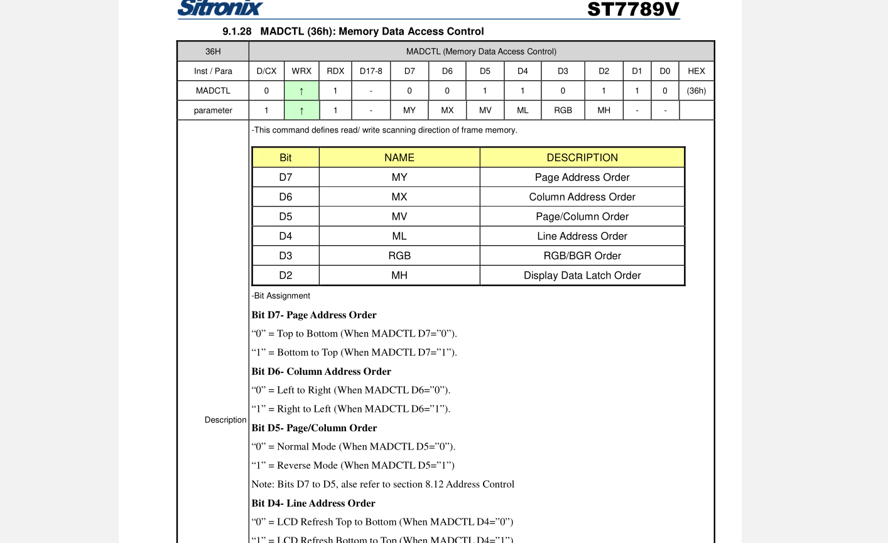

 

# TFT-ST7789 方向调整

显示方向调整的说明:

和方向调节相关的寄存器地址为 0x36

主要调节的是高三位

Bit D7

    0：页显示从顶部往底部
    1：页显示从底部往顶部

Bit D6

    0：纵向显示从左往右
    1：纵向显示从右往左

Bit D5

    0：正常显示
    1：翻转显示

操作的时候就是先写寄存器地址然后写寄存器值：

    LCD_Write_Cmd(0x36); // 屏幕显示方向设置
    LCD_Write_Data(0x60);
    
    1
    2

调整后

D0,05,09,09,08,14,28,33,3F,07,13,14,28,30;D0,05,09,09,08,03,24,32,32,3B,14,13,28,2F

# ST7789V驱动

~~~ c
/******************************************************************************

函数说明：LCD初始化函数

入口数据：无

返回值：  无

******************************************************************************/

void ST7789Lcd_Init(void)

{

ST7789_GPIO_Config();

SPI3_Init();

SPI3_SetSpeed(SPI_BaudRatePrescaler_2);

SPI3_ReadWriteByte(0xff);

OLED_RST_Set();

delay_ms(20);

OLED_RST_Clr();

delay_ms(20);

OLED_RST_Set();

delay_ms(120);

//************************************************

ST7789_WR_REG(0x3A);        //65k mode

ST7789_WR_DATA(0x05);

ST7789_WR_REG(0xC5); //VCOM

ST7789_WR_DATA(0x1A);

ST7789_WR_REG(0x36);                 // 屏幕显示方向设置

ST7789_WR_DATA(0xA0);

//-------------ST7789V Frame rate setting-----------//

ST7789_WR_REG(0xb2);

ST7789_WR_DATA(0x05);

ST7789_WR_DATA(0x05);

ST7789_WR_DATA(0x00);

ST7789_WR_DATA(0x33);

ST7789_WR_DATA(0x33);

ST7789_WR_REG(0xb7);

ST7789_WR_DATA(0x35);

//--------------ST7789V Power setting---------------//

ST7789_WR_REG(0xBB);//VCOM

ST7789_WR_DATA(0x3F);

ST7789_WR_REG(0xC0); //Power control

ST7789_WR_DATA(0x2c);

ST7789_WR_REG(0xC2);

ST7789_WR_DATA(0x01);

ST7789_WR_REG(0xC3);

ST7789_WR_DATA(0x0F);//0D        gvdd

ST7789_WR_REG(0xC4);

ST7789_WR_DATA(0x20);

ST7789_WR_REG(0xC6);

ST7789_WR_DATA(0X11);//0x0F

ST7789_WR_REG(0xd0);

ST7789_WR_DATA(0xa4);

ST7789_WR_DATA(0xa1);

ST7789_WR_REG(0xE8);

ST7789_WR_DATA(0x03);

ST7789_WR_REG(0xE9);

ST7789_WR_DATA(0x09);

ST7789_WR_DATA(0x09);

ST7789_WR_DATA(0x08);

//---------------ST7789V gamma setting-------------//

ST7789_WR_REG(0xE0); //Set Gamma

ST7789_WR_DATA(0xD0);

ST7789_WR_DATA(0x05);

ST7789_WR_DATA(0x09);

ST7789_WR_DATA(0x09);

ST7789_WR_DATA(0x08);

ST7789_WR_DATA(0x14);

ST7789_WR_DATA(0x28);

ST7789_WR_DATA(0x33);

ST7789_WR_DATA(0x3F);

ST7789_WR_DATA(0x07);

ST7789_WR_DATA(0x13);

ST7789_WR_DATA(0x14);

ST7789_WR_DATA(0x28);

ST7789_WR_DATA(0x30);

ST7789_WR_REG(0XE1); //Set Gamma

ST7789_WR_DATA(0xD0);

ST7789_WR_DATA(0x05);

ST7789_WR_DATA(0x09);

ST7789_WR_DATA(0x09);

ST7789_WR_DATA(0x08);

ST7789_WR_DATA(0x03);

ST7789_WR_DATA(0x24);

ST7789_WR_DATA(0x32);

ST7789_WR_DATA(0x32);

ST7789_WR_DATA(0x3B);

ST7789_WR_DATA(0x14);

ST7789_WR_DATA(0x13);

ST7789_WR_DATA(0x28);

ST7789_WR_DATA(0x2F);

ST7789_WR_REG(0x21); //反显

ST7789_WR_REG(0x11);

delay_ms(120);      //Delay 120ms

LCD_Clear(BLACK);                        /*先手动清屏再显示，防止花屏显示*/

ST7789_WR_REG(0x29);         //开启显示

}

/******************************************************************************

函数说明：LCD写入数据

入口数据：dat 写入的数据

返回值：  无

******************************************************************************/

void ST7789_WR_DATA(u8 dat)

{

OLED_CS_Clr();

OLED_DC_Set();//写数据

SPI3_ReadWriteByte(dat);

OLED_CS_Set();

}

void ST7789_WR_MDATA(u16 dat)

{

OLED_CS_Clr();

OLED_DC_Set();//写数据

SPI3_ReadWriteByte(dat>>8);

SPI3_ReadWriteByte(dat);

OLED_CS_Set();

}

void LCD_Address_Set(u16 x1,u16 y1,u16 x2,u16 y2)

{

ST7789_WR_REG(0x2a);//列地址设置

ST7789_WR_MDATA(x1);

ST7789_WR_MDATA(x2);

ST7789_WR_REG(0x2b);//行地址设置

ST7789_WR_MDATA(y1);

ST7789_WR_MDATA(y2);

ST7789_WR_REG(0x2c);//储存器写

}

void LCD_Clear(u16 Color)

{

u16 i,j;

LCD_Address_Set(0,0,320,240);

for(i=0;i<240;i++)

{

for (j=0;j<320;j++)

{

ST7789_WR_MDATA(Color);

}

}

}

~~~

参考:

https://blog.csdn.net/qq_45396672/article/details/123759934

https://blog.csdn.net/weixin_39721370/article/details/111800429
