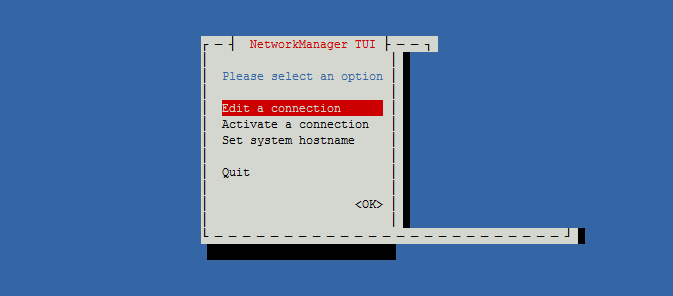

linux的网络管比较繁琐和难用，特别是在终端操作界面下，很难有让人满意的网络管理，本文将对目前存在的网络管理工具进行一定的总结。  
linux中的网络管理工具有 dhcpd,network,NetworkManager,Systemd-networkd,


# 手动管理
涉及的工具主要有：  
ifconfig 或者 ip  

网卡命名方式

lo：本地回环用于本机客户端访问本机服务器程序

ppp#：点对点

eth#：以太网网卡

RHEL5.0中/etc/modprobe.conf：根据alias定义网卡名称

RHEL6.0中/etc/udev/rules.d/70-persistent-net.rules：中根据MAC地址定义网卡名称（udev文件是Linux2.6内核的重大改变；在2.4内核时/dev目录中提供了大量的不同设备文件的访问入口而在2.6内核中缩减了/dev下大量的代码因为引入了udev机制可以自动根据内核识别到的硬件信息自动创建对应的设备文件并给一个特定的名称）


## 使用 ifconfig 管理
安装工具包
```bash
sudo apt install net-tools
```

相关命令
```bash
ifconfig                           # 显示所有网卡和接口信息
ifconfig -a                        # 显示所有网卡（包括开机没启动的）信息
ifconfig eth0                      # 指定设备显示信息
ifconfig eth0 up                   # 激活网卡
ifconfig eth0 down                 # 关闭网卡
ifconfig eth0 192.168.120.56       # 给网卡配置 IP 地址
ifconfig eth0 10.0.0.8 netmask 255.255.255.0 up     # 配置 IP 并启动
ifconfig eth0 hw ether 00:aa:bb:cc:dd:ee            # 修改 MAC 地址
```

## 使用 ip 进行管理
安装工具包  
```bash
sudo apt install iproute2
```

相关命令
```bash
ip a                               # 显示所有网络地址，同 ip address
ip a show eth1                     # 显示网卡 IP 地址
ip a add 172.16.1.23/24 dev eth1   # 添加网卡 IP 地址
ip a del 172.16.1.23/24 dev eth1   # 删除网卡 IP 地址
ip link show dev eth0              # 显示网卡设备属性
ip link set eth1 up                # 激活网卡
ip link set eth1 down              # 关闭网卡
ip link set eth1 address {mac}     # 修改 MAC 地址
ip neighbour                       # 查看 ARP 缓存
ip route                           # 查看路由表
ip route add 10.1.0.0/24 via 10.0.0.253 dev eth0    # 添加静态路由
ip route del 10.1.0.0/24           # 删除静态路由
```

## dhcp ip 获取
使用工具 udhcpc,dhcpc
软件安装：
```bash
sudo apt install dhcpc
sudo apt install udhcpc
```
获取 dhcp ip 地址：
```bash
udhcpc -b -i wlan0 -q                                       #请求自动分配IP地址,-b:后台(back) –i:指定接口 –q:获得续约后退出,如果想尽在前台运行,则去掉-b,加上-f 不用不加,会自动分配
```

## DNS配置文件：/etc/resolv.conf
``` bash
cat /etc/resolv.conf

nameserver 127.0.0.1
nameserver 127.0.0.1
```

## 定义主机映像文件：/etc/hosts


## 无线网络管理
需要的软件 wpa_supplicant

软件包安装
```bash
sudo apt-get install wpasupplicant
```

配置：  
无线网卡的配置文件在  
/etc/wpa_supplicant.conf  
或  
/etc/wpa_supplicant/wpa_supplicant.conf  

无线网络连接配置：
``` bash
ctrl_interface=/var/run/wpa_supplicant
# update_config=1
network={
ssid="XXXX"
psk="XXX"
}
```

手动启动单个无线网卡的配置命令
```bash
wpa_supplicant -D nl80211 -i wlan0 -c /etc/wpa_supplicant.conf -B
# 或者
wpa_supplicant -i wlan0 -c /etc/wpa_supplicant.conf -B
```
-D nl80211：表示驱动类型名称为nl80211

-i wlan0：表示网络接口名称为wlan0

-c /etc/wpa_supplicant.conf：表示配置文件为wpa_supplicant.conf

-B：表示将守护进程wpa_supplicant 挂到后台运行

wpa_supplicant 命令行管理
```bash
wpa_cli -i wlan0 scan         　                            #搜索附件wifi热点
wpa_cli -i wlan0 scan_result 　                             #显示搜索wifi热点
wpa_cli -i wlan0 status                                     #当前WPA/EAPOL/EAP通讯状态
wpa_cli -i wlan0 ping                                       #pings wpa_supplicant
wpa_cli -i wlan0 status                                     #查询网卡状态
wpa_cli -i wlan0 scan                                       #搜索附近网络功能  no/ok
wpa_cli -i wlan0 scan_result                                #搜索附近网络,并列出结果
wpa_cli -i wlan0 list_network                               #查看当前连接的是哪个网络
wpa_cli -i wlan0 add_network                                #获取一个存储wifi结构的id,假设为1
wpa_cli -i wlan0 set_network 1 ssid '"HO4428"'              #设置ID为1的热点SSID
wpa_cli -i wlan0 set_network 1 psk '"442701102"'            #设置ID为1的热点的密码
wpa_cli -i wlan0 set_network 1 key_mgmt WPA2-PSK-CCMP       #设置加密方式,可以不加
wpa_cli -i wlan0 set_network 1 priority 2                   #设置当前网络优先级,默认为2,可以不加
wpa_cli -i wlan0 set_network 1 scan_ssid 1                  #设置ssid默认为1即可  ,可以不加
wpa_cli -i wlan0 enable_network 1                           #启动连接ID为1的网络
wpa_cli -i wlan0 select_network 1                           #选择网络0(这样做的好处在于,可以取消先前的其它网络连接)
wpa_cli -i wlan0 save_config                                #保存刚刚填写的wifi帐号,写入配置文件
wpa_cli -i wlan0 reconnect                                  # 重新链接

```

## linux 中的网卡设备命令
在 systemd 中，systemd在启动时会主动将传统的网卡名称重命名为可预测网卡名称。这有时会带来比较烦人的问题。  
如果希望使用像 eth0 这样的传统接口命名,可以通过下面方法禁用可预测网络接口名: 

```bash
# ln -s /dev/null /etc/udev/rules.d/80-net-setup-link.rules
```
相关命令

```bash
udevadm info -a -p /sys/class/net/wlan0 # 查看设备的信息


```


# systemd-networkd 进行自动管理

systemd-networkd 是一个管理网络配置的系统守护进程。它会在网络设备出现时检测和配置它们；它还可以创建虚拟网络设备。这个服务非常适合于为 systemd-nspawn 管理的容器或者虚拟机创建复杂的网络配置。如果只是简单网络的配置，它也同样能胜任。 

systemd-networkd是systemd 的其中一部分 ，负责 systemd 生态中的网络配置部分。使用 systemd-networkd，你可以为网络设备配置基础的 DHCP/静态 IP 网络。它还可以配置虚拟网络功能，例如网桥、隧道和 VLAN等。systemd-networkd 与wpa_supplicant 服务配合可以支持配置WIFI无线适配器。

注意现在的桌面Linux环境通常是用networkmanager来进行网络管理的，networkmanager和systemd-networkd 是冲突的，他们之间有一定的原则来管控相互之间的冲突，但最简单的方式还是只用其中一种，如果你用了systemd-networkd那么把networkmanager给先关闭了。一般来说systemd-networkd 更适合于网络配置相对稳定的服务器环境。而对于桌面Linux环境，往往会有无线接口，提供了GUI接口的NetworkManager使用起来会比较方便。

使用systemd-networkd之间，需要先关闭其他网络管理器，如NetworkManager, netctl，dhcp daemon，dhcpcd, dhclient等

networkd内置了dhcp client。
但如果需要更新DNS, 无线网络等
那么你还需要更新resolv.conf，启动systemd-resolved

networkd还是为服务器的静态网络环境而设计，所以配置全部依靠配置文件，而且没有提供任何查询接口。桌面应用还是NetworkManager较为简便。但相对于同样是命令行only的netctl，还是networkd较为直接。

对于有线连接，包括usb网卡，创建配置文件：

```bash
$ cat /etc/systemd/network/wired.network 
[Match]
Name=en*
[Network]
DHCP=yes
```


启动networkd：
```bash
$ systemctl enable systemd-networkd
$ systemctl start systemd-networkd
```

networkd内置了dhcp client。如果需要更新resolv.conf，则需要启动resolved：
```bash
$ systemctl enable systemd-resolved
$ systemctl start systemd-resolved
$ ln -sf /run/systemd/network/resolv.conf /etc/resolv.conf
```

networkd对热插拔支持很好，不像netctl-ifplugd在拔出usb网卡时总是netlink出错退出。wifi的配置差不多：

```bash
$ cat /etc/systemd/network/wifi.network 
[Match]
Name=wlp2s0
[Network]
DHCP=yes
```

但需要wpa-supplicant处理认证：
```bash
$ cat /etc/wpa_supplicant/wpa_supplicant-wlp2s0.conf 
ctrl_interface=DIR=/var/run/wpa_supplicant GROUP=wheel

network={
        ssid="<SSID>"
        psk="<password>"
}
$ systemctl enable wpa_supplicant@wlp2s0
$ systemctl start wpa_supplicant@wlp2s0
```

用wpa-supplicant扫描SSID：
```bash
$ wpa_cli scan && wpa_cli scan_results
```

参考：  

[systemd-networkd](https://wiki.archlinux.org/title/Systemd-networkd)


# NetworkManager  进行自动管理

安装
```
sudo apt-get install network-manager
sudo apt-get install network-manager-tui

```


RHEL6新增加的网络管理工具，可用检测网络、自动连接网络的程序。无论是无线还是有线连接，它都可以令您轻松管理。对于无线网络,网络管理器可以自动切换到最可靠的无线网络。利用网络管理器的程序可以自由切换在线和离线模式。网络管理器可以优先选择有线网络，支持 VPN。网络管理器最初由 Redhat 公司开发，现在由 GNOME 管理。

NetworkManager 新版本增强设备以及协议的支持，NetworkManager 最新版有一个全新的漂亮的客户端界面nmtui。”nmtui” 是 networkmanager 的一个图形化前端。在没有X Window 的情况下可以用它来方便地配置及管理网络。启动nmtui：

```bash
[root@localhost ~]# nmtui
```



NetworkManager 最新版的最大特征： 命令行工具命令，一个NetworkManager的命令行接口。NetworkManager的CLI工具nmcli，使用nmcli用户可以查询网络连接的状态，也可以用来管理。优点：原始；语法相对简单；在CLI中使用NetworkManager很容易掌握。

nmcli的基本配置选项:
```bash
nmcli con show
  #获得一份UUID列表

nmcli dev
  #查看网络设备及其状态

nmcli r wifi off
  #关闭WiFi

nmcli con show
  #获得一份UUID列表

nmcli dev
  #查看网络设备及其状态

nmcli r wifi off
  #关闭WiFi
```

NetworkManager守护进程启动后，会自动连接到已经配置的系统连接。用户连接或未配置的连接需要通过nmcli或桌面工具进行配置和连接。

开机启用 NetworkManager
```bash
chkconfig NetworkManager on

或（CentOS7）

systemctl enable NetworkManager

chkconfig NetworkManager on

或（CentOS7）

systemctl enable NetworkManager
```

立即启动 NetworkManager
```bash
service NetworkMnager start

或（CentOS7）

systemctl start NetworkManager

service NetworkMnager start

或（CentOS7）

systemctl start NetworkManager
```

配置 Network Manager 以忽略某些网络设备

临时 unmanaged

如果只是临时测试，那么可以通过 nmcli 命令去设置某个网络设备为 unmanaged 状态。但是只要重启 NetworkManager 服务或者重启了主机，网络接口又会恢复为 managed 状态。
```bash
nmcli device set xxx managed no
```
永久 unmanaged

要想永久的排除 NetworkManager 管理某些网络设备，则需要通过配置文件去设置。

启用插件

在 /etc/NetworkManager/NetworkManager.conf 配置文件的[main] 层级下启用插件 keyfile。
```bash

[main]plugins=keyfile
```
创建 /etc/NetworkManager/conf.d/99-unmanaged-devices.conf 配置文件，包含以下内容：
```bash
[keyfile]
unmanaged-devices=interface-name:eth*,except:interface-name:eth0;interface-name:docker0;interface-name:flannel*;interface-name:flannel*;interface-name:cni0;mac:66:77:88:99:00:aa
```
以分号隔开；
可以使用通配符来匹配接口；
interface-name:eth*,except:interface-name:eth0; 表示：除了 eth0，其他以 eth 开头的接口全部 unmanaged；
可以通过 mac 地址来排除接口；

重新加载配置

systemctl reload NetworkManager


参考：

[详解：Linux网络管理基础知识](https://mp.weixin.qq.com/s/MeFSkqe2DiinUqzooeVZ4w)
[配置 Network Manager 以忽略某些网络设备](https://blog.csdn.net/hongxiaolu/article/details/113711767)


# network 进行自动管理

Linux Network 非常复杂，其本身的机制非常复杂，每一种 Linux 发行版的网络也有差别，管理工具也纷繁复杂。这里先简单的描述在 Centos7 和 Ubuntu20.04 下如何配置网络，后简单的描述一下 network 是怎样工作的.

network 和 systemd-networkd 的工作方式差不多，都是通过配置文件来决定工作任务，比较适合静态网络。

- Centos6 使用 network.service
- Centos7 network.service 和 NetworkManager.service 并存
- Centos8 之后只使用 NetworkManager.service
- Ubuntu 使用 netplan 前端，NetworkManager/networkd 后端

## 配置文件
/etc/sysconfig/network-scripts目录下的ifcfg-*文件

（1）文件 /etc/sysconfig/network  
这个/etc/sysconfig/network文件是定义hostname和是否利用网络的不接触网络设备的对系统全体定义的文件。  
设定形式：设定值=值  
/etc/sysconfig/network的设定项目如下：  
```bash
NETWORKING 是否利用网络                                     
GATEWAY 默认网关
IPGATEWAYDEV 默认网关的接口名
HOSTNAME 主机名
DOMAIN 域名
```

（2）文件 /etc/sysconfig/network-scripts/ifcfg-eth0  
/etc/sysconfig/network-scripts在这个目录下面，存放的是网络接口（网卡）的制御脚本文件（控制文件），ifcfg- eth0是默认的第一个网络接口，如果机器中有多个网络接口，那么名字就将依此类推ifcfg-eth1,ifcfg-eth2,ifcfg- eth3......（这里面的文件是相当重要的，涉及到网络能否正常工作）  
设定形式：设定值=值  
设定项目项目如下：  
```bash
DEVICE 接口名（设备,网卡）
BOOTPROTO IP的配置方法（static:固定IP， dhcpHCP， none:手动）       
HWADDR MAC地址
ONBOOT 系统启动的时候网络接口是否有效（yes/no）
TYPE 网络类型（通常是Ethemet）
NETMASK 网络掩码
IPADDR IP地址
IPV6INIT IPV6是否有效（yes/no）
GATEWAY 默认网关IP地址
```

这里有一个例子：
```bash
[root@linux ~]# cat /etc/sysconfig/network-scripts/ifcfg-eth0
DEVICE=eth0
BOOTPROTO=static
BROADCAST=192.168.1.255
HWADDR=00:0C:2x:6x:0x:xx
IPADDR=192.168.1.23
NETMASK=255.255.255.0
NETWORK=192.168.1.0
ONBOOT=yes
TYPE=Ethernet
```

基本命令：

```bash
service network restart 重启 network
```


# networking 进行自动管理

networking.service"是Debian操作系统中的一个服务，它负责启动和停止系统的网络配置。具体而言，该服务会在系统启动时读取并应用配置文件，例如/etc/network/interfaces，以设置网络接口、IP地址、路由表、DNS服务器等。此外，该服务还可以根据需要重新加载网络配置，以便在运行时更改网络设置。

networking服务：系统启动、系统关闭和网线插拔时起作用。

在Debian中，您可以使用systemctl命令来管理网络服务，例如启动、停止、重新加载和重启"networking.service"。例如，要启动"networking.service"，您可以使用以下命令：

```bash
sudo systemctl start networking.service
```

配置文件：
/etc/network/interfaces
```bash
#interfaces(5) file used by ifup(8) and ifdown(8)
auto lo
iface lo inet loopback

auto enp0s3 // 在系统启动，会自动用ifup/ifdown去控制写了auto […]的接口
allow-hotplug enp0s3 // 在网线插拔中，会自用调用ifup/ifdown去控制写了allow-hotplug […]的接口
iface enp0s3 inet dhcp // 1.dhcp设置，自动获取ip

auto enp0s8
allow-hotplug enp0s8
iface enp0s8 inet static // 2.静态ip设置
    address 192.168.56.111
    #gateway 192.168.56.2 // 如果和dhcp的gateway冲突，就把这行删除
    dns-nameserver 8.8.8.8 // 3.dns设置，生效后在/etc/resolv.conf会追加
    dns-nameserver 192.168.56.254

```

使用DHCP自动配置接口
```bash
auto eth0
allow-hotplug eth0
iface eth0 inet dhcp
```

如果是DHCPv6的话，使用iface来调整：
```bash
iface eth0 inet6 dhcp
```

另外， IPv6可以通过无状态地址（stateless address）或是 SLAAC来自动配置。
```bash
iface eth0 inet6 auto
```

手动配置网口，静态ip
```bash
iface eth0 inet6 static
    address 2001:db8::c0ca:1eaf
    netmask 64
    gateway 2001:db8::1ead:ed:beef
```

启动网口但不配置IP地址
```bash
iface eth0 inet manual
    pre-up ifconfig $IFACE up
    post-down ifconfig $IFACE down
```


参考:

[linux – 在/ etc / network / interfaces中永久更改Mac地址](https://www.qyyshop.com/info/958085.html)  
[ubuntu mac地址永久修改](https://zhuanlan.zhihu.com/p/589736704)
[网卡MAC地址自动设置](https://blog.csdn.net/xiaoyuefan2012/article/details/109504973)
[Linux 网络接口配置/etc/network/interfaces](https://blog.csdn.net/u011077672/article/details/71123319)
[NetworkConfiguration](https://wiki.debian.org/NetworkConfiguration)
[Networking网络配置和Bridge配置](https://www.jianshu.com/p/339d1b6f1089)
[Linux命令行配置网络](https://blog.csdn.net/jacktree365/article/details/84072092?spm=1001.2101.3001.6661.1&utm_medium=distribute.pc_relevant_t0.none-task-blog-2%7Edefault%7EBlogCommendFromBaidu%7ERate-1-84072092-blog-81784343.235%5Ev38%5Epc_relevant_sort_base1&depth_1-utm_source=distribute.pc_relevant_t0.none-task-blog-2%7Edefault%7EBlogCommendFromBaidu%7ERate-1-84072092-blog-81784343.235%5Ev38%5Epc_relevant_sort_base1&utm_relevant_index=1)
[archlinux 网络配置](https://wiki.archlinuxcn.org/wiki/%E7%BD%91%E7%BB%9C%E9%85%8D%E7%BD%AE)
[Netplan——新一代网络配置工具](https://www.jianshu.com/p/174656635e74)
[Linux网络管理基础知识 ](https://mp.weixin.qq.com/s/MeFSkqe2DiinUqzooeVZ4w)
[netplan, NetworkManager, systemd-networkd简介](https://blog.csdn.net/meihualing/article/details/130300331)
[Netwrok Manager 使用介绍](https://zhuanlan.zhihu.com/p/657549461)
[systemd-networkd替换 Network Manager](https://zhuanlan.zhihu.com/p/509497151)
[Network Manager on Linux](https://zhuanlan.zhihu.com/p/585896754)
[systemd-networkd](https://wiki.archlinuxcn.org/wiki/Systemd-networkd)
[Wpa supplicant](https://wiki.gentoo.org/wiki/Wpa_supplicant/zh-cn)
[archlinux wpa_supplicant](https://wiki.archlinux.org/title/Wpa_supplicant)
[linux 使用 wpa_supplicant 手动配置链接 wifi](https://www.cnblogs.com/hokori/p/14168584.html)
[linux网卡命名规则与修改方法](http://lihuaxi.xjx100.cn/news/1378470.html?action=onClick)
[Debian无线网卡为何是wlan1不是wlan0](https://blog.csdn.net/weixin_33726313/article/details/91719023)
[关于树莓派4挂载 Debian8 基础的 kali linux 2020.4 系统修改默认内置无线网卡名称的问题](https://blog.csdn.net/ITSmallwhite_/article/details/113883418)
[[Debian]网卡重命名](https://www.cnblogs.com/conpi/p/17050731.html)
[Debian改变网卡名称 1](https://blog.csdn.net/eidolon_foot/article/details/121018764)
[Debian更改网口名称 2](https://blog.csdn.net/shouqw/article/details/130625577)
[armbian巧借nmtui管理网络连接](http://lihuaxi.xjx100.cn/news/1440756.html?action=onClick)
[Debian系列网卡配置详解](https://www.cnblogs.com/hi-eric/p/16300883.html)
[debian使用Systemd-Networkd接管网络配置](https://blog.csdn.net/seaship/article/details/89456781)
[使用wpa_supplicant连接无线](https://zhuanlan.zhihu.com/p/642605057)


